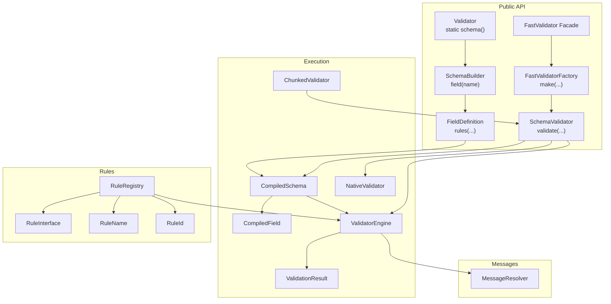
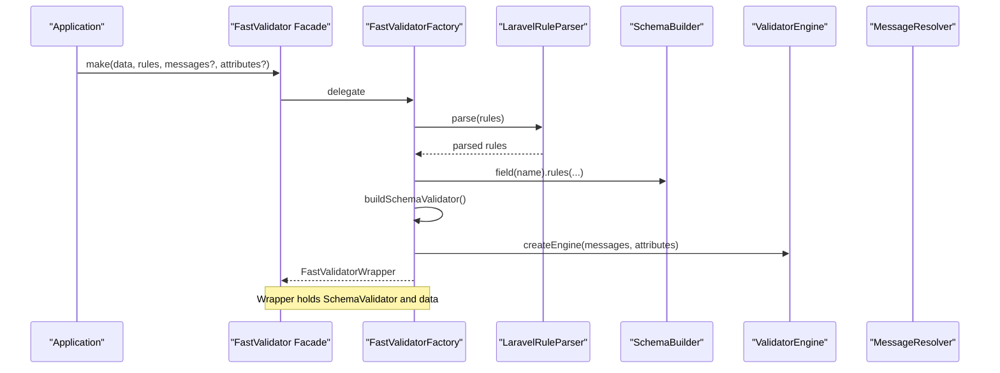

# API Reference

<cite>
**Referenced Files in This Document**
- [Validator.php](file://src/Validator.php)
- [SchemaValidator.php](file://src/SchemaValidator.php)
- [SchemaBuilder.php](file://src/Schema/SchemaBuilder.php)
- [FieldDefinition.php](file://src/Schema/FieldDefinition.php)
- [CompiledSchema.php](file://src/Execution/CompiledSchema.php)
- [CompiledField.php](file://src/Execution/CompiledField.php)
- [ValidatorEngine.php](file://src/Execution/ValidatorEngine.php)
- [ValidationResult.php](file://src/Execution/ValidationResult.php)
- [NativeValidator.php](file://src/Execution/NativeValidator.php)
- [ChunkedValidator.php](file://src/Execution/ChunkedValidator.php)
- [RuleRegistry.php](file://src/Rules/RuleRegistry.php)
- [RuleInterface.php](file://src/Rules/RuleInterface.php)
- [RuleName.php](file://src/Rules/RuleName.php)
- [RuleId.php](file://src/Rules/RuleId.php)
- [MessageResolver.php](file://src/Messages/MessageResolver.php)
- [FastValidatorFactory.php](file://src/Laravel/FastValidatorFactory.php)
- [FastValidator.php](file://src/Laravel/Facades/FastValidator.php)
</cite>

## Table of Contents
1. [Introduction](#introduction)
2. [Project Structure](#project-structure)
3. [Core Components](#core-components)
4. [Architecture Overview](#architecture-overview)
5. [Detailed Component Analysis](#detailed-component-analysis)
6. [Dependency Analysis](#dependency-analysis)
7. [Performance Considerations](#performance-considerations)
8. [Troubleshooting Guide](#troubleshooting-guide)
9. [Conclusion](#conclusion)
10. [Appendices](#appendices)

## Introduction
This API reference documents the public interfaces of the vi/validation library, focusing on:
- Validator facade for quick schema creation
- SchemaValidator for validation execution
- SchemaBuilder and FieldDefinition for declarative schema construction
- RuleRegistry for rule registration and resolution
- FastValidatorFactory and FastValidator facade for Laravel integration
- Supporting execution and messaging components

It covers method signatures, parameters, return types, exceptions, usage patterns, and migration notes for deprecated features.

## Project Structure
The library is organized around a fluent schema builder, compiled execution model, and extensible rule registry. Laravel integration is provided via a factory and facade.

**Diagram sources**
- [Validator.php](file://src/Validator.php#L9-L15)
- [SchemaBuilder.php](file://src/Schema/SchemaBuilder.php#L9-L35)
- [FieldDefinition.php](file://src/Schema/FieldDefinition.php#L9-L657)
- [CompiledSchema.php](file://src/Execution/CompiledSchema.php#L9-L67)
- [CompiledField.php](file://src/Execution/CompiledField.php#L10-L176)
- [ValidatorEngine.php](file://src/Execution/ValidatorEngine.php#L11-L176)
- [ValidationResult.php](file://src/Execution/ValidationResult.php#L9-L141)
- [NativeValidator.php](file://src/Execution/NativeValidator.php#L12-L38)
- [ChunkedValidator.php](file://src/Execution/ChunkedValidator.php#L16-L153)
- [RuleRegistry.php](file://src/Rules/RuleRegistry.php#L14-L301)
- [RuleInterface.php](file://src/Rules/RuleInterface.php#L9-L15)
- [RuleName.php](file://src/Rules/RuleName.php#L9-L17)
- [RuleId.php](file://src/Rules/RuleId.php#L10-L113)
- [MessageResolver.php](file://src/Messages/MessageResolver.php#L7-L124)
- [FastValidatorFactory.php](file://src/Laravel/FastValidatorFactory.php#L19-L206)
- [FastValidator.php](file://src/Laravel/Facades/FastValidator.php#L16-L22)

**Section sources**
- [Validator.php](file://src/Validator.php#L9-L15)
- [SchemaBuilder.php](file://src/Schema/SchemaBuilder.php#L9-L35)
- [FieldDefinition.php](file://src/Schema/FieldDefinition.php#L9-L657)
- [CompiledSchema.php](file://src/Execution/CompiledSchema.php#L9-L67)
- [CompiledField.php](file://src/Execution/CompiledField.php#L10-L176)
- [ValidatorEngine.php](file://src/Execution/ValidatorEngine.php#L11-L176)
- [ValidationResult.php](file://src/Execution/ValidationResult.php#L9-L141)
- [NativeValidator.php](file://src/Execution/NativeValidator.php#L12-L38)
- [ChunkedValidator.php](file://src/Execution/ChunkedValidator.php#L16-L153)
- [RuleRegistry.php](file://src/Rules/RuleRegistry.php#L14-L301)
- [RuleInterface.php](file://src/Rules/RuleInterface.php#L9-L15)
- [RuleName.php](file://src/Rules/RuleName.php#L9-L17)
- [RuleId.php](file://src/Rules/RuleId.php#L10-L113)
- [MessageResolver.php](file://src/Messages/MessageResolver.php#L7-L124)
- [FastValidatorFactory.php](file://src/Laravel/FastValidatorFactory.php#L19-L206)
- [FastValidator.php](file://src/Laravel/Facades/FastValidator.php#L16-L22)

## Core Components
This section documents the primary public classes and their methods.

- Validator
  - Purpose: Provides a static entry point to create a SchemaBuilder.
  - Method: schema() → SchemaBuilder
  - Notes: Fluent schema building begins here.

- SchemaBuilder
  - Purpose: Collects field definitions and compiles them into a CompiledSchema.
  - Methods:
    - field(name): FieldDefinition
    - setRulesArray(rules): void
    - compile(): CompiledSchema

- FieldDefinition
  - Purpose: Fluent DSL for defining per-field rules and behaviors.
  - Methods (selected):
    - required(), nullable(), bail(), sometimes()
    - string(), integer(), decimal(min, max?), numeric(), boolean(), array(), list(), distinct()
    - date(format?), json(), alpha(), alphaNum(), min(value), max(value), between(min, max)
    - gt(field), gte(field), lt(field), lte(field)
    - email(), url(), uuid(), ip(version?), regex(pattern), size(value)
    - exists(table, column?, constraints?), unique(table, column?, ignoreId?, idColumn?, extraConstraints?)
    - in(values...), notIn(values...), confirmed(), same(field), different(field)
    - file(), image(), mimes(types...), mimetypes(types...), extensions(exts...), maxFileSize(kb), minFileSize(kb), dimensions(constraints)
    - rules(RuleInterface...): self
    - activeUrl(), alphaDash(), macAddress(), ulid(), country(), language(), ascii(), uppercase(), enum(enumClass), password(callback?), currentPassword(), lowercase()
    - dateFormat(format), dateEquals(date), multipleOf(value), digits(value), digitsBetween(min, max), startsWith(needles...), endsWith(needles...)
    - notRegex(pattern), doesntStartWith(needles...), doesntEndWith(needles...), timezone(), requiredArrayKeys(keys...), requiredIf(field, values), requiredIfAccepted(field), requiredUnless(field, values), requiredWith(others...), requiredWithAll(others...), requiredWithout(others...), requiredWithoutAll(others...)
    - present(), filled(), prohibitedIf(field, values), prohibitedUnless(field, values), acceptedIf(field, value), declinedIf(field, value), prohibits(fields...), missing(), missingIf(field, value), missingUnless(field, value), missingWith(others...), missingWithAll(others...), exclude(), excludeIf(field, value), excludeUnless(field, value), excludeWith(field), excludeWithout(field), when(condition, onTrue, onFalse?)
    - getName(): string
    - getRules(): list[RuleInterface]
    - field(name): self (chain to another field)
    - compile(): CompiledSchema (shortcut)
    - end(): SchemaBuilder (return to builder)

- CompiledSchema
  - Purpose: Holds compiled field rules and optional shared rules array.
  - Methods:
    - fromFieldDefinitions(fieldDefinitions, rulesArray?): CompiledSchema
    - getRulesArray(): array
    - getFields(): list[CompiledField]
    - validate(data): ValidationResult

- CompiledField
  - Purpose: Optimized per-field execution model with deduplication and ordering.
  - Methods:
    - fromFieldDefinition(definition): CompiledField
    - getName(): string
    - getRules(): list[RuleInterface]
    - isNullable(): bool
    - isBail(): bool
    - isSometimes(): bool
    - shouldExclude(context): bool
    - getValue(data): mixed

- ValidatorEngine
  - Purpose: Executes CompiledSchema against input data, collecting errors and applying bail/max errors/fail-fast policies.
  - Methods:
    - __construct(messageResolver?, failFast?, maxErrors?)
    - validate(schema, data): ValidationResult
    - setFailFast(failFast): void
    - setMaxErrors(maxErrors): void
    - setMessageResolver(resolver): void
    - setDatabaseValidator(validator): void
    - setPasswordHasher(hasher): void

- ValidationResult
  - Purpose: Encapsulates validation outcome, validated data, and error messages.
  - Methods:
    - data(): array
    - validated(): array
    - isValid(): bool
    - errors(): array
    - messages(): array
    - allMessages(): list[string]
    - firstMessage(field): ?string
    - first(): ?string
    - __toString(): string

- SchemaValidator
  - Purpose: High-level validator with convenience methods for single and batch validation.
  - Methods:
    - __construct(compiledSchema, engine?, compiler?, messageResolver?)
    - build(definition, config?, rulesArray?): SchemaValidator
    - validate(data): ValidationResult
    - validateMany(rows): list[ValidationResult]
    - stream(rows): Generator[int, ValidationResult]
    - each(rows, callback): void
    - failures(rows): Generator[int, ValidationResult]
    - firstFailure(rows): ?ValidationResult
    - allValid(rows): bool

- NativeValidator
  - Purpose: Executes a precompiled PHP closure for maximum performance.
  - Methods:
    - __construct(closure, messageResolver?)
    - validate(data): ValidationResult

- ChunkedValidator
  - Purpose: Memory-efficient processing of large datasets via chunking.
  - Methods:
    - __construct(validator)
    - validateInChunks(rows, chunkSize, onChunk): void
    - streamChunks(rows, chunkSize): Generator[int, BatchValidationResult]
    - streamFailures(rows, chunkSize?): Generator[int, ValidationResult]
    - countFailures(rows, chunkSize?): int

- RuleRegistry
  - Purpose: Registers and resolves rules by name or alias, supports built-in rule registration.
  - Methods:
    - register(class): void
    - registerMany(classes): void
    - has(name|RuleId): bool
    - get(name|RuleId): ?string
    - all(): array
    - resolve(name|RuleId): RuleInterface
    - registerBuiltInRules(): void

- RuleInterface
  - Purpose: Contract for individual rules.
  - Methods:
    - validate(value, field, context): ?array{rule: string, message?: string}

- RuleName
  - Purpose: Attribute to annotate rule classes with canonical name and aliases.
  - Fields:
    - name: string|RuleId
    - aliases: array[string]

- RuleId
  - Purpose: Enumerated list of built-in rule identifiers.

- MessageResolver
  - Purpose: Resolves localized messages for rules, supports custom messages and attributes.
  - Methods:
    - __construct(translator?)
    - resolve(field, rule, params?): string
    - setCustomMessages(messages): void
    - setCustomAttributes(attributes): void
    - getTranslator(): TranslatorInterface

- FastValidatorFactory
  - Purpose: Laravel integration factory to build SchemaValidator instances from Laravel-style rules arrays.
  - Methods:
    - __construct(config?, registry?)
    - make(data, rules, messages?, attributes?): FastValidatorWrapper
    - getCache(): ?SchemaCacheInterface
    - buildSchemaValidator(rules, messages?, attributes?): SchemaValidator
    - createEngine(messages?, attributes?): ValidatorEngine
    - initializeCache(): void
    - initializeEngine(): void
    - generateCacheKey(rules): string
    - serializeRules(value): string

- FastValidator (Facade)
  - Purpose: Laravel facade exposing FastValidatorFactory::make.
  - Methods:
    - make(data, rules, messages?, attributes?): FastValidatorWrapper

**Section sources**
- [Validator.php](file://src/Validator.php#L9-L15)
- [SchemaBuilder.php](file://src/Schema/SchemaBuilder.php#L9-L35)
- [FieldDefinition.php](file://src/Schema/FieldDefinition.php#L9-L657)
- [CompiledSchema.php](file://src/Execution/CompiledSchema.php#L9-L67)
- [CompiledField.php](file://src/Execution/CompiledField.php#L10-L176)
- [ValidatorEngine.php](file://src/Execution/ValidatorEngine.php#L11-L176)
- [ValidationResult.php](file://src/Execution/ValidationResult.php#L9-L141)
- [SchemaValidator.php](file://src/SchemaValidator.php#L13-L204)
- [NativeValidator.php](file://src/Execution/NativeValidator.php#L12-L38)
- [ChunkedValidator.php](file://src/Execution/ChunkedValidator.php#L16-L153)
- [RuleRegistry.php](file://src/Rules/RuleRegistry.php#L14-L301)
- [RuleInterface.php](file://src/Rules/RuleInterface.php#L9-L15)
- [RuleName.php](file://src/Rules/RuleName.php#L9-L17)
- [RuleId.php](file://src/Rules/RuleId.php#L10-L113)
- [MessageResolver.php](file://src/Messages/MessageResolver.php#L7-L124)
- [FastValidatorFactory.php](file://src/Laravel/FastValidatorFactory.php#L19-L206)
- [FastValidator.php](file://src/Laravel/Facades/FastValidator.php#L16-L22)

## Architecture Overview
High-level flow from Laravel rules to validation execution.

**Diagram sources**
- [FastValidator.php](file://src/Laravel/Facades/FastValidator.php#L16-L22)
- [FastValidatorFactory.php](file://src/Laravel/FastValidatorFactory.php#L51-L109)
- [SchemaBuilder.php](file://src/Schema/SchemaBuilder.php#L14-L21)
- [ValidatorEngine.php](file://src/Execution/ValidatorEngine.php#L23-L31)
- [MessageResolver.php](file://src/Messages/MessageResolver.php#L17-L68)

## Detailed Component Analysis

### Validator facade
- Static entry point to construct a SchemaBuilder.
- Signature: schema(): SchemaBuilder
- Usage: Start fluent schema definition.

**Section sources**
- [Validator.php](file://src/Validator.php#L9-L15)

### SchemaBuilder API
- Responsibilities: Aggregate field definitions, compile to CompiledSchema.
- Methods:
  - field(name): FieldDefinition
  - setRulesArray(rules): void
  - compile(): CompiledSchema

**Section sources**
- [SchemaBuilder.php](file://src/Schema/SchemaBuilder.php#L9-L35)

### FieldDefinition API
- Responsibilities: Fluent DSL for per-field rules and behaviors.
- Highlights:
  - Type and format: string(), integer(), decimal(), numeric(), boolean(), array(), list(), distinct(), json(), alpha(), alphaNum(), email(), url(), uuid(), ip(), regex(), dateFormat(), dateEquals(), timezone(), ascii(), uppercase(), lowercase(), enum().
  - Size and range: min(), max(), between(), size(), gt(), gte(), lt(), lte(), digits(), digitsBetween(), multipleOf(), in(), notIn().
  - Files/media: file(), image(), mimes(), mimetypes(), extensions(), maxFileSize(), minFileSize(), dimensions().
  - Confirmation and matching: confirmed(), same(), different().
  - Presence and requirement: required(), nullable(), sometimes(), present(), filled(), bail().
  - Conditional and exclusion: requiredIf(), requiredUnless(), requiredWith(), requiredWithAll(), requiredWithout(), requiredWithoutAll(), requiredArrayKeys(), acceptedIf(), declinedIf(), prohibitedIf(), prohibitedUnless(), when(), exclude(), excludeIf(), excludeUnless(), excludeWith(), excludeWithout(), missing(), missingIf(), missingUnless(), missingWith(), missingWithAll(), prohibits().
  - Utility: rules(...), field(name), compile(), end(), getName(), getRules().
- Notes:
  - Many methods return self for chaining.
  - Password rule accepts a callback to configure options.

**Section sources**
- [FieldDefinition.php](file://src/Schema/FieldDefinition.php#L9-L657)

### CompiledSchema and CompiledField
- CompiledSchema: Container for CompiledField list and shared rules array; exposes validate(data).
- CompiledField: Optimized execution unit with deduplication/ordering of rules, nested field access, and exclusion checks.

**Section sources**
- [CompiledSchema.php](file://src/Execution/CompiledSchema.php#L9-L67)
- [CompiledField.php](file://src/Execution/CompiledField.php#L10-L176)

### ValidatorEngine
- Responsibilities: Execute CompiledSchema against data, enforce bail, fail-fast, and max errors; integrate with MessageResolver and optional database/password validators.
- Key behaviors:
  - Implicit vs explicit rules: skips implicit rules on empty values.
  - Bail per field: stops rule evaluation upon first failure if configured.
  - Fail-fast and max errors: early termination conditions.
  - Exclusions: honors always-exclude and conditional exclude rules.
- Methods:
  - __construct(messageResolver?, failFast?, maxErrors?)
  - validate(schema, data): ValidationResult
  - setFailFast(failFast): void
  - setMaxErrors(maxErrors): void
  - setMessageResolver(resolver): void
  - setDatabaseValidator(validator): void
  - setPasswordHasher(hasher): void

**Section sources**
- [ValidatorEngine.php](file://src/Execution/ValidatorEngine.php#L11-L176)

### ValidationResult
- Responsibilities: Encapsulate validation outcome, provide accessors for raw errors, formatted messages, and validated data.
- Methods:
  - data(): array
  - validated(): array
  - isValid(): bool
  - errors(): array
  - messages(): array
  - allMessages(): list[string]
  - firstMessage(field): ?string
  - first(): ?string
  - __toString(): string

**Section sources**
- [ValidationResult.php](file://src/Execution/ValidationResult.php#L9-L141)

### SchemaValidator
- Responsibilities: High-level validator with convenience methods for single and batch validation.
- Methods:
  - __construct(compiledSchema, engine?, compiler?, messageResolver?)
  - build(definition, config?, rulesArray?): SchemaValidator
  - validate(data): ValidationResult
  - validateMany(rows): list[ValidationResult]
  - stream(rows): Generator[int, ValidationResult]
  - each(rows, callback): void
  - failures(rows): Generator[int, ValidationResult]
  - firstFailure(rows): ?ValidationResult
  - allValid(rows): bool
- Notes:
  - Supports native precompiled validator caching and fallback to ValidatorEngine.
  - Batch helpers designed for memory efficiency.

**Section sources**
- [SchemaValidator.php](file://src/SchemaValidator.php#L13-L204)

### NativeValidator
- Responsibilities: Execute precompiled PHP closure for maximum performance.
- Methods:
  - __construct(closure, messageResolver?)
  - validate(data): ValidationResult

**Section sources**
- [NativeValidator.php](file://src/Execution/NativeValidator.php#L12-L38)

### ChunkedValidator
- Responsibilities: Process very large datasets efficiently by chunking.
- Methods:
  - __construct(validator)
  - validateInChunks(rows, chunkSize, onChunk): void
  - streamChunks(rows, chunkSize): Generator[int, BatchValidationResult]
  - streamFailures(rows, chunkSize?): Generator[int, ValidationResult]
  - countFailures(rows, chunkSize?): int

**Section sources**
- [ChunkedValidator.php](file://src/Execution/ChunkedValidator.php#L16-L153)

### RuleRegistry
- Responsibilities: Register rules by class, resolve by name/alias/RuleId, prevent conflicts, and register built-in rules.
- Methods:
  - register(class): void
  - registerMany(classes): void
  - has(name|RuleId): bool
  - get(name|RuleId): ?string
  - all(): array
  - resolve(name|RuleId): RuleInterface
  - registerBuiltInRules(): void
- Exceptions:
  - InvalidArgumentException for unknown rules or missing RuleName attribute.
  - LogicException for duplicate names, aliases, or conflicting registrations.

**Section sources**
- [RuleRegistry.php](file://src/Rules/RuleRegistry.php#L14-L301)

### RuleInterface, RuleName, RuleId
- RuleInterface: validate(value, field, context): ?array{rule: string, message?: string}
- RuleName: #[Attribute] annotates rule classes with canonical name and aliases.
- RuleId: Enumerated built-in rule identifiers.

**Section sources**
- [RuleInterface.php](file://src/Rules/RuleInterface.php#L9-L15)
- [RuleName.php](file://src/Rules/RuleName.php#L9-L17)
- [RuleId.php](file://src/Rules/RuleId.php#L10-L113)

### MessageResolver
- Responsibilities: Resolve messages from translator, support custom messages and attributes, replace placeholders.
- Methods:
  - __construct(translator?)
  - resolve(field, rule, params?): string
  - setCustomMessages(messages): void
  - setCustomAttributes(attributes): void
  - getTranslator(): TranslatorInterface

**Section sources**
- [MessageResolver.php](file://src/Messages/MessageResolver.php#L7-L124)

### FastValidatorFactory and FastValidator facade
- FastValidatorFactory:
  - Constructor: config?, registry?
  - make(data, rules, messages?, attributes?): FastValidatorWrapper
  - buildSchemaValidator(rules, messages?, attributes?): SchemaValidator
  - createEngine(messages?, attributes?): ValidatorEngine
  - getCache(): ?SchemaCacheInterface
  - initializeCache(): void
  - initializeEngine(): void
  - generateCacheKey(rules): string
  - serializeRules(value): string
- FastValidator (Facade):
  - make(data, rules, messages?, attributes?): FastValidatorWrapper
  - Accessor: FastValidatorFactory::class

**Section sources**
- [FastValidatorFactory.php](file://src/Laravel/FastValidatorFactory.php#L19-L206)
- [FastValidator.php](file://src/Laravel/Facades/FastValidator.php#L16-L22)

## Dependency Analysis

```mermaid
classDiagram
class Validator {
+schema() SchemaBuilder
}
class SchemaBuilder {
+field(name) FieldDefinition
+setRulesArray(rules) void
+compile() CompiledSchema
}
class FieldDefinition {
+rules(RuleInterface...) self
+required() self
+nullable() self
+bail() self
+sometimes() self
+string() self
+integer() self
+numeric() self
+boolean() self
+array() self
+list() self
+distinct() self
+date(format?) self
+json() self
+alpha() self
+alphaNum() self
+min(value) self
+max(value) self
+between(min,max) self
+gt(field) self
+gte(field) self
+lt(field) self
+lte(field) self
+email() self
+url() self
+uuid() self
+ip(version?) self
+regex(pattern) self
+size(value) self
+exists(table,column?,constraints?) self
+unique(table,column?,ignoreId?,idColumn?,extraConstraints?) self
+in(values...) self
+notIn(values...) self
+confirmed() self
+same(field) self
+different(field) self
+file() self
+image() self
+mimes(types...) self
+mimetypes(types...) self
+extensions(exts...) self
+maxFileSize(kb) self
+minFileSize(kb) self
+dimensions(constraints) self
+activeUrl() self
+alphaDash() self
+macAddress() self
+ulid() self
+country() self
+language() self
+ascii() self
+uppercase() self
+enum(enumClass) self
+password(callback?) self
+currentPassword() self
+lowercase() self
+dateFormat(format) self
+dateEquals(date) self
+multipleOf(value) self
+digits(value) self
+digitsBetween(min,max) self
+startsWith(needles...) self
+endsWith(needles...) self
+notRegex(pattern) self
+doesntStartWith(needles...) self
+doesntEndWith(needles...) self
+timezone() self
+requiredArrayKeys(keys...) self
+requiredIf(field,values) self
+requiredIfAccepted(field) self
+requiredUnless(field,values) self
+requiredWith(others...) self
+requiredWithAll(others...) self
+requiredWithout(others...) self
+requiredWithoutAll(others...) self
+present() self
+filled() self
+prohibitedIf(field,values) self
+prohibitedUnless(field,values) self
+acceptedIf(field,value) self
+declinedIf(field,value) self
+prohibits(fields...) self
+missing() self
+missingIf(field,value) self
+missingUnless(field,value) self
+missingWith(others...) self
+missingWithAll(others...) self
+exclude() self
+excludeIf(field,value) self
+excludeUnless(field,value) self
+excludeWith(field) self
+excludeWithout(field) self
+when(condition,onTrue,onFalse?) self
+getName() string
+getRules() RuleInterface[]
+field(name) self
+compile() CompiledSchema
+end() SchemaBuilder
}
class CompiledSchema {
+fromFieldDefinitions(defs,rulesArray?) CompiledSchema
+getRulesArray() array
+getFields() CompiledField[]
+validate(data) ValidationResult
}
class CompiledField {
+fromFieldDefinition(def) CompiledField
+getName() string
+getRules() RuleInterface[]
+isNullable() bool
+isBail() bool
+isSometimes() bool
+shouldExclude(ctx) bool
+getValue(data) mixed
}
class ValidatorEngine {
+__construct(msgResolver?,failFast?,maxErrors?)
+validate(schema,data) ValidationResult
+setFailFast(failFast) void
+setMaxErrors(maxErrors) void
+setMessageResolver(resolver) void
+setDatabaseValidator(validator) void
+setPasswordHasher(hasher) void
}
class ValidationResult {
+data() array
+validated() array
+isValid() bool
+errors() array
+messages() array
+allMessages() string[]
+firstMessage(field) string?
+first() string?
+__toString() string
}
class SchemaValidator {
+__construct(schema,engine?,compiler?,msgResolver?)
+build(definition,config?,rulesArray?) SchemaValidator
+validate(data) ValidationResult
+validateMany(rows) ValidationResult[]
+stream(rows) Generator
+each(rows,callback) void
+failures(rows) Generator
+firstFailure(rows) ValidationResult?
+allValid(rows) bool
}
class NativeValidator {
+__construct(closure,msgResolver?)
+validate(data) ValidationResult
}
class ChunkedValidator {
+__construct(validator)
+validateInChunks(rows,chunkSize,onChunk) void
+streamChunks(rows,chunkSize) Generator
+streamFailures(rows,chunkSize?) Generator
+countFailures(rows,chunkSize?) int
}
class RuleRegistry {
+register(class) void
+registerMany(classes) void
+has(name|RuleId) bool
+get(name|RuleId) string?
+all() array
+resolve(name|RuleId) RuleInterface
+registerBuiltInRules() void
}
class RuleInterface {
+validate(value,field,ctx) array?|null
}
class RuleName {
+name : string|RuleId
+aliases : string[]
}
class RuleId {
}
class MessageResolver {
+__construct(translator?)
+resolve(field,rule,params?) string
+setCustomMessages(messages) void
+setCustomAttributes(attrs) void
+getTranslator() TranslatorInterface
}
class FastValidatorFactory {
+__construct(config?,registry?)
+make(data,rules,messages?,attributes?) FastValidatorWrapper
+getCache() SchemaCacheInterface?
+buildSchemaValidator(rules,messages?,attributes?) SchemaValidator
+createEngine(messages?,attributes?) ValidatorEngine
+initializeCache() void
+initializeEngine() void
+generateCacheKey(rules) string
+serializeRules(value) string
}
class FastValidator {
}
Validator --> SchemaBuilder : "creates"
SchemaBuilder --> FieldDefinition : "aggregates"
FieldDefinition --> CompiledSchema : "compiles to"
CompiledSchema --> ValidatorEngine : "executes"
ValidatorEngine --> ValidationResult : "produces"
SchemaValidator --> CompiledSchema : "uses"
SchemaValidator --> ValidatorEngine : "uses"
SchemaValidator --> NativeValidator : "uses"
ChunkedValidator --> SchemaValidator : "wraps"
RuleRegistry --> RuleInterface : "resolves"
MessageResolver --> ValidatorEngine : "used by"
FastValidatorFactory --> SchemaValidator : "creates"
FastValidator --> FastValidatorFactory : "delegates"
```

**Diagram sources**
- [Validator.php](file://src/Validator.php#L9-L15)
- [SchemaBuilder.php](file://src/Schema/SchemaBuilder.php#L9-L35)
- [FieldDefinition.php](file://src/Schema/FieldDefinition.php#L9-L657)
- [CompiledSchema.php](file://src/Execution/CompiledSchema.php#L9-L67)
- [CompiledField.php](file://src/Execution/CompiledField.php#L10-L176)
- [ValidatorEngine.php](file://src/Execution/ValidatorEngine.php#L11-L176)
- [ValidationResult.php](file://src/Execution/ValidationResult.php#L9-L141)
- [SchemaValidator.php](file://src/SchemaValidator.php#L13-L204)
- [NativeValidator.php](file://src/Execution/NativeValidator.php#L12-L38)
- [ChunkedValidator.php](file://src/Execution/ChunkedValidator.php#L16-L153)
- [RuleRegistry.php](file://src/Rules/RuleRegistry.php#L14-L301)
- [RuleInterface.php](file://src/Rules/RuleInterface.php#L9-L15)
- [RuleName.php](file://src/Rules/RuleName.php#L9-L17)
- [RuleId.php](file://src/Rules/RuleId.php#L10-L113)
- [MessageResolver.php](file://src/Messages/MessageResolver.php#L7-L124)
- [FastValidatorFactory.php](file://src/Laravel/FastValidatorFactory.php#L19-L206)
- [FastValidator.php](file://src/Laravel/Facades/FastValidator.php#L16-L22)

**Section sources**
- [Validator.php](file://src/Validator.php#L9-L15)
- [SchemaBuilder.php](file://src/Schema/SchemaBuilder.php#L9-L35)
- [FieldDefinition.php](file://src/Schema/FieldDefinition.php#L9-L657)
- [CompiledSchema.php](file://src/Execution/CompiledSchema.php#L9-L67)
- [CompiledField.php](file://src/Execution/CompiledField.php#L10-L176)
- [ValidatorEngine.php](file://src/Execution/ValidatorEngine.php#L11-L176)
- [ValidationResult.php](file://src/Execution/ValidationResult.php#L9-L141)
- [SchemaValidator.php](file://src/SchemaValidator.php#L13-L204)
- [NativeValidator.php](file://src/Execution/NativeValidator.php#L12-L38)
- [ChunkedValidator.php](file://src/Execution/ChunkedValidator.php#L16-L153)
- [RuleRegistry.php](file://src/Rules/RuleRegistry.php#L14-L301)
- [RuleInterface.php](file://src/Rules/RuleInterface.php#L9-L15)
- [RuleName.php](file://src/Rules/RuleName.php#L9-L17)
- [RuleId.php](file://src/Rules/RuleId.php#L10-L113)
- [MessageResolver.php](file://src/Messages/MessageResolver.php#L7-L124)
- [FastValidatorFactory.php](file://src/Laravel/FastValidatorFactory.php#L19-L206)
- [FastValidator.php](file://src/Laravel/Facades/FastValidator.php#L16-L22)

## Performance Considerations
- Native precompiled validators: SchemaValidator attempts to load a precompiled closure for maximum speed; if absent, falls back to ValidatorEngine.
- Fail-fast and max errors: Configure ValidatorEngine to halt early on first error or after reaching a threshold to reduce processing cost.
- Batch processing:
  - validateMany: Materializes all results; suitable for moderate datasets.
  - stream: Generator-based iteration for memory efficiency.
  - each: Immediate callback processing without storing results.
  - failures: Yields only failing results.
  - firstFailure: Short-circuits on the first failure.
  - allValid: Returns early when any failure is detected.
  - ChunkedValidator: Processes data in chunks to control memory usage for very large datasets.

**Section sources**
- [SchemaValidator.php](file://src/SchemaValidator.php#L54-L203)
- [ValidatorEngine.php](file://src/Execution/ValidatorEngine.php#L100-L159)
- [ChunkedValidator.php](file://src/Execution/ChunkedValidator.php#L25-L153)

## Troubleshooting Guide
- Unknown rule name or alias:
  - Symptom: InvalidArgumentException when resolving rule.
  - Cause: Rule not registered or misspelled.
  - Resolution: Register the rule via RuleRegistry::register or RuleRegistry::registerBuiltInRules; ensure RuleName attribute is present on the rule class.
- Duplicate rule name or alias:
  - Symptom: LogicException during registration.
  - Cause: Name or alias already registered to a different class.
  - Resolution: Choose unique names/aliases or unregister conflicting rules.
- Missing RuleName attribute:
  - Symptom: InvalidArgumentException on registration.
  - Cause: Rule class lacks #[RuleName].
  - Resolution: Add the attribute with canonical name and aliases.
- Custom messages not applied:
  - Symptom: Default messages shown.
  - Cause: Custom messages not set on MessageResolver.
  - Resolution: Use MessageResolver::setCustomMessages and/or setCustomAttributes.
- Laravel integration:
  - Ensure FastValidator facade is bound to FastValidatorFactory in service provider.
  - Verify cache driver configuration if using schema caching.

**Section sources**
- [RuleRegistry.php](file://src/Rules/RuleRegistry.php#L30-L115)
- [MessageResolver.php](file://src/Messages/MessageResolver.php#L57-L68)
- [FastValidator.php](file://src/Laravel/Facades/FastValidator.php#L16-L22)

## Conclusion
The vi/validation library provides a fluent, efficient, and extensible validation framework. Its public API centers on SchemaBuilder and FieldDefinition for expressive schema definition, CompiledSchema and ValidatorEngine for robust execution, and SchemaValidator for convenient single and batch validation. RuleRegistry enables dynamic rule resolution, while FastValidatorFactory and FastValidator offer Laravel-friendly integration with caching and localization.

## Appendices

### Migration and Compatibility Notes
- Deprecated features:
  - No deprecated features identified in the referenced files. If migrating from older versions, verify absence of custom rule classes lacking #[RuleName] attributes and update registrations accordingly.
- Version compatibility:
  - Uses strict typing and modern PHP constructs; compatible with recent PHP versions supporting attributes and generators.
- Laravel-specific:
  - FastValidatorFactory integrates with Laravel’s rule parsing and localization; ensure configuration keys align with documented options.

**Section sources**
- [RuleName.php](file://src/Rules/RuleName.php#L9-L17)
- [FastValidatorFactory.php](file://src/Laravel/FastValidatorFactory.php#L122-L143)