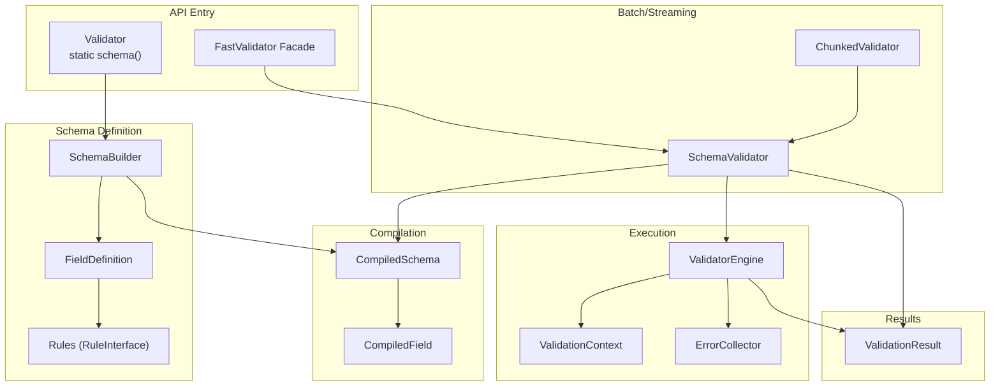
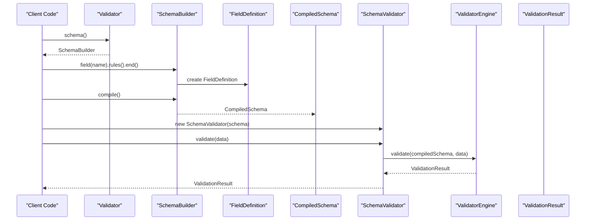
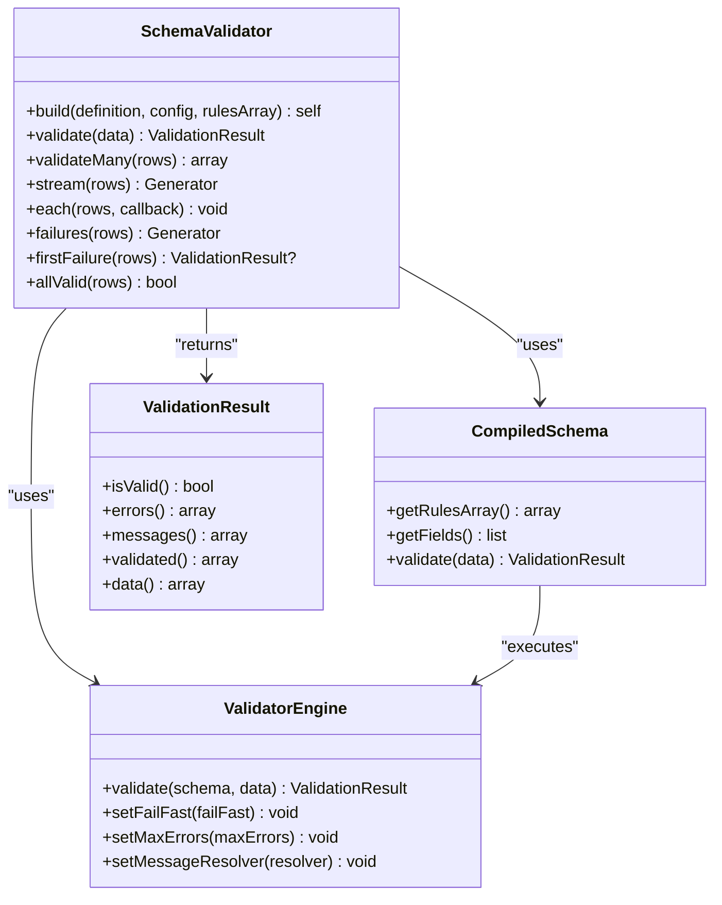
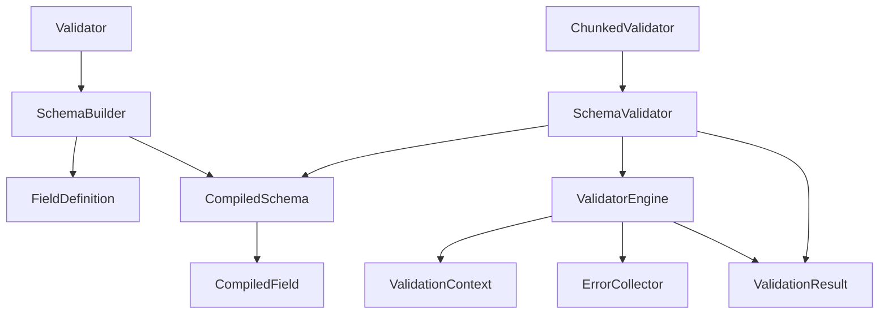

# Core API

<cite>
**Referenced Files in This Document**
- [Validator.php](file://src/Validator.php)
- [SchemaValidator.php](file://src/SchemaValidator.php)
- [SchemaBuilder.php](file://src/Schema/SchemaBuilder.php)
- [FieldDefinition.php](file://src/Schema/FieldDefinition.php)
- [CompiledSchema.php](file://src/Execution/CompiledSchema.php)
- [CompiledField.php](file://src/Execution/CompiledField.php)
- [ValidationResult.php](file://src/Execution/ValidationResult.php)
- [ValidatorEngine.php](file://src/Execution/ValidatorEngine.php)
- [ValidationContext.php](file://src/Execution/ValidationContext.php)
- [ErrorCollector.php](file://src/Execution/ErrorCollector.php)
- [ChunkedValidator.php](file://src/Execution/ChunkedValidator.php)
- [RuleInterface.php](file://src/Rules/RuleInterface.php)
- [RequiredRule.php](file://src/Rules/RequiredRule.php)
- [FastValidator.php](file://src/Laravel/Facades/FastValidator.php)
- [README.md](file://README.md)
</cite>

## Table of Contents
1. [Introduction](#introduction)
2. [Project Structure](#project-structure)
3. [Core Components](#core-components)
4. [Architecture Overview](#architecture-overview)
5. [Detailed Component Analysis](#detailed-component-analysis)
6. [Dependency Analysis](#dependency-analysis)
7. [Performance Considerations](#performance-considerations)
8. [Troubleshooting Guide](#troubleshooting-guide)
9. [Conclusion](#conclusion)
10. [Appendices](#appendices)

## Introduction
This document provides comprehensive API documentation for the core validation APIs in the library. It covers:
- The Validator facade static schema() method for building schemas
- The SchemaValidator class with validation methods (validate, validateMany, stream, each, failures, firstFailure, allValid)
- The SchemaBuilder API for defining validation schemas
- The complete validation lifecycle from schema definition to result processing
- Practical usage examples for basic validation, batch processing, and streaming validation patterns

The goal is to help both new and experienced users understand the APIs, their method signatures, parameters, return types, error handling characteristics, and best practices for performance and memory efficiency.

## Project Structure
The core validation APIs are organized around a small set of cohesive components:
- Facade and Builder: Validator facade and SchemaBuilder
- Compiled Schema: CompiledSchema and CompiledField
- Execution Engine: ValidatorEngine and ValidationContext
- Results and Errors: ValidationResult and ErrorCollector
- Batch and Streaming: SchemaValidator and ChunkedValidator
- Rules: RuleInterface and concrete rules (e.g., RequiredRule)

**Diagram sources**
- [Validator.php](file://src/Validator.php#L9-L15)
- [SchemaBuilder.php](file://src/Schema/SchemaBuilder.php#L9-L35)
- [FieldDefinition.php](file://src/Schema/FieldDefinition.php#L9-L657)
- [CompiledSchema.php](file://src/Execution/CompiledSchema.php#L9-L67)
- [CompiledField.php](file://src/Execution/CompiledField.php#L10-L176)
- [ValidatorEngine.php](file://src/Execution/ValidatorEngine.php#L11-L176)
- [ValidationContext.php](file://src/Execution/ValidationContext.php#L7-L97)
- [ErrorCollector.php](file://src/Execution/ErrorCollector.php#L7-L50)
- [ValidationResult.php](file://src/Execution/ValidationResult.php#L9-L141)
- [SchemaValidator.php](file://src/SchemaValidator.php#L13-L204)
- [ChunkedValidator.php](file://src/Execution/ChunkedValidator.php#L16-L153)
- [FastValidator.php](file://src/Laravel/Facades/FastValidator.php#L16-L22)

**Section sources**
- [Validator.php](file://src/Validator.php#L9-L15)
- [SchemaBuilder.php](file://src/Schema/SchemaBuilder.php#L9-L35)
- [CompiledSchema.php](file://src/Execution/CompiledSchema.php#L9-L67)
- [ValidatorEngine.php](file://src/Execution/ValidatorEngine.php#L11-L176)
- [ValidationResult.php](file://src/Execution/ValidationResult.php#L9-L141)
- [SchemaValidator.php](file://src/SchemaValidator.php#L13-L204)
- [ChunkedValidator.php](file://src/Execution/ChunkedValidator.php#L16-L153)
- [FastValidator.php](file://src/Laravel/Facades/FastValidator.php#L16-L22)

## Core Components
This section documents the primary classes and their roles in the validation lifecycle.

- Validator facade
  - Purpose: Provides a static entry point to construct a SchemaBuilder for schema definition.
  - Key method: schema() returns a new SchemaBuilder instance.
  - Typical usage: Fluent schema construction followed by compile() to produce a CompiledSchema.

- SchemaBuilder
  - Purpose: Fluent API to define fields and their rules.
  - Key methods:
    - field(name): returns a FieldDefinition for the named field
    - setRulesArray(rules): injects a prebuilt rules array
    - compile(): produces a CompiledSchema from field definitions and optional rules array

- FieldDefinition
  - Purpose: Defines rules for a single field using a fluent interface.
  - Key methods:
    - Rule methods: required(), nullable(), string(), email(), integer(), url(), uuid(), ip(), regex(), etc.
    - Conditional and advanced logic: when(), requiredIf(), requiredUnless(), prohibitedIf(), etc.
    - Control flow: sometimes(), bail(), end() to finalize and return the builder
    - compile(): shortcut to compile the schema from this field’s perspective

- CompiledSchema and CompiledField
  - Purpose: Compiled representation of the schema for efficient execution.
  - CompiledSchema: holds CompiledField list and rules array; exposes validate(data) to run validation.
  - CompiledField: encapsulates field rules, flags (nullable, bail, sometimes), exclusion rules, and nested field resolution.

- ValidatorEngine and ValidationContext
  - Purpose: Executes compiled rules against input data with minimal overhead.
  - ValidatorEngine: orchestrates rule application, bail semantics, fail-fast/max-errors, and collects errors.
  - ValidationContext: provides access to input data, nested field access, and error collection.

- ValidationResult and ErrorCollector
  - Purpose: Encapsulates validation outcomes and error messages.
  - ValidationResult: exposes validity, raw errors, formatted messages, validated data, and helpers.
  - ErrorCollector: accumulates field-level errors with rule names, parameters, and optional messages.

- SchemaValidator
  - Purpose: High-level API for validating single or multiple records with multiple strategies.
  - Methods:
    - validate(data): single record validation
    - validateMany(rows): materialized batch validation
    - stream(rows): generator-based streaming
    - each(rows, callback): immediate callback processing
    - failures(rows): generator of only failed results
    - firstFailure(rows): fail-fast first failure
    - allValid(rows): memory-efficient all-pass check

- ChunkedValidator
  - Purpose: Memory-efficient chunked processing for very large datasets.
  - Methods:
    - validateInChunks(rows, chunkSize, onChunk)
    - streamChunks(rows, chunkSize)
    - streamFailures(rows, chunkSize)
    - countFailures(rows, chunkSize)

- RuleInterface and RequiredRule
  - Purpose: Contract for implementing validation rules and a concrete example.
  - RuleInterface: validate(value, field, context) returns null on pass or an error descriptor on fail.
  - RequiredRule: demonstrates the rule contract and typical behavior.

**Section sources**
- [Validator.php](file://src/Validator.php#L9-L15)
- [SchemaBuilder.php](file://src/Schema/SchemaBuilder.php#L9-L35)
- [FieldDefinition.php](file://src/Schema/FieldDefinition.php#L9-L657)
- [CompiledSchema.php](file://src/Execution/CompiledSchema.php#L9-L67)
- [CompiledField.php](file://src/Execution/CompiledField.php#L10-L176)
- [ValidatorEngine.php](file://src/Execution/ValidatorEngine.php#L11-L176)
- [ValidationContext.php](file://src/Execution/ValidationContext.php#L7-L97)
- [ErrorCollector.php](file://src/Execution/ErrorCollector.php#L7-L50)
- [ValidationResult.php](file://src/Execution/ValidationResult.php#L9-L141)
- [SchemaValidator.php](file://src/SchemaValidator.php#L13-L204)
- [ChunkedValidator.php](file://src/Execution/ChunkedValidator.php#L16-L153)
- [RuleInterface.php](file://src/Rules/RuleInterface.php#L9-L15)
- [RequiredRule.php](file://src/Rules/RequiredRule.php#L10-L28)

## Architecture Overview
The validation lifecycle proceeds from schema definition to compiled execution and result processing.

**Diagram sources**
- [Validator.php](file://src/Validator.php#L9-L15)
- [SchemaBuilder.php](file://src/Schema/SchemaBuilder.php#L9-L35)
- [FieldDefinition.php](file://src/Schema/FieldDefinition.php#L9-L657)
- [CompiledSchema.php](file://src/Execution/CompiledSchema.php#L27-L66)
- [SchemaValidator.php](file://src/SchemaValidator.php#L54-L73)
- [ValidatorEngine.php](file://src/Execution/ValidatorEngine.php#L33-L97)
- [ValidationResult.php](file://src/Execution/ValidationResult.php#L22-L32)

## Detailed Component Analysis

### Validator Facade
- Static method schema(): returns a new SchemaBuilder instance to start defining a schema.

Usage example paths:
- [Basic schema definition](file://README.md#L34-L51)
- [Define a schema](file://README.md#L109-L124)

**Section sources**
- [Validator.php](file://src/Validator.php#L9-L15)
- [README.md](file://README.md#L34-L51)
- [README.md](file://README.md#L109-L124)

### SchemaBuilder API
- field(name): returns a FieldDefinition for the given field name
- setRulesArray(rules): injects a prebuilt rules array
- compile(): produces a CompiledSchema

Usage example paths:
- [Define a schema](file://README.md#L109-L124)
- [Nested fields](file://README.md#L161-L183)

**Section sources**
- [SchemaBuilder.php](file://src/Schema/SchemaBuilder.php#L9-L35)
- [README.md](file://README.md#L109-L124)
- [README.md](file://README.md#L161-L183)

### FieldDefinition API
FieldDefinition provides a fluent interface to define rules and behaviors for a field. It supports:
- Core type rules: string(), integer(), boolean(), array(), list(), json(), etc.
- Format and string rules: email(), url(), uuid(), ip(), regex(), alpha(), alphaNum(), etc.
- Size and comparison rules: min(), max(), between(), size(), gt(), gte(), lt(), lte(), in(), notIn(), same(), different(), etc.
- Presence and conditional rules: required(), nullable(), sometimes(), bail(), present(), filled(), requiredIf(), requiredUnless(), requiredWith(), requiredWithout(), etc.
- Advanced logic: when(condition, onTrue, onFalse?), prohibitedIf(), acceptedIf(), declinedIf(), etc.
- Exclusion: exclude(), excludeIf(), excludeUnless(), excludeWith(), excludeWithout()
- Utilities: end() to return the builder, compile() to compile the schema

Usage example paths:
- [Define a schema](file://README.md#L109-L124)
- [Nullable fields](file://README.md#L185-L204)
- [Nested fields](file://README.md#L161-L183)

**Section sources**
- [FieldDefinition.php](file://src/Schema/FieldDefinition.php#L9-L657)
- [README.md](file://README.md#L109-L124)
- [README.md](file://README.md#L185-L204)
- [README.md](file://README.md#L161-L183)

### CompiledSchema and CompiledField
- CompiledSchema.fromFieldDefinitions(fieldDefinitions, rulesArray): constructs a CompiledSchema
- CompiledSchema.validate(data): executes validation using the engine
- CompiledField: encapsulates field rules, flags, and nested field resolution

Usage example paths:
- [Define a schema](file://README.md#L109-L124)

**Section sources**
- [CompiledSchema.php](file://src/Execution/CompiledSchema.php#L27-L66)
- [CompiledField.php](file://src/Execution/CompiledField.php#L115-L176)
- [README.md](file://README.md#L109-L124)

### ValidatorEngine and ValidationContext
- ValidatorEngine.validate(schema, data): orchestrates rule application, bail semantics, fail-fast/max-errors, and collects errors into ValidationResult
- ValidationContext: provides access to input data, nested field access, and error collection

Key behaviors:
- Implicit rules: required variants and presence-related rules are considered implicit and affect skip logic
- Bail: stops further rule checks for a field upon first failure if configured
- Fail-fast and max-errors: control early termination and error cap

**Section sources**
- [ValidatorEngine.php](file://src/Execution/ValidatorEngine.php#L33-L97)
- [ValidatorEngine.php](file://src/Execution/ValidatorEngine.php#L127-L175)
- [ValidationContext.php](file://src/Execution/ValidationContext.php#L43-L96)

### ValidationResult and ErrorCollector
- ValidationResult: exposes validity, raw errors, formatted messages, validated data, and helpers
- ErrorCollector: accumulates field-level errors with rule names, parameters, and optional messages

Usage example paths:
- [Single record validation](file://README.md#L126-L159)

**Section sources**
- [ValidationResult.php](file://src/Execution/ValidationResult.php#L22-L141)
- [ErrorCollector.php](file://src/Execution/ErrorCollector.php#L17-L49)
- [README.md](file://README.md#L126-L159)

### SchemaValidator API
SchemaValidator provides multiple validation strategies:

- validate(array $data): ValidationResult
  - Validates a single record using the compiled schema
  - Uses native precompiled validator if available, otherwise falls back to ValidatorEngine

- validateMany(iterable $rows): array
  - Validates multiple rows and returns all results at once
  - Warning: materializes all results in memory; use stream() or each() for large datasets

- stream(iterable $rows): Generator<int, ValidationResult>
  - Yields results one at a time for memory-efficient processing
  - Recommended for large datasets (ETL, imports, queues)

- each(iterable $rows, callable $callback): void
  - Processes each result immediately via callback without storing results
  - Ideal for fire-and-forget validation of large datasets

- failures(iterable $rows): Generator<int, ValidationResult>
  - Yields only failed validation results with their original index
  - Memory-efficient way to report errors without storing successes

- firstFailure(iterable $rows): ?ValidationResult
  - Returns the first failed result or null if all pass
  - Useful for fail-fast validation

- allValid(iterable $rows): bool
  - Memory-efficient check to determine if all rows pass validation
  - Stops at the first failure

Usage example paths:
- [Batch validation](file://README.md#L205-L234)
- [Chunked validation](file://README.md#L236-L264)
- [Generator-based streaming](file://README.md#L266-L292)
- [Callback-based processing](file://README.md#L294-L304)
- [Stream only failures](file://README.md#L306-L315)
- [Fail-fast validation](file://README.md#L317-L327)
- [Check all valid](file://README.md#L329-L338)
- [Chunked streaming](file://README.md#L340-L365)

**Diagram sources**
- [SchemaValidator.php](file://src/SchemaValidator.php#L35-L203)
- [CompiledSchema.php](file://src/Execution/CompiledSchema.php#L59-L66)
- [ValidatorEngine.php](file://src/Execution/ValidatorEngine.php#L33-L97)
- [ValidationResult.php](file://src/Execution/ValidationResult.php#L59-L141)

**Section sources**
- [SchemaValidator.php](file://src/SchemaValidator.php#L35-L203)
- [README.md](file://README.md#L205-L234)
- [README.md](file://README.md#L236-L264)
- [README.md](file://README.md#L266-L292)
- [README.md](file://README.md#L294-L304)
- [README.md](file://README.md#L306-L315)
- [README.md](file://README.md#L317-L327)
- [README.md](file://README.md#L329-L338)
- [README.md](file://README.md#L340-L365)

### ChunkedValidator API
ChunkedValidator enables memory-efficient processing of very large datasets by operating in fixed-size chunks.

- validateInChunks(rows, chunkSize, onChunk): void
- streamChunks(rows, chunkSize): Generator<int, BatchValidationResult>
- streamFailures(rows, chunkSize): Generator<int, ValidationResult>
- countFailures(rows, chunkSize): int

Usage example paths:
- [Chunked streaming](file://README.md#L340-L365)

**Section sources**
- [ChunkedValidator.php](file://src/Execution/ChunkedValidator.php#L34-L153)
- [README.md](file://README.md#L340-L365)

### RuleInterface and RequiredRule
- RuleInterface: validate(value, field, context) returns null on pass or an error descriptor on fail
- RequiredRule: demonstrates the rule contract and typical behavior

**Section sources**
- [RuleInterface.php](file://src/Rules/RuleInterface.php#L9-L15)
- [RequiredRule.php](file://src/Rules/RequiredRule.php#L10-L28)

### Laravel Integration (FastValidator Facade)
The FastValidator facade provides Laravel integration for parallel-mode usage.

- Facade methods: make(iterator, rules, messages, attributes)
- Accessor: FastValidatorFactory

Usage example paths:
- [Laravel parallel mode](file://README.md#L450-L477)
- [Laravel facade usage](file://README.md#L75-L94)

**Section sources**
- [FastValidator.php](file://src/Laravel/Facades/FastValidator.php#L16-L22)
- [README.md](file://README.md#L450-L477)
- [README.md](file://README.md#L75-L94)

## Dependency Analysis
The following diagram shows key dependencies among core components:

**Diagram sources**
- [Validator.php](file://src/Validator.php#L9-L15)
- [SchemaBuilder.php](file://src/Schema/SchemaBuilder.php#L9-L35)
- [FieldDefinition.php](file://src/Schema/FieldDefinition.php#L9-L657)
- [CompiledSchema.php](file://src/Execution/CompiledSchema.php#L27-L66)
- [CompiledField.php](file://src/Execution/CompiledField.php#L115-L176)
- [SchemaValidator.php](file://src/SchemaValidator.php#L54-L203)
- [ValidatorEngine.php](file://src/Execution/ValidatorEngine.php#L33-L176)
- [ValidationContext.php](file://src/Execution/ValidationContext.php#L17-L96)
- [ErrorCollector.php](file://src/Execution/ErrorCollector.php#L17-L49)
- [ValidationResult.php](file://src/Execution/ValidationResult.php#L22-L141)
- [ChunkedValidator.php](file://src/Execution/ChunkedValidator.php#L20-L153)

**Section sources**
- [Validator.php](file://src/Validator.php#L9-L15)
- [SchemaBuilder.php](file://src/Schema/SchemaBuilder.php#L9-L35)
- [FieldDefinition.php](file://src/Schema/FieldDefinition.php#L9-L657)
- [CompiledSchema.php](file://src/Execution/CompiledSchema.php#L27-L66)
- [CompiledField.php](file://src/Execution/CompiledField.php#L115-L176)
- [SchemaValidator.php](file://src/SchemaValidator.php#L54-L203)
- [ValidatorEngine.php](file://src/Execution/ValidatorEngine.php#L33-L176)
- [ValidationContext.php](file://src/Execution/ValidationContext.php#L17-L96)
- [ErrorCollector.php](file://src/Execution/ErrorCollector.php#L17-L49)
- [ValidationResult.php](file://src/Execution/ValidationResult.php#L22-L141)
- [ChunkedValidator.php](file://src/Execution/ChunkedValidator.php#L20-L153)

## Performance Considerations
- Prefer streaming APIs for large datasets:
  - stream() and failures() for generators
  - each() for callback-based processing
  - countFailures() for counting without storing results
- Use chunked validation for very large datasets:
  - validateInChunks(), streamChunks(), streamFailures()
- Memory usage comparison:
  - validateMany(): O(n) memory
  - stream(): O(1) memory
  - each(): O(1) memory
  - failures(): O(1) memory
  - streamChunks(): O(chunk) memory

Practical guidance:
- For small datasets (<10k rows), validateMany() is fine
- For large datasets, use stream() or each()
- For batch processing with controlled memory, use ChunkedValidator

**Section sources**
- [README.md](file://README.md#L367-L376)
- [SchemaValidator.php](file://src/SchemaValidator.php#L75-L203)
- [ChunkedValidator.php](file://src/Execution/ChunkedValidator.php#L34-L153)

## Troubleshooting Guide
Common issues and resolutions:
- Unexpected passes with null values:
  - nullable() allows null; other rules are skipped when the value is null
  - Reference: [Nullable behavior](file://src/Execution/CompiledField.php#L133-L141), [Engine null handling](file://src/Execution/ValidatorEngine.php#L72-L74)
- Empty string and empty array handling:
  - Non-implicit rules are skipped for empty values unless explicitly required
  - Reference: [Engine empty check](file://src/Execution/ValidatorEngine.php#L76-L82)
- Bail semantics:
  - If a field has bail(), validation stops at the first failure for that field
  - Reference: [Engine bail handling](file://src/Execution/ValidatorEngine.php#L84-L93)
- Fail-fast and max-errors:
  - Fail-fast stops validation after the first error; max-errors caps total errors
  - Reference: [Engine fail-fast and max-errors](file://src/Execution/ValidatorEngine.php#L148-L159)
- Nested fields:
  - Dot notation supports up to two levels (parent.child)
  - Reference: [Nested field resolution](file://src/Execution/CompiledField.php#L163-L175), [Context nested access](file://src/Execution/ValidationContext.php#L43-L58)
- Exclusion rules:
  - Fields marked for exclusion are removed from validated data
  - Reference: [Exclusion rules](file://src/Execution/CompiledField.php#L148-L161), [ValidationResult validated()](file://src/Execution/ValidationResult.php#L45-L57)

**Section sources**
- [CompiledField.php](file://src/Execution/CompiledField.php#L133-L175)
- [ValidatorEngine.php](file://src/Execution/ValidatorEngine.php#L72-L93)
- [ValidatorEngine.php](file://src/Execution/ValidatorEngine.php#L148-L159)
- [ValidationResult.php](file://src/Execution/ValidationResult.php#L45-L57)
- [ValidationContext.php](file://src/Execution/ValidationContext.php#L43-L58)

## Conclusion
The core validation APIs provide a powerful, efficient, and flexible system for validating structured data in PHP applications. The Validator facade and SchemaBuilder enable expressive schema definition, CompiledSchema optimizes runtime performance, and SchemaValidator offers multiple validation strategies tailored to different data sizes and processing needs. Combined with ChunkedValidator and Laravel integration, the library supports everything from small scripts to high-throughput, long-running services.

## Appendices

### API Reference Tables

- Validator facade
  - Method: schema()
  - Parameters: none
  - Returns: SchemaBuilder
  - Notes: Fluent schema construction entry point

- SchemaBuilder
  - Method: field(name)
  - Parameters: name (string)
  - Returns: FieldDefinition
  - Notes: Starts defining rules for a field
  - Method: setRulesArray(rules)
  - Parameters: rules (array)
  - Returns: void
  - Notes: Injects a prebuilt rules array
  - Method: compile()
  - Parameters: none
  - Returns: CompiledSchema
  - Notes: Produces compiled schema

- FieldDefinition
  - Methods: required(), nullable(), string(), integer(), boolean(), array(), list(), json(), email(), url(), uuid(), ip(), regex(), min(), max(), between(), size(), in(), notIn(), same(), different(), file(), image(), mimes(), mimetypes(), extensions(), dimensions(), rules(), activeUrl(), alphaDash(), macAddress(), ulid(), country(), language(), ascii(), uppercase(), enum(), password(), currentPassword(), lowercase(), dateFormat(), dateEquals(), multipleOf(), digits(), digitsBetween(), startsWith(), endsWith(), notRegex(), doesntStartWith(), doesntEndWith(), timezone(), requiredArrayKeys(), requiredIf(), requiredIfAccepted(), requiredUnless(), requiredWith(), requiredWithAll(), requiredWithout(), requiredWithoutAll(), present(), filled(), prohibitedIf(), prohibitedUnless(), acceptedIf(), declinedIf(), prohibits(), missing(), missingIf(), missingUnless(), missingWith(), missingWithAll(), exclude(), excludeIf(), excludeUnless(), excludeWith(), excludeWithout(), when()
  - Parameters: vary by rule
  - Returns: FieldDefinition (methods are chained)
  - Notes: Fluent rule definitions; end() returns builder; compile() compiles schema

- CompiledSchema
  - Method: fromFieldDefinitions(fieldDefinitions, rulesArray)
  - Parameters: fieldDefinitions (array), rulesArray (array)
  - Returns: CompiledSchema
  - Notes: Factory method to create compiled schema
  - Method: validate(data)
  - Parameters: data (array)
  - Returns: ValidationResult
  - Notes: Executes validation

- SchemaValidator
  - Method: build(definition, config, rulesArray)
  - Parameters: definition (callable), config (array), rulesArray (array)
  - Returns: SchemaValidator
  - Notes: Static factory to build and compile a validator
  - Method: validate(data)
  - Parameters: data (array)
  - Returns: ValidationResult
  - Notes: Single record validation
  - Method: validateMany(rows)
  - Parameters: rows (iterable)
  - Returns: array of ValidationResult
  - Notes: Materialized batch validation
  - Method: stream(rows)
  - Parameters: rows (iterable)
  - Returns: Generator<int, ValidationResult>
  - Notes: Memory-efficient streaming
  - Method: each(rows, callback)
  - Parameters: rows (iterable), callback (callable)
  - Returns: void
  - Notes: Immediate callback processing
  - Method: failures(rows)
  - Parameters: rows (iterable)
  - Returns: Generator<int, ValidationResult>
  - Notes: Yields only failures
  - Method: firstFailure(rows)
  - Parameters: rows (iterable)
  - Returns: ValidationResult or null
  - Notes: Fail-fast first failure
  - Method: allValid(rows)
  - Parameters: rows (iterable)
  - Returns: bool
  - Notes: Memory-efficient all-pass check

- ChunkedValidator
  - Method: validateInChunks(rows, chunkSize, onChunk)
  - Parameters: rows (iterable), chunkSize (int), onChunk (callable)
  - Returns: void
  - Notes: Batch processing with callback
  - Method: streamChunks(rows, chunkSize)
  - Parameters: rows (iterable), chunkSize (int)
  - Returns: Generator<int, BatchValidationResult>
  - Notes: Streams chunk results
  - Method: streamFailures(rows, chunkSize)
  - Parameters: rows (iterable), chunkSize (int)
  - Returns: Generator<int, ValidationResult>
  - Notes: Streams only failures with original indices
  - Method: countFailures(rows, chunkSize)
  - Parameters: rows (iterable), chunkSize (int)
  - Returns: int
  - Notes: Counts failures without storing results

- ValidationResult
  - Method: isValid()
  - Parameters: none
  - Returns: bool
  - Notes: True if no errors
  - Method: errors()
  - Parameters: none
  - Returns: array of errors
  - Notes: Raw errors grouped by field
  - Method: messages()
  - Parameters: none
  - Returns: array of formatted messages
  - Notes: Formatted messages grouped by field
  - Method: validated()
  - Parameters: none
  - Returns: array
  - Notes: Validated data excluding excluded fields
  - Method: data()
  - Parameters: none
  - Returns: array
  - Notes: Original input data
  - Method: allMessages()
  - Parameters: none
  - Returns: list of strings
  - Notes: Flattened messages
  - Method: firstMessage(field)
  - Parameters: field (string)
  - Returns: string or null
  - Notes: First message for a field
  - Method: first()
  - Parameters: none
  - Returns: string or null
  - Notes: First error message overall

- RuleInterface
  - Method: validate(value, field, context)
  - Parameters: value (mixed), field (string), context (ValidationContext)
  - Returns: array descriptor or null
  - Notes: Error descriptor on fail; null on pass

- RequiredRule
  - Method: validate(value, field, context)
  - Parameters: value (mixed), field (string), context (ValidationContext)
  - Returns: array descriptor or null
  - Notes: Implements RuleInterface contract

**Section sources**
- [Validator.php](file://src/Validator.php#L9-L15)
- [SchemaBuilder.php](file://src/Schema/SchemaBuilder.php#L9-L35)
- [FieldDefinition.php](file://src/Schema/FieldDefinition.php#L24-L657)
- [CompiledSchema.php](file://src/Execution/CompiledSchema.php#L27-L66)
- [SchemaValidator.php](file://src/SchemaValidator.php#L35-L203)
- [ChunkedValidator.php](file://src/Execution/ChunkedValidator.php#L34-L153)
- [ValidationResult.php](file://src/Execution/ValidationResult.php#L59-L141)
- [RuleInterface.php](file://src/Rules/RuleInterface.php#L9-L15)
- [RequiredRule.php](file://src/Rules/RequiredRule.php#L10-L28)

### Practical Usage Examples

- Basic validation
  - Build schema via Validator::schema(), compile, instantiate SchemaValidator, call validate()
  - Reference: [Quick start](file://README.md#L34-L51), [Define a schema](file://README.md#L109-L124), [Single record validation](file://README.md#L126-L159)

- Batch processing
  - Use validateMany() for small datasets or ChunkedValidator for large ones
  - Reference: [Batch validation](file://README.md#L205-L234), [Chunked validation](file://README.md#L236-L264)

- Streaming validation
  - Use stream() for generator-based processing or each() for callback-based processing
  - Reference: [Generator-based streaming](file://README.md#L266-L292), [Callback-based processing](file://README.md#L294-L304)

- Failures-only reporting
  - Use failures() to iterate only failed results
  - Reference: [Stream only failures](file://README.md#L306-L315)

- Fail-fast and all-valid checks
  - Use firstFailure() or allValid() for memory-efficient checks
  - Reference: [Fail-fast validation](file://README.md#L317-L327), [Check all valid](file://README.md#L329-L338)

**Section sources**
- [README.md](file://README.md#L34-L51)
- [README.md](file://README.md#L109-L159)
- [README.md](file://README.md#L205-L234)
- [README.md](file://README.md#L236-L264)
- [README.md](file://README.md#L266-L304)
- [README.md](file://README.md#L306-L338)