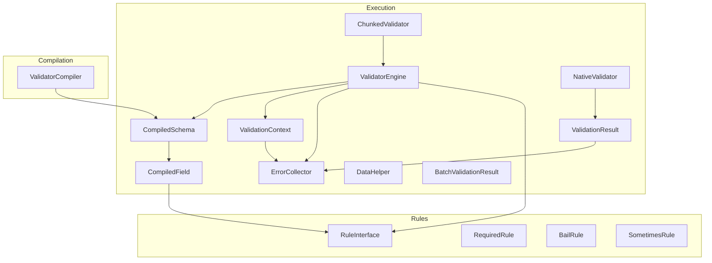
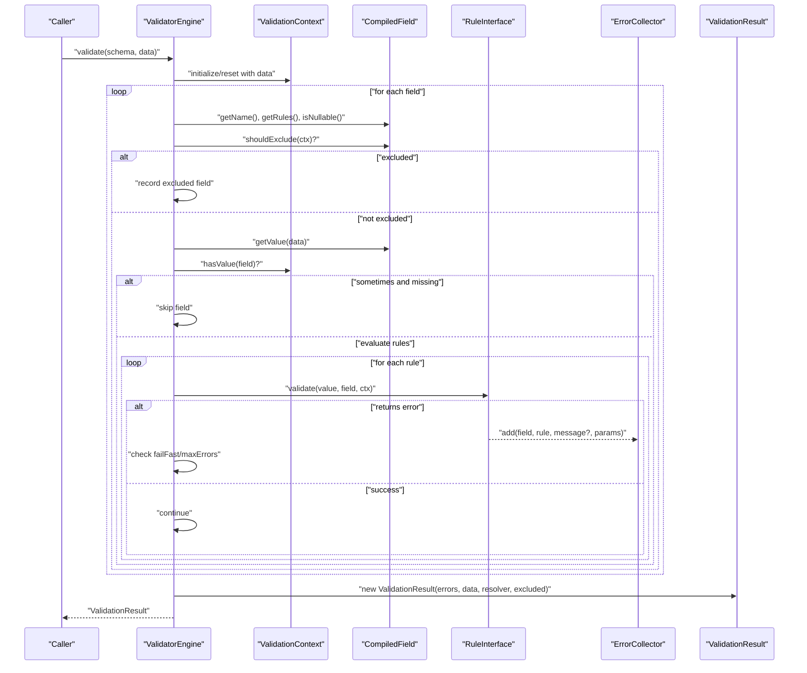
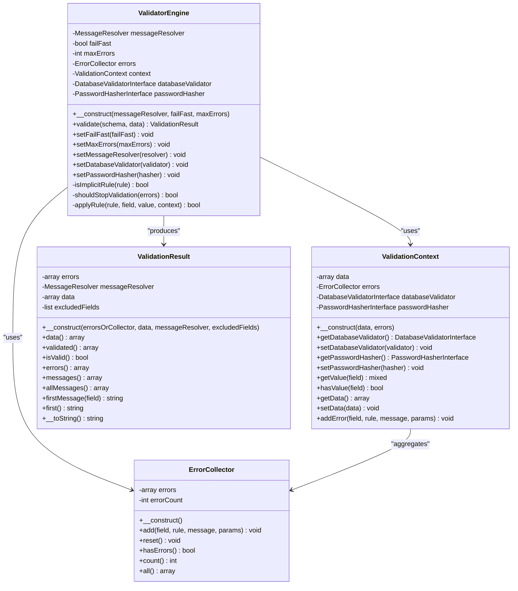
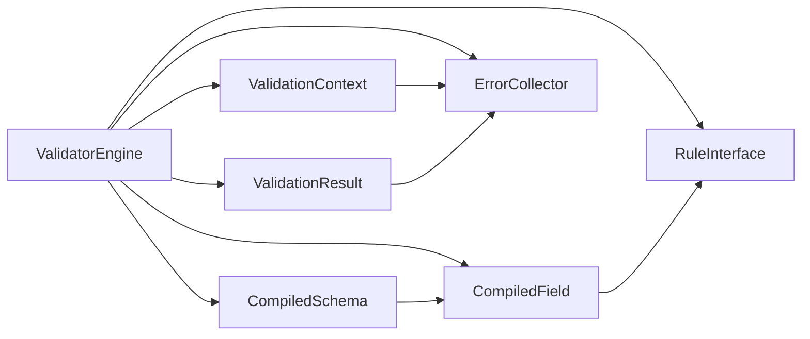

# Execution Engine API

<cite>
**Referenced Files in This Document**
- [ValidatorEngine.php](file://src/Execution/ValidatorEngine.php)
- [ValidationContext.php](file://src/Execution/ValidationContext.php)
- [ValidationResult.php](file://src/Execution/ValidationResult.php)
- [ErrorCollector.php](file://src/Execution/ErrorCollector.php)
- [CompiledSchema.php](file://src/Execution/CompiledSchema.php)
- [CompiledField.php](file://src/Execution/CompiledField.php)
- [DataHelper.php](file://src/Execution/DataHelper.php)
- [BatchValidationResult.php](file://src/Execution/BatchValidationResult.php)
- [NativeValidator.php](file://src/Execution/NativeValidator.php)
- [ChunkedValidator.php](file://src/Execution/ChunkedValidator.php)
- [ValidatorCompiler.php](file://src/Compilation/ValidatorCompiler.php)
- [RuleInterface.php](file://src/Rules/RuleInterface.php)
- [RequiredRule.php](file://src/Rules/RequiredRule.php)
- [BailRule.php](file://src/Rules/BailRule.php)
- [SometimesRule.php](file://src/Rules/SometimesRule.php)
</cite>

## Table of Contents
1. [Introduction](#introduction)
2. [Project Structure](#project-structure)
3. [Core Components](#core-components)
4. [Architecture Overview](#architecture-overview)
5. [Detailed Component Analysis](#detailed-component-analysis)
6. [Dependency Analysis](#dependency-analysis)
7. [Performance Considerations](#performance-considerations)
8. [Troubleshooting Guide](#troubleshooting-guide)
9. [Conclusion](#conclusion)
10. [Appendices](#appendices)

## Introduction
This document provides detailed API documentation for the validation execution engine components. It focuses on the ValidatorEngine orchestration, ValidationContext for execution state, ValidationResult for result handling, and ErrorCollector for error aggregation. It also covers execution pipeline methods, context manipulation, result processing, error collection patterns, and internal integration points used by the engine. Practical examples demonstrate programmatic validation execution, custom result handling, and error processing workflows.

## Project Structure
The execution engine resides under src/Execution and integrates with compiled schema and rule systems under src/Compilation and src/Rules. Supporting components include batch and chunked validators for scalable processing.

**Diagram sources**
- [ValidatorEngine.php](file://src/Execution/ValidatorEngine.php#L11-L177)
- [ValidationContext.php](file://src/Execution/ValidationContext.php#L7-L98)
- [ValidationResult.php](file://src/Execution/ValidationResult.php#L9-L142)
- [ErrorCollector.php](file://src/Execution/ErrorCollector.php#L7-L51)
- [CompiledSchema.php](file://src/Execution/CompiledSchema.php#L9-L68)
- [CompiledField.php](file://src/Execution/CompiledField.php#L10-L177)
- [DataHelper.php](file://src/Execution/DataHelper.php#L10-L32)
- [BatchValidationResult.php](file://src/Execution/BatchValidationResult.php#L17-L92)
- [NativeValidator.php](file://src/Execution/NativeValidator.php#L12-L39)
- [ChunkedValidator.php](file://src/Execution/ChunkedValidator.php#L16-L154)
- [ValidatorCompiler.php](file://src/Compilation/ValidatorCompiler.php#L10-L195)
- [RuleInterface.php](file://src/Rules/RuleInterface.php#L9-L16)
- [RequiredRule.php](file://src/Rules/RequiredRule.php#L10-L29)
- [BailRule.php](file://src/Rules/BailRule.php#L12-L20)
- [SometimesRule.php](file://src/Rules/SometimesRule.php#L12-L20)

**Section sources**
- [ValidatorEngine.php](file://src/Execution/ValidatorEngine.php#L11-L177)
- [CompiledSchema.php](file://src/Execution/CompiledSchema.php#L9-L68)
- [CompiledField.php](file://src/Execution/CompiledField.php#L10-L177)
- [RuleInterface.php](file://src/Rules/RuleInterface.php#L9-L16)

## Core Components
- ValidatorEngine: Orchestrates validation execution over a CompiledSchema, manages fail-fast and max-errors policies, and delegates rule evaluation to ValidationContext.
- ValidationContext: Provides runtime access to input data, nested field resolution, and error aggregation via ErrorCollector. Exposes helpers to check presence and retrieve values.
- ValidationResult: Encapsulates validation outcomes, supports validated data extraction, error retrieval, message formatting, and convenience accessors.
- ErrorCollector: Aggregates field-level errors with rule identifiers, parameters, and optional messages, and tracks counts.

**Section sources**
- [ValidatorEngine.php](file://src/Execution/ValidatorEngine.php#L11-L177)
- [ValidationContext.php](file://src/Execution/ValidationContext.php#L7-L98)
- [ValidationResult.php](file://src/Execution/ValidationResult.php#L9-L142)
- [ErrorCollector.php](file://src/Execution/ErrorCollector.php#L7-L51)

## Architecture Overview
The execution engine follows a staged pipeline:
- Prepare or reuse ValidationContext and ErrorCollector.
- Iterate fields from CompiledSchema.
- Apply exclusion rules and sometimes semantics.
- Evaluate rules in a prioritized order, skipping implicit rules on empty values.
- Collect errors and enforce fail-fast and max-errors limits.
- Produce ValidationResult with resolved messages and excluded fields.

**Diagram sources**
- [ValidatorEngine.php](file://src/Execution/ValidatorEngine.php#L33-L98)
- [ValidationContext.php](file://src/Execution/ValidationContext.php#L43-L96)
- [CompiledField.php](file://src/Execution/CompiledField.php#L148-L177)
- [RuleInterface.php](file://src/Rules/RuleInterface.php#L9-L16)
- [ErrorCollector.php](file://src/Execution/ErrorCollector.php#L17-L25)
- [ValidationResult.php](file://src/Execution/ValidationResult.php#L22-L32)

## Detailed Component Analysis

### ValidatorEngine
Responsibilities:
- Initialize or reuse ValidationContext and ErrorCollector.
- Configure runtime integrations (database validator, password hasher).
- Iterate fields, handle exclusions and sometimes semantics.
- Enforce implicit rule behavior and empty-value skipping.
- Apply rules and collect errors.
- Enforce fail-fast and max-errors policies.
- Produce ValidationResult.

Key methods and behaviors:
- validate(schema, data): orchestrates the pipeline and returns ValidationResult.
- setFailFast(flag), setMaxErrors(n), setMessageResolver(resolver), setDatabaseValidator(v), setPasswordHasher(h): configure engine behavior and runtime dependencies.
- Internal helpers: isImplicitRule(rule), shouldStopValidation(errors), applyRule(rule, field, value, context).

Execution pipeline highlights:
- Field exclusion: CompiledField.shouldExclude(context) determines whether to skip a field.
- Sometimes semantics: CompiledField.isSometimes() combined with ValidationContext.hasValue(field) decides whether to evaluate rules.
- Implicit rules: ValidatorEngine.isImplicitRule(rule) defines rules that run even on empty values.
- Bail behavior: CompiledField.isBail() stops further rule evaluation for a field upon first failure.
- Fail-fast and max-errors: ValidatorEngine.shouldStopValidation(errors) halts processing when conditions are met.

Integration points:
- Uses CompiledSchema.getFields() and CompiledField.getRules().
- Delegates rule evaluation to RuleInterface.validate(...).
- Uses ValidationContext.getValue(), hasValue(), and addError().
- Produces ValidationResult with MessageResolver for message resolution.

Example usage patterns:
- Programmatic validation: call validate(schema, data) and inspect ValidationResult.isValid(), errors(), messages().
- Custom result handling: post-process ValidationResult.data(), validated(), messages(), allMessages(), firstMessage(field), first().
- Error processing: iterate ValidationResult.errors() and resolve messages via MessageResolver if needed.

**Section sources**
- [ValidatorEngine.php](file://src/Execution/ValidatorEngine.php#L11-L177)
- [CompiledSchema.php](file://src/Execution/CompiledSchema.php#L49-L66)
- [CompiledField.php](file://src/Execution/CompiledField.php#L148-L177)
- [RuleInterface.php](file://src/Rules/RuleInterface.php#L9-L16)
- [ValidationResult.php](file://src/Execution/ValidationResult.php#L59-L128)

#### Class Diagram

**Diagram sources**
- [ValidatorEngine.php](file://src/Execution/ValidatorEngine.php#L11-L177)
- [ValidationContext.php](file://src/Execution/ValidationContext.php#L7-L98)
- [ErrorCollector.php](file://src/Execution/ErrorCollector.php#L7-L51)
- [ValidationResult.php](file://src/Execution/ValidationResult.php#L9-L142)

### ValidationContext
Responsibilities:
- Hold raw input data and expose helpers to read nested fields using dot notation.
- Track presence of fields for sometimes semantics.
- Provide accessors for optional runtime integrations (database validator, password hasher).
- Delegate error addition to ErrorCollector.

Key methods:
- getValue(field): resolves simple or nested fields.
- hasValue(field): checks presence for sometimes logic.
- getData()/setData(): access to entire dataset.
- addError(field, rule, message?, params[]): records errors.

Usage patterns:
- Nested access: "parent.child" supported up to two levels.
- Integration: setDatabaseValidator/setPasswordHasher propagate runtime dependencies to rules.

**Section sources**
- [ValidationContext.php](file://src/Execution/ValidationContext.php#L7-L98)
- [DataHelper.php](file://src/Execution/DataHelper.php#L10-L32)

### ValidationResult
Responsibilities:
- Encapsulate validation outcome and provide convenient accessors.
- Resolve messages via MessageResolver when raw errors lack messages.
- Support validated data extraction by removing excluded fields.

Key methods:
- data(): returns original input data.
- validated(): returns validated subset (excluding excluded fields).
- isValid(): indicates pass/fail.
- errors(): returns raw structured errors.
- messages(): returns formatted messages grouped by field.
- allMessages(): flattened list of messages.
- firstMessage(field)/first(): convenience accessors.
- __toString(): string representation of messages.

Processing patterns:
- Post-process messages() for display or logging.
- Use validated() for downstream processing requiring clean data.

**Section sources**
- [ValidationResult.php](file://src/Execution/ValidationResult.php#L9-L142)

### ErrorCollector
Responsibilities:
- Aggregate errors per field with rule identity, parameters, and optional message.
- Track total error count and provide reset capability.

Key methods:
- add(field, rule, message?, params[]): append error entry.
- reset(): clear all errors.
- hasErrors(): quick pass/fail check.
- count(): total number of collected errors.
- all(): retrieve aggregated errors.

Integration:
- Used by ValidationContext.addError() and ValidatorEngine.applyRule().

**Section sources**
- [ErrorCollector.php](file://src/Execution/ErrorCollector.php#L7-L51)

### CompiledSchema and CompiledField
- CompiledSchema: wraps CompiledField instances and rules array; exposes validate(data) shortcut that delegates to ValidatorEngine.
- CompiledField: encapsulates field metadata (name, rules, flags), deduplicates and reorders rules, computes nested access, and evaluates exclusion rules.

Key behaviors:
- Rule deduplication and ordering: ensures marker rules (Bail, Required, Nullable) appear early.
- Nested field access: getValue(data) supports "parent.child".
- Exclusion rules: shouldExclude(context) applies exclude-if/unless/with/without rules.

**Section sources**
- [CompiledSchema.php](file://src/Execution/CompiledSchema.php#L9-L68)
- [CompiledField.php](file://src/Execution/CompiledField.php#L10-L177)

### NativeValidator and ChunkedValidator
- NativeValidator: executes a precompiled PHP closure returning structured results and produces ValidationResult.
- ChunkedValidator: processes large datasets in chunks, supporting callbacks, streaming batches, streaming failures, and counting failures efficiently.

Use cases:
- NativeValidator for maximum performance when using precompiled closures.
- ChunkedValidator for memory-efficient processing of large datasets with streaming and failure-only modes.

**Section sources**
- [NativeValidator.php](file://src/Execution/NativeValidator.php#L12-L39)
- [ChunkedValidator.php](file://src/Execution/ChunkedValidator.php#L16-L154)

### BatchValidationResult
- Holds a list of ValidationResult instances and supports iteration, counting, checking all-valid, filtering failures, and counting failures.

**Section sources**
- [BatchValidationResult.php](file://src/Execution/BatchValidationResult.php#L17-L92)

### RuleInterface and Example Rules
- RuleInterface: contract for rule validation returning either null (success) or an error descriptor with rule identifier and optional message/params.
- RequiredRule, BailRule, SometimesRule: marker and core rules used by the engine’s implicit/bail/sometimes logic.

**Section sources**
- [RuleInterface.php](file://src/Rules/RuleInterface.php#L9-L16)
- [RequiredRule.php](file://src/Rules/RequiredRule.php#L10-L29)
- [BailRule.php](file://src/Rules/BailRule.php#L12-L20)
- [SometimesRule.php](file://src/Rules/SometimesRule.php#L12-L20)

## Dependency Analysis
The execution engine depends on:
- CompiledSchema and CompiledField for field enumeration and rule sets.
- RuleInterface implementations for validation logic.
- ValidationContext for runtime data access and error aggregation.
- ErrorCollector for error accumulation.
- ValidationResult for result packaging and message resolution.
- Optional runtime integrations (database validator, password hasher) injected into ValidationContext.

**Diagram sources**
- [ValidatorEngine.php](file://src/Execution/ValidatorEngine.php#L11-L177)
- [CompiledSchema.php](file://src/Execution/CompiledSchema.php#L9-L68)
- [CompiledField.php](file://src/Execution/CompiledField.php#L10-L177)
- [RuleInterface.php](file://src/Rules/RuleInterface.php#L9-L16)
- [ValidationContext.php](file://src/Execution/ValidationContext.php#L7-L98)
- [ErrorCollector.php](file://src/Execution/ErrorCollector.php#L7-L51)
- [ValidationResult.php](file://src/Execution/ValidationResult.php#L9-L142)

**Section sources**
- [ValidatorEngine.php](file://src/Execution/ValidatorEngine.php#L11-L177)
- [CompiledSchema.php](file://src/Execution/CompiledSchema.php#L9-L68)
- [CompiledField.php](file://src/Execution/CompiledField.php#L10-L177)
- [RuleInterface.php](file://src/Rules/RuleInterface.php#L9-L16)

## Performance Considerations
- Fail-fast and max-errors: Configure ValidatorEngine.setFailFast(true) and setMaxErrors(n) to halt early and limit memory usage when many errors occur.
- Implicit rule handling: Implicit rules bypass empty-value skipping, ensuring correctness while minimizing unnecessary evaluations.
- Native execution: Use NativeValidator for precompiled closures to achieve peak performance.
- Chunked processing: Use ChunkedValidator to process large datasets without loading everything into memory, leveraging streaming and failure-only modes.

[No sources needed since this section provides general guidance]

## Troubleshooting Guide
Common scenarios:
- Unexpected passes on empty values: Verify that non-implicit rules are expected to run on empty values; implicit rules (required family, accepted family, filled, present, prohibited family) run regardless.
- Exclusions not taking effect: Ensure CompiledField.shouldExclude(context) conditions are met and that exclusion rules are properly registered during field compilation.
- Nested field access issues: ValidationContext.getValue(field) supports dot notation up to two levels; verify keys and nesting.
- Message resolution gaps: ValidationResult.messages() falls back to MessageResolver.resolve(field, rule, params); ensure MessageResolver is configured.
- Memory pressure on large datasets: Switch to ChunkedValidator with appropriate chunk sizes and consider streaming failures.

**Section sources**
- [ValidatorEngine.php](file://src/Execution/ValidatorEngine.php#L127-L176)
- [CompiledField.php](file://src/Execution/CompiledField.php#L148-L177)
- [ValidationContext.php](file://src/Execution/ValidationContext.php#L43-L96)
- [ValidationResult.php](file://src/Execution/ValidationResult.php#L77-L96)

## Conclusion
The execution engine provides a robust, extensible framework for validation. ValidatorEngine coordinates field-level evaluation, respects exclusion and sometimes semantics, and aggregates results via ErrorCollector and ValidationResult. ValidationContext offers safe, nested data access and integrates optional runtime services. For scale, NativeValidator and ChunkedValidator enable high-performance and memory-efficient processing.

[No sources needed since this section summarizes without analyzing specific files]

## Appendices

### API Reference Summary

- ValidatorEngine
  - validate(schema, data): ValidationResult
  - setFailFast(flag): void
  - setMaxErrors(n): void
  - setMessageResolver(resolver): void
  - setDatabaseValidator(validator): void
  - setPasswordHasher(hasher): void

- ValidationContext
  - getValue(field): mixed
  - hasValue(field): bool
  - getData()/setData(data): array
  - addError(field, rule, message?, params[]): void
  - getDatabaseValidator()/setDatabaseValidator(validator)
  - getPasswordHasher()/setPasswordHasher(hasher)

- ValidationResult
  - data(): array
  - validated(): array
  - isValid(): bool
  - errors(): array
  - messages(): array
  - allMessages(): array
  - firstMessage(field): string
  - first(): string
  - __toString(): string

- ErrorCollector
  - add(field, rule, message?, params[]): void
  - reset(): void
  - hasErrors(): bool
  - count(): int
  - all(): array

- CompiledSchema
  - getFields(): list
  - getRulesArray(): array
  - validate(data): ValidationResult

- CompiledField
  - getName(): string
  - getRules(): list
  - isNullable(): bool
  - isBail(): bool
  - isSometimes(): bool
  - shouldExclude(context): bool
  - getValue(data): mixed

- NativeValidator
  - validate(data): ValidationResult

- ChunkedValidator
  - validateInChunks(rows, chunkSize, onChunk): void
  - streamChunks(rows, chunkSize): Generator
  - streamFailures(rows, chunkSize): Generator
  - countFailures(rows, chunkSize): int

- BatchValidationResult
  - all(): list
  - getIterator(): Traversable
  - count(): int
  - allValid(): bool
  - failures(): list
  - failureCount(): int

**Section sources**
- [ValidatorEngine.php](file://src/Execution/ValidatorEngine.php#L33-L123)
- [ValidationContext.php](file://src/Execution/ValidationContext.php#L17-L96)
- [ValidationResult.php](file://src/Execution/ValidationResult.php#L22-L140)
- [ErrorCollector.php](file://src/Execution/ErrorCollector.php#L17-L49)
- [CompiledSchema.php](file://src/Execution/CompiledSchema.php#L41-L66)
- [CompiledField.php](file://src/Execution/CompiledField.php#L120-L177)
- [NativeValidator.php](file://src/Execution/NativeValidator.php#L27-L37)
- [ChunkedValidator.php](file://src/Execution/ChunkedValidator.php#L34-L127)
- [BatchValidationResult.php](file://src/Execution/BatchValidationResult.php#L23-L90)

### Execution Flow: Programmatic Examples

- Programmatic validation execution
  - Steps: prepare CompiledSchema, instantiate ValidatorEngine, call validate(schema, data), inspect ValidationResult.
  - References:
    - [CompiledSchema.validate](file://src/Execution/CompiledSchema.php#L59-L66)
    - [ValidatorEngine.validate](file://src/Execution/ValidatorEngine.php#L33-L98)
    - [ValidationResult.isValid/messages/data](file://src/Execution/ValidationResult.php#L59-L140)

- Custom result handling
  - Use ValidationResult.validated() to remove excluded fields, messages() for formatted lists, and firstMessage/first for concise reporting.
  - References:
    - [ValidationResult.validated](file://src/Execution/ValidationResult.php#L45-L57)
    - [ValidationResult.messages](file://src/Execution/ValidationResult.php#L77-L96)
    - [ValidationResult.firstMessage/first](file://src/Execution/ValidationResult.php#L115-L128)

- Error processing workflows
  - Inspect ValidationResult.errors(), optionally resolve via MessageResolver, and enforce fail-fast/max-errors policies.
  - References:
    - [ValidatorEngine.shouldStopValidation](file://src/Execution/ValidatorEngine.php#L148-L159)
    - [ErrorCollector.all/count](file://src/Execution/ErrorCollector.php#L46-L41)
    - [ValidationResult.messages](file://src/Execution/ValidationResult.php#L77-L96)

**Section sources**
- [CompiledSchema.php](file://src/Execution/CompiledSchema.php#L59-L66)
- [ValidatorEngine.php](file://src/Execution/ValidatorEngine.php#L33-L98)
- [ValidationResult.php](file://src/Execution/ValidationResult.php#L45-L140)
- [ErrorCollector.php](file://src/Execution/ErrorCollector.php#L46-L41)

### Internal APIs and Integration Points

- Rule evaluation contract
  - RuleInterface.validate(value, field, context): returns null on success or error descriptor with rule and optional message/params.
  - References:
    - [RuleInterface.validate](file://src/Rules/RuleInterface.php#L12-L14)

- Implicit rule identification
  - ValidatorEngine.isImplicitRule(rule) determines whether to bypass empty-value skipping.
  - References:
    - [ValidatorEngine.isImplicitRule](file://src/Execution/ValidatorEngine.php#L127-L146)

- Compiled schema compilation and caching
  - ValidatorCompiler.compile(key, rules, compiler) caches CompiledSchema and writes native/precompiled artifacts.
  - References:
    - [ValidatorCompiler.compile](file://src/Compilation/ValidatorCompiler.php#L33-L74)
    - [ValidatorCompiler.writeNative](file://src/Compilation/ValidatorCompiler.php#L79-L103)
    - [ValidatorCompiler.loadPrecompiled](file://src/Compilation/ValidatorCompiler.php#L113-L133)

**Section sources**
- [RuleInterface.php](file://src/Rules/RuleInterface.php#L9-L16)
- [ValidatorEngine.php](file://src/Execution/ValidatorEngine.php#L127-L146)
- [ValidatorCompiler.php](file://src/Compilation/ValidatorCompiler.php#L33-L133)