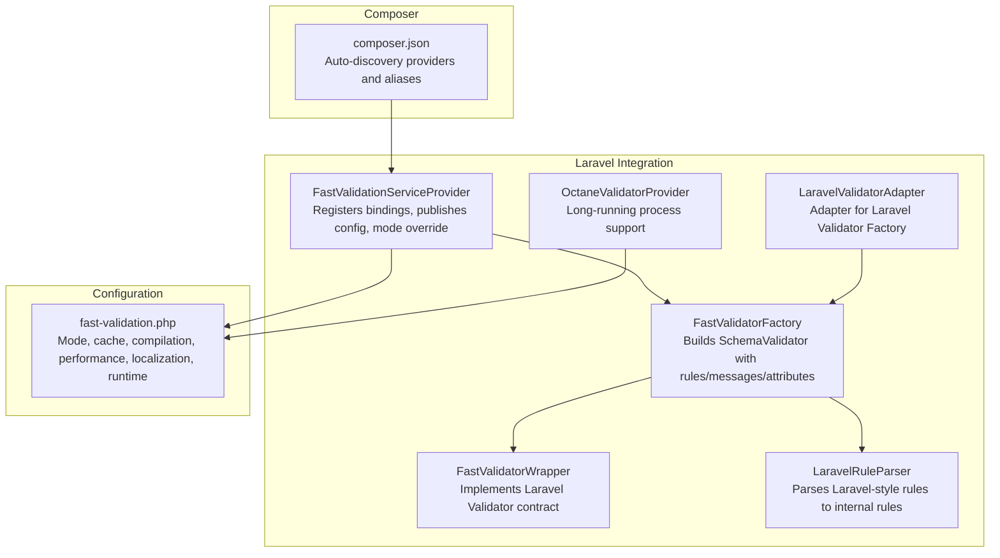
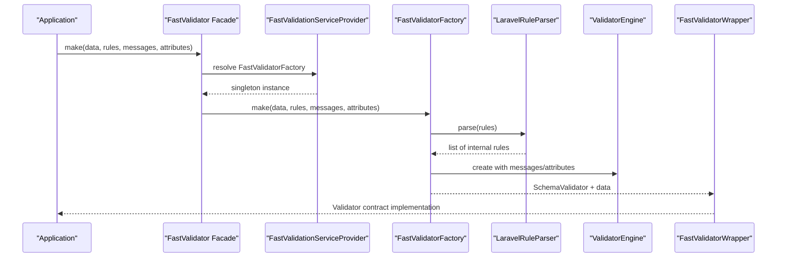
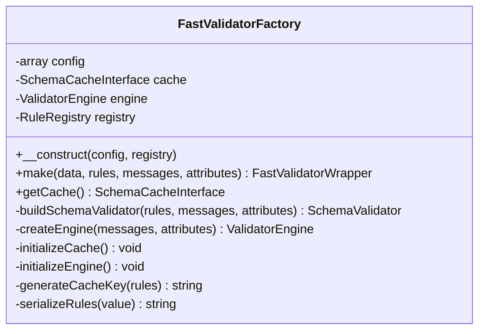
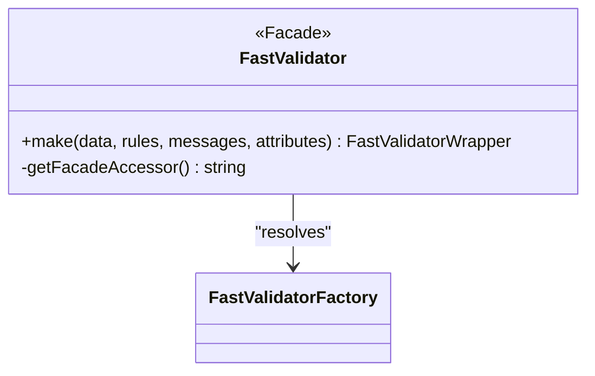
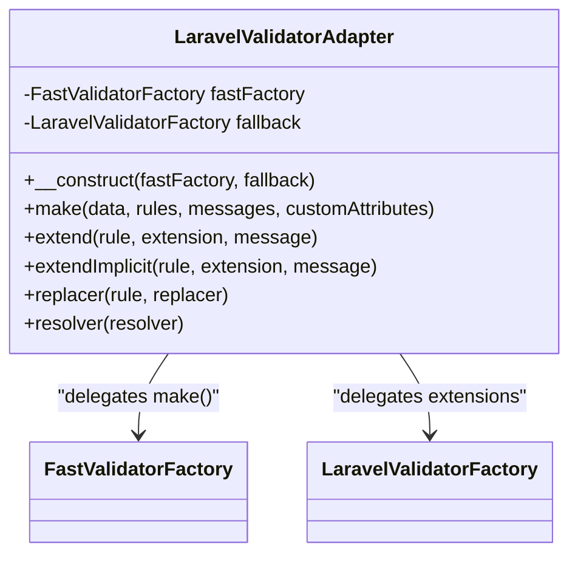
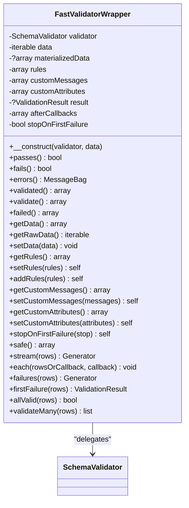
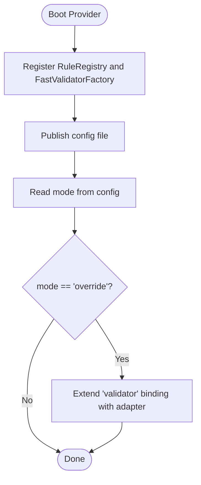
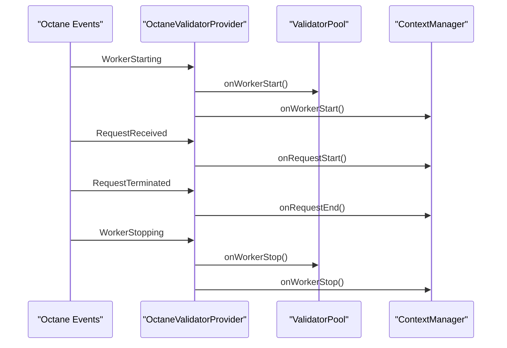
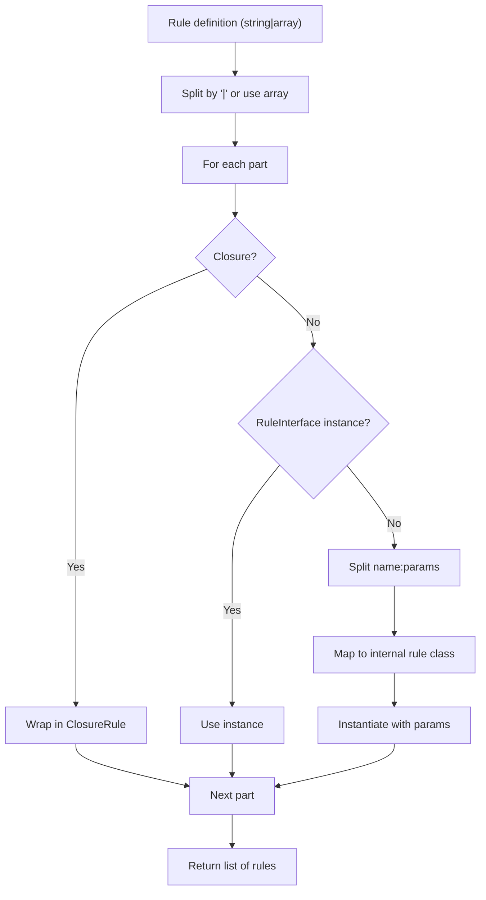
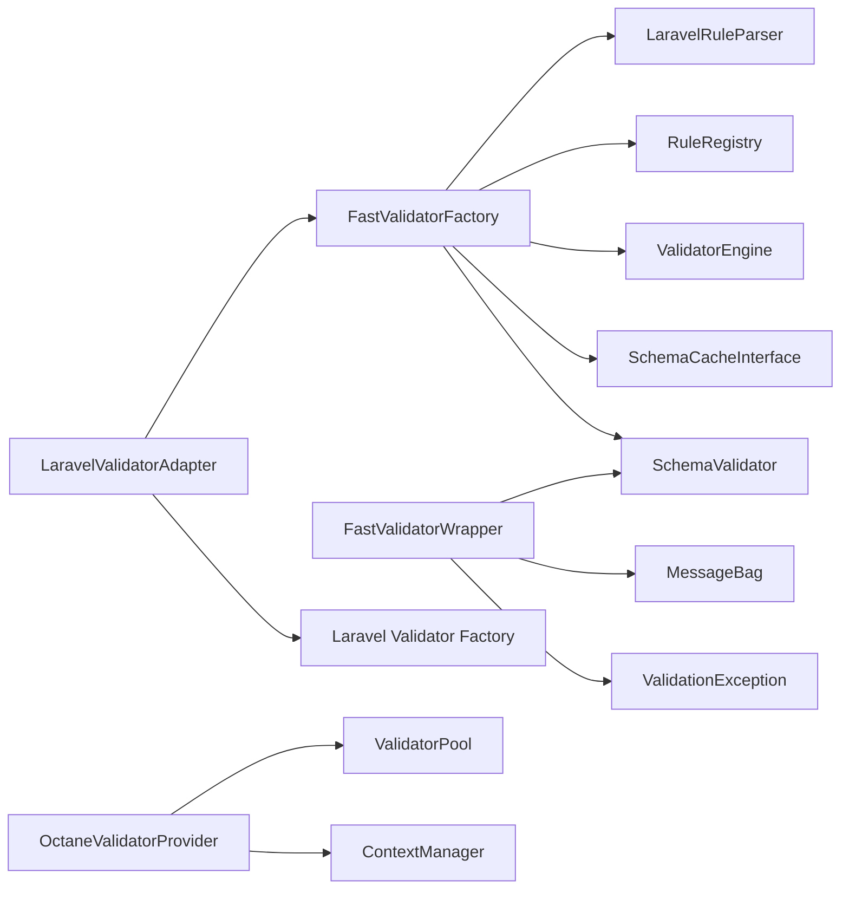

# Laravel Integration API

<cite>
**Referenced Files in This Document**
- [FastValidatorFactory.php](file://src/Laravel/FastValidatorFactory.php)
- [FastValidator.php](file://src/Laravel/Facades/FastValidator.php)
- [LaravelValidatorAdapter.php](file://src/Laravel/LaravelValidatorAdapter.php)
- [FastValidatorWrapper.php](file://src/Laravel/FastValidatorWrapper.php)
- [FastValidationServiceProvider.php](file://src/Laravel/FastValidationServiceProvider.php)
- [LaravelRuleParser.php](file://src/Laravel/LaravelRuleParser.php)
- [OctaneValidatorProvider.php](file://src/Laravel/Octane/OctaneValidatorProvider.php)
- [fast-validation.php](file://config/fast-validation.php)
- [composer.json](file://composer.json)
- [README.md](file://README.md)
</cite>

## Table of Contents
1. [Introduction](#introduction)
2. [Project Structure](#project-structure)
3. [Core Components](#core-components)
4. [Architecture Overview](#architecture-overview)
5. [Detailed Component Analysis](#detailed-component-analysis)
6. [Dependency Analysis](#dependency-analysis)
7. [Performance Considerations](#performance-considerations)
8. [Troubleshooting Guide](#troubleshooting-guide)
9. [Conclusion](#conclusion)
10. [Appendices](#appendices)

## Introduction
This document provides detailed API documentation for Laravel-specific integration components in the FastValidator package. It covers:
- FastValidatorFactory methods for creating validators in Laravel applications
- FastValidator facade usage
- LaravelValidatorAdapter for adapter pattern implementation
- FastValidatorWrapper for enhanced functionality
- Laravel service provider registration, configuration options, and integration patterns
- Examples of parallel mode, override mode, and Octane compatibility
- Facade methods, configuration parameters, and Laravel-specific validation behaviors

## Project Structure
The Laravel integration resides primarily under the Laravel namespace with supporting components for caching, compilation, runtime, and messaging.

**Diagram sources**
- [FastValidationServiceProvider.php](file://src/Laravel/FastValidationServiceProvider.php#L12-L54)
- [FastValidatorFactory.php](file://src/Laravel/FastValidatorFactory.php#L19-L207)
- [FastValidatorWrapper.php](file://src/Laravel/FastValidatorWrapper.php#L14-L400)
- [LaravelValidatorAdapter.php](file://src/Laravel/LaravelValidatorAdapter.php#L9-L56)
- [LaravelRuleParser.php](file://src/Laravel/LaravelRuleParser.php#L12-L118)
- [OctaneValidatorProvider.php](file://src/Laravel/Octane/OctaneValidatorProvider.php#L18-L88)
- [fast-validation.php](file://config/fast-validation.php#L5-L97)
- [composer.json](file://composer.json#L23-L32)

**Section sources**
- [FastValidationServiceProvider.php](file://src/Laravel/FastValidationServiceProvider.php#L12-L54)
- [fast-validation.php](file://config/fast-validation.php#L5-L97)
- [composer.json](file://composer.json#L23-L32)

## Core Components
This section documents the primary Laravel integration APIs and their capabilities.

- FastValidatorFactory
  - Purpose: Creates a SchemaValidator configured with rules, messages, attributes, and engine settings.
  - Key methods:
    - make(data, rules, messages = [], attributes = []): Returns a FastValidatorWrapper implementing the Laravel Validator contract.
    - getCache(): Returns the active schema cache instance or null.
  - Behavior:
    - Parses Laravel-style rules via LaravelRuleParser.
    - Builds a CompiledSchema and caches it when enabled.
    - Initializes a ValidatorEngine with localization and performance options.

- FastValidator Wrapper
  - Purpose: Bridges the underlying SchemaValidator to Laravel’s Validator interface and adds streaming/validation helpers.
  - Key methods:
    - passes()/fails(): Runs validation and triggers after callbacks.
    - errors(): Returns a Laravel MessageBag of formatted messages.
    - validated()/validate(): Returns validated data or throws ValidationException.
    - failed(): Returns raw error details keyed by rule.
    - getData()/getRawData(): Access validated data or the original iterable.
    - setData()/getRules()/setRules()/addRules(): Dynamic rule/data management.
    - stopOnFirstFailure(): Enables fail-fast behavior.
    - stream()/each()/failures()/firstFailure()/allValid()/validateMany(): Streaming and batch validation helpers.

- LaravelValidatorAdapter
  - Purpose: Wraps Laravel’s Validator Factory to route make() calls to FastValidatorFactory when applicable, falling back to the original factory otherwise.
  - Key methods:
    - make(data, rules, messages = [], customAttributes = []): Delegates to FastValidatorFactory::make().
    - extend()/extendImplicit()/replacer()/resolver(): Delegates to the fallback factory.

- FastValidator Facade
  - Purpose: Provides a convenient alias to FastValidatorFactory for static usage.
  - Methods:
    - make(data, rules, messages = [], attributes = []): Delegates to the bound factory.

**Section sources**
- [FastValidatorFactory.php](file://src/Laravel/FastValidatorFactory.php#L43-L144)
- [FastValidatorWrapper.php](file://src/Laravel/FastValidatorWrapper.php#L69-L398)
- [LaravelValidatorAdapter.php](file://src/Laravel/LaravelValidatorAdapter.php#L21-L54)
- [FastValidator.php](file://src/Laravel/Facades/FastValidator.php#L11-L22)

## Architecture Overview
The Laravel integration follows a layered architecture:
- Service Provider registers bindings and applies mode selection.
- Factory builds validators with parsed rules and engine configuration.
- Wrapper adapts the validator to Laravel’s contract and exposes advanced APIs.
- Adapter optionally intercepts Laravel’s Validator::make() to use the fast engine.
- Octane provider manages pools and context for long-running environments.

**Diagram sources**
- [FastValidator.php](file://src/Laravel/Facades/FastValidator.php#L16-L22)
- [FastValidationServiceProvider.php](file://src/Laravel/FastValidationServiceProvider.php#L22-L30)
- [FastValidatorFactory.php](file://src/Laravel/FastValidatorFactory.php#L51-L60)
- [LaravelRuleParser.php](file://src/Laravel/LaravelRuleParser.php#L28-L61)

## Detailed Component Analysis

### FastValidatorFactory
- Responsibilities:
  - Parse Laravel rules into internal rules.
  - Build and cache CompiledSchema.
  - Initialize ValidatorEngine with localization and performance settings.
  - Construct SchemaValidator and wrap it in FastValidatorWrapper.
- Key behaviors:
  - Cache key generation handles closures and objects to avoid caching unstable rule sets.
  - Custom messages and attributes are applied to the MessageResolver.
  - Performance options include fail_fast and max_errors.

**Diagram sources**
- [FastValidatorFactory.php](file://src/Laravel/FastValidatorFactory.php#L19-L207)

**Section sources**
- [FastValidatorFactory.php](file://src/Laravel/FastValidatorFactory.php#L30-L207)

### FastValidator Facade
- Purpose: Static access to FastValidatorFactory via the container.
- Behavior: Uses the FastValidatorFactory binding and forwards make() calls.

**Diagram sources**
- [FastValidator.php](file://src/Laravel/Facades/FastValidator.php#L16-L22)

**Section sources**
- [FastValidator.php](file://src/Laravel/Facades/FastValidator.php#L11-L22)

### LaravelValidatorAdapter
- Purpose: Adapter pattern to integrate FastValidatorFactory with Laravel’s Validator Factory.
- Behavior:
  - Routes make() to FastValidatorFactory::make().
  - Delegates extension and resolver methods to the original factory.

**Diagram sources**
- [LaravelValidatorAdapter.php](file://src/Laravel/LaravelValidatorAdapter.php#L9-L56)

**Section sources**
- [LaravelValidatorAdapter.php](file://src/Laravel/LaravelValidatorAdapter.php#L15-L54)

### FastValidatorWrapper
- Purpose: Implements Laravel’s Validator contract and enhances with streaming and batch validation APIs.
- Key methods and behaviors:
  - passes()/fails(): Execute validation and trigger after callbacks.
  - errors(): Converts ValidationResult messages to Laravel MessageBag.
  - validated()/validate(): Return validated data or throw ValidationException.
  - failed(): Return raw error details keyed by rule.
  - stream()/each()/failures()/firstFailure()/allValid()/validateMany(): Streaming and batch helpers for large datasets.

**Diagram sources**
- [FastValidatorWrapper.php](file://src/Laravel/FastValidatorWrapper.php#L14-L400)

**Section sources**
- [FastValidatorWrapper.php](file://src/Laravel/FastValidatorWrapper.php#L43-L398)

### Laravel Service Provider and Configuration
- FastValidationServiceProvider
  - Registers RuleRegistry singleton and FastValidatorFactory with config.
  - Publishes configuration file.
  - Applies override mode by extending the 'validator' binding when configured.
- Configuration options
  - mode: 'parallel' or 'override'.
  - cache: enabled, driver, ttl, path.
  - compilation: precompile, cache_path.
  - performance: fail_fast, max_errors, fast_path_rules.
  - localization: locale, fallback_locale.
  - runtime: pooling, pool_size, auto_detect.

**Diagram sources**
- [FastValidationServiceProvider.php](file://src/Laravel/FastValidationServiceProvider.php#L14-L52)
- [fast-validation.php](file://config/fast-validation.php#L15-L95)

**Section sources**
- [FastValidationServiceProvider.php](file://src/Laravel/FastValidationServiceProvider.php#L14-L52)
- [fast-validation.php](file://config/fast-validation.php#L5-L97)

### Octane Compatibility
- OctaneValidatorProvider
  - Registers ValidatorPool and ContextManager singletons based on runtime config.
  - Subscribes to Octane lifecycle events to manage worker/request contexts.
- Integration patterns
  - Validator pooling reduces allocation overhead in long-running workers.
  - Context manager resets state per request.

**Diagram sources**
- [OctaneValidatorProvider.php](file://src/Laravel/Octane/OctaneValidatorProvider.php#L44-L66)

**Section sources**
- [OctaneValidatorProvider.php](file://src/Laravel/Octane/OctaneValidatorProvider.php#L18-L88)

### Laravel Rule Parser
- Purpose: Translates Laravel-style rule strings and arrays into internal RuleInterface instances.
- Features:
  - Supports closures, RuleInterface instances, and named rules with parameters.
  - Handles parameter parsing and rule instantiation with appropriate constructor arguments.

**Diagram sources**
- [LaravelRuleParser.php](file://src/Laravel/LaravelRuleParser.php#L28-L116)

**Section sources**
- [LaravelRuleParser.php](file://src/Laravel/LaravelRuleParser.php#L12-L118)

## Dependency Analysis
- Internal dependencies:
  - FastValidatorFactory depends on SchemaBuilder, LaravelRuleParser, RuleRegistry, SchemaValidator, ValidatorEngine, MessageResolver, Translator, and cache implementations.
  - FastValidatorWrapper depends on SchemaValidator and Laravel’s MessageBag and ValidationException.
  - LaravelValidatorAdapter depends on FastValidatorFactory and the Laravel Validator Factory.
  - OctaneValidatorProvider depends on ValidatorPool and ContextManager.
- External dependencies:
  - illuminate/validation is required for Laravel integration.
- Composer auto-discovery:
  - Providers and aliases are registered automatically.

**Diagram sources**
- [FastValidatorFactory.php](file://src/Laravel/FastValidatorFactory.php#L7-L17)
- [FastValidatorWrapper.php](file://src/Laravel/FastValidatorWrapper.php#L8-L12)
- [LaravelValidatorAdapter.php](file://src/Laravel/LaravelValidatorAdapter.php#L7-L19)
- [OctaneValidatorProvider.php](file://src/Laravel/Octane/OctaneValidatorProvider.php#L12-L31)

**Section sources**
- [composer.json](file://composer.json#L6-L9)
- [FastValidatorFactory.php](file://src/Laravel/FastValidatorFactory.php#L7-L17)
- [FastValidatorWrapper.php](file://src/Laravel/FastValidatorWrapper.php#L8-L12)
- [LaravelValidatorAdapter.php](file://src/Laravel/LaravelValidatorAdapter.php#L7-L19)
- [OctaneValidatorProvider.php](file://src/Laravel/Octane/OctaneValidatorProvider.php#L12-L31)

## Performance Considerations
- Streaming and batch validation:
  - Prefer stream(), each(), and failures() for large datasets to avoid memory accumulation.
  - Use validateMany() only for small datasets.
- Fail-fast and error limits:
  - Configure fail_fast and max_errors to reduce processing overhead.
- Caching:
  - Enable schema caching with array or file drivers to reuse compiled schemas.
- Octane pooling:
  - Enable pooling and configure pool_size for high-concurrency long-running environments.

[No sources needed since this section provides general guidance]

## Troubleshooting Guide
- Override mode not taking effect:
  - Ensure mode is set to 'override' and the provider is registered.
  - Verify that the ruleset is compatible with the fast path; unsupported rules fall back to the original factory.
- Caching issues:
  - Confirm cache.enabled and cache.driver settings.
  - For file driver, ensure the cache path exists and is writable.
- Octane state leaks:
  - Use the Octane provider to manage pools and reset context per request.
- Validation exceptions:
  - Use validated() or validate() to throw ValidationException on failure.
  - Inspect errors() or failed() for detailed error information.

**Section sources**
- [FastValidationServiceProvider.php](file://src/Laravel/FastValidationServiceProvider.php#L38-L52)
- [fast-validation.php](file://config/fast-validation.php#L26-L95)
- [OctaneValidatorProvider.php](file://src/Laravel/Octane/OctaneValidatorProvider.php#L44-L66)
- [FastValidatorWrapper.php](file://src/Laravel/FastValidatorWrapper.php#L123-L139)

## Conclusion
The Laravel integration provides a high-performance, drop-in replacement for Laravel’s validation engine with optional override mode, extensive configuration, and robust streaming APIs. The adapter pattern ensures backward compatibility, while Octane support enables efficient long-running deployments.

[No sources needed since this section summarizes without analyzing specific files]

## Appendices

### API Reference: FastValidatorFactory
- make(data, rules, messages = [], attributes = []): FastValidatorWrapper
- getCache(): SchemaCacheInterface|null

**Section sources**
- [FastValidatorFactory.php](file://src/Laravel/FastValidatorFactory.php#L51-L68)

### API Reference: FastValidator Wrapper
- passes()/fails(): bool
- errors(): MessageBag
- validated()/validate(): array
- failed(): array
- getData()/getRawData(): array|iterable
- setData(data): void
- getRules()/setRules(rules)/addRules(rules): array|self
- getCustomMessages()/setCustomMessages(messages): array|self
- getCustomAttributes()/setCustomAttributes(attributes): array|self
- stopOnFirstFailure(stop = true): self
- stream(rows?): Generator
- each(rowsOrCallback, callback?): void
- failures(rows?): Generator
- firstFailure(rows?): ValidationResult|null
- allValid(rows?): bool
- validateMany(rows?): list

**Section sources**
- [FastValidatorWrapper.php](file://src/Laravel/FastValidatorWrapper.php#L69-L398)

### API Reference: LaravelValidatorAdapter
- make(data, rules, messages = [], customAttributes = [])
- extend(rule, extension, message = null)
- extendImplicit(rule, extension, message = null)
- replacer(rule, replacer)
- resolver(resolver)

**Section sources**
- [LaravelValidatorAdapter.php](file://src/Laravel/LaravelValidatorAdapter.php#L27-L54)

### Configuration Options
- mode: 'parallel'|'override'
- cache.enabled: bool
- cache.driver: 'array'|'file'
- cache.ttl: int
- cache.path: string
- compilation.precompile: bool
- compilation.cache_path: string
- performance.fail_fast: bool
- performance.max_errors: int
- performance.fast_path_rules: bool
- localization.locale: string
- localization.fallback_locale: string
- runtime.pooling: bool
- runtime.pool_size: int
- runtime.auto_detect: bool

**Section sources**
- [fast-validation.php](file://config/fast-validation.php#L15-L95)

### Integration Patterns
- Parallel mode usage:
  - Resolve FastValidatorFactory from the container and call make().
- Override mode usage:
  - Keep existing Validator::make() calls; the provider routes them to the fast engine when possible.
- Octane compatibility:
  - Register OctaneValidatorProvider and enable runtime pooling.

**Section sources**
- [FastValidationServiceProvider.php](file://src/Laravel/FastValidationServiceProvider.php#L38-L52)
- [OctaneValidatorProvider.php](file://src/Laravel/Octane/OctaneValidatorProvider.php#L18-L88)
- [README.md](file://README.md#L486-L506)