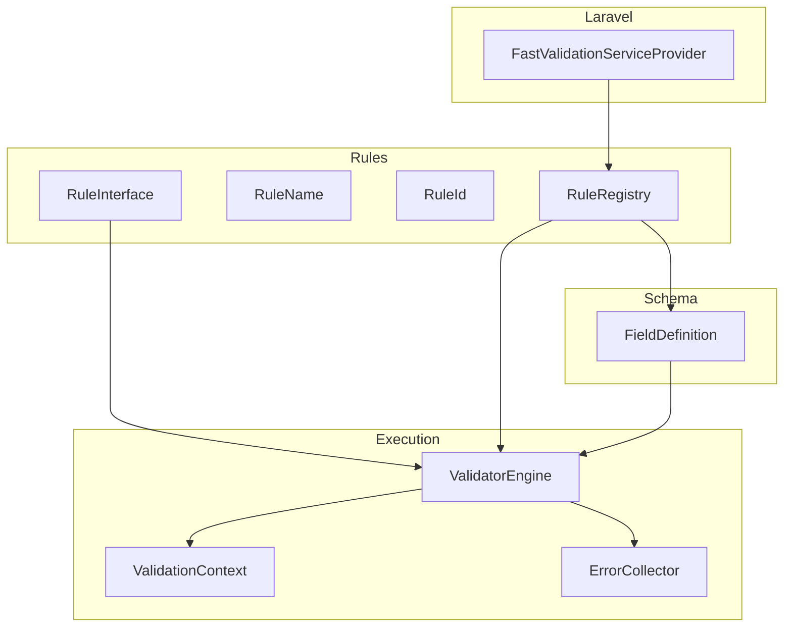
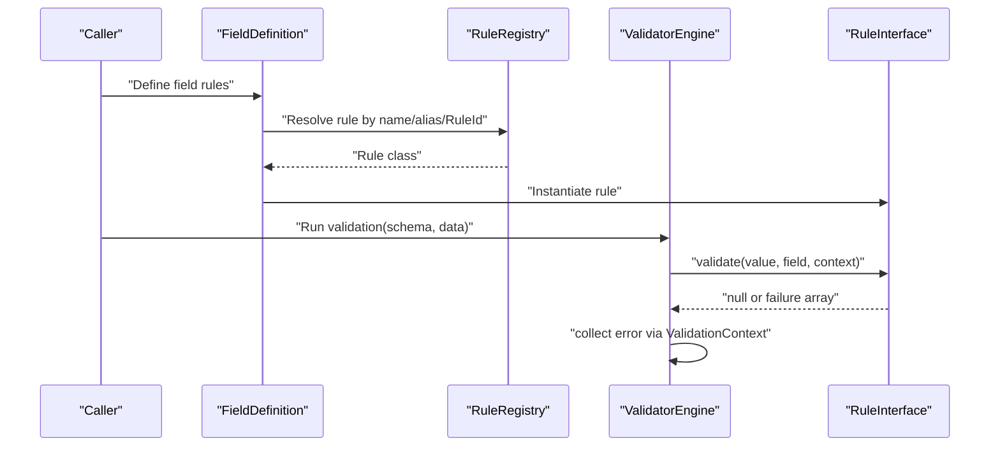
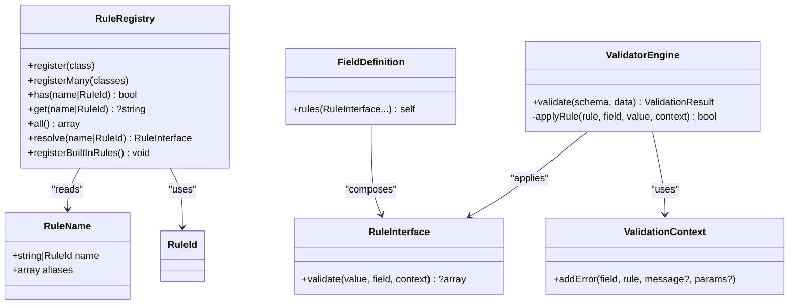
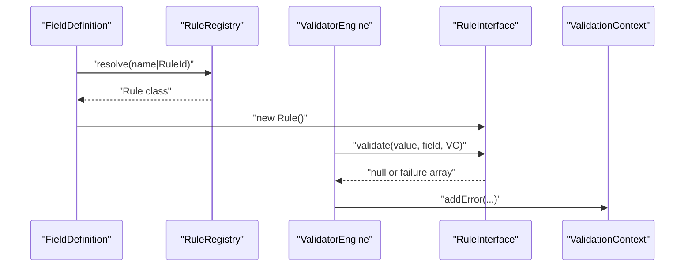

# Rule System API

<cite>
**Referenced Files in This Document**
- [RuleInterface.php](file://src/Rules/RuleInterface.php)
- [RuleRegistry.php](file://src/Rules/RuleRegistry.php)
- [RuleName.php](file://src/Rules/RuleName.php)
- [RuleId.php](file://src/Rules/RuleId.php)
- [ValidatorEngine.php](file://src/Execution/ValidatorEngine.php)
- [ValidationContext.php](file://src/Execution/ValidationContext.php)
- [ErrorCollector.php](file://src/Execution/ErrorCollector.php)
- [FieldDefinition.php](file://src/Schema/FieldDefinition.php)
- [RequiredRule.php](file://src/Rules/RequiredRule.php)
- [ClosureRule.php](file://src/Rules/ClosureRule.php)
- [DatabaseValidatorInterface.php](file://src/Rules/DatabaseValidatorInterface.php)
- [PasswordHasherInterface.php](file://src/Rules/PasswordHasherInterface.php)
- [FastValidationServiceProvider.php](file://src/Laravel/FastValidationServiceProvider.php)
- [RuleRegistryTest.php](file://tests/Unit/RuleRegistryTest.php)
</cite>

## Table of Contents
1. [Introduction](#introduction)
2. [Project Structure](#project-structure)
3. [Core Components](#core-components)
4. [Architecture Overview](#architecture-overview)
5. [Detailed Component Analysis](#detailed-component-analysis)
6. [Dependency Analysis](#dependency-analysis)
7. [Performance Considerations](#performance-considerations)
8. [Troubleshooting Guide](#troubleshooting-guide)
9. [Conclusion](#conclusion)
10. [Appendices](#appendices)

## Introduction
This document provides comprehensive API documentation for the rule system interfaces and registry. It explains how to implement custom validation rules via the RuleInterface, how to register and resolve rules using RuleRegistry, and how rule identification works with RuleName and RuleId. It also covers rule metadata handling, integration with the validation engine, and practical examples for extending the system with custom validation logic.

## Project Structure
The rule system lives under the Rules namespace and integrates with the execution engine and schema builder. Key areas:
- Rule interfaces and registry: src/Rules
- Execution engine and context: src/Execution
- Schema builder and field definitions: src/Schema
- Laravel integration: src/Laravel
- Tests for registry behavior: tests/Unit

**Diagram sources**
- [RuleInterface.php](file://src/Rules/RuleInterface.php#L9-L15)
- [RuleRegistry.php](file://src/Rules/RuleRegistry.php#L14-L301)
- [RuleName.php](file://src/Rules/RuleName.php#L10-L17)
- [RuleId.php](file://src/Rules/RuleId.php#L10-L113)
- [ValidatorEngine.php](file://src/Execution/ValidatorEngine.php#L11-L176)
- [ValidationContext.php](file://src/Execution/ValidationContext.php#L7-L97)
- [ErrorCollector.php](file://src/Execution/ErrorCollector.php#L7-L50)
- [FieldDefinition.php](file://src/Schema/FieldDefinition.php#L9-L657)
- [FastValidationServiceProvider.php](file://src/Laravel/FastValidationServiceProvider.php#L12-L53)

**Section sources**
- [RuleInterface.php](file://src/Rules/RuleInterface.php#L1-L16)
- [RuleRegistry.php](file://src/Rules/RuleRegistry.php#L1-L302)
- [RuleName.php](file://src/Rules/RuleName.php#L1-L18)
- [RuleId.php](file://src/Rules/RuleId.php#L1-L114)
- [ValidatorEngine.php](file://src/Execution/ValidatorEngine.php#L1-L177)
- [ValidationContext.php](file://src/Execution/ValidationContext.php#L1-L98)
- [ErrorCollector.php](file://src/Execution/ErrorCollector.php#L1-L51)
- [FieldDefinition.php](file://src/Schema/FieldDefinition.php#L1-L658)
- [FastValidationServiceProvider.php](file://src/Laravel/FastValidationServiceProvider.php#L1-L54)

## Core Components
- RuleInterface: Defines the contract for all validation rules. Each rule must implement a validate method returning either null (pass) or an associative array describing the failure.
- RuleRegistry: Central registry for mapping rule names and aliases to rule classes, resolving instances, and registering built-in rules.
- RuleName: Attribute applied to rule classes to declare the primary rule name and optional aliases.
- RuleId: Enum of built-in rule identifiers used to standardize rule names programmatically.
- ValidatorEngine: Executes compiled schemas, applies rules, collects errors, and manages implicit rules and bail behavior.
- ValidationContext: Provides access to input data, error collection, and optional integrations (database validator, password hasher).
- ErrorCollector: Aggregates validation failures per field.
- FieldDefinition: Fluent builder for field rules; constructs lists of RuleInterface instances for a field.
- Laravel integration: Service provider registers the RuleRegistry singleton and built-in rules.

**Section sources**
- [RuleInterface.php](file://src/Rules/RuleInterface.php#L9-L15)
- [RuleRegistry.php](file://src/Rules/RuleRegistry.php#L14-L301)
- [RuleName.php](file://src/Rules/RuleName.php#L10-L17)
- [RuleId.php](file://src/Rules/RuleId.php#L10-L113)
- [ValidatorEngine.php](file://src/Execution/ValidatorEngine.php#L11-L176)
- [ValidationContext.php](file://src/Execution/ValidationContext.php#L7-L97)
- [ErrorCollector.php](file://src/Execution/ErrorCollector.php#L7-L50)
- [FieldDefinition.php](file://src/Schema/FieldDefinition.php#L9-L657)
- [FastValidationServiceProvider.php](file://src/Laravel/FastValidationServiceProvider.php#L12-L30)

## Architecture Overview
The rule system follows a registry-driven pattern:
- Rule classes declare identity via RuleName (or RuleId).
- RuleRegistry stores mappings from names/aliases to rule classes and caches metadata.
- FieldDefinition builds lists of RuleInterface instances for each field.
- ValidatorEngine iterates fields, applies rules, and records failures.

**Diagram sources**
- [FieldDefinition.php](file://src/Schema/FieldDefinition.php#L303-L307)
- [RuleRegistry.php](file://src/Rules/RuleRegistry.php#L180-L190)
- [ValidatorEngine.php](file://src/Execution/ValidatorEngine.php#L164-L175)
- [ValidationContext.php](file://src/Execution/ValidationContext.php#L93-L96)

## Detailed Component Analysis

### RuleInterface Specification
- Purpose: Contract that all validation rules must implement.
- Method: validate(value, field, context) -> ?array
  - Returns null to indicate pass.
  - Returns an associative array describing the failure (typically containing rule name and optional message/params).
- Integration: ValidatorEngine.applyRule invokes validate and records errors via ValidationContext.

Implementation patterns:
- Simple checks returning failure arrays with rule identifiers.
- Closure-based rules that capture a fail message and return it on failure.

**Section sources**
- [RuleInterface.php](file://src/Rules/RuleInterface.php#L9-L15)
- [ValidatorEngine.php](file://src/Execution/ValidatorEngine.php#L164-L175)
- [ValidationContext.php](file://src/Execution/ValidationContext.php#L93-L96)

### RuleRegistry Methods and Behavior
Key methods:
- register(class-string): Registers a single rule class by reading its RuleName attribute and caching metadata. Enforces uniqueness of names and aliases.
- registerMany(classes): Bulk registration.
- has(name|RuleId): Checks existence by primary name, alias, or RuleId.
- get(name|RuleId): Resolves the rule class string; supports aliases and RuleId.
- all(): Returns all registered primary names mapped to rule classes.
- resolve(name|RuleId): Instantiates the rule class; throws if unknown.
- registerBuiltInRules(): Registers all built-in rules by their classes.

Metadata handling:
- Uses reflection to read RuleName attributes and cache name/aliases per class.
- Supports RuleId values for programmatic rule naming.

Conflict detection:
- Prevents duplicate rule names or aliases and ensures consistency across primary names and aliases.

**Section sources**
- [RuleRegistry.php](file://src/Rules/RuleRegistry.php#L30-L116)
- [RuleRegistry.php](file://src/Rules/RuleRegistry.php#L133-L190)
- [RuleRegistry.php](file://src/Rules/RuleRegistry.php#L195-L300)
- [RuleName.php](file://src/Rules/RuleName.php#L10-L17)
- [RuleId.php](file://src/Rules/RuleId.php#L10-L113)

### RuleName and RuleId Classes
- RuleName: Attribute applied to rule classes with:
  - name: string or RuleId
  - aliases: array of string aliases
- RuleId: Enum of standardized built-in rule identifiers (e.g., required, email, unique, etc.).

Usage:
- Built-in rules annotate themselves with RuleName(RuleId::...).
- Custom rules can use either a string name or a RuleId for consistency.

**Section sources**
- [RuleName.php](file://src/Rules/RuleName.php#L10-L17)
- [RuleId.php](file://src/Rules/RuleId.php#L10-L113)
- [RequiredRule.php](file://src/Rules/RequiredRule.php#L9-L10)

### Implementing RuleInterface Examples
- Basic rule: See RequiredRule.validate returning failure when value is empty/null/empty string.
- Closure-based rule: See ClosureRule wrapping a callback and returning a failure message when the callback calls fail.

Guidelines:
- Always return null on success.
- On failure, return an array with at least the rule identifier; optionally include message and parameters.
- Use ValidationContext to access data and add errors.

**Section sources**
- [RequiredRule.php](file://src/Rules/RequiredRule.php#L12-L27)
- [ClosureRule.php](file://src/Rules/ClosureRule.php#L31-L49)
- [ValidationContext.php](file://src/Execution/ValidationContext.php#L93-L96)

### Accessing Registered Rules
- From FieldDefinition: Add RuleInterface instances directly via rules(...) or fluent helpers (e.g., email(), required(), etc.).
- From Registry: resolve(name|RuleId) to instantiate a rule; has/get for existence and lookup.

Integration:
- Laravel service provider registers RuleRegistry singleton and built-in rules automatically.

**Section sources**
- [FieldDefinition.php](file://src/Schema/FieldDefinition.php#L303-L307)
- [FieldDefinition.php](file://src/Schema/FieldDefinition.php#L171-L181)
- [RuleRegistry.php](file://src/Rules/RuleRegistry.php#L180-L190)
- [FastValidationServiceProvider.php](file://src/Laravel/FastValidationServiceProvider.php#L16-L20)

### Rule Registration Patterns
- Built-in registration: registerBuiltInRules() registers all core rules.
- Manual registration: register(...) for custom rules annotated with RuleName.
- Alias support: RuleName accepts aliases; registry resolves aliases transparently.

Best practices:
- Use RuleId for built-in rules to avoid typos and ensure consistency.
- Choose unique primary names and non-conflicting aliases.
- Re-registering the same class is safe and idempotent.

**Section sources**
- [RuleRegistry.php](file://src/Rules/RuleRegistry.php#L195-L300)
- [RuleRegistry.php](file://src/Rules/RuleRegistry.php#L30-L116)
- [RuleRegistryTest.php](file://tests/Unit/RuleRegistryTest.php#L25-L52)

### Integration with the Validation Engine
- ValidatorEngine.validate iterates fields, applies rules, and handles:
  - Implicit rules vs. non-implicit rules
  - Bail behavior
  - Fail-fast and max-errors limits
- applyRule calls RuleInterface.validate and records failures via ValidationContext.

**Section sources**
- [ValidatorEngine.php](file://src/Execution/ValidatorEngine.php#L33-L98)
- [ValidatorEngine.php](file://src/Execution/ValidatorEngine.php#L127-L175)
- [ValidationContext.php](file://src/Execution/ValidationContext.php#L93-L96)

### Extending the Rule System with Custom Validation Logic
Steps:
1. Create a class implementing RuleInterface.
2. Annotate it with #[RuleName] specifying a unique name and optional aliases, or use RuleId for consistency.
3. Register the rule class with RuleRegistry.register or include it in registerBuiltInRules.
4. Use the rule in FieldDefinition via rules(...) or the appropriate fluent method.
5. Optionally integrate external services via ValidationContext (e.g., database validation, password hashing).

Interfaces for integrations:
- DatabaseValidatorInterface: Implement to support rules requiring database checks (exists, unique).
- PasswordHasherInterface: Implement to support current password checks.

**Section sources**
- [RuleInterface.php](file://src/Rules/RuleInterface.php#L9-L15)
- [RuleName.php](file://src/Rules/RuleName.php#L10-L17)
- [RuleRegistry.php](file://src/Rules/RuleRegistry.php#L30-L116)
- [FieldDefinition.php](file://src/Schema/FieldDefinition.php#L303-L307)
- [DatabaseValidatorInterface.php](file://src/Rules/DatabaseValidatorInterface.php#L11-L36)
- [PasswordHasherInterface.php](file://src/Rules/PasswordHasherInterface.php#L13-L22)

## Dependency Analysis
High-level dependencies:
- RuleRegistry depends on RuleName metadata and RuleId enumeration.
- ValidatorEngine depends on RuleInterface implementations and ValidationContext.
- FieldDefinition composes RuleInterface instances and feeds them to the engine.
- Laravel service provider wires RuleRegistry into the container and registers built-ins.

**Diagram sources**
- [RuleInterface.php](file://src/Rules/RuleInterface.php#L9-L15)
- [RuleName.php](file://src/Rules/RuleName.php#L10-L17)
- [RuleId.php](file://src/Rules/RuleId.php#L10-L113)
- [RuleRegistry.php](file://src/Rules/RuleRegistry.php#L14-L301)
- [ValidatorEngine.php](file://src/Execution/ValidatorEngine.php#L11-L176)
- [ValidationContext.php](file://src/Execution/ValidationContext.php#L7-L97)
- [FieldDefinition.php](file://src/Schema/FieldDefinition.php#L9-L657)

**Section sources**
- [RuleRegistry.php](file://src/Rules/RuleRegistry.php#L14-L301)
- [ValidatorEngine.php](file://src/Execution/ValidatorEngine.php#L11-L176)
- [FieldDefinition.php](file://src/Schema/FieldDefinition.php#L9-L657)

## Performance Considerations
- Metadata caching: RuleRegistry caches rule metadata to avoid repeated reflection overhead.
- Early exit: ValidatorEngine supports bail and fail-fast to reduce unnecessary work.
- Implicit rules: Certain rules bypass empty-value checks to minimize redundant validations.

Recommendations:
- Prefer RuleId for built-in rules to leverage enum-based comparisons.
- Keep rule implementations efficient; avoid heavy computations inside validate.
- Use aliases judiciously to maintain clarity without bloating the registry.

**Section sources**
- [RuleRegistry.php](file://src/Rules/RuleRegistry.php#L22-L50)
- [ValidatorEngine.php](file://src/Execution/ValidatorEngine.php#L127-L159)

## Troubleshooting Guide
Common issues and resolutions:
- Unknown rule resolution: resolve throws an exception for unknown names/aliases/RuleId. Verify registration and spelling.
- Duplicate rule name or alias: LogicException indicates a conflict. Ensure unique names and aliases.
- Missing RuleName attribute: register throws for classes without the attribute. Apply #[RuleName] to all rule classes.
- Empty values and implicit rules: Non-implicit rules skip empty values; implicit rules run regardless. Adjust expectations accordingly.

Validation flow checks:
- applyRule records failures via ValidationContext; confirm that errors are being added and collected.

**Section sources**
- [RuleRegistry.php](file://src/Rules/RuleRegistry.php#L36-L41)
- [RuleRegistry.php](file://src/Rules/RuleRegistry.php#L56-L78)
- [RuleRegistry.php](file://src/Rules/RuleRegistry.php#L184-L189)
- [ValidatorEngine.php](file://src/Execution/ValidatorEngine.php#L164-L175)
- [RuleRegistryTest.php](file://tests/Unit/RuleRegistryTest.php#L25-L103)

## Conclusion
The rule system provides a robust, extensible framework for validation:
- RuleInterface defines a minimal contract for rule behavior.
- RuleRegistry centralizes discovery, resolution, and metadata handling.
- RuleName and RuleId standardize rule identity and aliases.
- ValidatorEngine orchestrates rule execution with configurable behavior.
- Laravel integration simplifies registration and adoption.

By following the documented patterns, you can reliably add custom rules and integrate them into the validation pipeline.

## Appendices

### API Reference Tables

RuleInterface.validate signature
- Inputs
  - value: mixed
  - field: string
  - context: ValidationContext
- Output
  - null on pass
  - array with keys including rule and optionally message/params on failure

RuleRegistry methods
- register(class-string): Registers a rule class
- registerMany(array<class-string>): Bulk register
- has(name|RuleId): Existence check
- get(name|RuleId): Resolve class string
- all(): Return all registered rules
- resolve(name|RuleId): Instantiate rule
- registerBuiltInRules(): Register built-in rules

RuleName attribute fields
- name: string|RuleId
- aliases: array<string>

RuleId enum entries (selected)
- required, email, unique, exists, nullable, between, in, not_in, etc.

Validation flow (sequence)

**Diagram sources**
- [FieldDefinition.php](file://src/Schema/FieldDefinition.php#L303-L307)
- [RuleRegistry.php](file://src/Rules/RuleRegistry.php#L180-L190)
- [ValidatorEngine.php](file://src/Execution/ValidatorEngine.php#L164-L175)
- [ValidationContext.php](file://src/Execution/ValidationContext.php#L93-L96)