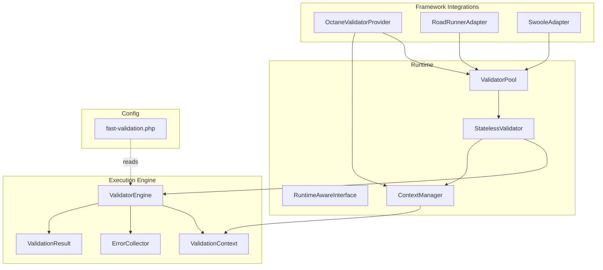
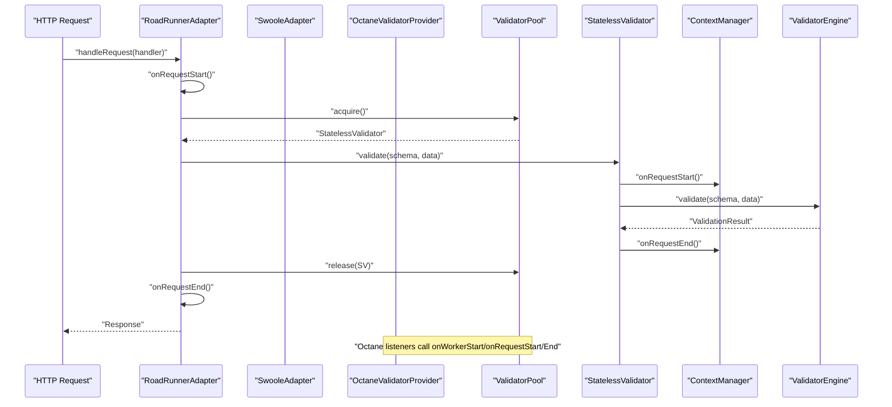
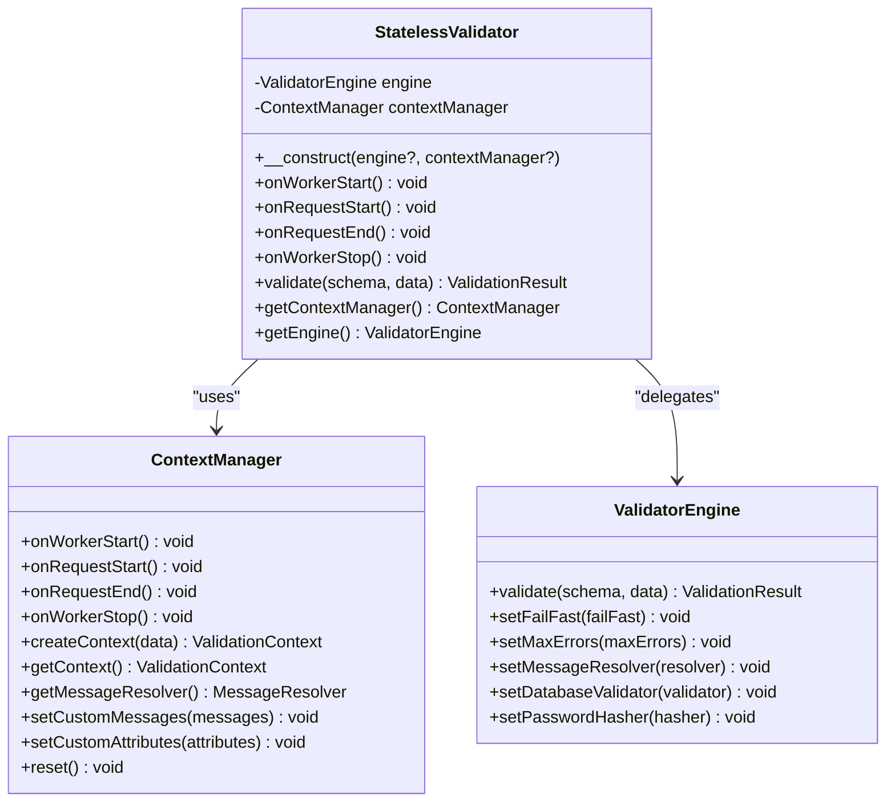
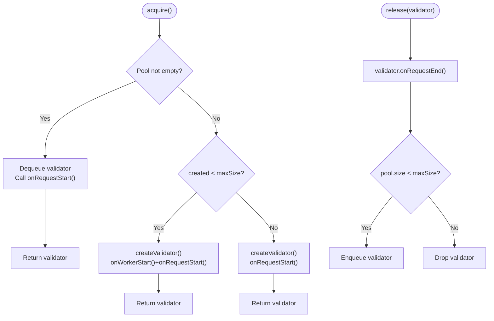
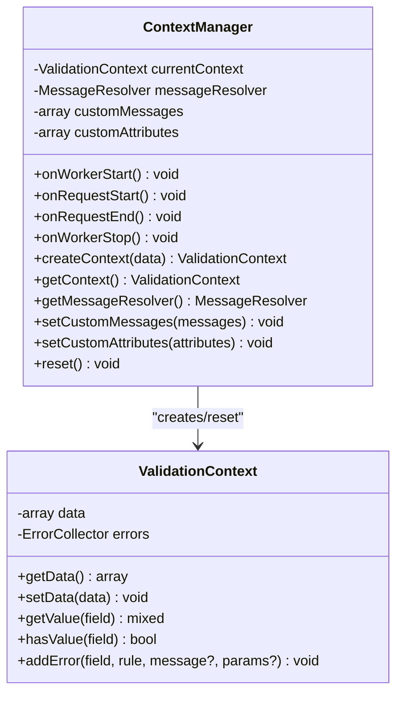
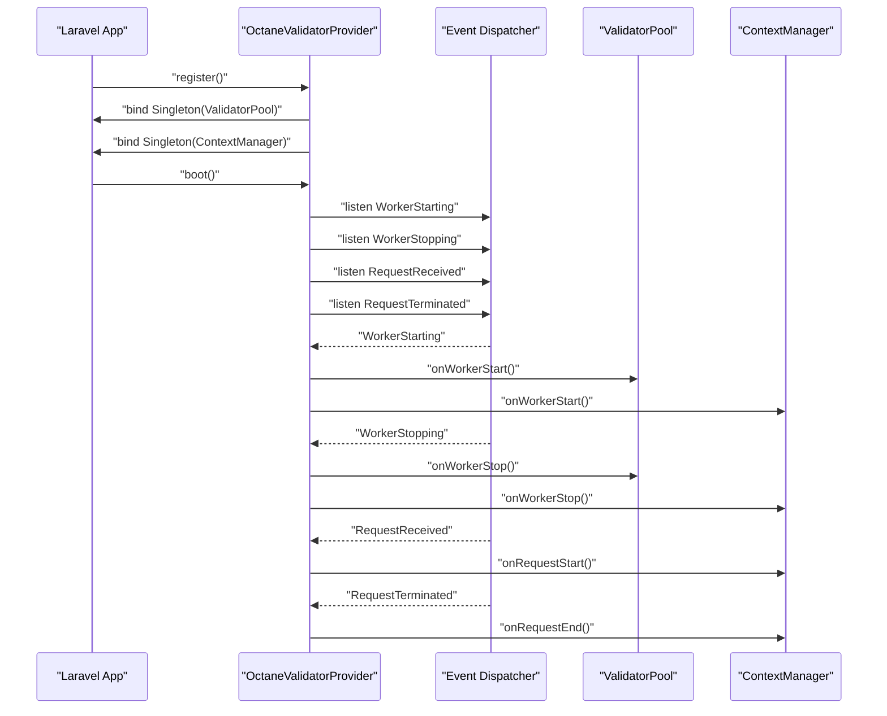
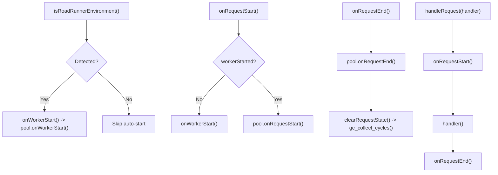
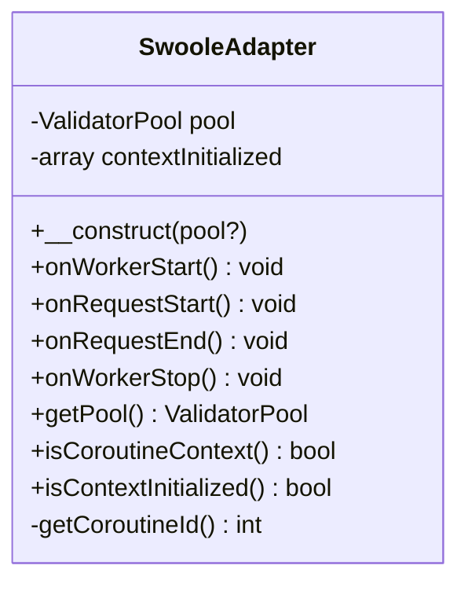
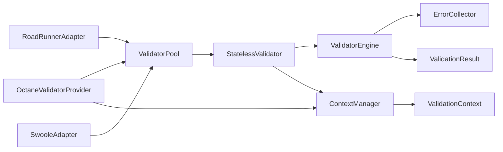

# Advanced Features

<cite>
**Referenced Files in This Document**
- [StatelessValidator.php](file://src/Runtime/StatelessValidator.php)
- [ValidatorPool.php](file://src/Runtime/ValidatorPool.php)
- [ContextManager.php](file://src/Runtime/ContextManager.php)
- [RuntimeAwareInterface.php](file://src/Runtime/RuntimeAwareInterface.php)
- [OctaneValidatorProvider.php](file://src/Laravel/Octane/OctaneValidatorProvider.php)
- [RoadRunnerAdapter.php](file://src/Runtime/Workers/RoadRunnerAdapter.php)
- [SwooleAdapter.php](file://src/Runtime/Workers/SwooleAdapter.php)
- [fast-validation.php](file://config/fast-validation.php)
- [ValidatorEngine.php](file://src/Execution/ValidatorEngine.php)
- [ValidationContext.php](file://src/Execution/ValidationContext.php)
- [ErrorCollector.php](file://src/Execution/ErrorCollector.php)
- [ValidationResult.php](file://src/Execution/ValidationResult.php)
- [composer.json](file://composer.json)
- [README.md](file://README.md)
</cite>

## Table of Contents
1. [Introduction](#introduction)
2. [Project Structure](#project-structure)
3. [Core Components](#core-components)
4. [Architecture Overview](#architecture-overview)
5. [Detailed Component Analysis](#detailed-component-analysis)
6. [Dependency Analysis](#dependency-analysis)
7. [Performance Considerations](#performance-considerations)
8. [Troubleshooting Guide](#troubleshooting-guide)
9. [Conclusion](#conclusion)
10. [Appendices](#appendices)

## Introduction
This document explains advanced features designed for long-running processes and high-concurrency environments. It covers state isolation via StatelessValidator, connection-less pooling with ValidatorPool, runtime context handling via ContextManager, and integrations with Laravel Octane, RoadRunner, and Swoole. It also documents runtime environment detection, worker lifecycle management, and practical production deployment guidance, including performance monitoring and troubleshooting strategies.

## Project Structure
The advanced features live under the Runtime namespace and integrate with execution-time components and framework adapters:
- Runtime core: StatelessValidator, ValidatorPool, ContextManager, RuntimeAwareInterface
- Framework adapters: OctaneValidatorProvider, RoadRunnerAdapter, SwooleAdapter
- Execution engine: ValidatorEngine, ValidationContext, ErrorCollector, ValidationResult
- Configuration: fast-validation.php
- Composer metadata for Laravel service provider registration

**Diagram sources**
- [RuntimeAwareInterface.php](file://src/Runtime/RuntimeAwareInterface.php#L1-L32)
- [StatelessValidator.php](file://src/Runtime/StatelessValidator.php#L1-L79)
- [ValidatorPool.php](file://src/Runtime/ValidatorPool.php#L1-L140)
- [ContextManager.php](file://src/Runtime/ContextManager.php#L1-L119)
- [OctaneValidatorProvider.php](file://src/Laravel/Octane/OctaneValidatorProvider.php#L1-L88)
- [RoadRunnerAdapter.php](file://src/Runtime/Workers/RoadRunnerAdapter.php#L1-L107)
- [SwooleAdapter.php](file://src/Runtime/Workers/SwooleAdapter.php#L1-L95)
- [ValidatorEngine.php](file://src/Execution/ValidatorEngine.php#L1-L177)
- [ValidationContext.php](file://src/Execution/ValidationContext.php#L1-L98)
- [ErrorCollector.php](file://src/Execution/ErrorCollector.php#L1-L51)
- [ValidationResult.php](file://src/Execution/ValidationResult.php#L1-L142)
- [fast-validation.php](file://config/fast-validation.php#L1-L97)

**Section sources**
- [RuntimeAwareInterface.php](file://src/Runtime/RuntimeAwareInterface.php#L1-L32)
- [StatelessValidator.php](file://src/Runtime/StatelessValidator.php#L1-L79)
- [ValidatorPool.php](file://src/Runtime/ValidatorPool.php#L1-L140)
- [ContextManager.php](file://src/Runtime/ContextManager.php#L1-L119)
- [OctaneValidatorProvider.php](file://src/Laravel/Octane/OctaneValidatorProvider.php#L1-L88)
- [RoadRunnerAdapter.php](file://src/Runtime/Workers/RoadRunnerAdapter.php#L1-L107)
- [SwooleAdapter.php](file://src/Runtime/Workers/SwooleAdapter.php#L1-L95)
- [ValidatorEngine.php](file://src/Execution/ValidatorEngine.php#L1-L177)
- [ValidationContext.php](file://src/Execution/ValidationContext.php#L1-L98)
- [ErrorCollector.php](file://src/Execution/ErrorCollector.php#L1-L51)
- [ValidationResult.php](file://src/Execution/ValidationResult.php#L1-L142)
- [fast-validation.php](file://config/fast-validation.php#L1-L97)
- [composer.json](file://composer.json#L1-L36)

## Core Components
- StatelessValidator: Wraps ValidatorEngine and ContextManager to enforce request-scoped lifecycle hooks and prevent state leakage across requests.
- ValidatorPool: Reuses StatelessValidator instances to reduce allocation overhead in long-running workers.
- ContextManager: Manages per-request ValidationContext and message resolution state, resetting between requests.
- RuntimeAwareInterface: Defines onWorkerStart/onRequestStart/onRequestEnd/onWorkerStop lifecycle hooks used across adapters and pools.
- OctaneValidatorProvider: Registers and wires ValidatorPool and ContextManager in Laravel Octane, listening to Octane lifecycle events.
- RoadRunnerAdapter and SwooleAdapter: Bridge the framework’s runtime lifecycle to the internal pool and context managers, with environment detection and request lifecycle helpers.

**Section sources**
- [StatelessValidator.php](file://src/Runtime/StatelessValidator.php#L1-L79)
- [ValidatorPool.php](file://src/Runtime/ValidatorPool.php#L1-L140)
- [ContextManager.php](file://src/Runtime/ContextManager.php#L1-L119)
- [RuntimeAwareInterface.php](file://src/Runtime/RuntimeAwareInterface.php#L1-L32)
- [OctaneValidatorProvider.php](file://src/Laravel/Octane/OctaneValidatorProvider.php#L1-L88)
- [RoadRunnerAdapter.php](file://src/Runtime/Workers/RoadRunnerAdapter.php#L1-L107)
- [SwooleAdapter.php](file://src/Runtime/Workers/SwooleAdapter.php#L1-L95)

## Architecture Overview
The advanced runtime architecture separates concerns across lifecycle management, pooling, and execution:
- Lifecycle orchestration: Adapters and providers call onWorkerStart/onRequestStart/onRequestEnd/onWorkerStop to keep state clean.
- Pooling: ValidatorPool pre-warms workers and reuses StatelessValidator instances, falling back to ephemeral validators when needed.
- Execution: StatelessValidator delegates validation to ValidatorEngine, which operates within a ValidationContext managed by ContextManager.

**Diagram sources**
- [RoadRunnerAdapter.php](file://src/Runtime/Workers/RoadRunnerAdapter.php#L96-L105)
- [SwooleAdapter.php](file://src/Runtime/Workers/SwooleAdapter.php#L1-L95)
- [OctaneValidatorProvider.php](file://src/Laravel/Octane/OctaneValidatorProvider.php#L43-L66)
- [ValidatorPool.php](file://src/Runtime/ValidatorPool.php#L59-L90)
- [StatelessValidator.php](file://src/Runtime/StatelessValidator.php#L53-L61)
- [ContextManager.php](file://src/Runtime/ContextManager.php#L30-L42)
- [ValidatorEngine.php](file://src/Execution/ValidatorEngine.php#L33-L98)

## Detailed Component Analysis

### StatelessValidator
- Purpose: Ensures no persistent state leaks between requests by delegating lifecycle hooks to ContextManager and performing scoped validation via ValidatorEngine.
- Key behaviors:
  - validate(schema, data) wraps execution with onRequestStart/onRequestEnd.
  - Delegates to ValidatorEngine.validate and returns ValidationResult.
  - Exposes getContextManager and getEngine for integration.

**Diagram sources**
- [StatelessValidator.php](file://src/Runtime/StatelessValidator.php#L15-L78)
- [ContextManager.php](file://src/Runtime/ContextManager.php#L14-L119)
- [ValidatorEngine.php](file://src/Execution/ValidatorEngine.php#L11-L177)

**Section sources**
- [StatelessValidator.php](file://src/Runtime/StatelessValidator.php#L1-L79)

### ValidatorPool
- Purpose: Reduces allocation overhead by pooling StatelessValidator instances within a worker.
- Key behaviors:
  - onWorkerStart pre-warms pool with a small subset of validators.
  - acquire/release manage validator lifecycles and reuse.
  - withValidator provides a safe try/finally acquisition pattern.
  - Tracks created count and exposes metrics via getters.

**Diagram sources**
- [ValidatorPool.php](file://src/Runtime/ValidatorPool.php#L59-L90)

**Section sources**
- [ValidatorPool.php](file://src/Runtime/ValidatorPool.php#L1-L140)

### ContextManager
- Purpose: Encapsulates request-scoped state for validation, including ValidationContext, error collection, and message resolution.
- Key behaviors:
  - Resets custom messages and attributes per request.
  - Provides lazy MessageResolver creation and customization.
  - Exposes createContext for building ValidationContext with ErrorCollector.

**Diagram sources**
- [ContextManager.php](file://src/Runtime/ContextManager.php#L14-L119)
- [ValidationContext.php](file://src/Execution/ValidationContext.php#L7-L98)

**Section sources**
- [ContextManager.php](file://src/Runtime/ContextManager.php#L1-L119)
- [ValidationContext.php](file://src/Execution/ValidationContext.php#L1-L98)

### OctaneValidatorProvider
- Purpose: Integrates with Laravel Octane by registering ValidatorPool and ContextManager singletons and wiring Octane lifecycle events.
- Key behaviors:
  - Reads runtime.pool_size from config to size the pool.
  - Listens to WorkerStarting/WorkerStopping to initialize/teardown pool and context.
  - Listens to RequestReceived/RequestTerminated to manage request-scoped context.

**Diagram sources**
- [OctaneValidatorProvider.php](file://src/Laravel/Octane/OctaneValidatorProvider.php#L20-L66)

**Section sources**
- [OctaneValidatorProvider.php](file://src/Laravel/Octane/OctaneValidatorProvider.php#L1-L88)
- [fast-validation.php](file://config/fast-validation.php#L86-L95)

### RoadRunnerAdapter
- Purpose: Bridges RoadRunner worker lifecycle to the internal pool and context managers, with environment detection and request lifecycle helpers.
- Key behaviors:
  - Detects RoadRunner via server variables, environment, or class presence.
  - Ensures onWorkerStart is called once; manages onRequestStart/onRequestEnd.
  - Clears request state and triggers garbage collection as a safety measure.
  - Provides handleRequest for wrapping request handlers with lifecycle management.

**Diagram sources**
- [RoadRunnerAdapter.php](file://src/Runtime/Workers/RoadRunnerAdapter.php#L68-L105)

**Section sources**
- [RoadRunnerAdapter.php](file://src/Runtime/Workers/RoadRunnerAdapter.php#L1-L107)

### SwooleAdapter
- Purpose: Integrates with Swoole coroutines, tracking coroutine-specific initialization state and managing pool lifecycle per coroutine.
- Key behaviors:
  - Detects coroutine context via Swoole/OpenSwoole extension and Coroutine CID.
  - Tracks per-coroutine initialization to avoid redundant setup.
  - Cleans up coroutine-specific state on request end and worker stop.

**Diagram sources**
- [SwooleAdapter.php](file://src/Runtime/Workers/SwooleAdapter.php#L13-L95)

**Section sources**
- [SwooleAdapter.php](file://src/Runtime/Workers/SwooleAdapter.php#L1-L95)

### Runtime Environment Detection and Worker Management
- Octane detection: Checks for Octane class/environment variable presence.
- RoadRunner detection: Checks server variable, environment variable, or RoadRunner class.
- Swoole detection: Uses Swoole/OpenSwoole extension and Coroutine CID.

These detectors enable automatic adaptation of lifecycle hooks and environment-specific cleanup.

**Section sources**
- [OctaneValidatorProvider.php](file://src/Laravel/Octane/OctaneValidatorProvider.php#L68-L73)
- [RoadRunnerAdapter.php](file://src/Runtime/Workers/RoadRunnerAdapter.php#L70-L75)
- [SwooleAdapter.php](file://src/Runtime/Workers/SwooleAdapter.php#L75-L84)

### State Management Strategies
- Request-scoped resets: ContextManager clears custom messages, attributes, and current context on request start/end.
- Validator lifecycle: StatelessValidator ensures onRequestStart/onRequestEnd are invoked around each validation call.
- Pooling discipline: ValidatorPool enqueues released validators only if below max size, preventing unbounded growth.

**Section sources**
- [ContextManager.php](file://src/Runtime/ContextManager.php#L30-L42)
- [StatelessValidator.php](file://src/Runtime/StatelessValidator.php#L33-L41)
- [ValidatorPool.php](file://src/Runtime/ValidatorPool.php#L83-L90)

## Dependency Analysis
- StatelessValidator depends on ValidatorEngine and ContextManager.
- ValidatorPool depends on StatelessValidator and manages its lifecycle.
- ContextManager depends on ValidationContext and ErrorCollector indirectly via ValidatorEngine.
- OctaneValidatorProvider depends on ValidatorPool and ContextManager and listens to Octane events.
- RoadRunnerAdapter and SwooleAdapter depend on ValidatorPool and call lifecycle hooks accordingly.

**Diagram sources**
- [StatelessValidator.php](file://src/Runtime/StatelessValidator.php#L17-L26)
- [ValidatorPool.php](file://src/Runtime/ValidatorPool.php#L14-L24)
- [ContextManager.php](file://src/Runtime/ContextManager.php#L16-L23)
- [OctaneValidatorProvider.php](file://src/Laravel/Octane/OctaneValidatorProvider.php#L22-L31)
- [RoadRunnerAdapter.php](file://src/Runtime/Workers/RoadRunnerAdapter.php#L15-L21)
- [SwooleAdapter.php](file://src/Runtime/Workers/SwooleAdapter.php#L15-L23)
- [ValidatorEngine.php](file://src/Execution/ValidatorEngine.php#L13-L22)
- [ValidationContext.php](file://src/Execution/ValidationContext.php#L7-L16)
- [ErrorCollector.php](file://src/Execution/ErrorCollector.php#L7-L13)
- [ValidationResult.php](file://src/Execution/ValidationResult.php#L9-L17)

**Section sources**
- [StatelessValidator.php](file://src/Runtime/StatelessValidator.php#L1-L79)
- [ValidatorPool.php](file://src/Runtime/ValidatorPool.php#L1-L140)
- [ContextManager.php](file://src/Runtime/ContextManager.php#L1-L119)
- [OctaneValidatorProvider.php](file://src/Laravel/Octane/OctaneValidatorProvider.php#L1-L88)
- [RoadRunnerAdapter.php](file://src/Runtime/Workers/RoadRunnerAdapter.php#L1-L107)
- [SwooleAdapter.php](file://src/Runtime/Workers/SwooleAdapter.php#L1-L95)
- [ValidatorEngine.php](file://src/Execution/ValidatorEngine.php#L1-L177)
- [ValidationContext.php](file://src/Execution/ValidationContext.php#L1-L98)
- [ErrorCollector.php](file://src/Execution/ErrorCollector.php#L1-L51)
- [ValidationResult.php](file://src/Execution/ValidationResult.php#L1-L142)

## Performance Considerations
- Pool sizing: Tune runtime.pool_size to balance throughput and memory usage. Larger pools reduce allocation overhead but increase memory footprint.
- Fail-fast and error limits: Configure fail_fast and max_errors to stop early when appropriate, reducing CPU and memory spent on redundant checks.
- Precompilation and caching: Enable schema compilation and cache drivers to minimize compile time on hot paths.
- Environment-specific tuning:
  - RoadRunner: Use handleRequest to ensure lifecycle boundaries and trigger garbage collection after each request.
  - Swoole: Track coroutine contexts to avoid redundant initialization and ensure proper cleanup.

Practical configuration pointers:
- Pooling and pool size: FAST_VALIDATION_POOLING and FAST_VALIDATION_POOL_SIZE in the configuration file.
- Fail-fast and error thresholds: FAST_VALIDATION_FAIL_FAST and FAST_VALIDATION_MAX_ERRORS.
- Cache driver and TTL: FAST_VALIDATION_CACHE and FAST_VALIDATION_CACHE_TTL.

**Section sources**
- [fast-validation.php](file://config/fast-validation.php#L86-L95)
- [fast-validation.php](file://config/fast-validation.php#L54-L63)
- [fast-validation.php](file://config/fast-validation.php#L26-L31)
- [RoadRunnerAdapter.php](file://src/Runtime/Workers/RoadRunnerAdapter.php#L96-L105)
- [SwooleAdapter.php](file://src/Runtime/Workers/SwooleAdapter.php#L89-L93)

## Troubleshooting Guide
Common issues and remedies:
- State leakage between requests:
  - Ensure adapters call onRequestStart/onRequestEnd and ContextManager resets state.
  - Verify that StatelessValidator.validate is used instead of bypassing lifecycle hooks.
- Memory growth in long-running workers:
  - Confirm ValidatorPool.release enqueues validators and pool size remains bounded.
  - Review pool size and consider lowering runtime.pool_size.
- Incorrect error messages or missing translations:
  - Confirm ContextManager.getMessageResolver is called and custom messages/attributes are set per request.
- Octane lifecycle mismatches:
  - Verify OctaneValidatorProvider is registered and Octane events are firing on WorkerStarting/WorkerStopping/RequestReceived/RequestTerminated.
- RoadRunner environment detection failures:
  - Confirm RR_MODE server variable or RoadRunner class availability; fallback to manual lifecycle calls if needed.
- Swoole coroutine context confusion:
  - Ensure isCoroutineContext and isContextInitialized are respected; avoid reusing uninitialized coroutine state.

Operational checks:
- Monitor createdCount and poolSize to detect exhaustion or growth anomalies.
- Validate that onWorkerStop drains the pool and resets counters.

**Section sources**
- [ContextManager.php](file://src/Runtime/ContextManager.php#L30-L42)
- [StatelessValidator.php](file://src/Runtime/StatelessValidator.php#L33-L41)
- [ValidatorPool.php](file://src/Runtime/ValidatorPool.php#L47-L54)
- [OctaneValidatorProvider.php](file://src/Laravel/Octane/OctaneValidatorProvider.php#L43-L66)
- [RoadRunnerAdapter.php](file://src/Runtime/Workers/RoadRunnerAdapter.php#L68-L75)
- [SwooleAdapter.php](file://src/Runtime/Workers/SwooleAdapter.php#L65-L93)

## Conclusion
The advanced features provide robust support for long-running and high-concurrency environments by isolating state per request, pooling validator instances, and integrating cleanly with Laravel Octane, RoadRunner, and Swoole. Proper configuration and lifecycle management yield significant performance improvements while maintaining correctness and debuggability.

## Appendices

### Production Deployment Configurations
- Laravel Octane:
  - Register the service provider and configure runtime.pool_size.
  - Ensure Octane events are active so lifecycle hooks are triggered automatically.
- RoadRunner:
  - Use RoadRunnerAdapter::handleRequest to wrap request handlers.
  - Optionally set RR_MODE or rely on class detection.
- Swoole:
  - Use SwooleAdapter to track coroutine contexts.
  - Ensure worker lifecycle events call onWorkerStart/onWorkerStop.

**Section sources**
- [OctaneValidatorProvider.php](file://src/Laravel/Octane/OctaneValidatorProvider.php#L20-L32)
- [OctaneValidatorProvider.php](file://src/Laravel/Octane/OctaneValidatorProvider.php#L43-L66)
- [RoadRunnerAdapter.php](file://src/Runtime/Workers/RoadRunnerAdapter.php#L96-L105)
- [SwooleAdapter.php](file://src/Runtime/Workers/SwooleAdapter.php#L1-L95)
- [README.md](file://README.md#L823-L857)

### Practical Examples
- Octane integration example paths:
  - Service provider registration and singleton bindings.
  - Event listener wiring for worker and request lifecycle.
- RoadRunner adapter example paths:
  - Worker startup and request loop with handleRequest.
- Swoole adapter example paths:
  - Worker lifecycle and request handling with coroutine context awareness.

**Section sources**
- [OctaneValidatorProvider.php](file://src/Laravel/Octane/OctaneValidatorProvider.php#L20-L32)
- [OctaneValidatorProvider.php](file://src/Laravel/Octane/OctaneValidatorProvider.php#L43-L66)
- [RoadRunnerAdapter.php](file://src/Runtime/Workers/RoadRunnerAdapter.php#L96-L105)
- [SwooleAdapter.php](file://src/Runtime/Workers/SwooleAdapter.php#L1-L95)
- [README.md](file://README.md#L823-L857)