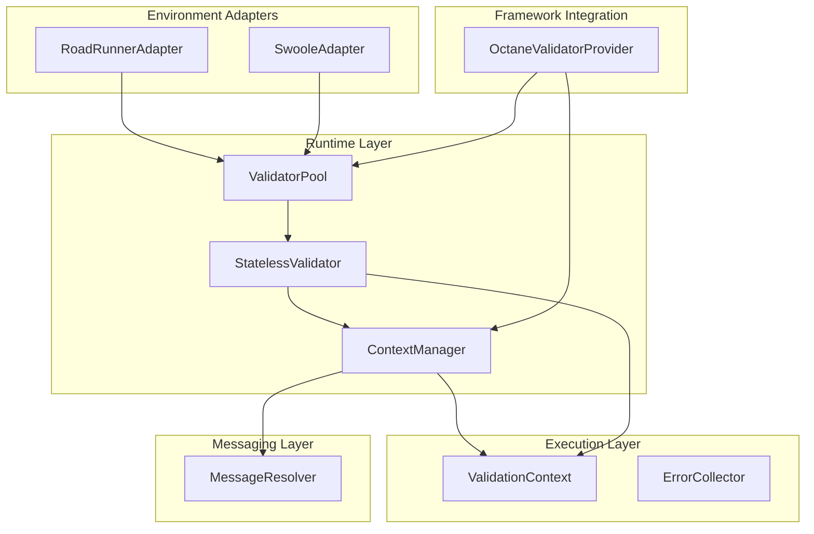
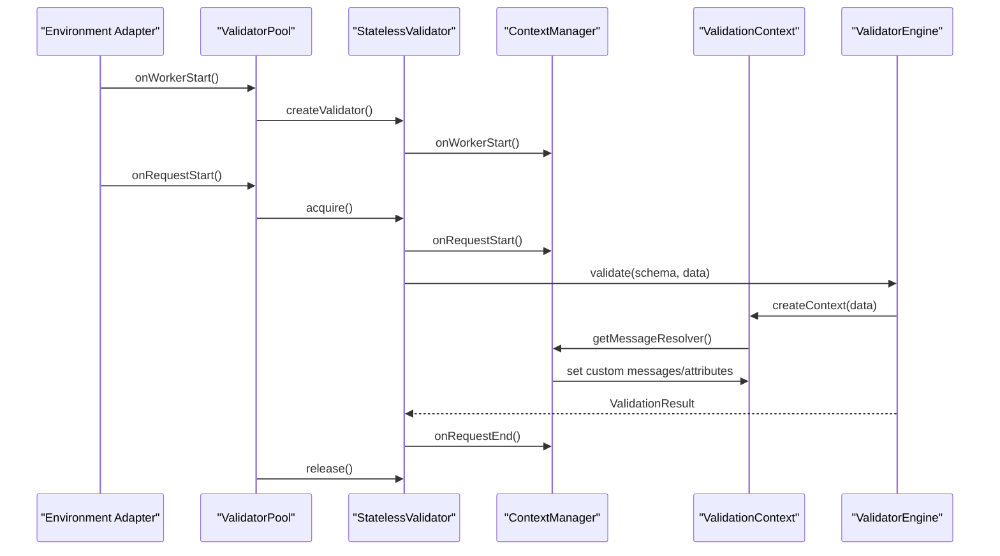
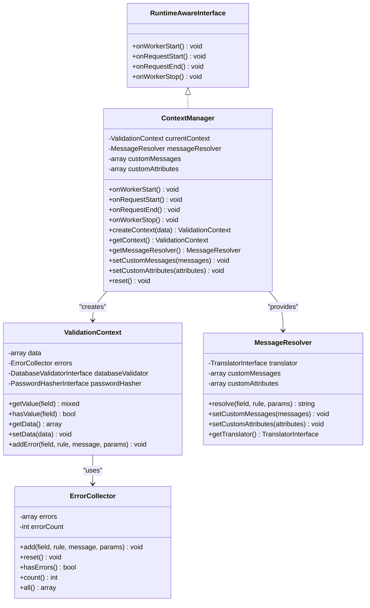
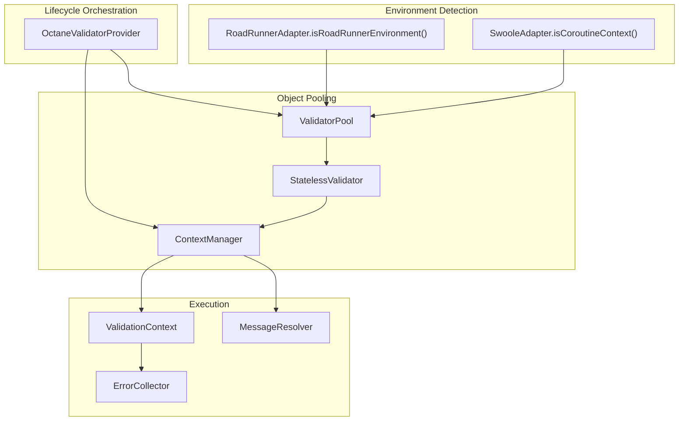
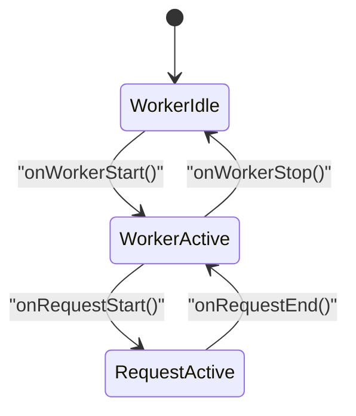
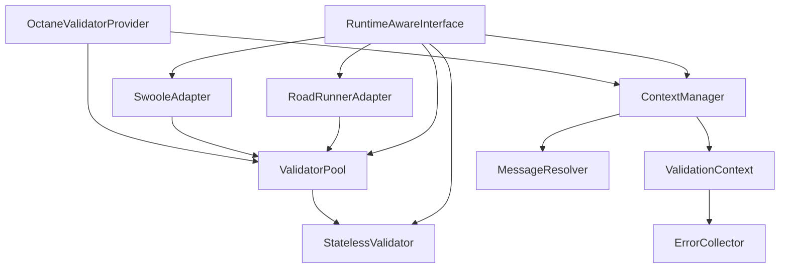

# Runtime Context Management

<cite>
**Referenced Files in This Document**
- [ContextManager.php](file://src/Runtime/ContextManager.php)
- [RuntimeAwareInterface.php](file://src/Runtime/RuntimeAwareInterface.php)
- [StatelessValidator.php](file://src/Runtime/StatelessValidator.php)
- [ValidatorPool.php](file://src/Runtime/ValidatorPool.php)
- [ValidationContext.php](file://src/Execution/ValidationContext.php)
- [ErrorCollector.php](file://src/Execution/ErrorCollector.php)
- [MessageResolver.php](file://src/Messages/MessageResolver.php)
- [RoadRunnerAdapter.php](file://src/Runtime/Workers/RoadRunnerAdapter.php)
- [SwooleAdapter.php](file://src/Runtime/Workers/SwooleAdapter.php)
- [OctaneValidatorProvider.php](file://src/Laravel/Octane/OctaneValidatorProvider.php)
</cite>

## Table of Contents
1. [Introduction](#introduction)
2. [Project Structure](#project-structure)
3. [Core Components](#core-components)
4. [Architecture Overview](#architecture-overview)
5. [Detailed Component Analysis](#detailed-component-analysis)
6. [Dependency Analysis](#dependency-analysis)
7. [Performance Considerations](#performance-considerations)
8. [Troubleshooting Guide](#troubleshooting-guide)
9. [Conclusion](#conclusion)

## Introduction
This document explains the runtime context management system responsible for handling context switching and state management across different execution environments. It covers the lifecycle management of contexts, environment detection mechanisms, state isolation strategies, and the RuntimeAwareInterface contract. It also documents how components register for runtime notifications, provides examples of custom context providers, outlines context switching patterns, and offers debugging guidance for context-related issues. Finally, it addresses memory management, cleanup procedures, and best practices for maintaining context consistency in distributed and concurrent environments.

## Project Structure
The runtime context management spans several modules:
- Runtime-aware components: ContextManager, StatelessValidator, ValidatorPool
- Execution context: ValidationContext, ErrorCollector
- Messaging: MessageResolver
- Environment adapters: RoadRunnerAdapter, SwooleAdapter
- Laravel Octane integration: OctaneValidatorProvider

**Diagram sources**
- [ContextManager.php](file://src/Runtime/ContextManager.php#L14-L118)
- [StatelessValidator.php](file://src/Runtime/StatelessValidator.php#L15-L78)
- [ValidatorPool.php](file://src/Runtime/ValidatorPool.php#L12-L139)
- [ValidationContext.php](file://src/Execution/ValidationContext.php#L7-L97)
- [ErrorCollector.php](file://src/Execution/ErrorCollector.php#L7-L50)
- [MessageResolver.php](file://src/Messages/MessageResolver.php#L7-L124)
- [RoadRunnerAdapter.php](file://src/Runtime/Workers/RoadRunnerAdapter.php#L13-L106)
- [SwooleAdapter.php](file://src/Runtime/Workers/SwooleAdapter.php#L13-L94)
- [OctaneValidatorProvider.php](file://src/Laravel/Octane/OctaneValidatorProvider.php#L18-L87)

**Section sources**
- [ContextManager.php](file://src/Runtime/ContextManager.php#L1-L119)
- [RuntimeAwareInterface.php](file://src/Runtime/RuntimeAwareInterface.php#L1-L32)
- [StatelessValidator.php](file://src/Runtime/StatelessValidator.php#L1-L79)
- [ValidatorPool.php](file://src/Runtime/ValidatorPool.php#L1-L140)
- [ValidationContext.php](file://src/Execution/ValidationContext.php#L1-L98)
- [ErrorCollector.php](file://src/Execution/ErrorCollector.php#L1-L51)
- [MessageResolver.php](file://src/Messages/MessageResolver.php#L1-L125)
- [RoadRunnerAdapter.php](file://src/Runtime/Workers/RoadRunnerAdapter.php#L1-L107)
- [SwooleAdapter.php](file://src/Runtime/Workers/SwooleAdapter.php#L1-L95)
- [OctaneValidatorProvider.php](file://src/Laravel/Octane/OctaneValidatorProvider.php#L1-L88)

## Core Components
- ContextManager: Central orchestrator for request-scoped validation context, custom messages, and attributes. Implements RuntimeAwareInterface to participate in worker and request lifecycles.
- StatelessValidator: Thin wrapper around ValidatorEngine that ensures no state leaks between requests by delegating lifecycle events to ContextManager.
- ValidatorPool: Object pooling mechanism for StatelessValidator instances to reduce allocation overhead in long-running processes.
- ValidationContext: Holds per-request data, error collector, and optional external services (database validator, password hasher).
- ErrorCollector: Aggregates validation errors per field with counts and accessors.
- MessageResolver: Resolves localized error messages and supports custom messages and attributes.
- Environment adapters: RoadRunnerAdapter and SwooleAdapter integrate lifecycle events with environment-specific concurrency models.
- OctaneValidatorProvider: Laravel Octane service provider wiring ContextManager and ValidatorPool lifecycle events.

**Section sources**
- [ContextManager.php](file://src/Runtime/ContextManager.php#L14-L118)
- [StatelessValidator.php](file://src/Runtime/StatelessValidator.php#L15-L78)
- [ValidatorPool.php](file://src/Runtime/ValidatorPool.php#L12-L139)
- [ValidationContext.php](file://src/Execution/ValidationContext.php#L7-L97)
- [ErrorCollector.php](file://src/Execution/ErrorCollector.php#L7-L50)
- [MessageResolver.php](file://src/Messages/MessageResolver.php#L7-L124)
- [RoadRunnerAdapter.php](file://src/Runtime/Workers/RoadRunnerAdapter.php#L13-L106)
- [SwooleAdapter.php](file://src/Runtime/Workers/SwooleAdapter.php#L13-L94)
- [OctaneValidatorProvider.php](file://src/Laravel/Octane/OctaneValidatorProvider.php#L18-L87)

## Architecture Overview
The runtime context management architecture follows a layered approach:
- Runtime-aware components implement RuntimeAwareInterface and receive lifecycle callbacks.
- ContextManager manages request-scoped state and provides a MessageResolver with custom messages and attributes.
- StatelessValidator ensures request isolation by resetting ContextManager on each validate call.
- ValidatorPool reuses StatelessValidator instances to minimize allocations.
- Environment adapters translate environment-specific lifecycle signals into standardized RuntimeAwareInterface calls.
- OctaneValidatorProvider wires framework events to runtime lifecycle hooks.

**Diagram sources**
- [RoadRunnerAdapter.php](file://src/Runtime/Workers/RoadRunnerAdapter.php#L23-L49)
- [SwooleAdapter.php](file://src/Runtime/Workers/SwooleAdapter.php#L25-L52)
- [ValidatorPool.php](file://src/Runtime/ValidatorPool.php#L59-L90)
- [StatelessValidator.php](file://src/Runtime/StatelessValidator.php#L53-L61)
- [ContextManager.php](file://src/Runtime/ContextManager.php#L55-L89)
- [ValidationContext.php](file://src/Execution/ValidationContext.php#L17-L21)

## Detailed Component Analysis

### ContextManager
Responsibilities:
- Manages request-scoped ValidationContext creation and retrieval.
- Provides a lazily-initialized MessageResolver with support for custom messages and attributes.
- Implements RuntimeAwareInterface to reset state at worker and request boundaries.

Lifecycle methods:
- onWorkerStart: Initializes MessageResolver.
- onRequestStart/onRequestEnd: Resets current context and clears custom messages/attributes.
- onWorkerStop: Clears current context and MessageResolver.

Context creation:
- createContext builds a ValidationContext with an ErrorCollector and returns it.
- getContext returns the current ValidationContext or null.

Message resolution:
- getMessageResolver lazily creates MessageResolver if needed.
- Applies customMessages and customAttributes before returning the resolver.

State isolation:
- Resets arrays and object references at request boundaries to prevent cross-request contamination.

**Section sources**
- [ContextManager.php](file://src/Runtime/ContextManager.php#L14-L118)

#### Class Diagram

**Diagram sources**
- [ContextManager.php](file://src/Runtime/ContextManager.php#L14-L118)
- [ValidationContext.php](file://src/Execution/ValidationContext.php#L7-L97)
- [ErrorCollector.php](file://src/Execution/ErrorCollector.php#L7-L50)
- [MessageResolver.php](file://src/Messages/MessageResolver.php#L7-L124)
- [RuntimeAwareInterface.php](file://src/Runtime/RuntimeAwareInterface.php#L10-L31)

### StatelessValidator
Responsibilities:
- Wraps ValidatorEngine to ensure no state leaks between requests.
- Delegates lifecycle events to ContextManager.

Validation flow:
- validate wraps ValidatorEngine::validate with automatic onRequestStart/onRequestEnd around the call.

**Section sources**
- [StatelessValidator.php](file://src/Runtime/StatelessValidator.php#L15-L78)

### ValidatorPool
Responsibilities:
- Reuses StatelessValidator instances to reduce allocation overhead.
- Implements RuntimeAwareInterface to pre-warm and clean up validators.

Acquire/release:
- acquire returns a validator from the pool or creates a new one if under the limit.
- release returns a validator to the pool if capacity allows.

withValidator:
- Executes a callback with automatic acquire/release semantics.

**Section sources**
- [ValidatorPool.php](file://src/Runtime/ValidatorPool.php#L12-L139)

### ValidationContext
Responsibilities:
- Holds request data and error collector.
- Supports nested field access via dot notation.
- Provides helpers to add errors.

**Section sources**
- [ValidationContext.php](file://src/Execution/ValidationContext.php#L7-L97)

### ErrorCollector
Responsibilities:
- Aggregates per-field validation errors.
- Tracks total error count and exposes accessors.

**Section sources**
- [ErrorCollector.php](file://src/Execution/ErrorCollector.php#L7-L50)

### MessageResolver
Responsibilities:
- Resolves localized messages for validation rules.
- Supports custom messages and attributes.
- Performs placeholder replacement for attributes and parameters.

**Section sources**
- [MessageResolver.php](file://src/Messages/MessageResolver.php#L7-L124)

### Environment Adapters

#### RoadRunnerAdapter
Responsibilities:
- Integrates with RoadRunner worker lifecycle.
- Delegates lifecycle events to ValidatorPool.
- Provides environment detection and request-state clearing.

**Section sources**
- [RoadRunnerAdapter.php](file://src/Runtime/Workers/RoadRunnerAdapter.php#L13-L106)

#### SwooleAdapter
Responsibilities:
- Integrates with Swoole coroutine lifecycle.
- Tracks coroutine-specific initialization state.
- Delegates lifecycle events to ValidatorPool.

**Section sources**
- [SwooleAdapter.php](file://src/Runtime/Workers/SwooleAdapter.php#L13-L94)

### Laravel Octane Integration
Responsibilities:
- Registers ValidatorPool and ContextManager singletons.
- Wires Octane events to runtime lifecycle hooks.

**Section sources**
- [OctaneValidatorProvider.php](file://src/Laravel/Octane/OctaneValidatorProvider.php#L18-L87)

## Architecture Overview

**Diagram sources**
- [OctaneValidatorProvider.php](file://src/Laravel/Octane/OctaneValidatorProvider.php#L44-L66)
- [RoadRunnerAdapter.php](file://src/Runtime/Workers/RoadRunnerAdapter.php#L70-L75)
- [SwooleAdapter.php](file://src/Runtime/Workers/SwooleAdapter.php#L65-L93)
- [ValidatorPool.php](file://src/Runtime/ValidatorPool.php#L12-L139)
- [StatelessValidator.php](file://src/Runtime/StatelessValidator.php#L15-L78)
- [ContextManager.php](file://src/Runtime/ContextManager.php#L14-L118)
- [ValidationContext.php](file://src/Execution/ValidationContext.php#L7-L97)
- [ErrorCollector.php](file://src/Execution/ErrorCollector.php#L7-L50)
- [MessageResolver.php](file://src/Messages/MessageResolver.php#L7-L124)

## Detailed Component Analysis

### Context Lifecycle Management
Context lifecycle is managed through RuntimeAwareInterface implementations:
- Worker lifecycle: onWorkerStart initializes shared resources (e.g., MessageResolver).
- Request lifecycle: onRequestStart resets request-scoped state; onRequestEnd clears it.
- Worker stop: onWorkerStop releases shared resources.

**Diagram sources**
- [ContextManager.php](file://src/Runtime/ContextManager.php#L25-L48)
- [StatelessValidator.php](file://src/Runtime/StatelessValidator.php#L28-L46)
- [ValidatorPool.php](file://src/Runtime/ValidatorPool.php#L26-L54)

**Section sources**
- [ContextManager.php](file://src/Runtime/ContextManager.php#L25-L48)
- [StatelessValidator.php](file://src/Runtime/StatelessValidator.php#L28-L46)
- [ValidatorPool.php](file://src/Runtime/ValidatorPool.php#L26-L54)

### Environment Detection Mechanisms
- RoadRunnerAdapter detects RoadRunner via server variables, environment variables, or class presence.
- SwooleAdapter detects coroutine context via extension availability and class existence.

**Section sources**
- [RoadRunnerAdapter.php](file://src/Runtime/Workers/RoadRunnerAdapter.php#L70-L75)
- [SwooleAdapter.php](file://src/Runtime/Workers/SwooleAdapter.php#L75-L83)

### State Isolation Strategies
- Request-scoped arrays (customMessages, customAttributes) are reset on each request boundary.
- ValidationContext and ErrorCollector are recreated per request.
- MessageResolver is lazily created and updated with custom messages/attributes per request.
- ValidatorPool ensures StatelessValidator instances are reset on acquire/release.

**Section sources**
- [ContextManager.php](file://src/Runtime/ContextManager.php#L30-L42)
- [StatelessValidator.php](file://src/Runtime/StatelessValidator.php#L33-L41)
- [ValidatorPool.php](file://src/Runtime/ValidatorPool.php#L83-L90)

### RuntimeAwareInterface Contract
Components implementing RuntimeAwareInterface must provide four lifecycle methods:
- onWorkerStart: Initialize worker-wide resources.
- onRequestStart: Prepare request-scoped state.
- onRequestEnd: Clean up request-scoped state.
- onWorkerStop: Release worker-wide resources.

**Section sources**
- [RuntimeAwareInterface.php](file://src/Runtime/RuntimeAwareInterface.php#L10-L31)

### Component Registration for Runtime Notifications
- OctaneValidatorProvider registers listeners for WorkerStarting/WorkerStopping and RequestReceived/RequestTerminated events, invoking corresponding RuntimeAwareInterface methods on ValidatorPool and ContextManager.
- Environment adapters implement RuntimeAwareInterface and forward lifecycle events to ValidatorPool.

**Section sources**
- [OctaneValidatorProvider.php](file://src/Laravel/Octane/OctaneValidatorProvider.php#L44-L66)
- [RoadRunnerAdapter.php](file://src/Runtime/Workers/RoadRunnerAdapter.php#L23-L49)
- [SwooleAdapter.php](file://src/Runtime/Workers/SwooleAdapter.php#L25-L52)

### Custom Context Providers
To create a custom context provider:
- Implement RuntimeAwareInterface.
- Register lifecycle listeners in your framework/provider to call onWorkerStart/onRequestStart/onRequestEnd/onWorkerStop.
- Manage any request-scoped state within these methods.
- Example patterns:
  - Pre-warming caches on onWorkerStart.
  - Initializing per-request metrics on onRequestStart.
  - Cleaning up per-request resources on onRequestEnd.
  - Releasing shared resources on onWorkerStop.

**Section sources**
- [RuntimeAwareInterface.php](file://src/Runtime/RuntimeAwareInterface.php#L10-L31)
- [OctaneValidatorProvider.php](file://src/Laravel/Octane/OctaneValidatorProvider.php#L44-L66)

### Context Switching Patterns
- StatelessValidator.validate automatically switches context for each validation call:
  - Calls onRequestStart before validation.
  - Calls onRequestEnd after validation completes.
- ValidatorPool.withValidator provides a safe pattern for executing validation with automatic resource management.

**Section sources**
- [StatelessValidator.php](file://src/Runtime/StatelessValidator.php#L53-L61)
- [ValidatorPool.php](file://src/Runtime/ValidatorPool.php#L99-L108)

### Debugging Context-Related Issues
Common issues and remedies:
- State leakage between requests:
  - Verify onRequestStart/reset clears all request-scoped arrays and resets ValidationContext.
  - Ensure StatelessValidator.onRequestEnd is invoked after each validation.
- Incorrect custom messages/attributes:
  - Confirm ContextManager.getMessageResolver applies customMessages/customAttributes before resolving messages.
  - Check MessageResolver.replaceAttributes performs placeholder substitution.
- Memory leaks in long-running workers:
  - Ensure onWorkerStop releases shared resources (e.g., MessageResolver).
  - Use ValidatorPool to reuse StatelessValidator instances rather than creating new ones excessively.
- Concurrency issues:
  - Use environment adapters (RoadRunnerAdapter, SwooleAdapter) to manage per-worker and per-coroutine lifecycles.
  - For Swoole, track coroutine-specific initialization via SwooleAdapter.

**Section sources**
- [ContextManager.php](file://src/Runtime/ContextManager.php#L30-L48)
- [StatelessValidator.php](file://src/Runtime/StatelessValidator.php#L38-L41)
- [MessageResolver.php](file://src/Messages/MessageResolver.php#L57-L68)
- [RoadRunnerAdapter.php](file://src/Runtime/Workers/RoadRunnerAdapter.php#L80-L87)
- [SwooleAdapter.php](file://src/Runtime/Workers/SwooleAdapter.php#L89-L93)

## Dependency Analysis

**Diagram sources**
- [RuntimeAwareInterface.php](file://src/Runtime/RuntimeAwareInterface.php#L10-L31)
- [ContextManager.php](file://src/Runtime/ContextManager.php#L14-L118)
- [StatelessValidator.php](file://src/Runtime/StatelessValidator.php#L15-L78)
- [ValidatorPool.php](file://src/Runtime/ValidatorPool.php#L12-L139)
- [ValidationContext.php](file://src/Execution/ValidationContext.php#L7-L97)
- [ErrorCollector.php](file://src/Execution/ErrorCollector.php#L7-L50)
- [MessageResolver.php](file://src/Messages/MessageResolver.php#L7-L124)
- [RoadRunnerAdapter.php](file://src/Runtime/Workers/RoadRunnerAdapter.php#L13-L106)
- [SwooleAdapter.php](file://src/Runtime/Workers/SwooleAdapter.php#L13-L94)
- [OctaneValidatorProvider.php](file://src/Laravel/Octane/OctaneValidatorProvider.php#L18-L87)

**Section sources**
- [RuntimeAwareInterface.php](file://src/Runtime/RuntimeAwareInterface.php#L10-L31)
- [ContextManager.php](file://src/Runtime/ContextManager.php#L14-L118)
- [StatelessValidator.php](file://src/Runtime/StatelessValidator.php#L15-L78)
- [ValidatorPool.php](file://src/Runtime/ValidatorPool.php#L12-L139)
- [ValidationContext.php](file://src/Execution/ValidationContext.php#L7-L97)
- [ErrorCollector.php](file://src/Execution/ErrorCollector.php#L7-L50)
- [MessageResolver.php](file://src/Messages/MessageResolver.php#L7-L124)
- [RoadRunnerAdapter.php](file://src/Runtime/Workers/RoadRunnerAdapter.php#L13-L106)
- [SwooleAdapter.php](file://src/Runtime/Workers/SwooleAdapter.php#L13-L94)
- [OctaneValidatorProvider.php](file://src/Laravel/Octane/OctaneValidatorProvider.php#L18-L87)

## Performance Considerations
- Object pooling: ValidatorPool reduces allocations by reusing StatelessValidator instances. Tune pool size according to workload.
- Lazy initialization: MessageResolver is created only when needed, minimizing startup overhead.
- Minimal state: Request-scoped arrays are reset quickly to avoid accumulation.
- Environment-specific optimizations: RoadRunnerAdapter triggers garbage collection after request completion; SwooleAdapter tracks coroutine contexts to avoid redundant initialization.

[No sources needed since this section provides general guidance]

## Troubleshooting Guide
- Symptoms: Persistent errors across requests or incorrect custom messages.
  - Actions: Verify onRequestStart/reset clears customMessages/customAttributes and ValidationContext. Ensure StatelessValidator.onRequestEnd is executed.
- Symptoms: Memory growth over time.
  - Actions: Confirm onWorkerStop releases shared resources. Use ValidatorPool to reuse instances.
- Symptoms: Concurrency anomalies in Swoole.
  - Actions: Use SwooleAdapter.isContextInitialized to guard per-coroutine initialization. Ensure onRequestStart/onRequestEnd are paired per coroutine.
- Symptoms: RoadRunner memory leaks.
  - Actions: Call clearRequestState after request completion to trigger garbage collection.

**Section sources**
- [ContextManager.php](file://src/Runtime/ContextManager.php#L30-L48)
- [StatelessValidator.php](file://src/Runtime/StatelessValidator.php#L38-L41)
- [RoadRunnerAdapter.php](file://src/Runtime/Workers/RoadRunnerAdapter.php#L80-L87)
- [SwooleAdapter.php](file://src/Runtime/Workers/SwooleAdapter.php#L89-L93)

## Conclusion
The runtime context management system provides robust lifecycle control for long-running processes. Through RuntimeAwareInterface, components cleanly separate concerns across worker and request boundaries. ContextManager centralizes request-scoped state, while StatelessValidator and ValidatorPool ensure isolation and efficient resource reuse. Environment adapters bridge framework and platform lifecycles, and MessageResolver delivers flexible, localized error messaging. Following the patterns documented here maintains consistency and reliability in distributed and concurrent environments.