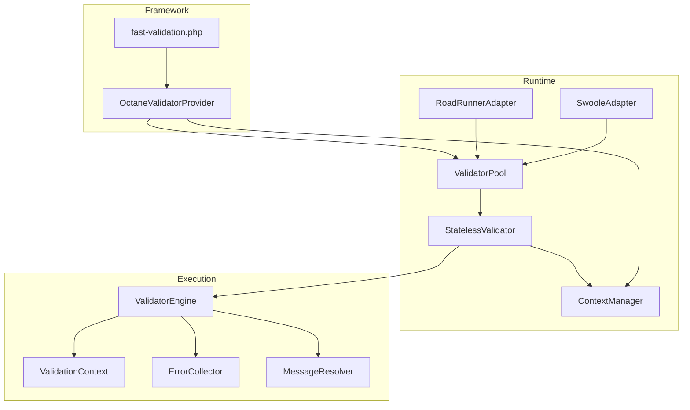
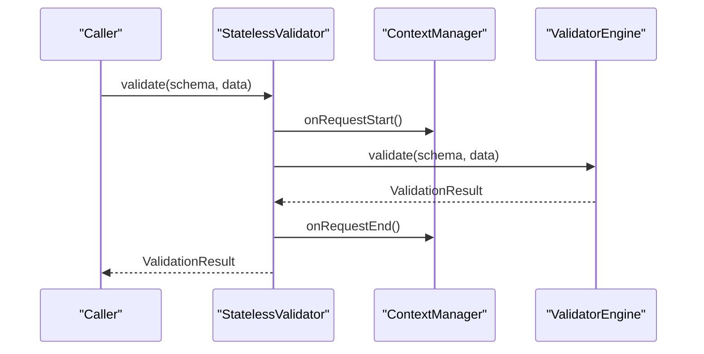
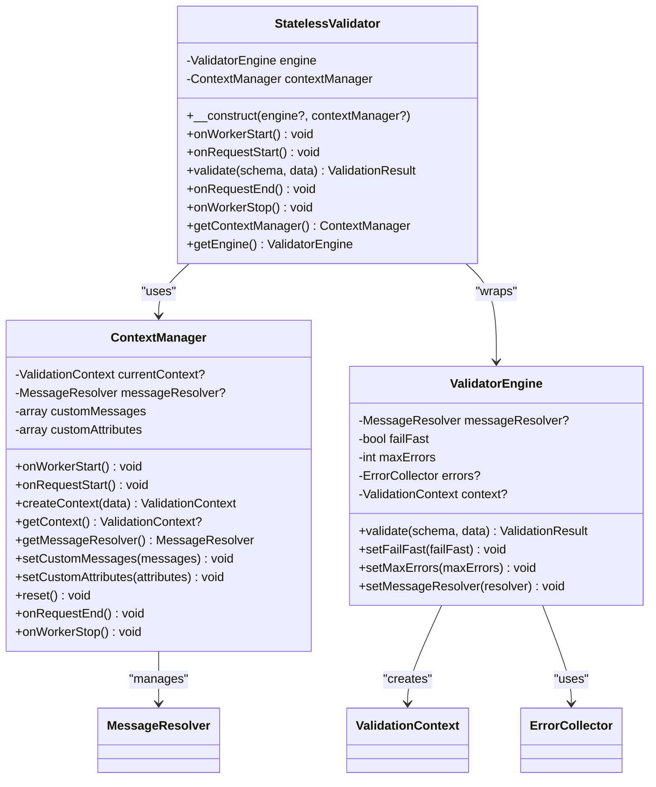
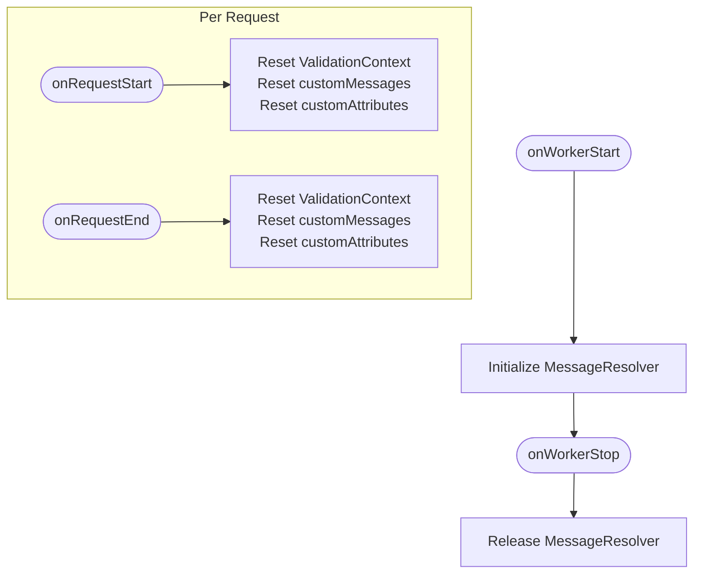
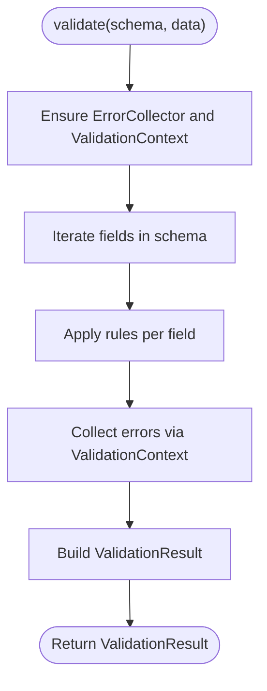
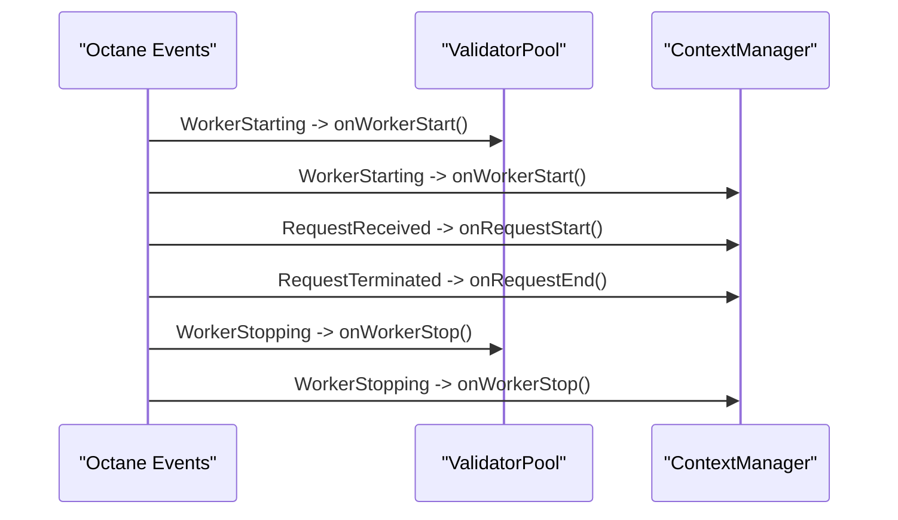
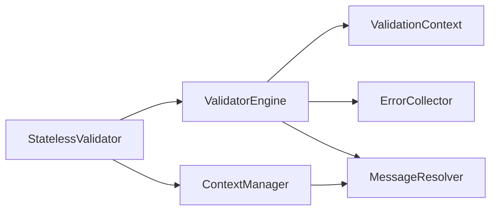

# Stateless Validation

<cite>
**Referenced Files in This Document**
- [StatelessValidator.php](file://src/Runtime/StatelessValidator.php)
- [ContextManager.php](file://src/Runtime/ContextManager.php)
- [ValidatorEngine.php](file://src/Execution/ValidatorEngine.php)
- [RuntimeAwareInterface.php](file://src/Runtime/RuntimeAwareInterface.php)
- [ValidationContext.php](file://src/Execution/ValidationContext.php)
- [ErrorCollector.php](file://src/Execution/ErrorCollector.php)
- [MessageResolver.php](file://src/Messages/MessageResolver.php)
- [OctaneValidatorProvider.php](file://src/Laravel/Octane/OctaneValidatorProvider.php)
- [ValidatorPool.php](file://src/Runtime/ValidatorPool.php)
- [RoadRunnerAdapter.php](file://src/Runtime/Workers/RoadRunnerAdapter.php)
- [SwooleAdapter.php](file://src/Runtime/Workers/SwooleAdapter.php)
- [fast-validation.php](file://config/fast-validation.php)
- [composer.json](file://composer.json)
</cite>

## Table of Contents
1. [Introduction](#introduction)
2. [Project Structure](#project-structure)
3. [Core Components](#core-components)
4. [Architecture Overview](#architecture-overview)
5. [Detailed Component Analysis](#detailed-component-analysis)
6. [Dependency Analysis](#dependency-analysis)
7. [Performance Considerations](#performance-considerations)
8. [Troubleshooting Guide](#troubleshooting-guide)
9. [Conclusion](#conclusion)
10. [Appendices](#appendices)

## Introduction
This document explains StatelessValidator and its role in ensuring state isolation during long-running processes. StatelessValidator wraps ValidatorEngine and coordinates automatic context management via ContextManager to guarantee that validation state does not leak between requests. It exposes lifecycle hooks (onWorkerStart, onRequestStart, onRequestEnd, onWorkerStop) that cleanly separate request lifecycles and enable safe reuse of validator instances in environments such as Laravel Octane, RoadRunner, and Swoole.

## Project Structure
The Stateless Validation feature spans runtime lifecycle management, validation execution, and framework integrations:
- Runtime lifecycle: StatelessValidator, ContextManager, ValidatorPool, and worker adapters
- Validation engine: ValidatorEngine, ValidationContext, ErrorCollector, MessageResolver
- Framework integration: Octane service provider and configuration

**Diagram sources**
- [StatelessValidator.php](file://src/Runtime/StatelessValidator.php#L15-L78)
- [ContextManager.php](file://src/Runtime/ContextManager.php#L14-L118)
- [ValidatorPool.php](file://src/Runtime/ValidatorPool.php#L12-L139)
- [RoadRunnerAdapter.php](file://src/Runtime/Workers/RoadRunnerAdapter.php#L13-L106)
- [SwooleAdapter.php](file://src/Runtime/Workers/SwooleAdapter.php#L13-L94)
- [ValidatorEngine.php](file://src/Execution/ValidatorEngine.php#L11-L176)
- [ValidationContext.php](file://src/Execution/ValidationContext.php#L7-L97)
- [ErrorCollector.php](file://src/Execution/ErrorCollector.php#L7-L50)
- [MessageResolver.php](file://src/Messages/MessageResolver.php#L7-L124)
- [OctaneValidatorProvider.php](file://src/Laravel/Octane/OctaneValidatorProvider.php#L18-L86)
- [fast-validation.php](file://config/fast-validation.php#L86-L95)

**Section sources**
- [StatelessValidator.php](file://src/Runtime/StatelessValidator.php#L15-L78)
- [ContextManager.php](file://src/Runtime/ContextManager.php#L14-L118)
- [ValidatorEngine.php](file://src/Execution/ValidatorEngine.php#L11-L176)
- [OctaneValidatorProvider.php](file://src/Laravel/Octane/OctaneValidatorProvider.php#L18-L86)
- [fast-validation.php](file://config/fast-validation.php#L86-L95)

## Core Components
- StatelessValidator: Wraps ValidatorEngine and delegates lifecycle events to ContextManager. It ensures each validate call starts and ends a request boundary automatically.
- ContextManager: Maintains per-worker and per-request state, including the active ValidationContext, custom messages, and custom attributes. It resets state on request boundaries.
- ValidatorEngine: Executes compiled schemas against data, managing shared state across a single validation run and returning a ValidationResult.
- RuntimeAwareInterface: Defines the lifecycle contract (onWorkerStart, onRequestStart, onRequestEnd, onWorkerStop) implemented by runtime-aware components.
- ValidatorPool: Reuses StatelessValidator instances in long-running workers, coordinating acquisition and release with lifecycle hooks.
- Worker Adapters (RoadRunnerAdapter, SwooleAdapter): Bridge external runtimes to the lifecycle hooks for request and worker management.

**Section sources**
- [StatelessValidator.php](file://src/Runtime/StatelessValidator.php#L15-L78)
- [ContextManager.php](file://src/Runtime/ContextManager.php#L14-L118)
- [ValidatorEngine.php](file://src/Execution/ValidatorEngine.php#L11-L176)
- [RuntimeAwareInterface.php](file://src/Runtime/RuntimeAwareInterface.php#L10-L31)
- [ValidatorPool.php](file://src/Runtime/ValidatorPool.php#L12-L139)
- [RoadRunnerAdapter.php](file://src/Runtime/Workers/RoadRunnerAdapter.php#L13-L106)
- [SwooleAdapter.php](file://src/Runtime/Workers/SwooleAdapter.php#L13-L94)

## Architecture Overview
StatelessValidator orchestrates state isolation by:
- Starting a request boundary before validation and ending it afterward
- Delegating context creation and cleanup to ContextManager
- Using ValidatorEngine to execute compiled schemas safely within a controlled context

**Diagram sources**
- [StatelessValidator.php](file://src/Runtime/StatelessValidator.php#L53-L61)
- [ContextManager.php](file://src/Runtime/ContextManager.php#L30-L42)
- [ValidatorEngine.php](file://src/Execution/ValidatorEngine.php#L33-L98)

## Detailed Component Analysis

### StatelessValidator
Responsibilities:
- Provides a stateless facade around ValidatorEngine
- Enforces request boundaries via ContextManager
- Exposes lifecycle methods to integrate with long-running environments

Lifecycle behavior:
- onWorkerStart: Initializes ContextManager for the worker
- onRequestStart: Starts a request boundary
- validate: Runs validation inside a try/finally to guarantee onRequestEnd
- onRequestEnd: Cleans up request-scoped state
- onWorkerStop: Shuts down ContextManager

**Diagram sources**
- [StatelessValidator.php](file://src/Runtime/StatelessValidator.php#L15-L78)
- [ContextManager.php](file://src/Runtime/ContextManager.php#L14-L118)
- [ValidatorEngine.php](file://src/Execution/ValidatorEngine.php#L11-L176)

**Section sources**
- [StatelessValidator.php](file://src/Runtime/StatelessValidator.php#L15-L78)
- [ContextManager.php](file://src/Runtime/ContextManager.php#L14-L118)
- [ValidatorEngine.php](file://src/Execution/ValidatorEngine.php#L11-L176)

### ContextManager
Responsibilities:
- Per-worker initialization of MessageResolver
- Per-request reset of ValidationContext, custom messages, and custom attributes
- Lazy creation of MessageResolver and propagation of custom messages/attributes

**Diagram sources**
- [ContextManager.php](file://src/Runtime/ContextManager.php#L25-L48)

**Section sources**
- [ContextManager.php](file://src/Runtime/ContextManager.php#L14-L118)

### ValidatorEngine
Responsibilities:
- Validates a CompiledSchema against input data
- Manages a shared ValidationContext and ErrorCollector across a single validation run
- Applies rules and collects errors, respecting failFast and maxErrors

**Diagram sources**
- [ValidatorEngine.php](file://src/Execution/ValidatorEngine.php#L33-L98)
- [ValidationContext.php](file://src/Execution/ValidationContext.php#L93-L96)
- [ErrorCollector.php](file://src/Execution/ErrorCollector.php#L17-L25)

**Section sources**
- [ValidatorEngine.php](file://src/Execution/ValidatorEngine.php#L11-L176)
- [ValidationContext.php](file://src/Execution/ValidationContext.php#L7-L97)
- [ErrorCollector.php](file://src/Execution/ErrorCollector.php#L7-L50)

### Lifecycle Management in Long-Running Environments
- Laravel Octane: The service provider wires lifecycle events to ValidatorPool and ContextManager
- RoadRunner: Adapter manages worker and request lifecycle and clears request state
- Swoole: Adapter tracks coroutine contexts and coordinates pool lifecycle

**Diagram sources**
- [OctaneValidatorProvider.php](file://src/Laravel/Octane/OctaneValidatorProvider.php#L44-L65)
- [ValidatorPool.php](file://src/Runtime/ValidatorPool.php#L26-L54)
- [ContextManager.php](file://src/Runtime/ContextManager.php#L25-L48)

**Section sources**
- [OctaneValidatorProvider.php](file://src/Laravel/Octane/OctaneValidatorProvider.php#L18-L86)
- [RoadRunnerAdapter.php](file://src/Runtime/Workers/RoadRunnerAdapter.php#L23-L49)
- [SwooleAdapter.php](file://src/Runtime/Workers/SwooleAdapter.php#L25-L52)

### Practical Implementation Patterns
- Initialization: Use the framework service provider to bind ValidatorPool and ContextManager. Configure pool size and runtime options via the configuration file.
- Validation: Acquire a StatelessValidator from ValidatorPool for each request, perform validation, and release it back to the pool.
- Customization: Set custom messages and attributes via ContextManager before or during validation; they are reset per request.

Recommended configuration keys for runtime support:
- runtime.pooling: Enable validator instance pooling
- runtime.pool_size: Adjust pool size for concurrency
- performance.fail_fast and performance.max_errors: Tune validation behavior

**Section sources**
- [OctaneValidatorProvider.php](file://src/Laravel/Octane/OctaneValidatorProvider.php#L20-L31)
- [fast-validation.php](file://config/fast-validation.php#L86-L95)
- [ValidatorPool.php](file://src/Runtime/ValidatorPool.php#L59-L90)
- [ContextManager.php](file://src/Runtime/ContextManager.php#L96-L109)

## Dependency Analysis
StatelessValidator depends on:
- ValidatorEngine for execution
- ContextManager for request-scoped state
ValidatorEngine depends on:
- ValidationContext for data and error aggregation
- ErrorCollector for collecting errors
- MessageResolver for resolving messages

**Diagram sources**
- [StatelessValidator.php](file://src/Runtime/StatelessValidator.php#L17-L18)
- [ValidatorEngine.php](file://src/Execution/ValidatorEngine.php#L13-L21)
- [ContextManager.php](file://src/Runtime/ContextManager.php#L16-L17)

**Section sources**
- [StatelessValidator.php](file://src/Runtime/StatelessValidator.php#L15-L78)
- [ValidatorEngine.php](file://src/Execution/ValidatorEngine.php#L11-L176)
- [ContextManager.php](file://src/Runtime/ContextManager.php#L14-L118)

## Performance Considerations
- Instance pooling: ValidatorPool reuses StatelessValidator instances to reduce allocation overhead in long-running workers.
- Fail-fast and max errors: ValidatorEngine supports early termination to limit error collection cost.
- Memory efficiency: Use streaming APIs (when available) to process large datasets without accumulating all results in memory.

[No sources needed since this section provides general guidance]

## Troubleshooting Guide
Common pitfalls and remedies:
- State leakage between requests: Ensure onRequestStart/onRequestEnd are called consistently. Verify that ContextManager resets state and that StatelessValidator’s validate method runs within a try/finally block.
- Incorrect lifecycle wiring: Confirm Octane events are registered and that worker adapters are used in RoadRunner/Swoole environments.
- Resource cleanup: Call onWorkerStop to release persistent resources like MessageResolver.

**Section sources**
- [ContextManager.php](file://src/Runtime/ContextManager.php#L30-L48)
- [StatelessValidator.php](file://src/Runtime/StatelessValidator.php#L53-L61)
- [OctaneValidatorProvider.php](file://src/Laravel/Octane/OctaneValidatorProvider.php#L44-L65)
- [RoadRunnerAdapter.php](file://src/Runtime/Workers/RoadRunnerAdapter.php#L45-L49)
- [SwooleAdapter.php](file://src/Runtime/Workers/SwooleAdapter.php#L48-L52)

## Conclusion
StatelessValidator provides a robust, state-isolated validation mechanism for long-running environments. By delegating lifecycle management to ContextManager and coordinating with ValidatorEngine, it prevents state leakage and enables efficient reuse of validator instances through ValidatorPool. Proper integration with framework lifecycle events and worker adapters ensures predictable behavior across Octane, RoadRunner, and Swoole.

[No sources needed since this section summarizes without analyzing specific files]

## Appendices

### Lifecycle Contract Reference
- onWorkerStart: Initialize persistent resources
- onRequestStart: Prepare request-scoped state
- onRequestEnd: Clean up request-scoped state
- onWorkerStop: Release persistent resources

**Section sources**
- [RuntimeAwareInterface.php](file://src/Runtime/RuntimeAwareInterface.php#L10-L31)

### Framework Integration Notes
- Laravel Octane: The service provider binds ValidatorPool and ContextManager and listens to Octane lifecycle events.
- Composer extras: The package registers the Laravel service provider and alias for convenient usage.

**Section sources**
- [OctaneValidatorProvider.php](file://src/Laravel/Octane/OctaneValidatorProvider.php#L20-L31)
- [composer.json](file://composer.json#L23-L31)