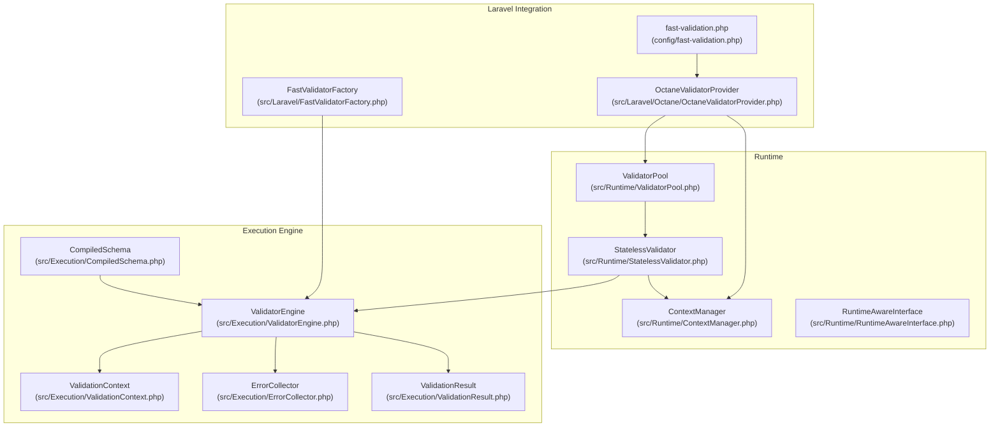
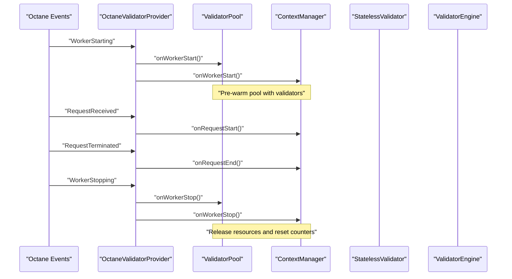
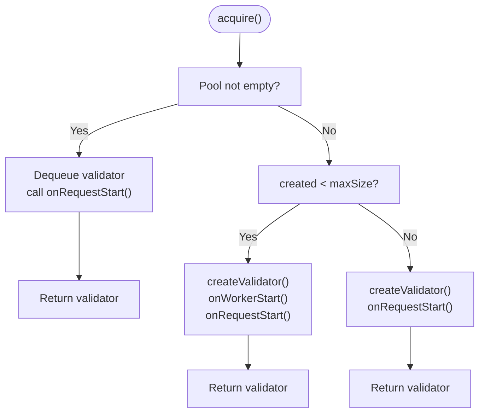
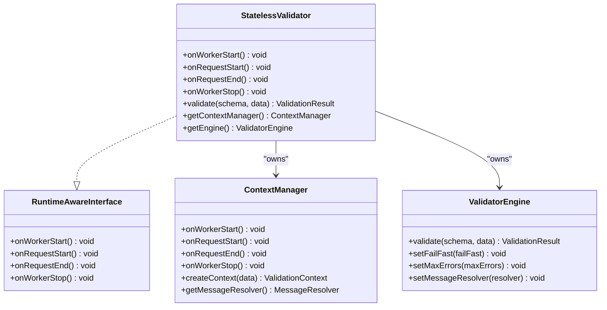
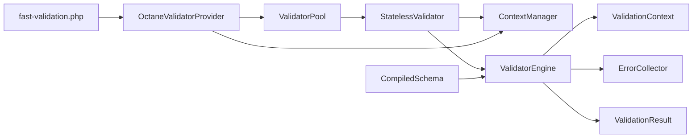

# Validator Pooling

<cite>
**Referenced Files in This Document**
- [ValidatorPool.php](file://src/Runtime/ValidatorPool.php)
- [StatelessValidator.php](file://src/Runtime/StatelessValidator.php)
- [ContextManager.php](file://src/Runtime/ContextManager.php)
- [RuntimeAwareInterface.php](file://src/Runtime/RuntimeAwareInterface.php)
- [OctaneValidatorProvider.php](file://src/Laravel/Octane/OctaneValidatorProvider.php)
- [fast-validation.php](file://config/fast-validation.php)
- [ValidatorEngine.php](file://src/Execution/ValidatorEngine.php)
- [ValidationContext.php](file://src/Execution/ValidationContext.php)
- [ErrorCollector.php](file://src/Execution/ErrorCollector.php)
- [ValidationResult.php](file://src/Execution/ValidationResult.php)
- [CompiledSchema.php](file://src/Execution/CompiledSchema.php)
- [FastValidatorFactory.php](file://src/Laravel/FastValidatorFactory.php)
- [composer.json](file://composer.json)
</cite>

## Table of Contents
1. [Introduction](#introduction)
2. [Project Structure](#project-structure)
3. [Core Components](#core-components)
4. [Architecture Overview](#architecture-overview)
5. [Detailed Component Analysis](#detailed-component-analysis)
6. [Dependency Analysis](#dependency-analysis)
7. [Performance Considerations](#performance-considerations)
8. [Troubleshooting Guide](#troubleshooting-guide)
9. [Conclusion](#conclusion)
10. [Appendices](#appendices)

## Introduction
This document explains the ValidatorPool implementation that enables connection pooling and resource reuse in long-running, high-concurrency environments such as Laravel Octane, Swoole, or RoadRunner. It covers pool management strategies, validator lifecycle within the pool, thread-safety considerations, configuration options, and practical usage patterns. It also documents performance benefits, memory optimization techniques, and troubleshooting steps for timeouts and resource exhaustion.

## Project Structure
The validator pooling feature spans runtime lifecycle management, stateless validator wrappers, and Octane integration. The following diagram highlights the key files involved in pooling and long-running process support.

**Diagram sources**
- [ValidatorPool.php](file://src/Runtime/ValidatorPool.php#L1-L140)
- [StatelessValidator.php](file://src/Runtime/StatelessValidator.php#L1-L79)
- [ContextManager.php](file://src/Runtime/ContextManager.php#L1-L119)
- [RuntimeAwareInterface.php](file://src/Runtime/RuntimeAwareInterface.php#L1-L32)
- [OctaneValidatorProvider.php](file://src/Laravel/Octane/OctaneValidatorProvider.php#L1-L88)
- [FastValidatorFactory.php](file://src/Laravel/FastValidatorFactory.php#L1-L207)
- [fast-validation.php](file://config/fast-validation.php#L1-L97)
- [ValidatorEngine.php](file://src/Execution/ValidatorEngine.php#L1-L177)
- [ValidationContext.php](file://src/Execution/ValidationContext.php#L1-L98)
- [ErrorCollector.php](file://src/Execution/ErrorCollector.php#L1-L51)
- [ValidationResult.php](file://src/Execution/ValidationResult.php#L1-L142)
- [CompiledSchema.php](file://src/Execution/CompiledSchema.php#L1-L68)

**Section sources**
- [ValidatorPool.php](file://src/Runtime/ValidatorPool.php#L1-L140)
- [OctaneValidatorProvider.php](file://src/Laravel/Octane/OctaneValidatorProvider.php#L1-L88)
- [fast-validation.php](file://config/fast-validation.php#L86-L95)

## Core Components
- ValidatorPool: A pool of StatelessValidator instances for reuse across requests in long-running workers. It manages acquisition, release, and lifecycle hooks.
- StatelessValidator: A thin wrapper around ValidatorEngine and ContextManager that resets request-scoped state on each use.
- ContextManager: Manages ValidationContext and message resolvers per worker/request lifecycle.
- RuntimeAwareInterface: Defines lifecycle hooks for long-running environments.
- OctaneValidatorProvider: Registers and wires ValidatorPool and ContextManager with Laravel Octane events.
- Configuration: Pool size and pooling enablement are configured via the fast-validation config.

Key responsibilities:
- Pool sizing and creation limit tracking
- Pre-warming on worker start
- Request-scoped validator acquisition and release
- Temporary validator creation when pool is exhausted
- Health metrics: pool size, max size, and created count

**Section sources**
- [ValidatorPool.php](file://src/Runtime/ValidatorPool.php#L12-L138)
- [StatelessValidator.php](file://src/Runtime/StatelessValidator.php#L15-L78)
- [ContextManager.php](file://src/Runtime/ContextManager.php#L14-L118)
- [RuntimeAwareInterface.php](file://src/Runtime/RuntimeAwareInterface.php#L10-L31)
- [OctaneValidatorProvider.php](file://src/Laravel/Octane/OctaneValidatorProvider.php#L20-L66)
- [fast-validation.php](file://config/fast-validation.php#L86-L95)

## Architecture Overview
The pooling architecture integrates with long-running server environments. Octane listeners trigger worker and request lifecycle events that ValidatorPool and ContextManager honor. StatelessValidator ensures no state leaks between requests by resetting context and engine state on each use.

**Diagram sources**
- [OctaneValidatorProvider.php](file://src/Laravel/Octane/OctaneValidatorProvider.php#L44-L66)
- [ValidatorPool.php](file://src/Runtime/ValidatorPool.php#L26-L54)
- [ContextManager.php](file://src/Runtime/ContextManager.php#L25-L48)

## Detailed Component Analysis

### ValidatorPool
ValidatorPool maintains a FIFO queue of StatelessValidator instances up to a configurable maximum size. It supports:
- Pre-warming on worker start
- Acquire with pool-first, creation-when-needed, and temporary fallback
- Release with pool capacity checks
- Automatic acquire/release via withValidator
- Metrics: pool size, max size, and total created count

Thread-safety:
- Uses SplQueue, which is not inherently thread-safe. In long-running environments, each worker process should own its pool instance, avoiding cross-worker sharing.

Lifecycle hooks:
- onWorkerStart: Pre-warms pool with a small subset of validators
- onWorkerStop: Calls onWorkerStop on pooled validators and resets created counter
- onRequestStart/End: No-op in pool; lifecycle is managed by StatelessValidator

Acquisition and release logic:
- If pool has items, dequeue and call onRequestStart
- Else if created < maxSize, create and warm-start a new validator
- Else create a temporary validator for the single use
- Release enqueues only if pool capacity allows

**Diagram sources**
- [ValidatorPool.php](file://src/Runtime/ValidatorPool.php#L59-L78)

**Section sources**
- [ValidatorPool.php](file://src/Runtime/ValidatorPool.php#L12-L138)

### StatelessValidator
StatelessValidator wraps ValidatorEngine and ContextManager and resets request-scoped state on each use. It implements RuntimeAwareInterface and delegates lifecycle events to ContextManager.

Key behaviors:
- validate() calls onRequestStart and onRequestEnd around engine validation
- getContextManager() and getEngine() expose internal collaborators for advanced usage
- Designed to be short-lived per request and safe to pool

**Diagram sources**
- [StatelessValidator.php](file://src/Runtime/StatelessValidator.php#L15-L78)
- [ContextManager.php](file://src/Runtime/ContextManager.php#L14-L118)
- [ValidatorEngine.php](file://src/Execution/ValidatorEngine.php#L11-L31)

**Section sources**
- [StatelessValidator.php](file://src/Runtime/StatelessValidator.php#L15-L78)

### ContextManager and Lifecycle
ContextManager ensures request-scoped isolation by resetting state on each request. It also lazily constructs the message resolver and applies custom messages/attributes per request.

Lifecycle responsibilities:
- Worker start: initializes message resolver
- Request start/end: clears context, messages, and attributes
- Worker stop: releases message resolver

These hooks are invoked by OctaneValidatorProvider during Octane lifecycle events.

**Section sources**
- [ContextManager.php](file://src/Runtime/ContextManager.php#L14-L118)
- [OctaneValidatorProvider.php](file://src/Laravel/Octane/OctaneValidatorProvider.php#L44-L66)

### Octane Integration
OctaneValidatorProvider registers:
- A singleton ValidatorPool with pool_size from configuration
- A singleton ContextManager
- Event listeners for worker and request lifecycle

It auto-detects Octane environment and wires lifecycle events to call onWorkerStart/onWorkerStop and onRequestStart/onRequestEnd on pool and context manager.

**Section sources**
- [OctaneValidatorProvider.php](file://src/Laravel/Octane/OctaneValidatorProvider.php#L20-L66)
- [fast-validation.php](file://config/fast-validation.php#L86-L95)

### Configuration Options
Pooling and runtime configuration keys:
- pooling: Enable validator instance pooling
- pool_size: Maximum number of pooled validators
- auto_detect: Auto-detect and optimize for long-running environments

These are loaded from the fast-validation config and used by OctaneValidatorProvider to construct the pool.

**Section sources**
- [fast-validation.php](file://config/fast-validation.php#L86-L95)
- [OctaneValidatorProvider.php](file://src/Laravel/Octane/OctaneValidatorProvider.php#L22-L27)

### Execution Engine and Validation Flow
While not part of the pool itself, the execution engine underpins StatelessValidator’s validate() behavior. It manages:
- Error collection and early termination (fail-fast and max-errors)
- Context creation/reset
- Rule application and bail semantics

This ensures that each pooled validator remains stateless and safe to reuse.

**Section sources**
- [ValidatorEngine.php](file://src/Execution/ValidatorEngine.php#L11-L177)
- [ValidationContext.php](file://src/Execution/ValidationContext.php#L7-L98)
- [ErrorCollector.php](file://src/Execution/ErrorCollector.php#L7-L51)
- [ValidationResult.php](file://src/Execution/ValidationResult.php#L9-L142)
- [CompiledSchema.php](file://src/Execution/CompiledSchema.php#L9-L68)

## Dependency Analysis
The following diagram shows how pooling components depend on each other and on the execution engine.

**Diagram sources**
- [ValidatorPool.php](file://src/Runtime/ValidatorPool.php#L12-L138)
- [StatelessValidator.php](file://src/Runtime/StatelessValidator.php#L15-L78)
- [ContextManager.php](file://src/Runtime/ContextManager.php#L14-L118)
- [ValidatorEngine.php](file://src/Execution/ValidatorEngine.php#L11-L177)
- [ValidationContext.php](file://src/Execution/ValidationContext.php#L7-L98)
- [ErrorCollector.php](file://src/Execution/ErrorCollector.php#L7-L51)
- [ValidationResult.php](file://src/Execution/ValidationResult.php#L9-L142)
- [CompiledSchema.php](file://src/Execution/CompiledSchema.php#L9-L68)
- [OctaneValidatorProvider.php](file://src/Laravel/Octane/OctaneValidatorProvider.php#L20-L66)
- [fast-validation.php](file://config/fast-validation.php#L86-L95)

**Section sources**
- [ValidatorPool.php](file://src/Runtime/ValidatorPool.php#L12-L138)
- [StatelessValidator.php](file://src/Runtime/StatelessValidator.php#L15-L78)
- [OctaneValidatorProvider.php](file://src/Laravel/Octane/OctaneValidatorProvider.php#L20-L66)

## Performance Considerations
- Pool pre-warming reduces cold-start latency for validators on worker start.
- Reusing StatelessValidator instances avoids repeated construction of ValidatorEngine and ContextManager.
- Temporary validator creation when the pool is exhausted prevents blocking but may incur higher overhead; tune pool_size accordingly.
- Fail-fast and max-errors settings in ValidatorEngine reduce unnecessary work when validating large schemas.
- Streaming validation APIs (not covered here) help process large datasets without loading all results into memory.

[No sources needed since this section provides general guidance]

## Troubleshooting Guide
Common issues and resolutions:
- Pool exhausted frequently:
  - Increase pool_size in configuration.
  - Verify that validators are being released after use.
  - Monitor created count to ensure growth is expected.
- Resource leaks or stale state:
  - Ensure StatelessValidator is used via acquire/release or withValidator so onRequestStart/onRequestEnd are called.
  - Confirm ContextManager is reset on request boundaries.
- Worker lifecycle mismatches:
  - Verify Octane event listeners are registered and calling onWorkerStart/onWorkerStop.
- Memory spikes:
  - Prefer streaming validation APIs for large datasets.
  - Reduce pool_size if memory pressure persists.
- Timeout-like symptoms:
  - Pool exhaustion forces temporary validator creation; consider increasing pool_size.
  - Ensure fail-fast and max-errors are tuned to avoid long validation runs.

**Section sources**
- [ValidatorPool.php](file://src/Runtime/ValidatorPool.php#L59-L108)
- [StatelessValidator.php](file://src/Runtime/StatelessValidator.php#L33-L61)
- [ContextManager.php](file://src/Runtime/ContextManager.php#L30-L42)
- [OctaneValidatorProvider.php](file://src/Laravel/Octane/OctaneValidatorProvider.php#L44-L66)

## Conclusion
ValidatorPool provides efficient resource reuse for high-throughput, long-running environments by pooling StatelessValidator instances. Combined with lifecycle-aware ContextManager and Octane integration, it ensures stateless, safe, and performant validation across requests. Proper configuration of pool size and runtime settings, along with mindful use of acquire/release patterns, delivers significant performance gains while maintaining reliability.

[No sources needed since this section summarizes without analyzing specific files]

## Appendices

### Practical Usage Patterns
- Pool initialization:
  - Constructed automatically by OctaneValidatorProvider using pool_size from configuration.
- Validator acquisition and release:
  - Use acquire() and release() to manage lifecycle explicitly.
  - Prefer withValidator(callback) to guarantee release even on exceptions.
- Monitoring pool health:
  - Use getPoolSize(), getMaxSize(), and getCreatedCount() to observe utilization and growth.

**Section sources**
- [OctaneValidatorProvider.php](file://src/Laravel/Octane/OctaneValidatorProvider.php#L22-L27)
- [ValidatorPool.php](file://src/Runtime/ValidatorPool.php#L59-L132)

### Configuration Reference
- pooling: Enable/disable pooling
- pool_size: Maximum pool size
- auto_detect: Auto-detection flag

**Section sources**
- [fast-validation.php](file://config/fast-validation.php#L86-L95)

### Integration Notes
- Composer autoload maps PSR-4 namespace Vi\Validation to src/.
- Laravel service provider and facade registration are handled via extra.laravel in composer.json.

**Section sources**
- [composer.json](file://composer.json#L10-L31)