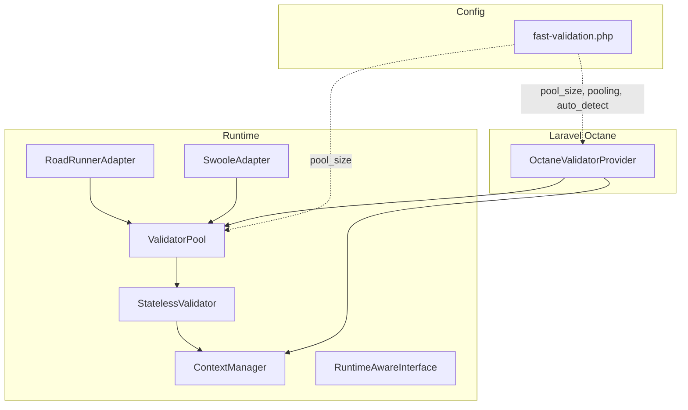
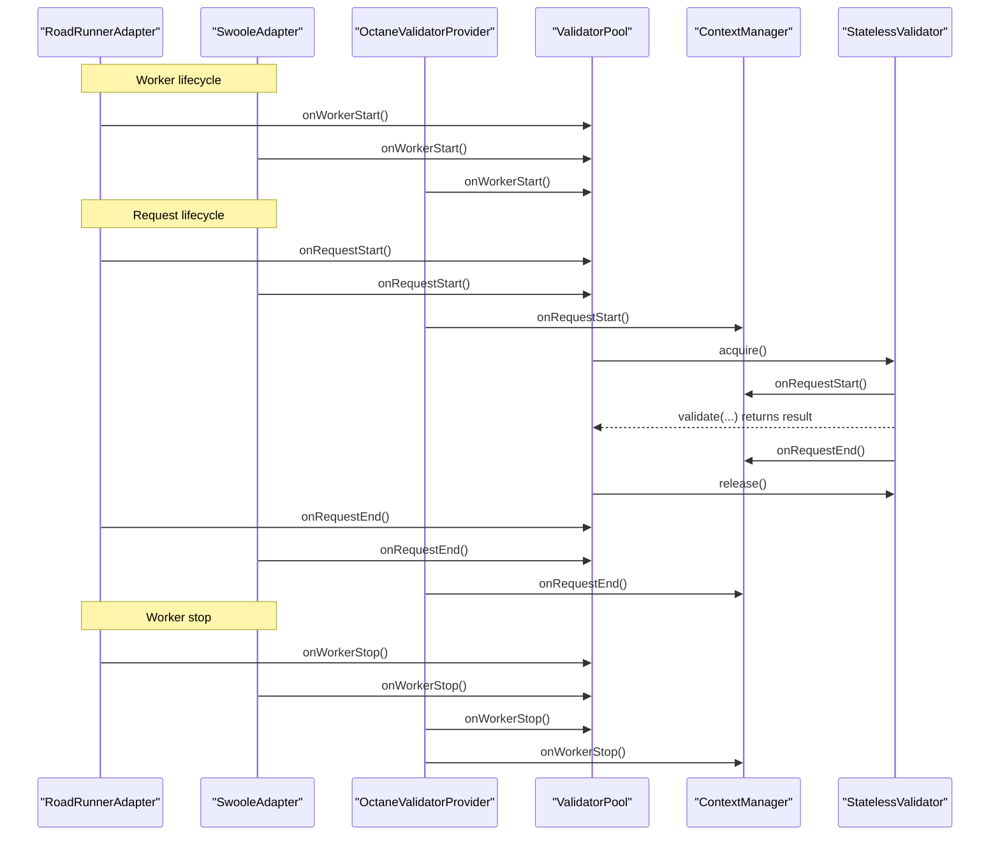
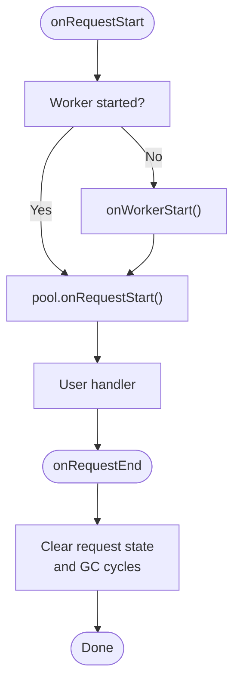
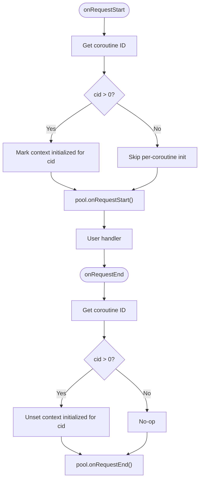
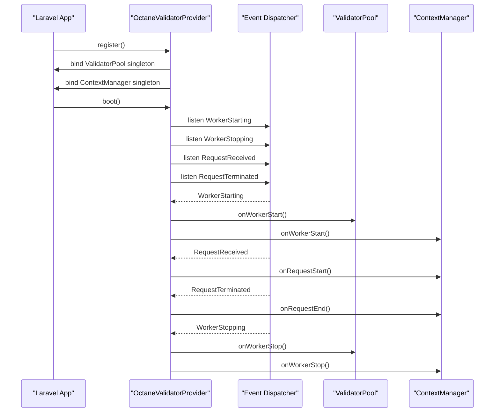
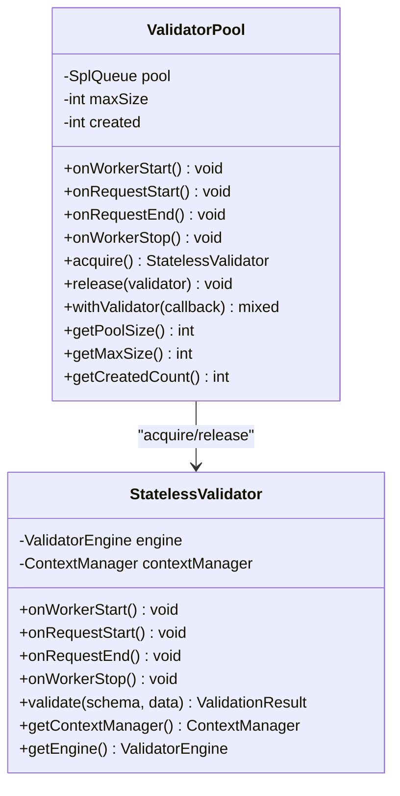
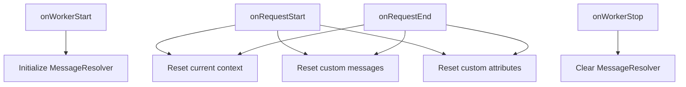
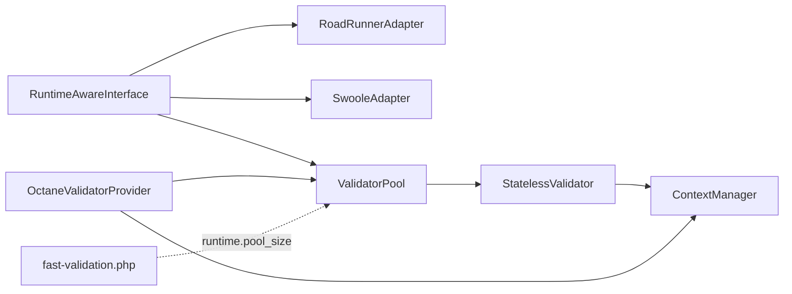

# Worker Process Adapters

<cite>
**Referenced Files in This Document**
- [RoadRunnerAdapter.php](file://src/Runtime/Workers/RoadRunnerAdapter.php)
- [SwooleAdapter.php](file://src/Runtime/Workers/SwooleAdapter.php)
- [OctaneValidatorProvider.php](file://src/Laravel/Octane/OctaneValidatorProvider.php)
- [ValidatorPool.php](file://src/Runtime/ValidatorPool.php)
- [ContextManager.php](file://src/Runtime/ContextManager.php)
- [RuntimeAwareInterface.php](file://src/Runtime/RuntimeAwareInterface.php)
- [StatelessValidator.php](file://src/Runtime/StatelessValidator.php)
- [fast-validation.php](file://config/fast-validation.php)
- [README.md](file://README.md)
</cite>

## Table of Contents
1. [Introduction](#introduction)
2. [Project Structure](#project-structure)
3. [Core Components](#core-components)
4. [Architecture Overview](#architecture-overview)
5. [Detailed Component Analysis](#detailed-component-analysis)
6. [Dependency Analysis](#dependency-analysis)
7. [Performance Considerations](#performance-considerations)
8. [Troubleshooting Guide](#troubleshooting-guide)
9. [Conclusion](#conclusion)
10. [Appendices](#appendices)

## Introduction
This document explains worker process adapters that enable long-running process support across different server environments. It covers:
- RoadRunnerAdapter for RoadRunner workers
- SwooleAdapter for Swoole coroutine environments
- OctaneValidatorProvider for Laravel Octane integration

It details adapter initialization, lifecycle management, environment-specific optimizations, configuration examples, deployment patterns, performance tuning, and troubleshooting techniques for production-grade deployments.

## Project Structure
The worker adapters live under the runtime subsystem and integrate with a validator pool and context manager to ensure safe reuse of validator instances across requests in long-running servers.

**Diagram sources**
- [RoadRunnerAdapter.php](file://src/Runtime/Workers/RoadRunnerAdapter.php#L1-L107)
- [SwooleAdapter.php](file://src/Runtime/Workers/SwooleAdapter.php#L1-L95)
- [ValidatorPool.php](file://src/Runtime/ValidatorPool.php#L1-L140)
- [ContextManager.php](file://src/Runtime/ContextManager.php#L1-L119)
- [StatelessValidator.php](file://src/Runtime/StatelessValidator.php#L1-L79)
- [OctaneValidatorProvider.php](file://src/Laravel/Octane/OctaneValidatorProvider.php#L1-L88)
- [fast-validation.php](file://config/fast-validation.php#L86-L95)

**Section sources**
- [RoadRunnerAdapter.php](file://src/Runtime/Workers/RoadRunnerAdapter.php#L1-L107)
- [SwooleAdapter.php](file://src/Runtime/Workers/SwooleAdapter.php#L1-L95)
- [OctaneValidatorProvider.php](file://src/Laravel/Octane/OctaneValidatorProvider.php#L1-L88)
- [ValidatorPool.php](file://src/Runtime/ValidatorPool.php#L1-L140)
- [ContextManager.php](file://src/Runtime/ContextManager.php#L1-L119)
- [StatelessValidator.php](file://src/Runtime/StatelessValidator.php#L1-L79)
- [fast-validation.php](file://config/fast-validation.php#L86-L95)
- [README.md](file://README.md#L807-L856)

## Core Components
- RoadRunnerAdapter: Lifecycle hooks for RoadRunner workers and request-scoped cleanup.
- SwooleAdapter: Coroutine-aware lifecycle hooks and per-coroutine context tracking.
- OctaneValidatorProvider: Laravel Octane service provider wiring lifecycle events to the validator pool and context manager.
- ValidatorPool: Reusable pool of StatelessValidator instances with pre-warming and acquire/release semantics.
- ContextManager: Request-scoped validation context and message resolver lifecycle.
- RuntimeAwareInterface: Contract for lifecycle-aware components.

**Section sources**
- [RoadRunnerAdapter.php](file://src/Runtime/Workers/RoadRunnerAdapter.php#L13-L107)
- [SwooleAdapter.php](file://src/Runtime/Workers/SwooleAdapter.php#L13-L95)
- [OctaneValidatorProvider.php](file://src/Laravel/Octane/OctaneValidatorProvider.php#L18-L88)
- [ValidatorPool.php](file://src/Runtime/ValidatorPool.php#L12-L140)
- [ContextManager.php](file://src/Runtime/ContextManager.php#L14-L119)
- [RuntimeAwareInterface.php](file://src/Runtime/RuntimeAwareInterface.php#L10-L31)

## Architecture Overview
The adapters delegate lifecycle events to a shared validator pool and context manager. The pool manages StatelessValidator instances, while the context manager ensures request-scoped state isolation.

**Diagram sources**
- [RoadRunnerAdapter.php](file://src/Runtime/Workers/RoadRunnerAdapter.php#L23-L49)
- [SwooleAdapter.php](file://src/Runtime/Workers/SwooleAdapter.php#L25-L52)
- [OctaneValidatorProvider.php](file://src/Laravel/Octane/OctaneValidatorProvider.php#L48-L65)
- [ValidatorPool.php](file://src/Runtime/ValidatorPool.php#L26-L90)
- [ContextManager.php](file://src/Runtime/ContextManager.php#L25-L48)
- [StatelessValidator.php](file://src/Runtime/StatelessValidator.php#L33-L46)

## Detailed Component Analysis

### RoadRunnerAdapter
Purpose:
- Provide lifecycle hooks for RoadRunner workers.
- Ensure request-scoped cleanup and optional automatic worker start detection.
- Offer a convenience handler to wrap request processing with lifecycle management.

Key behaviors:
- onWorkerStart: Marks worker started and delegates to the validator pool.
- onRequestStart: Ensures worker start has occurred, then starts request lifecycle in the pool.
- onRequestEnd: Ends request lifecycle and clears request state (including garbage collection).
- onWorkerStop: Stops the pool and resets worker-start flag.
- handleRequest: Executes a callable with automatic onRequestStart/onRequestEnd around it.
- Environment detection: Checks for RoadRunner environment indicators.

**Diagram sources**
- [RoadRunnerAdapter.php](file://src/Runtime/Workers/RoadRunnerAdapter.php#L23-L43)

**Section sources**
- [RoadRunnerAdapter.php](file://src/Runtime/Workers/RoadRunnerAdapter.php#L13-L107)

### SwooleAdapter
Purpose:
- Provide lifecycle hooks for Swoole coroutine environments.
- Track per-coroutine context initialization to avoid re-initialization overhead.

Key behaviors:
- onWorkerStart: Delegate to the validator pool.
- onRequestStart: Detects coroutine ID and tracks initialization per coroutine.
- onRequestEnd: Clears coroutine-specific tracking and delegates to the pool.
- onWorkerStop: Clears coroutine tracking and stops the pool.
- isCoroutineContext/isContextInitialized: Helpers to detect coroutine context and initialization state.
- getCoroutineId: Uses Swoole/OpenSwoole APIs to obtain the current coroutine ID.

**Diagram sources**
- [SwooleAdapter.php](file://src/Runtime/Workers/SwooleAdapter.php#L30-L46)

**Section sources**
- [SwooleAdapter.php](file://src/Runtime/Workers/SwooleAdapter.php#L13-L95)

### OctaneValidatorProvider
Purpose:
- Integrate with Laravel Octane to manage validator pool and context lifecycle.
- Register singleton services for ValidatorPool and ContextManager.
- Listen to Octane events to trigger lifecycle hooks.

Key behaviors:
- register: Registers ValidatorPool and ContextManager singletons, honoring pool size from configuration.
- boot: Registers event listeners for WorkerStarting/WorkerStopping and RequestReceived/RequestTerminated.
- Event handlers: Call onWorkerStart/onWorkerStop on pool and onWorkerStart/onRequestStart/onRequestEnd on context manager.
- Environment detection: Checks for Octane presence via class existence or environment markers.

**Diagram sources**
- [OctaneValidatorProvider.php](file://src/Laravel/Octane/OctaneValidatorProvider.php#L20-L66)

**Section sources**
- [OctaneValidatorProvider.php](file://src/Laravel/Octane/OctaneValidatorProvider.php#L18-L88)

### ValidatorPool
Purpose:
- Manage a pool of StatelessValidator instances for reuse in long-running processes.
- Pre-warm the pool on worker start and enforce a configurable maximum size.

Key behaviors:
- onWorkerStart: Pre-warms the pool with a small subset of validators.
- acquire/release: Provide lifecycle-aware acquisition and return of validators.
- withValidator: Execute a callback with automatic acquire/release.
- onWorkerStop: Stops all pooled validators and resets counters.

**Diagram sources**
- [ValidatorPool.php](file://src/Runtime/ValidatorPool.php#L12-L140)
- [StatelessValidator.php](file://src/Runtime/StatelessValidator.php#L15-L79)

**Section sources**
- [ValidatorPool.php](file://src/Runtime/ValidatorPool.php#L12-L140)
- [StatelessValidator.php](file://src/Runtime/StatelessValidator.php#L15-L79)

### ContextManager
Purpose:
- Provide request-scoped validation context and message resolver lifecycle.
- Reset state between requests to prevent cross-request contamination.

Key behaviors:
- onWorkerStart: Initializes message resolver.
- onRequestStart/onRequestEnd: Reset current context, custom messages, and attributes.
- onWorkerStop: Clear message resolver.
- getMessageResolver: Lazily configure custom messages and attributes before returning the resolver.

**Diagram sources**
- [ContextManager.php](file://src/Runtime/ContextManager.php#L25-L48)

**Section sources**
- [ContextManager.php](file://src/Runtime/ContextManager.php#L14-L119)

## Dependency Analysis
- RoadRunnerAdapter and SwooleAdapter depend on ValidatorPool and implement RuntimeAwareInterface.
- StatelessValidator depends on ContextManager and ValidatorEngine.
- ValidatorPool depends on StatelessValidator and uses a queue for pooling.
- OctaneValidatorProvider depends on ValidatorPool and ContextManager and listens to Octane events.
- Configuration keys for runtime pooling and sizing are defined in fast-validation.php.

**Diagram sources**
- [RuntimeAwareInterface.php](file://src/Runtime/RuntimeAwareInterface.php#L10-L31)
- [RoadRunnerAdapter.php](file://src/Runtime/Workers/RoadRunnerAdapter.php#L13-L21)
- [SwooleAdapter.php](file://src/Runtime/Workers/SwooleAdapter.php#L13-L23)
- [ValidatorPool.php](file://src/Runtime/ValidatorPool.php#L12-L24)
- [StatelessValidator.php](file://src/Runtime/StatelessValidator.php#L15-L26)
- [ContextManager.php](file://src/Runtime/ContextManager.php#L14-L28)
- [OctaneValidatorProvider.php](file://src/Laravel/Octane/OctaneValidatorProvider.php#L18-L32)
- [fast-validation.php](file://config/fast-validation.php#L86-L95)

**Section sources**
- [RuntimeAwareInterface.php](file://src/Runtime/RuntimeAwareInterface.php#L10-L31)
- [RoadRunnerAdapter.php](file://src/Runtime/Workers/RoadRunnerAdapter.php#L13-L21)
- [SwooleAdapter.php](file://src/Runtime/Workers/SwooleAdapter.php#L13-L23)
- [ValidatorPool.php](file://src/Runtime/ValidatorPool.php#L12-L24)
- [StatelessValidator.php](file://src/Runtime/StatelessValidator.php#L15-L26)
- [ContextManager.php](file://src/Runtime/ContextManager.php#L14-L28)
- [OctaneValidatorProvider.php](file://src/Laravel/Octane/OctaneValidatorProvider.php#L18-L32)
- [fast-validation.php](file://config/fast-validation.php#L86-L95)

## Performance Considerations
- Pooling: Enable pooling and tune pool_size to balance throughput and memory usage. See runtime.pool_size.
- Pre-warming: ValidatorPool pre-warms a small subset on worker start to reduce first-request latency.
- Fail-fast and error limits: Configure fail_fast and max_errors to optimize response time vs. error completeness.
- Garbage collection: RoadRunnerAdapter triggers garbage collection during request end to mitigate memory growth.
- Coroutine tracking: SwooleAdapter avoids redundant context initialization per coroutine.

[No sources needed since this section provides general guidance]

## Troubleshooting Guide
Common issues and remedies:
- Memory leaks between requests:
  - Ensure onRequestEnd is invoked in adapters and ContextManager resets state.
  - RoadRunnerAdapter clears request state and triggers garbage collection.
- Incorrect lifecycle ordering:
  - Verify worker start occurs before request start in adapters.
  - OctaneValidatorProvider listens to WorkerStarting before RequestReceived.
- Swoole coroutine confusion:
  - Use isCoroutineContext and isContextInitialized to guard per-coroutine initialization.
- Octane not detected:
  - Confirm OctaneValidatorProvider detects Octane environment and registers listeners.
- Configuration drift:
  - Review runtime.pooling and runtime.pool_size in fast-validation.php.

**Section sources**
- [RoadRunnerAdapter.php](file://src/Runtime/Workers/RoadRunnerAdapter.php#L37-L43)
- [SwooleAdapter.php](file://src/Runtime/Workers/SwooleAdapter.php#L65-L93)
- [OctaneValidatorProvider.php](file://src/Laravel/Octane/OctaneValidatorProvider.php#L34-L73)
- [ContextManager.php](file://src/Runtime/ContextManager.php#L30-L42)
- [fast-validation.php](file://config/fast-validation.php#L86-L95)

## Conclusion
The worker adapters provide robust lifecycle management for long-running environments:
- RoadRunnerAdapter offers safe request-scoped cleanup and convenience request handling.
- SwooleAdapter adds coroutine-awareness and per-coroutine context tracking.
- OctaneValidatorProvider integrates seamlessly with Laravel Octane’s event model.

Combined with ValidatorPool and ContextManager, they deliver efficient, memory-safe validation in production-grade servers.

[No sources needed since this section summarizes without analyzing specific files]

## Appendices

### Configuration Examples
- Enable pooling and set pool size:
  - runtime.pooling=true
  - runtime.pool_size=N
- Adjust performance options:
  - performance.fail_fast=true
  - performance.max_errors=N
  - performance.fast_path_rules=true

**Section sources**
- [fast-validation.php](file://config/fast-validation.php#L86-L95)
- [fast-validation.php](file://config/fast-validation.php#L54-L63)

### Deployment Patterns
- RoadRunner:
  - Initialize adapter on worker start.
  - Wrap request handling with handleRequest for automatic lifecycle.
- Swoole:
  - Call onRequestStart/onRequestEnd per request.
  - Use coroutine-aware context checks.
- Laravel Octane:
  - Register OctaneValidatorProvider.
  - Allow provider to wire Octane events to pool and context managers.

**Section sources**
- [README.md](file://README.md#L807-L856)
- [OctaneValidatorProvider.php](file://src/Laravel/Octane/OctaneValidatorProvider.php#L34-L66)
- [RoadRunnerAdapter.php](file://src/Runtime/Workers/RoadRunnerAdapter.php#L96-L105)
- [SwooleAdapter.php](file://src/Runtime/Workers/SwooleAdapter.php#L30-L46)