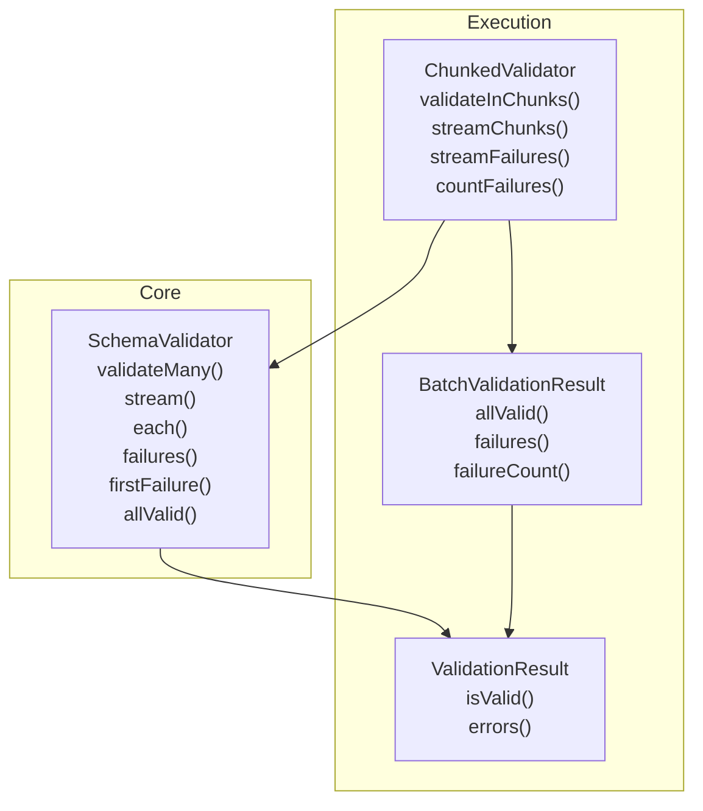
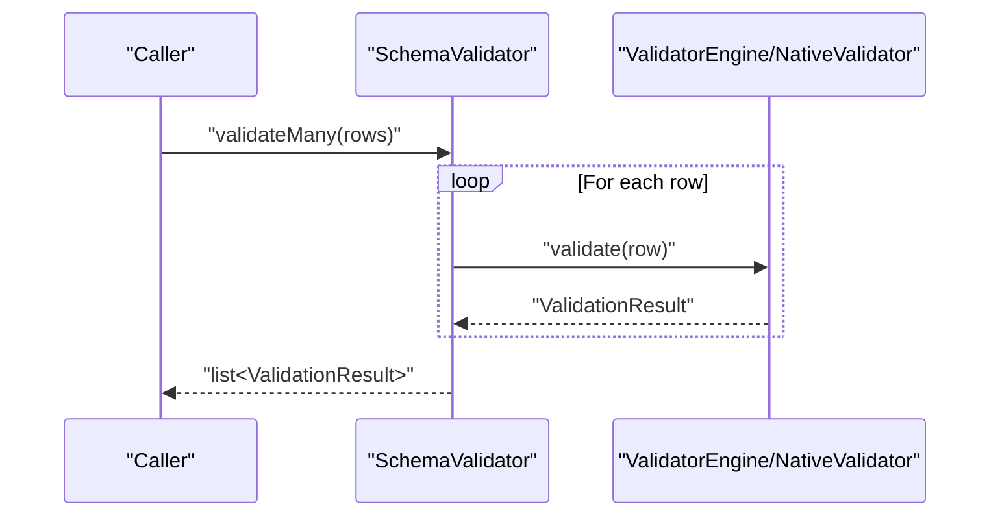
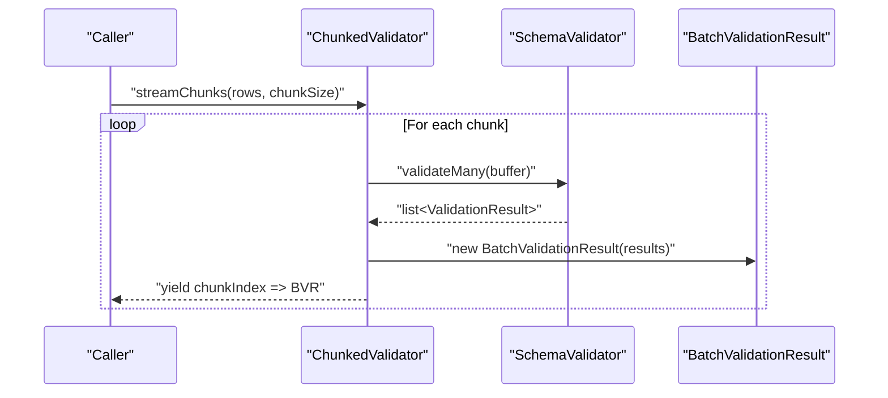
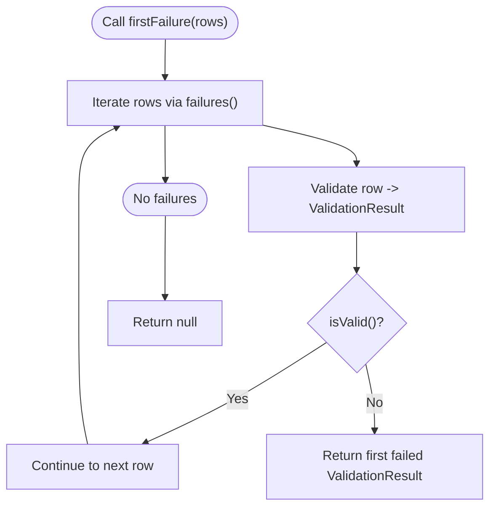
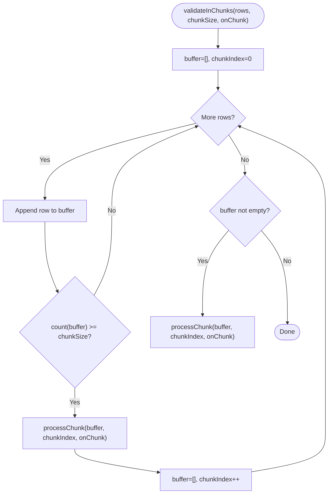
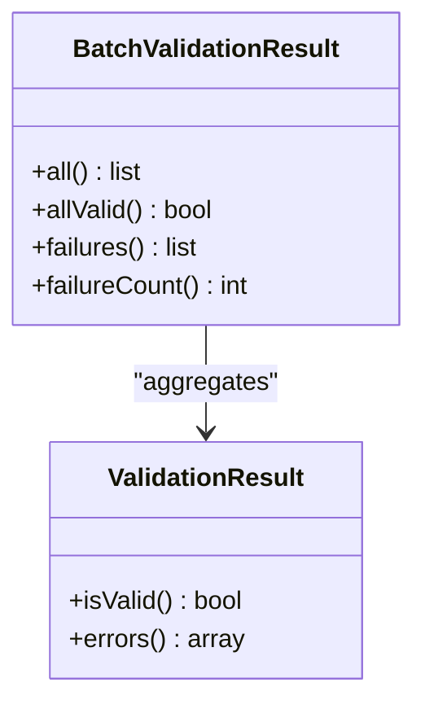
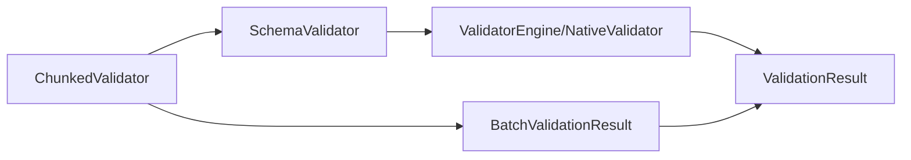

# Batch Processing

<cite>
**Referenced Files in This Document**
- [README.md](file://README.md)
- [SchemaValidator.php](file://src/SchemaValidator.php)
- [ChunkedValidator.php](file://src/Execution/ChunkedValidator.php)
- [BatchValidationResult.php](file://src/Execution/BatchValidationResult.php)
- [ValidationResult.php](file://src/Execution/ValidationResult.php)
- [benchmark.php](file://tests/benchmark.php)
- [benchmark_new_rules.php](file://tests/benchmark_new_rules.php)
- [performance_repro.php](file://tests/performance_repro.php)
</cite>

## Table of Contents
1. [Introduction](#introduction)
2. [Project Structure](#project-structure)
3. [Core Components](#core-components)
4. [Architecture Overview](#architecture-overview)
5. [Detailed Component Analysis](#detailed-component-analysis)
6. [Dependency Analysis](#dependency-analysis)
7. [Performance Considerations](#performance-considerations)
8. [Troubleshooting Guide](#troubleshooting-guide)
9. [Conclusion](#conclusion)

## Introduction
This document explains the batch processing capabilities in vi/validation, focusing on efficient validation of multiple records. It covers:
- validateMany for materialized batch validation
- Streaming APIs: stream(), each(), and failures()
- Fail-fast validation with firstFailure() and comprehensive validation with allValid()
- Chunked validation via ChunkedValidator for large datasets
- BatchValidationResult aggregation and memory-efficient strategies
- Practical examples, memory usage comparisons, and performance optimization techniques

## Project Structure
The batch processing features are centered around the SchemaValidator and supporting execution components:
- SchemaValidator exposes batch and streaming validation APIs
- ChunkedValidator orchestrates chunked processing and yields BatchValidationResult
- BatchValidationResult aggregates per-row results and provides convenience checks
- ValidationResult represents individual validation outcomes

**Diagram sources**
- [SchemaValidator.php](file://src/SchemaValidator.php#L84-L203)
- [ChunkedValidator.php](file://src/Execution/ChunkedValidator.php#L34-L152)
- [BatchValidationResult.php](file://src/Execution/BatchValidationResult.php#L17-L91)
- [ValidationResult.php](file://src/Execution/ValidationResult.php#L59-L70)

**Section sources**
- [SchemaValidator.php](file://src/SchemaValidator.php#L13-L30)
- [ChunkedValidator.php](file://src/Execution/ChunkedValidator.php#L16-L23)
- [BatchValidationResult.php](file://src/Execution/BatchValidationResult.php#L17-L26)
- [ValidationResult.php](file://src/Execution/ValidationResult.php#L9-L32)

## Core Components
- SchemaValidator: Provides batch and streaming validation primitives, including validateMany(), stream(), each(), failures(), firstFailure(), and allValid().
- ChunkedValidator: Processes large iterables in configurable chunks, yielding BatchValidationResult or streaming failures with original indices.
- BatchValidationResult: Aggregates a batch of ValidationResult instances and offers allValid(), failures(), and failureCount().
- ValidationResult: Represents a single validation outcome with validity, errors, and messages.

Practical usage patterns and memory characteristics are documented in the project’s README under “Batch Validation” and “Chunked Validation.”

**Section sources**
- [README.md](file://README.md#L205-L234)
- [README.md](file://README.md#L236-L365)
- [SchemaValidator.php](file://src/SchemaValidator.php#L84-L203)
- [ChunkedValidator.php](file://src/Execution/ChunkedValidator.php#L34-L152)
- [BatchValidationResult.php](file://src/Execution/BatchValidationResult.php#L52-L90)
- [ValidationResult.php](file://src/Execution/ValidationResult.php#L59-L70)

## Architecture Overview
The batch processing architecture separates concerns between:
- High-throughput per-record validation (SchemaValidator)
- Batch orchestration and chunking (ChunkedValidator)
- Aggregation and inspection of batch outcomes (BatchValidationResult)
- Individual result representation (ValidationResult)

**Diagram sources**
- [SchemaValidator.php](file://src/SchemaValidator.php#L84-L93)
- [SchemaValidator.php](file://src/SchemaValidator.php#L54-L73)

**Diagram sources**
- [ChunkedValidator.php](file://src/Execution/ChunkedValidator.php#L63-L81)
- [SchemaValidator.php](file://src/SchemaValidator.php#L84-L93)
- [BatchValidationResult.php](file://src/Execution/BatchValidationResult.php#L23-L26)

## Detailed Component Analysis

### SchemaValidator: Batch and Streaming APIs
- validateMany(iterable): Returns all results at once; suitable for small datasets. Warning: O(n) memory usage.
- stream(iterable): Generator-based streaming; yields one ValidationResult at a time for O(1) memory usage.
- each(iterable, callback): Immediate callback processing; no storage; O(1) memory usage.
- failures(iterable): Streams only failed results with original indices; useful for error reporting.
- firstFailure(iterable): Fail-fast; stops at the first failure.
- allValid(iterable): Memory-efficient check that returns true only if all rows pass.

**Diagram sources**
- [SchemaValidator.php](file://src/SchemaValidator.php#L184-L191)
- [SchemaValidator.php](file://src/SchemaValidator.php#L161-L174)

**Section sources**
- [SchemaValidator.php](file://src/SchemaValidator.php#L84-L93)
- [SchemaValidator.php](file://src/SchemaValidator.php#L113-L121)
- [SchemaValidator.php](file://src/SchemaValidator.php#L141-L149)
- [SchemaValidator.php](file://src/SchemaValidator.php#L161-L174)
- [SchemaValidator.php](file://src/SchemaValidator.php#L184-L203)

### ChunkedValidator: Controlled Memory Usage for Large Datasets
- validateInChunks(rows, chunkSize, onChunk): Buffers up to chunkSize rows, validates in bulk, and invokes a callback per chunk.
- streamChunks(rows, chunkSize): Yields BatchValidationResult per chunk; balances throughput and memory.
- streamFailures(rows, chunkSize): Yields only failed results with original global indices; preserves row identity across chunks.
- countFailures(rows, chunkSize): Computes total failure count without materializing all results.

**Diagram sources**
- [ChunkedValidator.php](file://src/Execution/ChunkedValidator.php#L34-L52)
- [ChunkedValidator.php](file://src/Execution/ChunkedValidator.php#L133-L137)

**Section sources**
- [ChunkedValidator.php](file://src/Execution/ChunkedValidator.php#L34-L52)
- [ChunkedValidator.php](file://src/Execution/ChunkedValidator.php#L63-L81)
- [ChunkedValidator.php](file://src/Execution/ChunkedValidator.php#L92-L110)
- [ChunkedValidator.php](file://src/Execution/ChunkedValidator.php#L118-L127)

### BatchValidationResult: Aggregation and Inspection
- all(): Returns the underlying list of ValidationResult.
- allValid(): True if every ValidationResult is valid.
- failures(): Returns only failed results.
- failureCount(): Counts failed results without storing them.

**Diagram sources**
- [BatchValidationResult.php](file://src/Execution/BatchValidationResult.php#L17-L91)
- [ValidationResult.php](file://src/Execution/ValidationResult.php#L59-L70)

**Section sources**
- [BatchValidationResult.php](file://src/Execution/BatchValidationResult.php#L31-L90)
- [ValidationResult.php](file://src/Execution/ValidationResult.php#L59-L70)

### Practical Examples and Scenarios
- Batch validation with validateMany for small datasets
- Streaming validation with stream() for O(1) memory usage
- Fail-fast validation with firstFailure() and comprehensive validation with allValid()
- Chunked streaming with streamChunks() for batch processing with controlled memory
- Failure-only streaming with streamFailures() and counting with countFailures()

These examples and patterns are demonstrated in the project’s README under “Batch Validation” and “Chunked Validation.”

**Section sources**
- [README.md](file://README.md#L205-L234)
- [README.md](file://README.md#L266-L365)

## Dependency Analysis
- SchemaValidator depends on ValidatorEngine or NativeValidator for per-record validation and produces ValidationResult.
- ChunkedValidator composes SchemaValidator and produces BatchValidationResult or yields ValidationResult generators.
- BatchValidationResult depends on ValidationResult for aggregation and inspection.

**Diagram sources**
- [SchemaValidator.php](file://src/SchemaValidator.php#L54-L73)
- [ChunkedValidator.php](file://src/Execution/ChunkedValidator.php#L18-L23)
- [BatchValidationResult.php](file://src/Execution/BatchValidationResult.php#L19-L26)

**Section sources**
- [SchemaValidator.php](file://src/SchemaValidator.php#L13-L30)
- [ChunkedValidator.php](file://src/Execution/ChunkedValidator.php#L16-L23)
- [BatchValidationResult.php](file://src/Execution/BatchValidationResult.php#L17-L26)

## Performance Considerations
- validateMany() materializes all results; suitable for small datasets (<10k rows).
- stream(), each(), and failures() keep memory usage constant (O(1)).
- streamChunks() trades throughput for controlled memory by processing in chunks.
- Benchmarks demonstrate throughput and parity checks for large-scale validation.

Memory usage summary from the README:
- validateMany(): O(n) memory
- stream(): O(1) memory
- each(): O(1) memory
- failures(): O(1) memory
- streamChunks(): O(chunk) memory

**Section sources**
- [README.md](file://README.md#L367-L376)
- [benchmark.php](file://tests/benchmark.php#L41-L54)
- [benchmark_new_rules.php](file://tests/benchmark_new_rules.php#L54-L66)
- [performance_repro.php](file://tests/performance_repro.php#L60-L82)

## Troubleshooting Guide
- Prefer streaming APIs for large datasets to avoid memory exhaustion.
- Use firstFailure() to enforce fail-fast behavior and reduce processing time.
- Use allValid() for a memory-efficient pass/fail check without storing results.
- Use streamFailures() to report only failures and preserve original row indices.
- Use countFailures() to compute totals without materializing all results.

**Section sources**
- [SchemaValidator.php](file://src/SchemaValidator.php#L184-L203)
- [ChunkedValidator.php](file://src/Execution/ChunkedValidator.php#L92-L127)
- [README.md](file://README.md#L266-L365)

## Conclusion
vi/validation provides robust, memory-efficient batch processing through:
- validateMany for small, manageable datasets
- Streaming APIs (stream, each, failures) for O(1) memory usage
- Fail-fast and comprehensive checks (firstFailure, allValid)
- ChunkedValidator for large datasets with controlled memory via chunked processing and BatchValidationResult aggregation

Adopt the appropriate API based on dataset size and memory constraints to achieve optimal throughput and reliability.