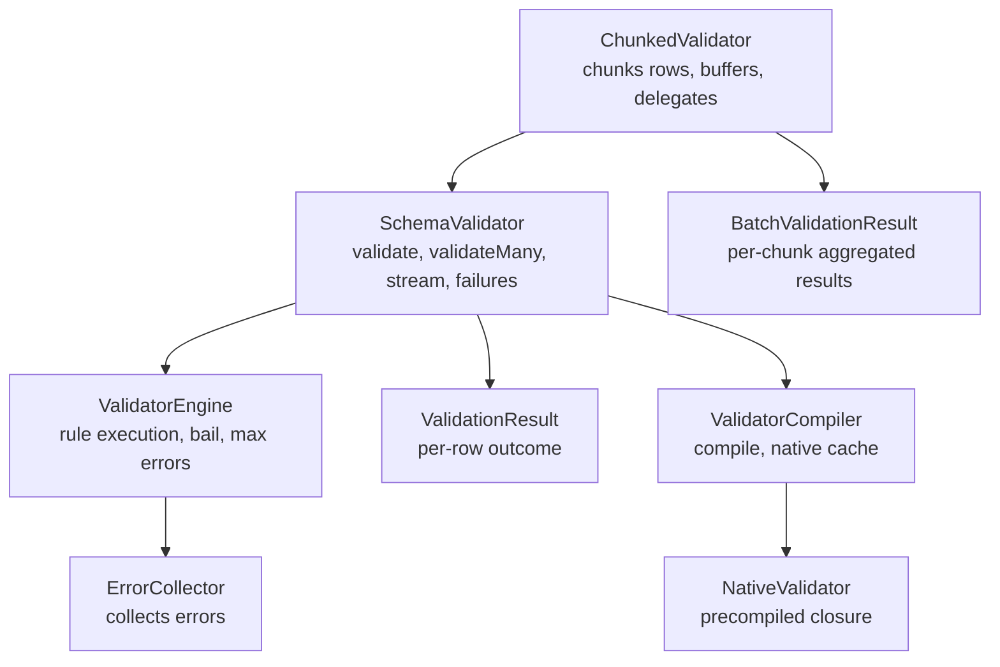
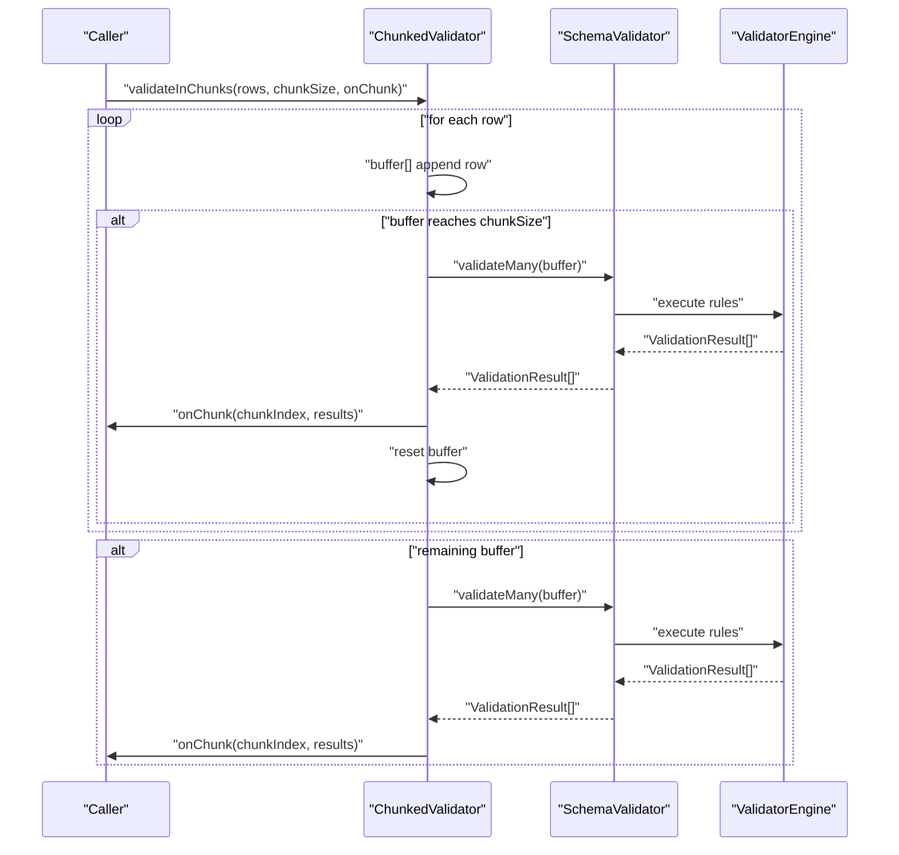
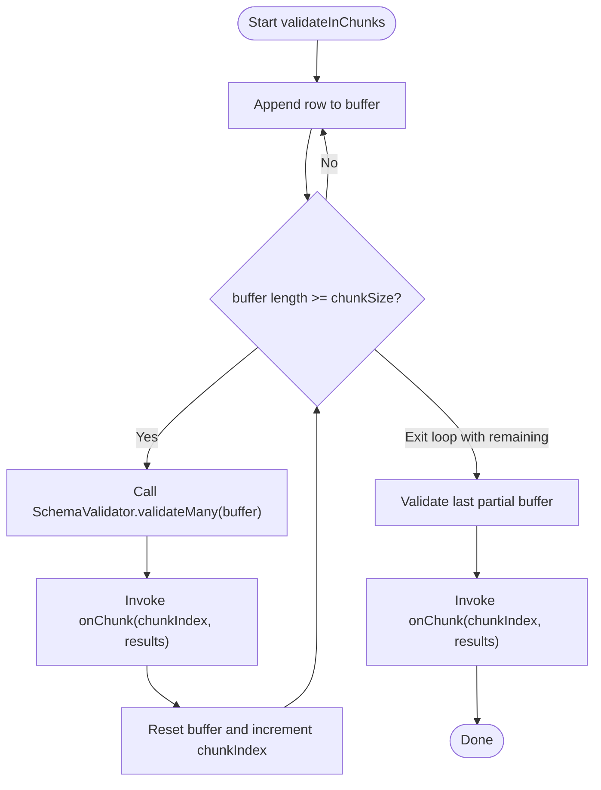
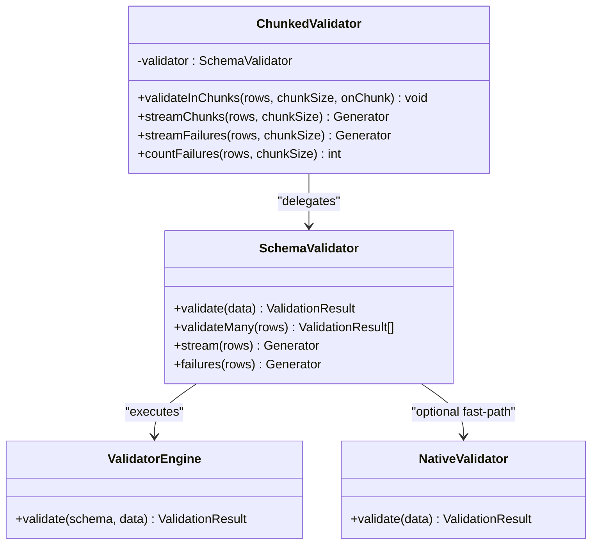
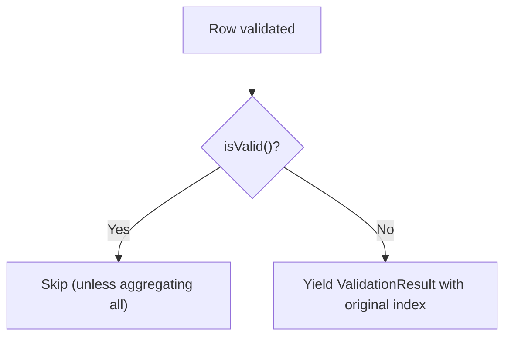
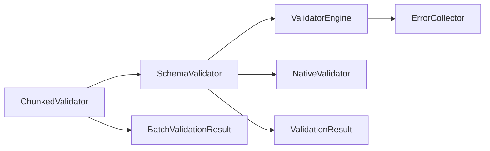

# Chunked Processing

<cite>
**Referenced Files in This Document**
- [ChunkedValidator.php](file://src/Execution/ChunkedValidator.php)
- [BatchValidationResult.php](file://src/Execution/BatchValidationResult.php)
- [SchemaValidator.php](file://src/SchemaValidator.php)
- [ValidatorEngine.php](file://src/Execution/ValidatorEngine.php)
- [ValidationResult.php](file://src/Execution/ValidationResult.php)
- [ErrorCollector.php](file://src/Execution/ErrorCollector.php)
- [README.md](file://README.md)
- [ValidatorCompiler.php](file://src/Compilation/ValidatorCompiler.php)
- [NativeValidator.php](file://src/Execution/NativeValidator.php)
</cite>

## Table of Contents
1. [Introduction](#introduction)
2. [Project Structure](#project-structure)
3. [Core Components](#core-components)
4. [Architecture Overview](#architecture-overview)
5. [Detailed Component Analysis](#detailed-component-analysis)
6. [Dependency Analysis](#dependency-analysis)
7. [Performance Considerations](#performance-considerations)
8. [Troubleshooting Guide](#troubleshooting-guide)
9. [Conclusion](#conclusion)
10. [Appendices](#appendices)

## Introduction
This document explains the chunked processing capabilities for large-scale validation using ChunkedValidator. It covers how chunked validation divides massive datasets into controlled batches to limit memory usage and processing time, how ChunkedValidator integrates with SchemaValidator, and how to optimize chunk sizes, track progress, and recover from interruptions. Practical use cases include database migrations, bulk data updates, and long-running batch jobs.

## Project Structure
The chunked validation feature spans several core modules:
- ChunkedValidator orchestrates buffered chunking and delegates to SchemaValidator for validation.
- SchemaValidator provides the underlying validation pipeline, including streaming and batch APIs.
- BatchValidationResult aggregates per-chunk results for downstream processing.
- ValidatorEngine executes rules and collects errors.
- ValidationResult encapsulates individual validation outcomes.
- ErrorCollector accumulates rule violations during execution.
- ValidatorCompiler and NativeValidator enable high-performance compiled validators.

**Diagram sources**
- [ChunkedValidator.php](file://src/Execution/ChunkedValidator.php#L16-L153)
- [SchemaValidator.php](file://src/SchemaValidator.php#L13-L204)
- [ValidatorEngine.php](file://src/Execution/ValidatorEngine.php#L11-L177)
- [BatchValidationResult.php](file://src/Execution/BatchValidationResult.php#L17-L91)
- [ValidationResult.php](file://src/Execution/ValidationResult.php#L9-L142)
- [ErrorCollector.php](file://src/Execution/ErrorCollector.php#L7-L51)
- [ValidatorCompiler.php](file://src/Compilation/ValidatorCompiler.php#L10-L195)
- [NativeValidator.php](file://src/Execution/NativeValidator.php#L12-L39)

**Section sources**
- [ChunkedValidator.php](file://src/Execution/ChunkedValidator.php#L16-L153)
- [SchemaValidator.php](file://src/SchemaValidator.php#L13-L204)
- [BatchValidationResult.php](file://src/Execution/BatchValidationResult.php#L17-L91)
- [ValidatorEngine.php](file://src/Execution/ValidatorEngine.php#L11-L177)
- [ValidationResult.php](file://src/Execution/ValidationResult.php#L9-L142)
- [ErrorCollector.php](file://src/Execution/ErrorCollector.php#L7-L51)
- [ValidatorCompiler.php](file://src/Compilation/ValidatorCompiler.php#L10-L195)
- [NativeValidator.php](file://src/Execution/NativeValidator.php#L12-L39)

## Core Components
- ChunkedValidator
  - Buffers rows until reaching a configurable chunkSize.
  - Validates chunks via SchemaValidator::validateMany and either:
    - Invokes a callback per chunk with all results, or
    - Streams BatchValidationResult per chunk for memory-controlled iteration.
  - Provides specialized streaming of only failures with original row indices.
  - Counts total failures across chunks without materializing all results.
- SchemaValidator
  - Central validation entry point with streaming, batch, and failure-focused APIs.
  - Uses ValidatorEngine for rule execution and optionally NativeValidator for compiled closures.
- BatchValidationResult
  - Aggregates per-chunk results, exposes counts, filters failures, and supports iteration.
- ValidatorEngine
  - Applies rules, honors bail and max errors, and manages error collection.
- ValidationResult and ErrorCollector
  - Capture per-row outcomes and error sets.

**Section sources**
- [ChunkedValidator.php](file://src/Execution/ChunkedValidator.php#L34-L153)
- [SchemaValidator.php](file://src/SchemaValidator.php#L84-L204)
- [BatchValidationResult.php](file://src/Execution/BatchValidationResult.php#L17-L91)
- [ValidatorEngine.php](file://src/Execution/ValidatorEngine.php#L33-L177)
- [ValidationResult.php](file://src/Execution/ValidationResult.php#L22-L142)
- [ErrorCollector.php](file://src/Execution/ErrorCollector.php#L17-L51)

## Architecture Overview
ChunkedValidator sits atop SchemaValidator and delegates validation to it. For each chunk, it either:
- Calls validateMany and passes results to a caller-supplied callback, or
- Yields BatchValidationResult objects for streaming iteration.

**Diagram sources**
- [ChunkedValidator.php](file://src/Execution/ChunkedValidator.php#L34-L52)
- [SchemaValidator.php](file://src/SchemaValidator.php#L84-L93)
- [ValidatorEngine.php](file://src/Execution/ValidatorEngine.php#L33-L98)

## Detailed Component Analysis

### ChunkedValidator
Responsibilities:
- Buffer rows and emit chunks of fixed size.
- Delegate validation to SchemaValidator.
- Provide three processing modes:
  - Callback-per-chunk for batch processing.
  - Stream-chunks for memory-controlled iteration.
  - Stream-failures with original indices for targeted error reporting.
- Count failures across chunks efficiently.

Key methods and behavior:
- validateInChunks: Accumulates rows, validates on threshold, invokes callback, resets buffer, handles final partial chunk.
- streamChunks: Similar buffering, but yields BatchValidationResult per chunk.
- streamFailures: Tracks global row index, validates each row individually, yields only invalid results.
- countFailures: Iterates streamChunks and sums failureCount from each BatchValidationResult.

**Diagram sources**
- [ChunkedValidator.php](file://src/Execution/ChunkedValidator.php#L34-L52)

**Section sources**
- [ChunkedValidator.php](file://src/Execution/ChunkedValidator.php#L34-L153)

### SchemaValidator Integration
ChunkedValidator depends on SchemaValidator for:
- validateMany: Batch validation of buffered rows.
- validate: Single-row validation for streamFailures.
- Underlying execution handled by ValidatorEngine, optionally accelerated by NativeValidator when precompiled artifacts exist.

**Diagram sources**
- [ChunkedValidator.php](file://src/Execution/ChunkedValidator.php#L16-L23)
- [SchemaValidator.php](file://src/SchemaValidator.php#L13-L30)
- [ValidatorEngine.php](file://src/Execution/ValidatorEngine.php#L11-L31)
- [NativeValidator.php](file://src/Execution/NativeValidator.php#L12-L22)

**Section sources**
- [SchemaValidator.php](file://src/SchemaValidator.php#L54-L93)
- [ValidatorEngine.php](file://src/Execution/ValidatorEngine.php#L33-L98)
- [NativeValidator.php](file://src/Execution/NativeValidator.php#L27-L37)

### BatchValidationResult
Purpose:
- Wrap a batch of ValidationResult objects produced by validateMany.
- Provide quick checks (allValid), filter failures, and iterate results.
- Enable counting failures without retaining all successes.

Usage in chunked processing:
- streamChunks yields BatchValidationResult per chunk for downstream processing.

**Section sources**
- [BatchValidationResult.php](file://src/Execution/BatchValidationResult.php#L17-L91)

### Error Handling and Failures
- ValidatorEngine applies rules and stops early under failFast or maxErrors thresholds.
- ErrorCollector aggregates errors per field.
- ValidationResult exposes validity, errors, and formatted messages.
- ChunkedValidator’s streamFailures yields only invalid results with original indices, enabling targeted remediation.

**Diagram sources**
- [ChunkedValidator.php](file://src/Execution/ChunkedValidator.php#L92-L110)
- [ValidationResult.php](file://src/Execution/ValidationResult.php#L59-L62)
- [ErrorCollector.php](file://src/Execution/ErrorCollector.php#L17-L25)

**Section sources**
- [ValidatorEngine.php](file://src/Execution/ValidatorEngine.php#L148-L159)
- [ErrorCollector.php](file://src/Execution/ErrorCollector.php#L17-L51)
- [ValidationResult.php](file://src/Execution/ValidationResult.php#L59-L142)
- [ChunkedValidator.php](file://src/Execution/ChunkedValidator.php#L92-L110)

## Dependency Analysis
- ChunkedValidator depends on SchemaValidator for validation execution.
- SchemaValidator depends on ValidatorEngine for rule evaluation and optionally on NativeValidator for compiled closures.
- ValidatorEngine uses ErrorCollector to accumulate errors and respects failFast and maxErrors policies.
- BatchValidationResult depends on ValidationResult for aggregation.

**Diagram sources**
- [ChunkedValidator.php](file://src/Execution/ChunkedValidator.php#L16-L23)
- [SchemaValidator.php](file://src/SchemaValidator.php#L13-L30)
- [ValidatorEngine.php](file://src/Execution/ValidatorEngine.php#L11-L31)
- [ErrorCollector.php](file://src/Execution/ErrorCollector.php#L7-L12)
- [BatchValidationResult.php](file://src/Execution/BatchValidationResult.php#L17-L26)
- [ValidationResult.php](file://src/Execution/ValidationResult.php#L9-L22)
- [NativeValidator.php](file://src/Execution/NativeValidator.php#L12-L22)

**Section sources**
- [ChunkedValidator.php](file://src/Execution/ChunkedValidator.php#L16-L23)
- [SchemaValidator.php](file://src/SchemaValidator.php#L13-L30)
- [ValidatorEngine.php](file://src/Execution/ValidatorEngine.php#L11-L31)
- [ErrorCollector.php](file://src/Execution/ErrorCollector.php#L7-L12)
- [BatchValidationResult.php](file://src/Execution/BatchValidationResult.php#L17-L26)
- [ValidationResult.php](file://src/Execution/ValidationResult.php#L9-L22)
- [NativeValidator.php](file://src/Execution/NativeValidator.php#L12-L22)

## Performance Considerations
- Chunk sizing
  - Smaller chunks reduce peak memory but increase overhead.
  - Larger chunks improve throughput but raise memory footprint.
  - Recommended starting points: thousands for database writes, tens of thousands for pure validation reporting.
- Streaming vs batch
  - streamChunks yields BatchValidationResult per chunk, keeping per-chunk memory bounded.
  - validateInChunks passes all results to a callback; suitable when downstream processing benefits from immediate access to the whole chunk.
- Failure-only processing
  - streamFailures avoids materializing successful results, reducing memory and I/O.
- Precompiled validators
  - ValidatorCompiler and NativeValidator can accelerate repeated validations when schemas are reused.
- Engine controls
  - failFast and maxErrors in ValidatorEngine can cut validation short when appropriate.

[No sources needed since this section provides general guidance]

## Troubleshooting Guide
Common issues and remedies:
- Out-of-memory errors on large datasets
  - Switch from validateMany to streamChunks or streamFailures.
  - Reduce chunkSize to lower peak memory.
- Lost context across chunks
  - Use streamFailures to retain original row indices for error reporting and remediation.
- Interrupted processing
  - Resume by tracking the last processed chunkIndex and continuing from there.
  - For idempotent operations (e.g., writing to a staging table), re-run failed chunks.
- Excessive logging or I/O
  - Prefer streamFailures to log only failures.
  - Use countFailures to estimate total failures without buffering all results.

**Section sources**
- [ChunkedValidator.php](file://src/Execution/ChunkedValidator.php#L92-L127)
- [SchemaValidator.php](file://src/SchemaValidator.php#L96-L174)
- [ValidatorEngine.php](file://src/Execution/ValidatorEngine.php#L100-L108)

## Conclusion
ChunkedValidator enables robust, memory-efficient validation of large datasets by controlling batch sizes and leveraging SchemaValidator’s streaming and batch APIs. Combined with failure-only processing and precompiled validators, it supports scalable, long-running operations such as database migrations and bulk updates.

[No sources needed since this section summarizes without analyzing specific files]

## Appendices

### How to Use ChunkedValidator
- Basic chunked validation with a callback per chunk.
- Stream chunks for memory-controlled iteration.
- Stream only failures with original indices.
- Count failures across all chunks without storing all results.

For usage examples and recommended patterns, refer to the repository documentation.

**Section sources**
- [README.md](file://README.md#L236-L365)