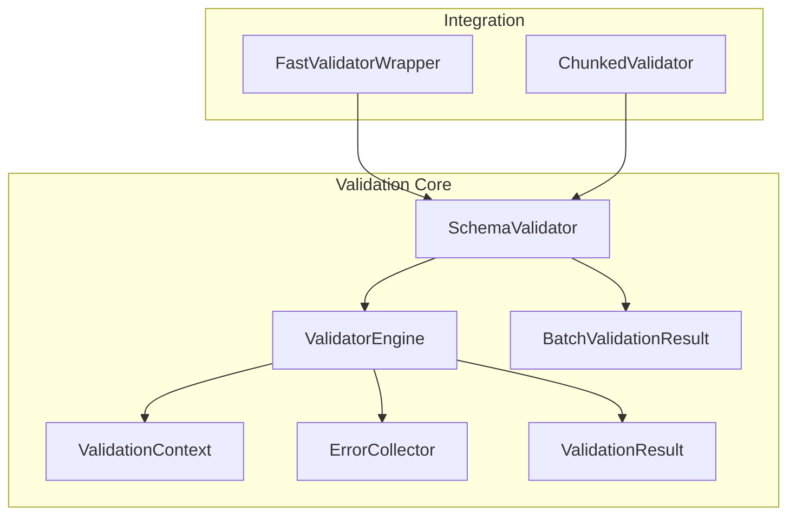
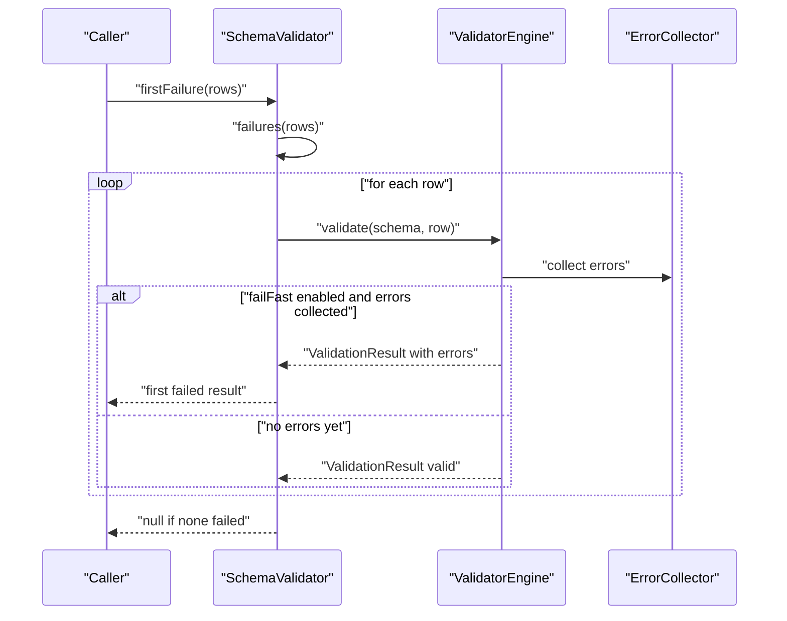
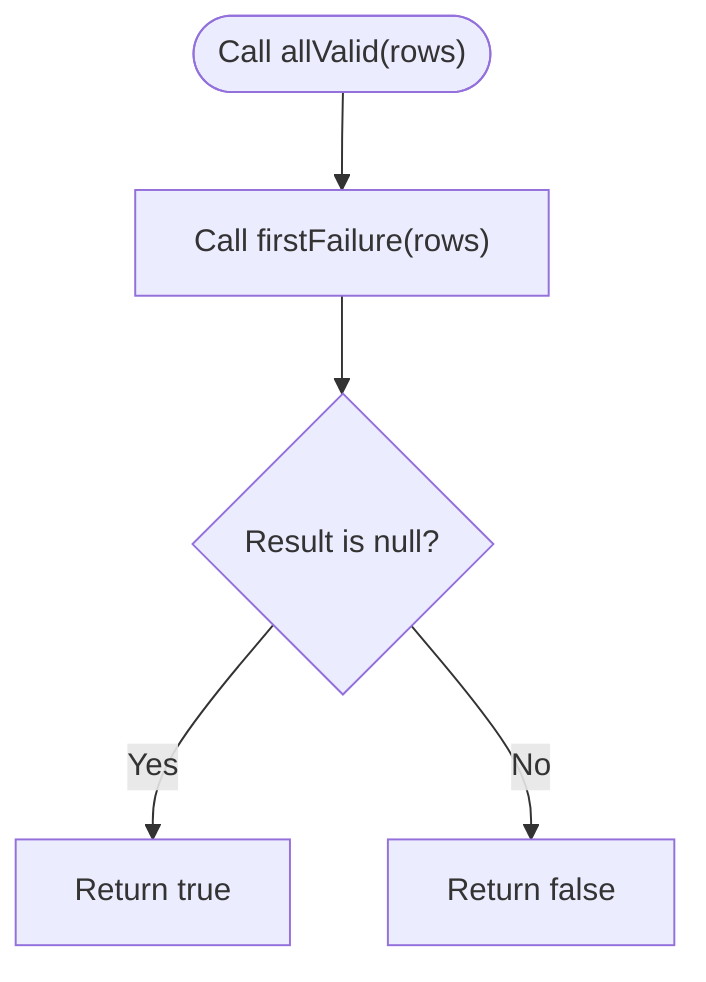
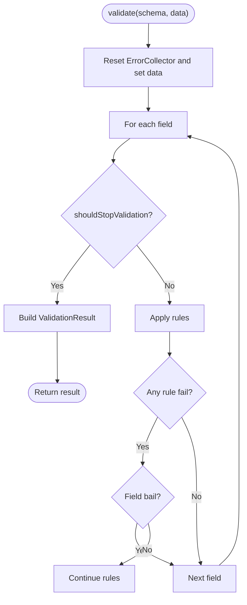
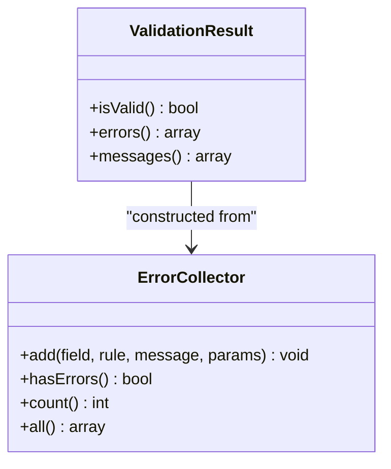
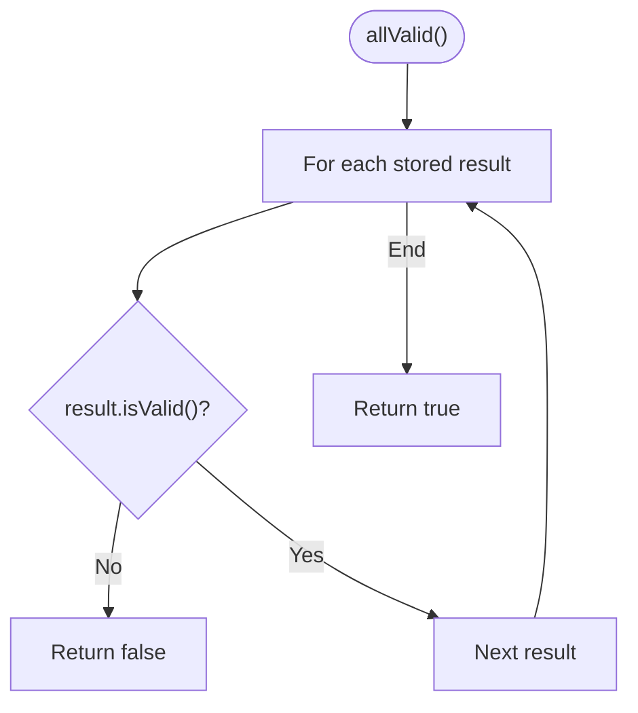
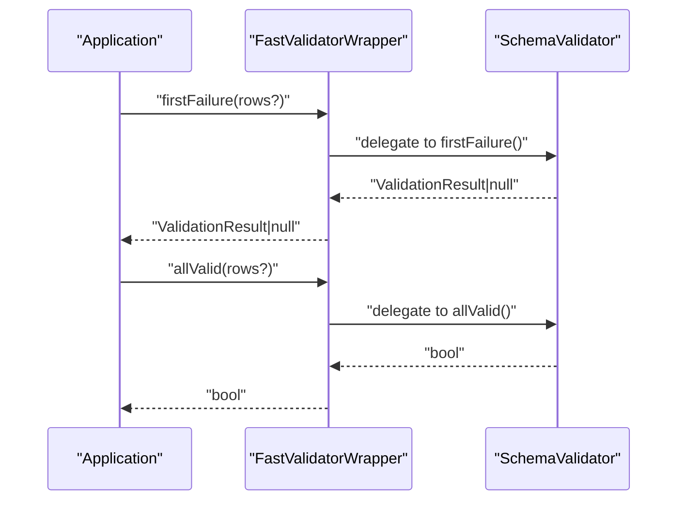
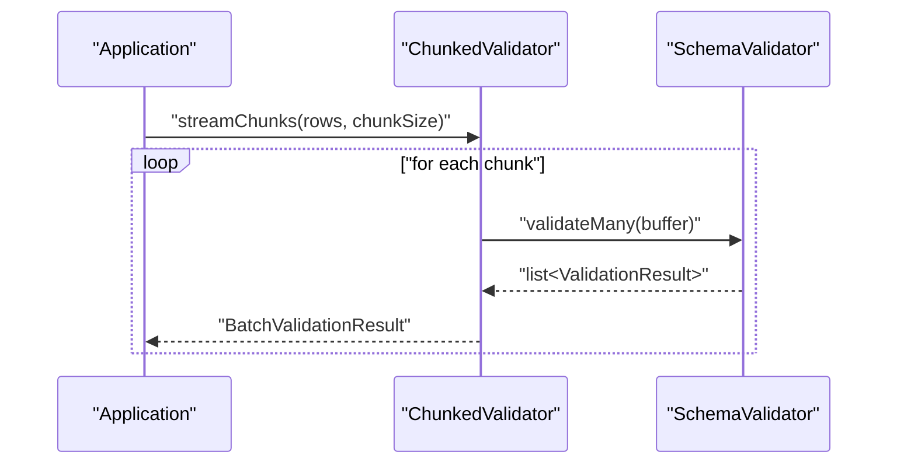
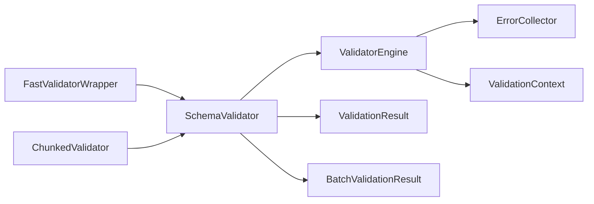

# Fail-Fast Validation

<cite>
**Referenced Files in This Document**
- [SchemaValidator.php](file://src/SchemaValidator.php)
- [BatchValidationResult.php](file://src/Execution/BatchValidationResult.php)
- [ValidatorEngine.php](file://src/Execution/ValidatorEngine.php)
- [ValidationResult.php](file://src/Execution/ValidationResult.php)
- [ErrorCollector.php](file://src/Execution/ErrorCollector.php)
- [ValidationContext.php](file://src/Execution/ValidationContext.php)
- [README.md](file://README.md)
- [FastValidatorWrapper.php](file://src/Laravel/FastValidatorWrapper.php)
- [ChunkedValidator.php](file://src/Execution/ChunkedValidator.php)
</cite>

## Table of Contents
1. [Introduction](#introduction)
2. [Project Structure](#project-structure)
3. [Core Components](#core-components)
4. [Architecture Overview](#architecture-overview)
5. [Detailed Component Analysis](#detailed-component-analysis)
6. [Dependency Analysis](#dependency-analysis)
7. [Performance Considerations](#performance-considerations)
8. [Troubleshooting Guide](#troubleshooting-guide)
9. [Conclusion](#conclusion)
10. [Appendices](#appendices)

## Introduction
This document explains fail-fast validation using two key methods: firstFailure() and allValid(). Fail-fast validation stops processing as soon as the first error is encountered, saving significant CPU time, memory, and I/O compared to full validation. It is ideal for:
- Data quality checks where you must reject bad inputs quickly
- Import validation for large files or streams
- Real-time data processing pipelines that cannot tolerate delays

The implementation centers around SchemaValidator’s firstFailure() and allValid() methods, which internally leverage the streaming and memory-efficient execution patterns of the validation engine.

## Project Structure
The fail-fast capabilities are implemented across several core modules:
- SchemaValidator orchestrates validation workflows and exposes firstFailure() and allValid()
- ValidatorEngine performs field-level validation and supports fail-fast behavior
- ValidationResult and ErrorCollector represent validation outcomes and collected errors
- BatchValidationResult provides batch-level helpers including allValid() for aggregated results
- FastValidatorWrapper integrates these capabilities into Laravel-style APIs
- ChunkedValidator enables memory-controlled processing of very large datasets

**Diagram sources**
- [SchemaValidator.php](file://src/SchemaValidator.php#L13-L205)
- [ValidatorEngine.php](file://src/Execution/ValidatorEngine.php#L11-L177)
- [ValidationResult.php](file://src/Execution/ValidationResult.php#L9-L142)
- [ErrorCollector.php](file://src/Execution/ErrorCollector.php#L7-L51)
- [ValidationContext.php](file://src/Execution/ValidationContext.php#L7-L98)
- [BatchValidationResult.php](file://src/Execution/BatchValidationResult.php#L17-L92)
- [FastValidatorWrapper.php](file://src/Laravel/FastValidatorWrapper.php#L14-L400)
- [ChunkedValidator.php](file://src/Execution/ChunkedValidator.php#L16-L154)

**Section sources**
- [SchemaValidator.php](file://src/SchemaValidator.php#L13-L205)
- [ValidatorEngine.php](file://src/Execution/ValidatorEngine.php#L11-L177)
- [ValidationResult.php](file://src/Execution/ValidationResult.php#L9-L142)
- [ErrorCollector.php](file://src/Execution/ErrorCollector.php#L7-L51)
- [ValidationContext.php](file://src/Execution/ValidationContext.php#L7-L98)
- [BatchValidationResult.php](file://src/Execution/BatchValidationResult.php#L17-L92)
- [FastValidatorWrapper.php](file://src/Laravel/FastValidatorWrapper.php#L14-L400)
- [ChunkedValidator.php](file://src/Execution/ChunkedValidator.php#L16-L154)

## Core Components
- SchemaValidator.firstFailure(iterable): Returns the first failing ValidationResult or null if all pass. Internally iterates failures() and returns the first yielded item.
- SchemaValidator.allValid(iterable): Returns true if no failures are found; otherwise false. Implemented as “firstFailure equals null”.
- ValidatorEngine.failFast flag: When enabled, stops validation once any error is collected, preventing unnecessary rule evaluations.
- ValidationResult: Encapsulates per-row validation outcome, including validity, errors, and messages.
- ErrorCollector: Accumulates field-level errors during validation.
- ValidationContext: Provides access to input data and error collection during rule evaluation.
- BatchValidationResult.allValid(): Aggregates per-row results to check if all are valid without storing all results.

These components combine to enable efficient fail-fast validation across single rows, streams, and chunks.

**Section sources**
- [SchemaValidator.php](file://src/SchemaValidator.php#L176-L203)
- [ValidatorEngine.php](file://src/Execution/ValidatorEngine.php#L14-L31)
- [ValidationResult.php](file://src/Execution/ValidationResult.php#L59-L62)
- [ErrorCollector.php](file://src/Execution/ErrorCollector.php#L17-L25)
- [ValidationContext.php](file://src/Execution/ValidationContext.php#L93-L96)
- [BatchValidationResult.php](file://src/Execution/BatchValidationResult.php#L52-L61)

## Architecture Overview
Fail-fast validation is achieved by combining streaming iteration with early termination in the engine and wrapper APIs.

**Diagram sources**
- [SchemaValidator.php](file://src/SchemaValidator.php#L176-L191)
- [ValidatorEngine.php](file://src/Execution/ValidatorEngine.php#L148-L159)
- [ErrorCollector.php](file://src/Execution/ErrorCollector.php#L17-L25)

## Detailed Component Analysis

### SchemaValidator: firstFailure() and allValid()
- firstFailure(): Iterates failures() and returns the first yielded result. If no failures are found, returns null.
- allValid(): Returns true if firstFailure() returns null; otherwise false. This is a memory-efficient check that stops at the first failure.

**Diagram sources**
- [SchemaValidator.php](file://src/SchemaValidator.php#L193-L203)

**Section sources**
- [SchemaValidator.php](file://src/SchemaValidator.php#L176-L203)

### ValidatorEngine: Early Termination Logic
- failFast flag: When true and any error is collected, the engine stops processing further rules and fields.
- shouldStopValidation(): Returns true if failFast is enabled and errors exist, or if maxErrors threshold is reached.
- Field-level bail: Within a field, if a rule fails and the field has bail configured, processing stops for that field.

**Diagram sources**
- [ValidatorEngine.php](file://src/Execution/ValidatorEngine.php#L33-L98)
- [ValidatorEngine.php](file://src/Execution/ValidatorEngine.php#L148-L159)

**Section sources**
- [ValidatorEngine.php](file://src/Execution/ValidatorEngine.php#L14-L31)
- [ValidatorEngine.php](file://src/Execution/ValidatorEngine.php#L148-L159)

### ValidationResult and ErrorCollector
- ValidationResult.isValid(): True when no errors are collected.
- ErrorCollector.add(): Records a single error with field, rule, optional message, and parameters.
- ValidationResult.messages()/errors(): Provide structured access to collected errors for reporting.

**Diagram sources**
- [ValidationResult.php](file://src/Execution/ValidationResult.php#L59-L70)
- [ErrorCollector.php](file://src/Execution/ErrorCollector.php#L17-L25)

**Section sources**
- [ValidationResult.php](file://src/Execution/ValidationResult.php#L59-L70)
- [ErrorCollector.php](file://src/Execution/ErrorCollector.php#L17-L25)

### BatchValidationResult: Aggregated Validation
- allValid(): Iterates stored results and returns false upon encountering the first invalid result, otherwise true. This mirrors the behavior of allValid() for streams.

**Diagram sources**
- [BatchValidationResult.php](file://src/Execution/BatchValidationResult.php#L52-L61)

**Section sources**
- [BatchValidationResult.php](file://src/Execution/BatchValidationResult.php#L52-L61)

### Integration with Laravel Wrapper
- FastValidatorWrapper exposes firstFailure() and allValid() for Laravel-style usage, delegating to SchemaValidator under the hood. This enables seamless adoption in Laravel applications.

**Diagram sources**
- [FastValidatorWrapper.php](file://src/Laravel/FastValidatorWrapper.php#L369-L384)
- [SchemaValidator.php](file://src/SchemaValidator.php#L176-L203)

**Section sources**
- [FastValidatorWrapper.php](file://src/Laravel/FastValidatorWrapper.php#L369-L384)

### Chunked Validation for Very Large Datasets
- ChunkedValidator.validateInChunks/streamChunks/streamFailures/countFailures provide memory-controlled processing for massive datasets. They integrate with SchemaValidator to maintain fail-fast semantics per chunk or globally.

**Diagram sources**
- [ChunkedValidator.php](file://src/Execution/ChunkedValidator.php#L63-L81)
- [SchemaValidator.php](file://src/SchemaValidator.php#L84-L93)

**Section sources**
- [ChunkedValidator.php](file://src/Execution/ChunkedValidator.php#L63-L81)

## Dependency Analysis
The following diagram shows the primary dependencies among the fail-fast validation components:

**Diagram sources**
- [SchemaValidator.php](file://src/SchemaValidator.php#L13-L30)
- [ValidatorEngine.php](file://src/Execution/ValidatorEngine.php#L11-L31)
- [ValidationResult.php](file://src/Execution/ValidationResult.php#L9-L32)
- [BatchValidationResult.php](file://src/Execution/BatchValidationResult.php#L17-L26)
- [FastValidatorWrapper.php](file://src/Laravel/FastValidatorWrapper.php#L14-L47)
- [ChunkedValidator.php](file://src/Execution/ChunkedValidator.php#L16-L23)

**Section sources**
- [SchemaValidator.php](file://src/SchemaValidator.php#L13-L30)
- [ValidatorEngine.php](file://src/Execution/ValidatorEngine.php#L11-L31)
- [ValidationResult.php](file://src/Execution/ValidationResult.php#L9-L32)
- [BatchValidationResult.php](file://src/Execution/BatchValidationResult.php#L17-L26)
- [FastValidatorWrapper.php](file://src/Laravel/FastValidatorWrapper.php#L14-L47)
- [ChunkedValidator.php](file://src/Execution/ChunkedValidator.php#L16-L23)

## Performance Considerations
- Early termination: failFast reduces CPU cycles by skipping remaining rules and fields after the first error.
- Memory efficiency: firstFailure() and allValid() avoid materializing all results; they stop at the first failure.
- Streaming: failures() and stream() yield results one at a time, enabling garbage collection and low memory footprint.
- Chunking: ChunkedValidator controls memory usage for very large datasets while preserving fail-fast behavior.
- Practical guidance: Prefer firstFailure() and allValid() for quick rejection decisions; use validateMany() only for small datasets where you need all results.

[No sources needed since this section provides general guidance]

## Troubleshooting Guide
- Unexpectedly late failures: Verify that failFast is enabled in the engine and that rules are ordered appropriately. Implicit rules (required variants) are applied even when values are empty, while explicit rules are skipped for empty values unless implicit.
- Misunderstood allValid(): Remember that allValid() returns true only if no failures are encountered; it does not return a list of results.
- Error reporting: Use failures() to iterate only failed results for targeted reporting without storing successful ones.
- Integration notes: In Laravel, FastValidatorWrapper delegates firstFailure() and allValid() to SchemaValidator, ensuring consistent behavior.

**Section sources**
- [ValidatorEngine.php](file://src/Execution/ValidatorEngine.php#L148-L159)
- [SchemaValidator.php](file://src/SchemaValidator.php#L176-L203)
- [README.md](file://README.md#L317-L338)

## Conclusion
Fail-fast validation with firstFailure() and allValid() delivers substantial performance and memory benefits by stopping processing at the first error. Combined with streaming and chunked validation, it enables robust data quality checks, efficient import validation, and responsive real-time processing. The provided wrappers and utilities integrate seamlessly into both standalone and Laravel environments.

[No sources needed since this section summarizes without analyzing specific files]

## Appendices

### Practical Workflows and Use Cases
- Data quality checks: Use firstFailure() to reject malformed records immediately.
- Import validation: Use allValid() to decide whether to accept an entire batch.
- Real-time processing: Use failures() to report only errors without buffering successful rows.

**Section sources**
- [README.md](file://README.md#L317-L338)