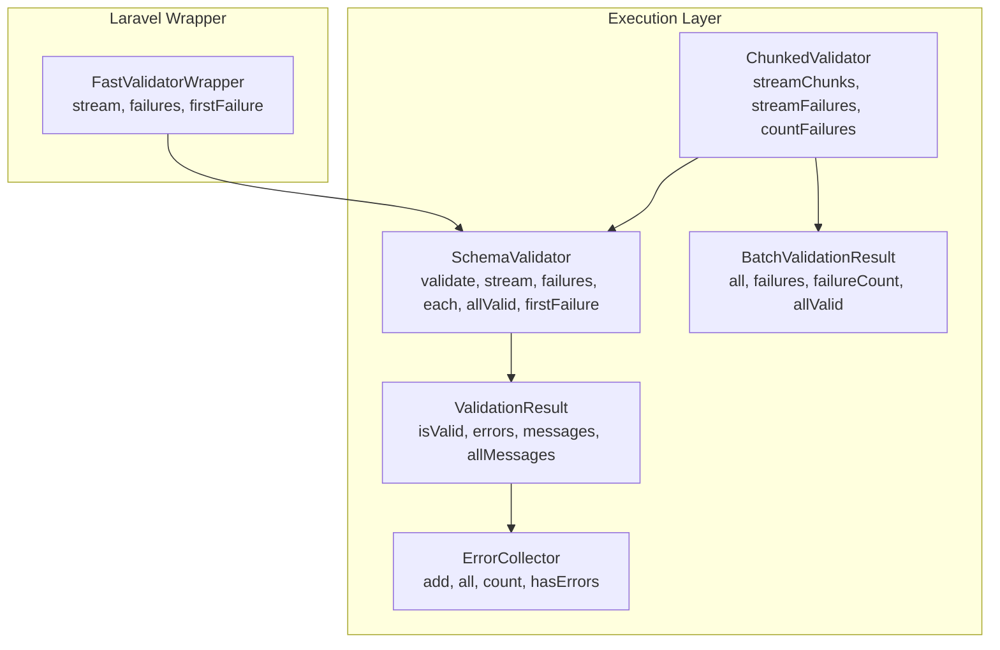
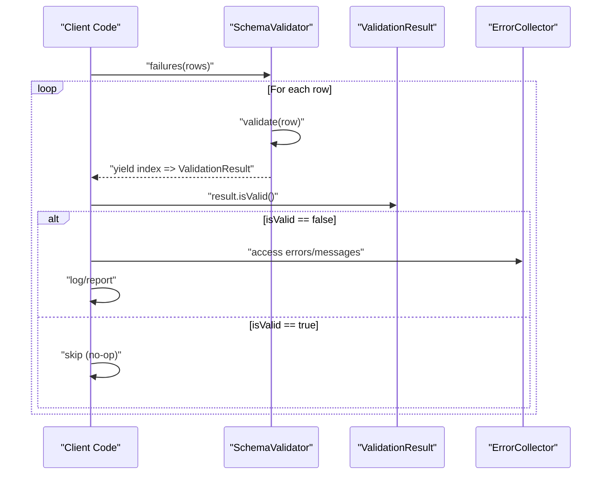
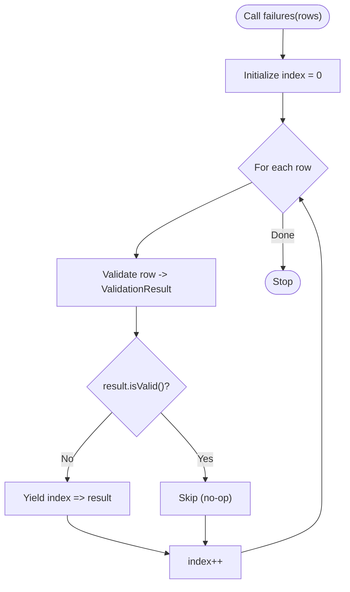
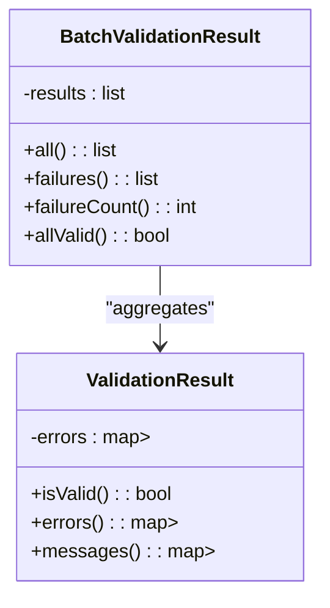
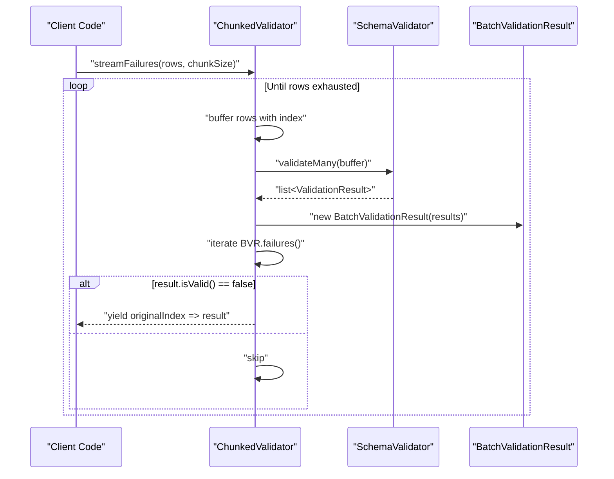
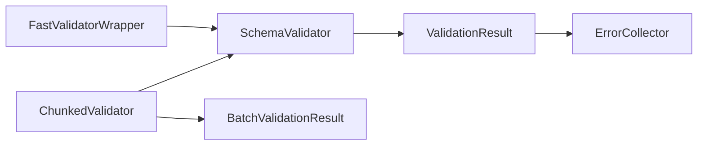

# Failure Collection

<cite>
**Referenced Files in This Document**
- [BatchValidationResult.php](file://src/Execution/BatchValidationResult.php)
- [ChunkedValidator.php](file://src/Execution/ChunkedValidator.php)
- [ErrorCollector.php](file://src/Execution/ErrorCollector.php)
- [SchemaValidator.php](file://src/SchemaValidator.php)
- [ValidationResult.php](file://src/Execution/ValidationResult.php)
- [FastValidatorWrapper.php](file://src/Laravel/FastValidatorWrapper.php)
- [README.md](file://README.md)
</cite>

## Table of Contents
1. [Introduction](#introduction)
2. [Project Structure](#project-structure)
3. [Core Components](#core-components)
4. [Architecture Overview](#architecture-overview)
5. [Detailed Component Analysis](#detailed-component-analysis)
6. [Dependency Analysis](#dependency-analysis)
7. [Performance Considerations](#performance-considerations)
8. [Troubleshooting Guide](#troubleshooting-guide)
9. [Conclusion](#conclusion)
10. [Appendices](#appendices)

## Introduction
This document explains how to efficiently collect and process only failed validation results in vi/validation using the failures() method and the BatchValidationResult class. It covers:
- Streaming-only-failures processing with failures() generators
- Aggregated batch validation outcomes via BatchValidationResult
- Practical examples for batch imports, data quality assessment, and corrective actions
- Memory efficiency benefits of selective failure collection
- Preservation of result indexing and integration with logging/notification systems
- Use cases such as data cleaning pipelines, compliance checking, and quality assurance

## Project Structure
The failure collection and aggregation features live primarily in the Execution layer and are surfaced by the SchemaValidator and ChunkedValidator. The Laravel wrapper exposes convenience methods for streaming failures.

**Diagram sources**
- [SchemaValidator.php](file://src/SchemaValidator.php#L113-L174)
- [ChunkedValidator.php](file://src/Execution/ChunkedValidator.php#L63-L110)
- [BatchValidationResult.php](file://src/Execution/BatchValidationResult.php#L17-L91)
- [ValidationResult.php](file://src/Execution/ValidationResult.php#L9-L142)
- [ErrorCollector.php](file://src/Execution/ErrorCollector.php#L7-L51)
- [FastValidatorWrapper.php](file://src/Laravel/FastValidatorWrapper.php#L309-L372)

**Section sources**
- [SchemaValidator.php](file://src/SchemaValidator.php#L13-L205)
- [ChunkedValidator.php](file://src/Execution/ChunkedValidator.php#L16-L154)
- [BatchValidationResult.php](file://src/Execution/BatchValidationResult.php#L17-L91)
- [ValidationResult.php](file://src/Execution/ValidationResult.php#L9-L142)
- [ErrorCollector.php](file://src/Execution/ErrorCollector.php#L7-L51)
- [FastValidatorWrapper.php](file://src/Laravel/FastValidatorWrapper.php#L309-L372)

## Core Components
- SchemaValidator: Provides streaming APIs for batch validation, including failures() that yields only failed results with preserved indices.
- ChunkedValidator: Processes data in chunks, yielding BatchValidationResult for each chunk and enabling streamFailures() to yield only failed results with original row indices.
- BatchValidationResult: Aggregates a chunk’s results and exposes failures() to filter only invalid items.
- ValidationResult: Represents a single validation outcome and provides error accessors and message formatting.
- ErrorCollector: Internal collector for field-level errors used by ValidationResult.
- FastValidatorWrapper: Laravel wrapper exposing stream() and failures() for convenient usage.

**Section sources**
- [SchemaValidator.php](file://src/SchemaValidator.php#L113-L174)
- [ChunkedValidator.php](file://src/Execution/ChunkedValidator.php#L63-L110)
- [BatchValidationResult.php](file://src/Execution/BatchValidationResult.php#L68-L91)
- [ValidationResult.php](file://src/Execution/ValidationResult.php#L59-L142)
- [ErrorCollector.php](file://src/Execution/ErrorCollector.php#L17-L51)
- [FastValidatorWrapper.php](file://src/Laravel/FastValidatorWrapper.php#L309-L372)

## Architecture Overview
The system separates concerns between streaming, chunking, and aggregation:
- Streaming: SchemaValidator::stream() yields per-row results; failures() yields only invalid ones with original indices.
- Chunking: ChunkedValidator::streamChunks() yields BatchValidationResult per chunk; streamFailures() yields only invalid results with original indices.
- Aggregation: BatchValidationResult::failures() filters invalid results from a chunk; failureCount() counts invalids without materializing all results.

**Diagram sources**
- [SchemaValidator.php](file://src/SchemaValidator.php#L161-L174)
- [ValidationResult.php](file://src/Execution/ValidationResult.php#L59-L142)
- [ErrorCollector.php](file://src/Execution/ErrorCollector.php#L17-L51)

**Section sources**
- [SchemaValidator.php](file://src/SchemaValidator.php#L161-L174)
- [ValidationResult.php](file://src/Execution/ValidationResult.php#L59-L142)
- [ErrorCollector.php](file://src/Execution/ErrorCollector.php#L17-L51)

## Detailed Component Analysis

### SchemaValidator::failures(iterable)
- Purpose: Memory-efficiently iterate only failed validation results from an iterable of rows.
- Behavior: Validates each row, yields only invalid results with their original index.
- Index preservation: Uses a local counter to preserve the original row index across the iterable.
- Integration: Works seamlessly with logging/notification systems by yielding ValidationResult objects.

**Diagram sources**
- [SchemaValidator.php](file://src/SchemaValidator.php#L161-L174)

**Section sources**
- [SchemaValidator.php](file://src/SchemaValidator.php#L161-L174)

### BatchValidationResult::failures() and failureCount()
- Purpose: Filter only failed results from a chunk and compute failure counts without materializing all results.
- Behavior: failures() returns a filtered list of invalid results; failureCount() iterates to count invalids.
- Use cases: Reporting, alerting, and downstream processing of only failing rows.

**Diagram sources**
- [BatchValidationResult.php](file://src/Execution/BatchValidationResult.php#L17-L91)
- [ValidationResult.php](file://src/Execution/ValidationResult.php#L9-L142)

**Section sources**
- [BatchValidationResult.php](file://src/Execution/BatchValidationResult.php#L68-L91)
- [ValidationResult.php](file://src/Execution/ValidationResult.php#L59-L142)

### ChunkedValidator::streamFailures(iterable, chunkSize)
- Purpose: Process large datasets in chunks while yielding only failures with original indices.
- Behavior: Buffers rows with their global index, validates in chunks, and yields only invalid results preserving original indices.
- Benefits: Controlled memory usage, scalable failure reporting, and index preservation.

**Diagram sources**
- [ChunkedValidator.php](file://src/Execution/ChunkedValidator.php#L92-L110)
- [ChunkedValidator.php](file://src/Execution/ChunkedValidator.php#L143-L152)
- [BatchValidationResult.php](file://src/Execution/BatchValidationResult.php#L68-L91)

**Section sources**
- [ChunkedValidator.php](file://src/Execution/ChunkedValidator.php#L92-L110)
- [ChunkedValidator.php](file://src/Execution/ChunkedValidator.php#L143-L152)
- [BatchValidationResult.php](file://src/Execution/BatchValidationResult.php#L68-L91)

### FastValidatorWrapper::failures(iterable)
- Purpose: Laravel-friendly wrapper around failures() for convenient usage in frameworks.
- Behavior: Delegates to underlying validator’s failures() with optional row override.

**Section sources**
- [FastValidatorWrapper.php](file://src/Laravel/FastValidatorWrapper.php#L356-L359)

## Dependency Analysis
- SchemaValidator depends on ValidationResult and uses ErrorCollector internally.
- ChunkedValidator composes SchemaValidator and BatchValidationResult.
- FastValidatorWrapper composes SchemaValidator for Laravel integration.

**Diagram sources**
- [SchemaValidator.php](file://src/SchemaValidator.php#L13-L30)
- [ValidationResult.php](file://src/Execution/ValidationResult.php#L9-L32)
- [ErrorCollector.php](file://src/Execution/ErrorCollector.php#L7-L12)
- [ChunkedValidator.php](file://src/Execution/ChunkedValidator.php#L16-L23)
- [BatchValidationResult.php](file://src/Execution/BatchValidationResult.php#L17-L26)
- [FastValidatorWrapper.php](file://src/Laravel/FastValidatorWrapper.php#L309-L312)

**Section sources**
- [SchemaValidator.php](file://src/SchemaValidator.php#L13-L30)
- [ValidationResult.php](file://src/Execution/ValidationResult.php#L9-L32)
- [ErrorCollector.php](file://src/Execution/ErrorCollector.php#L7-L12)
- [ChunkedValidator.php](file://src/Execution/ChunkedValidator.php#L16-L23)
- [BatchValidationResult.php](file://src/Execution/BatchValidationResult.php#L17-L26)
- [FastValidatorWrapper.php](file://src/Laravel/FastValidatorWrapper.php#L309-L312)

## Performance Considerations
- Streaming-only-failures avoids materializing successful results, reducing memory footprint during batch processing.
- Chunked processing limits peak memory by validating fixed-size buffers and yielding only failures.
- BatchValidationResult::failureCount() computes counts without storing all results, enabling scalable failure metrics.
- Index preservation allows precise correlation with source data for remediation workflows.

Practical guidance:
- Prefer failures() and streamFailures() for error reporting pipelines.
- Use streamChunks() when you need batch-level aggregation and later filter failures().
- Combine failureCount() with chunked streaming for progress monitoring and alerts.

**Section sources**
- [SchemaValidator.php](file://src/SchemaValidator.php#L161-L174)
- [ChunkedValidator.php](file://src/Execution/ChunkedValidator.php#L92-L110)
- [BatchValidationResult.php](file://src/Execution/BatchValidationResult.php#L79-L91)
- [README.md](file://README.md#L266-L365)

## Troubleshooting Guide
Common scenarios and resolutions:
- No failures yielded despite expecting errors:
  - Verify the iterable is not empty and rows are valid arrays.
  - Confirm the schema rules match the data types and constraints.
- Memory spikes when collecting failures:
  - Switch from validateMany() to failures() or streamFailures() to avoid materializing successful results.
- Lost row indices:
  - Use failures() or streamFailures() to preserve original indices for reporting and remediation.
- Logging and notifications:
  - Iterate failures() and log result->errors() or result->messages() per row index.

**Section sources**
- [SchemaValidator.php](file://src/SchemaValidator.php#L161-L174)
- [ChunkedValidator.php](file://src/Execution/ChunkedValidator.php#L92-L110)
- [ValidationResult.php](file://src/Execution/ValidationResult.php#L77-L142)
- [README.md](file://README.md#L266-L365)

## Conclusion
vi/validation provides robust mechanisms to collect and process only failed validation results:
- failures() enables streaming-only-failures with preserved indices.
- BatchValidationResult aggregates chunked outcomes and filters failures efficiently.
- ChunkedValidator scales to large datasets while keeping memory usage low.
These capabilities power practical workflows for batch imports, data quality assessment, compliance checks, and quality assurance processes.

## Appendices

### Example Workflows

- Batch Import Error Reporting
  - Use failures() to iterate only invalid rows and report errors per index.
  - Integrate with logging/notification systems to trigger alerts and remediation tasks.

- Data Quality Assessment
  - Use streamFailures() to continuously monitor incoming data streams and track failure rates.
  - Combine with failureCount() for dashboards and SLA monitoring.

- Corrective Action Workflows
  - Preserve original indices to re-process only failing rows.
  - Pair with external systems to queue corrective actions per row index.

- Compliance Checking and QA
  - Use streamChunks() to validate batches and then filter failures() for targeted reviews.
  - Employ firstFailure() for fail-fast compliance gates.

**Section sources**
- [SchemaValidator.php](file://src/SchemaValidator.php#L161-L174)
- [ChunkedValidator.php](file://src/Execution/ChunkedValidator.php#L92-L110)
- [BatchValidationResult.php](file://src/Execution/BatchValidationResult.php#L68-L91)
- [README.md](file://README.md#L266-L365)