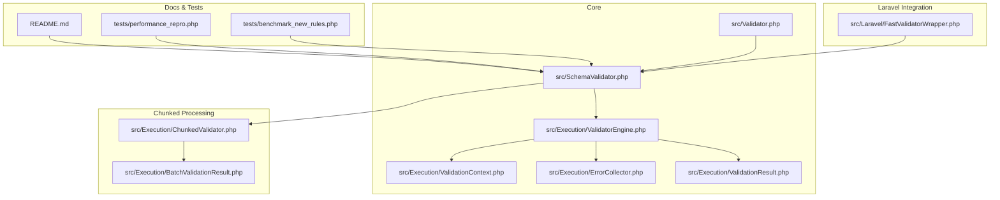
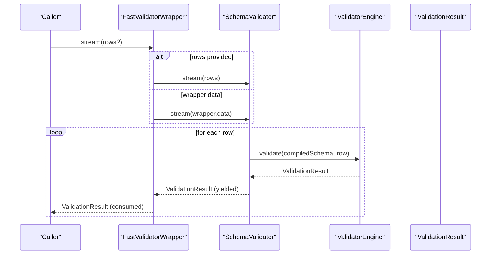
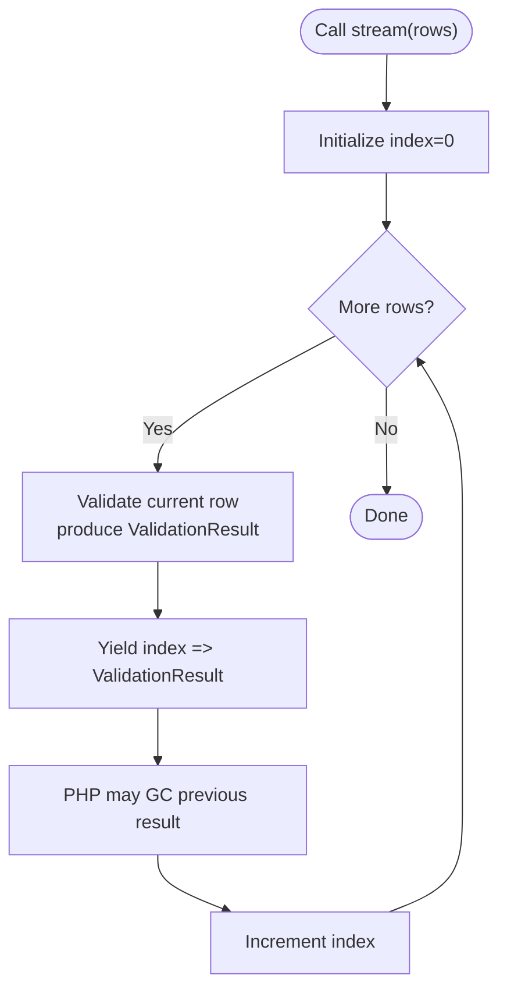
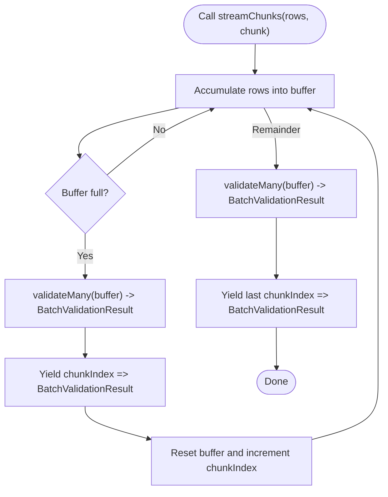
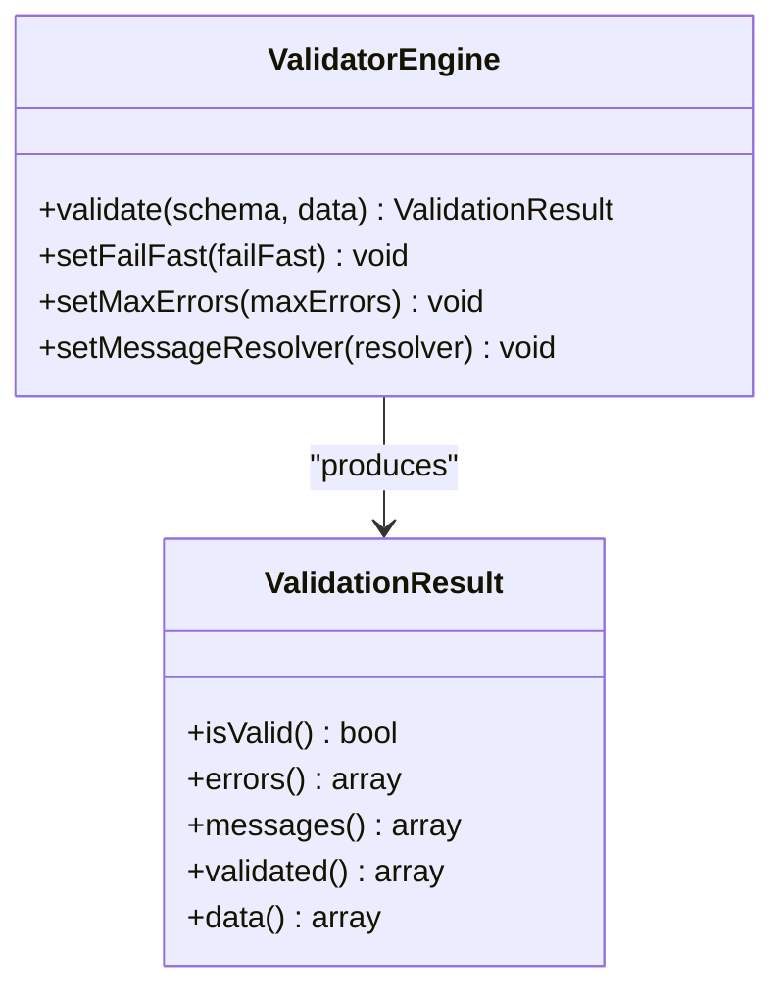
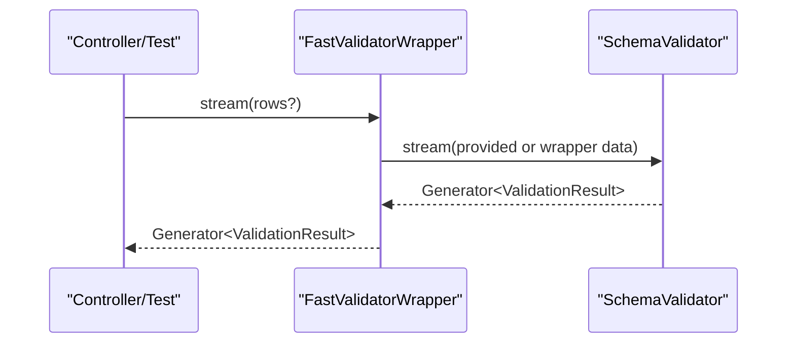
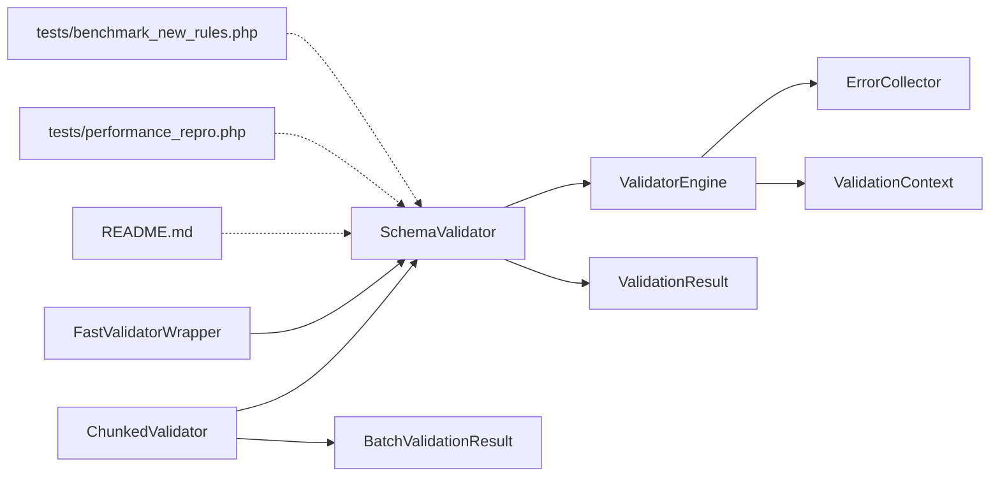

# Streaming Validation

<cite>
**Referenced Files in This Document**
- [README.md](file://README.md)
- [composer.json](file://composer.json)
- [src/Validator.php](file://src/Validator.php)
- [src/SchemaValidator.php](file://src/SchemaValidator.php)
- [src/Laravel/FastValidatorWrapper.php](file://src/Laravel/FastValidatorWrapper.php)
- [src/Execution/ChunkedValidator.php](file://src/Execution/ChunkedValidator.php)
- [src/Execution/ValidationResult.php](file://src/Execution/ValidationResult.php)
- [src/Execution/BatchValidationResult.php](file://src/Execution/BatchValidationResult.php)
- [src/Execution/ValidatorEngine.php](file://src/Execution/ValidatorEngine.php)
- [src/Execution/ErrorCollector.php](file://src/Execution/ErrorCollector.php)
- [src/Execution/ValidationContext.php](file://src/Execution/ValidationContext.php)
- [tests/performance_repro.php](file://tests/performance_repro.php)
- [tests/benchmark_new_rules.php](file://tests/benchmark_new_rules.php)
</cite>

## Table of Contents
1. [Introduction](#introduction)
2. [Project Structure](#project-structure)
3. [Core Components](#core-components)
4. [Architecture Overview](#architecture-overview)
5. [Detailed Component Analysis](#detailed-component-analysis)
6. [Dependency Analysis](#dependency-analysis)
7. [Performance Considerations](#performance-considerations)
8. [Troubleshooting Guide](#troubleshooting-guide)
9. [Conclusion](#conclusion)
10. [Appendices](#appendices)

## Introduction
This document explains the streaming validation capabilities in vi/validation, focusing on the stream() and each() methods for memory-efficient batch processing. It details how PHP’s garbage collector frees memory after each processed result, compares streaming versus materialized results, and demonstrates practical use cases such as ETL pipelines, queue processing, and large file imports. It also covers error handling, result indexing, and integration with external systems.

## Project Structure
The streaming validation features live primarily in the core validator and execution layers, with optional Laravel integration and chunked processing helpers for very large datasets.

**Diagram sources**
- [src/Validator.php](file://src/Validator.php#L1-L16)
- [src/SchemaValidator.php](file://src/SchemaValidator.php#L1-L205)
- [src/Execution/ValidatorEngine.php](file://src/Execution/ValidatorEngine.php#L1-L177)
- [src/Execution/ValidationResult.php](file://src/Execution/ValidationResult.php#L1-L142)
- [src/Execution/ErrorCollector.php](file://src/Execution/ErrorCollector.php#L1-L51)
- [src/Execution/ValidationContext.php](file://src/Execution/ValidationContext.php#L1-L98)
- [src/Execution/ChunkedValidator.php](file://src/Execution/ChunkedValidator.php#L1-L154)
- [src/Execution/BatchValidationResult.php](file://src/Execution/BatchValidationResult.php#L1-L92)
- [src/Laravel/FastValidatorWrapper.php](file://src/Laravel/FastValidatorWrapper.php#L285-L345)
- [README.md](file://README.md#L266-L365)
- [tests/performance_repro.php](file://tests/performance_repro.php#L39-L95)
- [tests/benchmark_new_rules.php](file://tests/benchmark_new_rules.php#L34-L66)

**Section sources**
- [README.md](file://README.md#L266-L365)
- [composer.json](file://composer.json#L1-L36)

## Core Components
- SchemaValidator: Provides stream(), each(), failures(), firstFailure(), allValid(), and validateMany(). It orchestrates validation using ValidatorEngine and returns ValidationResult objects.
- ValidatorEngine: Executes compiled schemas against input data, manages error collection, bail/max errors, and context.
- ValidationResult: Encapsulates per-row validation outcomes, including validity, raw errors, formatted messages, and validated data.
- ChunkedValidator: Streams large datasets in chunks, yielding BatchValidationResult or only failures, enabling controlled memory usage for massive datasets.
- FastValidatorWrapper: Laravel integration that exposes stream() and each() for wrapper-managed data or custom iterables.

Key streaming APIs:
- stream(iterable): Generator that yields ValidationResult keyed by input index.
- each(iterable, callback): Immediate callback processing without storing results.
- failures(iterable): Generator that yields only failed results with original index.
- firstFailure(iterable): Fail-fast single failure lookup.
- allValid(iterable): Efficient all-pass check without storing results.

**Section sources**
- [src/SchemaValidator.php](file://src/SchemaValidator.php#L95-L203)
- [src/Execution/ValidatorEngine.php](file://src/Execution/ValidatorEngine.php#L33-L98)
- [src/Execution/ValidationResult.php](file://src/Execution/ValidationResult.php#L18-L141)
- [src/Execution/ChunkedValidator.php](file://src/Execution/ChunkedValidator.php#L54-L153)
- [src/Laravel/FastValidatorWrapper.php](file://src/Laravel/FastValidatorWrapper.php#L285-L345)

## Architecture Overview
The streaming architecture separates concerns between schema compilation, execution engine, and result modeling. Stream-based APIs leverage PHP generators to yield results one at a time, enabling O(1) memory usage during iteration.

**Diagram sources**
- [src/Laravel/FastValidatorWrapper.php](file://src/Laravel/FastValidatorWrapper.php#L285-L312)
- [src/SchemaValidator.php](file://src/SchemaValidator.php#L113-L121)
- [src/Execution/ValidatorEngine.php](file://src/Execution/ValidatorEngine.php#L33-L98)
- [src/Execution/ValidationResult.php](file://src/Execution/ValidationResult.php#L18-L32)

## Detailed Component Analysis

### SchemaValidator: Streaming and Batch APIs
- stream(iterable): Iterates rows, validates each, yields ValidationResult with incrementing integer index. Memory footprint remains constant because each result is yielded and eligible for garbage collection after consumption.
- each(iterable, callback): Validates each row and invokes callback immediately, avoiding storage of results. Ideal for fire-and-forget scenarios.
- failures(iterable): Yields only failed results with original index, minimizing memory and bandwidth for error reporting.
- firstFailure(iterable): Short-circuits on first failure for fail-fast checks.
- allValid(iterable): Returns true if no failure found, without storing results.
- validateMany(iterable): Materializes all results in memory; use only for small datasets.

**Diagram sources**
- [src/SchemaValidator.php](file://src/SchemaValidator.php#L113-L121)

**Section sources**
- [src/SchemaValidator.php](file://src/SchemaValidator.php#L95-L203)

### ChunkedValidator: Controlled-Batch Streaming
For extremely large datasets, ChunkedValidator processes data in configurable chunks:
- streamChunks(rows, chunkSize): Yields BatchValidationResult per chunk, enabling batch processing while maintaining streaming semantics.
- streamFailures(rows, chunkSize): Yields only failures with original row indices, preserving global ordering.
- countFailures(rows, chunkSize): Aggregates failure counts without storing all results.

**Diagram sources**
- [src/Execution/ChunkedValidator.php](file://src/Execution/ChunkedValidator.php#L63-L81)

**Section sources**
- [src/Execution/ChunkedValidator.php](file://src/Execution/ChunkedValidator.php#L54-L153)

### ValidatorEngine and ValidationResult
- ValidatorEngine.validate(): Executes compiled schema against data, managing error collection, bail behavior, and max errors. It resets or reuses shared ErrorCollector and ValidationContext to minimize allocations.
- ValidationResult: Immutable per-row result with methods to inspect validity, raw errors, formatted messages, and validated data subset.

**Diagram sources**
- [src/Execution/ValidatorEngine.php](file://src/Execution/ValidatorEngine.php#L33-L98)
- [src/Execution/ValidationResult.php](file://src/Execution/ValidationResult.php#L18-L141)

**Section sources**
- [src/Execution/ValidatorEngine.php](file://src/Execution/ValidatorEngine.php#L11-L177)
- [src/Execution/ValidationResult.php](file://src/Execution/ValidationResult.php#L9-L142)

### FastValidatorWrapper: Laravel Integration
- stream(rows?): Delegates to underlying SchemaValidator.stream(), supporting wrapper-managed data or custom rows.
- each(rowsOrCallback, callback?): Supports either passing rows plus callback or a single callback when using wrapper’s data.

**Diagram sources**
- [src/Laravel/FastValidatorWrapper.php](file://src/Laravel/FastValidatorWrapper.php#L285-L312)

**Section sources**
- [src/Laravel/FastValidatorWrapper.php](file://src/Laravel/FastValidatorWrapper.php#L285-L345)

## Dependency Analysis
- SchemaValidator depends on ValidatorEngine and ValidationResult.
- ValidatorEngine composes ErrorCollector and ValidationContext.
- ChunkedValidator composes SchemaValidator and produces BatchValidationResult.
- FastValidatorWrapper composes SchemaValidator for Laravel integration.
- README and tests demonstrate usage patterns and performance characteristics.

**Diagram sources**
- [src/SchemaValidator.php](file://src/SchemaValidator.php#L13-L30)
- [src/Execution/ValidatorEngine.php](file://src/Execution/ValidatorEngine.php#L11-L31)
- [src/Execution/ErrorCollector.php](file://src/Execution/ErrorCollector.php#L7-L51)
- [src/Execution/ValidationContext.php](file://src/Execution/ValidationContext.php#L7-L98)
- [src/Execution/ValidationResult.php](file://src/Execution/ValidationResult.php#L9-L142)
- [src/Execution/ChunkedValidator.php](file://src/Execution/ChunkedValidator.php#L16-L23)
- [src/Execution/BatchValidationResult.php](file://src/Execution/BatchValidationResult.php#L17-L26)
- [src/Laravel/FastValidatorWrapper.php](file://src/Laravel/FastValidatorWrapper.php#L285-L312)
- [README.md](file://README.md#L266-L365)
- [tests/performance_repro.php](file://tests/performance_repro.php#L60-L82)
- [tests/benchmark_new_rules.php](file://tests/benchmark_new_rules.php#L52-L66)

**Section sources**
- [src/SchemaValidator.php](file://src/SchemaValidator.php#L13-L30)
- [src/Execution/ValidatorEngine.php](file://src/Execution/ValidatorEngine.php#L11-L31)
- [src/Execution/ChunkedValidator.php](file://src/Execution/ChunkedValidator.php#L16-L23)
- [src/Laravel/FastValidatorWrapper.php](file://src/Laravel/FastValidatorWrapper.php#L285-L312)
- [README.md](file://README.md#L266-L365)

## Performance Considerations
- Memory profiles:
  - validateMany(): O(n) memory storing all results.
  - stream(): O(1) memory, yielding one result at a time.
  - each(): O(1) memory, processing immediately.
  - failures(): O(1) memory, yielding only failures.
  - streamChunks(): O(chunk) memory, controlled batching.
- Throughput: Benchmarks show high throughput for streaming validations, especially with precompiled validators and warmed caches.
- Garbage collection: PHP’s GC can reclaim streamed results after each iteration, reducing peak memory usage.

Practical guidance:
- Use stream() for ETL pipelines and large imports where you need per-row decisions.
- Use each() for fire-and-forget validations (e.g., logging failures).
- Use failures() for error reporting focused on invalid rows.
- Use streamChunks() for batch processing with controlled memory (e.g., bulk inserts).
- Avoid validateMany() for datasets exceeding ~10,000 rows.

**Section sources**
- [README.md](file://README.md#L367-L376)
- [tests/benchmark_new_rules.php](file://tests/benchmark_new_rules.php#L52-L66)
- [tests/performance_repro.php](file://tests/performance_repro.php#L60-L82)

## Troubleshooting Guide
Common issues and resolutions:
- Memory spikes with validateMany():
  - Switch to stream(), each(), or streamChunks().
- Unexpected high memory usage:
  - Verify you are not collecting all results (e.g., foreach + push to array).
- Lost row indices:
  - Ensure you iterate using the returned index from stream()/failures().
- Error messages not localized:
  - Provide a MessageResolver to SchemaValidator or use Laravel integration wrappers.
- Fail-fast not working:
  - Configure ValidatorEngine failFast and maxErrors appropriately.
- Integrating with external systems:
  - Use streamChunks() to emit batches to downstream systems (e.g., queue workers, database writers).

Operational tips:
- Warm caches (compiled schemas) to reduce first-use overhead.
- Use StatelessValidator or ValidatorPool in long-running environments (Octane, Swoole, RoadRunner).
- For Laravel, prefer FastValidatorWrapper for consistent behavior and integration.

**Section sources**
- [src/Execution/ValidatorEngine.php](file://src/Execution/ValidatorEngine.php#L100-L123)
- [src/Execution/ValidationResult.php](file://src/Execution/ValidationResult.php#L77-L96)
- [src/Execution/ChunkedValidator.php](file://src/Execution/ChunkedValidator.php#L54-L81)
- [README.md](file://README.md#L766-L800)

## Conclusion
vi/validation’s streaming APIs enable memory-efficient, high-throughput validation for large-scale workloads. By leveraging generators and immediate callbacks, applications can process millions of rows with bounded memory, integrate seamlessly with Laravel, and scale across long-running runtime environments. Choose stream() for per-row processing, each() for fire-and-forget validations, failures() for targeted error reporting, and streamChunks() for controlled batching.

## Appendices

### Practical Examples Index
- ETL pipeline: Iterate stream() results and transform per row.
- Queue processing: Use each() to validate incoming jobs and log failures immediately.
- Large file imports: Use streamChunks() to validate and batch insert rows.

These examples are documented in the project’s README under “Memory-Efficient Streaming Validation” and “Chunked Streaming.”

**Section sources**
- [README.md](file://README.md#L266-L365)