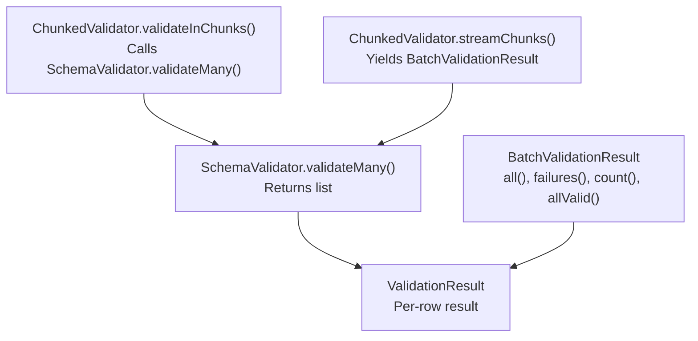
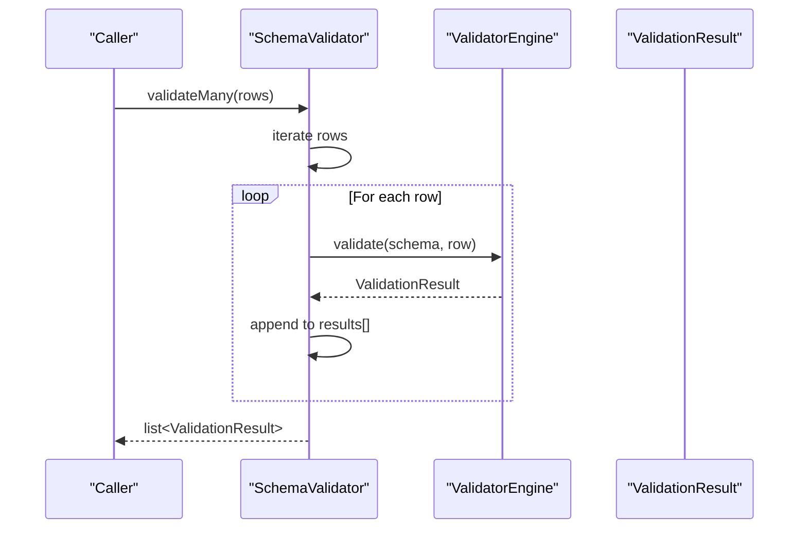
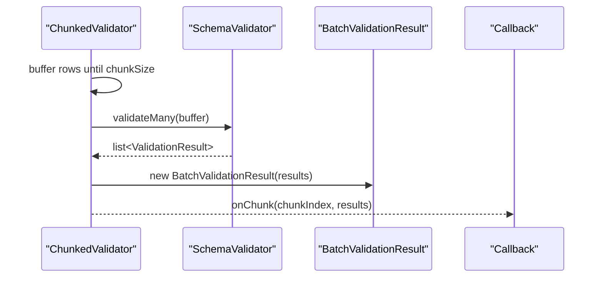
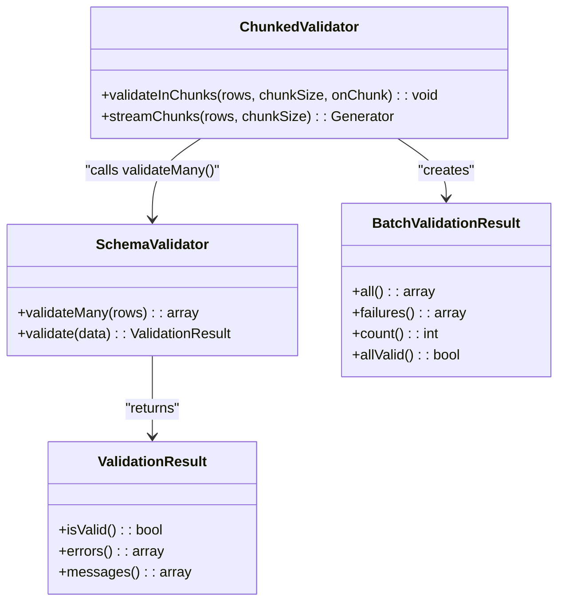

# validateMany Method

<cite>
**Referenced Files in This Document**
- [SchemaValidator.php](file://src/SchemaValidator.php)
- [ChunkedValidator.php](file://src/Execution/ChunkedValidator.php)
- [BatchValidationResult.php](file://src/Execution/BatchValidationResult.php)
- [ValidationResult.php](file://src/Execution/ValidationResult.php)
- [benchmark.php](file://tests/benchmark.php)
- [benchmark_new_rules.php](file://tests/benchmark_new_rules.php)
- [ValidatorTest.php](file://tests/Unit/ValidatorTest.php)
- [README.md](file://README.md)
</cite>

## Table of Contents
1. [Introduction](#introduction)
2. [Project Structure](#project-structure)
3. [Core Components](#core-components)
4. [Architecture Overview](#architecture-overview)
5. [Detailed Component Analysis](#detailed-component-analysis)
6. [Dependency Analysis](#dependency-analysis)
7. [Performance Considerations](#performance-considerations)
8. [Troubleshooting Guide](#troubleshooting-guide)
9. [Conclusion](#conclusion)
10. [Appendices](#appendices)

## Introduction
This document provides a comprehensive guide to the validateMany method in vi/validation. It explains how the method validates multiple records efficiently by returning all validation results as an array, documents the method signature, parameter types, and return value specifications, and highlights memory implications. It also offers guidance on when to use validateMany versus streaming alternatives, presents practical examples for batch validation of arrays, collections, and generators, and covers performance considerations, memory usage patterns, and best practices for handling large datasets.

## Project Structure
The validateMany method resides in the SchemaValidator class and orchestrates validation across multiple rows. Supporting components include:
- ChunkedValidator: Provides chunked processing and streaming APIs for large datasets.
- BatchValidationResult: Encapsulates batch results for chunked workflows.
- ValidationResult: Represents individual validation outcomes.

**Diagram sources**
- [SchemaValidator.php](file://src/SchemaValidator.php#L84-L93)
- [ChunkedValidator.php](file://src/Execution/ChunkedValidator.php#L34-L52)
- [ChunkedValidator.php](file://src/Execution/ChunkedValidator.php#L63-L81)
- [BatchValidationResult.php](file://src/Execution/BatchValidationResult.php#L17-L92)
- [ValidationResult.php](file://src/Execution/ValidationResult.php#L9-L142)

**Section sources**
- [SchemaValidator.php](file://src/SchemaValidator.php#L84-L93)
- [ChunkedValidator.php](file://src/Execution/ChunkedValidator.php#L34-L52)
- [ChunkedValidator.php](file://src/Execution/ChunkedValidator.php#L63-L81)
- [BatchValidationResult.php](file://src/Execution/BatchValidationResult.php#L17-L92)
- [ValidationResult.php](file://src/Execution/ValidationResult.php#L9-L142)

## Core Components
- SchemaValidator.validateMany: Validates an iterable of rows and returns a list of ValidationResult objects. It iterates over the input and collects results in memory.
- ChunkedValidator: Offers chunked processing via validateInChunks and streamChunks, internally calling validateMany on each chunk and wrapping results in BatchValidationResult.
- BatchValidationResult: Holds a list of ValidationResult objects and supports iteration, counting, and filtering failures.
- ValidationResult: Represents a single validation outcome with methods to check validity, retrieve errors/messages, and access validated data.

**Section sources**
- [SchemaValidator.php](file://src/SchemaValidator.php#L84-L93)
- [ChunkedValidator.php](file://src/Execution/ChunkedValidator.php#L34-L52)
- [ChunkedValidator.php](file://src/Execution/ChunkedValidator.php#L63-L81)
- [BatchValidationResult.php](file://src/Execution/BatchValidationResult.php#L17-L92)
- [ValidationResult.php](file://src/Execution/ValidationResult.php#L9-L142)

## Architecture Overview
The validateMany method is the core batching entry point. It delegates per-row validation to SchemaValidator.validate and aggregates results into a single array. For large datasets, ChunkedValidator provides streaming alternatives that avoid materializing all results in memory.

**Diagram sources**
- [SchemaValidator.php](file://src/SchemaValidator.php#L84-L93)

## Detailed Component Analysis

### Method Signature and Behavior
- Method: validateMany
- Purpose: Validate multiple rows and return all results as an array.
- Parameters:
  - rows: iterable<array<string, mixed>> — An iterable of row data to validate.
- Return Type: list<ValidationResult> — An array containing one ValidationResult per input row, preserving input order.
- Behavior:
  - Iterates over the provided iterable.
  - Calls validate for each row and appends the result to an internal array.
  - Returns the collected array of results.

Complexity:
- Time: O(n) where n is the number of rows.
- Space: O(n) to store all ValidationResult objects in memory.

Memory Implications:
- validateMany materializes all results in memory. For large datasets (e.g., 10,000+ rows), this can lead to high memory usage and potential memory exhaustion. Prefer streaming alternatives for large-scale processing.

Usage Notes:
- Suitable for small to medium-sized batches where random access to results is needed.
- Not recommended for very large datasets due to memory overhead.

**Section sources**
- [SchemaValidator.php](file://src/SchemaValidator.php#L75-L93)

### Practical Examples

- Batch validation of arrays:
  - Validate a fixed array of rows and iterate over results to handle failures.
  - See example usage in unit tests and README.

- Collections and generators:
  - Use generators to produce rows lazily and process them with validateMany by converting to arrays when necessary, or switch to streaming APIs for memory efficiency.

- CSV imports and API batch processing:
  - For CSV imports, consider streaming or chunked validation to avoid loading the entire file into memory.
  - For API batch processing, use validateMany for small batches or ChunkedValidator for larger payloads.

References:
- Example usage in README demonstrates batch validation with an array of rows and iterating over results.
- Unit tests show validateMany being called with a small array and asserting counts and validity.

**Section sources**
- [README.md](file://README.md#L205-L234)
- [ValidatorTest.php](file://tests/Unit/ValidatorTest.php#L102-L121)

### Relationship with ChunkedValidator and BatchValidationResult
- ChunkedValidator.validateInChunks:
  - Buffers rows up to a chunk size, calls validateMany on the buffer, and invokes a callback with the resulting array of ValidationResult objects.
- ChunkedValidator.streamChunks:
  - Similar to validateInChunks but yields BatchValidationResult for each chunk, enabling streaming iteration over chunks.

**Diagram sources**
- [ChunkedValidator.php](file://src/Execution/ChunkedValidator.php#L34-L52)
- [ChunkedValidator.php](file://src/Execution/ChunkedValidator.php#L133-L137)
- [BatchValidationResult.php](file://src/Execution/BatchValidationResult.php#L17-L26)

**Section sources**
- [ChunkedValidator.php](file://src/Execution/ChunkedValidator.php#L34-L52)
- [ChunkedValidator.php](file://src/Execution/ChunkedValidator.php#L63-L81)
- [ChunkedValidator.php](file://src/Execution/ChunkedValidator.php#L133-L137)
- [BatchValidationResult.php](file://src/Execution/BatchValidationResult.php#L17-L26)

### Streaming Alternatives and When to Choose Them
- Streaming APIs:
  - stream: Yields ValidationResult objects one at a time, enabling O(1) memory usage for large datasets.
  - each: Processes each result immediately without storing results.
  - failures: Streams only failed results, reducing memory overhead for error reporting.
  - firstFailure and allValid: Provide fail-fast and all-valid checks without storing results.
- Chunked streaming:
  - streamChunks: Yields BatchValidationResult for each chunk, combining chunked processing with batch-like access to per-chunk results.

Guidance:
- Use validateMany for small to medium batches where random access to results is required.
- Use streaming APIs (stream, each, failures) for large datasets to avoid memory exhaustion.
- Use ChunkedValidator for scenarios requiring batch-like processing of large datasets with controlled memory usage.

**Section sources**
- [SchemaValidator.php](file://src/SchemaValidator.php#L95-L203)
- [ChunkedValidator.php](file://src/Execution/ChunkedValidator.php#L54-L127)
- [README.md](file://README.md#L266-L365)

## Dependency Analysis
validateMany depends on:
- SchemaValidator.validate for per-row validation.
- ValidationResult for representing individual outcomes.
- ChunkedValidator for chunked processing workflows.

**Diagram sources**
- [SchemaValidator.php](file://src/SchemaValidator.php#L84-L93)
- [ChunkedValidator.php](file://src/Execution/ChunkedValidator.php#L34-L52)
- [ChunkedValidator.php](file://src/Execution/ChunkedValidator.php#L63-L81)
- [BatchValidationResult.php](file://src/Execution/BatchValidationResult.php#L17-L92)
- [ValidationResult.php](file://src/Execution/ValidationResult.php#L9-L142)

**Section sources**
- [SchemaValidator.php](file://src/SchemaValidator.php#L84-L93)
- [ChunkedValidator.php](file://src/Execution/ChunkedValidator.php#L34-L52)
- [ChunkedValidator.php](file://src/Execution/ChunkedValidator.php#L63-L81)
- [BatchValidationResult.php](file://src/Execution/BatchValidationResult.php#L17-L92)
- [ValidationResult.php](file://src/Execution/ValidationResult.php#L9-L142)

## Performance Considerations
- Throughput and latency:
  - Benchmarks demonstrate validateMany throughput for large arrays. See benchmark scripts for typical performance characteristics.
- Memory usage:
  - validateMany stores all results in memory, which can cause memory pressure for large datasets. Prefer streaming APIs for large-scale processing.
- Schema compilation and caching:
  - Schema compilation and native code generation can improve performance. Ensure appropriate caching is configured to reduce compilation overhead.

Practical tips:
- For small batches (< 10,000 rows), validateMany is efficient and convenient.
- For large datasets, use stream, each, or ChunkedValidator to keep memory usage low.
- Leverage schema compilation and native code generation for repeated validations under heavy load.

**Section sources**
- [benchmark.php](file://tests/benchmark.php#L1-L55)
- [benchmark_new_rules.php](file://tests/benchmark_new_rules.php#L34-L66)
- [README.md](file://README.md#L266-L292)

## Troubleshooting Guide
Common issues and resolutions:
- Out-of-memory errors:
  - Symptom: Memory exhaustion when validating large datasets.
  - Resolution: Switch from validateMany to streaming APIs (stream, each, failures) or use ChunkedValidator.
- Unexpectedly high memory usage:
  - Symptom: Elevated memory consumption proportional to dataset size.
  - Resolution: Validate smaller chunks or stream results as they are produced.
- Need for random access to results:
  - Symptom: Requirement to access results by index or iterate multiple times.
  - Resolution: Use validateMany for small to medium batches; for large datasets, consider chunked processing with BatchValidationResult to limit per-chunk memory.

ValidationResult inspection:
- Use ValidationResult.isValid to quickly check validity.
- Use ValidationResult.errors and ValidationResult.messages to retrieve detailed error information.

**Section sources**
- [SchemaValidator.php](file://src/SchemaValidator.php#L75-L93)
- [ValidationResult.php](file://src/Execution/ValidationResult.php#L59-L96)
- [README.md](file://README.md#L266-L292)

## Conclusion
validateMany is a straightforward and efficient method for batch validation when working with small to medium-sized datasets. It returns all results in memory, enabling random access and simple iteration. For large datasets, prefer streaming APIs or chunked processing to maintain low memory usage and optimal performance. Combine validateMany with ChunkedValidator for scenarios requiring batch-like processing of large inputs while controlling memory footprint.

## Appendices

### API Reference: validateMany
- Signature: validateMany(iterable<array<string, mixed>> $rows): list<ValidationResult>
- Description: Validates each row in the provided iterable and returns an array of ValidationResult objects in the same order as the input.
- Parameters:
  - rows: An iterable of associative arrays representing row data to validate.
- Returns:
  - list<ValidationResult>: Array of validation outcomes, one per input row.
- Complexity:
  - Time: O(n)
  - Space: O(n)

**Section sources**
- [SchemaValidator.php](file://src/SchemaValidator.php#L75-L93)

### Practical Usage Patterns
- Small batch arrays:
  - Iterate over results to handle failures and compute statistics.
- Generators and streams:
  - For very large datasets, use stream or each to process results without storing all outcomes.
- Chunked processing:
  - Use ChunkedValidator to process data in chunks, leveraging BatchValidationResult for per-chunk access.

**Section sources**
- [README.md](file://README.md#L205-L234)
- [ValidatorTest.php](file://tests/Unit/ValidatorTest.php#L102-L121)
- [ChunkedValidator.php](file://src/Execution/ChunkedValidator.php#L54-L127)