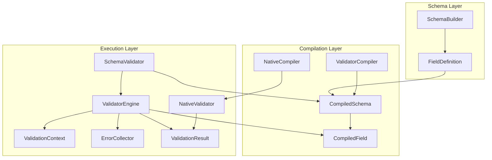
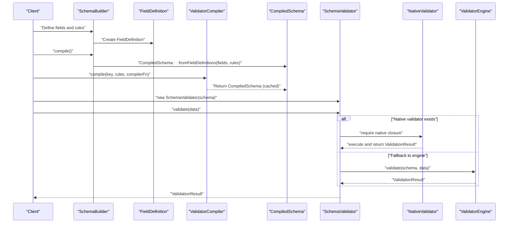
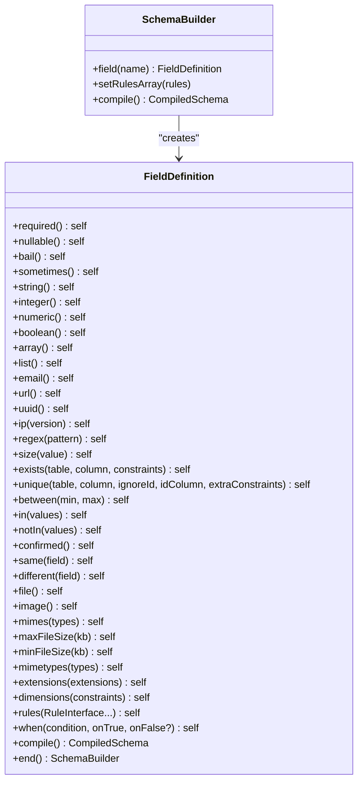
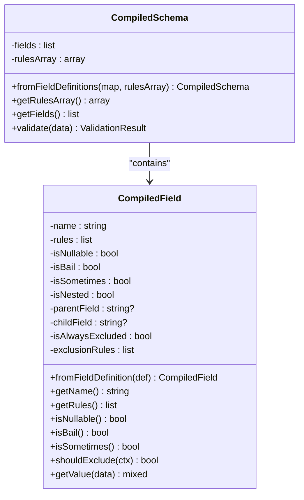
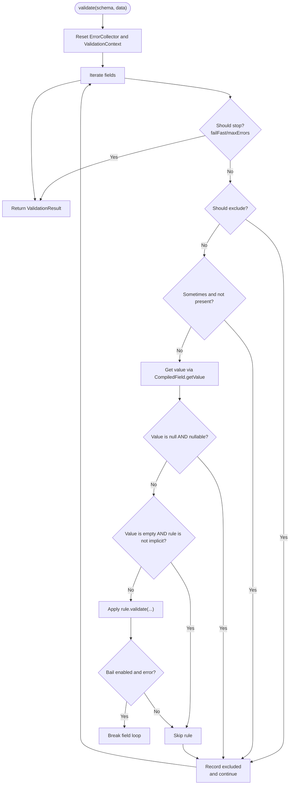
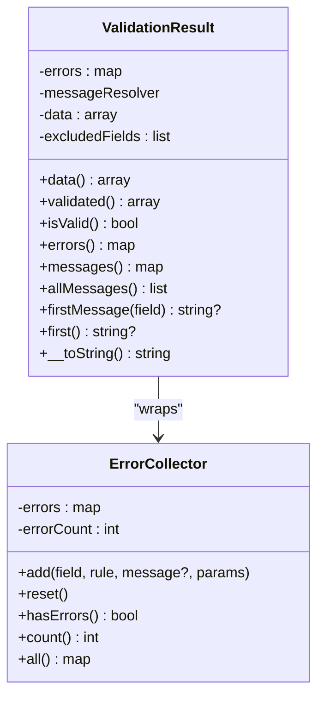
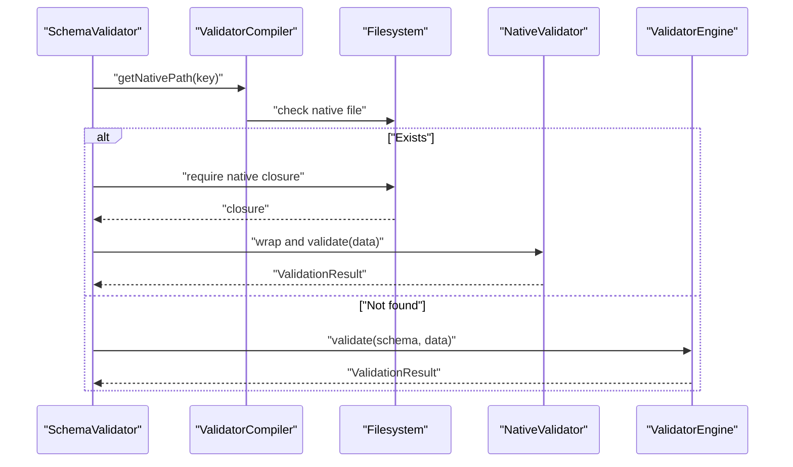
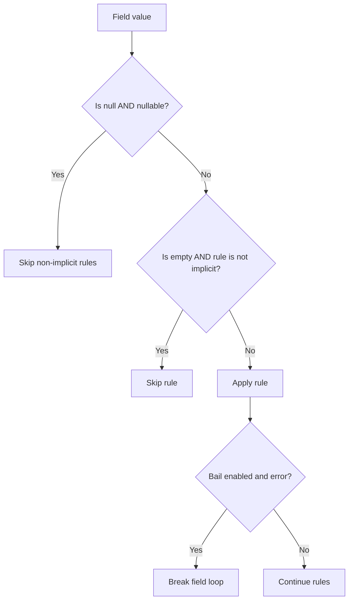
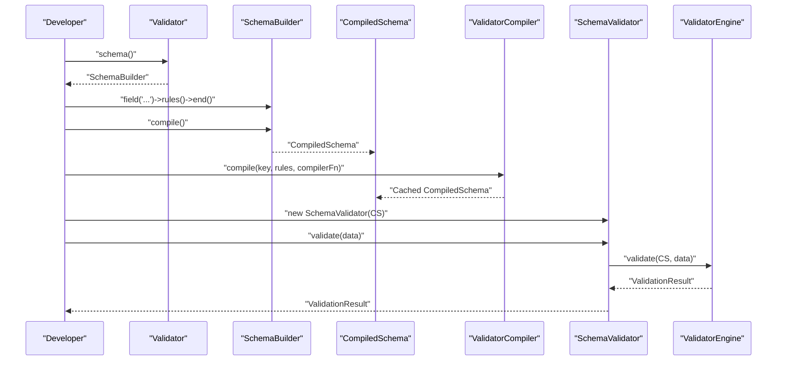
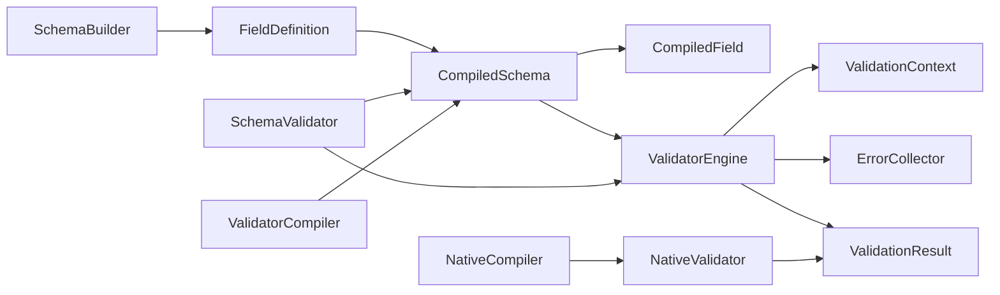

# Core Concepts

<cite>
**Referenced Files in This Document**
- [README.md](file://README.md)
- [Validator.php](file://src/Validator.php)
- [SchemaBuilder.php](file://src/Schema/SchemBuilder.php)
- [FieldDefinition.php](file://src/Schema/FieldDefinition.php)
- [CompiledSchema.php](file://src/Execution/CompiledSchema.php)
- [CompiledField.php](file://src/Execution/CompiledField.php)
- [ValidatorEngine.php](file://src/Execution/ValidatorEngine.php)
- [ValidationContext.php](file://src/Execution/ValidationContext.php)
- [ErrorCollector.php](file://src/Execution/ErrorCollector.php)
- [ValidationResult.php](file://src/Execution/ValidationResult.php)
- [SchemaValidator.php](file://src/SchemaValidator.php)
- [ValidatorCompiler.php](file://src/Compilation/ValidatorCompiler.php)
- [NativeCompiler.php](file://src/Compilation/NativeCompiler.php)
- [NativeValidator.php](file://src/Execution/NativeValidator.php)
- [SchemaCacheInterface.php](file://src/Cache/SchemaCacheInterface.php)
- [DataHelper.php](file://src/Execution/DataHelper.php)
</cite>

## Table of Contents
1. [Introduction](#introduction)
2. [Project Structure](#project-structure)
3. [Core Components](#core-components)
4. [Architecture Overview](#architecture-overview)
5. [Detailed Component Analysis](#detailed-component-analysis)
6. [Dependency Analysis](#dependency-analysis)
7. [Performance Considerations](#performance-considerations)
8. [Troubleshooting Guide](#troubleshooting-guide)
9. [Conclusion](#conclusion)

## Introduction
This document explains the fundamental concepts of the vi/validation library with a focus on the compile-once-validate-many paradigm. It covers how schemas are defined and compiled, how the ValidatorEngine executes validations, and how CompiledSchema encapsulates the compiled structure. It also details the validation lifecycle, memory management strategies, performance optimizations, nested field support (up to two levels), nullable field handling, and short-circuit evaluation. Practical examples illustrate how these concepts work together.

## Project Structure
The library is organized around three primary layers:
- Schema Definition: Fluent builder and field definitions
- Compilation: Schema compilation and native code generation
- Execution: Engine, context, and result handling

**Diagram sources**
- [SchemaBuilder.php](file://src/Schema/SchemBuilder.php#L9-L36)
- [FieldDefinition.php](file://src/Schema/FieldDefinition.php#L9-L658)
- [CompiledSchema.php](file://src/Execution/CompiledSchema.php#L9-L68)
- [CompiledField.php](file://src/Execution/CompiledField.php#L10-L177)
- [ValidatorCompiler.php](file://src/Compilation/ValidatorCompiler.php#L10-L195)
- [NativeCompiler.php](file://src/Compilation/NativeCompiler.php#L17-L310)
- [SchemaValidator.php](file://src/SchemaValidator.php#L13-L205)
- [ValidatorEngine.php](file://src/Execution/ValidatorEngine.php#L11-L177)
- [ValidationContext.php](file://src/Execution/ValidationContext.php#L7-L98)
- [ErrorCollector.php](file://src/Execution/ErrorCollector.php#L7-L51)
- [ValidationResult.php](file://src/Execution/ValidationResult.php#L9-L142)
- [NativeValidator.php](file://src/Execution/NativeValidator.php#L12-L39)

**Section sources**
- [README.md](file://README.md#L1-L120)
- [Validator.php](file://src/Validator.php#L9-L16)
- [SchemaBuilder.php](file://src/Schema/SchemBuilder.php#L9-L36)
- [FieldDefinition.php](file://src/Schema/FieldDefinition.php#L9-L658)
- [CompiledSchema.php](file://src/Execution/CompiledSchema.php#L9-L68)
- [CompiledField.php](file://src/Execution/CompiledField.php#L10-L177)
- [ValidatorEngine.php](file://src/Execution/ValidatorEngine.php#L11-L177)
- [ValidationContext.php](file://src/Execution/ValidationContext.php#L7-L98)
- [ErrorCollector.php](file://src/Execution/ErrorCollector.php#L7-L51)
- [ValidationResult.php](file://src/Execution/ValidationResult.php#L9-L142)
- [SchemaValidator.php](file://src/SchemaValidator.php#L13-L205)
- [ValidatorCompiler.php](file://src/Compilation/ValidatorCompiler.php#L10-L195)
- [NativeCompiler.php](file://src/Compilation/NativeCompiler.php#L17-L310)
- [NativeValidator.php](file://src/Execution/NativeValidator.php#L12-L39)

## Core Components
- SchemaBuilder: Fluent DSL to define fields and rules; compiles to CompiledSchema.
- FieldDefinition: Encapsulates per-field rules and fluent rule methods.
- CompiledSchema: Holds compiled fields and rules array; delegates validation to ValidatorEngine.
- CompiledField: Compiled representation of a field with deduplicated and reordered rules, nested access helpers, and exclusion logic.
- ValidatorEngine: Executes validation with short-circuiting, bail, and fail-fast behavior.
- ValidationContext: Provides data access (including dot-notation nested access up to two levels) and shared services.
- ErrorCollector: Accumulates validation errors.
- ValidationResult: Wraps errors, validated data, and message formatting.
- SchemaValidator: Orchestrates compilation, native validator loading, and streaming/validation APIs.
- ValidatorCompiler: Manages object and native caches, precompiled files, and atomic writes.
- NativeCompiler: Generates optimized PHP closures for high-throughput validation.
- NativeValidator: Executes precompiled closures for maximum performance.
- SchemaCacheInterface: Abstraction for caching CompiledSchema instances.

**Section sources**
- [SchemaBuilder.php](file://src/Schema/SchemBuilder.php#L9-L36)
- [FieldDefinition.php](file://src/Schema/FieldDefinition.php#L9-L658)
- [CompiledSchema.php](file://src/Execution/CompiledSchema.php#L9-L68)
- [CompiledField.php](file://src/Execution/CompiledField.php#L10-L177)
- [ValidatorEngine.php](file://src/Execution/ValidatorEngine.php#L11-L177)
- [ValidationContext.php](file://src/Execution/ValidationContext.php#L7-L98)
- [ErrorCollector.php](file://src/Execution/ErrorCollector.php#L7-L51)
- [ValidationResult.php](file://src/Execution/ValidationResult.php#L9-L142)
- [SchemaValidator.php](file://src/SchemaValidator.php#L13-L205)
- [ValidatorCompiler.php](file://src/Compilation/ValidatorCompiler.php#L10-L195)
- [NativeCompiler.php](file://src/Compilation/NativeCompiler.php#L17-L310)
- [NativeValidator.php](file://src/Execution/NativeValidator.php#L12-L39)
- [SchemaCacheInterface.php](file://src/Cache/SchemaCacheInterface.php#L9-L36)

## Architecture Overview
The library follows a compile-once-validate-many design:
- Build a schema using SchemaBuilder and FieldDefinition.
- Compile to CompiledSchema (object cache) and optionally generate native PHP code.
- Validate using SchemaValidator, which prefers a precompiled NativeValidator if available, otherwise falls back to ValidatorEngine.
- Results are returned as ValidationResult with structured errors and formatted messages.

**Diagram sources**
- [SchemaBuilder.php](file://src/Schema/SchemBuilder.php#L31-L34)
- [CompiledSchema.php](file://src/Execution/CompiledSchema.php#L27-L36)
- [ValidatorCompiler.php](file://src/Compilation/ValidatorCompiler.php#L33-L74)
- [SchemaValidator.php](file://src/SchemaValidator.php#L54-L73)
- [NativeValidator.php](file://src/Execution/NativeValidator.php#L27-L37)
- [ValidatorEngine.php](file://src/Execution/ValidatorEngine.php#L33-L98)

## Detailed Component Analysis

### SchemaBuilder and FieldDefinition
- SchemaBuilder exposes field(name) and compile() to construct a CompiledSchema.
- FieldDefinition provides a fluent API for adding rules (required, nullable, bail, sometimes, type checks, comparisons, etc.), conditionals, exclusions, and nested field chaining.
- Rules are stored in FieldDefinition and later compiled into CompiledField.

**Diagram sources**
- [SchemaBuilder.php](file://src/Schema/SchemBuilder.php#L9-L36)
- [FieldDefinition.php](file://src/Schema/FieldDefinition.php#L9-L658)

**Section sources**
- [SchemaBuilder.php](file://src/Schema/SchemBuilder.php#L9-L36)
- [FieldDefinition.php](file://src/Schema/FieldDefinition.php#L24-L658)

### CompiledSchema and CompiledField
- CompiledSchema holds a list of CompiledField and the original rules array; it delegates validation to ValidatorEngine.
- CompiledField encapsulates:
  - Name and nested resolution (dot notation up to two levels)
  - Deduplicated and reordered rules with special ordering for bail, required, nullable, and others
  - Exclusion rules and sometimes/bail/nullable flags
  - getValue(data) for nested access

**Diagram sources**
- [CompiledSchema.php](file://src/Execution/CompiledSchema.php#L9-L68)
- [CompiledField.php](file://src/Execution/CompiledField.php#L10-L177)

**Section sources**
- [CompiledSchema.php](file://src/Execution/CompiledSchema.php#L27-L66)
- [CompiledField.php](file://src/Execution/CompiledField.php#L29-L177)

### ValidatorEngine and ValidationContext
- ValidatorEngine orchestrates validation:
  - Resets/caches ErrorCollector and ValidationContext
  - Applies exclusion rules, sometimes, and bail
  - Skips implicit rules for “empty” values
  - Supports fail-fast and max-errors short-circuiting
  - Delegates rule execution to RuleInterface::validate and collects errors
- ValidationContext provides:
  - getValue(field) with dot-notation support up to two levels
  - hasValue(field) for presence checks
  - Accessors for database/password services

**Diagram sources**
- [ValidatorEngine.php](file://src/Execution/ValidatorEngine.php#L33-L98)
- [CompiledField.php](file://src/Execution/CompiledField.php#L163-L175)
- [ValidationContext.php](file://src/Execution/ValidationContext.php#L43-L73)

**Section sources**
- [ValidatorEngine.php](file://src/Execution/ValidatorEngine.php#L33-L177)
- [ValidationContext.php](file://src/Execution/ValidationContext.php#L43-L98)
- [CompiledField.php](file://src/Execution/CompiledField.php#L163-L175)

### ErrorCollector and ValidationResult
- ErrorCollector accumulates per-field errors with rule name, parameters, and optional messages.
- ValidationResult provides:
  - Raw errors, formatted messages, first-of-field/error helpers
  - validated() data excluding excluded fields
  - String conversion for quick printing

**Diagram sources**
- [ErrorCollector.php](file://src/Execution/ErrorCollector.php#L7-L51)
- [ValidationResult.php](file://src/Execution/ValidationResult.php#L9-L142)

**Section sources**
- [ErrorCollector.php](file://src/Execution/ErrorCollector.php#L17-L51)
- [ValidationResult.php](file://src/Execution/ValidationResult.php#L22-L142)

### SchemaValidator, ValidatorCompiler, and NativeValidator
- SchemaValidator:
  - Loads precompiled native closure if available
  - Falls back to ValidatorEngine.validate
  - Provides streaming APIs for memory-efficient batch processing
- ValidatorCompiler:
  - Object caching and native code generation
  - Atomic file writes for precompiled and native artifacts
- NativeCompiler:
  - Emits optimized PHP closures with inlined common rules
  - Uses goto for bail short-circuiting per field
- NativeValidator:
  - Executes the precompiled closure and returns ValidationResult

**Diagram sources**
- [SchemaValidator.php](file://src/SchemaValidator.php#L54-L73)
- [ValidatorCompiler.php](file://src/Compilation/ValidatorCompiler.php#L105-L108)
- [NativeValidator.php](file://src/Execution/NativeValidator.php#L27-L37)
- [ValidatorEngine.php](file://src/Execution/ValidatorEngine.php#L33-L98)

**Section sources**
- [SchemaValidator.php](file://src/SchemaValidator.php#L54-L205)
- [ValidatorCompiler.php](file://src/Compilation/ValidatorCompiler.php#L33-L195)
- [NativeCompiler.php](file://src/Compilation/NativeCompiler.php#L24-L114)
- [NativeValidator.php](file://src/Execution/NativeValidator.php#L18-L39)

### Nested Field Support and Nullable Handling
- Nested fields:
  - Dot notation up to two levels is supported in CompiledField.getValue and ValidationContext.getValue/hasValue.
  - CompiledField detects nested names and splits into parent/child segments.
- Nullable handling:
  - If a field is nullable and the value is null, the engine skips non-implicit rules for that field.
- Short-circuit evaluation:
  - Bail stops further rule evaluation for a field upon first error.
  - Fail-fast stops the entire validation upon first error when configured.
  - Max-errors threshold halts validation when reached.

**Diagram sources**
- [ValidatorEngine.php](file://src/Execution/ValidatorEngine.php#L72-L94)
- [CompiledField.php](file://src/Execution/CompiledField.php#L133-L141)
- [ValidationContext.php](file://src/Execution/ValidationContext.php#L43-L73)

**Section sources**
- [CompiledField.php](file://src/Execution/CompiledField.php#L33-L44)
- [CompiledField.php](file://src/Execution/CompiledField.php#L163-L175)
- [ValidationContext.php](file://src/Execution/ValidationContext.php#L43-L73)
- [ValidatorEngine.php](file://src/Execution/ValidatorEngine.php#L72-L94)

### Validation Lifecycle: From Schema Definition to Result Processing
1. Define schema using Validator::schema() and SchemaBuilder::field().
2. Compile to CompiledSchema via SchemaBuilder::compile().
3. Optionally compile native code via ValidatorCompiler::compile() and writeNative().
4. Validate using SchemaValidator::validate(), which prefers a NativeValidator if available.
5. Engine applies rules, collects errors, and produces ValidationResult.

**Diagram sources**
- [Validator.php](file://src/Validator.php#L11-L14)
- [SchemaBuilder.php](file://src/Schema/SchemBuilder.php#L31-L34)
- [CompiledSchema.php](file://src/Execution/CompiledSchema.php#L27-L36)
- [ValidatorCompiler.php](file://src/Compilation/ValidatorCompiler.php#L33-L74)
- [SchemaValidator.php](file://src/SchemaValidator.php#L54-L73)
- [ValidatorEngine.php](file://src/Execution/ValidatorEngine.php#L33-L98)

**Section sources**
- [README.md](file://README.md#L30-L120)
- [Validator.php](file://src/Validator.php#L11-L14)
- [SchemaBuilder.php](file://src/Schema/SchemBuilder.php#L31-L34)
- [CompiledSchema.php](file://src/Execution/CompiledSchema.php#L27-L36)
- [ValidatorCompiler.php](file://src/Compilation/ValidatorCompiler.php#L33-L74)
- [SchemaValidator.php](file://src/SchemaValidator.php#L54-L73)
- [ValidatorEngine.php](file://src/Execution/ValidatorEngine.php#L33-L98)

## Dependency Analysis
- Coupling:
  - CompiledSchema depends on CompiledField and ValidatorEngine.
  - ValidatorEngine depends on CompiledField, ValidationContext, and ErrorCollector.
  - SchemaValidator depends on CompiledSchema, ValidatorEngine, and ValidatorCompiler.
  - NativeCompiler depends on CompiledSchema and CompiledField.
- Cohesion:
  - Each component has a single responsibility: building, compiling, executing, or representing validation artifacts.
- External dependencies:
  - Filesystem for native/precompiled artifacts.
  - Reflection in NativeCompiler for rule property introspection.

**Diagram sources**
- [SchemaBuilder.php](file://src/Schema/SchemBuilder.php#L9-L36)
- [FieldDefinition.php](file://src/Schema/FieldDefinition.php#L9-L658)
- [CompiledSchema.php](file://src/Execution/CompiledSchema.php#L9-L68)
- [CompiledField.php](file://src/Execution/CompiledField.php#L10-L177)
- [ValidatorEngine.php](file://src/Execution/ValidatorEngine.php#L11-L177)
- [ValidationContext.php](file://src/Execution/ValidationContext.php#L7-L98)
- [ErrorCollector.php](file://src/Execution/ErrorCollector.php#L7-L51)
- [ValidationResult.php](file://src/Execution/ValidationResult.php#L9-L142)
- [SchemaValidator.php](file://src/SchemaValidator.php#L13-L205)
- [ValidatorCompiler.php](file://src/Compilation/ValidatorCompiler.php#L10-L195)
- [NativeCompiler.php](file://src/Compilation/NativeCompiler.php#L17-L310)
- [NativeValidator.php](file://src/Execution/NativeValidator.php#L12-L39)

**Section sources**
- [CompiledSchema.php](file://src/Execution/CompiledSchema.php#L9-L68)
- [ValidatorEngine.php](file://src/Execution/ValidatorEngine.php#L11-L177)
- [SchemaValidator.php](file://src/SchemaValidator.php#L13-L205)
- [ValidatorCompiler.php](file://src/Compilation/ValidatorCompiler.php#L10-L195)
- [NativeCompiler.php](file://src/Compilation/NativeCompiler.php#L17-L310)

## Performance Considerations
- Compile-once-validate-many:
  - CompiledSchema is reused across validations; ValidatorEngine reuses ErrorCollector and ValidationContext to reduce allocations.
- Native code path:
  - NativeCompiler generates optimized closures with inlined common rules and goto-based bail short-circuiting.
  - ValidatorCompiler writes native code atomically and caches CompiledSchema in-memory.
- Streaming APIs:
  - SchemaValidator::stream(), ::each(), and ::failures() avoid materializing all results in memory.
- Nested access:
  - CompiledField.getValue and ValidationContext.getValue use simple array checks and dot splitting for up to two levels.

Recommendations:
- Prefer precompiled/native artifacts for hot paths.
- Use streaming APIs for large datasets.
- Configure fail-fast and max-errors to bound runtime cost.

**Section sources**
- [ValidatorEngine.php](file://src/Execution/ValidatorEngine.php#L33-L98)
- [NativeCompiler.php](file://src/Compilation/NativeCompiler.php#L24-L114)
- [ValidatorCompiler.php](file://src/Compilation/ValidatorCompiler.php#L79-L103)
- [SchemaValidator.php](file://src/SchemaValidator.php#L113-L203)

## Troubleshooting Guide
Common issues and remedies:
- Unexpectedly passing null values:
  - Ensure nullable() is applied when null is acceptable; otherwise non-implicit rules will be skipped.
- Nested field not found:
  - Verify dot notation matches structure and that parent is an array.
- Excluded fields:
  - Fields marked with exclude rules are removed from validated() output.
- Error messages:
  - Use messages() to resolve localized messages via MessageResolver.

Operational tips:
- Use firstFailure() for fail-fast scenarios.
- Use failures() streaming to report only invalid rows.
- Use allValid() to check dataset-wide validity without storing results.

**Section sources**
- [CompiledField.php](file://src/Execution/CompiledField.php#L148-L161)
- [ValidationResult.php](file://src/Execution/ValidationResult.php#L45-L57)
- [SchemaValidator.php](file://src/SchemaValidator.php#L184-L203)

## Conclusion
The vi/validation library’s core strength lies in its compile-once-validate-many architecture, enabling high throughput with minimal overhead. CompiledSchema captures the schema once, while ValidatorEngine and NativeCompiler deliver short-circuiting, nested field support, and memory-efficient streaming. Together, these components provide a robust foundation for validating large datasets reliably and quickly.