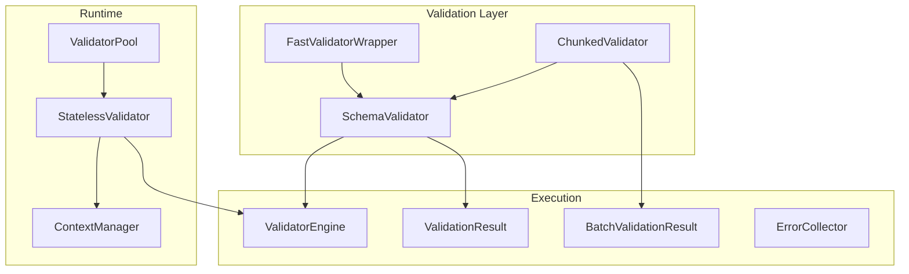
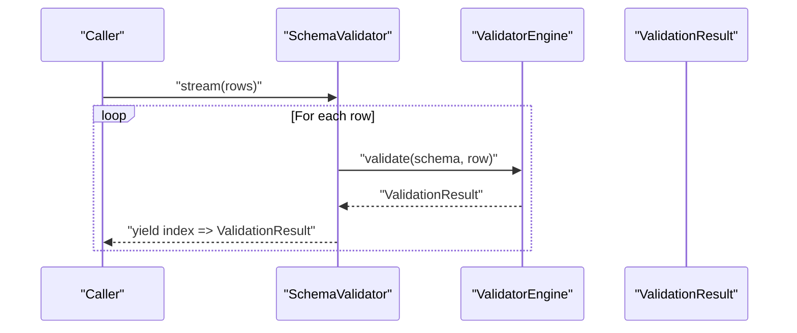
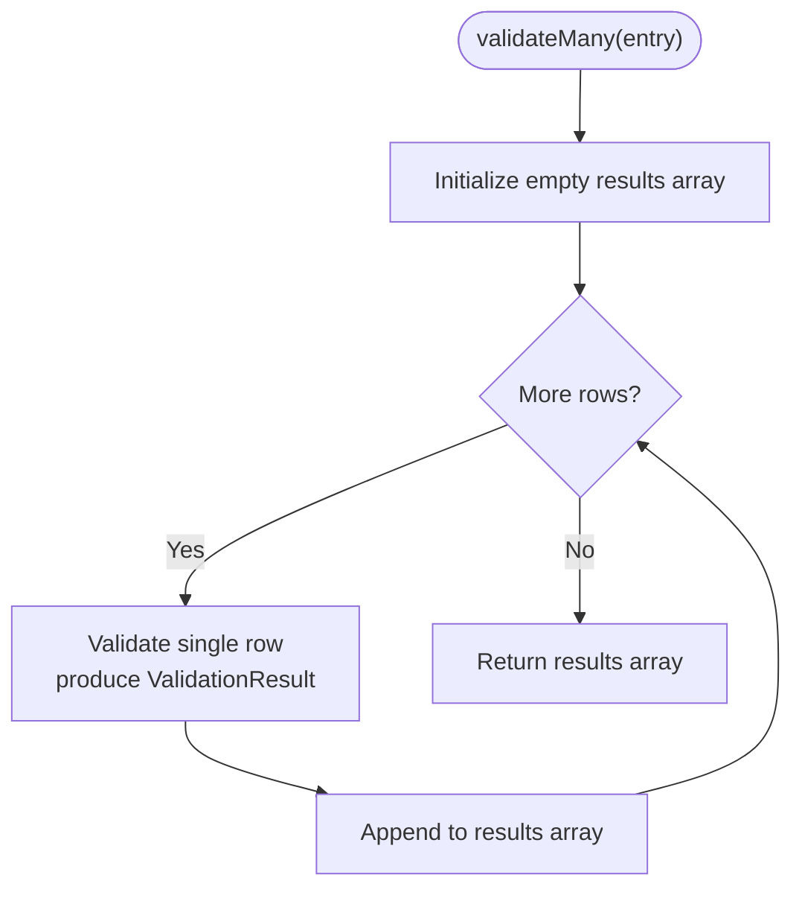
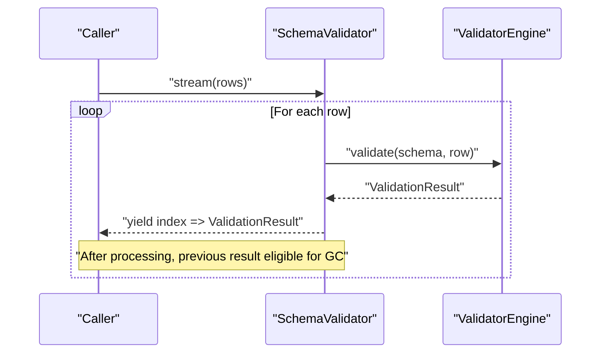
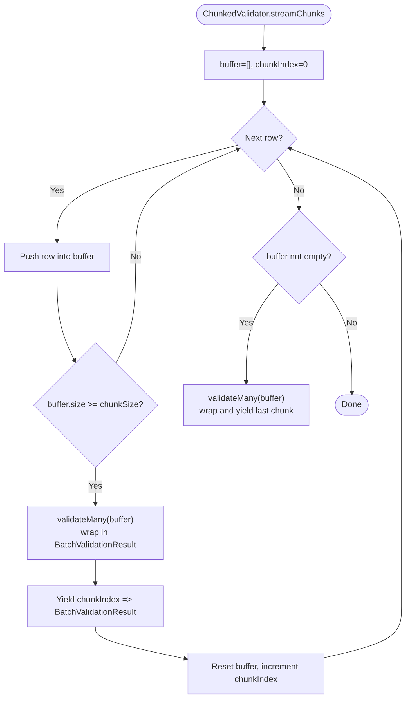
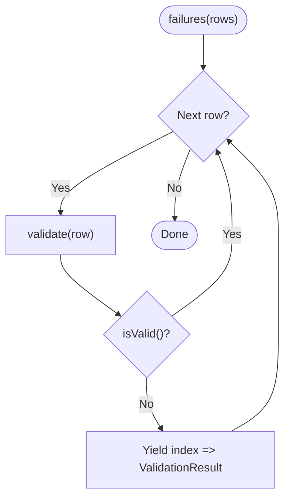
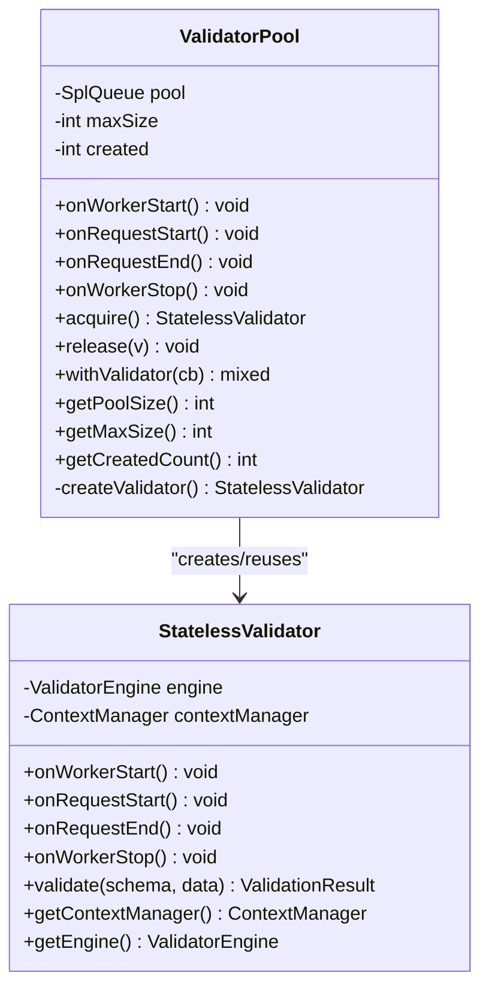
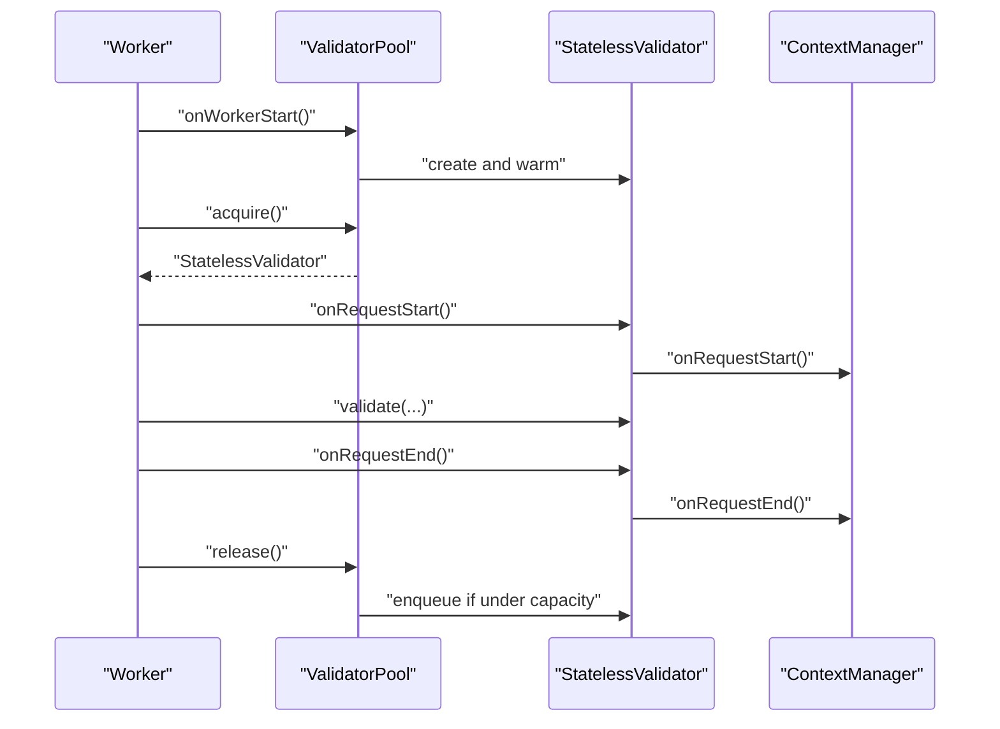
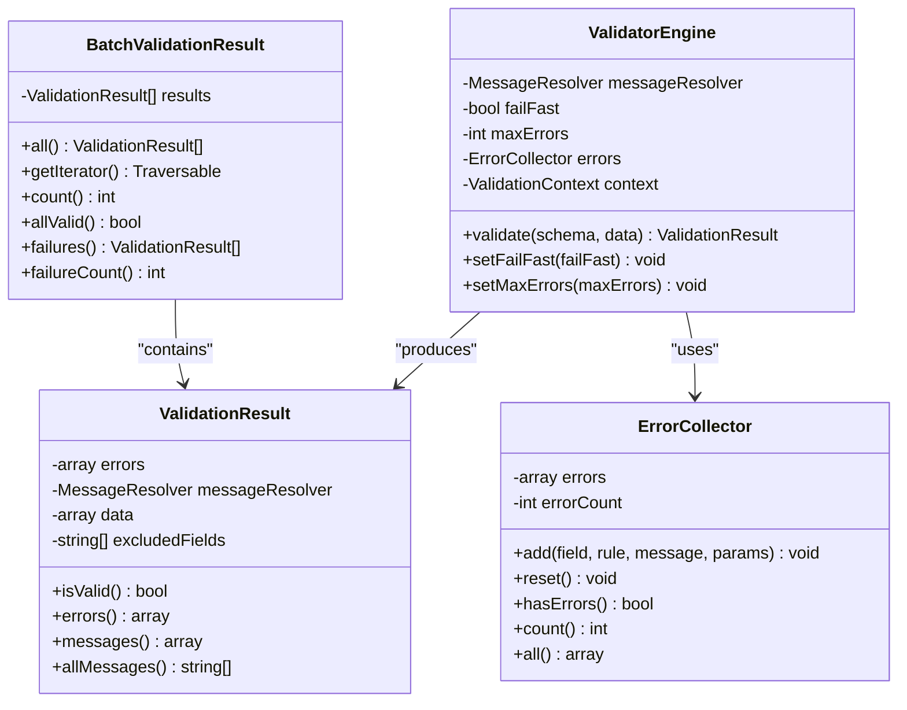
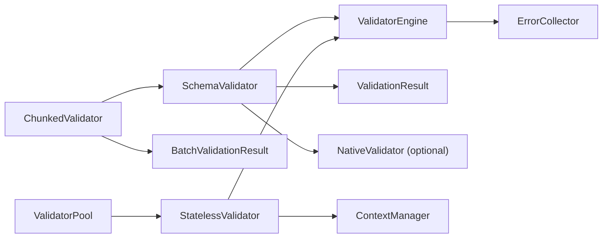

# Memory Management

<cite>
**Referenced Files in This Document**
- [src/SchemaValidator.php](file://src/SchemaValidator.php)
- [src/Execution/ChunkedValidator.php](file://src/Execution/ChunkedValidator.php)
- [src/Runtime/ValidatorPool.php](file://src/Runtime/ValidatorPool.php)
- [src/Runtime/StatelessValidator.php](file://src/Runtime/StatelessValidator.php)
- [src/Runtime/ContextManager.php](file://src/Runtime/ContextManager.php)
- [src/Execution/ValidatorEngine.php](file://src/Execution/ValidatorEngine.php)
- [src/Execution/ValidationResult.php](file://src/Execution/ValidationResult.php)
- [src/Execution/BatchValidationResult.php](file://src/Execution/BatchValidationResult.php)
- [src/Execution/ErrorCollector.php](file://src/Execution/ErrorCollector.php)
- [src/Execution/DataHelper.php](file://src/Execution/DataHelper.php)
- [src/Laravel/FastValidatorWrapper.php](file://src/Laravel/FastValidatorWrapper.php)
- [README.md](file://README.md)
- [tests/benchmark.php](file://tests/benchmark.php)
- [tests/final_benchmark.php](file://tests/final_benchmark.php)
</cite>

## Table of Contents
1. [Introduction](#introduction)
2. [Project Structure](#project-structure)
3. [Core Components](#core-components)
4. [Architecture Overview](#architecture-overview)
5. [Detailed Component Analysis](#detailed-component-analysis)
6. [Dependency Analysis](#dependency-analysis)
7. [Performance Considerations](#performance-considerations)
8. [Troubleshooting Guide](#troubleshooting-guide)
9. [Conclusion](#conclusion)

## Introduction
This document explains memory management strategies in vi/validation for handling large datasets efficiently. It covers three primary approaches:
- In-memory validation via validateMany
- Streaming validation via stream and each
- Chunked processing via ChunkedValidator

It also details the Generator-based streaming model, the ValidatorPool mechanism for long-running processes, and best practices for preventing memory exhaustion, managing garbage collection, and optimizing memory allocation.

## Project Structure
The memory management features are centered around:
- Schema-level validation orchestration (SchemaValidator)
- Streaming and chunked processing helpers (ChunkedValidator)
- Stateless runtime wrappers and pooling (StatelessValidator, ValidatorPool, ContextManager)
- Execution engine and result containers (ValidatorEngine, ValidationResult, BatchValidationResult, ErrorCollector)
- Laravel integration (FastValidatorWrapper)

**Diagram sources**
- [src/SchemaValidator.php](file://src/SchemaValidator.php#L13-L205)
- [src/Execution/ChunkedValidator.php](file://src/Execution/ChunkedValidator.php#L16-L154)
- [src/Runtime/ValidatorPool.php](file://src/Runtime/ValidatorPool.php#L12-L140)
- [src/Runtime/StatelessValidator.php](file://src/Runtime/StatelessValidator.php#L15-L79)
- [src/Runtime/ContextManager.php](file://src/Runtime/ContextManager.php#L14-L119)
- [src/Execution/ValidatorEngine.php](file://src/Execution/ValidatorEngine.php#L11-L177)
- [src/Execution/ValidationResult.php](file://src/Execution/ValidationResult.php#L9-L142)
- [src/Execution/BatchValidationResult.php](file://src/Execution/BatchValidationResult.php#L17-L92)
- [src/Laravel/FastValidatorWrapper.php](file://src/Laravel/FastValidatorWrapper.php#L285-L312)

**Section sources**
- [src/SchemaValidator.php](file://src/SchemaValidator.php#L13-L205)
- [src/Execution/ChunkedValidator.php](file://src/Execution/ChunkedValidator.php#L16-L154)
- [src/Runtime/ValidatorPool.php](file://src/Runtime/ValidatorPool.php#L12-L140)
- [src/Runtime/StatelessValidator.php](file://src/Runtime/StatelessValidator.php#L15-L79)
- [src/Runtime/ContextManager.php](file://src/Runtime/ContextManager.php#L14-L119)
- [src/Execution/ValidatorEngine.php](file://src/Execution/ValidatorEngine.php#L11-L177)
- [src/Execution/ValidationResult.php](file://src/Execution/ValidationResult.php#L9-L142)
- [src/Execution/BatchValidationResult.php](file://src/Execution/BatchValidationResult.php#L17-L92)
- [src/Laravel/FastValidatorWrapper.php](file://src/Laravel/FastValidatorWrapper.php#L285-L312)

## Core Components
- SchemaValidator orchestrates validation modes:
  - validateMany: materializes all results in memory
  - stream: yields one result at a time via Generator
  - each: processes each result immediately without storing
  - failures: streams only failed results
  - firstFailure and allValid: early-exit checks for memory efficiency
- ChunkedValidator buffers rows in fixed-size chunks, yielding BatchValidationResult or streaming failures to cap peak memory
- StatelessValidator and ValidatorPool enable long-running processes with request-scoped lifecycle hooks and instance reuse
- ValidatorEngine performs field-level validation with configurable fail-fast and max-errors limits
- ValidationResult, BatchValidationResult, and ErrorCollector encapsulate results and errors with efficient accessors

**Section sources**
- [src/SchemaValidator.php](file://src/SchemaValidator.php#L74-L204)
- [src/Execution/ChunkedValidator.php](file://src/Execution/ChunkedValidator.php#L16-L154)
- [src/Runtime/ValidatorPool.php](file://src/Runtime/ValidatorPool.php#L12-L140)
- [src/Runtime/StatelessValidator.php](file://src/Runtime/StatelessValidator.php#L15-L79)
- [src/Execution/ValidatorEngine.php](file://src/Execution/ValidatorEngine.php#L11-L177)
- [src/Execution/ValidationResult.php](file://src/Execution/ValidationResult.php#L9-L142)
- [src/Execution/BatchValidationResult.php](file://src/Execution/BatchValidationResult.php#L17-L92)

## Architecture Overview
The memory-efficient validation pipeline leverages generators and chunking to avoid retaining large arrays of results in memory. StatelessValidator and ValidatorPool minimize per-request allocations and prevent state leakage across requests.

**Diagram sources**
- [src/SchemaValidator.php](file://src/SchemaValidator.php#L113-L121)
- [src/Execution/ValidatorEngine.php](file://src/Execution/ValidatorEngine.php#L33-L98)
- [src/Execution/ValidationResult.php](file://src/Execution/ValidationResult.php#L22-L32)

## Detailed Component Analysis

### In-Memory Validation (validateMany)
- Behavior: Iterates rows and collects all ValidationResult instances into an array before returning.
- Memory profile: O(n) retained results; risks memory exhaustion for large datasets.
- When to use: Small datasets or when downstream logic requires random access to all results.
- Best practice: Prefer stream or each for large datasets.

**Diagram sources**
- [src/SchemaValidator.php](file://src/SchemaValidator.php#L84-L93)

**Section sources**
- [src/SchemaValidator.php](file://src/SchemaValidator.php#L74-L93)

### Streaming Validation (stream and each)
- stream: Uses a Generator to yield ValidationResult per row, enabling garbage collection after each iteration.
- each: Calls validate for each row and invokes a callback immediately, avoiding retention of results.
- Memory profile: O(1) effective memory footprint during iteration.
- Use cases: ETL pipelines, queue workers, and batch imports where results are processed immediately.

**Diagram sources**
- [src/SchemaValidator.php](file://src/SchemaValidator.php#L113-L121)
- [src/Execution/ValidatorEngine.php](file://src/Execution/ValidatorEngine.php#L33-L98)

**Section sources**
- [src/SchemaValidator.php](file://src/SchemaValidator.php#L95-L150)
- [README.md](file://README.md#L266-L315)

### Chunked Processing (ChunkedValidator)
- Purpose: Validates rows in fixed-size buffers to bound memory usage while still processing large iterables.
- Methods:
  - validateInChunks: processes each chunk via a callback
  - streamChunks: yields BatchValidationResult per chunk
  - streamFailures: yields only failed results with original indices
  - countFailures: counts failures without storing all results
- Memory profile: Peaks at chunkSize × per-row memory plus small buffer overhead; releases per chunk after processing.

**Diagram sources**
- [src/Execution/ChunkedValidator.php](file://src/Execution/ChunkedValidator.php#L63-L81)
- [src/Execution/ChunkedValidator.php](file://src/Execution/ChunkedValidator.php#L133-L137)
- [src/Execution/BatchValidationResult.php](file://src/Execution/BatchValidationResult.php#L23-L26)

**Section sources**
- [src/Execution/ChunkedValidator.php](file://src/Execution/ChunkedValidator.php#L16-L154)
- [src/Execution/BatchValidationResult.php](file://src/Execution/BatchValidationResult.php#L17-L92)

### Generator-Based Streaming Implementation
- stream and failures return Generators, ensuring lazy evaluation and per-result garbage collection.
- failures filters out valid results on-the-fly, reducing memory pressure for error-heavy datasets.
- firstFailure and allValid short-circuit on the first failure, minimizing work and memory retention.

**Diagram sources**
- [src/SchemaValidator.php](file://src/SchemaValidator.php#L161-L174)

**Section sources**
- [src/SchemaValidator.php](file://src/SchemaValidator.php#L152-L203)

### ValidatorPool Mechanism for Long-Running Processes
- Purpose: Reuse StatelessValidator instances across requests within a worker lifecycle to reduce allocation overhead.
- Lifecycle hooks:
  - onWorkerStart: pre-warm pool
  - onRequestStart/onRequestEnd: reset request-scoped state
  - onWorkerStop: clean up remaining instances
- withValidator: automatic acquire/release pattern for safe usage.

**Diagram sources**
- [src/Runtime/ValidatorPool.php](file://src/Runtime/ValidatorPool.php#L12-L140)
- [src/Runtime/StatelessValidator.php](file://src/Runtime/StatelessValidator.php#L15-L79)

**Section sources**
- [src/Runtime/ValidatorPool.php](file://src/Runtime/ValidatorPool.php#L12-L140)
- [src/Runtime/StatelessValidator.php](file://src/Runtime/StatelessValidator.php#L15-L79)
- [src/Runtime/ContextManager.php](file://src/Runtime/ContextManager.php#L14-L119)

### Request-Scoped Context and State Management
- ContextManager resets per-request state (errors, attributes, messages) to prevent cross-request contamination.
- StatelessValidator wraps ValidatorEngine and delegates lifecycle events to ContextManager for predictable memory behavior.

**Diagram sources**
- [src/Runtime/ValidatorPool.php](file://src/Runtime/ValidatorPool.php#L26-L90)
- [src/Runtime/StatelessValidator.php](file://src/Runtime/StatelessValidator.php#L28-L77)
- [src/Runtime/ContextManager.php](file://src/Runtime/ContextManager.php#L25-L48)

**Section sources**
- [src/Runtime/ContextManager.php](file://src/Runtime/ContextManager.php#L14-L119)
- [src/Runtime/StatelessValidator.php](file://src/Runtime/StatelessValidator.php#L15-L79)

### Execution Engine and Result Containers
- ValidatorEngine:
  - Resets ErrorCollector and ValidationContext per validation call
  - Supports fail-fast and max-errors thresholds to limit memory growth
- ValidationResult:
  - Stores errors and excluded fields; supports messages resolution and flattened lists
- BatchValidationResult:
  - Holds a list of ValidationResult with streaming iteration and failure aggregation
- ErrorCollector:
  - Accumulates field-level errors with O(1) append semantics

**Diagram sources**
- [src/Execution/ValidatorEngine.php](file://src/Execution/ValidatorEngine.php#L11-L177)
- [src/Execution/ValidationResult.php](file://src/Execution/ValidationResult.php#L9-L142)
- [src/Execution/BatchValidationResult.php](file://src/Execution/BatchValidationResult.php#L17-L92)
- [src/Execution/ErrorCollector.php](file://src/Execution/ErrorCollector.php#L7-L51)

**Section sources**
- [src/Execution/ValidatorEngine.php](file://src/Execution/ValidatorEngine.php#L11-L177)
- [src/Execution/ValidationResult.php](file://src/Execution/ValidationResult.php#L9-L142)
- [src/Execution/BatchValidationResult.php](file://src/Execution/BatchValidationResult.php#L17-L92)
- [src/Execution/ErrorCollector.php](file://src/Execution/ErrorCollector.php#L7-L51)

### Practical Examples and Memory Usage Patterns
- In-memory validation (validateMany):
  - Use when downstream logic needs random access to all results.
  - Risk: memory growth proportional to dataset size.
  - Reference: [src/SchemaValidator.php](file://src/SchemaValidator.php#L74-L93)
- Streaming validation (stream):
  - Use for ETL and batch imports; each result is garbage collected after use.
  - Reference: [src/SchemaValidator.php](file://src/SchemaValidator.php#L95-L121), [README.md](file://README.md#L270-L292)
- Callback-based processing (each):
  - Use for immediate action without storing results.
  - Reference: [src/SchemaValidator.php](file://src/SchemaValidator.php#L123-L150)
- Failures-only streaming:
  - Use for error reporting; reduces memory by skipping valid rows.
  - Reference: [src/SchemaValidator.php](file://src/SchemaValidator.php#L152-L174)
- Chunked streaming:
  - Use for very large datasets requiring batch processing with bounded memory.
  - Reference: [src/Execution/ChunkedValidator.php](file://src/Execution/ChunkedValidator.php#L54-L81), [README.md](file://README.md#L340-L365)
- ValidatorPool with StatelessValidator:
  - Use in long-running workers to reuse validators and manage lifecycle.
  - Reference: [src/Runtime/ValidatorPool.php](file://src/Runtime/ValidatorPool.php#L56-L108), [src/Runtime/StatelessValidator.php](file://src/Runtime/StatelessValidator.php#L15-L79)

**Section sources**
- [src/SchemaValidator.php](file://src/SchemaValidator.php#L74-L204)
- [src/Execution/ChunkedValidator.php](file://src/Execution/ChunkedValidator.php#L16-L154)
- [src/Runtime/ValidatorPool.php](file://src/Runtime/ValidatorPool.php#L12-L140)
- [src/Runtime/StatelessValidator.php](file://src/Runtime/StatelessValidator.php#L15-L79)
- [README.md](file://README.md#L236-L365)

## Dependency Analysis
- SchemaValidator depends on ValidatorEngine and ValidationResult; optionally on a cached NativeValidator for precompiled paths.
- ChunkedValidator composes SchemaValidator and produces BatchValidationResult.
- StatelessValidator composes ValidatorEngine and ContextManager; ValidatorPool manages a pool of StatelessValidator.
- ValidatorEngine depends on ErrorCollector and ValidationContext; integrates with optional external services via interfaces.

**Diagram sources**
- [src/SchemaValidator.php](file://src/SchemaValidator.php#L13-L73)
- [src/Execution/ChunkedValidator.php](file://src/Execution/ChunkedValidator.php#L16-L23)
- [src/Runtime/ValidatorPool.php](file://src/Runtime/ValidatorPool.php#L12-L24)
- [src/Runtime/StatelessValidator.php](file://src/Runtime/StatelessValidator.php#L15-L26)
- [src/Execution/ValidatorEngine.php](file://src/Execution/ValidatorEngine.php#L11-L31)
- [src/Execution/ErrorCollector.php](file://src/Execution/ErrorCollector.php#L7-L10)

**Section sources**
- [src/SchemaValidator.php](file://src/SchemaValidator.php#L13-L73)
- [src/Execution/ChunkedValidator.php](file://src/Execution/ChunkedValidator.php#L16-L23)
- [src/Runtime/ValidatorPool.php](file://src/Runtime/ValidatorPool.php#L12-L24)
- [src/Runtime/StatelessValidator.php](file://src/Runtime/StatelessValidator.php#L15-L26)
- [src/Execution/ValidatorEngine.php](file://src/Execution/ValidatorEngine.php#L11-L31)
- [src/Execution/ErrorCollector.php](file://src/Execution/ErrorCollector.php#L7-L10)

## Performance Considerations
- Garbage collection:
  - Streaming and chunked modes rely on PHP’s GC to reclaim per-result memory promptly.
  - Benchmarks disable GC to stabilize timing; production code should allow normal GC behavior.
  - References: [tests/benchmark.php](file://tests/benchmark.php#L8-L10), [tests/final_benchmark.php](file://tests/final_benchmark.php#L16-L18)
- Throughput and latency:
  - validateMany materializes all results; prefer stream or chunked for throughput on large datasets.
  - ChunkedValidator balances throughput and memory by processing in batches.
- Early termination:
  - firstFailure and allValid short-circuit on the first failure to reduce work and memory retention.
- Native compilation:
  - Precompiled validators can improve performance; SchemaValidator detects and caches native validators.

[No sources needed since this section provides general guidance]

## Troubleshooting Guide
- Symptoms of memory exhaustion:
  - validateMany on large datasets causing high memory usage; switch to stream or chunked.
  - References: [src/SchemaValidator.php](file://src/SchemaValidator.php#L74-L93), [README.md](file://README.md#L266-L275)
- State leakage in long-running workers:
  - Ensure StatelessValidator lifecycle hooks are invoked; use ValidatorPool.withValidator to guarantee release.
  - References: [src/Runtime/StatelessValidator.php](file://src/Runtime/StatelessValidator.php#L28-L77), [src/Runtime/ValidatorPool.php](file://src/Runtime/ValidatorPool.php#L99-L108)
- Excessive error accumulation:
  - Tune fail-fast and max-errors to cap memory growth.
  - References: [src/Execution/ValidatorEngine.php](file://src/Execution/ValidatorEngine.php#L100-L123), [src/Execution/ValidatorEngine.php](file://src/Execution/ValidatorEngine.php#L148-L159)
- Error reporting overhead:
  - Use failures or streamFailures to avoid retaining valid results.
  - References: [src/SchemaValidator.php](file://src/SchemaValidator.php#L152-L174), [src/Execution/ChunkedValidator.php](file://src/Execution/ChunkedValidator.php#L92-L110)

**Section sources**
- [src/SchemaValidator.php](file://src/SchemaValidator.php#L74-L204)
- [src/Runtime/ValidatorPool.php](file://src/Runtime/ValidatorPool.php#L99-L108)
- [src/Runtime/StatelessValidator.php](file://src/Runtime/StatelessValidator.php#L28-L77)
- [src/Execution/ValidatorEngine.php](file://src/Execution/ValidatorEngine.php#L100-L159)
- [src/Execution/ChunkedValidator.php](file://src/Execution/ChunkedValidator.php#L92-L110)

## Conclusion
vi/validation provides robust, memory-efficient strategies for large-scale validation:
- Use stream for O(1) memory during iteration
- Use each for fire-and-forget processing
- Use chunked processing for batch-oriented workflows with bounded memory
- Use ValidatorPool with StatelessValidator in long-running workers to reduce allocation overhead and prevent state leakage

These patterns, combined with fail-fast and max-errors controls, help prevent memory exhaustion and maintain predictable performance across diverse workloads.