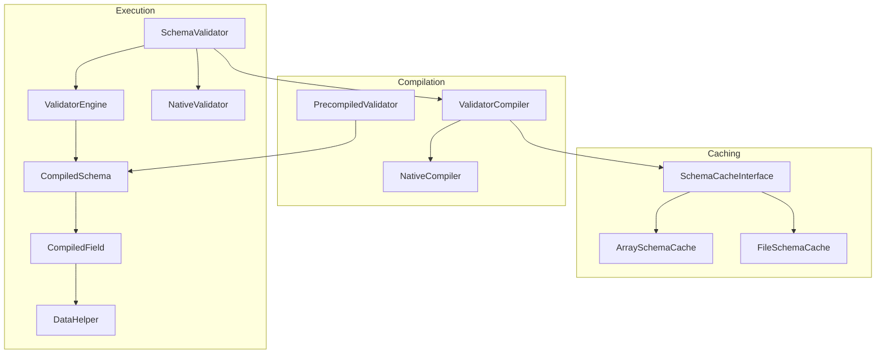
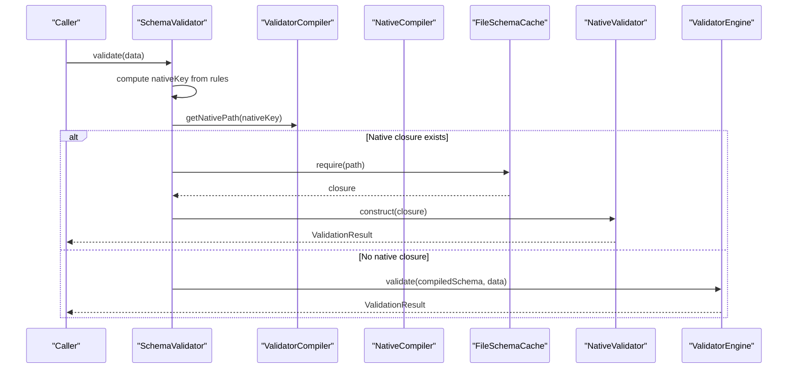
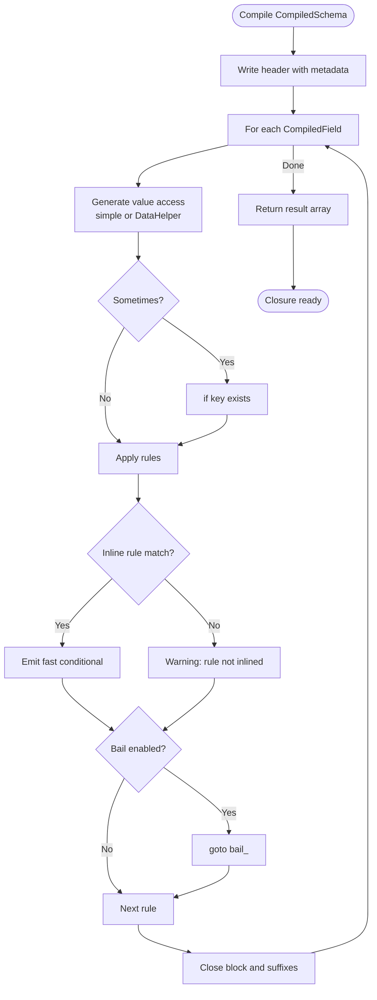
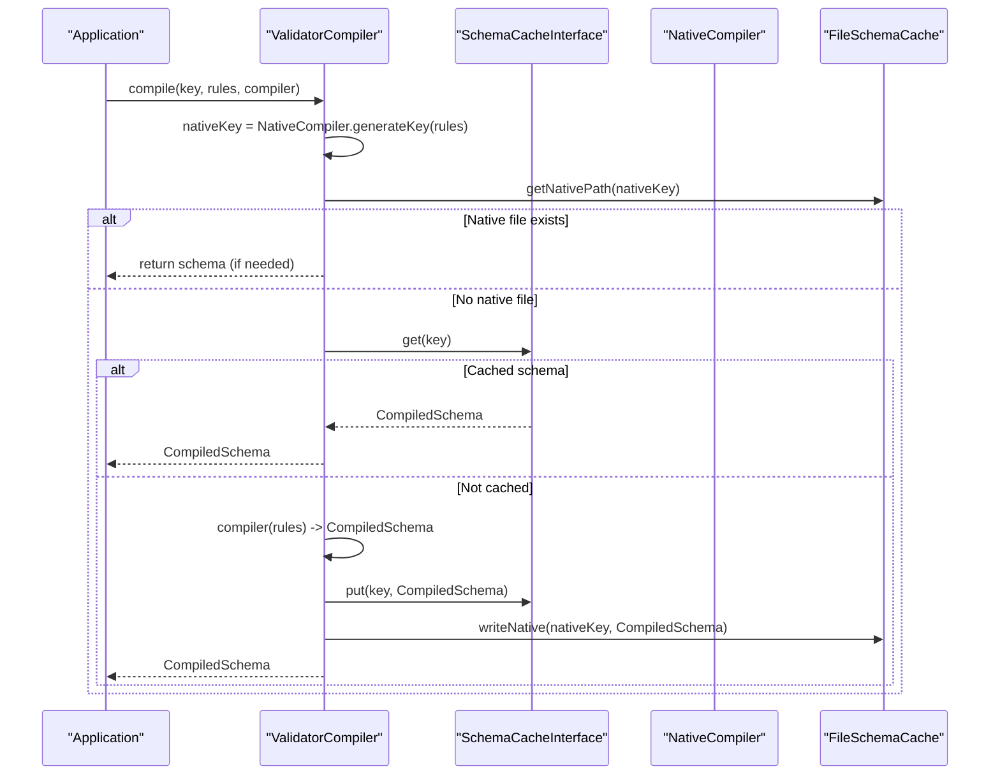
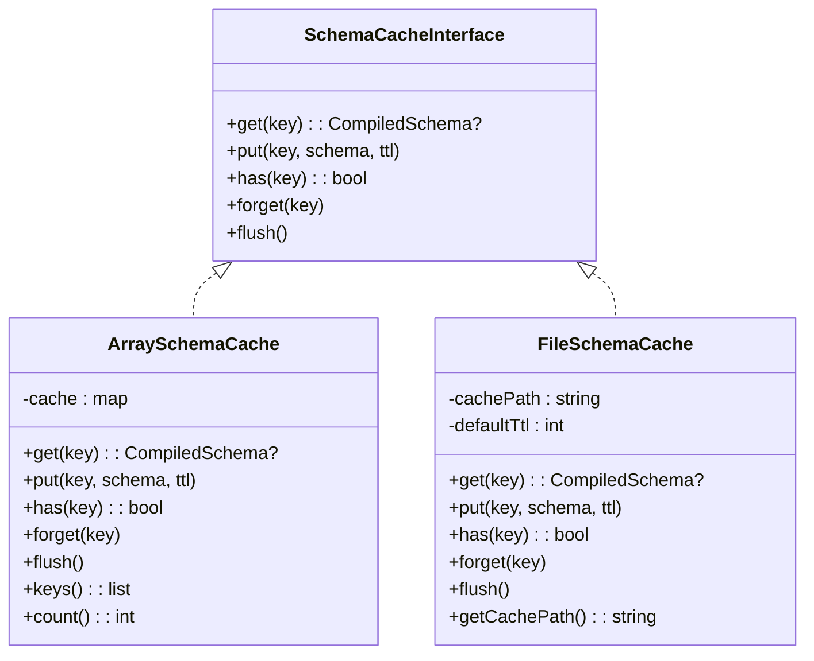
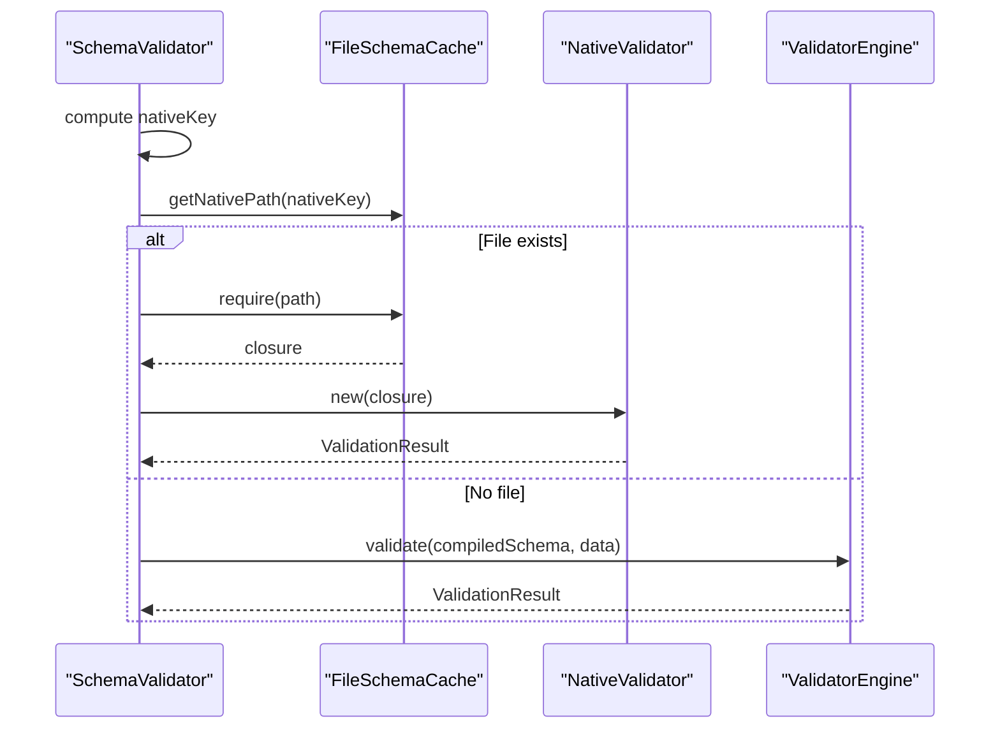
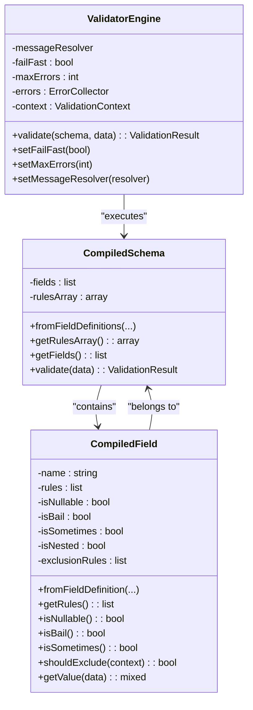
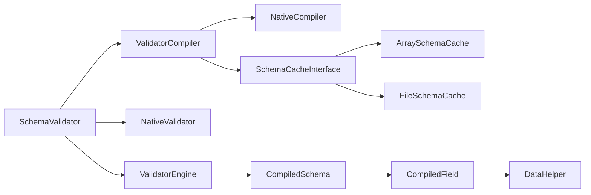

# Performance Optimization

<cite>
**Referenced Files in This Document**
- [NativeCompiler.php](file://src/Compilation/NativeCompiler.php)
- [ValidatorCompiler.php](file://src/Compilation/ValidatorCompiler.php)
- [PrecompiledValidator.php](file://src/Compilation/PrecompiledValidator.php)
- [ArraySchemaCache.php](file://src/Cache/ArraySchemaCache.php)
- [FileSchemaCache.php](file://src/Cache/FileSchemaCache.php)
- [SchemaCacheInterface.php](file://src/Cache/SchemaCacheInterface.php)
- [SchemaValidator.php](file://src/SchemaValidator.php)
- [ValidatorEngine.php](file://src/Execution/ValidatorEngine.php)
- [CompiledSchema.php](file://src/Execution/CompiledSchema.php)
- [CompiledField.php](file://src/Execution/CompiledField.php)
- [NativeValidator.php](file://src/Execution/NativeValidator.php)
- [DataHelper.php](file://src/Execution/DataHelper.php)
- [benchmark.php](file://tests/benchmark.php)
- [final_benchmark.php](file://tests/final_benchmark.php)
- [composer.json](file://composer.json)
</cite>

## Table of Contents
1. [Introduction](#introduction)
2. [Project Structure](#project-structure)
3. [Core Components](#core-components)
4. [Architecture Overview](#architecture-overview)
5. [Detailed Component Analysis](#detailed-component-analysis)
6. [Dependency Analysis](#dependency-analysis)
7. [Performance Considerations](#performance-considerations)
8. [Troubleshooting Guide](#troubleshooting-guide)
9. [Conclusion](#conclusion)
10. [Appendices](#appendices)

## Introduction
This document explains how the vi/validation library achieves high performance through compile-time optimization, native code generation, and caching strategies. It covers the native compilation system that produces optimized PHP closures, how rule arrays are transformed into fast validation functions, and how schema caching (both in-memory and on disk) reduces repeated compilation overhead. It also documents the precompilation workflow, startup impact, benchmarking approaches, and production best practices for profiling and monitoring.

## Project Structure
The performance-critical parts of the codebase are organized around three pillars:
- Compilation: transforms rule arrays into optimized runtime artifacts.
- Caching: stores compiled schemas and native closures to avoid rework.
- Execution: runs validated closures or compiled engines with minimal overhead.

**Diagram sources**
- [ValidatorCompiler.php](file://src/Compilation/ValidatorCompiler.php#L10-L74)
- [NativeCompiler.php](file://src/Compilation/NativeCompiler.php#L17-L51)
- [PrecompiledValidator.php](file://src/Compilation/PrecompiledValidator.php#L11-L51)
- [SchemaCacheInterface.php](file://src/Cache/SchemaCacheInterface.php)
- [ArraySchemaCache.php](file://src/Cache/ArraySchemaCache.php#L9-L55)
- [FileSchemaCache.php](file://src/Cache/FileSchemaCache.php#L9-L93)
- [SchemaValidator.php](file://src/SchemaValidator.php#L13-L73)
- [ValidatorEngine.php](file://src/Execution/ValidatorEngine.php#L11-L98)
- [CompiledSchema.php](file://src/Execution/CompiledSchema.php#L9-L67)
- [CompiledField.php](file://src/Execution/CompiledField.php#L10-L177)
- [NativeValidator.php](file://src/Execution/NativeValidator.php#L12-L38)
- [DataHelper.php](file://src/Execution/DataHelper.php#L10-L31)

**Section sources**
- [composer.json](file://composer.json#L10-L19)

## Core Components
- NativeCompiler: Generates optimized PHP closures from CompiledSchema by inlining common rules and minimizing dynamic dispatch.
- ValidatorCompiler: Orchestrates schema compilation, caches CompiledSchema, and writes native PHP closures to disk for maximum startup performance.
- ArraySchemaCache and FileSchemaCache: In-memory and persistent caches for CompiledSchema to avoid repeated compilation.
- SchemaValidator: Chooses the fastest available path—preloaded native closure, cached CompiledSchema, or runtime engine.
- ValidatorEngine: Executes CompiledSchema with fast-path optimizations and early exits.
- NativeValidator: Executes precompiled closures directly for peak throughput.
- PrecompiledValidator: Encapsulates persisted CompiledSchema and identifier for reuse across deployments.

**Section sources**
- [NativeCompiler.php](file://src/Compilation/NativeCompiler.php#L17-L51)
- [ValidatorCompiler.php](file://src/Compilation/ValidatorCompiler.php#L10-L74)
- [ArraySchemaCache.php](file://src/Cache/ArraySchemaCache.php#L9-L55)
- [FileSchemaCache.php](file://src/Cache/FileSchemaCache.php#L9-L93)
- [SchemaValidator.php](file://src/SchemaValidator.php#L13-L73)
- [ValidatorEngine.php](file://src/Execution/ValidatorEngine.php#L11-L98)
- [NativeValidator.php](file://src/Execution/NativeValidator.php#L12-L38)
- [PrecompiledValidator.php](file://src/Compilation/PrecompiledValidator.php#L11-L51)

## Architecture Overview
The performance architecture prioritizes minimizing per-request overhead:
- Precompilation: ValidatorCompiler compiles CompiledSchema and emits native PHP closures keyed by rule content and environment.
- Caching: CompiledSchema is cached in-memory and/or on disk; native closures are stored under cache_path/native/<key>.php.
- Runtime selection: SchemaValidator checks for a precompiled closure; if present, it instantiates NativeValidator and validates directly via the closure.
- Fallback: If no native closure exists, it falls back to ValidatorEngine with CompiledSchema.

**Diagram sources**
- [SchemaValidator.php](file://src/SchemaValidator.php#L54-L73)
- [ValidatorCompiler.php](file://src/Compilation/ValidatorCompiler.php#L105-L108)
- [NativeCompiler.php](file://src/Compilation/NativeCompiler.php#L56-L59)
- [NativeValidator.php](file://src/Execution/NativeValidator.php#L18-L38)
- [FileSchemaCache.php](file://src/Cache/FileSchemaCache.php#L24-L55)

## Detailed Component Analysis

### NativeCompiler: Inlining Rules into Optimized PHP Closures
NativeCompiler transforms CompiledSchema into a single PHP closure that:
- Iterates fields and inlines common rules directly as fast conditionals.
- Skips implicit rules when values are empty and applies bail semantics via labeled gotos.
- Uses DataHelper for deep dot-notation access when needed.
- Emits a compact closure returning a normalized result array with validity, errors, and excluded fields.

Key performance characteristics:
- Eliminates reflection and dynamic dispatch for inlined rules.
- Uses tight loops and minimal variable indirection.
- Encodes compiler and PHP version into the generated closure key to prevent cross-version misuse.

**Diagram sources**
- [NativeCompiler.php](file://src/Compilation/NativeCompiler.php#L24-L114)
- [NativeCompiler.php](file://src/Compilation/NativeCompiler.php#L131-L172)
- [NativeCompiler.php](file://src/Compilation/NativeCompiler.php#L148-L165)
- [DataHelper.php](file://src/Execution/DataHelper.php#L15-L30)

**Section sources**
- [NativeCompiler.php](file://src/Compilation/NativeCompiler.php#L17-L51)
- [NativeCompiler.php](file://src/Compilation/NativeCompiler.php#L61-L114)
- [NativeCompiler.php](file://src/Compilation/NativeCompiler.php#L131-L172)
- [NativeCompiler.php](file://src/Compilation/NativeCompiler.php#L148-L165)
- [NativeCompiler.php](file://src/Compilation/NativeCompiler.php#L174-L192)
- [NativeCompiler.php](file://src/Compilation/NativeCompiler.php#L194-L200)
- [NativeCompiler.php](file://src/Compilation/NativeCompiler.php#L202-L208)
- [NativeCompiler.php](file://src/Compilation/NativeCompiler.php#L210-L216)
- [NativeCompiler.php](file://src/Compilation/NativeCompiler.php#L218-L224)
- [NativeCompiler.php](file://src/Compilation/NativeCompiler.php#L226-L232)
- [NativeCompiler.php](file://src/Compilation/NativeCompiler.php#L234-L240)
- [NativeCompiler.php](file://src/Compilation/NativeCompiler.php#L242-L256)
- [NativeCompiler.php](file://src/Compilation/NativeCompiler.php#L258-L265)
- [NativeCompiler.php](file://src/Compilation/NativeCompiler.php#L267-L291)
- [NativeCompiler.php](file://src/Compilation/NativeCompiler.php#L293-L308)

### ValidatorCompiler: Precompilation and Caching Orchestration
ValidatorCompiler coordinates:
- Computing nativeKey from rules and environment to select the right native closure.
- Checking object cache (SchemaCacheInterface) and returning cached CompiledSchema when available.
- Compiling CompiledSchema and writing native PHP closures to cache_path/native/<key>.php atomically.
- Supporting legacy precompiled files and clearing them when needed.

**Diagram sources**
- [ValidatorCompiler.php](file://src/Compilation/ValidatorCompiler.php#L33-L74)
- [ValidatorCompiler.php](file://src/Compilation/ValidatorCompiler.php#L79-L103)
- [ValidatorCompiler.php](file://src/Compilation/ValidatorCompiler.php#L113-L133)
- [NativeCompiler.php](file://src/Compilation/NativeCompiler.php#L56-L59)

**Section sources**
- [ValidatorCompiler.php](file://src/Compilation/ValidatorCompiler.php#L10-L74)
- [ValidatorCompiler.php](file://src/Compilation/ValidatorCompiler.php#L79-L103)
- [ValidatorCompiler.php](file://src/Compilation/ValidatorCompiler.php#L113-L133)
- [ValidatorCompiler.php](file://src/Compilation/ValidatorCompiler.php#L138-L154)
- [ValidatorCompiler.php](file://src/Compilation/ValidatorCompiler.php#L164-L183)
- [ValidatorCompiler.php](file://src/Compilation/ValidatorCompiler.php#L190-L193)

### Schema Caching Strategies: ArraySchemaCache and FileSchemaCache
- ArraySchemaCache: In-memory cache with optional TTL expiration and key enumeration/counting.
- FileSchemaCache: Persistent cache on disk with atomic writes and directory-based layout keyed by md5(rule key).

Both implement SchemaCacheInterface and are used by ValidatorCompiler to avoid repeated compilation and to persist CompiledSchema across requests.

**Diagram sources**
- [SchemaCacheInterface.php](file://src/Cache/SchemaCacheInterface.php)
- [ArraySchemaCache.php](file://src/Cache/ArraySchemaCache.php#L9-L75)
- [FileSchemaCache.php](file://src/Cache/FileSchemaCache.php#L9-L108)

**Section sources**
- [ArraySchemaCache.php](file://src/Cache/ArraySchemaCache.php#L9-L75)
- [FileSchemaCache.php](file://src/Cache/FileSchemaCache.php#L9-L108)
- [SchemaCacheInterface.php](file://src/Cache/SchemaCacheInterface.php)

### Runtime Selection and NativeValidator
SchemaValidator selects the fastest path:
- If a native closure exists for the current rules and environment, it requires the file, constructs NativeValidator, and validates directly.
- Otherwise, it uses ValidatorEngine with CompiledSchema.

NativeValidator simply invokes the precompiled closure and wraps the result into ValidationResult.

**Diagram sources**
- [SchemaValidator.php](file://src/SchemaValidator.php#L54-L73)
- [NativeValidator.php](file://src/Execution/NativeValidator.php#L18-L38)
- [FileSchemaCache.php](file://src/Cache/FileSchemaCache.php#L24-L55)

**Section sources**
- [SchemaValidator.php](file://src/SchemaValidator.php#L54-L73)
- [NativeValidator.php](file://src/Execution/NativeValidator.php#L18-L38)

### CompiledSchema, CompiledField, and ValidatorEngine
CompiledSchema encapsulates CompiledField instances and exposes validate(data) via a shared ValidatorEngine. CompiledField performs rule deduplication and reordering to optimize evaluation order (e.g., bail, required, nullable, then others). ValidatorEngine implements fast-path logic:
- Early-exit on bail and fail-fast conditions.
- Skip non-implicit rules when values are empty.
- Efficient error accumulation and context propagation.

**Diagram sources**
- [CompiledSchema.php](file://src/Execution/CompiledSchema.php#L9-L67)
- [CompiledField.php](file://src/Execution/CompiledField.php#L10-L177)
- [ValidatorEngine.php](file://src/Execution/ValidatorEngine.php#L11-L177)

**Section sources**
- [CompiledSchema.php](file://src/Execution/CompiledSchema.php#L9-L67)
- [CompiledField.php](file://src/Execution/CompiledField.php#L10-L177)
- [ValidatorEngine.php](file://src/Execution/ValidatorEngine.php#L11-L98)
- [ValidatorEngine.php](file://src/Execution/ValidatorEngine.php#L127-L146)
- [ValidatorEngine.php](file://src/Execution/ValidatorEngine.php#L148-L159)
- [ValidatorEngine.php](file://src/Execution/ValidatorEngine.php#L164-L175)

### PrecompiledValidator: Persisted CompiledSchema
PrecompiledValidator serializes CompiledSchema and an identifier to disk, enabling deployment-wide reuse. It supports loading from file and saving to file, with directory creation and atomic writes.

**Section sources**
- [PrecompiledValidator.php](file://src/Compilation/PrecompiledValidator.php#L11-L98)

## Dependency Analysis
The performance-critical dependency graph centers on ValidatorCompiler orchestrating NativeCompiler and caches, while SchemaValidator depends on ValidatorCompiler and optionally NativeValidator.

**Diagram sources**
- [SchemaValidator.php](file://src/SchemaValidator.php#L13-L73)
- [ValidatorCompiler.php](file://src/Compilation/ValidatorCompiler.php#L10-L74)
- [NativeCompiler.php](file://src/Compilation/NativeCompiler.php#L17-L51)
- [ArraySchemaCache.php](file://src/Cache/ArraySchemaCache.php#L9-L55)
- [FileSchemaCache.php](file://src/Cache/FileSchemaCache.php#L9-L93)
- [NativeValidator.php](file://src/Execution/NativeValidator.php#L12-L38)
- [ValidatorEngine.php](file://src/Execution/ValidatorEngine.php#L11-L98)
- [CompiledSchema.php](file://src/Execution/CompiledSchema.php#L9-L67)
- [CompiledField.php](file://src/Execution/CompiledField.php#L10-L177)
- [DataHelper.php](file://src/Execution/DataHelper.php#L10-L31)

**Section sources**
- [SchemaValidator.php](file://src/SchemaValidator.php#L13-L73)
- [ValidatorCompiler.php](file://src/Compilation/ValidatorCompiler.php#L10-L74)

## Performance Considerations
- Compile-time optimization
  - NativeCompiler inlines common rules into tight conditionals, avoiding object allocations and reflection.
  - Bail semantics and “sometimes”/“nullable” checks are folded into generated code for zero-runtime overhead.
- Caching
  - CompiledSchema caching prevents repeated AST-to-object transformations.
  - Native PHP closure caching eliminates JIT warm-up costs on subsequent requests.
- Startup impact
  - Precompilation writes native closures once; SchemaValidator’s first hit may still compile, but subsequent hits execute precompiled closures.
- Memory efficiency
  - SchemaValidator offers streaming APIs (stream, each, failures) to avoid materializing large result sets.
- Environment-aware keys
  - NativeCompiler::generateKey incorporates PHP version and compiler version to prevent cross-version misuse.

Benchmarking
- The repository includes benchmarks that measure throughput and parity for normal and invalid data.
- Use hrtime for precise timing and ensure GC is disabled during measurement to avoid skew.

Best practices for production
- Enable compilation with cache_path to persist native closures.
- Use ArraySchemaCache for in-process caching and FileSchemaCache for persistent storage across deployments.
- Prefer streaming APIs for large batches to reduce memory footprint.
- Monitor cache hit rates and native closure availability to assess effectiveness.

**Section sources**
- [NativeCompiler.php](file://src/Compilation/NativeCompiler.php#L17-L51)
- [ValidatorCompiler.php](file://src/Compilation/ValidatorCompiler.php#L79-L103)
- [SchemaValidator.php](file://src/SchemaValidator.php#L113-L121)
- [SchemaValidator.php](file://src/SchemaValidator.php#L141-L149)
- [SchemaValidator.php](file://src/SchemaValidator.php#L161-L173)
- [benchmark.php](file://tests/benchmark.php#L1-L55)
- [final_benchmark.php](file://tests/final_benchmark.php#L62-L78)

## Troubleshooting Guide
- No native closure found
  - Ensure cache_path is configured and writable; ValidatorCompiler writes native closures under cache_path/native/.
  - Verify that the computed nativeKey matches the rules and environment.
- Unexpected slow performance
  - Confirm that compiled schemas are being cached (ArraySchemaCache or FileSchemaCache).
  - Use streaming APIs for large datasets to avoid memory pressure.
- Garbage collection interference
  - Disable GC during benchmarking to eliminate GC spikes from skewing results.
- Parity verification
  - Run parity checks against normal and invalid data to confirm correctness before relying on performance metrics.

**Section sources**
- [ValidatorCompiler.php](file://src/Compilation/ValidatorCompiler.php#L79-L103)
- [SchemaValidator.php](file://src/SchemaValidator.php#L54-L73)
- [benchmark.php](file://tests/benchmark.php#L8-L11)
- [final_benchmark.php](file://tests/final_benchmark.php#L38-L60)

## Conclusion
vi/validation achieves superior performance by combining compile-time rule inlining, persistent native PHP closures, and robust caching strategies. ValidatorCompiler orchestrates precompilation and caching, SchemaValidator selects the optimal runtime path, and ValidatorEngine executes CompiledSchema with minimal overhead. Benchmarks demonstrate significant throughput improvements, and production best practices emphasize enabling caching, using streaming APIs, and monitoring cache effectiveness.

## Appendices

### Benchmarking Examples
- Basic throughput benchmark: [benchmark.php](file://tests/benchmark.php#L1-L55)
- Final parity and throughput benchmark: [final_benchmark.php](file://tests/final_benchmark.php#L1-L80)

### Configuration Options
- SchemaValidator::build supports a compilation config with:
  - precompile: enable legacy precompilation to file.
  - cache_path: directory for native and legacy compiled artifacts.

**Section sources**
- [SchemaValidator.php](file://src/SchemaValidator.php#L34-L49)
- [ValidatorCompiler.php](file://src/Compilation/ValidatorCompiler.php#L17-L26)
- [ValidatorCompiler.php](file://src/Compilation/ValidatorCompiler.php#L190-L193)