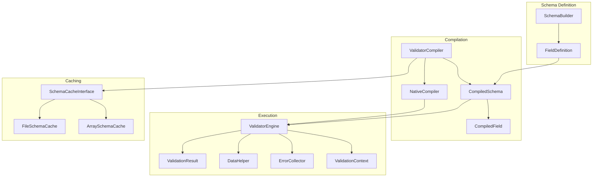
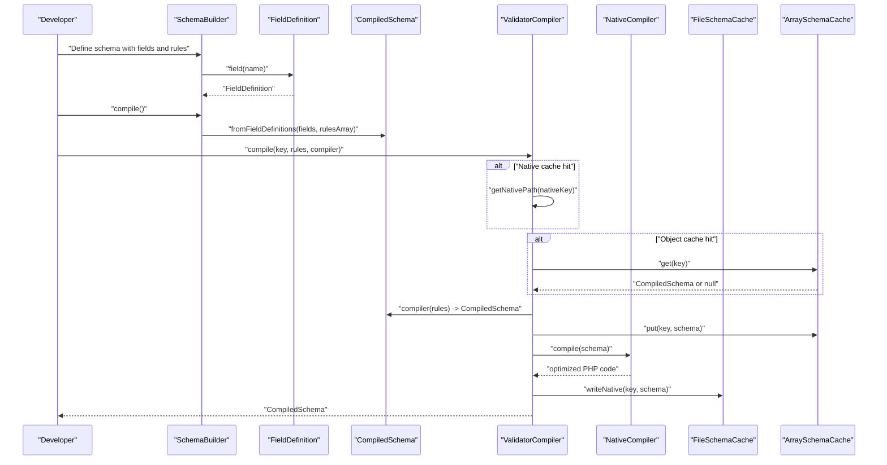
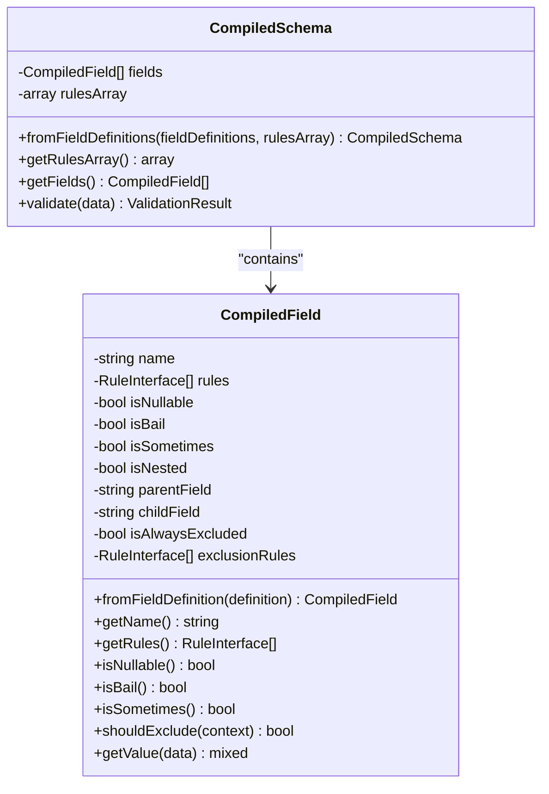
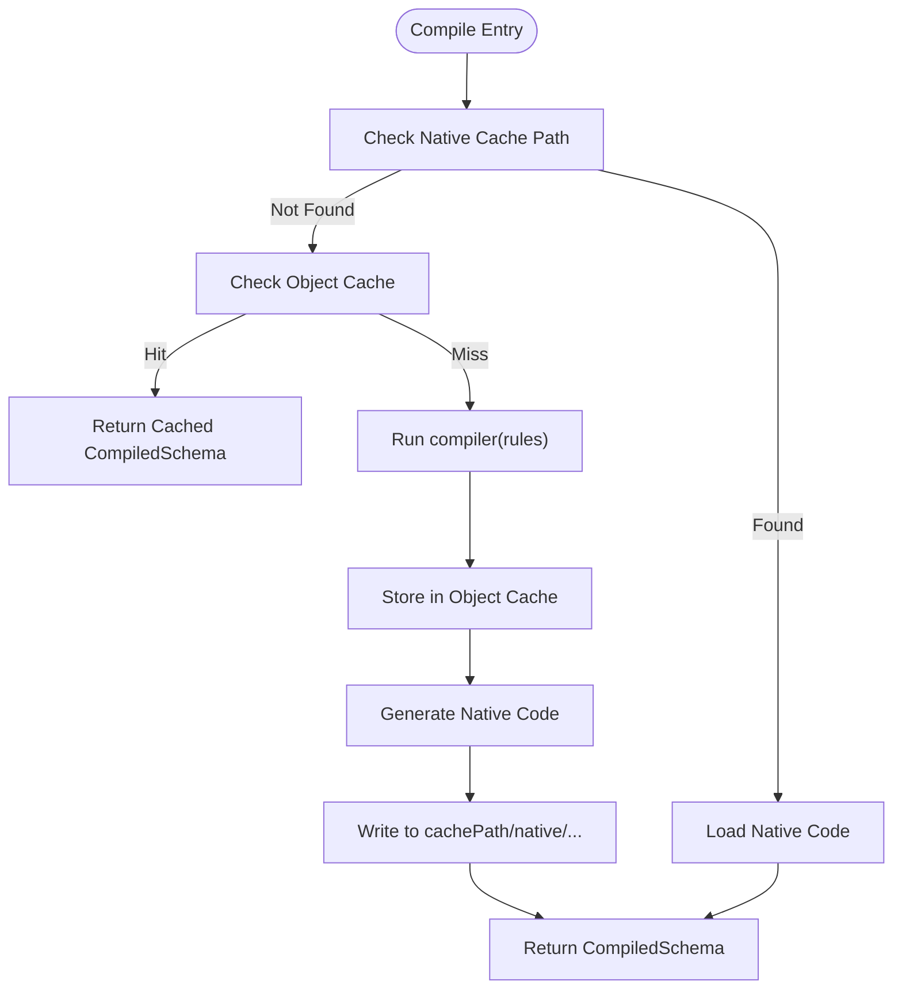
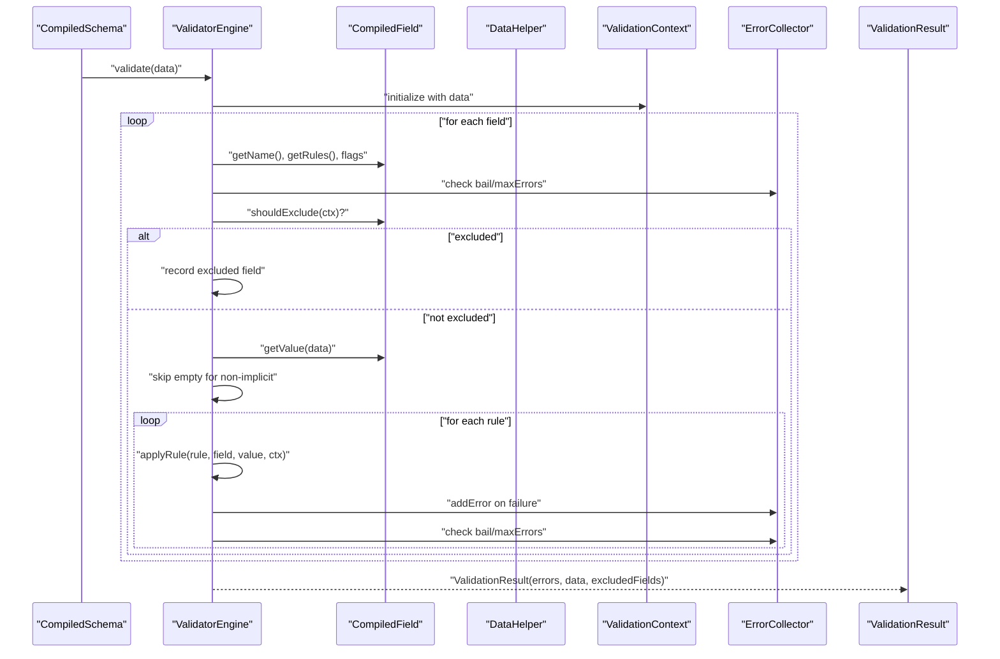
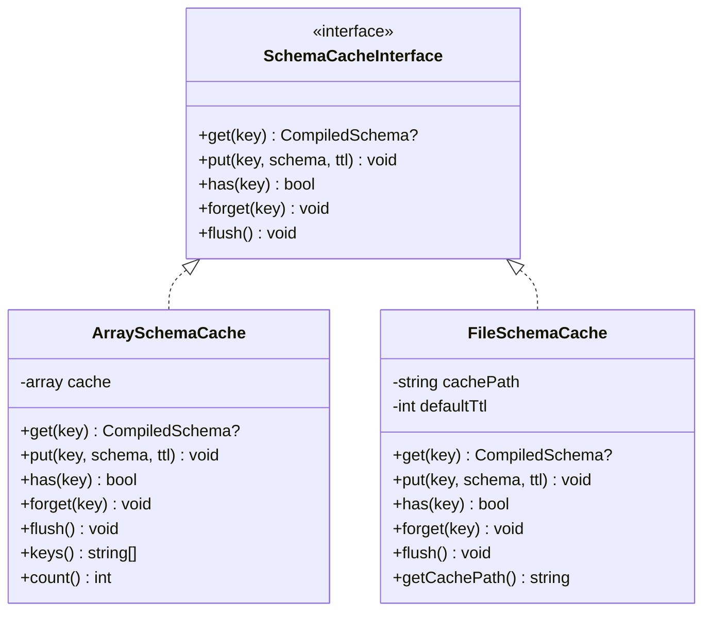
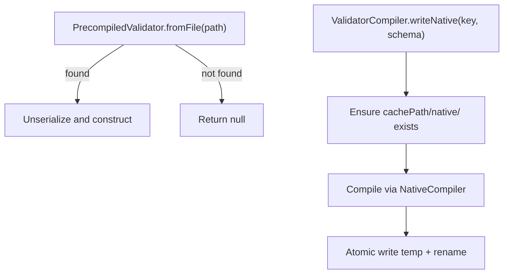
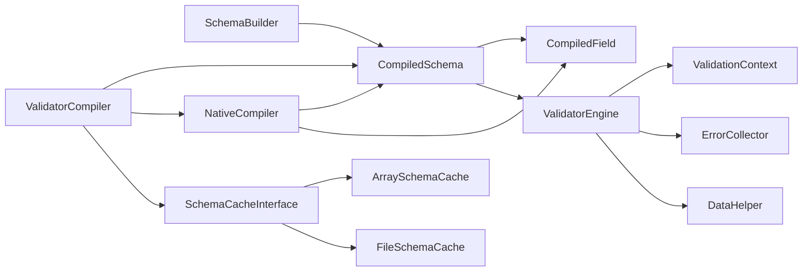

# Schema Compilation

<cite>
**Referenced Files in This Document**
- [SchemaBuilder.php](file://src/Schema/SchemaBuilder.php)
- [FieldDefinition.php](file://src/Schema/FieldDefinition.php)
- [CompiledSchema.php](file://src/Execution/CompiledSchema.php)
- [CompiledField.php](file://src/Execution/CompiledField.php)
- [ValidatorCompiler.php](file://src/Compilation/ValidatorCompiler.php)
- [NativeCompiler.php](file://src/Compilation/NativeCompiler.php)
- [PrecompiledValidator.php](file://src/Compilation/PrecompiledValidator.php)
- [ValidatorEngine.php](file://src/Execution/ValidatorEngine.php)
- [SchemaCacheInterface.php](file://src/Cache/SchemaCacheInterface.php)
- [ArraySchemaCache.php](file://src/Cache/ArraySchemaCache.php)
- [FileSchemaCache.php](file://src/Cache/FileSchemaCache.php)
- [DataHelper.php](file://src/Execution/DataHelper.php)
- [ValidationContext.php](file://src/Execution/ValidationContext.php)
- [ErrorCollector.php](file://src/Execution/ErrorCollector.php)
- [ValidationResult.php](file://src/Execution/ValidationResult.php)
</cite>

## Table of Contents
1. [Introduction](#introduction)
2. [Project Structure](#project-structure)
3. [Core Components](#core-components)
4. [Architecture Overview](#architecture-overview)
5. [Detailed Component Analysis](#detailed-component-analysis)
6. [Dependency Analysis](#dependency-analysis)
7. [Performance Considerations](#performance-considerations)
8. [Troubleshooting Guide](#troubleshooting-guide)
9. [Conclusion](#conclusion)

## Introduction
This document explains the schema compilation process in vi/validation. It describes how raw rule definitions are transformed into CompiledSchema objects, how ValidatorCompiler orchestrates compilation and caching, and how NativeCompiler generates high-performance validation code. It also covers the compile-once-validate-many paradigm, caching strategies, precompilation, and how compiled schemas eliminate runtime parsing overhead to optimize validation performance.

## Project Structure
The compilation pipeline spans several modules:
- Schema definition and construction via SchemaBuilder and FieldDefinition
- Compilation into CompiledSchema and CompiledField
- Compilation orchestration via ValidatorCompiler
- Native code generation via NativeCompiler
- Execution via ValidatorEngine and supporting execution helpers
- Caching via SchemaCacheInterface implementations

**Diagram sources**
- [SchemaBuilder.php](file://src/Schema/SchemaBuilder.php#L9-L35)
- [FieldDefinition.php](file://src/Schema/FieldDefinition.php#L9-L657)
- [CompiledSchema.php](file://src/Execution/CompiledSchema.php#L9-L67)
- [CompiledField.php](file://src/Execution/CompiledField.php#L10-L176)
- [ValidatorCompiler.php](file://src/Compilation/ValidatorCompiler.php#L10-L194)
- [NativeCompiler.php](file://src/Compilation/NativeCompiler.php#L17-L309)
- [ValidatorEngine.php](file://src/Execution/ValidatorEngine.php#L11-L176)
- [DataHelper.php](file://src/Execution/DataHelper.php#L10-L31)
- [ValidationContext.php](file://src/Execution/ValidationContext.php#L7-L97)
- [ErrorCollector.php](file://src/Execution/ErrorCollector.php#L7-L50)
- [ValidationResult.php](file://src/Execution/ValidationResult.php#L9-L141)
- [SchemaCacheInterface.php](file://src/Cache/SchemaCacheInterface.php#L9-L35)
- [ArraySchemaCache.php](file://src/Cache/ArraySchemaCache.php#L9-L74)
- [FileSchemaCache.php](file://src/Cache/FileSchemaCache.php#L9-L107)

**Section sources**
- [SchemaBuilder.php](file://src/Schema/SchemaBuilder.php#L9-L35)
- [FieldDefinition.php](file://src/Schema/FieldDefinition.php#L9-L657)
- [CompiledSchema.php](file://src/Execution/CompiledSchema.php#L9-L67)
- [CompiledField.php](file://src/Execution/CompiledField.php#L10-L176)
- [ValidatorCompiler.php](file://src/Compilation/ValidatorCompiler.php#L10-L194)
- [NativeCompiler.php](file://src/Compilation/NativeCompiler.php#L17-L309)
- [ValidatorEngine.php](file://src/Execution/ValidatorEngine.php#L11-L176)
- [DataHelper.php](file://src/Execution/DataHelper.php#L10-L31)
- [ValidationContext.php](file://src/Execution/ValidationContext.php#L7-L97)
- [ErrorCollector.php](file://src/Execution/ErrorCollector.php#L7-L50)
- [ValidationResult.php](file://src/Execution/ValidationResult.php#L9-L141)
- [SchemaCacheInterface.php](file://src/Cache/SchemaCacheInterface.php#L9-L35)
- [ArraySchemaCache.php](file://src/Cache/ArraySchemaCache.php#L9-L74)
- [FileSchemaCache.php](file://src/Cache/FileSchemaCache.php#L9-L107)

## Core Components
- SchemaBuilder: Fluent builder for field definitions and compilation entry point.
- FieldDefinition: Defines per-field rules and supports fluent rule methods.
- CompiledSchema: Immutable compiled representation of a schema with fields and rules array.
- CompiledField: Optimized per-field structure with deduplicated and reordered rules.
- ValidatorCompiler: Orchestrates compilation, caches CompiledSchema, and writes native code.
- NativeCompiler: Generates optimized PHP closures for validation execution.
- ValidatorEngine: Executes CompiledSchema against input data with context and error collection.
- Caches: In-memory and file-based caches for CompiledSchema objects.

**Section sources**
- [SchemaBuilder.php](file://src/Schema/SchemaBuilder.php#L9-L35)
- [FieldDefinition.php](file://src/Schema/FieldDefinition.php#L9-L657)
- [CompiledSchema.php](file://src/Execution/CompiledSchema.php#L9-L67)
- [CompiledField.php](file://src/Execution/CompiledField.php#L10-L176)
- [ValidatorCompiler.php](file://src/Compilation/ValidatorCompiler.php#L10-L194)
- [NativeCompiler.php](file://src/Compilation/NativeCompiler.php#L17-L309)
- [ValidatorEngine.php](file://src/Execution/ValidatorEngine.php#L11-L176)
- [SchemaCacheInterface.php](file://src/Cache/SchemaCacheInterface.php#L9-L35)
- [ArraySchemaCache.php](file://src/Cache/ArraySchemaCache.php#L9-L74)
- [FileSchemaCache.php](file://src/Cache/FileSchemaCache.php#L9-L107)

## Architecture Overview
The compilation lifecycle transforms raw rule arrays into a CompiledSchema, optionally cached and/or native-compiled, then executed by ValidatorEngine.

**Diagram sources**
- [SchemaBuilder.php](file://src/Schema/SchemaBuilder.php#L31-L34)
- [CompiledSchema.php](file://src/Execution/CompiledSchema.php#L27-L36)
- [ValidatorCompiler.php](file://src/Compilation/ValidatorCompiler.php#L33-L74)
- [NativeCompiler.php](file://src/Compilation/NativeCompiler.php#L24-L51)
- [ArraySchemaCache.php](file://src/Cache/ArraySchemaCache.php#L14-L29)
- [FileSchemaCache.php](file://src/Cache/FileSchemaCache.php#L24-L67)

## Detailed Component Analysis

### SchemaBuilder and FieldDefinition
- SchemaBuilder holds field definitions and rules array, exposing compile() to produce CompiledSchema.
- FieldDefinition exposes fluent methods for rules (required, nullable, string, integer, numeric, boolean, array, list, distinct, date, json, alpha, alphaNum, min/max, gt/gte/lt/lte, email, url, uuid, ip, regex, size, exists/unique, between, in/notIn, confirmed/same/different, file/image/mimes/maxFileSize/minFileSize/mimetypes/extensions/dimensions, activeUrl/alphaDash/macAddress/ulid/country/language/ascii/uppercase/enum/password/currentPassword/lowercase, dateFormat/dateEquals/multipleOf/digits/digitsBetween/startsWith/endsWith, notRegex/doesntStartWith/doesntEndWith/timezone/requiredArrayKeys/requiredIf/requiredIfAccepted/requiredUnless/requiredWith/requiredWithAll/requiredWithout/requiredWithoutAll/present/filled/prohibitedIf/prohibitedUnless/acceptedIf/declinedIf/prohibits/missing/missingIf/missingUnless/missingWith/missingWithAll/exclude/excludeIf/excludeUnless/excludeWith/excludeWithout, when, and bail/sometimes), and supports nested field composition.

```mermaid
classDiagram
class SchemaBuilder {
-array rulesArray
+field(name) FieldDefinition
+setRulesArray(rules) void
+compile() CompiledSchema
}
class FieldDefinition {
-string name
-RuleInterface[] rules
+required() self
+nullable() self
+bail() self
+sometimes() self
+string() self
+integer() self
+numeric() self
+boolean() self
+array() self
+list() self
+distinct() self
+date(format) self
+json() self
+alpha() self
+alphaNum() self
+min(value) self
+max(value) self
+gt(field) self
+gte(field) self
+lt(field) self
+lte(field) self
+email() self
+url() self
+uuid() self
+ip(version) self
+regex(pattern) self
+size(value) self
+exists(table, column, extraConstraints) self
+unique(table, column, ignoreId, idColumn, extraConstraints) self
+between(min, max) self
+in(values) self
+notIn(values) self
+confirmed() self
+same(field) self
+different(field) self
+file() self
+image() self
+mimes(types) self
+maxFileSize(kb) self
+minFileSize(kb) self
+mimetypes(types) self
+extensions(extensions) self
+dimensions(constraints) self
+activeUrl() self
+alphaDash() self
+macAddress() self
+ulid() self
+country() self
+language() self
+ascii() self
+uppercase() self
+enum(enumClass) self
+password(callback) self
+currentPassword() self
+lowercase() self
+dateFormat(format) self
+dateEquals(date) self
+multipleOf(value) self
+digits(value) self
+digitsBetween(min, max) self
+startsWith(needles) self
+endsWith(needles) self
+notRegex(pattern) self
+doesntStartWith(needles) self
+doesntEndWith(needles) self
+timezone() self
+requiredArrayKeys(keys) self
+requiredIf(otherField, values) self
+requiredIfAccepted(otherField) self
+requiredUnless(otherField, values) self
+requiredWith(others) self
+requiredWithAll(others) self
+requiredWithout(others) self
+requiredWithoutAll(others) self
+present() self
+filled() self
+prohibitedIf(otherField, values) self
+prohibitedUnless(otherField, values) self
+acceptedIf(otherField, value) self
+declinedIf(otherField, value) self
+prohibits(fields) self
+missing() self
+missingIf(otherField, value) self
+missingUnless(otherField, value) self
+missingWith(others) self
+missingWithAll(others) self
+exclude() self
+excludeIf(otherField, value) self
+excludeUnless(otherField, value) self
+excludeWith(otherField) self
+excludeWithout(otherField) self
+when(condition, onTrue, onFalse) self
+compile() CompiledSchema
}
SchemaBuilder --> FieldDefinition : "creates"
```

**Diagram sources**
- [SchemaBuilder.php](file://src/Schema/SchemaBuilder.php#L9-L35)
- [FieldDefinition.php](file://src/Schema/FieldDefinition.php#L9-L657)

**Section sources**
- [SchemaBuilder.php](file://src/Schema/SchemaBuilder.php#L9-L35)
- [FieldDefinition.php](file://src/Schema/FieldDefinition.php#L24-L657)

### CompiledSchema and CompiledField
- CompiledSchema encapsulates compiled fields and the original rules array, exposes validate(data) that delegates to ValidatorEngine.
- CompiledField deduplicates and reorders rules, marks special flags (nullable, bail, sometimes), tracks exclusion rules, and provides value extraction helpers.

**Diagram sources**
- [CompiledSchema.php](file://src/Execution/CompiledSchema.php#L9-L67)
- [CompiledField.php](file://src/Execution/CompiledField.php#L10-L176)

**Section sources**
- [CompiledSchema.php](file://src/Execution/CompiledSchema.php#L9-L67)
- [CompiledField.php](file://src/Execution/CompiledField.php#L10-L176)

### ValidatorCompiler and NativeCompiler
- ValidatorCompiler manages caching and native code generation:
  - Checks native cache path for pre-generated native code keyed by content and environment.
  - Checks object cache for CompiledSchema.
  - Compiles schema via provided compiler callback.
  - Stores CompiledSchema in object cache.
  - Writes native PHP code to cachePath/native/<key>.php when configured.
  - Supports legacy precompiled files and clearing caches.
- NativeCompiler generates a closure that validates data:
  - Iterates fields, inlines common rules to reduce method calls.
  - Handles sometimes, nullable, bail semantics.
  - Uses DataHelper for nested access when needed.
  - Emits structured error arrays and excluded fields.

**Diagram sources**
- [ValidatorCompiler.php](file://src/Compilation/ValidatorCompiler.php#L33-L74)
- [NativeCompiler.php](file://src/Compilation/NativeCompiler.php#L24-L51)

**Section sources**
- [ValidatorCompiler.php](file://src/Compilation/ValidatorCompiler.php#L10-L194)
- [NativeCompiler.php](file://src/Compilation/NativeCompiler.php#L17-L309)

### Execution Engine and Data Access
- ValidatorEngine executes CompiledSchema against data:
  - Initializes ErrorCollector and ValidationContext.
  - Applies exclusion rules, sometimes, bail, and implicit rule semantics.
  - Iterates fields and applies rules, collecting errors and stopping early if configured.
- DataHelper provides safe nested access for dot notation keys.
- ValidationContext supplies data access and error aggregation.
- ValidationResult formats errors and provides convenience methods.

**Diagram sources**
- [ValidatorEngine.php](file://src/Execution/ValidatorEngine.php#L33-L98)
- [CompiledField.php](file://src/Execution/CompiledField.php#L148-L175)
- [DataHelper.php](file://src/Execution/DataHelper.php#L15-L30)
- [ValidationContext.php](file://src/Execution/ValidationContext.php#L43-L96)
- [ErrorCollector.php](file://src/Execution/ErrorCollector.php#L17-L25)
- [ValidationResult.php](file://src/Execution/ValidationResult.php#L22-L32)

**Section sources**
- [ValidatorEngine.php](file://src/Execution/ValidatorEngine.php#L11-L176)
- [CompiledField.php](file://src/Execution/CompiledField.php#L10-L176)
- [DataHelper.php](file://src/Execution/DataHelper.php#L10-L31)
- [ValidationContext.php](file://src/Execution/ValidationContext.php#L7-L97)
- [ErrorCollector.php](file://src/Execution/ErrorCollector.php#L7-L50)
- [ValidationResult.php](file://src/Execution/ValidationResult.php#L9-L141)

### Caching Mechanisms
- SchemaCacheInterface defines get/put/has/forget/flush.
- ArraySchemaCache stores CompiledSchema in memory with optional TTL.
- FileSchemaCache persists CompiledSchema to files under cachePath with md5 key and .cache suffix, supports TTL and atomic writes.

**Diagram sources**
- [SchemaCacheInterface.php](file://src/Cache/SchemaCacheInterface.php#L9-L35)
- [ArraySchemaCache.php](file://src/Cache/ArraySchemaCache.php#L9-L74)
- [FileSchemaCache.php](file://src/Cache/FileSchemaCache.php#L9-L107)

**Section sources**
- [SchemaCacheInterface.php](file://src/Cache/SchemaCacheInterface.php#L9-L35)
- [ArraySchemaCache.php](file://src/Cache/ArraySchemaCache.php#L9-L74)
- [FileSchemaCache.php](file://src/Cache/FileSchemaCache.php#L9-L107)

### Precompiled Validator and Native Code Generation
- PrecompiledValidator wraps a CompiledSchema and identifier, supports loading from and saving to files.
- NativeCompiler.generateKey incorporates rule content, PHP version, and compiler version to produce a stable native key.
- ValidatorCompiler.writeNative writes optimized PHP code to cachePath/native/<key>.php using atomic file operations.

**Diagram sources**
- [PrecompiledValidator.php](file://src/Compilation/PrecompiledValidator.php#L56-L78)
- [ValidatorCompiler.php](file://src/Compilation/ValidatorCompiler.php#L79-L103)
- [NativeCompiler.php](file://src/Compilation/NativeCompiler.php#L56-L58)

**Section sources**
- [PrecompiledValidator.php](file://src/Compilation/PrecompiledValidator.php#L11-L97)
- [ValidatorCompiler.php](file://src/Compilation/ValidatorCompiler.php#L79-L103)
- [NativeCompiler.php](file://src/Compilation/NativeCompiler.php#L56-L58)

## Dependency Analysis
- SchemaBuilder depends on CompiledSchema for compilation.
- CompiledSchema depends on CompiledField and uses ValidatorEngine for execution.
- ValidatorCompiler depends on SchemaCacheInterface implementations and NativeCompiler.
- NativeCompiler depends on CompiledSchema and CompiledField, and uses reflection to inspect rule classes.
- ValidatorEngine depends on CompiledSchema, CompiledField, ValidationContext, ErrorCollector, and DataHelper.

**Diagram sources**
- [SchemaBuilder.php](file://src/Schema/SchemaBuilder.php#L31-L34)
- [CompiledSchema.php](file://src/Execution/CompiledSchema.php#L27-L36)
- [CompiledField.php](file://src/Execution/CompiledField.php#L115-L118)
- [ValidatorEngine.php](file://src/Execution/ValidatorEngine.php#L33-L98)
- [ValidatorCompiler.php](file://src/Compilation/ValidatorCompiler.php#L33-L74)
- [NativeCompiler.php](file://src/Compilation/NativeCompiler.php#L24-L51)
- [SchemaCacheInterface.php](file://src/Cache/SchemaCacheInterface.php#L9-L35)
- [ArraySchemaCache.php](file://src/Cache/ArraySchemaCache.php#L9-L74)
- [FileSchemaCache.php](file://src/Cache/FileSchemaCache.php#L9-L107)

**Section sources**
- [SchemaBuilder.php](file://src/Schema/SchemaBuilder.php#L9-L35)
- [CompiledSchema.php](file://src/Execution/CompiledSchema.php#L9-L67)
- [CompiledField.php](file://src/Execution/CompiledField.php#L10-L176)
- [ValidatorEngine.php](file://src/Execution/ValidatorEngine.php#L11-L176)
- [ValidatorCompiler.php](file://src/Compilation/ValidatorCompiler.php#L10-L194)
- [NativeCompiler.php](file://src/Compilation/NativeCompiler.php#L17-L309)
- [SchemaCacheInterface.php](file://src/Cache/SchemaCacheInterface.php#L9-L35)
- [ArraySchemaCache.php](file://src/Cache/ArraySchemaCache.php#L9-L74)
- [FileSchemaCache.php](file://src/Cache/FileSchemaCache.php#L9-L107)

## Performance Considerations
- Compile-once-validate-many: CompiledSchema is reused across validations, avoiding repeated parsing and rule instantiation.
- Native code generation: NativeCompiler emits optimized PHP closures that inline common checks, reducing function call overhead and minimizing branching.
- Caching: Object cache prevents recomputation; file cache enables persistence across processes and warm starts.
- Early termination: bail and fail-fast reduce unnecessary work; maxErrors bounds memory and CPU.
- Nested access optimization: CompiledField and DataHelper streamline deep key retrieval.

[No sources needed since this section provides general guidance]

## Troubleshooting Guide
- Schema does not compile:
  - Verify rules are attached via FieldDefinition methods and SchemaBuilder.compile() is called.
  - Ensure the compiler callback returns a CompiledSchema.
- Native code not generated:
  - Confirm cachePath is set and writable; check that writeNative was invoked.
  - Validate that the native key differs by environment/version to avoid stale cache.
- Validation returns unexpected results:
  - Check ValidatorEngine settings (failFast, maxErrors).
  - Inspect CompiledField flags (nullable, bail, sometimes) and exclusion rules.
- Cache issues:
  - For ArraySchemaCache, confirm TTL logic and flush when needed.
  - For FileSchemaCache, ensure .cache files exist and are readable/unlocked.

**Section sources**
- [ValidatorCompiler.php](file://src/Compilation/ValidatorCompiler.php#L79-L103)
- [ValidatorEngine.php](file://src/Execution/ValidatorEngine.php#L100-L123)
- [CompiledField.php](file://src/Execution/CompiledField.php#L133-L161)
- [ArraySchemaCache.php](file://src/Cache/ArraySchemaCache.php#L23-L54)
- [FileSchemaCache.php](file://src/Cache/FileSchemaCache.php#L57-L93)

## Conclusion
vi/validation’s schema compilation pipeline converts declarative rule definitions into efficient CompiledSchema objects, caches them, and optionally generates native PHP code for high-throughput validation. The compile-once-validate-many model, combined with native code generation and robust caching, delivers significant performance improvements by eliminating runtime parsing and minimizing dynamic dispatch during validation.