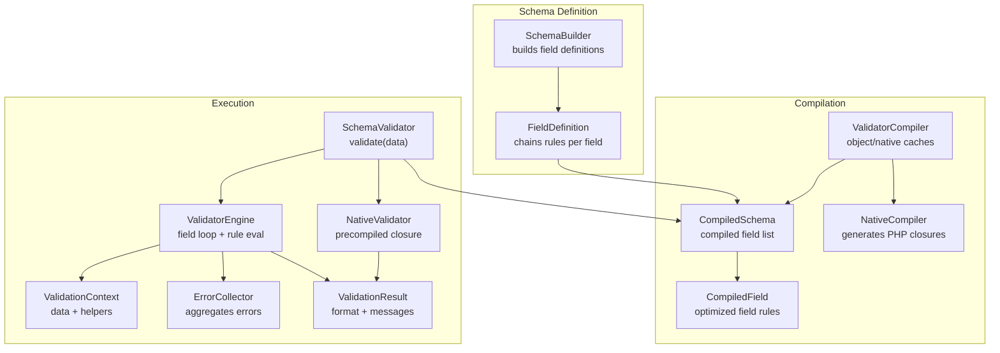
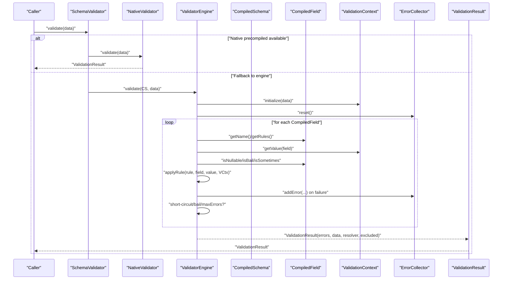
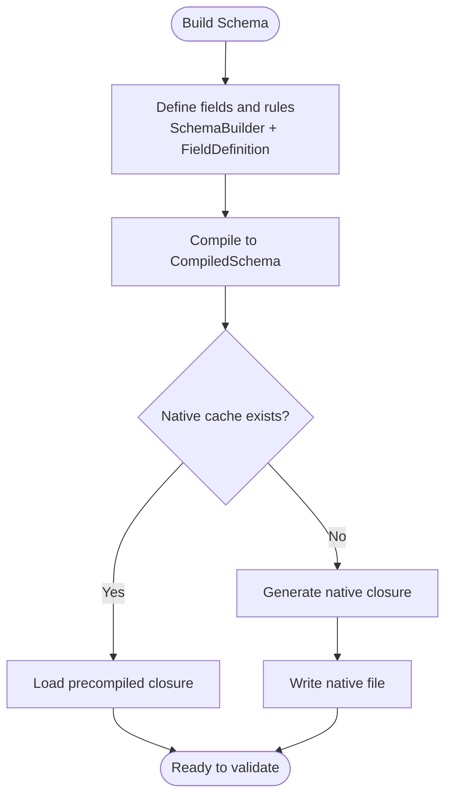
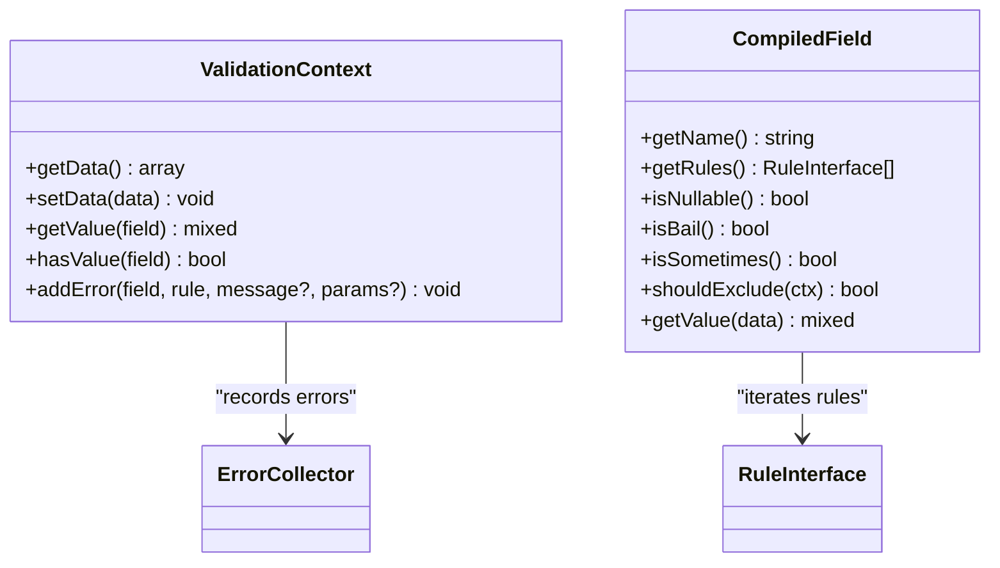
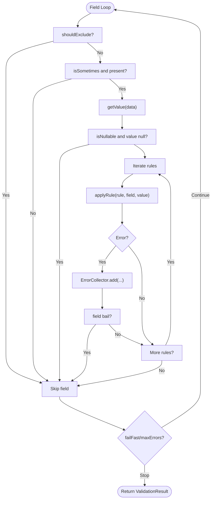
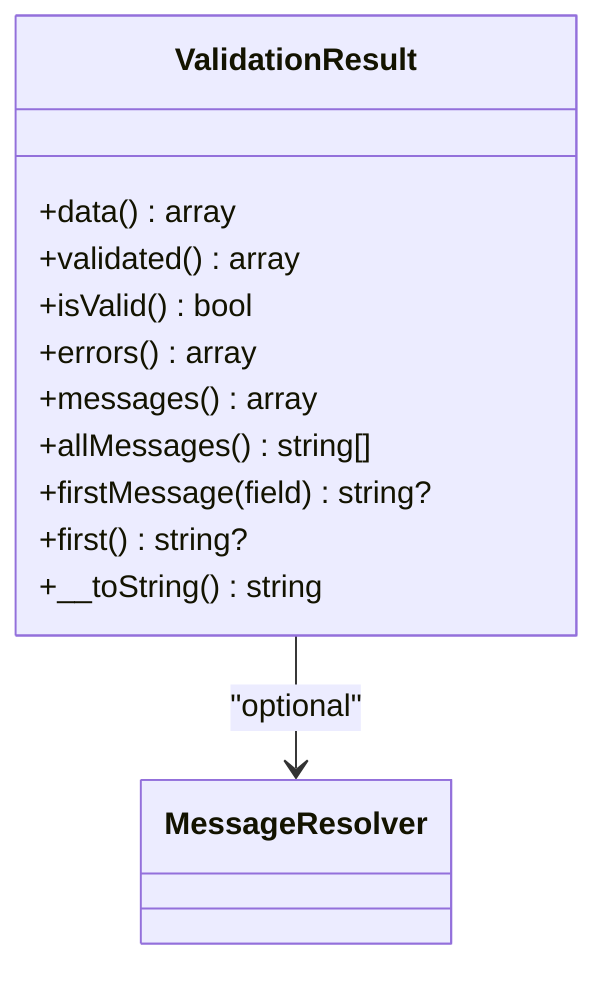
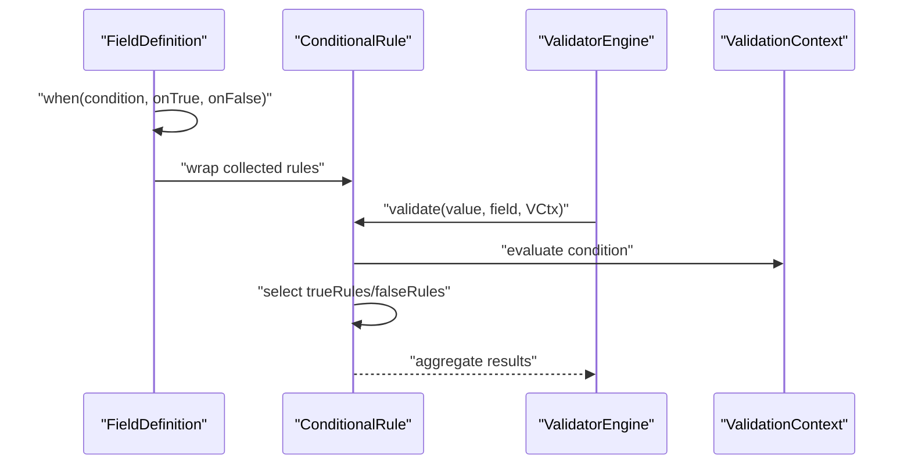
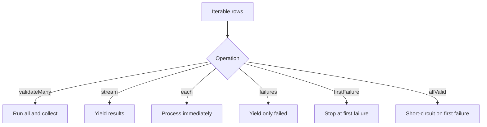
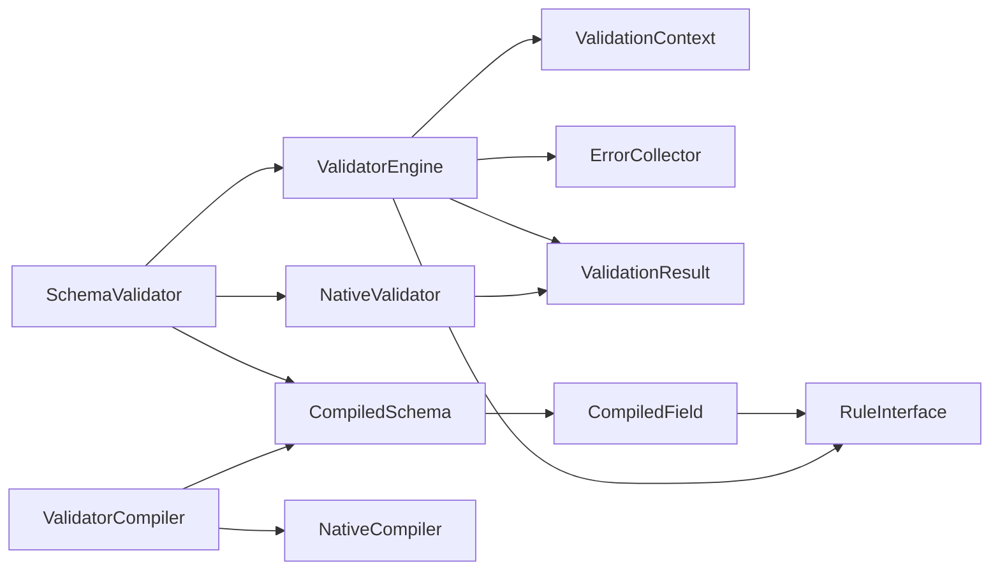

# Validation Lifecycle

<cite>
**Referenced Files in This Document**
- [src/Validator.php](file://src/Validator.php)
- [src/SchemaValidator.php](file://src/SchemaValidator.php)
- [src/Schema/SchemaBuilder.php](file://src/Schema/SchemaBuilder.php)
- [src/Schema/FieldDefinition.php](file://src/Schema/FieldDefinition.php)
- [src/Execution/CompiledSchema.php](file://src/Execution/CompiledSchema.php)
- [src/Execution/CompiledField.php](file://src/Execution/CompiledField.php)
- [src/Execution/ValidatorEngine.php](file://src/Execution/ValidatorEngine.php)
- [src/Execution/ValidationContext.php](file://src/Execution/ValidationContext.php)
- [src/Execution/ErrorCollector.php](file://src/Execution/ErrorCollector.php)
- [src/Execution/ValidationResult.php](file://src/Execution/ValidationResult.php)
- [src/Execution/NativeValidator.php](file://src/Execution/NativeValidator.php)
- [src/Compilation/ValidatorCompiler.php](file://src/Compilation/ValidatorCompiler.php)
- [src/Compilation/NativeCompiler.php](file://src/Compilation/NativeCompiler.php)
- [src/Rules/RuleInterface.php](file://src/Rules/RuleInterface.php)
- [src/Rules/RequiredRule.php](file://src/Rules/RequiredRule.php)
- [src/Rules/BailRule.php](file://src/Rules/BailRule.php)
- [src/Rules/NullableRule.php](file://src/Rules/NullableRule.php)
- [src/Rules/SometimesRule.php](file://src/Rules/SometimesRule.php)
</cite>

## Table of Contents
1. [Introduction](#introduction)
2. [Project Structure](#project-structure)
3. [Core Components](#core-components)
4. [Architecture Overview](#architecture-overview)
5. [Detailed Component Analysis](#detailed-component-analysis)
6. [Dependency Analysis](#dependency-analysis)
7. [Performance Considerations](#performance-considerations)
8. [Troubleshooting Guide](#troubleshooting-guide)
9. [Conclusion](#conclusion)

## Introduction
This document explains the complete validation lifecycle from data input to result processing. It covers how data flows through the system, including schema building, compilation, rule execution, error collection, and result formatting. It also details the relationships among SchemaValidator, ValidatorEngine, and ValidationResult, along with execution context management, short-circuit evaluation, early termination strategies, nested field handling, conditional rules, and performance optimizations.

## Project Structure
The validation system is organized around a fluent schema builder, compiled execution units, and a high-performance engine with optional native code generation.

**Diagram sources**
- [src/Schema/SchemaBuilder.php](file://src/Schema/SchemaBuilder.php#L9-L35)
- [src/Schema/FieldDefinition.php](file://src/Schema/FieldDefinition.php#L9-L657)
- [src/Execution/CompiledSchema.php](file://src/Execution/CompiledSchema.php#L9-L67)
- [src/Execution/CompiledField.php](file://src/Execution/CompiledField.php#L10-L176)
- [src/Compilation/ValidatorCompiler.php](file://src/Compilation/ValidatorCompiler.php#L10-L194)
- [src/Compilation/NativeCompiler.php](file://src/Compilation/NativeCompiler.php#L17-L309)
- [src/SchemaValidator.php](file://src/SchemaValidator.php#L13-L73)
- [src/Execution/ValidatorEngine.php](file://src/Execution/ValidatorEngine.php#L11-L176)
- [src/Execution/ValidationContext.php](file://src/Execution/ValidationContext.php#L7-L97)
- [src/Execution/ErrorCollector.php](file://src/Execution/ErrorCollector.php#L7-L50)
- [src/Execution/ValidationResult.php](file://src/Execution/ValidationResult.php#L9-L141)
- [src/Execution/NativeValidator.php](file://src/Execution/NativeValidator.php#L12-L38)

**Section sources**
- [src/Validator.php](file://src/Validator.php#L9-L15)
- [src/Schema/SchemaBuilder.php](file://src/Schema/SchemaBuilder.php#L9-L35)
- [src/Schema/FieldDefinition.php](file://src/Schema/FieldDefinition.php#L9-L657)
- [src/Execution/CompiledSchema.php](file://src/Execution/CompiledSchema.php#L9-L67)
- [src/Execution/CompiledField.php](file://src/Execution/CompiledField.php#L10-L176)
- [src/Compilation/ValidatorCompiler.php](file://src/Compilation/ValidatorCompiler.php#L10-L194)
- [src/Compilation/NativeCompiler.php](file://src/Compilation/NativeCompiler.php#L17-L309)
- [src/SchemaValidator.php](file://src/SchemaValidator.php#L13-L73)
- [src/Execution/ValidatorEngine.php](file://src/Execution/ValidatorEngine.php#L11-L176)
- [src/Execution/ValidationContext.php](file://src/Execution/ValidationContext.php#L7-L97)
- [src/Execution/ErrorCollector.php](file://src/Execution/ErrorCollector.php#L7-L50)
- [src/Execution/ValidationResult.php](file://src/Execution/ValidationResult.php#L9-L141)
- [src/Execution/NativeValidator.php](file://src/Execution/NativeValidator.php#L12-L38)

## Core Components
- SchemaValidator orchestrates validation, selecting between native precompiled execution and the runtime engine. It supports batch/streaming APIs and early termination strategies.
- ValidatorEngine performs the iterative field traversal, applies rules with short-circuit semantics, and manages fail-fast and error caps.
- CompiledSchema and CompiledField represent the compiled schema model, enabling efficient iteration and rule ordering.
- ValidationContext exposes data accessors and helpers for nested fields and shared services.
- ErrorCollector aggregates structured errors; ValidationResult formats them into user-facing messages.
- NativeValidator executes a precompiled PHP closure for maximum throughput.
- ValidatorCompiler coordinates object caching, legacy precompilation, and native code generation.
- NativeCompiler emits optimized PHP closures that inline common rules and use fast control flow.

**Section sources**
- [src/SchemaValidator.php](file://src/SchemaValidator.php#L13-L73)
- [src/Execution/ValidatorEngine.php](file://src/Execution/ValidatorEngine.php#L11-L176)
- [src/Execution/CompiledSchema.php](file://src/Execution/CompiledSchema.php#L9-L67)
- [src/Execution/CompiledField.php](file://src/Execution/CompiledField.php#L10-L176)
- [src/Execution/ValidationContext.php](file://src/Execution/ValidationContext.php#L7-L97)
- [src/Execution/ErrorCollector.php](file://src/Execution/ErrorCollector.php#L7-L50)
- [src/Execution/ValidationResult.php](file://src/Execution/ValidationResult.php#L9-L141)
- [src/Execution/NativeValidator.php](file://src/Execution/NativeValidator.php#L12-L38)
- [src/Compilation/ValidatorCompiler.php](file://src/Compilation/ValidatorCompiler.php#L10-L194)
- [src/Compilation/NativeCompiler.php](file://src/Compilation/NativeCompiler.php#L17-L309)

## Architecture Overview
The validation lifecycle follows a predictable flow: schema definition → compilation → validation → result formatting.

**Diagram sources**
- [src/SchemaValidator.php](file://src/SchemaValidator.php#L54-L73)
- [src/Execution/NativeValidator.php](file://src/Execution/NativeValidator.php#L27-L37)
- [src/Execution/ValidatorEngine.php](file://src/Execution/ValidatorEngine.php#L33-L97)
- [src/Execution/ValidationContext.php](file://src/Execution/ValidationContext.php#L17-L96)
- [src/Execution/ErrorCollector.php](file://src/Execution/ErrorCollector.php#L17-L25)
- [src/Execution/ValidationResult.php](file://src/Execution/ValidationResult.php#L22-L32)

## Detailed Component Analysis

### Schema Loading and Compilation
- Fluent schema definition via SchemaBuilder and FieldDefinition accumulates rules per field.
- CompiledSchema is produced from field definitions and carries the ordered rules array.
- ValidatorCompiler manages object caching and writes native PHP closures to disk for reuse.
- NativeCompiler generates a high-performance closure that inlines common rules and uses fast control flow.

**Diagram sources**
- [src/Schema/SchemaBuilder.php](file://src/Schema/SchemaBuilder.php#L31-L34)
- [src/Schema/FieldDefinition.php](file://src/Schema/FieldDefinition.php#L648-L651)
- [src/Execution/CompiledSchema.php](file://src/Execution/CompiledSchema.php#L27-L36)
- [src/Compilation/ValidatorCompiler.php](file://src/Compilation/ValidatorCompiler.php#L33-L74)
- [src/Compilation/NativeCompiler.php](file://src/Compilation/NativeCompiler.php#L24-L51)

**Section sources**
- [src/Schema/SchemaBuilder.php](file://src/Schema/SchemaBuilder.php#L9-L35)
- [src/Schema/FieldDefinition.php](file://src/Schema/FieldDefinition.php#L9-L657)
- [src/Execution/CompiledSchema.php](file://src/Execution/CompiledSchema.php#L9-L67)
- [src/Compilation/ValidatorCompiler.php](file://src/Compilation/ValidatorCompiler.php#L10-L194)
- [src/Compilation/NativeCompiler.php](file://src/Compilation/NativeCompiler.php#L17-L309)

### Execution Context Management and Nested Fields
- ValidationContext encapsulates input data and exposes helpers for nested field access (dot notation) up to two levels.
- CompiledField detects nested names and computes parent/child segments for efficient retrieval.
- isSometimes and isNullable flags influence rule application and short-circuiting.

**Diagram sources**
- [src/Execution/ValidationContext.php](file://src/Execution/ValidationContext.php#L7-L97)
- [src/Execution/CompiledField.php](file://src/Execution/CompiledField.php#L10-L176)
- [src/Execution/ErrorCollector.php](file://src/Execution/ErrorCollector.php#L7-L50)

**Section sources**
- [src/Execution/ValidationContext.php](file://src/Execution/ValidationContext.php#L43-L73)
- [src/Execution/CompiledField.php](file://src/Execution/CompiledField.php#L163-L175)

### Rule Execution, Short-Circuit, and Early Termination
- ValidatorEngine iterates CompiledField instances, honoring bail, sometimes, and nullable semantics.
- Implicit rules (e.g., Required) are exempt from “empty” short-circuiting; non-implicit rules skip when values are null/empty.
- Fail-fast mode stops further field processing upon first error; maxErrors cap halts when reached.
- applyRule delegates to RuleInterface.validate and records structured errors.

**Diagram sources**
- [src/Execution/ValidatorEngine.php](file://src/Execution/ValidatorEngine.php#L50-L97)
- [src/Execution/ValidatorEngine.php](file://src/Execution/ValidatorEngine.php#L148-L159)
- [src/Execution/ValidatorEngine.php](file://src/Execution/ValidatorEngine.php#L164-L175)
- [src/Execution/ErrorCollector.php](file://src/Execution/ErrorCollector.php#L17-L25)

**Section sources**
- [src/Execution/ValidatorEngine.php](file://src/Execution/ValidatorEngine.php#L33-L97)
- [src/Execution/ValidatorEngine.php](file://src/Execution/ValidatorEngine.php#L127-L159)
- [src/Rules/RuleInterface.php](file://src/Rules/RuleInterface.php#L9-L15)
- [src/Rules/RequiredRule.php](file://src/Rules/RequiredRule.php#L10-L28)
- [src/Rules/BailRule.php](file://src/Rules/BailRule.php#L12-L19)
- [src/Rules/NullableRule.php](file://src/Rules/NullableRule.php#L10-L17)
- [src/Rules/SometimesRule.php](file://src/Rules/SometimesRule.php#L12-L19)

### Result Formatting and Message Resolution
- ValidationResult normalizes raw errors into grouped-by-field arrays and supports message resolution via MessageResolver.
- It provides convenience methods to access validated data (excluding excluded fields), flattened messages, and first errors.

**Diagram sources**
- [src/Execution/ValidationResult.php](file://src/Execution/ValidationResult.php#L9-L141)

**Section sources**
- [src/Execution/ValidationResult.php](file://src/Execution/ValidationResult.php#L22-L96)

### Conditional Rules and Nested Scenarios
- FieldDefinition.when(condition, onTrue, onFalse) builds a ConditionalRule that selects rules dynamically based on a condition evaluated against ValidationContext.
- CompiledField.getValue supports dot-notation for nested fields (up to two levels), enabling conditional checks across parent-child relationships.

**Diagram sources**
- [src/Schema/FieldDefinition.php](file://src/Schema/FieldDefinition.php#L604-L622)
- [src/Execution/CompiledField.php](file://src/Execution/CompiledField.php#L163-L175)
- [src/Execution/ValidationContext.php](file://src/Execution/ValidationContext.php#L43-L73)

**Section sources**
- [src/Schema/FieldDefinition.php](file://src/Schema/FieldDefinition.php#L604-L622)
- [src/Execution/CompiledField.php](file://src/Execution/CompiledField.php#L163-L175)
- [src/Execution/ValidationContext.php](file://src/Execution/ValidationContext.php#L43-L73)

### Batch, Streaming, and Fail-Fast Strategies
- SchemaValidator offers validateMany, stream, each, failures, firstFailure, and allValid to tailor memory usage and termination behavior for large datasets.

**Diagram sources**
- [src/SchemaValidator.php](file://src/SchemaValidator.php#L84-L203)

**Section sources**
- [src/SchemaValidator.php](file://src/SchemaValidator.php#L84-L203)

## Dependency Analysis
The following diagram highlights key dependencies among core components.

**Diagram sources**
- [src/SchemaValidator.php](file://src/SchemaValidator.php#L13-L73)
- [src/Execution/ValidatorEngine.php](file://src/Execution/ValidatorEngine.php#L11-L176)
- [src/Execution/ValidationContext.php](file://src/Execution/ValidationContext.php#L7-L97)
- [src/Execution/ErrorCollector.php](file://src/Execution/ErrorCollector.php#L7-L50)
- [src/Execution/ValidationResult.php](file://src/Execution/ValidationResult.php#L9-L141)
- [src/Execution/CompiledSchema.php](file://src/Execution/CompiledSchema.php#L9-L67)
- [src/Execution/CompiledField.php](file://src/Execution/CompiledField.php#L10-L176)
- [src/Compilation/ValidatorCompiler.php](file://src/Compilation/ValidatorCompiler.php#L10-L194)
- [src/Compilation/NativeCompiler.php](file://src/Compilation/NativeCompiler.php#L17-L309)
- [src/Rules/RuleInterface.php](file://src/Rules/RuleInterface.php#L9-L15)

**Section sources**
- [src/SchemaValidator.php](file://src/SchemaValidator.php#L13-L73)
- [src/Execution/ValidatorEngine.php](file://src/Execution/ValidatorEngine.php#L11-L176)
- [src/Execution/CompiledSchema.php](file://src/Execution/CompiledSchema.php#L9-L67)
- [src/Execution/CompiledField.php](file://src/Execution/CompiledField.php#L10-L176)
- [src/Compilation/ValidatorCompiler.php](file://src/Compilation/ValidatorCompiler.php#L10-L194)
- [src/Compilation/NativeCompiler.php](file://src/Compilation/NativeCompiler.php#L17-L309)
- [src/Rules/RuleInterface.php](file://src/Rules/RuleInterface.php#L9-L15)

## Performance Considerations
- Native precompiled validators: SchemaValidator attempts to load a precompiled closure keyed by rule content and environment; if present, validation bypasses the engine entirely.
- NativeCompiler inlines common rules and uses fast control flow (e.g., bail via goto-style labels) to reduce overhead.
- ValidatorEngine short-circuits on bail, fail-fast, and maxErrors to limit work.
- CompiledField reorders rules to place bail, required, and nullable markers early, minimizing redundant checks.
- Batch/streaming APIs enable memory-efficient processing for large datasets.

[No sources needed since this section provides general guidance]

## Troubleshooting Guide
- No errors recorded: Verify that non-implicit rules are not being skipped due to empty values; implicit rules handle empty values differently.
- Unexpected early termination: Check for bail markers and fail-fast configuration; confirm maxErrors thresholds.
- Excluded fields missing from validated payload: ValidationResult.validated excludes fields marked for exclusion.
- Nested field access issues: ValidationContext.getValue supports dot notation up to two levels; deeper nesting requires custom logic or flattening.

**Section sources**
- [src/Execution/ValidatorEngine.php](file://src/Execution/ValidatorEngine.php#L76-L94)
- [src/Execution/ValidatorEngine.php](file://src/Execution/ValidatorEngine.php#L148-L159)
- [src/Execution/ValidationResult.php](file://src/Execution/ValidationResult.php#L45-L56)
- [src/Execution/ValidationContext.php](file://src/Execution/ValidationContext.php#L43-L73)

## Conclusion
The validation lifecycle integrates a fluent schema DSL, robust compilation, and a high-performance engine with native code generation. It balances flexibility (conditional rules, nested fields) with strong performance characteristics (short-circuiting, early termination, and optimized execution paths). By leveraging SchemaValidator’s batch/streaming APIs and understanding the roles of ValidatorEngine, CompiledSchema, and ValidationResult, developers can build efficient and maintainable validation pipelines.