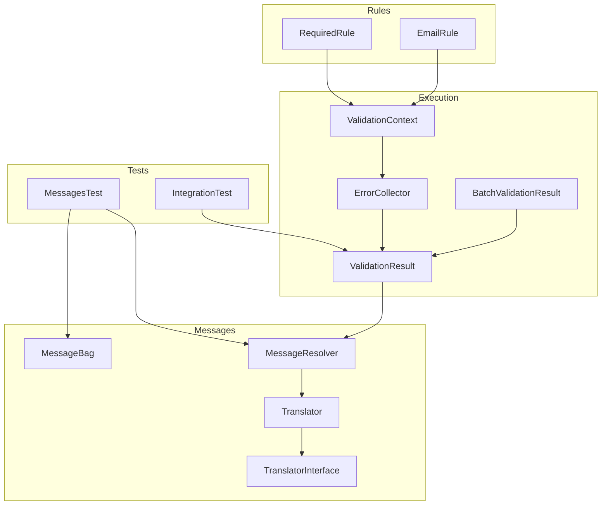
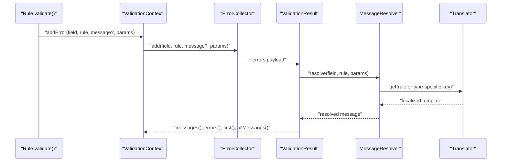
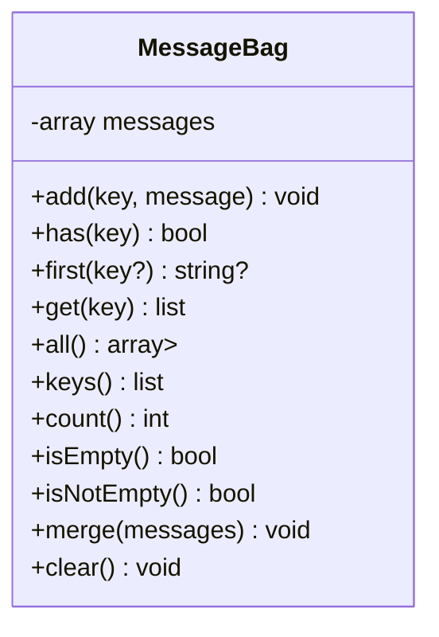
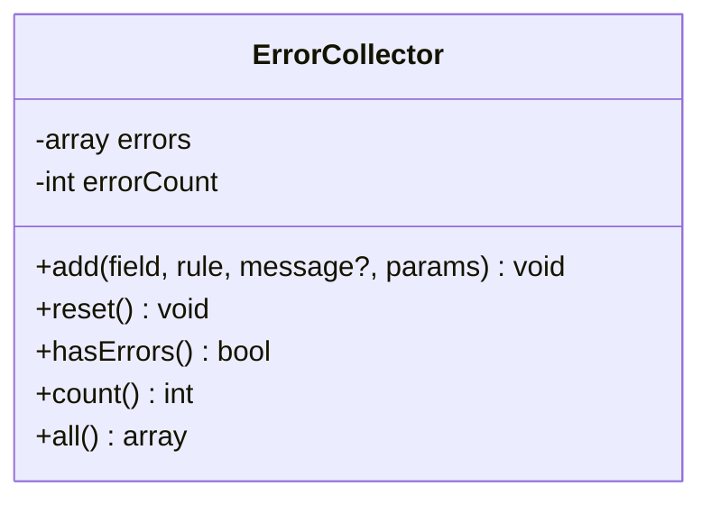
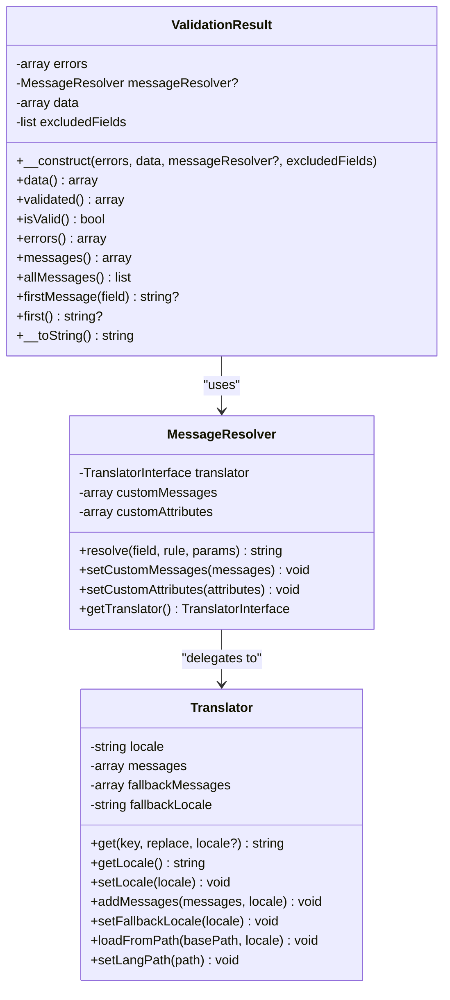
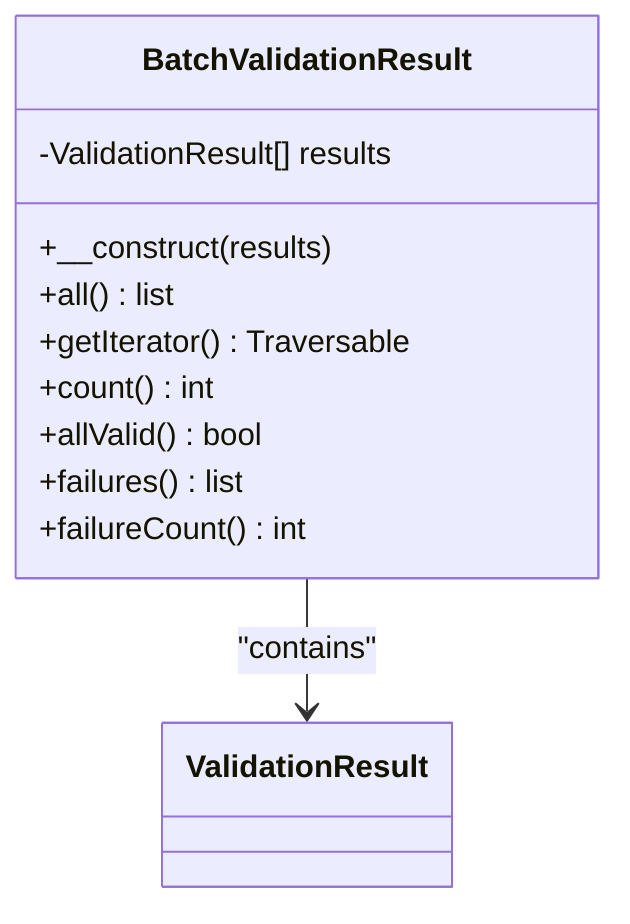
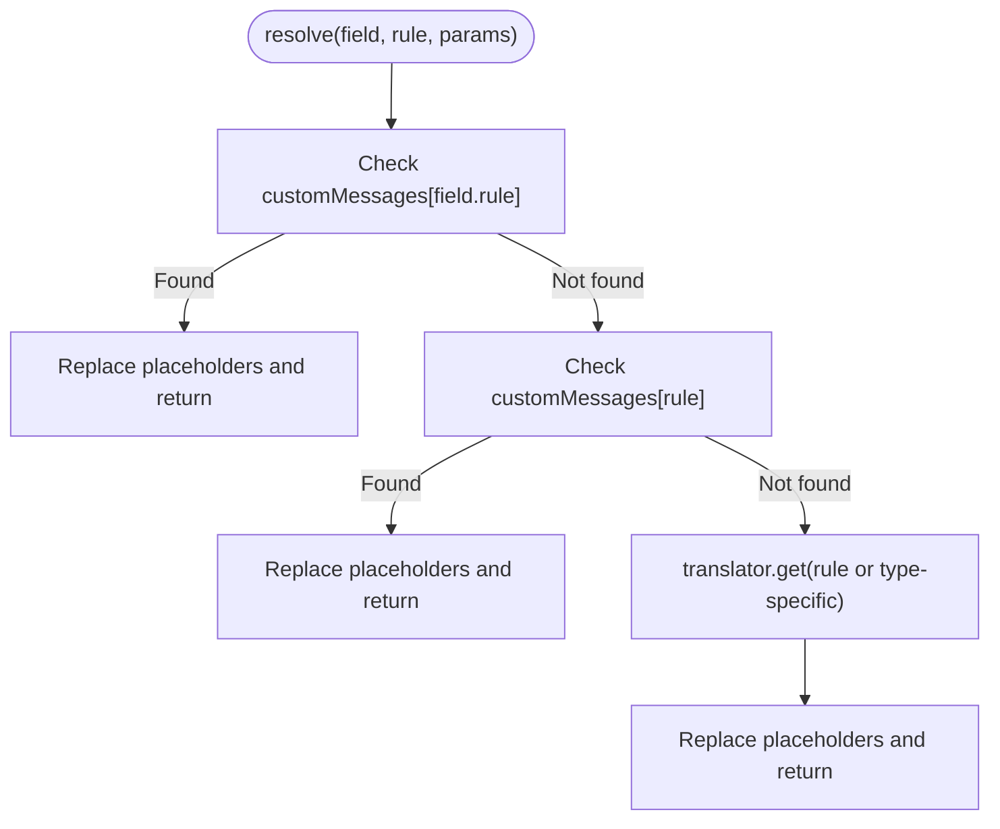
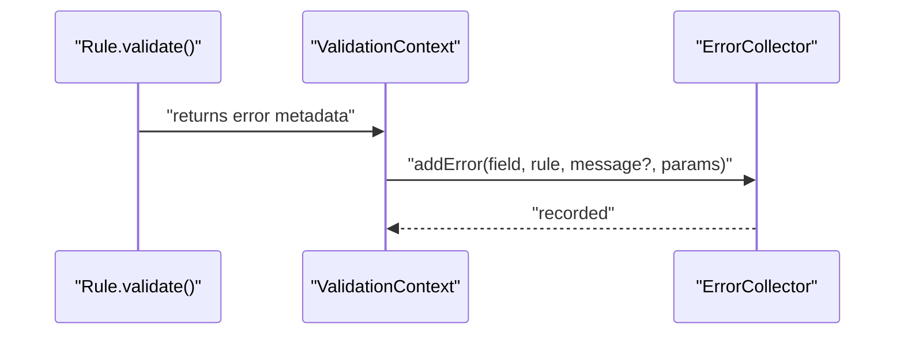
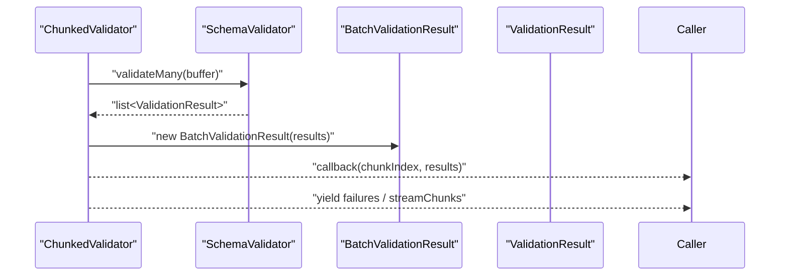
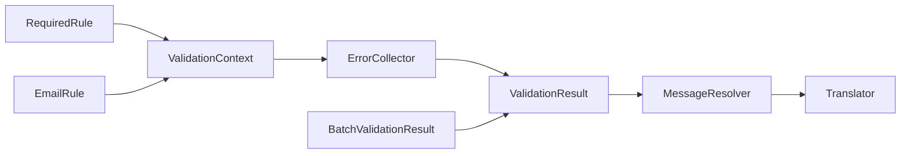

# Error Collection and Aggregation

<cite>
**Referenced Files in This Document**
- [MessageBag.php](file://src/Messages/MessageBag.php)
- [ErrorCollector.php](file://src/Execution/ErrorCollector.php)
- [ValidationResult.php](file://src/Execution/ValidationResult.php)
- [BatchValidationResult.php](file://src/Execution/BatchValidationResult.php)
- [MessageResolver.php](file://src/Messages/MessageResolver.php)
- [Translator.php](file://src/Messages/Translator.php)
- [TranslatorInterface.php](file://src/Messages/TranslatorInterface.php)
- [ValidationContext.php](file://src/Execution/ValidationContext.php)
- [ChunkedValidator.php](file://src/Execution/ChunkedValidator.php)
- [RequiredRule.php](file://src/Rules/RequiredRule.php)
- [EmailRule.php](file://src/Rules/EmailRule.php)
- [MessagesTest.php](file://tests/Unit/MessagesTest.php)
- [IntegrationTest.php](file://tests/Unit/IntegrationTest.php)
- [README.md](file://README.md)
</cite>

## Table of Contents
1. [Introduction](#introduction)
2. [Project Structure](#project-structure)
3. [Core Components](#core-components)
4. [Architecture Overview](#architecture-overview)
5. [Detailed Component Analysis](#detailed-component-analysis)
6. [Dependency Analysis](#dependency-analysis)
7. [Performance Considerations](#performance-considerations)
8. [Troubleshooting Guide](#troubleshooting-guide)
9. [Conclusion](#conclusion)
10. [Appendices](#appendices)

## Introduction
This document explains the error collection and aggregation mechanisms in the validation library. It focuses on how validation errors are captured, organized, transformed, and exposed for different output formats. The primary components covered are:
- MessageBag: a simple, field-keyed container for raw error messages
- ErrorCollector: a structured collector for rule-level validation errors with parameters and optional pre-resolved messages
- ValidationResult: a result wrapper that exposes both raw errors and formatted messages, with helpers for first errors and flattened lists
- BatchValidationResult: a container for aggregating multiple ValidationResult instances with streaming-friendly operations
- MessageResolver and Translator: resolvers and translators for generating localized, parameterized error messages
- ValidationContext: the integration point that records errors during rule evaluation
- ChunkedValidator: a streaming aggregator for batch validation scenarios

## Project Structure
The error handling stack spans several modules:
- Execution: ErrorCollector, ValidationResult, BatchValidationResult, ValidationContext
- Messages: MessageBag, MessageResolver, Translator, TranslatorInterface
- Rules: individual rule implementations that return structured error metadata
- Tests: unit tests validating behavior of message resolution and error collection
- README: usage examples for streaming and chunked validation

**Diagram sources**
- [ErrorCollector.php](file://src/Execution/ErrorCollector.php#L1-L51)
- [ValidationResult.php](file://src/Execution/ValidationResult.php#L1-L142)
- [BatchValidationResult.php](file://src/Execution/BatchValidationResult.php#L1-L92)
- [ValidationContext.php](file://src/Execution/ValidationContext.php#L1-L98)
- [MessageBag.php](file://src/Messages/MessageBag.php#L1-L97)
- [MessageResolver.php](file://src/Messages/MessageResolver.php#L1-L125)
- [Translator.php](file://src/Messages/Translator.php#L1-L290)
- [TranslatorInterface.php](file://src/Messages/TranslatorInterface.php#L1-L26)
- [RequiredRule.php](file://src/Rules/RequiredRule.php#L1-L29)
- [EmailRule.php](file://src/Rules/EmailRule.php#L1-L30)
- [MessagesTest.php](file://tests/Unit/MessagesTest.php#L1-L128)
- [IntegrationTest.php](file://tests/Unit/IntegrationTest.php#L1-L85)

**Section sources**
- [MessageBag.php](file://src/Messages/MessageBag.php#L1-L97)
- [ErrorCollector.php](file://src/Execution/ErrorCollector.php#L1-L51)
- [ValidationResult.php](file://src/Execution/ValidationResult.php#L1-L142)
- [BatchValidationResult.php](file://src/Execution/BatchValidationResult.php#L1-L92)
- [MessageResolver.php](file://src/Messages/MessageResolver.php#L1-L125)
- [Translator.php](file://src/Messages/Translator.php#L1-L290)
- [TranslatorInterface.php](file://src/Messages/TranslatorInterface.php#L1-L26)
- [ValidationContext.php](file://src/Execution/ValidationContext.php#L1-L98)
- [RequiredRule.php](file://src/Rules/RequiredRule.php#L1-L29)
- [EmailRule.php](file://src/Rules/EmailRule.php#L1-L30)
- [MessagesTest.php](file://tests/Unit/MessagesTest.php#L1-L128)
- [IntegrationTest.php](file://tests/Unit/IntegrationTest.php#L1-L85)

## Core Components
- MessageBag: stores raw messages keyed by field; supports adding, retrieving, counting, and merging
- ErrorCollector: collects structured errors with rule name, parameters, and optional message; tracks counts and exposes all errors
- ValidationResult: wraps errors and data, resolves messages via MessageResolver, and provides helpers for first errors and flattened arrays
- BatchValidationResult: aggregates multiple ValidationResult instances and supports streaming iteration, filtering failures, and counting
- MessageResolver: resolves messages from custom or translated sources, replacing placeholders with attributes and parameters
- Translator: loads and retrieves localized messages, supports fallback locales and nested keys
- ValidationContext: integrates with rules to record errors during validation

**Section sources**
- [MessageBag.php](file://src/Messages/MessageBag.php#L1-L97)
- [ErrorCollector.php](file://src/Execution/ErrorCollector.php#L1-L51)
- [ValidationResult.php](file://src/Execution/ValidationResult.php#L1-L142)
- [BatchValidationResult.php](file://src/Execution/BatchValidationResult.php#L1-L92)
- [MessageResolver.php](file://src/Messages/MessageResolver.php#L1-L125)
- [Translator.php](file://src/Messages/Translator.php#L1-L290)
- [ValidationContext.php](file://src/Execution/ValidationContext.php#L1-L98)

## Architecture Overview
The validation pipeline captures rule violations into ErrorCollector, converts them into ValidationResult for message resolution, and optionally aggregates multiple results into BatchValidationResult. MessageResolver and Translator provide localized, parameterized messages.

**Diagram sources**
- [ValidationContext.php](file://src/Execution/ValidationContext.php#L93-L96)
- [ErrorCollector.php](file://src/Execution/ErrorCollector.php#L17-L25)
- [ValidationResult.php](file://src/Execution/ValidationResult.php#L77-L96)
- [MessageResolver.php](file://src/Messages/MessageResolver.php#L27-L52)
- [Translator.php](file://src/Messages/Translator.php#L32-L47)

## Detailed Component Analysis

### MessageBag
MessageBag is a lightweight, field-keyed message container designed for raw message storage and retrieval. It supports:
- Adding messages to a field
- Checking presence of messages
- Retrieving the first message (globally or for a field)
- Getting all messages for a field
- Flattening all messages
- Iterating over keys
- Counting total messages
- Clearing and emptiness checks
- Merging messages from another structure

Common use cases:
- Collecting messages from external sources or adapters
- Building custom error reports
- Aggregating messages across contexts

**Diagram sources**
- [MessageBag.php](file://src/Messages/MessageBag.php#L7-L96)

**Section sources**
- [MessageBag.php](file://src/Messages/MessageBag.php#L1-L97)
- [MessagesTest.php](file://tests/Unit/MessagesTest.php#L49-L87)

### ErrorCollector
ErrorCollector captures structured validation errors with:
- Field key
- Rule identifier
- Optional pre-resolved message
- Rule parameters (used for message replacement)

It tracks a total error count and exposes:
- hasErrors()
- count()
- all() returning field-to-list-of-errors mapping
- reset()

Each error entry includes rule, params, and message. This structure enables downstream formatting and localization.

**Diagram sources**
- [ErrorCollector.php](file://src/Execution/ErrorCollector.php#L7-L50)

**Section sources**
- [ErrorCollector.php](file://src/Execution/ErrorCollector.php#L1-L51)

### ValidationResult
ValidationResult wraps validation outcomes and provides:
- Access to raw errors (field → list of rule/error entries)
- Formatted messages (field → list of resolved/localized messages)
- First error helpers (firstMessage(field), first())
- Flattened messages (allMessages())
- Validated data access (data(), validated())
- String conversion for quick reporting (__toString())

Message resolution:
- If a message is not provided, MessageResolver attempts to resolve it using rule and parameters
- MessageResolver consults custom messages, then falls back to Translator
- Placeholders like :attribute, :key, :KEY, :Key are replaced with normalized attribute names and parameter values

**Diagram sources**
- [ValidationResult.php](file://src/Execution/ValidationResult.php#L9-L142)
- [MessageResolver.php](file://src/Messages/MessageResolver.php#L7-L125)
- [Translator.php](file://src/Messages/Translator.php#L7-L290)

**Section sources**
- [ValidationResult.php](file://src/Execution/ValidationResult.php#L1-L142)
- [MessageResolver.php](file://src/Messages/MessageResolver.php#L1-L125)
- [Translator.php](file://src/Messages/Translator.php#L1-L290)
- [IntegrationTest.php](file://tests/Unit/IntegrationTest.php#L12-L60)

### BatchValidationResult
BatchValidationResult aggregates multiple ValidationResult instances and supports:
- Iteration over results
- Counting results
- Checking if all are valid
- Filtering failures
- Counting failures

This enables efficient batch processing and reporting without materializing all results in memory.

**Diagram sources**
- [BatchValidationResult.php](file://src/Execution/BatchValidationResult.php#L17-L92)

**Section sources**
- [BatchValidationResult.php](file://src/Execution/BatchValidationResult.php#L1-L92)

### MessageResolver and Translator
MessageResolver’s resolve() prioritizes:
- Field.rule-specific custom messages
- Rule-level custom messages
- Translated messages via Translator
- Attribute placeholder replacement

Translator supports:
- Locale-aware retrieval
- Nested message keys (e.g., min.numeric)
- Type-specific rules (min, max, size, between) with params['type']
- Placeholder replacement for attributes and parameters

**Diagram sources**
- [MessageResolver.php](file://src/Messages/MessageResolver.php#L27-L52)
- [Translator.php](file://src/Messages/Translator.php#L104-L125)

**Section sources**
- [MessageResolver.php](file://src/Messages/MessageResolver.php#L1-L125)
- [Translator.php](file://src/Messages/Translator.php#L1-L290)
- [MessagesTest.php](file://tests/Unit/MessagesTest.php#L89-L127)

### ValidationContext and Rule Integration
Rules return structured error metadata (rule name and optional parameters). ValidationContext integrates with ErrorCollector to record these errors during validation. This design keeps rules pure while centralizing error recording.

**Diagram sources**
- [ValidationContext.php](file://src/Execution/ValidationContext.php#L93-L96)
- [RequiredRule.php](file://src/Rules/RequiredRule.php#L12-L27)
- [EmailRule.php](file://src/Rules/EmailRule.php#L12-L28)

**Section sources**
- [ValidationContext.php](file://src/Execution/ValidationContext.php#L1-L98)
- [RequiredRule.php](file://src/Rules/RequiredRule.php#L1-L29)
- [EmailRule.php](file://src/Rules/EmailRule.php#L1-L30)

### Batch and Streaming Error Aggregation
ChunkedValidator demonstrates practical aggregation patterns:
- validateInChunks: processes rows in chunks and invokes a callback with per-chunk results
- stream(): yields results one by one for memory-efficient processing
- failures(): yields only failed results
- streamFailures(): yields only failures with original indices
- countFailures(): counts failures without storing all results
- streamChunks(): yields BatchValidationResult for batch-level operations

These patterns enable scalable error reporting and processing for large datasets.

**Diagram sources**
- [ChunkedValidator.php](file://src/Execution/ChunkedValidator.php#L34-L81)
- [BatchValidationResult.php](file://src/Execution/BatchValidationResult.php#L17-L92)

**Section sources**
- [ChunkedValidator.php](file://src/Execution/ChunkedValidator.php#L1-L153)
- [README.md](file://README.md#L236-L365)

## Dependency Analysis
- ErrorCollector depends on no external modules; it is a pure data holder
- ValidationContext depends on ErrorCollector and exposes addError to rules
- ValidationResult depends on ErrorCollector (via constructor) and MessageResolver
- MessageResolver depends on TranslatorInterface and optionally a concrete Translator
- Translator depends on filesystem-backed language files and locale configuration
- BatchValidationResult depends on ValidationResult
- Rules depend on ValidationContext and return structured error metadata

**Diagram sources**
- [RequiredRule.php](file://src/Rules/RequiredRule.php#L1-L29)
- [EmailRule.php](file://src/Rules/EmailRule.php#L1-L30)
- [ValidationContext.php](file://src/Execution/ValidationContext.php#L1-L98)
- [ErrorCollector.php](file://src/Execution/ErrorCollector.php#L1-L51)
- [ValidationResult.php](file://src/Execution/ValidationResult.php#L1-L142)
- [MessageResolver.php](file://src/Messages/MessageResolver.php#L1-L125)
- [Translator.php](file://src/Messages/Translator.php#L1-L290)
- [BatchValidationResult.php](file://src/Execution/BatchValidationResult.php#L1-L92)

**Section sources**
- [RequiredRule.php](file://src/Rules/RequiredRule.php#L1-L29)
- [EmailRule.php](file://src/Rules/EmailRule.php#L1-L30)
- [ValidationContext.php](file://src/Execution/ValidationContext.php#L1-L98)
- [ErrorCollector.php](file://src/Execution/ErrorCollector.php#L1-L51)
- [ValidationResult.php](file://src/Execution/ValidationResult.php#L1-L142)
- [MessageResolver.php](file://src/Messages/MessageResolver.php#L1-L125)
- [Translator.php](file://src/Messages/Translator.php#L1-L290)
- [BatchValidationResult.php](file://src/Execution/BatchValidationResult.php#L1-L92)

## Performance Considerations
- Prefer streaming APIs for large datasets to avoid materializing all results in memory
- Use failures() and streamFailures() to focus on error reporting only
- Use countFailures() to compute totals without retaining results
- Use streamChunks() to process batches of results and aggregate at the batch level
- Keep message resolution lazy; only resolve messages when needed for display

[No sources needed since this section provides general guidance]

## Troubleshooting Guide
- Custom messages not applied: ensure custom messages are set on MessageResolver before resolving
- Attribute placeholders not replaced: verify custom attributes mapping and parameter keys
- Missing translated messages: confirm language files exist under the configured path and locale
- Nested field errors: ValidationContext supports dot notation for depth-2 nested fields; ensure field names match the expected structure
- Batch failures not filtered: use failures() or streamFailures() to iterate only failed results

**Section sources**
- [MessageResolver.php](file://src/Messages/MessageResolver.php#L57-L68)
- [Translator.php](file://src/Messages/Translator.php#L84-L94)
- [ValidationContext.php](file://src/Execution/ValidationContext.php#L43-L58)
- [BatchValidationResult.php](file://src/Execution/BatchValidationResult.php#L68-L90)
- [ChunkedValidator.php](file://src/Execution/ChunkedValidator.php#L92-L110)

## Conclusion
The validation library provides a robust, layered approach to error collection and aggregation:
- ErrorCollector captures rule-level errors with parameters
- ValidationResult resolves messages and exposes convenient helpers
- MessageResolver and Translator deliver localized, parameterized messages
- BatchValidationResult and ChunkedValidator enable scalable, memory-efficient error reporting for large datasets

This design supports flexible error formatting, filtering, and transformation across diverse use cases.

[No sources needed since this section summarizes without analyzing specific files]

## Appendices

### Example Strategies and Patterns
- Raw message aggregation: use MessageBag to collect messages keyed by field
- Structured error aggregation: use ErrorCollector during rule evaluation; convert to ValidationResult for message resolution
- Batch error aggregation: use BatchValidationResult to group ValidationResult instances; apply failures() and failureCount() for reporting
- Streaming error aggregation: use ChunkedValidator with streamFailures() or streamChunks() for memory-efficient processing
- Custom error aggregation: set custom messages and attributes on MessageResolver; override attribute formatting as needed

**Section sources**
- [MessageBag.php](file://src/Messages/MessageBag.php#L1-L97)
- [ErrorCollector.php](file://src/Execution/ErrorCollector.php#L1-L51)
- [ValidationResult.php](file://src/Execution/ValidationResult.php#L1-L142)
- [BatchValidationResult.php](file://src/Execution/BatchValidationResult.php#L1-L92)
- [ChunkedValidator.php](file://src/Execution/ChunkedValidator.php#L1-L153)
- [MessageResolver.php](file://src/Messages/MessageResolver.php#L57-L68)