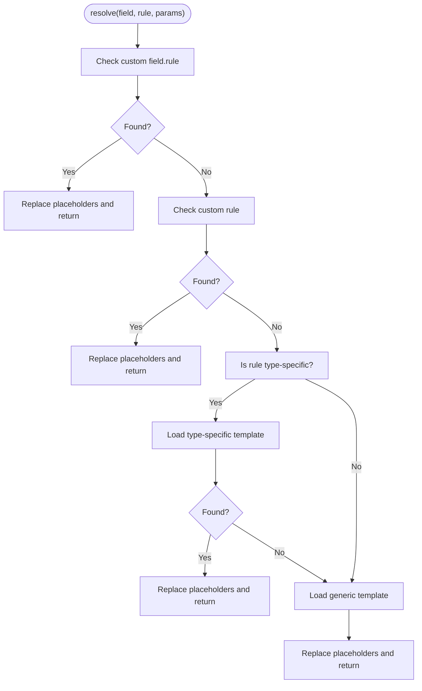

# Error Handling and Messages

<cite>
**Referenced Files in This Document**
- [MessageResolver.php](file://src/Messages/MessageResolver.php)
- [Translator.php](file://src/Messages/Translator.php)
- [TranslatorInterface.php](file://src/Messages/TranslatorInterface.php)
- [MessageBag.php](file://src/Messages/MessageBag.php)
- [ErrorCollector.php](file://src/Execution/ErrorCollector.php)
- [ValidationResult.php](file://src/Execution/ValidationResult.php)
- [SchemaValidator.php](file://src/SchemaValidator.php)
- [FastValidatorWrapper.php](file://src/Laravel/FastValidatorWrapper.php)
- [FastValidationServiceProvider.php](file://src/Laravel/FastValidationServiceProvider.php)
- [FastValidator.php](file://src/Laravel/Facades/FastValidator.php)
- [validation.php (en)](file://resources/lang/en/validation.php)
- [validation.php (ar)](file://resources/lang/ar/validation.php)
- [MessagesTest.php](file://tests/Unit/MessagesTest.php)
</cite>

## Table of Contents
1. [Introduction](#introduction)
2. [Project Structure](#project-structure)
3. [Core Components](#core-components)
4. [Architecture Overview](#architecture-overview)
5. [Detailed Component Analysis](#detailed-component-analysis)
6. [Dependency Analysis](#dependency-analysis)
7. [Performance Considerations](#performance-considerations)
8. [Troubleshooting Guide](#troubleshooting-guide)
9. [Conclusion](#conclusion)
10. [Appendices](#appendices)

## Introduction
This document explains the error handling and message system of the validation library. It covers how error messages are resolved, translated, aggregated, and surfaced to applications. It documents the MessageResolver functionality, the Translator implementation for multi-language support, and the MessageBag error aggregation. It also explains built-in language support (English, Arabic), custom message configuration, attribute name customization, error collection patterns, message formatting, and localization best practices. Finally, it describes integration with Laravel’s error handling, custom error message development, and message template customization, with practical examples and debugging strategies.

## Project Structure
The message and error handling subsystem is organized around three primary concerns:
- Message resolution and formatting
- Translation and localization
- Error aggregation and presentation

**Diagram sources**
- [MessageResolver.php](file://src/Messages/MessageResolver.php#L1-L125)
- [Translator.php](file://src/Messages/Translator.php#L1-L290)
- [MessageBag.php](file://src/Messages/MessageBag.php#L1-L97)
- [ErrorCollector.php](file://src/Execution/ErrorCollector.php#L1-L51)
- [ValidationResult.php](file://src/Execution/ValidationResult.php#L1-L142)
- [SchemaValidator.php](file://src/SchemaValidator.php#L1-L205)
- [FastValidatorWrapper.php](file://src/Laravel/FastValidatorWrapper.php#L1-L400)
- [FastValidationServiceProvider.php](file://src/Laravel/FastValidationServiceProvider.php#L1-L54)
- [FastValidator.php](file://src/Laravel/Facades/FastValidator.php#L1-L23)

**Section sources**
- [MessageResolver.php](file://src/Messages/MessageResolver.php#L1-L125)
- [Translator.php](file://src/Messages/Translator.php#L1-L290)
- [MessageBag.php](file://src/Messages/MessageBag.php#L1-L97)
- [ErrorCollector.php](file://src/Execution/ErrorCollector.php#L1-L51)
- [ValidationResult.php](file://src/Execution/ValidationResult.php#L1-L142)
- [SchemaValidator.php](file://src/SchemaValidator.php#L1-L205)
- [FastValidatorWrapper.php](file://src/Laravel/FastValidatorWrapper.php#L1-L400)
- [FastValidationServiceProvider.php](file://src/Laravel/FastValidationServiceProvider.php#L1-L54)
- [FastValidator.php](file://src/Laravel/Facades/FastValidator.php#L1-L23)

## Core Components
- MessageResolver: Resolves rule-specific messages, supports custom per-field and per-rule messages, and performs attribute replacement and formatting.
- Translator: Loads built-in and custom messages, supports fallback locales, and replaces placeholders in messages.
- MessageBag: Aggregates and exposes error messages in a Laravel-compatible format.
- ErrorCollector: Captures raw validation errors with rule, parameters, and optional preformatted messages.
- ValidationResult: Formats raw errors into user-facing messages using MessageResolver, and exposes convenient APIs for consumers.
- Laravel integration: FastValidatorWrapper implements Laravel’s Validator contract and translates internal results into Laravel’s MessageBag and ValidationException.

**Section sources**
- [MessageResolver.php](file://src/Messages/MessageResolver.php#L1-L125)
- [Translator.php](file://src/Messages/Translator.php#L1-L290)
- [MessageBag.php](file://src/Messages/MessageBag.php#L1-L97)
- [ErrorCollector.php](file://src/Execution/ErrorCollector.php#L1-L51)
- [ValidationResult.php](file://src/Execution/ValidationResult.php#L1-L142)
- [FastValidatorWrapper.php](file://src/Laravel/FastValidatorWrapper.php#L1-L400)

## Architecture Overview
The message pipeline flows from raw validation errors to formatted, localized messages and finally to the consumer (application or framework).

**Diagram sources**
- [SchemaValidator.php](file://src/SchemaValidator.php#L54-L73)
- [ErrorCollector.php](file://src/Execution/ErrorCollector.php#L17-L25)
- [ValidationResult.php](file://src/Execution/ValidationResult.php#L77-L96)
- [MessageResolver.php](file://src/Messages/MessageResolver.php#L27-L52)
- [Translator.php](file://src/Messages/Translator.php#L32-L47)
- [FastValidatorWrapper.php](file://src/Laravel/FastValidatorWrapper.php#L88-L104)

## Detailed Component Analysis

### MessageResolver
Responsibilities:
- Resolve messages for a given field and rule.
- Support custom per-field and per-rule messages.
- Replace placeholders with attribute names and parameter values.
- Handle type-specific rules (min, max, size, between) by delegating to Translator with type-aware keys.

Key behaviors:
- Priority order for resolving messages:
  1) Field-specific custom message key (field.rule)
  2) Rule-level custom message key (rule)
  3) Translated template via Translator
- Attribute replacement:
  - Uses either a configured custom attribute name or a formatted version of the field name (underscores/dashes become spaces).
  - Replaces placeholders with multiple casing variants (:key, :KEY, :Key).
- Type-specific rule handling:
  - For numeric/string/array variants of min/max/size/between, constructs a key like rule.type and falls back to generic rule if not found.

**Diagram sources**
- [MessageResolver.php](file://src/Messages/MessageResolver.php#L27-L118)

**Section sources**
- [MessageResolver.php](file://src/Messages/MessageResolver.php#L1-L125)

### Translator and Localization
Responsibilities:
- Provide localized messages for keys.
- Load default messages for built-in rules.
- Optionally load external language files from a configurable path.
- Support fallback locale and placeholder replacement.
- Allow runtime addition of messages for a locale.

Key behaviors:
- Locale management:
  - Constructor sets initial locale and loads defaults.
  - setLocale updates locale and reloads messages from disk if langPath is set.
- Message retrieval:
  - get resolves nested keys (e.g., min.string) and falls back to fallbackLocale if needed.
  - Returns the key itself if no translation is found.
- Placeholder replacement:
  - Supports :key, :KEY, and :Key variants.
- Built-in languages:
  - English and Arabic language files are provided under resources/lang/<locale>/validation.php.

**Diagram sources**
- [TranslatorInterface.php](file://src/Messages/TranslatorInterface.php#L1-L26)
- [Translator.php](file://src/Messages/Translator.php#L1-L290)

**Section sources**
- [Translator.php](file://src/Messages/Translator.php#L1-L290)
- [validation.php (en)](file://resources/lang/en/validation.php#L1-L101)
- [validation.php (ar)](file://resources/lang/ar/validation.php#L1-L94)

### MessageBag
Responsibilities:
- Aggregate messages by field.
- Provide APIs to check presence, retrieve first messages, enumerate all messages, and merge additional messages.
- Expose counts and emptiness checks.

Usage in Laravel integration:
- FastValidatorWrapper converts ValidationResult messages into a Laravel MessageBag for compatibility.

**Section sources**
- [MessageBag.php](file://src/Messages/MessageBag.php#L1-L97)
- [FastValidatorWrapper.php](file://src/Laravel/FastValidatorWrapper.php#L88-L104)

### ErrorCollector and ValidationResult
- ErrorCollector captures raw errors with rule, parameters, and optional preformatted message, maintaining counts and structure suitable for later formatting.
- ValidationResult:
  - Converts raw errors into user-facing messages using MessageResolver.
  - Provides methods to access messages per field, flattened messages, first message per field, and first message overall.
  - Supports validated data extraction and exclusion of excluded fields.

**Diagram sources**
- [ErrorCollector.php](file://src/Execution/ErrorCollector.php#L1-L51)
- [ValidationResult.php](file://src/Execution/ValidationResult.php#L1-L142)

**Section sources**
- [ErrorCollector.php](file://src/Execution/ErrorCollector.php#L1-L51)
- [ValidationResult.php](file://src/Execution/ValidationResult.php#L1-L142)

### Laravel Integration
- FastValidatorWrapper:
  - Implements Laravel’s Validator contract.
  - On validation failure, throws ValidationException; otherwise returns validated data.
  - Exposes errors() returning a Laravel MessageBag populated from ValidationResult messages.
  - Supports custom messages and attributes via setCustomMessages and setCustomAttributes.
- FastValidationServiceProvider:
  - Registers RuleRegistry and FastValidatorFactory.
  - Optionally overrides Laravel’s default validator when configured to do so.
- Facade:
  - FastValidator facade delegates to FastValidatorFactory for convenient creation of validators.

**Diagram sources**
- [FastValidatorWrapper.php](file://src/Laravel/FastValidatorWrapper.php#L69-L139)
- [FastValidator.php](file://src/Laravel/Facades/FastValidator.php#L1-L23)
- [FastValidationServiceProvider.php](file://src/Laravel/FastValidationServiceProvider.php#L45-L52)
- [SchemaValidator.php](file://src/SchemaValidator.php#L54-L73)

**Section sources**
- [FastValidatorWrapper.php](file://src/Laravel/FastValidatorWrapper.php#L1-L400)
- [FastValidationServiceProvider.php](file://src/Laravel/FastValidationServiceProvider.php#L1-L54)
- [FastValidator.php](file://src/Laravel/Facades/FastValidator.php#L1-L23)

## Dependency Analysis
- MessageResolver depends on TranslatorInterface and optionally a concrete Translator.
- ValidationResult optionally uses MessageResolver to format messages.
- SchemaValidator orchestrates validation and can inject MessageResolver into downstream components.
- FastValidatorWrapper depends on SchemaValidator and produces Laravel MessageBag and ValidationException.
- Translator loads language files from resources/lang/<locale>/validation.php and supports runtime additions.

**Diagram sources**
- [MessageResolver.php](file://src/Messages/MessageResolver.php#L1-L125)
- [Translator.php](file://src/Messages/Translator.php#L1-L290)
- [ValidationResult.php](file://src/Execution/ValidationResult.php#L1-L142)
- [SchemaValidator.php](file://src/SchemaValidator.php#L1-L205)
- [FastValidatorWrapper.php](file://src/Laravel/FastValidatorWrapper.php#L1-L400)
- [validation.php (en)](file://resources/lang/en/validation.php#L1-L101)
- [validation.php (ar)](file://resources/lang/ar/validation.php#L1-L94)

**Section sources**
- [MessageResolver.php](file://src/Messages/MessageResolver.php#L1-L125)
- [Translator.php](file://src/Messages/Translator.php#L1-L290)
- [ValidationResult.php](file://src/Execution/ValidationResult.php#L1-L142)
- [SchemaValidator.php](file://src/SchemaValidator.php#L1-L205)
- [FastValidatorWrapper.php](file://src/Laravel/FastValidatorWrapper.php#L1-L400)
- [validation.php (en)](file://resources/lang/en/validation.php#L1-L101)
- [validation.php (ar)](file://resources/lang/ar/validation.php#L1-L94)

## Performance Considerations
- Prefer streaming APIs for large datasets:
  - Use stream(), each(), failures(), and firstFailure() to avoid materializing all results in memory.
- Leverage precompiled native validators:
  - SchemaValidator detects precompiled validators and caches them for high throughput.
- Minimize repeated translations:
  - Reuse MessageResolver instances and avoid unnecessary locale switches.
- Keep custom messages concise:
  - Long templates increase string replacement overhead.

[No sources needed since this section provides general guidance]

## Troubleshooting Guide
Common issues and resolutions:
- Missing translation key:
  - Symptom: Returned message equals the key itself.
  - Resolution: Ensure the key exists in the appropriate language file or add it via Translator::addMessages.
- Placeholders not replaced:
  - Symptom: :attribute or :key remains in the message.
  - Resolution: Verify custom messages include placeholders and that custom attributes are set via MessageResolver or FastValidatorWrapper.
- Wrong locale:
  - Symptom: Messages appear in the wrong language.
  - Resolution: Set Translator locale or use Translator::setLangPath to load from a custom directory; confirm resource files exist.
- Custom messages not applied:
  - Symptom: Generic messages appear instead of custom ones.
  - Resolution: Confirm custom message keys follow field.rule or rule pattern and are set before validation.
- Attribute names not human-readable:
  - Symptom: Underscores remain in messages.
  - Resolution: Configure custom attributes for fields or rely on automatic formatting (underscores/dashes to spaces).

Practical debugging steps:
- Inspect ValidationResult messages() output to see formatted messages per field.
- Use firstMessage(field) or first() to quickly locate the first issue.
- Enable logging in each() or stream() loops to capture failing rows and their errors.
- Temporarily switch locale to English to verify rule coverage.

**Section sources**
- [ValidationResult.php](file://src/Execution/ValidationResult.php#L77-L128)
- [Translator.php](file://src/Messages/Translator.php#L32-L47)
- [MessageResolver.php](file://src/Messages/MessageResolver.php#L100-L118)
- [FastValidatorWrapper.php](file://src/Laravel/FastValidatorWrapper.php#L88-L104)

## Conclusion
The validation library provides a robust, extensible message system that separates concerns between resolution, translation, and aggregation. It supports multi-language out of the box, allows deep customization of messages and attributes, and integrates seamlessly with Laravel. By leveraging the provided APIs and best practices—especially streaming for large datasets and careful placeholder management—you can deliver clear, localized error feedback while maintaining high performance.

[No sources needed since this section summarizes without analyzing specific files]

## Appendices

### Built-in Language Support
- English and Arabic language packs are included under resources/lang/<locale>/validation.php.
- Translator loads defaults during construction and can load additional files from a configurable path.

**Section sources**
- [validation.php (en)](file://resources/lang/en/validation.php#L1-L101)
- [validation.php (ar)](file://resources/lang/ar/validation.php#L1-L94)
- [Translator.php](file://src/Messages/Translator.php#L143-L288)

### Custom Message Configuration
- Per-field and per-rule custom messages:
  - Set via MessageResolver::setCustomMessages or FastValidatorWrapper::setCustomMessages.
  - Keys follow field.rule or rule patterns.
- Attribute name customization:
  - Use MessageResolver::setCustomAttributes or FastValidatorWrapper::setCustomAttributes to map internal field names to user-friendly labels.

**Section sources**
- [MessageResolver.php](file://src/Messages/MessageResolver.php#L57-L68)
- [FastValidatorWrapper.php](file://src/Laravel/FastValidatorWrapper.php#L239-L264)

### Message Formatting and Templates
- Placeholders supported:
  - :attribute, :ATTRIBUTE, :Attribute (and any other placeholder keys).
- Type-specific rules:
  - min, max, size, between support type variants (e.g., min.string, max.array).
- Attribute formatting:
  - Underscores and dashes are converted to spaces automatically unless overridden.

**Section sources**
- [MessageResolver.php](file://src/Messages/MessageResolver.php#L78-L118)
- [Translator.php](file://src/Messages/Translator.php#L104-L141)

### Integration with Laravel
- Validator contract compliance:
  - FastValidatorWrapper implements Laravel’s Validator contract and throws ValidationException on failure.
- MessageBag integration:
  - errors() returns a Laravel MessageBag populated from ValidationResult messages.
- Provider override mode:
  - FastValidationServiceProvider can override Laravel’s default validator when configured.

**Section sources**
- [FastValidatorWrapper.php](file://src/Laravel/FastValidatorWrapper.php#L69-L139)
- [FastValidationServiceProvider.php](file://src/Laravel/FastValidationServiceProvider.php#L45-L52)

### Practical Examples
- Basic usage:
  - Build a validator, validate data, and handle exceptions or retrieve messages.
- Streaming large datasets:
  - Use stream() or each() to process rows without storing all results.
- Debugging validation failures:
  - Use firstMessage(field) and first() to quickly identify issues; log detailed errors in each() loops.

**Section sources**
- [SchemaValidator.php](file://src/SchemaValidator.php#L113-L150)
- [ValidationResult.php](file://src/Execution/ValidationResult.php#L115-L128)
- [FastValidatorWrapper.php](file://src/Laravel/FastValidatorWrapper.php#L309-L344)

### Tests Reference
- Unit tests demonstrate translator behavior, message bag operations, and message resolver scenarios.

**Section sources**
- [MessagesTest.php](file://tests/Unit/MessagesTest.php#L1-L128)