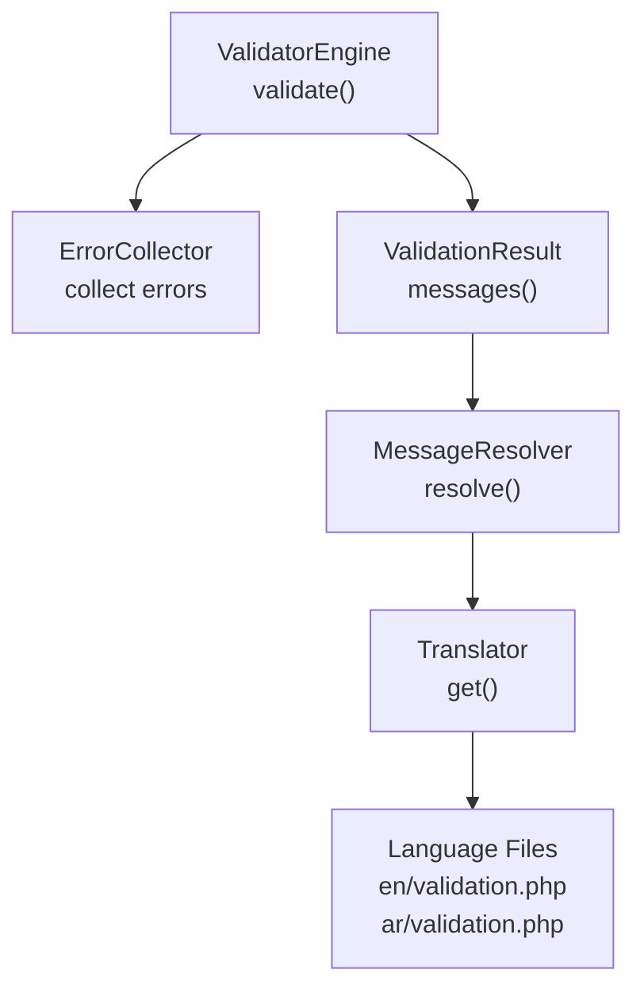
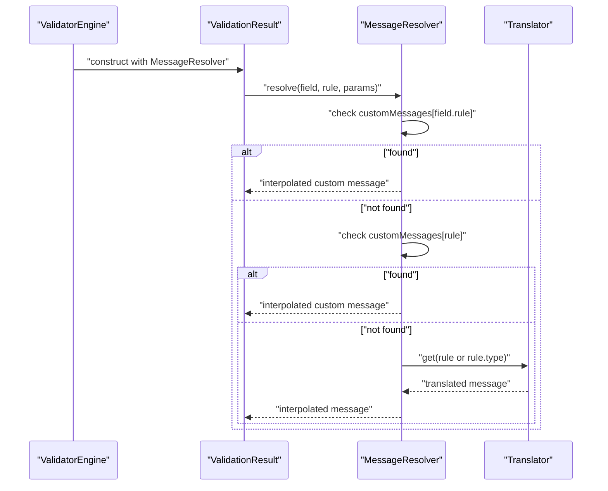
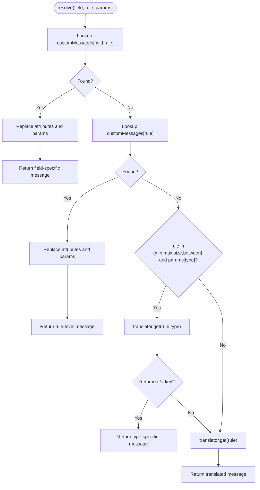
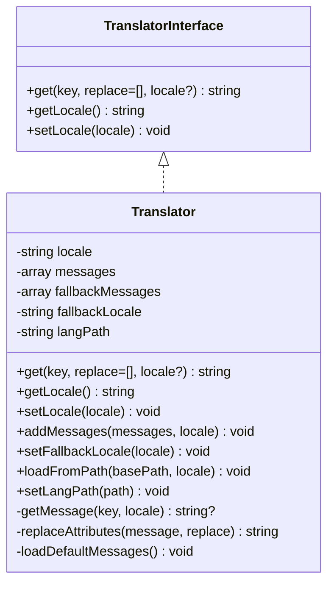
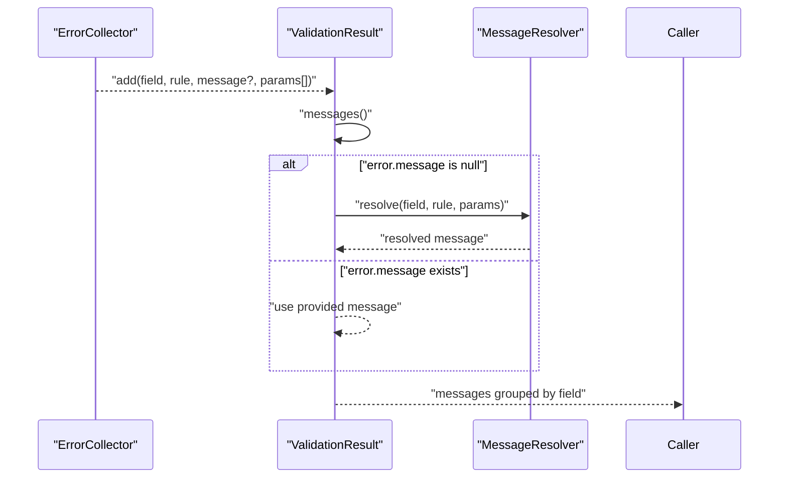
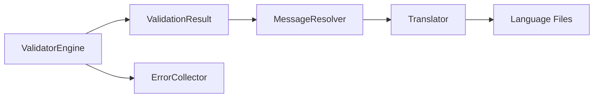

# Message Resolution System

<cite>
**Referenced Files in This Document**
- [MessageResolver.php](file://src/Messages/MessageResolver.php)
- [Translator.php](file://src/Messages/Translator.php)
- [TranslatorInterface.php](file://src/Messages/TranslatorInterface.php)
- [validation.php (en)](file://resources/lang/en/validation.php)
- [validation.php (ar)](file://resources/lang/ar/validation.php)
- [MessageBag.php](file://src/Messages/MessageBag.php)
- [ValidatorEngine.php](file://src/Execution/ValidatorEngine.php)
- [ValidationResult.php](file://src/Execution/ValidationResult.php)
- [ErrorCollector.php](file://src/Execution/ErrorCollector.php)
- [MessagesTest.php](file://tests/Unit/MessagesTest.php)
- [test_type_messages.php](file://test_type_messages.php)
- [test_fast_validator.php](file://test_fast_validator.php)
</cite>

## Table of Contents
1. [Introduction](#introduction)
2. [Project Structure](#project-structure)
3. [Core Components](#core-components)
4. [Architecture Overview](#architecture-overview)
5. [Detailed Component Analysis](#detailed-component-analysis)
6. [Dependency Analysis](#dependency-analysis)
7. [Performance Considerations](#performance-considerations)
8. [Troubleshooting Guide](#troubleshooting-guide)
9. [Conclusion](#conclusion)
10. [Appendices](#appendices)

## Introduction
This document explains the message resolution system used by the validation engine. It focuses on the MessageResolver class, detailing how custom messages take precedence over translated messages, how type-specific rules are handled, and how parameters and attribute names are interpolated into messages. Practical examples demonstrate configuring custom messages, passing parameters, and debugging resolved messages.

## Project Structure
The message resolution pipeline spans several modules:
- MessageResolver: orchestrates precedence and interpolation
- Translator: loads and retrieves localized messages with fallback support
- ValidationResult: resolves raw rule errors into final user-facing messages
- ValidatorEngine: drives validation and delegates message resolution
- Language files: provide default translations per locale

**Diagram sources**
- [ValidatorEngine.php](file://src/Execution/ValidatorEngine.php#L33-L98)
- [ValidationResult.php](file://src/Execution/ValidationResult.php#L77-L96)
- [MessageResolver.php](file://src/Messages/MessageResolver.php#L27-L52)
- [Translator.php](file://src/Messages/Translator.php#L32-L47)
- [validation.php (en)](file://resources/lang/en/validation.php#L1-L101)
- [validation.php (ar)](file://resources/lang/ar/validation.php#L1-L94)

**Section sources**
- [ValidatorEngine.php](file://src/Execution/ValidatorEngine.php#L33-L98)
- [ValidationResult.php](file://src/Execution/ValidationResult.php#L77-L96)
- [MessageResolver.php](file://src/Messages/MessageResolver.php#L27-L52)
- [Translator.php](file://src/Messages/Translator.php#L32-L47)
- [validation.php (en)](file://resources/lang/en/validation.php#L1-L101)
- [validation.php (ar)](file://resources/lang/ar/validation.php#L1-L94)

## Core Components
- MessageResolver: Implements precedence and interpolation logic
  - Custom field-specific messages (field.rule)
  - Custom rule-level messages (rule)
  - Translated messages via Translator
  - Attribute replacement and parameter interpolation
- Translator: Loads locale-specific messages and supports fallback locales
- ValidationResult: Converts raw errors into formatted messages using MessageResolver
- ValidatorEngine: Coordinates validation and error collection

**Section sources**
- [MessageResolver.php](file://src/Messages/MessageResolver.php#L27-L124)
- [Translator.php](file://src/Messages/Translator.php#L32-L288)
- [ValidationResult.php](file://src/Execution/ValidationResult.php#L77-L96)
- [ValidatorEngine.php](file://src/Execution/ValidatorEngine.php#L33-L98)

## Architecture Overview
The resolution order is:
1. Custom field-specific message: field.rule
2. Custom rule-level message: rule
3. Translated message: rule or type-specific rule.type
4. Attribute and parameter interpolation

**Diagram sources**
- [ValidatorEngine.php](file://src/Execution/ValidatorEngine.php#L97-L98)
- [ValidationResult.php](file://src/Execution/ValidationResult.php#L87-L89)
- [MessageResolver.php](file://src/Messages/MessageResolver.php#L27-L52)
- [Translator.php](file://src/Messages/Translator.php#L32-L47)

## Detailed Component Analysis

### MessageResolver
Responsibilities:
- Resolve messages in precedence order
- Interpolate attributes and parameters
- Support type-specific rules for min/max/size/between

Key behaviors:
- Custom precedence
  - field.rule takes priority over rule-level
  - rule-level takes priority over translation
- Type-specific rule handling
  - min, max, size, between check params['type'] to select rule.type
- Parameter interpolation
  - Supports :key, :KEY, :Key variants
  - Also injects :attribute
- Attribute formatting
  - Underscores and hyphens converted to spaces

**Diagram sources**
- [MessageResolver.php](file://src/Messages/MessageResolver.php#L27-L95)
- [MessageResolver.php](file://src/Messages/MessageResolver.php#L100-L118)
- [MessageResolver.php](file://src/Messages/MessageResolver.php#L120-L123)

Practical examples:
- Custom field-specific message
  - Configure a message for a specific field+rule and observe it overrides translation
  - See [MessagesTest.php](file://tests/Unit/MessagesTest.php#L98-L107)
- Custom rule-level message
  - Provide a generic message for a rule that applies to all fields
  - See [MessagesTest.php](file://tests/Unit/MessagesTest.php#L98-L107)
- Attribute replacement
  - Use setCustomAttributes to normalize display names
  - See [MessagesTest.php](file://tests/Unit/MessagesTest.php#L109-L118)
- Underscore formatting
  - Observe automatic conversion from underscores/hyphens to spaces
  - See [MessagesTest.php](file://tests/Unit/MessagesTest.php#L120-L126)

**Section sources**
- [MessageResolver.php](file://src/Messages/MessageResolver.php#L27-L124)
- [MessagesTest.php](file://tests/Unit/MessagesTest.php#L89-L126)

### Translator and Language Files
Responsibilities:
- Load locale-specific messages
- Support fallback locale
- Nested key lookup for type-specific rules
- Placeholder replacement for Translator-level replacements

Key behaviors:
- Locale selection and fallback
  - If a key is not found in the requested locale, fallback to configured fallback locale
  - Returns the key itself if no translation is found
- Nested keys
  - Handles dot notation like "min.numeric" for type-specific messages
- Placeholder replacement
  - Supports :key, :KEY, :Key variants at the Translator level

**Diagram sources**
- [TranslatorInterface.php](file://src/Messages/TranslatorInterface.php#L7-L25)
- [Translator.php](file://src/Messages/Translator.php#L7-L288)

Integration points:
- MessageResolver delegates to Translator for rule messages
- Language files loaded from resources/lang/{locale}/validation.php
- Fallback locale defaults to "en"

**Section sources**
- [Translator.php](file://src/Messages/Translator.php#L32-L141)
- [validation.php (en)](file://resources/lang/en/validation.php#L1-L101)
- [validation.php (ar)](file://resources/lang/ar/validation.php#L1-L94)

### ValidationResult and Error Collection
Responsibilities:
- Aggregate raw errors from validation
- Resolve messages using MessageResolver when a rule does not supply a preformatted message
- Provide formatted messages grouped by field

Key behaviors:
- Raw error shape includes rule name and parameters
- If no message is provided by the rule, MessageResolver is invoked
- Supports firstMessage and first helpers for quick debugging

**Diagram sources**
- [ErrorCollector.php](file://src/Execution/ErrorCollector.php#L17-L25)
- [ValidationResult.php](file://src/Execution/ValidationResult.php#L77-L96)
- [MessageResolver.php](file://src/Messages/MessageResolver.php#L27-L52)

**Section sources**
- [ValidationResult.php](file://src/Execution/ValidationResult.php#L77-L96)
- [ErrorCollector.php](file://src/Execution/ErrorCollector.php#L17-L25)

### Type-Specific Rule Handling
Behavior:
- For min, max, size, between rules, MessageResolver checks params['type']
- If present, attempts translator.get(rule . "." . type)
- Falls back to rule if type-specific key is not found

Examples from tests:
- Numeric min/max/size/between
  - See [test_type_messages.php](file://test_type_messages.php#L15-L43)
- String min/max/size/between
  - See [test_type_messages.php](file://test_type_messages.php#L25-L43)
- Array min/max/size/between
  - See [test_type_messages.php](file://test_type_messages.php#L35-L43)

**Section sources**
- [MessageResolver.php](file://src/Messages/MessageResolver.php#L80-L94)
- [validation.php (en)](file://resources/lang/en/validation.php#L21-L40)
- [validation.php (ar)](file://resources/lang/ar/validation.php#L35-L54)
- [test_type_messages.php](file://test_type_messages.php#L15-L43)

### Parameter Replacement Logic
Behavior:
- MessageResolver.replaceAttributes merges params with ['attribute' => formatted attribute]
- Replaces placeholders in this merged set:
  - :key (lowercase)
  - :KEY (uppercase)
  - :Key (capitalized first)
- Attribute formatting converts underscores/hyphens to spaces

Examples:
- Basic placeholder replacement
  - See [MessagesTest.php](file://tests/Unit/MessagesTest.php#L23-L30)
- Attribute normalization
  - See [MessagesTest.php](file://tests/Unit/MessagesTest.php#L109-L118)
- Underscore/hyphen formatting
  - See [MessagesTest.php](file://tests/Unit/MessagesTest.php#L120-L126)

**Section sources**
- [MessageResolver.php](file://src/Messages/MessageResolver.php#L100-L118)
- [MessageResolver.php](file://src/Messages/MessageResolver.php#L120-L123)
- [Translator.php](file://src/Messages/Translator.php#L130-L141)

## Dependency Analysis
MessageResolver depends on:
- TranslatorInterface (default implementation: Translator)
- Custom messages and attributes arrays
- Language files for translation fallback

ValidationResult depends on:
- MessageResolver for resolving messages
- ErrorCollector for raw error data

**Diagram sources**
- [MessageResolver.php](file://src/Messages/MessageResolver.php#L9-L20)
- [Translator.php](file://src/Messages/Translator.php#L21-L30)
- [ValidationResult.php](file://src/Execution/ValidationResult.php#L22-L32)
- [ValidatorEngine.php](file://src/Execution/ValidatorEngine.php#L23-L31)
- [ErrorCollector.php](file://src/Execution/ErrorCollector.php#L17-L25)

**Section sources**
- [MessageResolver.php](file://src/Messages/MessageResolver.php#L9-L20)
- [Translator.php](file://src/Messages/Translator.php#L21-L30)
- [ValidationResult.php](file://src/Execution/ValidationResult.php#L22-L32)
- [ValidatorEngine.php](file://src/Execution/ValidatorEngine.php#L23-L31)
- [ErrorCollector.php](file://src/Execution/ErrorCollector.php#L17-L25)

## Performance Considerations
- Custom messages lookup is O(1) via associative arrays
- Translator.getMessage uses nested array traversal; nested keys are short (dot-separated up to two parts), so cost remains low
- Attribute formatting and placeholder replacement are linear in message length and parameter count
- Consider batching or caching frequently used messages in high-throughput scenarios

## Troubleshooting Guide
Common issues and resolutions:
- No custom message applied
  - Verify custom message key format: field.rule or rule
  - Confirm setCustomMessages was called before resolution
  - See [MessagesTest.php](file://tests/Unit/MessagesTest.php#L98-L107)
- Attribute not displaying as expected
  - Use setCustomAttributes to normalize display names
  - Underscores/hyphens are automatically converted to spaces
  - See [MessagesTest.php](file://tests/Unit/MessagesTest.php#L109-L126)
- Type-specific message not used
  - Ensure params include 'type' for min/max/size/between rules
  - Confirm language file defines rule.type keys
  - See [MessageResolver.php](file://src/Messages/MessageResolver.php#L80-L94)
- Placeholders not replaced
  - Confirm parameter names match placeholders (:key)
  - Remember uppercase and capitalized variants are supported
  - See [MessageResolver.php](file://src/Messages/MessageResolver.php#L106-L115)
- Debugging resolved messages
  - Use ValidationResult::messages() to inspect final messages
  - Use ValidationResult::firstMessage(field) for quick checks
  - See [ValidationResult.php](file://src/Execution/ValidationResult.php#L115-L119)

**Section sources**
- [MessagesTest.php](file://tests/Unit/MessagesTest.php#L98-L126)
- [MessageResolver.php](file://src/Messages/MessageResolver.php#L80-L118)
- [ValidationResult.php](file://src/Execution/ValidationResult.php#L115-L119)

## Conclusion
The message resolution system provides a clear, extensible mechanism for generating user-friendly validation messages. Its precedence model ensures flexibility for per-field customization while maintaining sensible defaults through localization. Type-specific rules and robust parameter interpolation make it suitable for diverse validation scenarios.

## Appendices

### Practical Examples Index
- Custom field-specific message
  - [MessagesTest.php](file://tests/Unit/MessagesTest.php#L98-L107)
- Custom rule-level message
  - [MessagesTest.php](file://tests/Unit/MessagesTest.php#L98-L107)
- Attribute normalization and underscore formatting
  - [MessagesTest.php](file://tests/Unit/MessagesTest.php#L109-L126)
- Type-specific messages (min/max/size/between)
  - [test_type_messages.php](file://test_type_messages.php#L15-L43)
- New rules validation (alpha_dash, lowercase, uppercase, multiple_of, doesnt_start_with)
  - [test_fast_validator.php](file://test_fast_validator.php#L15-L111)