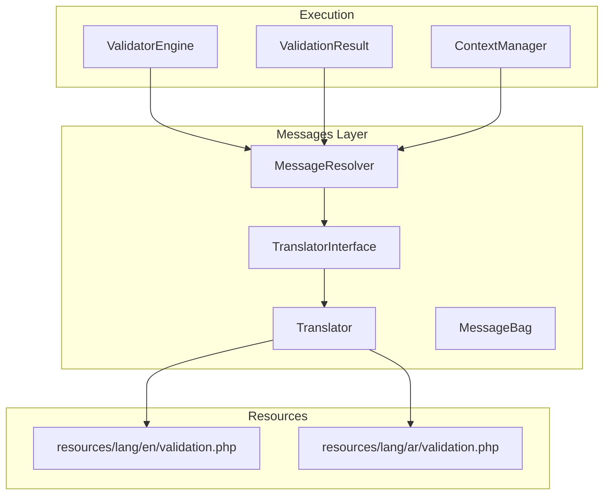
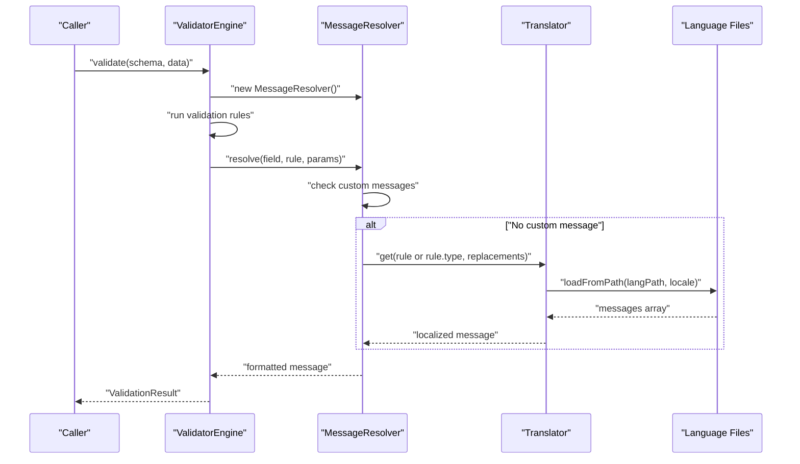
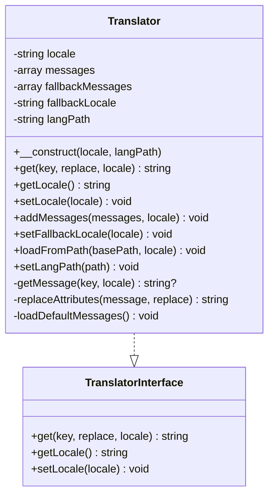
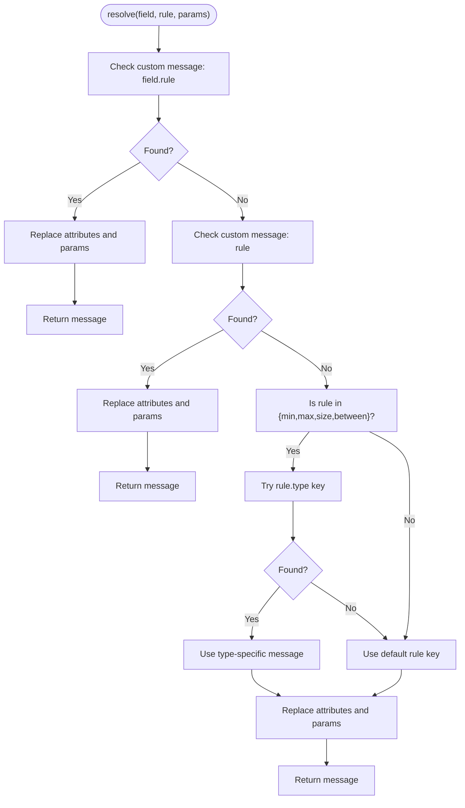
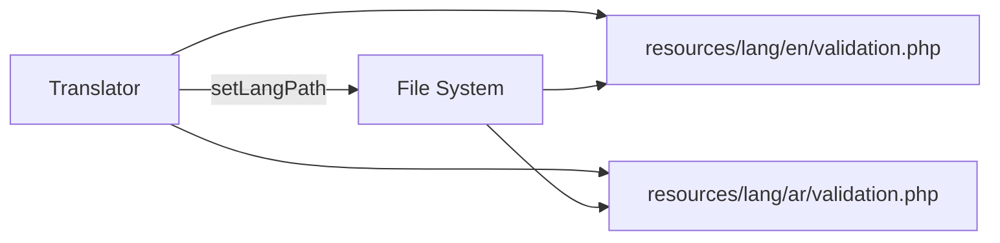
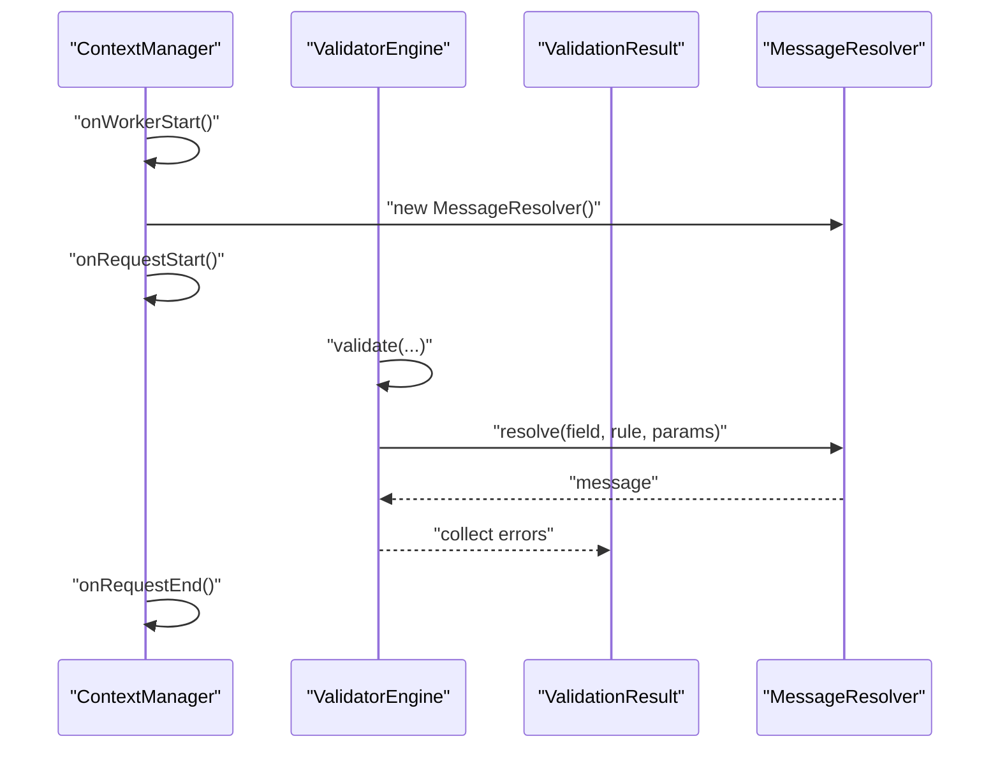
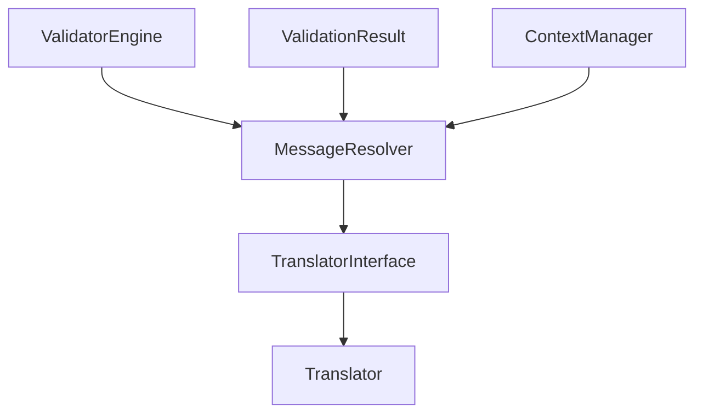

# Translation and Localization

<cite>
**Referenced Files in This Document**
- [TranslatorInterface.php](file://src/Messages/TranslatorInterface.php)
- [Translator.php](file://src/Messages/Translator.php)
- [MessageResolver.php](file://src/Messages/MessageResolver.php)
- [MessageBag.php](file://src/Messages/MessageBag.php)
- [validation.php (English)](file://resources/lang/en/validation.php)
- [validation.php (Arabic)](file://resources/lang/ar/validation.php)
- [MessagesTest.php](file://tests/Unit/MessagesTest.php)
- [ValidatorEngine.php](file://src/Execution/ValidatorEngine.php)
- [ValidationResult.php](file://src/Execution/ValidationResult.php)
- [ContextManager.php](file://src/Runtime/ContextManager.php)
- [LanguageRule.php](file://src/Rules/LanguageRule.php)
</cite>

## Table of Contents
1. [Introduction](#introduction)
2. [Project Structure](#project-structure)
3. [Core Components](#core-components)
4. [Architecture Overview](#architecture-overview)
5. [Detailed Component Analysis](#detailed-component-analysis)
6. [Dependency Analysis](#dependency-analysis)
7. [Performance Considerations](#performance-considerations)
8. [Troubleshooting Guide](#troubleshooting-guide)
9. [Conclusion](#conclusion)
10. [Appendices](#appendices)

## Introduction
This document explains the translation and localization system used by the validation library. It covers the Translator implementation, built-in language support (English and Arabic), and language resource loading. It also documents translation key resolution, message templates, and how placeholders are replaced. The document outlines the TranslatorInterface contract, how to implement a custom translator, and how to integrate with external translation systems. Practical examples show how to add new languages, customize existing translations, and manage translation keys effectively. Finally, it provides best practices for maintaining translations and implementing custom localization strategies.

## Project Structure
The translation and localization system is organized around three primary components:
- TranslatorInterface defines the contract for retrieving localized messages.
- Translator implements the contract, loads default and external language resources, resolves nested keys, and replaces placeholders.
- MessageResolver orchestrates custom messages, attribute formatting, and delegates rule-specific message retrieval to Translator.

Language resources are stored under resources/lang/<locale>/validation.php. The English and Arabic resources are included in the repository.

**Diagram sources**
- [TranslatorInterface.php](file://src/Messages/TranslatorInterface.php#L7-L25)
- [Translator.php](file://src/Messages/Translator.php#L7-L290)
- [MessageResolver.php](file://src/Messages/MessageResolver.php#L7-L125)
- [MessageBag.php](file://src/Messages/MessageBag.php#L7-L97)
- [validation.php (English)](file://resources/lang/en/validation.php#L1-L101)
- [validation.php (Arabic)](file://resources/lang/ar/validation.php#L1-L94)
- [ValidatorEngine.php](file://src/Execution/ValidatorEngine.php#L11-L44)
- [ValidationResult.php](file://src/Execution/ValidationResult.php#L9-L47)
- [ContextManager.php](file://src/Runtime/ContextManager.php#L14-L48)

**Section sources**
- [TranslatorInterface.php](file://src/Messages/TranslatorInterface.php#L1-L26)
- [Translator.php](file://src/Messages/Translator.php#L1-L290)
- [MessageResolver.php](file://src/Messages/MessageResolver.php#L1-L125)
- [validation.php (English)](file://resources/lang/en/validation.php#L1-L101)
- [validation.php (Arabic)](file://resources/lang/ar/validation.php#L1-L94)

## Core Components
- TranslatorInterface: Defines the contract for getting a localized message by key, retrieving and setting the current locale.
- Translator: Implements the interface, loads default messages for English, supports external language files, supports fallback locales, and performs placeholder replacement.
- MessageResolver: Resolves rule messages, supports field-specific and rule-specific custom messages, and formats attributes and parameters.
- MessageBag: Aggregates and manages error messages keyed by field.

Key capabilities:
- Nested key resolution (e.g., min.string) for type-specific messages.
- Locale switching and dynamic loading from a configured path.
- Placeholder replacement for attributes and parameters.
- Fallback to a default locale when a key is missing.

**Section sources**
- [TranslatorInterface.php](file://src/Messages/TranslatorInterface.php#L7-L25)
- [Translator.php](file://src/Messages/Translator.php#L7-L290)
- [MessageResolver.php](file://src/Messages/MessageResolver.php#L7-L125)
- [MessageBag.php](file://src/Messages/MessageBag.php#L7-L97)

## Architecture Overview
The translation pipeline integrates with the validation engine and runtime context manager. The engine constructs a MessageResolver and collects errors via an ErrorCollector. The resolver uses Translator to fetch localized messages and applies custom overrides and attribute formatting.

**Diagram sources**
- [ValidatorEngine.php](file://src/Execution/ValidatorEngine.php#L33-L44)
- [MessageResolver.php](file://src/Messages/MessageResolver.php#L27-L95)
- [Translator.php](file://src/Messages/Translator.php#L32-L94)
- [validation.php (English)](file://resources/lang/en/validation.php#L1-L101)
- [validation.php (Arabic)](file://resources/lang/ar/validation.php#L1-L94)

## Detailed Component Analysis

### Translator Implementation
The Translator class implements the TranslatorInterface and provides:
- Locale management: getLocale, setLocale, and fallback locale configuration.
- Resource loading: loadFromPath reads language files from a base path and merges messages per locale.
- Nested key resolution: getMessage supports dot notation for type-specific messages.
- Placeholder replacement: replaceAttributes substitutes placeholders for parameters and attributes.
- Default messages: loadDefaultMessages initializes English defaults at construction.

**Diagram sources**
- [TranslatorInterface.php](file://src/Messages/TranslatorInterface.php#L7-L25)
- [Translator.php](file://src/Messages/Translator.php#L7-L290)

Key behaviors:
- Locale switching triggers optional reloading of messages from disk if a langPath is set.
- Nested keys like min.string are resolved by traversing arrays returned by language files.
- If a key is not found, the translator falls back to the configured fallback locale; if still missing, it returns the key itself.

**Section sources**
- [Translator.php](file://src/Messages/Translator.php#L21-L94)
- [Translator.php](file://src/Messages/Translator.php#L104-L141)
- [Translator.php](file://src/Messages/Translator.php#L143-L288)

### MessageResolver and Template Resolution
MessageResolver handles:
- Custom messages: field.rule and rule-level overrides take precedence.
- Type-specific rules: min, max, size, and between can use rule.type variants (e.g., min.string).
- Attribute formatting: converts underscores/dashes to spaces and injects the formatted attribute into the message.
- Parameter replacement: supports :key, :KEY, and :Key casing variations.

**Diagram sources**
- [MessageResolver.php](file://src/Messages/MessageResolver.php#L27-L95)
- [MessageResolver.php](file://src/Messages/MessageResolver.php#L100-L118)

**Section sources**
- [MessageResolver.php](file://src/Messages/MessageResolver.php#L17-L52)
- [MessageResolver.php](file://src/Messages/MessageResolver.php#L78-L95)
- [MessageResolver.php](file://src/Messages/MessageResolver.php#L100-L123)

### Language Resource Loading and Built-in Languages
Built-in language resources are provided under resources/lang/<locale>/validation.php:
- English resource includes a broad set of validation rule messages and nested type-specific entries.
- Arabic resource includes localized messages and nested entries for several rules.

The Translator loads these resources automatically when a langPath is set and supports runtime locale switching.

**Diagram sources**
- [Translator.php](file://src/Messages/Translator.php#L84-L94)
- [validation.php (English)](file://resources/lang/en/validation.php#L1-L101)
- [validation.php (Arabic)](file://resources/lang/ar/validation.php#L1-L94)

**Section sources**
- [validation.php (English)](file://resources/lang/en/validation.php#L1-L101)
- [validation.php (Arabic)](file://resources/lang/ar/validation.php#L1-L94)
- [Translator.php](file://src/Messages/Translator.php#L84-L94)

### MessageBag Usage
MessageBag aggregates messages by field and supports operations like counting, checking emptiness, retrieving first messages, and merging additional messages. While it is not directly responsible for translation, it is commonly used to collect and present validation errors after resolution.

**Section sources**
- [MessageBag.php](file://src/Messages/MessageBag.php#L12-L96)

### Integration with Validation Execution
The validation engine and runtime context manager coordinate message resolution:
- ValidatorEngine constructs a MessageResolver and passes it to downstream components.
- ValidationResult stores collected errors and can optionally include a MessageResolver for post-processing.
- ContextManager creates and resets a MessageResolver per worker/request lifecycle.

**Diagram sources**
- [ContextManager.php](file://src/Runtime/ContextManager.php#L25-L42)
- [ValidatorEngine.php](file://src/Execution/ValidatorEngine.php#L23-L31)
- [ValidationResult.php](file://src/Execution/ValidationResult.php#L22-L32)

**Section sources**
- [ContextManager.php](file://src/Runtime/ContextManager.php#L14-L48)
- [ValidatorEngine.php](file://src/Execution/ValidatorEngine.php#L11-L44)
- [ValidationResult.php](file://src/Execution/ValidationResult.php#L9-L47)

## Dependency Analysis
The translation system exhibits clear separation of concerns:
- Translator depends on language resource files and exposes a simple interface.
- MessageResolver depends on TranslatorInterface, enabling substitution of custom implementations.
- Execution components depend on MessageResolver rather than on Translator directly, allowing flexibility in swapping translators.

**Diagram sources**
- [TranslatorInterface.php](file://src/Messages/TranslatorInterface.php#L7-L25)
- [Translator.php](file://src/Messages/Translator.php#L7-L290)
- [MessageResolver.php](file://src/Messages/MessageResolver.php#L7-L125)
- [ValidatorEngine.php](file://src/Execution/ValidatorEngine.php#L11-L44)
- [ValidationResult.php](file://src/Execution/ValidationResult.php#L9-L47)
- [ContextManager.php](file://src/Runtime/ContextManager.php#L14-L48)

**Section sources**
- [TranslatorInterface.php](file://src/Messages/TranslatorInterface.php#L7-L25)
- [MessageResolver.php](file://src/Messages/MessageResolver.php#L9-L20)
- [ValidatorEngine.php](file://src/Execution/ValidatorEngine.php#L13-L28)

## Performance Considerations
- Resource loading: Translator.loadFromPath reads language files from disk. To minimize I/O, set a langPath once during initialization and rely on setLocale to switch locales without reinitializing the entire system.
- Caching: Consider wrapping Translator with a caching layer to avoid repeated file reads for frequently accessed keys.
- Placeholder replacement: The replaceAttributes method iterates over replacements; keep the number of placeholders reasonable to avoid unnecessary overhead.
- Fallback chain: Using a fallback locale reduces misses but may still incur file loads if the fallback locale’s file is not cached.

[No sources needed since this section provides general guidance]

## Troubleshooting Guide
Common issues and resolutions:
- Missing translation key: If a key is not found, Translator returns the key itself. Verify the key exists in the appropriate language file or add it.
- Incorrect locale: Ensure setLocale is called with a supported locale and that the corresponding language file exists under the configured langPath.
- Nested key not resolving: Confirm the nested structure matches the language file (e.g., min.string). The resolver checks rule.type first for type-specific messages.
- Custom message precedence: Field-specific custom messages (field.rule) override rule-level custom messages (rule). Ensure custom messages are registered before resolution.
- Attribute formatting: Underscores and dashes are converted to spaces. If a custom attribute mapping is needed, register it via MessageResolver.setCustomAttributes.

**Section sources**
- [Translator.php](file://src/Messages/Translator.php#L32-L47)
- [MessageResolver.php](file://src/Messages/MessageResolver.php#L27-L52)
- [MessagesTest.php](file://tests/Unit/MessagesTest.php#L14-L30)
- [MessagesTest.php](file://tests/Unit/MessagesTest.php#L98-L118)

## Conclusion
The translation and localization system centers on a clean interface and a robust implementation that supports nested keys, locale switching, and customizable messages. English and Arabic resources are provided out-of-the-box, and the system is extensible to new languages and external translation providers through the TranslatorInterface. By following the best practices below, teams can maintain accurate, scalable, and user-friendly validations across locales.

[No sources needed since this section summarizes without analyzing specific files]

## Appendices

### A. TranslatorInterface Contract
- Methods:
  - get(key, replace = [], locale = null): string
  - getLocale(): string
  - setLocale(locale): void

Implementation notes:
- Implementations must support nested keys and placeholder replacement.
- Locale switching should trigger resource reload if backed by files.

**Section sources**
- [TranslatorInterface.php](file://src/Messages/TranslatorInterface.php#L7-L25)

### B. Adding a New Language
Steps:
1. Create a new directory under resources/lang/<new_locale>/.
2. Add a validation.php file with translation keys and nested structures mirroring the English resource.
3. Initialize Translator with a langPath pointing to resources/lang and set the desired locale.
4. Optionally call setFallbackLocale to a stable default.

Reference files:
- [validation.php (English)](file://resources/lang/en/validation.php#L1-L101)
- [validation.php (Arabic)](file://resources/lang/ar/validation.php#L1-L94)
- [Translator.php](file://src/Messages/Translator.php#L84-L94)

**Section sources**
- [validation.php (English)](file://resources/lang/en/validation.php#L1-L101)
- [validation.php (Arabic)](file://resources/lang/ar/validation.php#L1-L94)
- [Translator.php](file://src/Messages/Translator.php#L84-L94)

### C. Customizing Existing Translations
Options:
- Override rule-level messages globally via MessageResolver.setCustomMessages.
- Override field-specific messages via MessageResolver.setCustomMessages with field.rule keys.
- Customize attribute display via MessageResolver.setCustomAttributes.

Verification:
- Tests demonstrate custom message precedence and attribute formatting.

**Section sources**
- [MessageResolver.php](file://src/Messages/MessageResolver.php#L57-L68)
- [MessageResolver.php](file://src/Messages/MessageResolver.php#L100-L118)
- [MessagesTest.php](file://tests/Unit/MessagesTest.php#L98-L126)

### D. Locale-Specific Formatting and Pluralization
- Placeholders: The system supports :key, :KEY, and :Key casing variations for both attributes and parameters.
- Nested keys: Use rule.type (e.g., min.string) to select locale-specific variants.
- No built-in pluralization: The current implementation focuses on placeholder replacement and nested keys. For pluralization, consider integrating a dedicated internationalization library or extending Translator to support plural forms.

**Section sources**
- [Translator.php](file://src/Messages/Translator.php#L130-L141)
- [MessageResolver.php](file://src/Messages/MessageResolver.php#L80-L95)

### E. Integrating with External Translation Systems
Approach:
- Implement TranslatorInterface to wrap an external provider (e.g., gettext, ICU, or a cloud translation service).
- Inject the custom translator into MessageResolver via constructor.
- Ensure the external provider supports the same key semantics (including nested keys) and placeholder formats.

Reference points:
- MessageResolver depends on TranslatorInterface, not a concrete implementation.
- ValidatorEngine and ValidationResult accept optional MessageResolver instances.

**Section sources**
- [MessageResolver.php](file://src/Messages/MessageResolver.php#L17-L20)
- [ValidatorEngine.php](file://src/Execution/ValidatorEngine.php#L23-L28)
- [ValidationResult.php](file://src/Execution/ValidationResult.php#L22-L32)

### F. Best Practices
- Keep translation keys stable and hierarchical to leverage nested key resolution.
- Use type-specific keys (e.g., min.string) for locale-sensitive messages.
- Centralize custom messages and attribute mappings in a single place (e.g., ContextManager) to avoid duplication.
- Prefer a single fallback locale and ensure it is fully populated.
- Validate new translations with unit tests similar to MessagesTest.php to catch regressions.

**Section sources**
- [MessagesTest.php](file://tests/Unit/MessagesTest.php#L14-L30)
- [MessagesTest.php](file://tests/Unit/MessagesTest.php#L98-L126)

### G. Example: Language Rule Validation
The LanguageRule validates language codes against a predefined list and returns a rule identifier for translation. This demonstrates how validation rules integrate with the translation system.

**Section sources**
- [LanguageRule.php](file://src/Rules/LanguageRule.php#L31-L43)