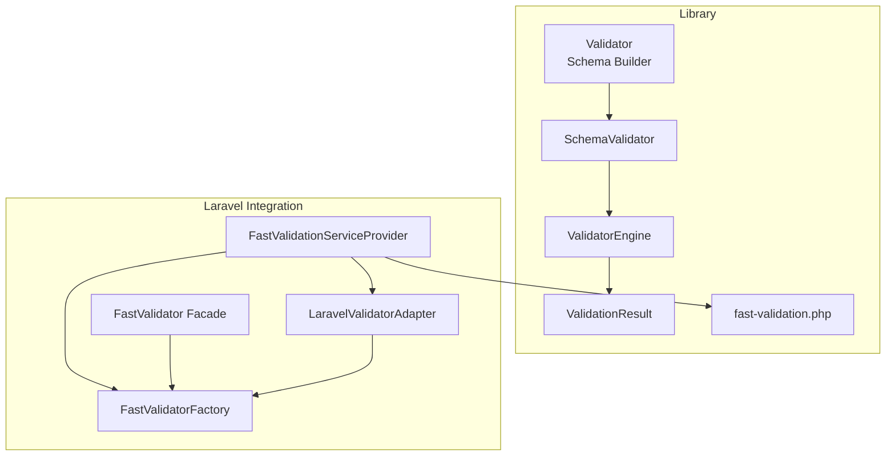
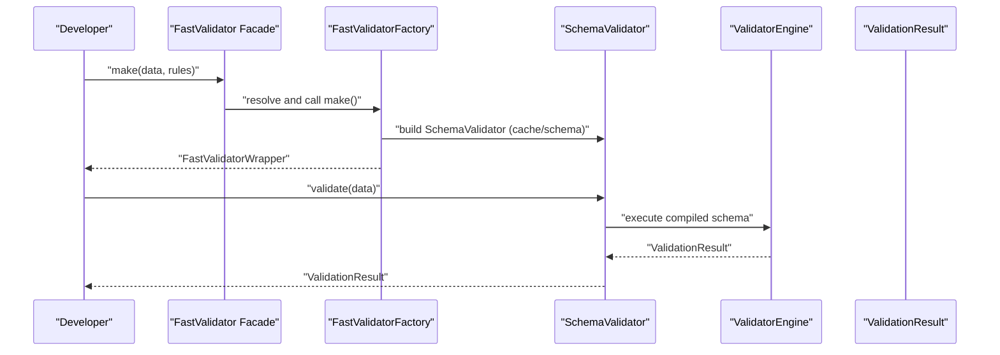
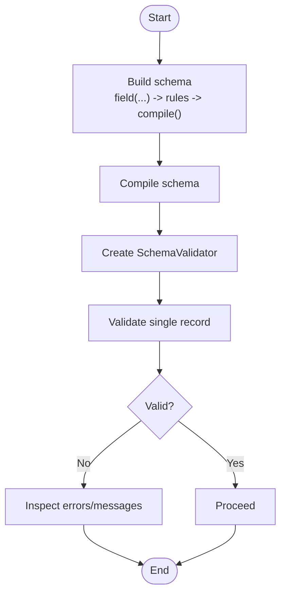
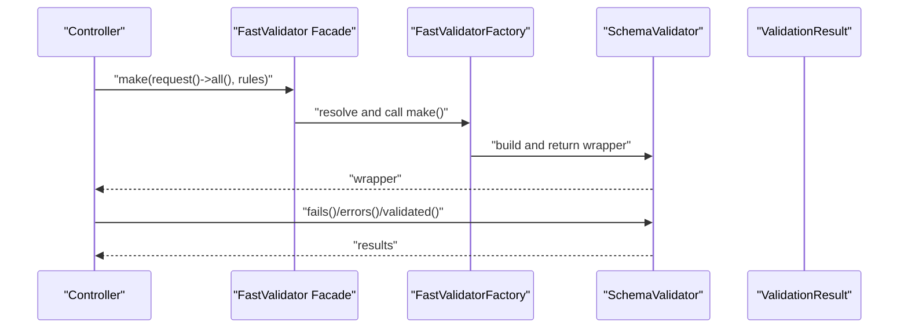
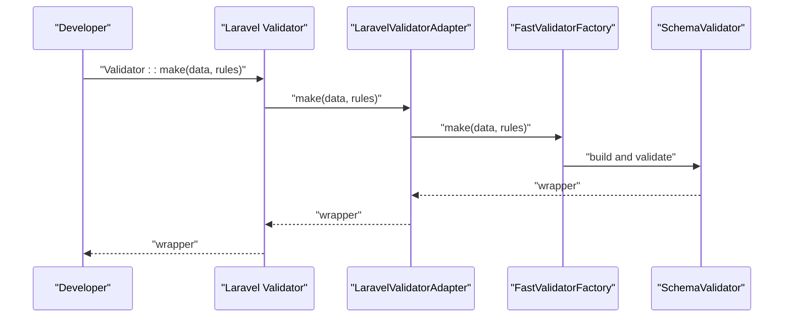
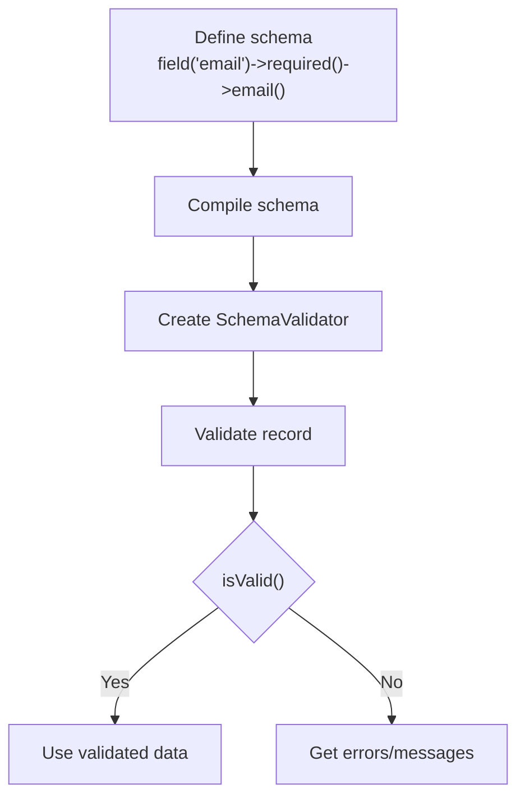
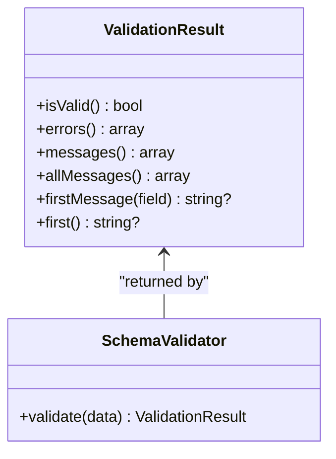
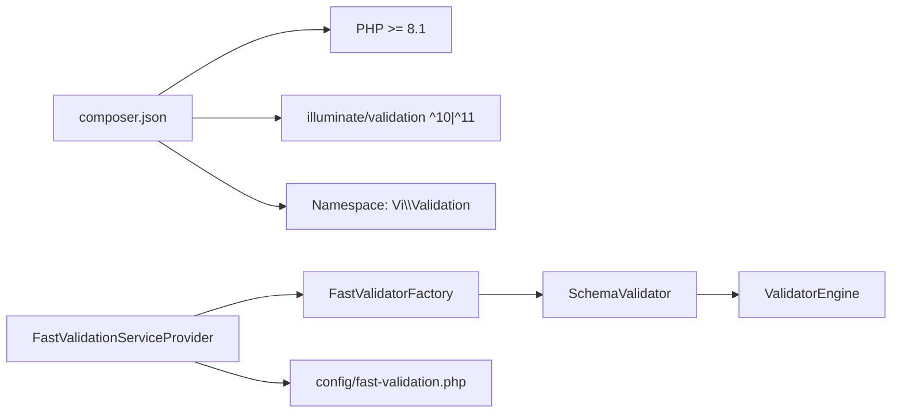

# Getting Started

<cite>
**Referenced Files in This Document**
- [README.md](file://README.md)
- [composer.json](file://composer.json)
- [config/fast-validation.php](file://config/fast-validation.php)
- [src/Laravel/FastValidationServiceProvider.php](file://src/Laravel/FastValidationServiceProvider.php)
- [src/Laravel/Facades/FastValidator.php](file://src/Laravel/Facades/FastValidator.php)
- [src/Laravel/FastValidatorFactory.php](file://src/Laravel/FastValidatorFactory.php)
- [src/Laravel/LaravelValidatorAdapter.php](file://src/Laravel/LaravelValidatorAdapter.php)
- [src/Validator.php](file://src/Validator.php)
- [src/Schema/SchemaBuilder.php](file://src/Schema/SchemaBuilder.php)
- [src/Schema/FieldDefinition.php](file://src/Schema/FieldDefinition.php)
- [src/SchemaValidator.php](file://src/SchemaValidator.php)
- [src/Execution/ValidationResult.php](file://src/Execution/ValidationResult.php)
- [src/Execution/ValidatorEngine.php](file://src/Execution/ValidatorEngine.php)
</cite>

## Table of Contents
1. [Introduction](#introduction)
2. [Project Structure](#project-structure)
3. [Core Components](#core-components)
4. [Architecture Overview](#architecture-overview)
5. [Detailed Component Analysis](#detailed-component-analysis)
6. [Dependency Analysis](#dependency-analysis)
7. [Performance Considerations](#performance-considerations)
8. [Troubleshooting Guide](#troubleshooting-guide)
9. [Conclusion](#conclusion)
10. [Appendices](#appendices)

## Introduction
This guide helps you quickly install and use the vi/validation library in both standalone PHP and Laravel applications. It covers environment requirements, Composer installation, Laravel service provider registration, configuration setup, and the fastest paths to validation. You will learn how to define schemas, validate single records, handle errors, and understand the differences between parallel and override modes in Laravel.

## Project Structure
At a high level, the library provides:
- A standalone validator with schema compilation and execution
- A Laravel integration that registers a service provider and optional override adapter
- A configuration file for mode selection and performance tuning
- Extensive rule support and message/localization systems

**Diagram sources**
- [src/Validator.php](file://src/Validator.php#L9-L15)
- [src/Schema/SchemaBuilder.php](file://src/Schema/SchemaBuilder.php#L9-L35)
- [src/SchemaValidator.php](file://src/SchemaValidator.php#L13-L30)
- [src/Execution/ValidatorEngine.php](file://src/Execution/ValidatorEngine.php#L11-L31)
- [src/Execution/ValidationResult.php](file://src/Execution/ValidationResult.php#L9-L32)
- [config/fast-validation.php](file://config/fast-validation.php#L5-L15)
- [src/Laravel/FastValidationServiceProvider.php](file://src/Laravel/FastValidationServiceProvider.php#L12-L52)
- [src/Laravel/FastValidatorFactory.php](file://src/Laravel/FastValidatorFactory.php#L19-L41)
- [src/Laravel/Facades/FastValidator.php](file://src/Laravel/Facades/FastValidator.php#L16-L22)
- [src/Laravel/LaravelValidatorAdapter.php](file://src/Laravel/LaravelValidatorAdapter.php#L9-L34)

**Section sources**
- [README.md](file://README.md#L1-L28)
- [composer.json](file://composer.json#L1-L36)

## Core Components
- Validator: Static entry point to build schemas.
- SchemaBuilder: Fluent DSL to define fields and rules.
- SchemaValidator: Executes compiled schemas against data.
- ValidatorEngine: Core execution engine with performance controls.
- ValidationResult: Encapsulates validation outcome and messages.
- Laravel integration: Service provider, factory, facade, and optional override adapter.

**Section sources**
- [src/Validator.php](file://src/Validator.php#L9-L15)
- [src/Schema/SchemaBuilder.php](file://src/Schema/SchemaBuilder.php#L9-L35)
- [src/SchemaValidator.php](file://src/SchemaValidator.php#L13-L30)
- [src/Execution/ValidatorEngine.php](file://src/Execution/ValidatorEngine.php#L11-L31)
- [src/Execution/ValidationResult.php](file://src/Execution/ValidationResult.php#L9-L32)

## Architecture Overview
The library separates schema definition from execution. In standalone mode, you compile a schema once and reuse it many times. In Laravel, you can either use the explicit factory/facade (parallel mode) or transparently replace Laravel’s validator (override mode).

**Diagram sources**
- [src/Laravel/Facades/FastValidator.php](file://src/Laravel/Facades/FastValidator.php#L16-L22)
- [src/Laravel/FastValidatorFactory.php](file://src/Laravel/FastValidatorFactory.php#L51-L60)
- [src/SchemaValidator.php](file://src/SchemaValidator.php#L54-L73)
- [src/Execution/ValidatorEngine.php](file://src/Execution/ValidatorEngine.php#L33-L98)
- [src/Execution/ValidationResult.php](file://src/Execution/ValidationResult.php#L22-L32)

## Detailed Component Analysis

### Environment Requirements and Installation
- PHP: >= 8.1
- Composer: Required for autoloading and dependency management
- Laravel integration (optional): illuminate/validation ^10.0 | ^11.0

Installation via Composer:
- Add the package to your project using Composer.
- PSR-4 autoload maps the namespace to the src directory.

Verification:
- Confirm the package is installed and autoloaded.
- In Laravel, confirm auto-discovery or manual provider registration.

**Section sources**
- [README.md](file://README.md#L8-L27)
- [composer.json](file://composer.json#L6-L14)

### Laravel Service Provider Registration
- Auto-discovery: Laravel registers the provider and alias automatically.
- Manual registration: Add the provider and alias to config/app.php if needed.

Effects:
- Registers a singleton factory for fast validators.
- Publishes the configuration file.
- Optionally overrides Laravel’s validator factory in override mode.

**Section sources**
- [README.md](file://README.md#L381-L406)
- [composer.json](file://composer.json#L23-L31)
- [src/Laravel/FastValidationServiceProvider.php](file://src/Laravel/FastValidationServiceProvider.php#L14-L30)

### Configuration Setup
- Publish the configuration file to config/fast-validation.php.
- Choose mode:
  - parallel: Use the fast validator explicitly via the factory/facade.
  - override: Route Laravel’s Validator::make() through the fast engine when supported.
- Additional options include cache driver, TTL, precompilation, performance tuning, localization, and runtime pooling.

**Section sources**
- [README.md](file://README.md#L408-L448)
- [config/fast-validation.php](file://config/fast-validation.php#L5-L96)

### Quick Path: Standalone PHP Usage
- Build a schema using the fluent builder.
- Compile the schema.
- Create a SchemaValidator and validate a single record.
- Inspect errors and messages from the ValidationResult.

**Diagram sources**
- [src/Validator.php](file://src/Validator.php#L11-L14)
- [src/Schema/SchemaBuilder.php](file://src/Schema/SchemaBuilder.php#L31-L34)
- [src/SchemaValidator.php](file://src/SchemaValidator.php#L54-L73)
- [src/Execution/ValidationResult.php](file://src/Execution/ValidationResult.php#L59-L62)

**Section sources**
- [README.md](file://README.md#L30-L51)

### Quick Path: Laravel Integration (Parallel Mode)
- Resolve the factory from the container or use the facade.
- Call make(data, rules) to get a validator wrapper.
- Check fails() and retrieve errors() or validated() data.

**Diagram sources**
- [src/Laravel/Facades/FastValidator.php](file://src/Laravel/Facades/FastValidator.php#L16-L22)
- [src/Laravel/FastValidatorFactory.php](file://src/Laravel/FastValidatorFactory.php#L51-L60)
- [src/SchemaValidator.php](file://src/SchemaValidator.php#L54-L73)
- [src/Execution/ValidationResult.php](file://src/Execution/ValidationResult.php#L59-L62)

**Section sources**
- [README.md](file://README.md#L53-L94)

### Quick Path: Laravel Integration (Override Mode)
- Set mode to override in the configuration.
- Use Laravel’s Validator::make() as usual; the adapter routes supported rules to the fast engine.
- Unsupported rules fall back to Laravel’s original validator.

**Diagram sources**
- [config/fast-validation.php](file://config/fast-validation.php#L15)
- [src/Laravel/FastValidationServiceProvider.php](file://src/Laravel/FastValidationServiceProvider.php#L38-L52)
- [src/Laravel/LaravelValidatorAdapter.php](file://src/Laravel/LaravelValidatorAdapter.php#L27-L34)
- [src/Laravel/FastValidatorFactory.php](file://src/Laravel/FastValidatorFactory.php#L51-L60)
- [src/SchemaValidator.php](file://src/SchemaValidator.php#L54-L73)

**Section sources**
- [README.md](file://README.md#L486-L506)

### Basic Schema Definition and Single Record Validation
- Define fields and rules using the fluent builder.
- Compile the schema once.
- Validate a single record and inspect errors/messages.

**Diagram sources**
- [src/Schema/FieldDefinition.php](file://src/Schema/FieldDefinition.php#L24-L175)
- [src/Schema/SchemaBuilder.php](file://src/Schema/SchemaBuilder.php#L31-L34)
- [src/SchemaValidator.php](file://src/SchemaValidator.php#L54-L73)
- [src/Execution/ValidationResult.php](file://src/Execution/ValidationResult.php#L59-L96)

**Section sources**
- [README.md](file://README.md#L107-L159)

### Error Handling
- Use ValidationResult to check validity and retrieve structured errors.
- Access formatted messages, flattened messages, first message per field, or the first error overall.
- In Laravel, use the wrapper’s methods to access errors and validated data.

**Diagram sources**
- [src/Execution/ValidationResult.php](file://src/Execution/ValidationResult.php#L59-L128)
- [src/SchemaValidator.php](file://src/SchemaValidator.php#L54-L73)

**Section sources**
- [README.md](file://README.md#L126-L159)
- [src/Execution/ValidationResult.php](file://src/Execution/ValidationResult.php#L59-L128)

### Difference Between Parallel and Override Modes
- Parallel mode: Explicitly use the fast validator via the factory/facade. Laravel’s Validator::make() remains unchanged.
- Override mode: The adapter intercepts Laravel’s validator factory and routes supported rules to the fast engine; unsupported rules fall back to Laravel’s original validator.

Practical impact:
- Parallel mode gives you full control and visibility.
- Override mode allows drop-in replacement for existing Laravel validation code, with caveats about supported rules.

**Section sources**
- [README.md](file://README.md#L432-L506)
- [config/fast-validation.php](file://config/fast-validation.php#L15)
- [src/Laravel/FastValidationServiceProvider.php](file://src/Laravel/FastValidationServiceProvider.php#L38-L52)
- [src/Laravel/LaravelValidatorAdapter.php](file://src/Laravel/LaravelValidatorAdapter.php#L27-L34)

## Dependency Analysis
- Composer requires PHP >= 8.1 and illuminate/validation ^10.0|^11.0.
- Laravel integration registers the provider and alias via extra metadata.
- The service provider binds the factory and optionally adapts Laravel’s validator.

**Diagram sources**
- [composer.json](file://composer.json#L6-L14)
- [composer.json](file://composer.json#L23-L31)
- [src/Laravel/FastValidationServiceProvider.php](file://src/Laravel/FastValidationServiceProvider.php#L14-L30)
- [config/fast-validation.php](file://config/fast-validation.php#L5-L15)

**Section sources**
- [composer.json](file://composer.json#L6-L31)
- [src/Laravel/FastValidationServiceProvider.php](file://src/Laravel/FastValidationServiceProvider.php#L14-L30)

## Performance Considerations
- Prefer streaming APIs for large datasets to avoid memory spikes.
- Use fail-fast and max-errors settings to tune response time and resource usage.
- Consider schema caching and precompilation for production.

[No sources needed since this section provides general guidance]

## Troubleshooting Guide
- If Laravel’s Validator::make() does not behave as expected in override mode, verify the mode setting and review supported rules.
- If errors are missing or unexpected, check the ValidationResult methods for structured errors versus formatted messages.
- For Laravel, ensure the service provider is registered and the configuration file is published.

**Section sources**
- [README.md](file://README.md#L486-L506)
- [config/fast-validation.php](file://config/fast-validation.php#L15)
- [src/Execution/ValidationResult.php](file://src/Execution/ValidationResult.php#L59-L96)

## Conclusion
You can start validating quickly with vi/validation in standalone PHP or Laravel. In Laravel, choose parallel mode for explicit control or override mode for drop-in replacement. Use the provided configuration to tailor performance and behavior, and leverage streaming APIs for large-scale validation tasks.

[No sources needed since this section summarizes without analyzing specific files]

## Appendices

### Initial Setup Verification Checklist
- Composer install completed and autoload loaded.
- Laravel provider registered (auto or manual).
- Configuration published and mode selected.
- Basic validation runs and returns expected results.

**Section sources**
- [README.md](file://README.md#L16-L27)
- [README.md](file://README.md#L381-L406)
- [README.md](file://README.md#L408-L417)