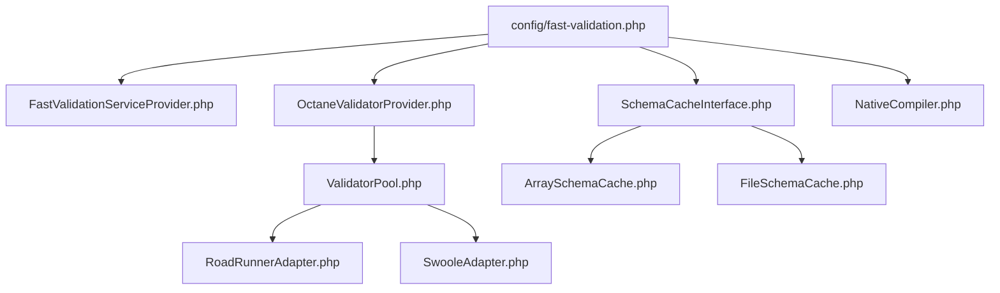
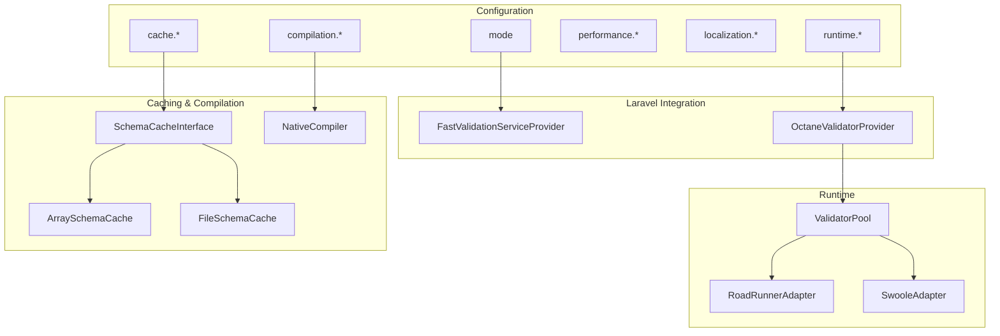
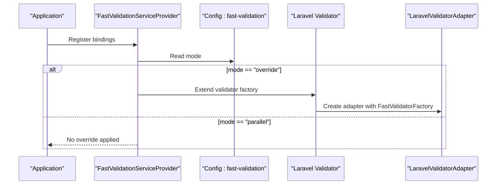
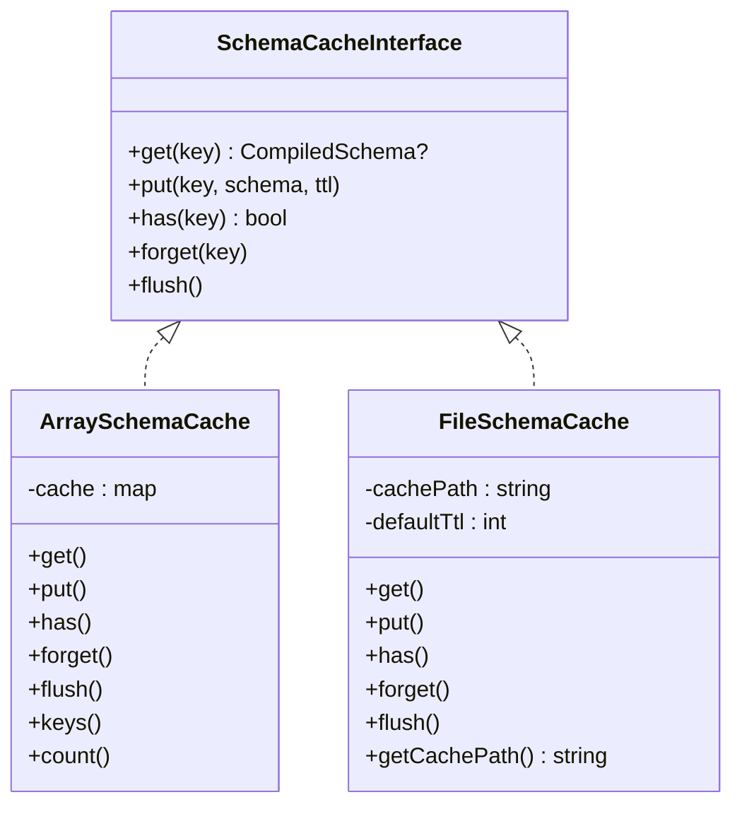
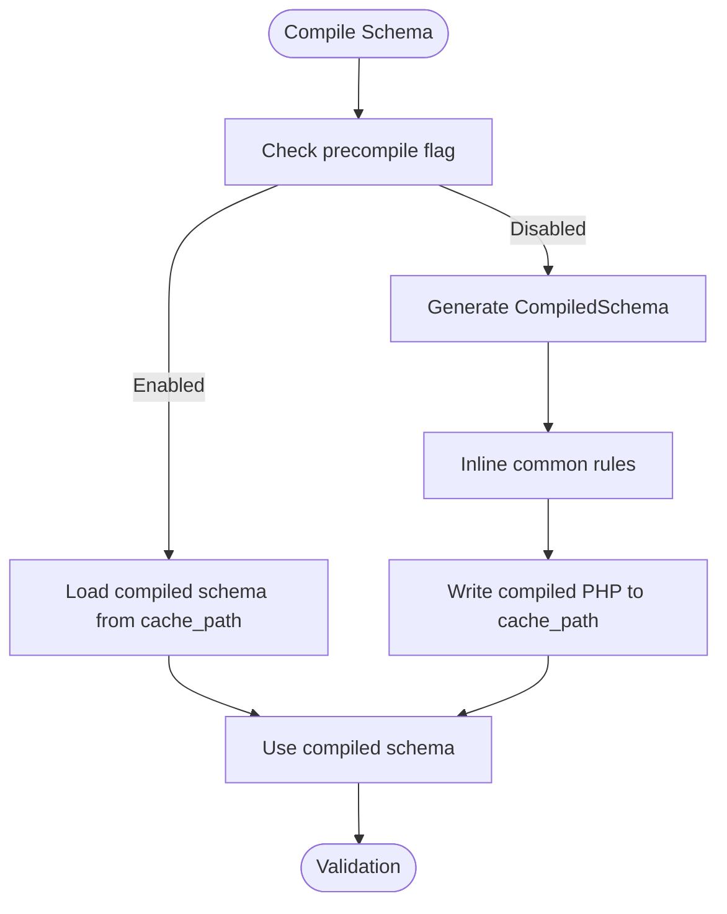
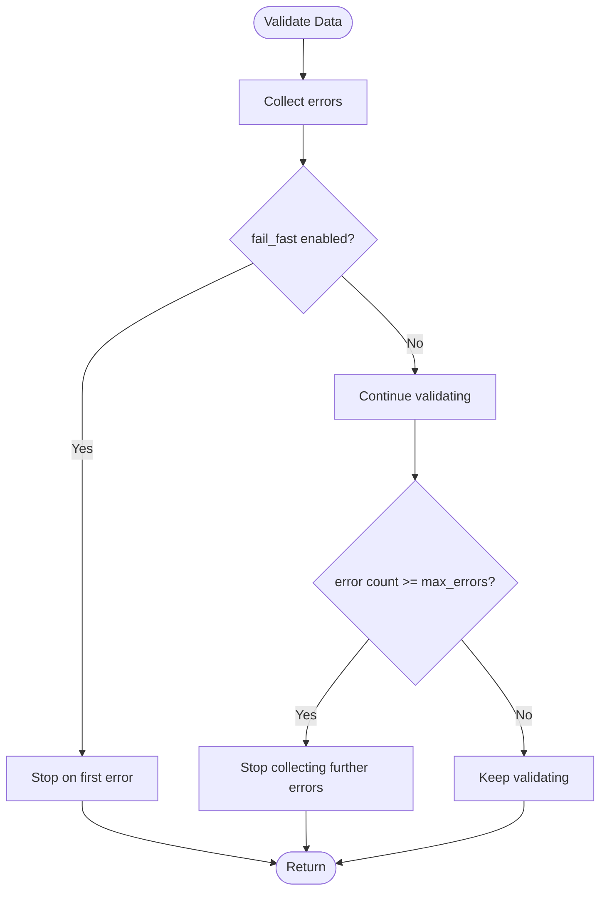
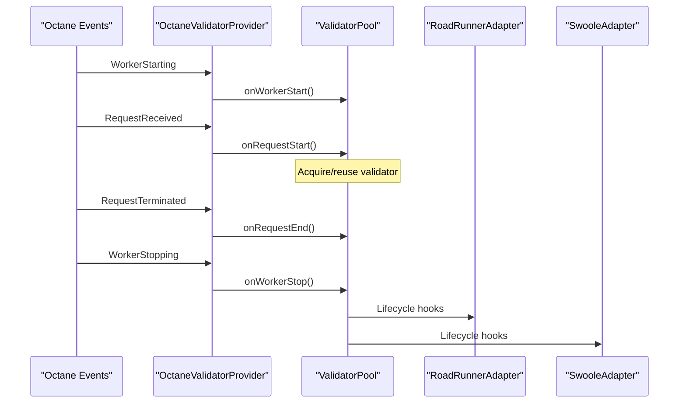
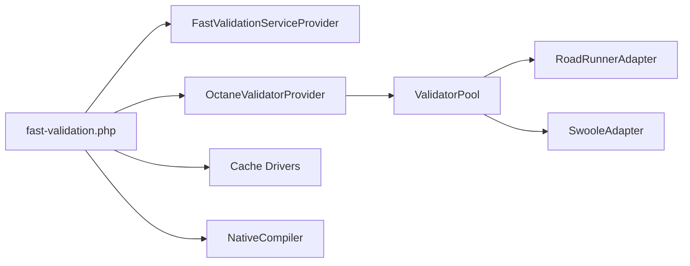

# Configuration Options

<cite>
**Referenced Files in This Document**
- [fast-validation.php](file://config/fast-validation.php)
- [FastValidationServiceProvider.php](file://src/Laravel/FastValidationServiceProvider.php)
- [OctaneValidatorProvider.php](file://src/Laravel/Octane/OctaneValidatorProvider.php)
- [ValidatorPool.php](file://src/Runtime/ValidatorPool.php)
- [RoadRunnerAdapter.php](file://src/Runtime/Workers/RoadRunnerAdapter.php)
- [SwooleAdapter.php](file://src/Runtime/Workers/SwooleAdapter.php)
- [ArraySchemaCache.php](file://src/Cache/ArraySchemaCache.php)
- [FileSchemaCache.php](file://src/Cache/FileSchemaCache.php)
- [SchemaCacheInterface.php](file://src/Cache/SchemaCacheInterface.php)
- [NativeCompiler.php](file://src/Compilation/NativeCompiler.php)
- [ErrorCollector.php](file://src/Execution/ErrorCollector.php)
- [composer.json](file://composer.json)
</cite>

## Table of Contents
1. [Introduction](#introduction)
2. [Project Structure](#project-structure)
3. [Core Components](#core-components)
4. [Architecture Overview](#architecture-overview)
5. [Detailed Component Analysis](#detailed-component-analysis)
6. [Dependency Analysis](#dependency-analysis)
7. [Performance Considerations](#performance-considerations)
8. [Troubleshooting Guide](#troubleshooting-guide)
9. [Conclusion](#conclusion)
10. [Appendices](#appendices)

## Introduction
This document explains all configuration options for the Laravel integration of the fast-validation package. It covers mode selection (parallel vs override), cache configuration, compilation settings, performance tuning, runtime pooling for long-running environments (Octane, Swoole, RoadRunner), localization, and environment variable overrides. Practical examples, configuration precedence, defaults, and troubleshooting guidance are included to help deploy reliably across development, staging, and production environments.

## Project Structure
The configuration is centralized in a single Laravel configuration file and consumed by the service providers and runtime adapters. The key areas are:
- Configuration file defining all options and environment variable overrides
- Service provider registering the validator factory and optionally overriding Laravel’s validator
- Octane provider wiring lifecycle hooks for long-running processes
- Runtime adapters and validator pool for pooling and lifecycle management
- Cache drivers for compiled schema caching
- Compilation settings for precompiling validation schemas

**Diagram sources**
- [fast-validation.php](file://config/fast-validation.php#L1-L97)
- [FastValidationServiceProvider.php](file://src/Laravel/FastValidationServiceProvider.php#L14-L52)
- [OctaneValidatorProvider.php](file://src/Laravel/Octane/OctaneValidatorProvider.php#L20-L66)
- [ValidatorPool.php](file://src/Runtime/ValidatorPool.php#L12-L24)
- [RoadRunnerAdapter.php](file://src/Runtime/Workers/RoadRunnerAdapter.php#L13-L21)
- [SwooleAdapter.php](file://src/Runtime/Workers/SwooleAdapter.php#L13-L23)
- [SchemaCacheInterface.php](file://src/Cache/SchemaCacheInterface.php#L9-L35)
- [ArraySchemaCache.php](file://src/Cache/ArraySchemaCache.php#L9-L29)
- [FileSchemaCache.php](file://src/Cache/FileSchemaCache.php#L9-L22)
- [NativeCompiler.php](file://src/Compilation/NativeCompiler.php#L17-L51)

**Section sources**
- [fast-validation.php](file://config/fast-validation.php#L1-L97)
- [FastValidationServiceProvider.php](file://src/Laravel/FastValidationServiceProvider.php#L14-L52)
- [OctaneValidatorProvider.php](file://src/Laravel/Octane/OctaneValidatorProvider.php#L20-L66)
- [ValidatorPool.php](file://src/Runtime/ValidatorPool.php#L12-L24)
- [RoadRunnerAdapter.php](file://src/Runtime/Workers/RoadRunnerAdapter.php#L13-L21)
- [SwooleAdapter.php](file://src/Runtime/Workers/SwooleAdapter.php#L13-L23)
- [SchemaCacheInterface.php](file://src/Cache/SchemaCacheInterface.php#L9-L35)
- [ArraySchemaCache.php](file://src/Cache/ArraySchemaCache.php#L9-L29)
- [FileSchemaCache.php](file://src/Cache/FileSchemaCache.php#L9-L22)
- [NativeCompiler.php](file://src/Compilation/NativeCompiler.php#L17-L51)

## Core Components
This section documents all configuration parameters and their behavior, including environment variable overrides, defaults, and how they influence runtime behavior.

- Validation Mode
  - Key: mode
  - Values: parallel, override
  - Behavior: parallel keeps Laravel’s Validator::make unchanged; override routes Laravel’s validator through the fast engine via a factory adapter.
  - Defaults and overrides: see [fast-validation.php](file://config/fast-validation.php#L15)
  - Boot-time effect: see [FastValidationServiceProvider.php](file://src/Laravel/FastValidationServiceProvider.php#L38-L52)

- Cache Configuration
  - Keys: cache.enabled, cache.driver, cache.ttl, cache.path
  - Drivers: array, file
  - Defaults and overrides: see [fast-validation.php](file://config/fast-validation.php#L26-L31)
  - Implementation: array driver in-memory cache; file driver persists serialized schemas to disk with TTL handling.
  - Interfaces and drivers: [SchemaCacheInterface.php](file://src/Cache/SchemaCacheInterface.php#L9-L35), [ArraySchemaCache.php](file://src/Cache/ArraySchemaCache.php#L9-L29), [FileSchemaCache.php](file://src/Cache/FileSchemaCache.php#L9-L22)

- Compilation Configuration
  - Keys: compilation.precompile, compilation.cache_path
  - Behavior: precompile enables generating optimized compiled schema files for production.
  - Defaults and overrides: see [fast-validation.php](file://config/fast-validation.php#L41-L44)
  - Implementation: native compiler generates optimized PHP code per schema; see [NativeCompiler.php](file://src/Compilation/NativeCompiler.php#L17-L51)

- Performance Options
  - Keys: performance.fail_fast, performance.max_errors, performance.fast_path_rules
  - Behavior: fail_fast stops validation on first error; max_errors caps collected errors; fast_path_rules enables inlining of common rules.
  - Defaults and overrides: see [fast-validation.php](file://config/fast-validation.php#L54-L63)
  - Implementation: error collection and bail logic are handled during validation; see [ErrorCollector.php](file://src/Execution/ErrorCollector.php#L7-L25)

- Localization
  - Keys: localization.locale, localization.fallback_locale
  - Defaults and overrides: see [fast-validation.php](file://config/fast-validation.php#L73-L76)

- Long-running Process Support (Octane, Swoole, RoadRunner)
  - Keys: runtime.pooling, runtime.pool_size, runtime.auto_detect
  - Behavior: pooling reuses validator instances across requests; pool_size controls maximum pool size; auto_detect enables environment detection.
  - Defaults and overrides: see [fast-validation.php](file://config/fast-validation.php#L86-L95)
  - Wiring: Octane provider registers lifecycle listeners and creates the pool; see [OctaneValidatorProvider.php](file://src/Laravel/Octane/OctaneValidatorProvider.php#L20-L66)
  - Lifecycle: validator pool manages warm-up, acquire/release, and cleanup; see [ValidatorPool.php](file://src/Runtime/ValidatorPool.php#L12-L90)
  - Environment detection helpers: RoadRunner and Swoole adapters include environment checks; see [RoadRunnerAdapter.php](file://src/Runtime/Workers/RoadRunnerAdapter.php#L69-L75), [SwooleAdapter.php](file://src/Runtime/Workers/SwooleAdapter.php#L63-L93)

Configuration precedence and environment variable overrides
- All top-level keys support environment variable overrides via env() with sensible defaults embedded in the configuration file.
- Example: FAST_VALIDATION_MODE, FAST_VALIDATION_CACHE, FAST_VALIDATION_CACHE_DRIVER, FAST_VALIDATION_CACHE_TTL, FAST_VALIDATION_PRECOMPILE, FAST_VALIDATION_FAIL_FAST, FAST_VALIDATION_MAX_ERRORS, FAST_VALIDATION_FAST_PATH, FAST_VALIDATION_LOCALE, FAST_VALIDATION_FALLBACK_LOCALE, FAST_VALIDATION_POOLING, FAST_VALIDATION_POOL_SIZE, FAST_VALIDATION_AUTO_DETECT.

Defaults summary
- mode: parallel
- cache.enabled: true
- cache.driver: array
- cache.ttl: 3600
- cache.path: storage_path('framework/validation/cache')
- compilation.precompile: false
- compilation.cache_path: storage_path('framework/validation/compiled')
- performance.fail_fast: false
- performance.max_errors: 100
- performance.fast_path_rules: true
- localization.locale: en
- localization.fallback_locale: en
- runtime.pooling: false
- runtime.pool_size: 10
- runtime.auto_detect: true

**Section sources**
- [fast-validation.php](file://config/fast-validation.php#L15-L95)
- [FastValidationServiceProvider.php](file://src/Laravel/FastValidationServiceProvider.php#L38-L52)
- [OctaneValidatorProvider.php](file://src/Laravel/Octane/OctaneValidatorProvider.php#L20-L66)
- [ValidatorPool.php](file://src/Runtime/ValidatorPool.php#L12-L90)
- [RoadRunnerAdapter.php](file://src/Runtime/Workers/RoadRunnerAdapter.php#L69-L75)
- [SwooleAdapter.php](file://src/Runtime/Workers/SwooleAdapter.php#L63-L93)
- [SchemaCacheInterface.php](file://src/Cache/SchemaCacheInterface.php#L9-L35)
- [ArraySchemaCache.php](file://src/Cache/ArraySchemaCache.php#L9-L29)
- [FileSchemaCache.php](file://src/Cache/FileSchemaCache.php#L9-L22)
- [NativeCompiler.php](file://src/Compilation/NativeCompiler.php#L17-L51)
- [ErrorCollector.php](file://src/Execution/ErrorCollector.php#L7-L25)

## Architecture Overview
The configuration influences three major subsystems: validation mode, caching/compilation, and runtime pooling/lifecycle.

**Diagram sources**
- [fast-validation.php](file://config/fast-validation.php#L15-L95)
- [FastValidationServiceProvider.php](file://src/Laravel/FastValidationServiceProvider.php#L38-L52)
- [OctaneValidatorProvider.php](file://src/Laravel/Octane/OctaneValidatorProvider.php#L20-L66)
- [ValidatorPool.php](file://src/Runtime/ValidatorPool.php#L12-L90)
- [RoadRunnerAdapter.php](file://src/Runtime/Workers/RoadRunnerAdapter.php#L13-L21)
- [SwooleAdapter.php](file://src/Runtime/Workers/SwooleAdapter.php#L13-L23)
- [SchemaCacheInterface.php](file://src/Cache/SchemaCacheInterface.php#L9-L35)
- [ArraySchemaCache.php](file://src/Cache/ArraySchemaCache.php#L9-L29)
- [FileSchemaCache.php](file://src/Cache/FileSchemaCache.php#L9-L22)
- [NativeCompiler.php](file://src/Compilation/NativeCompiler.php#L17-L51)

## Detailed Component Analysis

### Validation Mode: Parallel vs Override
- parallel: Keeps Laravel’s Validator::make intact; use the fast engine via the dedicated facade or factory.
- override: Extends the framework validator to route through the fast engine automatically.
- Boot-time selection: The service provider reads the mode and conditionally wraps the validator factory.

**Diagram sources**
- [FastValidationServiceProvider.php](file://src/Laravel/FastValidationServiceProvider.php#L38-L52)
- [fast-validation.php](file://config/fast-validation.php#L15)

**Section sources**
- [FastValidationServiceProvider.php](file://src/Laravel/FastValidationServiceProvider.php#L38-L52)
- [fast-validation.php](file://config/fast-validation.php#L15)

### Cache Configuration
- Enabled by default; array driver suitable for single-worker processes; file driver for multi-process or persistent caches.
- TTL controls expiration; path determines file cache location.
- Cache interface defines get/put/has/forget/flush semantics; implementations provided for array and file.

**Diagram sources**
- [SchemaCacheInterface.php](file://src/Cache/SchemaCacheInterface.php#L9-L35)
- [ArraySchemaCache.php](file://src/Cache/ArraySchemaCache.php#L9-L74)
- [FileSchemaCache.php](file://src/Cache/FileSchemaCache.php#L9-L107)

**Section sources**
- [fast-validation.php](file://config/fast-validation.php#L26-L31)
- [SchemaCacheInterface.php](file://src/Cache/SchemaCacheInterface.php#L9-L35)
- [ArraySchemaCache.php](file://src/Cache/ArraySchemaCache.php#L9-L74)
- [FileSchemaCache.php](file://src/Cache/FileSchemaCache.php#L9-L107)

### Compilation Configuration
- Precompile toggles generation of optimized compiled schema files for production.
- Cache path stores compiled artifacts.
- Native compiler generates optimized PHP code per schema and includes a compiler version in generated keys.

**Diagram sources**
- [fast-validation.php](file://config/fast-validation.php#L41-L44)
- [NativeCompiler.php](file://src/Compilation/NativeCompiler.php#L17-L51)

**Section sources**
- [fast-validation.php](file://config/fast-validation.php#L41-L44)
- [NativeCompiler.php](file://src/Compilation/NativeCompiler.php#L17-L51)

### Performance Tuning
- fail_fast: Stops validation on first error to reduce overhead.
- max_errors: Caps the number of errors collected.
- fast_path_rules: Enables inlining of common rules to minimize method calls.

**Diagram sources**
- [fast-validation.php](file://config/fast-validation.php#L54-L63)
- [ErrorCollector.php](file://src/Execution/ErrorCollector.php#L7-L25)

**Section sources**
- [fast-validation.php](file://config/fast-validation.php#L54-L63)
- [ErrorCollector.php](file://src/Execution/ErrorCollector.php#L7-L25)

### Localization
- locale and fallback_locale control message resolution.
- Defaults are set to English; override via environment variables.

**Section sources**
- [fast-validation.php](file://config/fast-validation.php#L73-L76)

### Runtime Pooling and Long-running Environments
- pooling enables validator instance reuse; pool_size sets the maximum pool size.
- auto_detect helps optimize behavior in Octane, Swoole, and RoadRunner.
- Octane provider wires worker/request lifecycle events to warm and clean up pools.
- Adapters detect environments and manage request state cleanup.

**Diagram sources**
- [OctaneValidatorProvider.php](file://src/Laravel/Octane/OctaneValidatorProvider.php#L44-L66)
- [ValidatorPool.php](file://src/Runtime/ValidatorPool.php#L26-L90)
- [RoadRunnerAdapter.php](file://src/Runtime/Workers/RoadRunnerAdapter.php#L23-L49)
- [SwooleAdapter.php](file://src/Runtime/Workers/SwooleAdapter.php#L25-L52)

**Section sources**
- [fast-validation.php](file://config/fast-validation.php#L86-L95)
- [OctaneValidatorProvider.php](file://src/Laravel/Octane/OctaneValidatorProvider.php#L20-L66)
- [ValidatorPool.php](file://src/Runtime/ValidatorPool.php#L12-L90)
- [RoadRunnerAdapter.php](file://src/Runtime/Workers/RoadRunnerAdapter.php#L69-L75)
- [SwooleAdapter.php](file://src/Runtime/Workers/SwooleAdapter.php#L63-L93)

## Dependency Analysis
- The service provider depends on the configuration to decide whether to override Laravel’s validator.
- The Octane provider depends on runtime configuration to size and manage the validator pool.
- Cache and compilation depend on configuration keys to select drivers and paths.
- Adapters depend on environment detection to adapt lifecycle behavior.

**Diagram sources**
- [fast-validation.php](file://config/fast-validation.php#L15-L95)
- [FastValidationServiceProvider.php](file://src/Laravel/FastValidationServiceProvider.php#L38-L52)
- [OctaneValidatorProvider.php](file://src/Laravel/Octane/OctaneValidatorProvider.php#L20-L66)
- [ValidatorPool.php](file://src/Runtime/ValidatorPool.php#L12-L90)
- [RoadRunnerAdapter.php](file://src/Runtime/Workers/RoadRunnerAdapter.php#L13-L21)
- [SwooleAdapter.php](file://src/Runtime/Workers/SwooleAdapter.php#L13-L23)

**Section sources**
- [fast-validation.php](file://config/fast-validation.php#L15-L95)
- [FastValidationServiceProvider.php](file://src/Laravel/FastValidationServiceProvider.php#L38-L52)
- [OctaneValidatorProvider.php](file://src/Laravel/Octane/OctaneValidatorProvider.php#L20-L66)
- [ValidatorPool.php](file://src/Runtime/ValidatorPool.php#L12-L90)
- [RoadRunnerAdapter.php](file://src/Runtime/Workers/RoadRunnerAdapter.php#L13-L21)
- [SwooleAdapter.php](file://src/Runtime/Workers/SwooleAdapter.php#L13-L23)

## Performance Considerations
- Prefer parallel mode for gradual adoption and safer migration.
- Enable precompile in production to reduce JIT compilation overhead.
- Use file cache for multi-process deployments; array cache for single-worker dev/staging.
- Tune pool_size according to concurrency and memory footprint; monitor worker lifecycle events.
- Enable fail_fast for latency-sensitive endpoints; disable for comprehensive error reporting.
- Limit max_errors to bound memory usage when validating large payloads.

[No sources needed since this section provides general guidance]

## Troubleshooting Guide
Common issues and remedies:
- Unexpected slow validation
  - Verify precompile is enabled in production and cache path is writable.
  - Check fast_path_rules setting and ensure supported rules are used.
- Memory growth in long-running workers
  - Confirm pooling is enabled and pool_size is appropriate.
  - Ensure environment adapters are active and request state is cleared.
- Cache misses or stale schemas
  - Validate cache.enabled and cache.driver settings.
  - For file driver, confirm cache path permissions and TTL.
- Overriding Laravel validator unexpectedly
  - Review mode setting; ensure override is intended.
- Octane lifecycle leaks
  - Confirm WorkerStarting/WorkerStopping and RequestReceived/RequestTerminated handlers are firing.

**Section sources**
- [fast-validation.php](file://config/fast-validation.php#L15-L95)
- [OctaneValidatorProvider.php](file://src/Laravel/Octane/OctaneValidatorProvider.php#L44-L66)
- [ValidatorPool.php](file://src/Runtime/ValidatorPool.php#L26-L90)
- [RoadRunnerAdapter.php](file://src/Runtime/Workers/RoadRunnerAdapter.php#L77-L87)
- [SwooleAdapter.php](file://src/Runtime/Workers/SwooleAdapter.php#L89-L93)
- [ArraySchemaCache.php](file://src/Cache/ArraySchemaCache.php#L31-L44)
- [FileSchemaCache.php](file://src/Cache/FileSchemaCache.php#L24-L54)

## Conclusion
The fast-validation configuration offers a pragmatic balance between performance and safety. Use parallel mode for controlled adoption, enable precompile and file caching in production, tune pooling for long-running environments, and leverage performance flags to meet latency and throughput goals. Environment variables allow flexible deployment-specific overrides without changing code.

[No sources needed since this section summarizes without analyzing specific files]

## Appendices

### Configuration Reference and Examples
- Mode selection
  - parallel: Use the fast engine opt-in via facade/factory.
  - override: Route all Laravel validator calls through the fast engine.
  - See [fast-validation.php](file://config/fast-validation.php#L15) and [FastValidationServiceProvider.php](file://src/Laravel/FastValidationServiceProvider.php#L38-L52)

- Cache configuration
  - Array cache for single-worker; file cache for multi-process.
  - See [fast-validation.php](file://config/fast-validation.php#L26-L31), [ArraySchemaCache.php](file://src/Cache/ArraySchemaCache.php#L9-L29), [FileSchemaCache.php](file://src/Cache/FileSchemaCache.php#L9-L22)

- Compilation
  - Enable precompile and set cache_path for production.
  - See [fast-validation.php](file://config/fast-validation.php#L41-L44), [NativeCompiler.php](file://src/Compilation/NativeCompiler.php#L17-L51)

- Performance tuning
  - fail_fast, max_errors, fast_path_rules.
  - See [fast-validation.php](file://config/fast-validation.php#L54-L63), [ErrorCollector.php](file://src/Execution/ErrorCollector.php#L7-L25)

- Localization
  - locale and fallback_locale.
  - See [fast-validation.php](file://config/fast-validation.php#L73-L76)

- Runtime pooling
  - pooling, pool_size, auto_detect.
  - See [fast-validation.php](file://config/fast-validation.php#L86-L95), [OctaneValidatorProvider.php](file://src/Laravel/Octane/OctaneValidatorProvider.php#L20-L66), [ValidatorPool.php](file://src/Runtime/ValidatorPool.php#L12-L90)

- Environment-specific setups
  - Development: parallel mode, array cache, fail_fast disabled, pooling disabled.
  - Staging: parallel mode, file cache, precompile disabled, moderate pool_size.
  - Production: override mode (optional), file cache, precompile enabled, fail_fast enabled, pooling enabled, tuned pool_size.

- Deployment notes
  - Ensure cache_path and compiled_path are writable by the web server.
  - For Octane/Swoole/RoadRunner, confirm environment adapters are detected and lifecycle hooks fire.
  - Monitor error counts and adjust max_errors accordingly.

**Section sources**
- [fast-validation.php](file://config/fast-validation.php#L15-L95)
- [FastValidationServiceProvider.php](file://src/Laravel/FastValidationServiceProvider.php#L38-L52)
- [OctaneValidatorProvider.php](file://src/Laravel/Octane/OctaneValidatorProvider.php#L20-L66)
- [ValidatorPool.php](file://src/Runtime/ValidatorPool.php#L12-L90)
- [ArraySchemaCache.php](file://src/Cache/ArraySchemaCache.php#L9-L29)
- [FileSchemaCache.php](file://src/Cache/FileSchemaCache.php#L9-L22)
- [NativeCompiler.php](file://src/Compilation/NativeCompiler.php#L17-L51)
- [ErrorCollector.php](file://src/Execution/ErrorCollector.php#L7-L25)