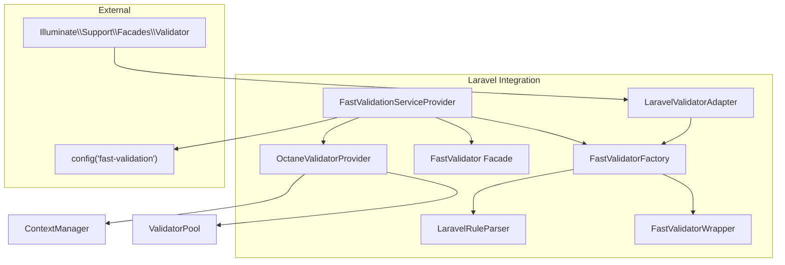
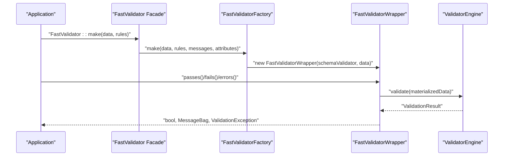
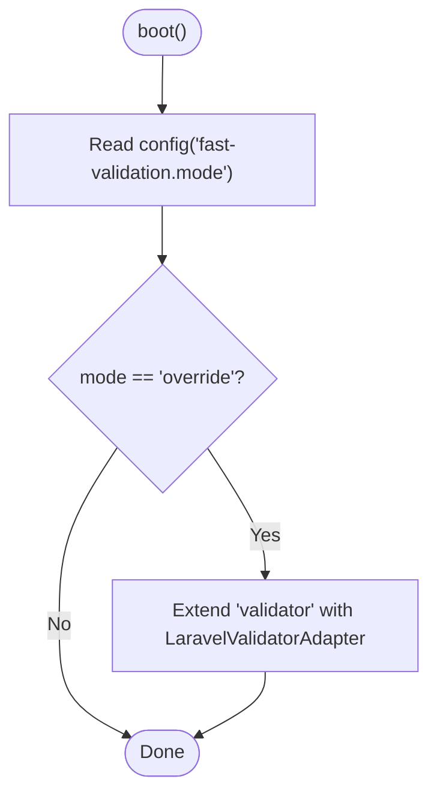
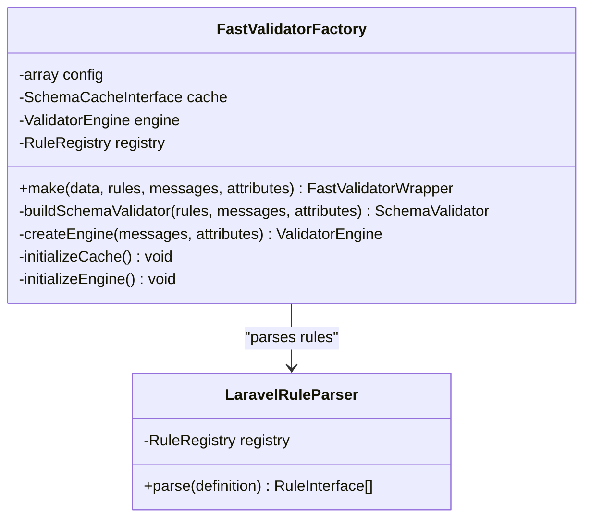
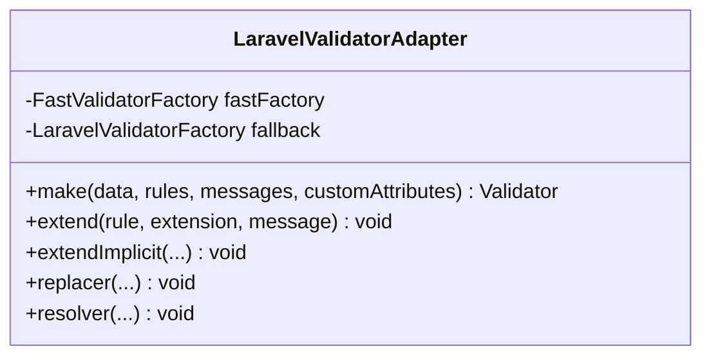
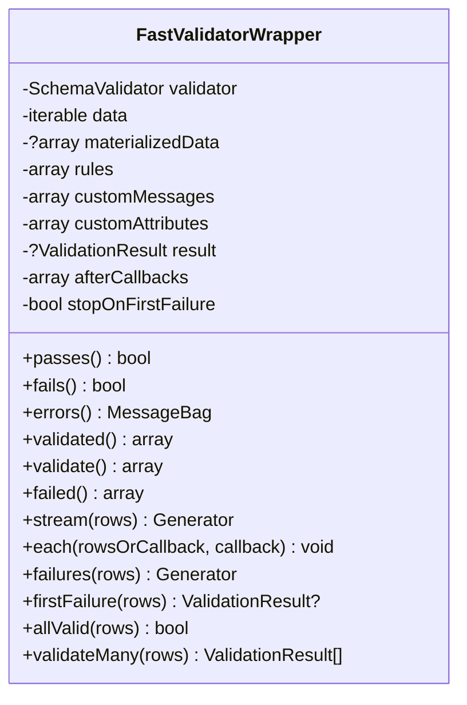
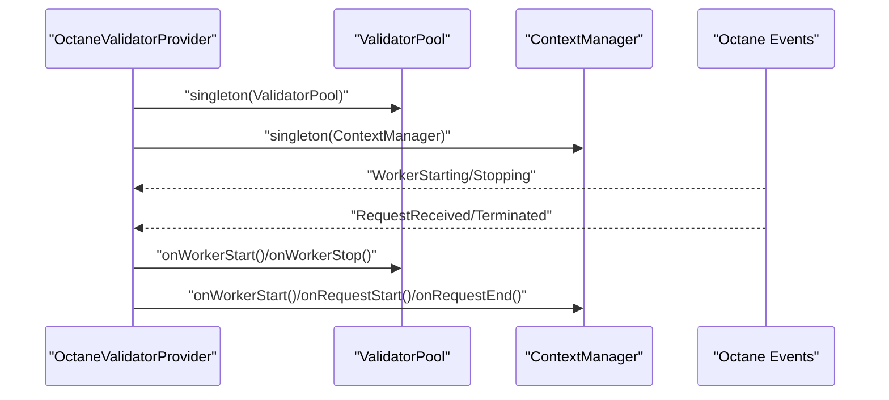
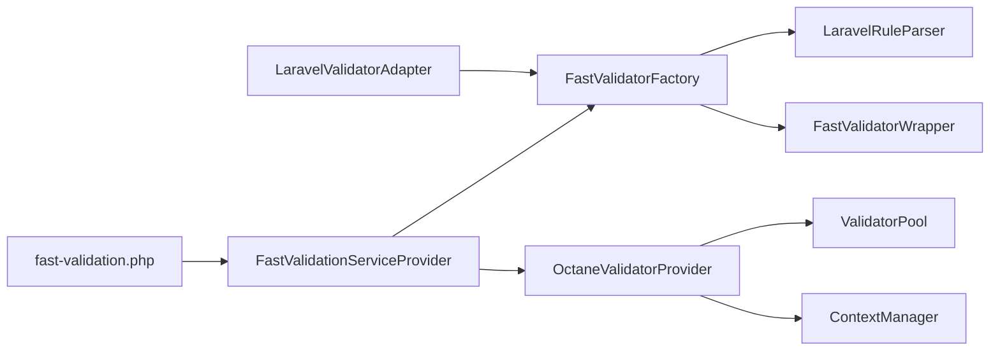

# Laravel Integration

<cite>
**Referenced Files in This Document**
- [config/fast-validation.php](file://config/fast-validation.php)
- [src/Laravel/FastValidationServiceProvider.php](file://src/Laravel/FastValidationServiceProvider.php)
- [src/Laravel/FastValidatorFactory.php](file://src/Laravel/FastValidatorFactory.php)
- [src/Laravel/Facades/FastValidator.php](file://src/Laravel/Facades/FastValidator.php)
- [src/Laravel/LaravelValidatorAdapter.php](file://src/Laravel/LaravelValidatorAdapter.php)
- [src/Laravel/FastValidatorWrapper.php](file://src/Laravel/FastValidatorWrapper.php)
- [src/Laravel/LaravelRuleParser.php](file://src/Laravel/LaravelRuleParser.php)
- [src/Laravel/Octane/OctaneValidatorProvider.php](file://src/Laravel/Octane/OctaneValidatorProvider.php)
- [src/Runtime/ValidatorPool.php](file://src/Runtime/ValidatorPool.php)
- [src/Runtime/ContextManager.php](file://src/Runtime/ContextManager.php)
- [composer.json](file://composer.json)
- [README.md](file://README.md)
</cite>

## Table of Contents
1. [Introduction](#introduction)
2. [Project Structure](#project-structure)
3. [Core Components](#core-components)
4. [Architecture Overview](#architecture-overview)
5. [Detailed Component Analysis](#detailed-component-analysis)
6. [Dependency Analysis](#dependency-analysis)
7. [Performance Considerations](#performance-considerations)
8. [Troubleshooting Guide](#troubleshooting-guide)
9. [Conclusion](#conclusion)
10. [Appendices](#appendices)

## Introduction
This document explains the Laravel integration features of the validation library, focusing on how to configure and operate in parallel and override modes, how the service provider registers bindings and adapters, and how the FastValidatorFactory, FastValidator facade, and LaravelValidatorAdapter integrate with Laravel’s validation ecosystem. It also covers configuration options, environment variable support, Octane runtime support, and practical usage patterns for both modes, including error handling and performance optimization.

## Project Structure
The Laravel integration is centered around a small set of classes under the Laravel namespace, plus configuration and Octane support utilities. The most important pieces are:
- Service provider for registration and mode selection
- Factory for building validators
- Facade for convenient access
- Adapter for overriding Laravel’s validator factory
- Wrapper implementing Laravel’s validator contract
- Parser for translating Laravel-style rules into internal rules
- Octane provider for long-running process support

**Diagram sources**
- [src/Laravel/FastValidationServiceProvider.php](file://src/Laravel/FastValidationServiceProvider.php#L12-L52)
- [src/Laravel/FastValidatorFactory.php](file://src/Laravel/FastValidatorFactory.php#L19-L41)
- [src/Laravel/Facades/FastValidator.php](file://src/Laravel/Facades/FastValidator.php#L16-L21)
- [src/Laravel/LaravelValidatorAdapter.php](file://src/Laravel/LaravelValidatorAdapter.php#L9-L34)
- [src/Laravel/FastValidatorWrapper.php](file://src/Laravel/FastValidatorWrapper.php#L14-L47)
- [src/Laravel/LaravelRuleParser.php](file://src/Laravel/LaravelRuleParser.php#L12-L22)
- [src/Laravel/Octane/OctaneValidatorProvider.php](file://src/Laravel/Octane/OctaneValidatorProvider.php#L18-L32)

**Section sources**
- [src/Laravel/FastValidationServiceProvider.php](file://src/Laravel/FastValidationServiceProvider.php#L12-L52)
- [src/Laravel/FastValidatorFactory.php](file://src/Laravel/FastValidatorFactory.php#L19-L41)
- [src/Laravel/Facades/FastValidator.php](file://src/Laravel/Facades/FastValidator.php#L16-L21)
- [src/Laravel/LaravelValidatorAdapter.php](file://src/Laravel/LaravelValidatorAdapter.php#L9-L34)
- [src/Laravel/FastValidatorWrapper.php](file://src/Laravel/FastValidatorWrapper.php#L14-L47)
- [src/Laravel/LaravelRuleParser.php](file://src/Laravel/LaravelRuleParser.php#L12-L22)
- [src/Laravel/Octane/OctaneValidatorProvider.php](file://src/Laravel/Octane/OctaneValidatorProvider.php#L18-L32)

## Core Components
- FastValidatorFactory: Builds SchemaValidator instances from Laravel-style rules, manages cache and engine initialization, and exposes a make() method compatible with Laravel’s Validator::make signature.
- FastValidator facade: Provides a convenient alias to the factory for direct usage.
- LaravelValidatorAdapter: Wraps the factory and routes Validator::make() calls to the fast engine when in override mode.
- FastValidatorWrapper: Implements Laravel’s Validator contract, supports streaming, batching, and fail-fast patterns, and integrates with ValidationException.
- LaravelRuleParser: Parses Laravel-style rule strings into internal RuleInterface instances, including closures and RuleInterface objects.
- OctaneValidatorProvider: Registers ValidatorPool and ContextManager singletons and hooks into Octane lifecycle events for long-running environments.

**Section sources**
- [src/Laravel/FastValidatorFactory.php](file://src/Laravel/FastValidatorFactory.php#L51-L60)
- [src/Laravel/Facades/FastValidator.php](file://src/Laravel/Facades/FastValidator.php#L16-L21)
- [src/Laravel/LaravelValidatorAdapter.php](file://src/Laravel/LaravelValidatorAdapter.php#L27-L34)
- [src/Laravel/FastValidatorWrapper.php](file://src/Laravel/FastValidatorWrapper.php#L14-L47)
- [src/Laravel/LaravelRuleParser.php](file://src/Laravel/LaravelRuleParser.php#L28-L61)
- [src/Laravel/Octane/OctaneValidatorProvider.php](file://src/Laravel/Octane/OctaneValidatorProvider.php#L20-L32)

## Architecture Overview
The integration supports two operational modes selected via configuration:
- Parallel mode: Use FastValidatorFactory directly; Laravel’s Validator::make remains unchanged.
- Override mode: Extend Laravel’s validator factory to route calls through the fast engine adapter.

**Diagram sources**
- [src/Laravel/Facades/FastValidator.php](file://src/Laravel/Facades/FastValidator.php#L16-L21)
- [src/Laravel/FastValidatorFactory.php](file://src/Laravel/FastValidatorFactory.php#L51-L60)
- [src/Laravel/FastValidatorWrapper.php](file://src/Laravel/FastValidatorWrapper.php#L74-L86)

**Section sources**
- [src/Laravel/FastValidationServiceProvider.php](file://src/Laravel/FastValidationServiceProvider.php#L38-L42)
- [src/Laravel/LaravelValidatorAdapter.php](file://src/Laravel/LaravelValidatorAdapter.php#L27-L34)
- [README.md](file://README.md#L432-L506)

## Detailed Component Analysis

### Service Provider Registration
The service provider registers:
- RuleRegistry singleton and auto-registers built-in rules
- FastValidatorFactory singleton, configured from fast-validation.php
- Alias "fast.validator" for the factory
- Publishes the configuration file for the application
- Boots in override mode by extending the "validator" factory with LaravelValidatorAdapter when mode is set to override

**Diagram sources**
- [src/Laravel/FastValidationServiceProvider.php](file://src/Laravel/FastValidationServiceProvider.php#L32-L52)

**Section sources**
- [src/Laravel/FastValidationServiceProvider.php](file://src/Laravel/FastValidationServiceProvider.php#L14-L30)
- [src/Laravel/FastValidationServiceProvider.php](file://src/Laravel/FastValidationServiceProvider.php#L32-L52)
- [composer.json](file://composer.json#L24-L31)

### FastValidatorFactory and Schema Building
- Accepts Laravel-style rules and converts them into internal rules via LaravelRuleParser
- Builds a SchemaValidator with optional caching and custom messages/attributes
- Initializes ValidatorEngine with locale-aware message resolution and performance options
- Supports cache drivers "array" and "file" with TTL and path configuration

**Diagram sources**
- [src/Laravel/FastValidatorFactory.php](file://src/Laravel/FastValidatorFactory.php#L19-L41)
- [src/Laravel/LaravelRuleParser.php](file://src/Laravel/LaravelRuleParser.php#L12-L22)

**Section sources**
- [src/Laravel/FastValidatorFactory.php](file://src/Laravel/FastValidatorFactory.php#L51-L109)
- [src/Laravel/FastValidatorFactory.php](file://src/Laravel/FastValidatorFactory.php#L122-L144)
- [src/Laravel/FastValidatorFactory.php](file://src/Laravel/FastValidatorFactory.php#L146-L175)
- [src/Laravel/LaravelRuleParser.php](file://src/Laravel/LaravelRuleParser.php#L28-L61)

### LaravelValidatorAdapter (Override Mode)
- Implements Laravel’s Validator factory interface
- Delegates make() to FastValidatorFactory::make()
- Exposes extend/extendImplicit/replacer/resolver passthroughs to the underlying Laravel factory
- Intended to route Validator::make() calls to the fast engine when in override mode

**Diagram sources**
- [src/Laravel/LaravelValidatorAdapter.php](file://src/Laravel/LaravelValidatorAdapter.php#L9-L55)

**Section sources**
- [src/Laravel/LaravelValidatorAdapter.php](file://src/Laravel/LaravelValidatorAdapter.php#L27-L54)

### FastValidatorWrapper (Validator Contract Implementation)
- Implements Illuminate’s Validator contract
- Supports streaming, batching, and fail-fast patterns
- Integrates with ValidationException on validated()/validate()
- Provides helpers for failures(), firstFailure(), allValid(), and validateMany()

**Diagram sources**
- [src/Laravel/FastValidatorWrapper.php](file://src/Laravel/FastValidatorWrapper.php#L14-L399)

**Section sources**
- [src/Laravel/FastValidatorWrapper.php](file://src/Laravel/FastValidatorWrapper.php#L69-L139)
- [src/Laravel/FastValidatorWrapper.php](file://src/Laravel/FastValidatorWrapper.php#L309-L398)

### Octane Runtime Support
- Registers ValidatorPool and ContextManager singletons
- Hooks into Octane worker and request lifecycle events to manage validator instances and message resolvers
- Enables pooling and request-scoped context for long-running environments

**Diagram sources**
- [src/Laravel/Octane/OctaneValidatorProvider.php](file://src/Laravel/Octane/OctaneValidatorProvider.php#L20-L66)
- [src/Runtime/ValidatorPool.php](file://src/Runtime/ValidatorPool.php#L26-L90)
- [src/Runtime/ContextManager.php](file://src/Runtime/ContextManager.php#L25-L48)

**Section sources**
- [src/Laravel/Octane/OctaneValidatorProvider.php](file://src/Laravel/Octane/OctaneValidatorProvider.php#L20-L66)
- [src/Runtime/ValidatorPool.php](file://src/Runtime/ValidatorPool.php#L26-L90)
- [src/Runtime/ContextManager.php](file://src/Runtime/ContextManager.php#L25-L48)

## Dependency Analysis
- The service provider depends on the configuration and binds the factory and registry
- The factory depends on the rule registry and parser, and optionally on cache and engine
- The wrapper depends on SchemaValidator and integrates with Laravel’s MessageBag and ValidationException
- The adapter depends on the factory and the underlying Laravel validator factory
- Octane provider depends on runtime pool and context manager

**Diagram sources**
- [config/fast-validation.php](file://config/fast-validation.php#L5-L96)
- [src/Laravel/FastValidationServiceProvider.php](file://src/Laravel/FastValidationServiceProvider.php#L14-L30)
- [src/Laravel/FastValidatorFactory.php](file://src/Laravel/FastValidatorFactory.php#L19-L41)
- [src/Laravel/LaravelValidatorAdapter.php](file://src/Laravel/LaravelValidatorAdapter.php#L9-L19)
- [src/Laravel/Octane/OctaneValidatorProvider.php](file://src/Laravel/Octane/OctaneValidatorProvider.php#L20-L32)

**Section sources**
- [config/fast-validation.php](file://config/fast-validation.php#L5-L96)
- [src/Laravel/FastValidationServiceProvider.php](file://src/Laravel/FastValidationServiceProvider.php#L14-L30)
- [src/Laravel/FastValidatorFactory.php](file://src/Laravel/FastValidatorFactory.php#L19-L41)
- [src/Laravel/LaravelValidatorAdapter.php](file://src/Laravel/LaravelValidatorAdapter.php#L9-L19)
- [src/Laravel/Octane/OctaneValidatorProvider.php](file://src/Laravel/Octane/OctaneValidatorProvider.php#L20-L32)

## Performance Considerations
- Fail-fast and max-errors: Configure fail_fast and max_errors to reduce overhead when early termination is acceptable
- Fast-path rules: Enable fast_path_rules to leverage optimized rule execution paths
- Caching: Enable cache with driver "array" or "file" and tune ttl and path for repeated rule sets
- Streaming and batching: Prefer stream(), each(), failures(), and firstFailure() for large datasets to avoid memory spikes
- Pooling in Octane: Enable pooling and adjust pool_size to reuse validator instances across requests

[No sources needed since this section provides general guidance]

## Troubleshooting Guide
- Override mode not taking effect: Verify mode is set to override and the service provider is registered
- Unsupported rules in override mode: The adapter currently routes only simple rule sets to the fast engine; unsupported rules fall back to the Laravel factory
- Closures and dynamic rules: Rules containing closures disable schema caching for that rule set; consider extracting reusable rules
- Error messages and attributes: Ensure custom messages and attributes are passed to make() or set on the wrapper
- Octane issues: Confirm OctaneValidatorProvider is loaded and pooling settings are appropriate for your workload

**Section sources**
- [src/Laravel/FastValidationServiceProvider.php](file://src/Laravel/FastValidationServiceProvider.php#L38-L52)
- [src/Laravel/LaravelValidatorAdapter.php](file://src/Laravel/LaravelValidatorAdapter.php#L27-L34)
- [src/Laravel/FastValidatorFactory.php](file://src/Laravel/FastValidatorFactory.php#L185-L205)
- [src/Laravel/FastValidatorWrapper.php](file://src/Laravel/FastValidatorWrapper.php#L88-L104)
- [src/Laravel/Octane/OctaneValidatorProvider.php](file://src/Laravel/Octane/OctaneValidatorProvider.php#L68-L73)

## Conclusion
The Laravel integration offers a flexible, high-performance validation path with two operational modes. Parallel mode lets you adopt the fast engine incrementally, while override mode allows drop-in replacement for supported rule sets. The configuration and environment variables enable tuning for performance, caching, localization, and long-running environments. The wrapper and adapter maintain compatibility with Laravel’s validation ecosystem, enabling seamless migration and robust error handling.

[No sources needed since this section summarizes without analyzing specific files]

## Appendices

### Configuration Options and Environment Variables
- mode: Choose between "parallel" and "override"
- cache.enabled, cache.driver, cache.ttl, cache.path: Control schema caching behavior
- compilation.precompile, compilation.cache_path: Enable precompilation for production
- performance.fail_fast, performance.max_errors, performance.fast_path_rules: Tune performance characteristics
- localization.locale, localization.fallback_locale: Set locales for messages
- runtime.pooling, runtime.pool_size, runtime.auto_detect: Configure Octane/runtime support

**Section sources**
- [config/fast-validation.php](file://config/fast-validation.php#L5-L96)

### Practical Examples

- Parallel mode usage
  - Use the facade or container to resolve the factory and call make() with data and rules
  - Check passes()/fails(), collect errors(), and handle ValidationException on validated()/validate()

- Override mode usage
  - Set mode to "override"
  - Continue using Validator::make() in existing code; calls are routed to the fast engine for supported rules

- Error handling integration
  - Use errors() to get a MessageBag
  - validated()/validate() throw ValidationException when validation fails
  - Use after() callbacks to attach post-validation logic

- Performance optimization
  - Enable fail_fast and tune max_errors
  - Prefer streaming APIs (stream(), each(), failures()) for large datasets
  - Enable pooling in Octane and adjust pool_size

**Section sources**
- [README.md](file://README.md#L432-L506)
- [src/Laravel/FastValidatorWrapper.php](file://src/Laravel/FastValidatorWrapper.php#L69-L139)
- [src/Laravel/FastValidatorWrapper.php](file://src/Laravel/FastValidatorWrapper.php#L309-L398)
- [src/Laravel/Octane/OctaneValidatorProvider.php](file://src/Laravel/Octane/OctaneValidatorProvider.php#L20-L32)