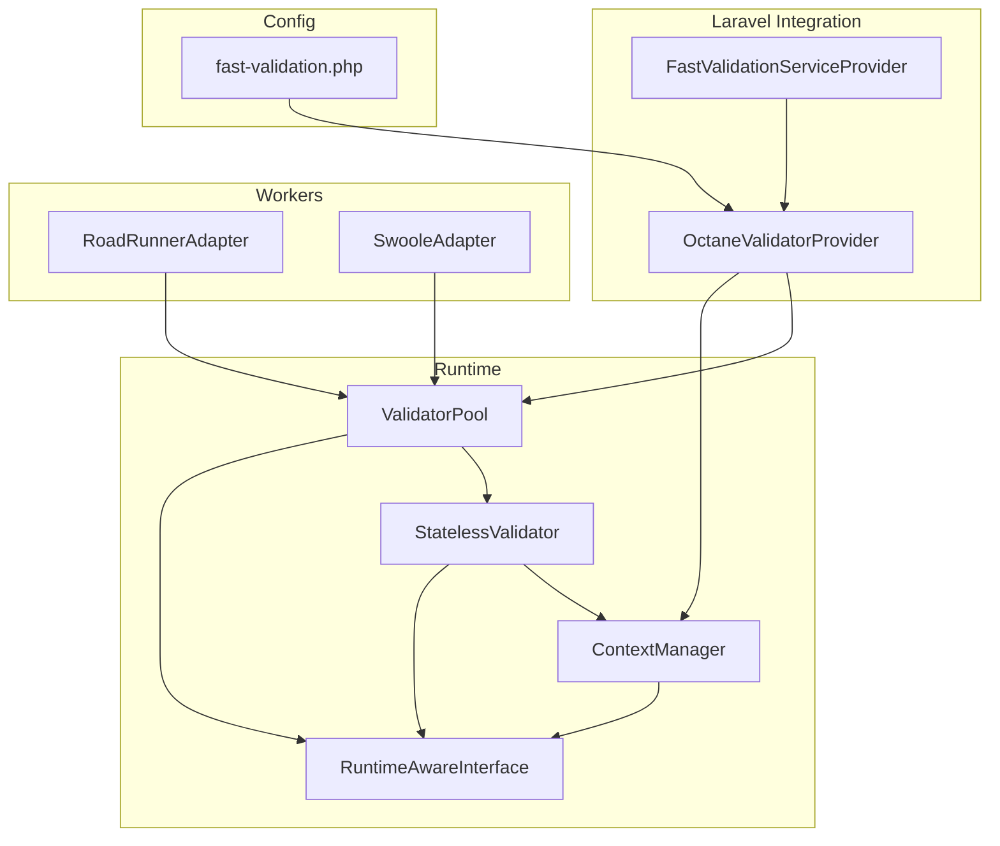
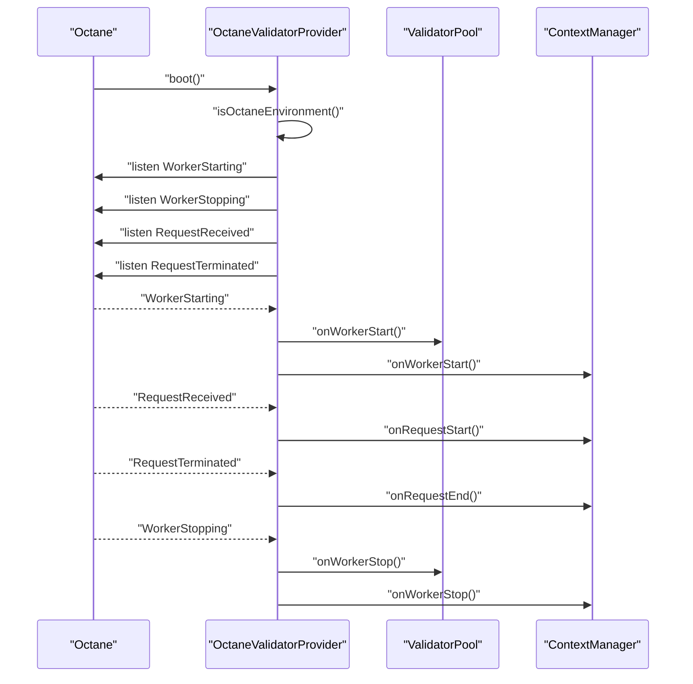
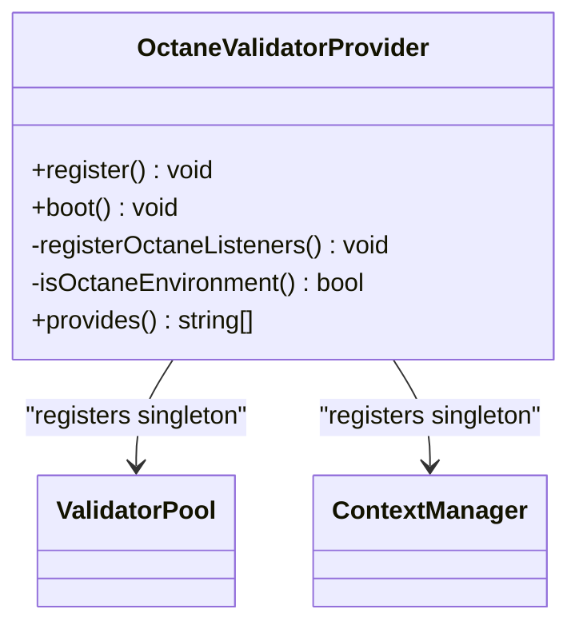
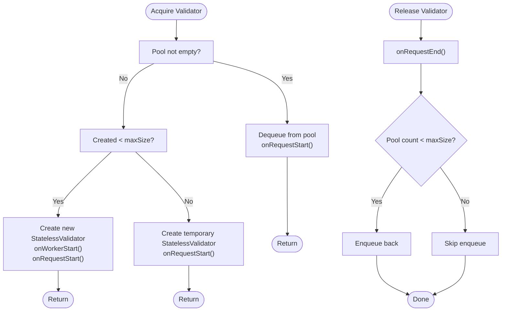
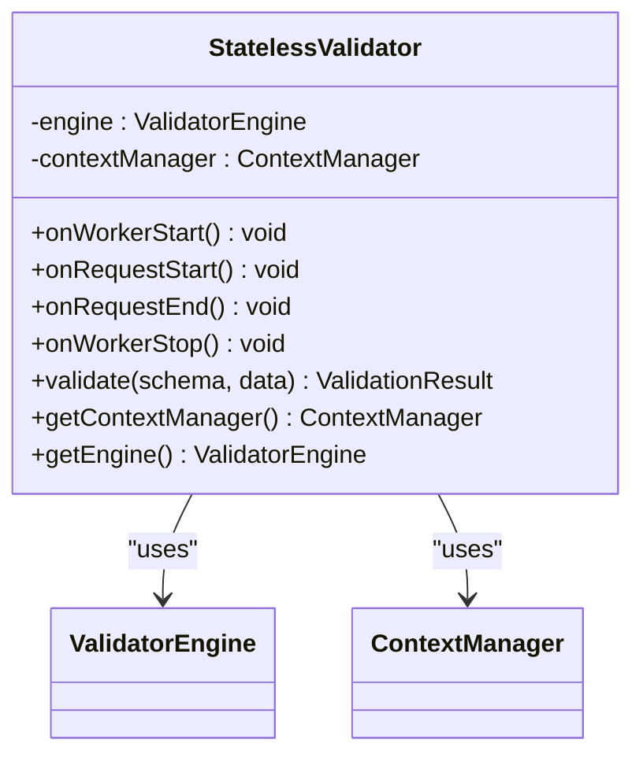
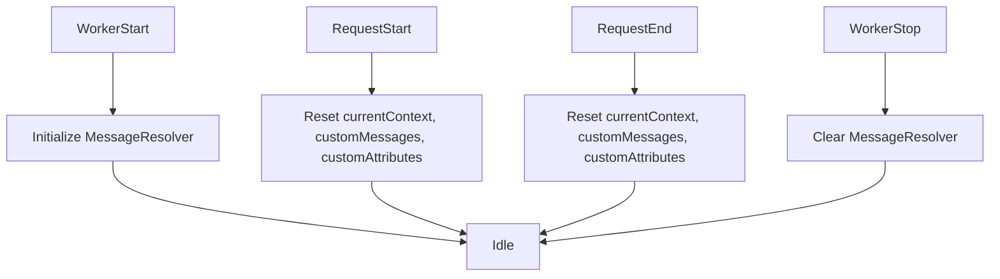
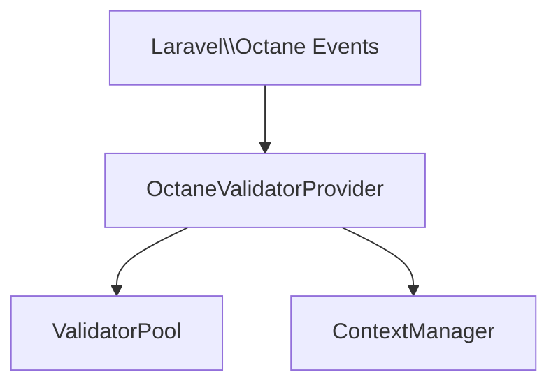

# Octane Compatibility

<cite>
**Referenced Files in This Document**
- [OctaneValidatorProvider.php](file://src/Laravel/Octane/OctaneValidatorProvider.php)
- [ValidatorPool.php](file://src/Runtime/ValidatorPool.php)
- [StatelessValidator.php](file://src/Runtime/StatelessValidator.php)
- [ContextManager.php](file://src/Runtime/ContextManager.php)
- [RuntimeAwareInterface.php](file://src/Runtime/RuntimeAwareInterface.php)
- [RoadRunnerAdapter.php](file://src/Runtime/Workers/RoadRunnerAdapter.php)
- [SwooleAdapter.php](file://src/Runtime/Workers/SwooleAdapter.php)
- [fast-validation.php](file://config/fast-validation.php)
- [FastValidationServiceProvider.php](file://src/Laravel/FastValidationServiceProvider.php)
- [ValidatorEngine.php](file://src/Execution/ValidatorEngine.php)
- [composer.json](file://composer.json)
</cite>

## Table of Contents
1. [Introduction](#introduction)
2. [Project Structure](#project-structure)
3. [Core Components](#core-components)
4. [Architecture Overview](#architecture-overview)
5. [Detailed Component Analysis](#detailed-component-analysis)
6. [Dependency Analysis](#dependency-analysis)
7. [Performance Considerations](#performance-considerations)
8. [Troubleshooting Guide](#troubleshooting-guide)
9. [Conclusion](#conclusion)
10. [Appendices](#appendices)

## Introduction
This document explains how the library supports Laravel Octane’s persistent process model and long-running environments. It covers the OctaneValidatorProvider service provider, validator pooling mechanisms, stateless validation patterns, lifecycle management, and configuration options that enable safe operation under Octane, Swoole, and RoadRunner. It also provides practical guidance for deployment, performance tuning, and troubleshooting Octane-specific issues.

## Project Structure
The Octane integration is centered around a dedicated service provider and runtime-aware components that manage worker and request lifecycles. Supporting adapters exist for RoadRunner and Swoole to ensure proper initialization and cleanup.

**Diagram sources**
- [FastValidationServiceProvider.php](file://src/Laravel/FastValidationServiceProvider.php#L12-L31)
- [OctaneValidatorProvider.php](file://src/Laravel/Octane/OctaneValidatorProvider.php#L18-L41)
- [ValidatorPool.php](file://src/Runtime/ValidatorPool.php#L12-L24)
- [StatelessValidator.php](file://src/Runtime/StatelessValidator.php#L15-L26)
- [ContextManager.php](file://src/Runtime/ContextManager.php#L14-L28)
- [RoadRunnerAdapter.php](file://src/Runtime/Workers/RoadRunnerAdapter.php#L13-L21)
- [SwooleAdapter.php](file://src/Runtime/Workers/SwooleAdapter.php#L13-L23)
- [fast-validation.php](file://config/fast-validation.php#L86-L95)

**Section sources**
- [composer.json](file://composer.json#L23-L32)
- [FastValidationServiceProvider.php](file://src/Laravel/FastValidationServiceProvider.php#L12-L31)
- [OctaneValidatorProvider.php](file://src/Laravel/Octane/OctaneValidatorProvider.php#L18-L41)
- [fast-validation.php](file://config/fast-validation.php#L86-L95)

## Core Components
- OctaneValidatorProvider: Registers singleton services for validator pooling and context management, and subscribes to Octane lifecycle events to coordinate worker and request boundaries.
- ValidatorPool: Maintains a pool of StatelessValidator instances, pre-warming on worker start and releasing back to the pool after each request.
- StatelessValidator: Wraps the validation engine and ensures request-scoped lifecycle hooks are invoked around each validation run.
- ContextManager: Manages per-request validation context, custom messages, and attributes, resetting state on request start/end and worker stop.
- RuntimeAwareInterface: Defines lifecycle hooks for long-running environments.
- RoadRunnerAdapter and SwooleAdapter: Optional adapters that integrate lifecycle management with RoadRunner and Swoole environments.

**Section sources**
- [OctaneValidatorProvider.php](file://src/Laravel/Octane/OctaneValidatorProvider.php#L20-L41)
- [ValidatorPool.php](file://src/Runtime/ValidatorPool.php#L12-L90)
- [StatelessValidator.php](file://src/Runtime/StatelessValidator.php#L15-L77)
- [ContextManager.php](file://src/Runtime/ContextManager.php#L14-L117)
- [RuntimeAwareInterface.php](file://src/Runtime/RuntimeAwareInterface.php#L10-L31)
- [RoadRunnerAdapter.php](file://src/Runtime/Workers/RoadRunnerAdapter.php#L13-L106)
- [SwooleAdapter.php](file://src/Runtime/Workers/SwooleAdapter.php#L13-L94)

## Architecture Overview
The Octane integration listens to Octane worker and request lifecycle events to initialize and tear down shared resources safely. Validator instances are pooled to reduce allocation overhead and avoid cross-request state leakage.

**Diagram sources**
- [OctaneValidatorProvider.php](file://src/Laravel/Octane/OctaneValidatorProvider.php#L34-L66)

## Detailed Component Analysis

### OctaneValidatorProvider
- Registers singleton services for ValidatorPool and ContextManager, deriving pool size from configuration.
- Subscribes to Octane events to trigger lifecycle callbacks on worker and request boundaries.
- Detects Octane environment via class presence or environment markers.

**Diagram sources**
- [OctaneValidatorProvider.php](file://src/Laravel/Octane/OctaneValidatorProvider.php#L18-L41)

**Section sources**
- [OctaneValidatorProvider.php](file://src/Laravel/Octane/OctaneValidatorProvider.php#L20-L41)
- [OctaneValidatorProvider.php](file://src/Laravel/Octane/OctaneValidatorProvider.php#L43-L66)
- [OctaneValidatorProvider.php](file://src/Laravel/Octane/OctaneValidatorProvider.php#L68-L73)

### ValidatorPool
- Pre-warms the pool on worker start with a small subset of validators.
- Acquires validators per request, optionally creating temporary ones when the pool is exhausted.
- Releases validators back to the pool after use, maintaining a bounded size.
- Provides a convenience method to run validation with automatic acquire/release.

**Diagram sources**
- [ValidatorPool.php](file://src/Runtime/ValidatorPool.php#L59-L90)

**Section sources**
- [ValidatorPool.php](file://src/Runtime/ValidatorPool.php#L26-L54)
- [ValidatorPool.php](file://src/Runtime/ValidatorPool.php#L59-L90)
- [ValidatorPool.php](file://src/Runtime/ValidatorPool.php#L99-L108)

### StatelessValidator
- Wraps the validation engine and ensures lifecycle hooks are invoked around each validation run.
- Exposes accessors to the underlying engine and context manager for advanced scenarios.

**Diagram sources**
- [StatelessValidator.php](file://src/Runtime/StatelessValidator.php#L15-L77)
- [ValidatorEngine.php](file://src/Execution/ValidatorEngine.php#L11-L31)

**Section sources**
- [StatelessValidator.php](file://src/Runtime/StatelessValidator.php#L28-L61)

### ContextManager
- Initializes message resolution on worker start.
- Resets request-scoped state (current context, custom messages, custom attributes) on request start and end.
- Clears message resolver on worker stop.

**Diagram sources**
- [ContextManager.php](file://src/Runtime/ContextManager.php#L25-L48)

**Section sources**
- [ContextManager.php](file://src/Runtime/ContextManager.php#L25-L48)
- [ContextManager.php](file://src/Runtime/ContextManager.php#L55-L89)

### RuntimeAwareInterface
- Defines the contract for components that must react to worker and request lifecycle events.

**Section sources**
- [RuntimeAwareInterface.php](file://src/Runtime/RuntimeAwareInterface.php#L10-L31)

### RoadRunnerAdapter and SwooleAdapter
- Provide environment-specific lifecycle management for RoadRunner and Swoole.
- Ensure the validator pool is initialized and cleaned up appropriately.
- Include helpers to detect environment and manage request state.

**Section sources**
- [RoadRunnerAdapter.php](file://src/Runtime/Workers/RoadRunnerAdapter.php#L23-L49)
- [RoadRunnerAdapter.php](file://src/Runtime/Workers/RoadRunnerAdapter.php#L96-L105)
- [SwooleAdapter.php](file://src/Runtime/Workers/SwooleAdapter.php#L25-L52)

## Dependency Analysis
The Octane integration depends on Laravel Octane event classes and registers listeners only when Octane is detected. ValidatorPool and ContextManager are injected via the container and are responsible for lifecycle management.

**Diagram sources**
- [OctaneValidatorProvider.php](file://src/Laravel/Octane/OctaneValidatorProvider.php#L43-L66)

**Section sources**
- [OctaneValidatorProvider.php](file://src/Laravel/Octane/OctaneValidatorProvider.php#L7-L13)
- [OctaneValidatorProvider.php](file://src/Laravel/Octane/OctaneValidatorProvider.php#L34-L41)

## Performance Considerations
- Validator pooling reduces allocations and improves throughput in long-running processes. Tune pool size according to concurrency expectations.
- Fail-fast and max-errors settings influence early termination behavior during validation.
- Schema caching minimizes compilation overhead across requests.
- Message resolution is initialized once per worker and reset per request to avoid repeated work.

Practical tips:
- Increase pool size for high-concurrency environments.
- Enable fail-fast when quick response times are critical.
- Use file-based schema cache in production for persistent environments.
- Monitor memory growth and adjust pool size and cache TTL accordingly.

**Section sources**
- [fast-validation.php](file://config/fast-validation.php#L86-L95)
- [ValidatorEngine.php](file://src/Execution/ValidatorEngine.php#L100-L108)
- [ValidatorEngine.php](file://src/Execution/ValidatorEngine.php#L148-L159)

## Troubleshooting Guide
Common issues and remedies:
- Memory leaks or stale state: Ensure ContextManager resets state on request boundaries and on worker stop.
- Pool exhaustion: Increase pool size or reduce peak concurrency.
- Incorrect environment detection: Verify Octane environment markers and provider registration.
- RoadRunner/Swoole specifics: Use the provided adapters to ensure lifecycle hooks are invoked.

Diagnostic steps:
- Confirm Octane environment detection is active.
- Verify worker lifecycle callbacks are firing.
- Check pool utilization metrics (pool size, created count).
- Validate request-scoped state is cleared between requests.

**Section sources**
- [OctaneValidatorProvider.php](file://src/Laravel/Octane/OctaneValidatorProvider.php#L68-L73)
- [ContextManager.php](file://src/Runtime/ContextManager.php#L37-L48)
- [ValidatorPool.php](file://src/Runtime/ValidatorPool.php#L113-L132)

## Conclusion
The library’s Octane integration centers on lifecycle-aware components that prevent state leakage and optimize resource usage in long-running processes. By combining a validator pool, stateless wrappers, and environment-specific adapters, it delivers robust performance and reliability under Octane, Swoole, and RoadRunner.

## Appendices

### Configuration Reference
- Long-running process support:
  - pooling: Enable validator instance pooling.
  - pool_size: Number of pooled validators.
  - auto_detect: Auto-detect and optimize for long-running environments.

- Performance options:
  - fail_fast: Stop validation on first error.
  - max_errors: Upper bound on collected errors.
  - fast_path_rules: Enable optimized fast-path rules.

- Cache and compilation:
  - cache.enabled/driver/ttl/path: Schema caching configuration.
  - compilation.precompile/cache_path: Precompilation settings.

**Section sources**
- [fast-validation.php](file://config/fast-validation.php#L86-L95)
- [fast-validation.php](file://config/fast-validation.php#L54-L63)
- [fast-validation.php](file://config/fast-validation.php#L26-L31)
- [fast-validation.php](file://config/fast-validation.php#L41-L44)

### Deployment and Monitoring Checklist
- Enable Octane in your Laravel application.
- Configure fast-validation runtime settings for your environment.
- Monitor pool utilization and memory footprint.
- Use file-based schema cache for production.
- Validate that request-scoped state is reset after each request.

[No sources needed since this section provides general guidance]