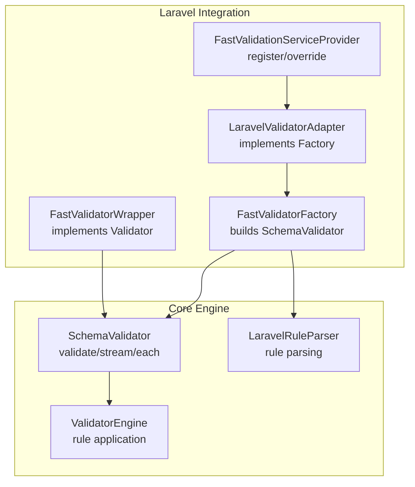
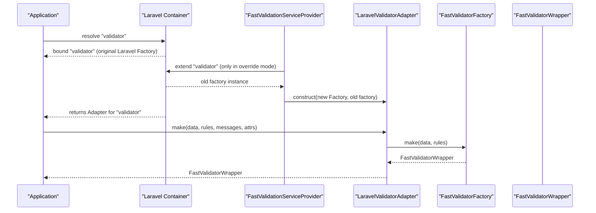
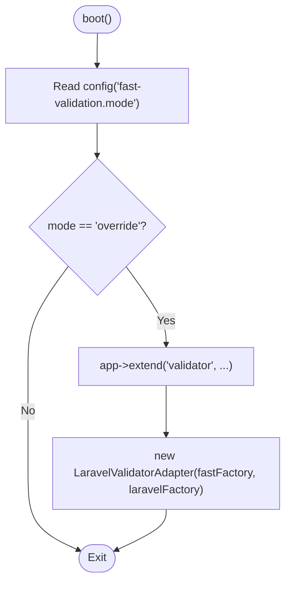
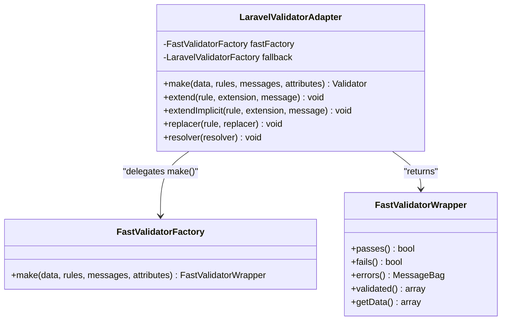
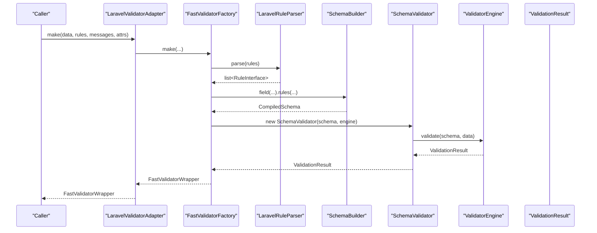
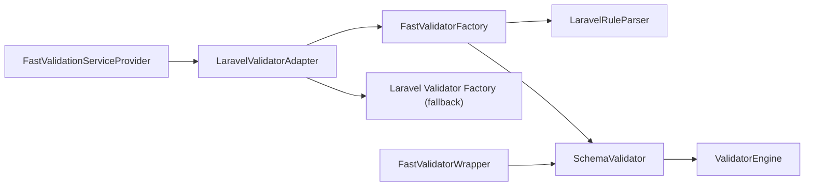

# Override Mode

<cite>
**Referenced Files in This Document**
- [FastValidationServiceProvider.php](file://src/Laravel/FastValidationServiceProvider.php)
- [LaravelValidatorAdapter.php](file://src/Laravel/LaravelValidatorAdapter.php)
- [FastValidatorFactory.php](file://src/Laravel/FastValidatorFactory.php)
- [FastValidatorWrapper.php](file://src/Laravel/FastValidatorWrapper.php)
- [LaravelRuleParser.php](file://src/Laravel/LaravelRuleParser.php)
- [SchemaValidator.php](file://src/SchemaValidator.php)
- [ValidatorEngine.php](file://src/Execution/ValidatorEngine.php)
- [ValidationResult.php](file://src/Execution/ValidationResult.php)
- [ErrorCollector.php](file://src/Execution/ErrorCollector.php)
- [fast-validation.php](file://config/fast-validation.php)
- [README.md](file://README.md)
</cite>

## Table of Contents
1. [Introduction](#introduction)
2. [Project Structure](#project-structure)
3. [Core Components](#core-components)
4. [Architecture Overview](#architecture-overview)
5. [Detailed Component Analysis](#detailed-component-analysis)
6. [Dependency Analysis](#dependency-analysis)
7. [Performance Considerations](#performance-considerations)
8. [Troubleshooting Guide](#troubleshooting-guide)
9. [Conclusion](#conclusion)
10. [Appendices](#appendices)

## Introduction
Override mode enables seamless drop-in replacement of Laravel’s default Validator factory with the fast validation engine. When enabled, all calls to Validator::make(...) are routed through the fast engine for supported rule sets, while unsupported rules fall back to the original Laravel factory. This approach requires zero code changes and no configuration adjustments beyond setting the mode, while maintaining full backward compatibility for extensions and customizations.

## Project Structure
The override mechanism spans a small set of Laravel integration classes plus the underlying validation engine:
- Service provider registers factories and conditionally overrides the validator
- Adapter wraps the Laravel factory and delegates to the fast engine
- Factory builds schema validators and returns a wrapper implementing Laravel’s Validator contract
- Engine executes validation and produces results compatible with Laravel’s ecosystem

**Diagram sources**
- [FastValidationServiceProvider.php](file://src/Laravel/FastValidationServiceProvider.php#L12-L52)
- [LaravelValidatorAdapter.php](file://src/Laravel/LaravelValidatorAdapter.php#L9-L34)
- [FastValidatorFactory.php](file://src/Laravel/FastValidatorFactory.php#L19-L60)
- [FastValidatorWrapper.php](file://src/Laravel/FastValidatorWrapper.php#L14-L47)
- [SchemaValidator.php](file://src/SchemaValidator.php#L13-L30)
- [ValidatorEngine.php](file://src/Execution/ValidatorEngine.php#L11-L31)
- [LaravelRuleParser.php](file://src/Laravel/LaravelRuleParser.php#L12-L22)

**Section sources**
- [FastValidationServiceProvider.php](file://src/Laravel/FastValidationServiceProvider.php#L12-L52)
- [fast-validation.php](file://config/fast-validation.php#L5-L15)

## Core Components
- FastValidationServiceProvider: Registers dependencies and conditionally extends the 'validator' binding to wrap it with the adapter when mode is override.
- LaravelValidatorAdapter: Implements Laravel’s Factory interface and forwards make(...) to the fast factory; exposes passthrough methods for extend/extendImplicit/replacer/resolver to the fallback factory.
- FastValidatorFactory: Parses Laravel-style rules into internal rules, builds a CompiledSchema, caches it, and returns a FastValidatorWrapper.
- FastValidatorWrapper: Implements Laravel’s Validator contract, defers execution until passes()/errors() are called, and supports streaming and batch APIs.
- SchemaValidator and ValidatorEngine: Execute validation against CompiledSchema, manage error collection and message resolution.
- LaravelRuleParser: Converts Laravel rule strings/closures/objects into internal RuleInterface instances.

**Section sources**
- [FastValidationServiceProvider.php](file://src/Laravel/FastValidationServiceProvider.php#L14-L52)
- [LaravelValidatorAdapter.php](file://src/Laravel/LaravelValidatorAdapter.php#L9-L55)
- [FastValidatorFactory.php](file://src/Laravel/FastValidatorFactory.php#L19-L144)
- [FastValidatorWrapper.php](file://src/Laravel/FastValidatorWrapper.php#L14-L47)
- [SchemaValidator.php](file://src/SchemaValidator.php#L13-L73)
- [ValidatorEngine.php](file://src/Execution/ValidatorEngine.php#L11-L98)
- [LaravelRuleParser.php](file://src/Laravel/LaravelRuleParser.php#L12-L117)

## Architecture Overview
Override mode hinges on Laravel’s service container extension mechanism. On boot, the provider checks the configured mode and, if set to override, extends the existing 'validator' binding to return an adapter instance. The adapter constructs a FastValidatorFactory and returns a FastValidatorWrapper from make(...), ensuring all downstream Laravel validation code continues to work unchanged.

**Diagram sources**
- [FastValidationServiceProvider.php](file://src/Laravel/FastValidationServiceProvider.php#L32-L52)
- [LaravelValidatorAdapter.php](file://src/Laravel/LaravelValidatorAdapter.php#L27-L34)
- [FastValidatorFactory.php](file://src/Laravel/FastValidatorFactory.php#L51-L60)
- [FastValidatorWrapper.php](file://src/Laravel/FastValidatorWrapper.php#L14-L47)

## Detailed Component Analysis

### Override Process in FastValidationServiceProvider
- Registration phase: binds RuleRegistry and FastValidatorFactory, and aliases the factory for convenience.
- Boot phase: publishes config, reads mode, and if mode equals override, extends the 'validator' binding to return an adapter wrapping the fast factory and the original factory.

**Diagram sources**
- [FastValidationServiceProvider.php](file://src/Laravel/FastValidationServiceProvider.php#L32-L52)

**Section sources**
- [FastValidationServiceProvider.php](file://src/Laravel/FastValidationServiceProvider.php#L14-L52)
- [fast-validation.php](file://config/fast-validation.php#L5-L15)

### LaravelValidatorAdapter Implementation
- Implements Laravel’s Factory interface and delegates make(...) to FastValidatorFactory::make(...).
- Exposes passthrough methods for extend, extendImplicit, replacer, and resolver to the fallback factory, preserving Laravel’s extensibility.
- The adapter acts as a thin bridge, returning a FastValidatorWrapper that behaves like Laravel’s Validator.

**Diagram sources**
- [LaravelValidatorAdapter.php](file://src/Laravel/LaravelValidatorAdapter.php#L9-L55)
- [FastValidatorFactory.php](file://src/Laravel/FastValidatorFactory.php#L51-L60)
- [FastValidatorWrapper.php](file://src/Laravel/FastValidatorWrapper.php#L14-L47)

**Section sources**
- [LaravelValidatorAdapter.php](file://src/Laravel/LaravelValidatorAdapter.php#L9-L55)

### Transparent Integration Approach
- Backward compatibility: All Laravel-specific extensions (extend/extendImplicit/replacer/resolver) are preserved by delegating to the fallback factory.
- Contract compliance: FastValidatorWrapper implements Laravel’s Validator contract, enabling seamless use of existing validation code.
- No code changes: Existing calls to Validator::make(...) continue to work without modification.

**Section sources**
- [LaravelValidatorAdapter.php](file://src/Laravel/LaravelValidatorAdapter.php#L36-L54)
- [FastValidatorWrapper.php](file://src/Laravel/FastValidatorWrapper.php#L14-L47)

### Adapter Pattern and Delegation
- The adapter pattern cleanly separates concerns: the adapter handles factory-level delegation and preserves Laravel’s extensibility hooks, while the fast factory focuses on rule parsing, schema compilation, and validation execution.
- The wrapper encapsulates execution semantics and result formatting, aligning with Laravel’s expectations.

**Section sources**
- [LaravelValidatorAdapter.php](file://src/Laravel/LaravelValidatorAdapter.php#L9-L34)
- [FastValidatorFactory.php](file://src/Laravel/FastValidatorFactory.php#L51-L144)
- [FastValidatorWrapper.php](file://src/Laravel/FastValidatorWrapper.php#L69-L139)

### Validation Execution Flow
- Rule parsing: LaravelRuleParser converts Laravel-style rules into internal RuleInterface instances.
- Schema building: SchemaBuilder compiles rules into a CompiledSchema, optionally cached.
- Execution: SchemaValidator delegates to ValidatorEngine for rule application, error collection, and message resolution.
- Result presentation: FastValidatorWrapper surfaces results via Laravel-compatible methods.

**Diagram sources**
- [LaravelValidatorAdapter.php](file://src/Laravel/LaravelValidatorAdapter.php#L27-L34)
- [FastValidatorFactory.php](file://src/Laravel/FastValidatorFactory.php#L75-L120)
- [LaravelRuleParser.php](file://src/Laravel/LaravelRuleParser.php#L28-L61)
- [SchemaValidator.php](file://src/SchemaValidator.php#L54-L73)
- [ValidatorEngine.php](file://src/Execution/ValidatorEngine.php#L33-L98)
- [ValidationResult.php](file://src/Execution/ValidationResult.php#L9-L32)

**Section sources**
- [LaravelRuleParser.php](file://src/Laravel/LaravelRuleParser.php#L28-L117)
- [SchemaValidator.php](file://src/SchemaValidator.php#L54-L73)
- [ValidatorEngine.php](file://src/Execution/ValidatorEngine.php#L33-L98)
- [ValidationResult.php](file://src/Execution/ValidationResult.php#L9-L96)

### Practical Examples

- Activate override mode:
  - Set mode to override in the published configuration file.
  - The provider will extend the 'validator' binding automatically during boot.

- Existing Laravel validation code remains compatible:
  - Calls to Validator::make(...) continue to work unchanged.
  - The returned validator supports all standard methods (fails, errors, validated, getData, etc.).

- Migration from built-in validator:
  - Switch mode to override.
  - Keep existing code intact; the adapter ensures compatibility.
  - For unsupported rules, the adapter currently falls back to the original factory behavior.

**Section sources**
- [fast-validation.php](file://config/fast-validation.php#L5-L15)
- [FastValidationServiceProvider.php](file://src/Laravel/FastValidationServiceProvider.php#L38-L52)
- [LaravelValidatorAdapter.php](file://src/Laravel/LaravelValidatorAdapter.php#L27-L34)
- [FastValidatorWrapper.php](file://src/Laravel/FastValidatorWrapper.php#L69-L139)
- [README.md](file://README.md#L486-L505)

## Dependency Analysis
- FastValidationServiceProvider depends on:
  - Laravel’s ServiceProvider base class
  - The 'validator' binding and app container
  - FastValidatorFactory and RuleRegistry
- LaravelValidatorAdapter depends on:
  - FastValidatorFactory for constructing validators
  - The original Laravel Validator factory for passthrough operations
- FastValidatorFactory depends on:
  - LaravelRuleParser and SchemaBuilder for schema construction
  - SchemaValidator and ValidatorEngine for execution
- FastValidatorWrapper depends on:
  - SchemaValidator for validation execution
  - Laravel’s MessageBag and ValidationException for result formatting

**Diagram sources**
- [FastValidationServiceProvider.php](file://src/Laravel/FastValidationServiceProvider.php#L12-L52)
- [LaravelValidatorAdapter.php](file://src/Laravel/LaravelValidatorAdapter.php#L9-L19)
- [FastValidatorFactory.php](file://src/Laravel/FastValidatorFactory.php#L19-L41)
- [LaravelRuleParser.php](file://src/Laravel/LaravelRuleParser.php#L12-L22)
- [SchemaValidator.php](file://src/SchemaValidator.php#L13-L30)
- [ValidatorEngine.php](file://src/Execution/ValidatorEngine.php#L11-L31)
- [FastValidatorWrapper.php](file://src/Laravel/FastValidatorWrapper.php#L14-L47)

**Section sources**
- [FastValidationServiceProvider.php](file://src/Laravel/FastValidationServiceProvider.php#L12-L52)
- [LaravelValidatorAdapter.php](file://src/Laravel/LaravelValidatorAdapter.php#L9-L19)
- [FastValidatorFactory.php](file://src/Laravel/FastValidatorFactory.php#L19-L41)
- [SchemaValidator.php](file://src/SchemaValidator.php#L13-L30)

## Performance Considerations
- Override mode leverages the fast engine for supported rules, potentially improving throughput compared to the built-in validator for simple rule sets.
- The adapter currently uses the fast engine for simple rule sets and falls back to the original factory for unsupported rules. This selective fast-path behavior minimizes risk while delivering benefits where possible.
- Caching and compilation options in the configuration influence performance and memory usage. Tune cache driver, TTL, and precompilation settings according to deployment needs.

[No sources needed since this section provides general guidance]

## Troubleshooting Guide
- Symptom: Unexpected fallback behavior
  - Cause: Unsupported rules trigger fallback to the original factory.
  - Action: Review supported rules and adjust to supported alternatives or keep using parallel mode for critical validations.

- Symptom: Custom rule extensions not taking effect
  - Cause: Ensure extend/extendImplicit/replacer/resolver calls are made against the adapter, which delegates to the fallback factory.
  - Action: Verify your extension registration occurs after the provider runs and that the adapter is active.

- Symptom: Validation results differ from Laravel’s built-in validator
  - Cause: Differences in rule interpretation or message formatting for unsupported rules.
  - Action: Compare rule sets and confirm whether rules are fully supported in the fast path.

- Symptom: Configuration not applied
  - Cause: Mode not set to override or config not published.
  - Action: Publish and edit the configuration file and ensure mode is set to override.

**Section sources**
- [LaravelValidatorAdapter.php](file://src/Laravel/LaravelValidatorAdapter.php#L36-L54)
- [fast-validation.php](file://config/fast-validation.php#L5-L15)
- [README.md](file://README.md#L486-L505)

## Conclusion
Override mode provides a transparent, drop-in replacement for Laravel’s Validator factory by extending the container binding and delegating to the fast engine for supported rules. It maintains backward compatibility for extensions and existing code, requiring no code changes or additional configuration beyond selecting the mode. For critical validations, start with parallel mode and migrate carefully, leveraging override mode to accelerate supported rule sets.

[No sources needed since this section summarizes without analyzing specific files]

## Appendices

### When to Choose Override Mode vs Parallel Mode
- Choose override mode when:
  - You want minimal code changes and seamless integration
  - Your rule sets are primarily supported by the fast engine
  - You aim to improve performance without altering existing validation calls

- Choose parallel mode when:
  - Your rule sets include many unsupported rules
  - You need guaranteed parity with Laravel’s built-in validator
  - You prefer explicit control over which validator is used

**Section sources**
- [README.md](file://README.md#L432-L448)
- [README.md](file://README.md#L486-L505)