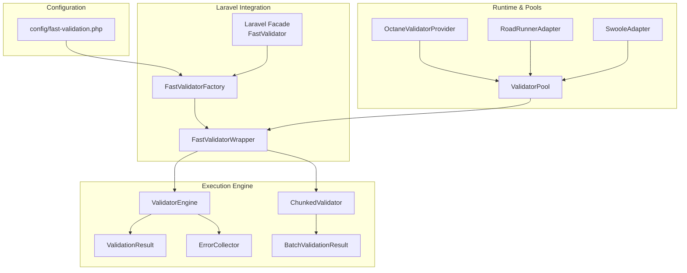
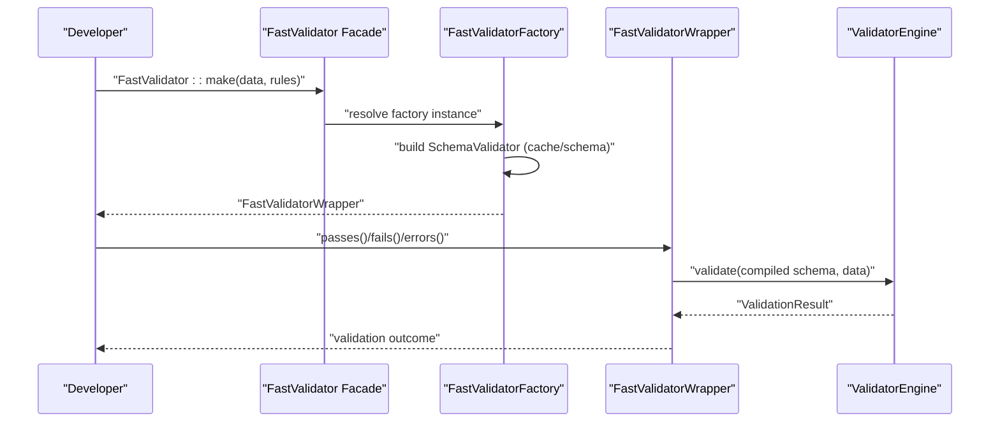
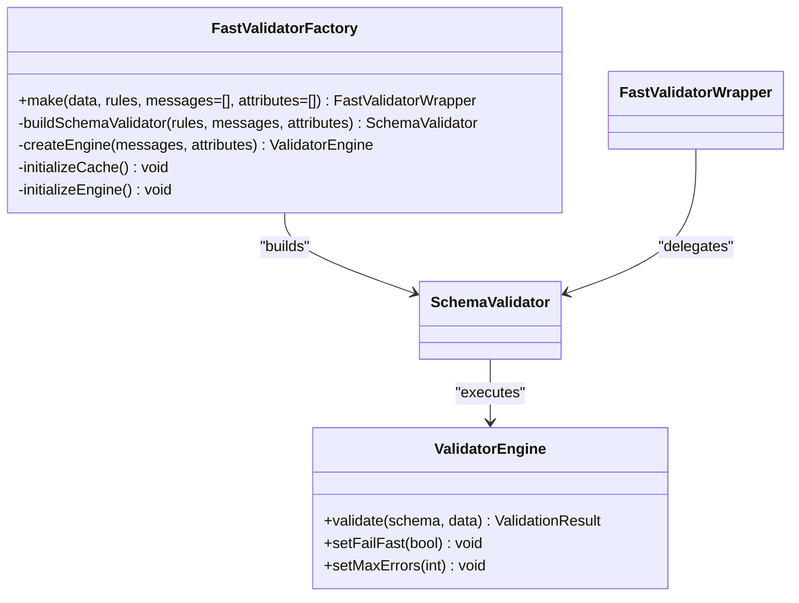
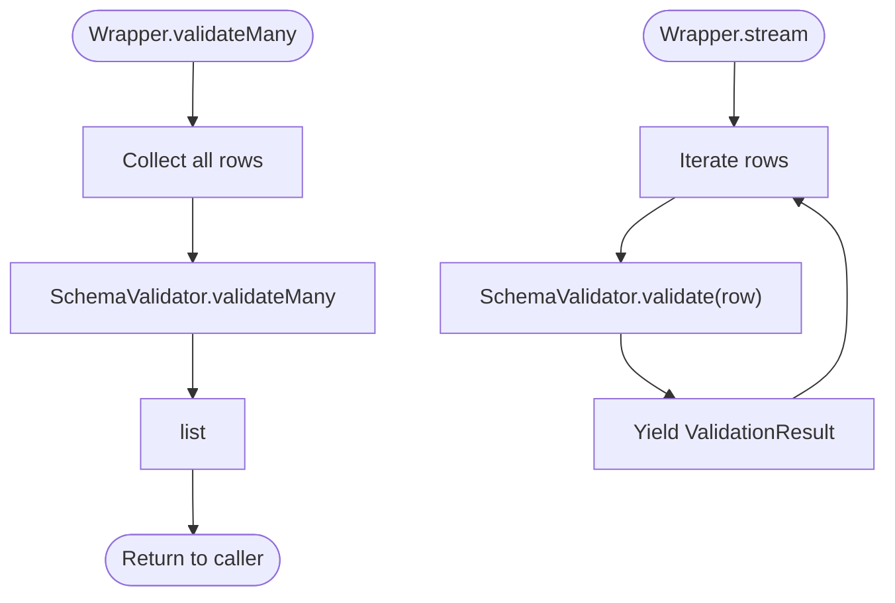
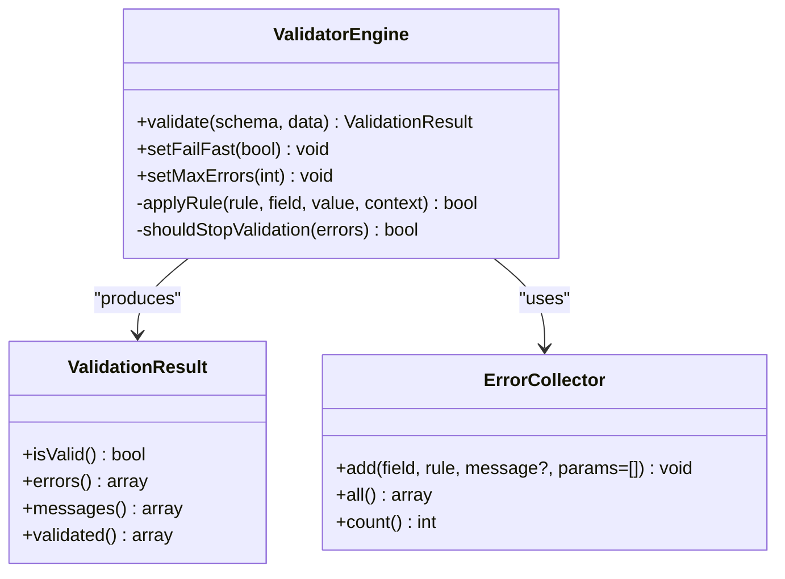
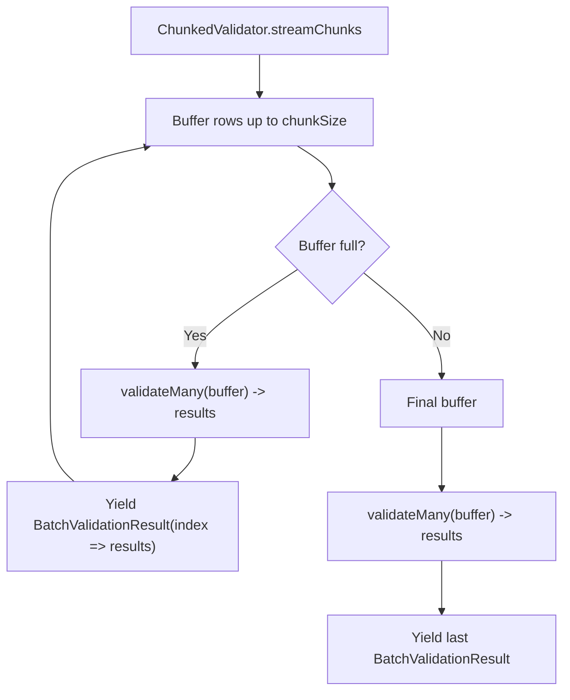
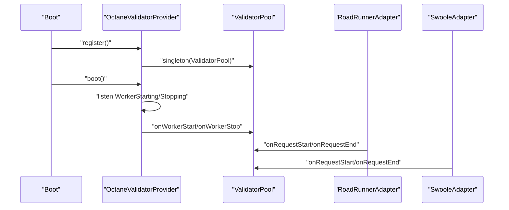
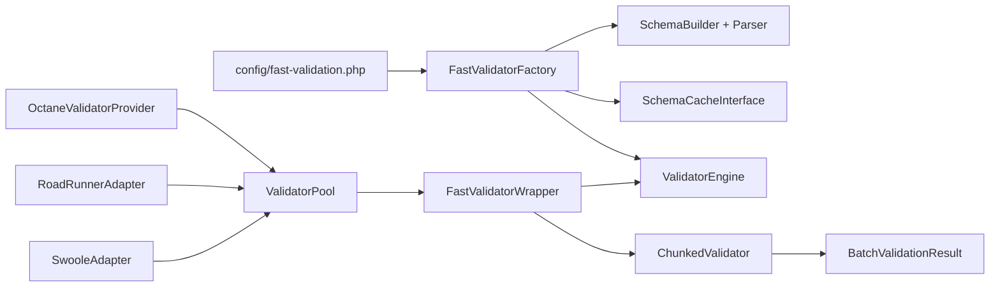

# Parallel Mode

<cite>
**Referenced Files in This Document**
- [config/fast-validation.php](file://config/fast-validation.php)
- [src/Laravel/FastValidatorFactory.php](file://src/Laravel/FastValidatorFactory.php)
- [src/Laravel/Facades/FastValidator.php](file://src/Laravel/Facades/FastValidator.php)
- [src/Laravel/FastValidatorWrapper.php](file://src/Laravel/FastValidatorWrapper.php)
- [src/Execution/ValidatorEngine.php](file://src/Execution/ValidatorEngine.php)
- [src/Execution/ValidationResult.php](file://src/Execution/ValidationResult.php)
- [src/Execution/ErrorCollector.php](file://src/Execution/ErrorCollector.php)
- [src/Execution/BatchValidationResult.php](file://src/Execution/BatchValidationResult.php)
- [src/Execution/ChunkedValidator.php](file://src/Execution/ChunkedValidator.php)
- [src/Runtime/ValidatorPool.php](file://src/Runtime/ValidatorPool.php)
- [src/Laravel/Octane/OctaneValidatorProvider.php](file://src/Laravel/Octane/OctaneValidatorProvider.php)
- [src/Runtime/Workers/RoadRunnerAdapter.php](file://src/Runtime/Workers/RoadRunnerAdapter.php)
- [src/Runtime/Workers/SwooleAdapter.php](file://src/Runtime/Workers/SwooleAdapter.php)
- [README.md](file://README.md)
</cite>

## Table of Contents
1. [Introduction](#introduction)
2. [Project Structure](#project-structure)
3. [Core Components](#core-components)
4. [Architecture Overview](#architecture-overview)
5. [Detailed Component Analysis](#detailed-component-analysis)
6. [Dependency Analysis](#dependency-analysis)
7. [Performance Considerations](#performance-considerations)
8. [Troubleshooting Guide](#troubleshooting-guide)
9. [Conclusion](#conclusion)
10. [Appendices](#appendices)

## Introduction
This document explains parallel mode integration for the Laravel validation package. It covers the parallel execution model, how to use FastValidatorFactory and the FastValidator facade, and how parallel mode differs from override mode. It also documents configuration options for parallel mode, including worker pool settings, memory management, and concurrency controls. Practical examples demonstrate batch processing patterns, streaming validation, and integration with Laravel controllers and jobs. Finally, it addresses error handling, result collection, performance monitoring, limitations, best practices, and troubleshooting.

## Project Structure
Parallel mode centers around a dedicated factory and wrapper that produce a Laravel-compatible validator interface. Long-running environments are supported via runtime adapters and a validator pool. Configuration is centralized in the fast-validation.php config file.

**Diagram sources**
- [config/fast-validation.php](file://config/fast-validation.php#L5-L96)
- [src/Laravel/FastValidatorFactory.php](file://src/Laravel/FastValidatorFactory.php#L19-L144)
- [src/Laravel/Facades/FastValidator.php](file://src/Laravel/Facades/FastValidator.php#L16-L22)
- [src/Laravel/FastValidatorWrapper.php](file://src/Laravel/FastValidatorWrapper.php#L14-L399)
- [src/Execution/ValidatorEngine.php](file://src/Execution/ValidatorEngine.php#L11-L177)
- [src/Execution/ValidationResult.php](file://src/Execution/ValidationResult.php#L9-L142)
- [src/Execution/ErrorCollector.php](file://src/Execution/ErrorCollector.php#L7-L51)
- [src/Execution/BatchValidationResult.php](file://src/Execution/BatchValidationResult.php#L17-L92)
- [src/Execution/ChunkedValidator.php](file://src/Execution/ChunkedValidator.php#L16-L154)
- [src/Runtime/ValidatorPool.php](file://src/Runtime/ValidatorPool.php#L12-L140)
- [src/Laravel/Octane/OctaneValidatorProvider.php](file://src/Laravel/Octane/OctaneValidatorProvider.php#L18-L88)
- [src/Runtime/Workers/RoadRunnerAdapter.php](file://src/Runtime/Workers/RoadRunnerAdapter.php#L13-L107)
- [src/Runtime/Workers/SwooleAdapter.php](file://src/Runtime/Workers/SwooleAdapter.php#L13-L95)

**Section sources**
- [config/fast-validation.php](file://config/fast-validation.php#L5-L96)
- [src/Laravel/FastValidatorFactory.php](file://src/Laravel/FastValidatorFactory.php#L19-L144)
- [src/Laravel/Facades/FastValidator.php](file://src/Laravel/Facades/FastValidator.php#L16-L22)
- [src/Laravel/FastValidatorWrapper.php](file://src/Laravel/FastValidatorWrapper.php#L14-L399)
- [src/Execution/ValidatorEngine.php](file://src/Execution/ValidatorEngine.php#L11-L177)
- [src/Execution/ValidationResult.php](file://src/Execution/ValidationResult.php#L9-L142)
- [src/Execution/ErrorCollector.php](file://src/Execution/ErrorCollector.php#L7-L51)
- [src/Execution/BatchValidationResult.php](file://src/Execution/BatchValidationResult.php#L17-L92)
- [src/Execution/ChunkedValidator.php](file://src/Execution/ChunkedValidator.php#L16-L154)
- [src/Runtime/ValidatorPool.php](file://src/Runtime/ValidatorPool.php#L12-L140)
- [src/Laravel/Octane/OctaneValidatorProvider.php](file://src/Laravel/Octane/OctaneValidatorProvider.php#L18-L88)
- [src/Runtime/Workers/RoadRunnerAdapter.php](file://src/Runtime/Workers/RoadRunnerAdapter.php#L13-L107)
- [src/Runtime/Workers/SwooleAdapter.php](file://src/Runtime/Workers/SwooleAdapter.php#L13-L95)

## Core Components
- FastValidatorFactory: Builds a SchemaValidator with caching and locale-aware message resolution, returning a FastValidatorWrapper for validation operations.
- FastValidator facade: Provides convenient access to the factory via the service container.
- FastValidatorWrapper: Implements Laravel’s Validator contract, enabling fail/passes/validation workflows and streaming/batch APIs.
- ValidatorEngine: Executes compiled schemas, applies rules, collects errors, and supports fail-fast and max-errors limits.
- ValidationResult: Encapsulates validation outcome, including errors, resolved messages, and validated data.
- ErrorCollector: Accumulates field-level errors during validation.
- BatchValidationResult: Aggregates many results with streaming iteration and convenience queries (allValid, failures, counts).
- ChunkedValidator: Validates large datasets in chunks, streaming results and failures for memory efficiency.
- ValidatorPool and runtime adapters: Manage validator instances in long-running environments (Octane, RoadRunner, Swoole) to reduce allocations and improve throughput.

**Section sources**
- [src/Laravel/FastValidatorFactory.php](file://src/Laravel/FastValidatorFactory.php#L19-L144)
- [src/Laravel/Facades/FastValidator.php](file://src/Laravel/Facades/FastValidator.php#L16-L22)
- [src/Laravel/FastValidatorWrapper.php](file://src/Laravel/FastValidatorWrapper.php#L14-L399)
- [src/Execution/ValidatorEngine.php](file://src/Execution/ValidatorEngine.php#L11-L177)
- [src/Execution/ValidationResult.php](file://src/Execution/ValidationResult.php#L9-L142)
- [src/Execution/ErrorCollector.php](file://src/Execution/ErrorCollector.php#L7-L51)
- [src/Execution/BatchValidationResult.php](file://src/Execution/BatchValidationResult.php#L17-L92)
- [src/Execution/ChunkedValidator.php](file://src/Execution/ChunkedValidator.php#L16-L154)
- [src/Runtime/ValidatorPool.php](file://src/Runtime/ValidatorPool.php#L12-L140)
- [src/Runtime/Workers/RoadRunnerAdapter.php](file://src/Runtime/Workers/RoadRunnerAdapter.php#L13-L107)
- [src/Runtime/Workers/SwooleAdapter.php](file://src/Runtime/Workers/SwooleAdapter.php#L13-L95)

## Architecture Overview
Parallel mode keeps Laravel’s Validator::make unchanged and introduces an opt-in API. Developers explicitly construct fast validators via the factory or facade, enabling incremental adoption and safer migration compared to override mode.

**Diagram sources**
- [src/Laravel/Facades/FastValidator.php](file://src/Laravel/Facades/FastValidator.php#L16-L22)
- [src/Laravel/FastValidatorFactory.php](file://src/Laravel/FastValidatorFactory.php#L51-L60)
- [src/Laravel/FastValidatorWrapper.php](file://src/Laravel/FastValidatorWrapper.php#L74-L86)
- [src/Execution/ValidatorEngine.php](file://src/Execution/ValidatorEngine.php#L33-L98)

**Section sources**
- [README.md](file://README.md#L432-L448)
- [src/Laravel/FastValidatorFactory.php](file://src/Laravel/FastValidatorFactory.php#L51-L60)
- [src/Laravel/FastValidatorWrapper.php](file://src/Laravel/FastValidatorWrapper.php#L74-L86)
- [src/Execution/ValidatorEngine.php](file://src/Execution/ValidatorEngine.php#L33-L98)

## Detailed Component Analysis

### Parallel vs Override Mode
- Parallel mode (default): Explicit API via FastValidatorFactory or facade; Laravel’s Validator::make remains unaffected.
- Override mode: Routes Laravel’s Validator::make through the fast engine for supported rules.

Practical implication: Start with parallel mode for safety and gradually adopt fast paths.

**Section sources**
- [README.md](file://README.md#L432-L448)

### FastValidatorFactory Usage Patterns
- Construct a validator with make(data, rules, messages?, attributes?).
- Returns a FastValidatorWrapper implementing Laravel’s Validator contract.
- Supports caching and locale-aware messages; rules parsed into a compiled schema.

**Diagram sources**
- [src/Laravel/FastValidatorFactory.php](file://src/Laravel/FastValidatorFactory.php#L51-L144)
- [src/Execution/ValidatorEngine.php](file://src/Execution/ValidatorEngine.php#L33-L98)

**Section sources**
- [src/Laravel/FastValidatorFactory.php](file://src/Laravel/FastValidatorFactory.php#L51-L144)

### FastValidator Facade Functionality
- Facade resolves FastValidatorFactory from the container.
- Exposes the make method for convenient usage in controllers and jobs.

**Section sources**
- [src/Laravel/Facades/FastValidator.php](file://src/Laravel/Facades/FastValidator.php#L16-L22)

### FastValidatorWrapper API Surface
- Lifecycle: passes/fails, errors, validated, getData.
- Streaming and batch APIs: stream(rows?), each(rows?, callback), failures(rows?), firstFailure(rows?), allValid(rows?), validateMany(rows?).
- Memory-conscious defaults: lazy materialization of data; streaming APIs avoid storing all results.

**Diagram sources**
- [src/Laravel/FastValidatorWrapper.php](file://src/Laravel/FastValidatorWrapper.php#L395-L398)
- [src/Laravel/FastValidatorWrapper.php](file://src/Laravel/FastValidatorWrapper.php#L309-L312)

**Section sources**
- [src/Laravel/FastValidatorWrapper.php](file://src/Laravel/FastValidatorWrapper.php#L74-L86)
- [src/Laravel/FastValidatorWrapper.php](file://src/Laravel/FastValidatorWrapper.php#L309-L398)

### Execution Engine and Result Model
- ValidatorEngine applies compiled rules, respects bail, nullable, and sometimes semantics, and supports fail-fast and max-errors.
- ValidationResult exposes validity, errors, messages, and validated data (excluding excluded fields).
- ErrorCollector accumulates errors incrementally.

**Diagram sources**
- [src/Execution/ValidatorEngine.php](file://src/Execution/ValidatorEngine.php#L33-L177)
- [src/Execution/ValidationResult.php](file://src/Execution/ValidationResult.php#L59-L142)
- [src/Execution/ErrorCollector.php](file://src/Execution/ErrorCollector.php#L17-L50)

**Section sources**
- [src/Execution/ValidatorEngine.php](file://src/Execution/ValidatorEngine.php#L33-L177)
- [src/Execution/ValidationResult.php](file://src/Execution/ValidationResult.php#L59-L142)
- [src/Execution/ErrorCollector.php](file://src/Execution/ErrorCollector.php#L17-L50)

### Batch and Chunked Validation
- BatchValidationResult aggregates many results with streaming iteration and convenience methods (allValid, failures, failureCount).
- ChunkedValidator validates rows in chunks, supporting:
  - validateInChunks(rows, chunkSize, onChunk)
  - streamChunks(rows, chunkSize) -> Generator<int, BatchValidationResult>
  - streamFailures(rows, chunkSize) -> Generator<int, ValidationResult>
  - countFailures(rows, chunkSize)

**Diagram sources**
- [src/Execution/ChunkedValidator.php](file://src/Execution/ChunkedValidator.php#L63-L81)
- [src/Execution/BatchValidationResult.php](file://src/Execution/BatchValidationResult.php#L17-L92)

**Section sources**
- [src/Execution/ChunkedValidator.php](file://src/Execution/ChunkedValidator.php#L25-L127)
- [src/Execution/BatchValidationResult.php](file://src/Execution/BatchValidationResult.php#L17-L92)

### Runtime Pools and Long-Running Environments
- ValidatorPool manages StatelessValidator instances with acquire/release and a withValidator helper.
- OctaneValidatorProvider registers pool and ContextManager singletons and listens to Octane lifecycle events.
- RoadRunnerAdapter and SwooleAdapter integrate lifecycle hooks and request-scoped cleanup.

**Diagram sources**
- [src/Laravel/Octane/OctaneValidatorProvider.php](file://src/Laravel/Octane/OctaneValidatorProvider.php#L20-L66)
- [src/Runtime/ValidatorPool.php](file://src/Runtime/ValidatorPool.php#L26-L90)
- [src/Runtime/Workers/RoadRunnerAdapter.php](file://src/Runtime/Workers/RoadRunnerAdapter.php#L23-L49)
- [src/Runtime/Workers/SwooleAdapter.php](file://src/Runtime/Workers/SwooleAdapter.php#L25-L52)

**Section sources**
- [src/Runtime/ValidatorPool.php](file://src/Runtime/ValidatorPool.php#L12-L140)
- [src/Laravel/Octane/OctaneValidatorProvider.php](file://src/Laravel/Octane/OctaneValidatorProvider.php#L18-L88)
- [src/Runtime/Workers/RoadRunnerAdapter.php](file://src/Runtime/Workers/RoadRunnerAdapter.php#L13-L107)
- [src/Runtime/Workers/SwooleAdapter.php](file://src/Runtime/Workers/SwooleAdapter.php#L13-L95)

## Dependency Analysis
- Configuration drives factory behavior (cache, compilation, performance, localization, runtime).
- Factory depends on SchemaBuilder, LaravelRuleParser, and caches CompiledSchema.
- Wrapper delegates to SchemaValidator and ValidatorEngine.
- Runtime adapters depend on ValidatorPool.

**Diagram sources**
- [config/fast-validation.php](file://config/fast-validation.php#L5-L96)
- [src/Laravel/FastValidatorFactory.php](file://src/Laravel/FastValidatorFactory.php#L75-L144)
- [src/Laravel/FastValidatorWrapper.php](file://src/Laravel/FastValidatorWrapper.php#L14-L399)
- [src/Execution/ChunkedValidator.php](file://src/Execution/ChunkedValidator.php#L16-L154)
- [src/Runtime/ValidatorPool.php](file://src/Runtime/ValidatorPool.php#L12-L140)
- [src/Laravel/Octane/OctaneValidatorProvider.php](file://src/Laravel/Octane/OctaneValidatorProvider.php#L18-L88)
- [src/Runtime/Workers/RoadRunnerAdapter.php](file://src/Runtime/Workers/RoadRunnerAdapter.php#L13-L107)
- [src/Runtime/Workers/SwooleAdapter.php](file://src/Runtime/Workers/SwooleAdapter.php#L13-L95)

**Section sources**
- [config/fast-validation.php](file://config/fast-validation.php#L5-L96)
- [src/Laravel/FastValidatorFactory.php](file://src/Laravel/FastValidatorFactory.php#L75-L144)
- [src/Laravel/FastValidatorWrapper.php](file://src/Laravel/FastValidatorWrapper.php#L14-L399)
- [src/Execution/ChunkedValidator.php](file://src/Execution/ChunkedValidator.php#L16-L154)
- [src/Runtime/ValidatorPool.php](file://src/Runtime/ValidatorPool.php#L12-L140)
- [src/Laravel/Octane/OctaneValidatorProvider.php](file://src/Laravel/Octane/OctaneValidatorProvider.php#L18-L88)
- [src/Runtime/Workers/RoadRunnerAdapter.php](file://src/Runtime/Workers/RoadRunnerAdapter.php#L13-L107)
- [src/Runtime/Workers/SwooleAdapter.php](file://src/Runtime/Workers/SwooleAdapter.php#L13-L95)

## Performance Considerations
- Fail-fast and max-errors: Configure early termination and cap on collected errors to reduce overhead.
- Fast-path rules: Enable optimized rule handling for common validations.
- Memory management: Prefer streaming APIs (stream, each, failures, streamChunks) for large datasets; avoid validateMany for very large inputs.
- Runtime pooling: Use ValidatorPool in Octane, RoadRunner, and Swoole to minimize allocations and warm-up costs.
- Chunked processing: Use ChunkedValidator to bound memory usage when processing millions of rows.

[No sources needed since this section provides general guidance]

## Troubleshooting Guide
- Unexpectedly slow validation:
  - Verify fail_fast and max_errors settings.
  - Ensure schema caching is enabled and cache driver is appropriate.
- Memory spikes on bulk validation:
  - Switch from validateMany to stream or streamChunks.
  - Adjust chunkSize to balance throughput and memory.
- Errors not appearing:
  - Confirm custom messages and attributes are set on the wrapper before validation.
  - Check that the engine’s message resolver is configured with the intended locale.
- Long-running process leaks:
  - Ensure runtime adapters’ onRequestEnd clears request state.
  - Confirm Octane provider listeners are registered and pool lifecycle methods are invoked.

**Section sources**
- [src/Execution/ValidatorEngine.php](file://src/Execution/ValidatorEngine.php#L100-L123)
- [src/Laravel/FastValidatorFactory.php](file://src/Laravel/FastValidatorFactory.php#L146-L175)
- [src/Execution/ChunkedValidator.php](file://src/Execution/ChunkedValidator.php#L25-L127)
- [src/Runtime/Workers/RoadRunnerAdapter.php](file://src/Runtime/Workers/RoadRunnerAdapter.php#L77-L106)
- [src/Laravel/Octane/OctaneValidatorProvider.php](file://src/Laravel/Octane/OctaneValidatorProvider.php#L43-L66)

## Conclusion
Parallel mode offers a safe, incremental path to high-performance validation in Laravel by keeping existing Validator::make intact while introducing an opt-in fast validator API. With robust configuration, runtime pooling, and streaming/batch APIs, teams can scale validation workloads efficiently. Start with parallel mode, adopt fast-path rules gradually, and leverage chunked processing and pools for long-running environments.

[No sources needed since this section summarizes without analyzing specific files]

## Appendices

### Configuration Options for Parallel Mode
- mode: parallel (default) or override.
- cache.enabled/driver/ttl/path: enable and configure schema caching.
- compilation.precompile/cache_path: precompile and cache compiled schemas.
- performance.fail_fast/max_errors/fast_path_rules: tune validation behavior.
- localization.locale/fallback_locale: set locales for messages.
- runtime.pooling/pool_size/auto_detect: enable pooling and set pool size for long-running environments.

**Section sources**
- [config/fast-validation.php](file://config/fast-validation.php#L5-L96)

### Practical Examples

- Basic controller usage (parallel mode):
  - Resolve FastValidatorFactory from the container and call make with data and rules.
  - Use passes/fails and errors to handle responses.

- Streaming validation for large datasets:
  - Use stream() to iterate ValidationResult items one by one.
  - Use failures() to yield only invalid items with their indices.

- Batch processing with chunking:
  - Use streamChunks() to process fixed-size batches and aggregate results.
  - Use countFailures() to compute totals without materializing all results.

- Jobs and queues:
  - Inject the factory into job handlers and validate payloads using the same wrapper APIs.
  - Use each() to process and react to each result immediately.

**Section sources**
- [README.md](file://README.md#L450-L477)
- [src/Laravel/FastValidatorWrapper.php](file://src/Laravel/FastValidatorWrapper.php#L309-L398)
- [src/Execution/ChunkedValidator.php](file://src/Execution/ChunkedValidator.php#L63-L127)