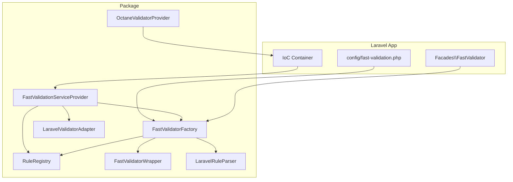
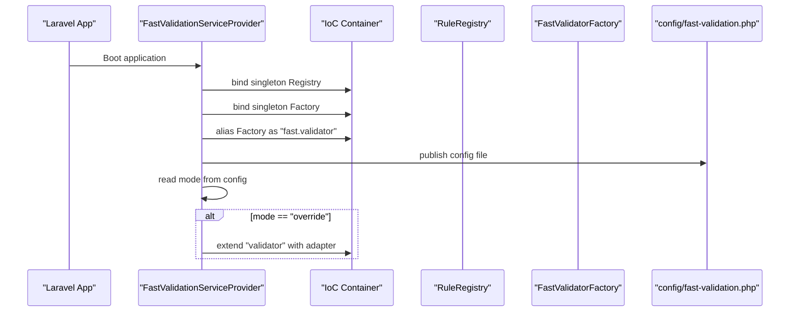
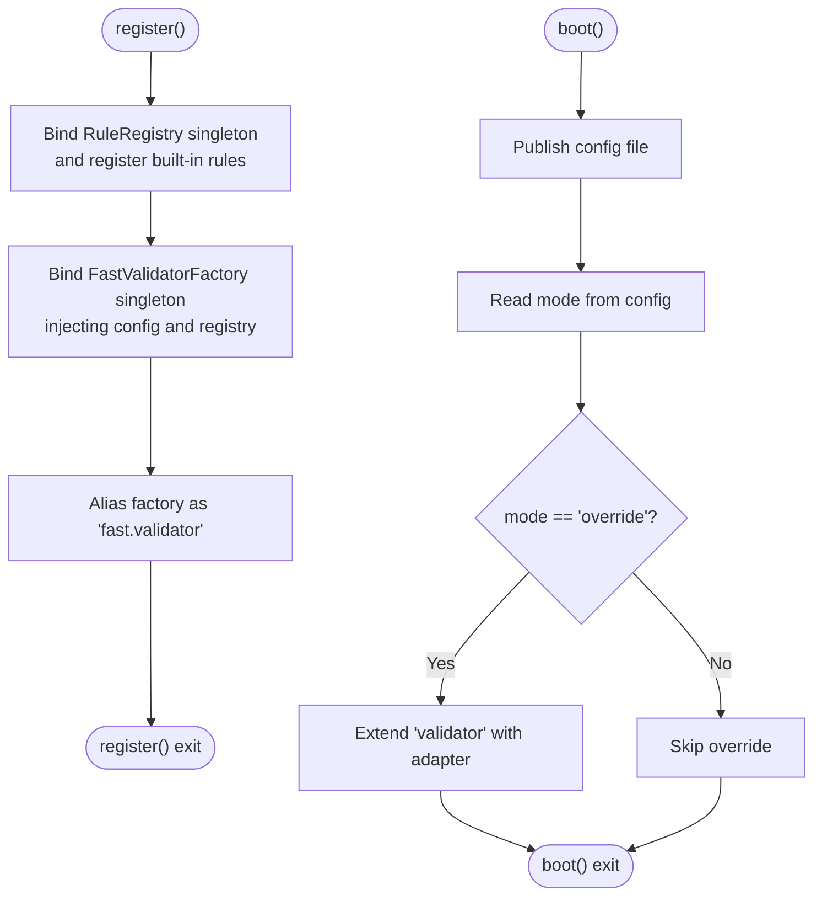
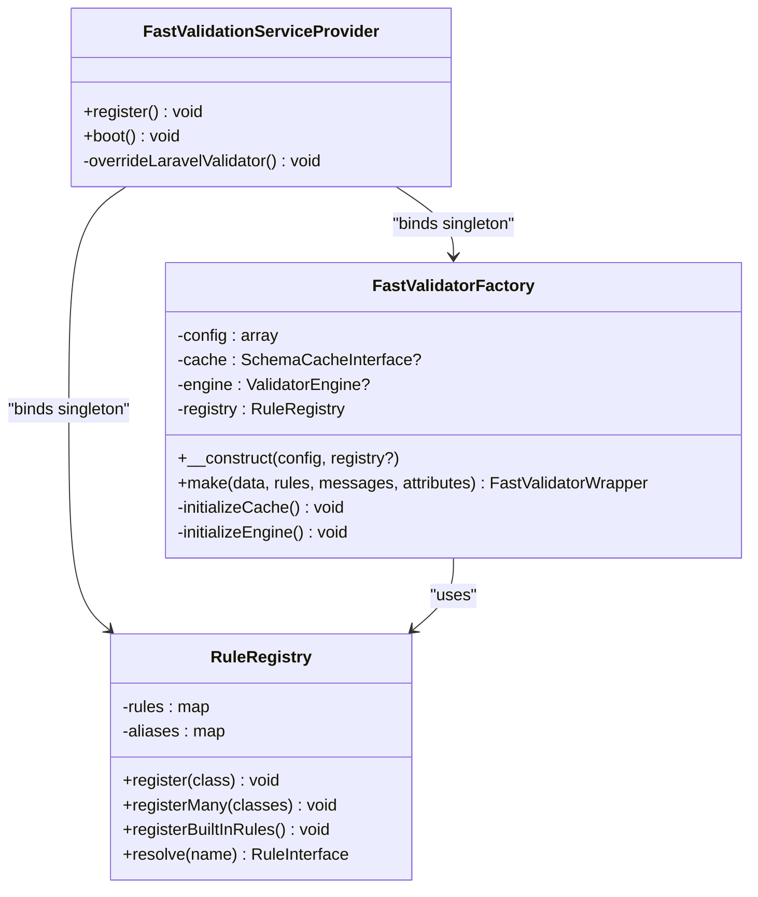
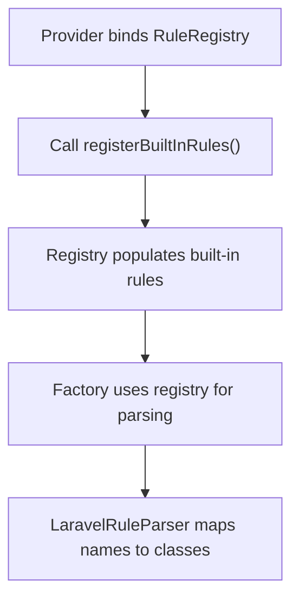
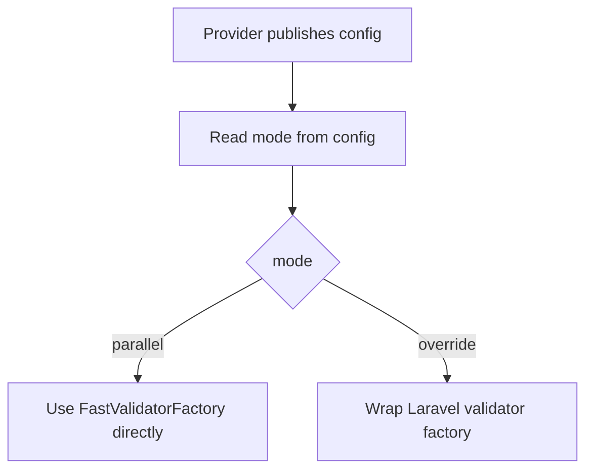
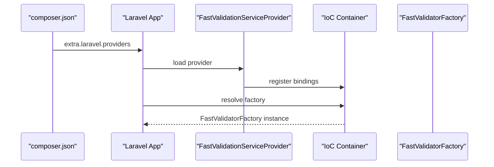
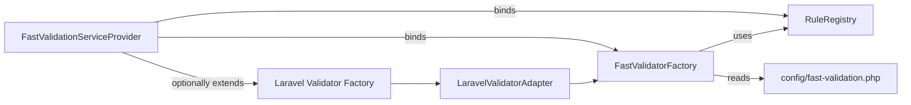

# Service Provider Setup

<cite>
**Referenced Files in This Document**
- [FastValidationServiceProvider.php](file://src/Laravel/FastValidationServiceProvider.php)
- [FastValidatorFactory.php](file://src/Laravel/FastValidatorFactory.php)
- [RuleRegistry.php](file://src/Rules/RuleRegistry.php)
- [fast-validation.php](file://config/fast-validation.php)
- [composer.json](file://composer.json)
- [FastValidatorWrapper.php](file://src/Laravel/FastValidatorWrapper.php)
- [LaravelValidatorAdapter.php](file://src/Laravel/LaravelValidatorAdapter.php)
- [FastValidator.php](file://src/Laravel/Facades/FastValidator.php)
- [LaravelRuleParser.php](file://src/Laravel/LaravelRuleParser.php)
- [OctaneValidatorProvider.php](file://src/Laravel/Octane/OctaneValidatorProvider.php)
- [README.md](file://README.md)
</cite>

## Table of Contents
1. [Introduction](#introduction)
2. [Project Structure](#project-structure)
3. [Core Components](#core-components)
4. [Architecture Overview](#architecture-overview)
5. [Detailed Component Analysis](#detailed-component-analysis)
6. [Dependency Analysis](#dependency-analysis)
7. [Performance Considerations](#performance-considerations)
8. [Troubleshooting Guide](#troubleshooting-guide)
9. [Conclusion](#conclusion)

## Introduction
This document explains how to set up and use the Laravel service provider for the Fast Validation package. It covers the FastValidationServiceProvider lifecycle, singleton bindings for RuleRegistry and FastValidatorFactory, automatic rule registration, configuration publishing, and integration with Laravel’s IoC container. It also documents package discovery, manual registration, and practical examples for initialization and usage.

## Project Structure
The Laravel integration is centered around a service provider that registers core services and publishes configuration. The key files involved in service provider setup and Laravel integration are:

- Service provider: registers bindings and publishes configuration
- Factory: constructs validators and manages schema caching and engines
- Registry: maps rule names to classes and registers built-in rules
- Configuration: defaults and environment-driven tuning
- Facade: convenient access to the factory
- Adapter: optional override of Laravel’s validator factory
- Parser: converts Laravel-style rule strings to internal rule instances
- Octane provider: optional runtime support for long-running processes

**Diagram sources**
- [FastValidationServiceProvider.php](file://src/Laravel/FastValidationServiceProvider.php#L12-L53)
- [FastValidatorFactory.php](file://src/Laravel/FastValidatorFactory.php#L19-L41)
- [RuleRegistry.php](file://src/Rules/RuleRegistry.php#L14-L301)
- [fast-validation.php](file://config/fast-validation.php#L5-L96)
- [FastValidatorWrapper.php](file://src/Laravel/FastValidatorWrapper.php#L14-L47)
- [LaravelValidatorAdapter.php](file://src/Laravel/LaravelValidatorAdapter.php#L9-L55)
- [LaravelRuleParser.php](file://src/Laravel/LaravelRuleParser.php#L12-L117)
- [OctaneValidatorProvider.php](file://src/Laravel/Octane/OctaneValidatorProvider.php#L18-L87)

**Section sources**
- [FastValidationServiceProvider.php](file://src/Laravel/FastValidationServiceProvider.php#L12-L53)
- [composer.json](file://composer.json#L23-L31)

## Core Components
- FastValidationServiceProvider: registers singleton bindings, publishes configuration, and conditionally overrides Laravel’s validator factory.
- FastValidatorFactory: constructs validators, builds schemas, initializes caches and engines, and handles configuration-driven behavior.
- RuleRegistry: maintains rule name-to-class mapping and registers built-in rules.
- FastValidatorWrapper: implements Laravel’s validator contract and exposes streaming/validation helpers.
- LaravelValidatorAdapter: wraps Laravel’s validator factory to route calls to the fast engine when applicable.
- LaravelRuleParser: parses Laravel-style rule strings into internal rule instances using the registry.
- Facade FastValidator: provides a convenient accessor to the factory.
- OctaneValidatorProvider: optional provider for long-running process support.

**Section sources**
- [FastValidationServiceProvider.php](file://src/Laravel/FastValidationServiceProvider.php#L14-L52)
- [FastValidatorFactory.php](file://src/Laravel/FastValidatorFactory.php#L30-L41)
- [RuleRegistry.php](file://src/Rules/RuleRegistry.php#L195-L300)
- [FastValidatorWrapper.php](file://src/Laravel/FastValidatorWrapper.php#L14-L47)
- [LaravelValidatorAdapter.php](file://src/Laravel/LaravelValidatorAdapter.php#L9-L34)
- [LaravelRuleParser.php](file://src/Laravel/LaravelRuleParser.php#L28-L61)
- [FastValidator.php](file://src/Laravel/Facades/FastValidator.php#L16-L22)
- [OctaneValidatorProvider.php](file://src/Laravel/Octane/OctaneValidatorProvider.php#L18-L32)

## Architecture Overview
The service provider orchestrates the Laravel integration by binding RuleRegistry and FastValidatorFactory into the container, publishing configuration, and optionally overriding Laravel’s validator factory. The factory composes a schema builder, parser, and engine, and supports caching and localization.

**Diagram sources**
- [FastValidationServiceProvider.php](file://src/Laravel/FastValidationServiceProvider.php#L14-L52)
- [fast-validation.php](file://config/fast-validation.php#L15-L15)

## Detailed Component Analysis

### FastValidationServiceProvider
- Lifecycle:
  - register(): binds RuleRegistry and FastValidatorFactory as singletons; aliases the factory for convenience.
  - boot(): publishes the configuration file under a tag and conditionally overrides Laravel’s validator factory based on mode.
- Automatic rule registration:
  - RuleRegistry is constructed and populated with built-in rules during binding.
- Configuration publishing:
  - Publishes the package configuration file to the application’s config directory.
- Override behavior:
  - When mode is set to override, the provider extends Laravel’s validator factory to route calls through the fast engine.

**Diagram sources**
- [FastValidationServiceProvider.php](file://src/Laravel/FastValidationServiceProvider.php#L14-L52)
- [fast-validation.php](file://config/fast-validation.php#L15-L15)

**Section sources**
- [FastValidationServiceProvider.php](file://src/Laravel/FastValidationServiceProvider.php#L14-L52)

### Singleton Bindings and Dependency Injection
- RuleRegistry singleton:
  - Constructed once and populated with built-in rules.
  - Used by FastValidatorFactory to parse rule strings into rule instances.
- FastValidatorFactory singleton:
  - Constructed with configuration and the RuleRegistry.
  - Initializes schema cache and engine based on configuration.
  - Provides a make() method that returns a FastValidatorWrapper implementing Laravel’s validator contract.
- IoC alias:
  - The factory is aliased as “fast.validator” for convenience.

**Diagram sources**
- [FastValidationServiceProvider.php](file://src/Laravel/FastValidationServiceProvider.php#L16-L30)
- [FastValidatorFactory.php](file://src/Laravel/FastValidatorFactory.php#L30-L41)
- [RuleRegistry.php](file://src/Rules/RuleRegistry.php#L195-L300)

**Section sources**
- [FastValidationServiceProvider.php](file://src/Laravel/FastValidationServiceProvider.php#L16-L30)
- [FastValidatorFactory.php](file://src/Laravel/FastValidatorFactory.php#L30-L41)
- [RuleRegistry.php](file://src/Rules/RuleRegistry.php#L195-L300)

### Automatic Rule Registration
- Built-in rules:
  - The provider binds a RuleRegistry and calls registerBuiltInRules() to register a comprehensive set of Laravel-style rules.
- Rule parsing:
  - LaravelRuleParser resolves rule names to classes via RuleRegistry and instantiates them with parameters parsed from rule strings.

**Diagram sources**
- [FastValidationServiceProvider.php](file://src/Laravel/FastValidationServiceProvider.php#L16-L20)
- [RuleRegistry.php](file://src/Rules/RuleRegistry.php#L195-L300)
- [LaravelRuleParser.php](file://src/Laravel/LaravelRuleParser.php#L78-L116)

**Section sources**
- [FastValidationServiceProvider.php](file://src/Laravel/FastValidationServiceProvider.php#L16-L20)
- [RuleRegistry.php](file://src/Rules/RuleRegistry.php#L195-L300)
- [LaravelRuleParser.php](file://src/Laravel/LaravelRuleParser.php#L78-L116)

### Configuration Publishing and Modes
- Publishing:
  - The provider publishes the package configuration file to the application’s config directory.
- Modes:
  - parallel: use FastValidator as a separate, opt-in API.
  - override: route Laravel’s Validator::make() through the fast engine when supported.

**Diagram sources**
- [FastValidationServiceProvider.php](file://src/Laravel/FastValidationServiceProvider.php#L34-L42)
- [fast-validation.php](file://config/fast-validation.php#L15-L15)

**Section sources**
- [FastValidationServiceProvider.php](file://src/Laravel/FastValidationServiceProvider.php#L34-L42)
- [fast-validation.php](file://config/fast-validation.php#L15-L15)

### Integration with Laravel’s IoC Container
- Package discovery:
  - composer.json declares the provider and facade alias for auto-discovery.
- Manual registration:
  - If auto-discovery is disabled, add the provider and alias to config/app.php.
- Access patterns:
  - app(FastValidatorFactory::class)
  - app('fast.validator')
  - Facade FastValidator::make()

**Diagram sources**
- [composer.json](file://composer.json#L24-L31)
- [FastValidationServiceProvider.php](file://src/Laravel/FastValidationServiceProvider.php#L14-L30)

**Section sources**
- [composer.json](file://composer.json#L24-L31)
- [README.md](file://README.md#L381-L406)

### Practical Examples and Usage Patterns
- Parallel mode usage:
  - Resolve the factory from the container and call make() with data and rules.
  - Use wrapper methods like fails(), errors(), validated(), and streaming helpers.
- Override mode usage:
  - Use Laravel’s Validator facade; calls are routed through the fast engine when supported.
- Facade usage:
  - Use FastValidator facade to call make() directly.

Refer to the quick start and Laravel integration sections in the README for concrete examples.

**Section sources**
- [README.md](file://README.md#L53-L94)
- [README.md](file://README.md#L381-L406)
- [README.md](file://README.md#L450-L477)
- [README.md](file://README.md#L486-L506)

## Dependency Analysis
The service provider depends on the container to manage singleton lifecycles and on configuration to decide behavior. The factory depends on the registry for rule resolution and on configuration for cache/engine behavior. The adapter depends on the factory and the fallback Laravel validator factory.

**Diagram sources**
- [FastValidationServiceProvider.php](file://src/Laravel/FastValidationServiceProvider.php#L16-L30)
- [FastValidatorFactory.php](file://src/Laravel/FastValidatorFactory.php#L30-L41)
- [fast-validation.php](file://config/fast-validation.php#L5-L96)
- [LaravelValidatorAdapter.php](file://src/Laravel/LaravelValidatorAdapter.php#L9-L34)

**Section sources**
- [FastValidationServiceProvider.php](file://src/Laravel/FastValidationServiceProvider.php#L16-L30)
- [FastValidatorFactory.php](file://src/Laravel/FastValidatorFactory.php#L30-L41)
- [LaravelValidatorAdapter.php](file://src/Laravel/LaravelValidatorAdapter.php#L9-L34)

## Performance Considerations
- Schema caching:
  - The factory initializes a cache based on configuration; choose driver and TTL according to workload.
- Fail-fast and error limits:
  - Configuration allows early termination and limiting total errors to reduce overhead.
- Streaming and chunked validation:
  - Use wrapper methods like stream(), each(), and failures() for memory-efficient batch processing.

**Section sources**
- [FastValidatorFactory.php](file://src/Laravel/FastValidatorFactory.php#L146-L175)
- [FastValidatorWrapper.php](file://src/Laravel/FastValidatorWrapper.php#L286-L384)
- [fast-validation.php](file://config/fast-validation.php#L54-L63)

## Troubleshooting Guide
- Provider not registered:
  - Ensure auto-discovery is enabled or manually add the provider and alias to config/app.php.
- Configuration not loaded:
  - Publish the config file and verify the mode setting.
- Override mode not taking effect:
  - Confirm mode is set to override and that the adapter is extending the validator factory.
- Unknown rule errors:
  - Verify the rule name exists in the registry or that the rule is supported in override mode.
- Caching issues:
  - Adjust cache driver, path, and TTL in configuration.

**Section sources**
- [composer.json](file://composer.json#L24-L31)
- [README.md](file://README.md#L381-L406)
- [README.md](file://README.md#L408-L431)
- [FastValidationServiceProvider.php](file://src/Laravel/FastValidationServiceProvider.php#L34-L42)
- [RuleRegistry.php](file://src/Rules/RuleRegistry.php#L180-L190)

## Conclusion
The Fast Validation service provider integrates seamlessly with Laravel through package discovery and manual registration. It binds RuleRegistry and FastValidatorFactory as singletons, publishes configuration, and optionally overrides Laravel’s validator factory. The factory’s configuration-driven behavior enables caching, localization, and performance tuning. Use the provided examples and troubleshooting tips to integrate the package efficiently and resolve common setup issues.