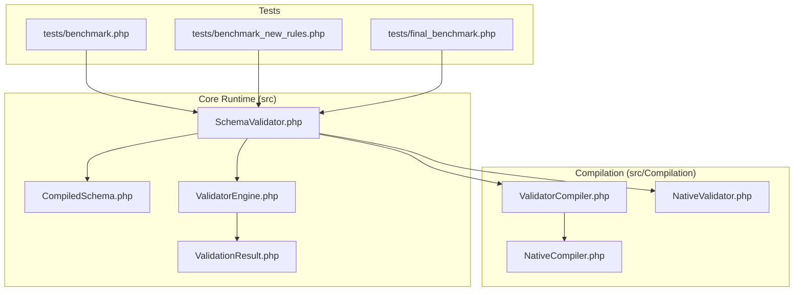
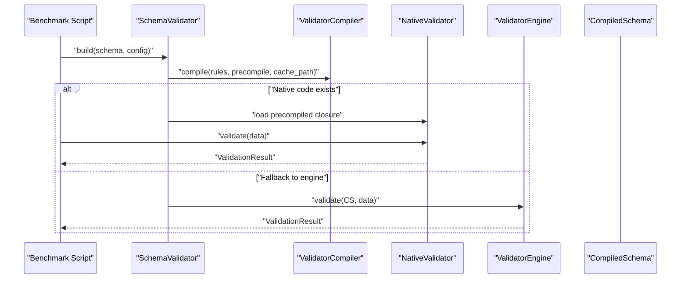
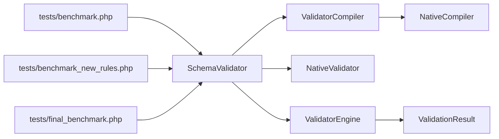

# Benchmarking and Performance Tools

<cite>
**Referenced Files in This Document**
- [benchmark.php](file://tests/benchmark.php)
- [benchmark_new_rules.php](file://tests/benchmark_new_rules.php)
- [final_benchmark.php](file://tests/final_benchmark.php)
- [SchemaValidator.php](file://src/SchemaValidator.php)
- [ValidatorEngine.php](file://src/Execution/ValidatorEngine.php)
- [CompiledSchema.php](file://src/Execution/CompiledSchema.php)
- [ValidatorCompiler.php](file://src/Compilation/ValidatorCompiler.php)
- [NativeCompiler.php](file://src/Compilation/NativeCompiler.php)
- [NativeValidator.php](file://src/Execution/NativeValidator.php)
- [ValidationResult.php](file://src/Execution/ValidationResult.php)
- [README.md](file://README.md)
</cite>

## Table of Contents
1. [Introduction](#introduction)
2. [Project Structure](#project-structure)
3. [Core Components](#core-components)
4. [Architecture Overview](#architecture-overview)
5. [Detailed Component Analysis](#detailed-component-analysis)
6. [Dependency Analysis](#dependency-analysis)
7. [Performance Considerations](#performance-considerations)
8. [Troubleshooting Guide](#troubleshooting-guide)
9. [Conclusion](#conclusion)
10. [Appendices](#appendices)

## Introduction
This document explains the benchmarking and performance measurement tools included in the repository, focusing on three benchmark scripts: basic performance testing, rule-specific testing, and comprehensive performance analysis. It also documents the underlying architecture and performance optimization features that enable high-throughput validation, including compilation, caching, and native code generation. Guidance is provided for running benchmarks, interpreting results, identifying bottlenecks, and optimizing validation pipelines.

## Project Structure
The benchmarking tools reside under the tests directory alongside correctness and parity verification utilities. The core validation runtime and compilation pipeline live under src/, organized by domain areas such as Execution, Compilation, and Rules.

**Diagram sources**
- [benchmark.php](file://tests/benchmark.php#L1-L55)
- [benchmark_new_rules.php](file://tests/benchmark_new_rules.php#L1-L67)
- [final_benchmark.php](file://tests/final_benchmark.php#L1-L80)
- [SchemaValidator.php](file://src/SchemaValidator.php#L1-L205)
- [CompiledSchema.php](file://src/Execution/CompiledSchema.php#L1-L68)
- [ValidatorEngine.php](file://src/Execution/ValidatorEngine.php#L1-L177)
- [ValidatorCompiler.php](file://src/Compilation/ValidatorCompiler.php#L1-L195)
- [NativeCompiler.php](file://src/Compilation/NativeCompiler.php#L1-L310)
- [NativeValidator.php](file://src/Execution/NativeValidator.php#L1-L39)
- [ValidationResult.php](file://src/Execution/ValidationResult.php#L1-L142)

**Section sources**
- [benchmark.php](file://tests/benchmark.php#L1-L55)
- [benchmark_new_rules.php](file://tests/benchmark_new_rules.php#L1-L67)
- [final_benchmark.php](file://tests/final_benchmark.php#L1-L80)

## Core Components
- SchemaValidator orchestrates schema building, compilation, caching, and validation execution. It supports multiple streaming and batch APIs optimized for memory and throughput.
- ValidatorEngine performs field-level validation, applies rules, and collects errors with configurable fail-fast and error limits.
- CompiledSchema encapsulates compiled field definitions and delegates validation to the engine.
- ValidatorCompiler manages object caching, legacy precompiled files, and native code generation to disk.
- NativeCompiler generates ultra-fast PHP closures for validated schemas, inlining common rules and minimizing function calls.
- NativeValidator executes the precompiled closures for maximum performance.
- ValidationResult represents validation outcomes and provides accessors for errors and formatted messages.

**Section sources**
- [SchemaValidator.php](file://src/SchemaValidator.php#L1-L205)
- [ValidatorEngine.php](file://src/Execution/ValidatorEngine.php#L1-L177)
- [CompiledSchema.php](file://src/Execution/CompiledSchema.php#L1-L68)
- [ValidatorCompiler.php](file://src/Compilation/ValidatorCompiler.php#L1-L195)
- [NativeCompiler.php](file://src/Compilation/NativeCompiler.php#L1-L310)
- [NativeValidator.php](file://src/Execution/NativeValidator.php#L1-L39)
- [ValidationResult.php](file://src/Execution/ValidationResult.php#L1-L142)

## Architecture Overview
The benchmarking suite exercises the same runtime path used in production. Benchmarks measure end-to-end performance for single and batch validation, including preparation time, validation time, and throughput. They also verify parity with expected outcomes and optionally leverage native compilation for peak performance.

**Diagram sources**
- [benchmark.php](file://tests/benchmark.php#L15-L45)
- [benchmark_new_rules.php](file://tests/benchmark_new_rules.php#L23-L58)
- [final_benchmark.php](file://tests/final_benchmark.php#L24-L77)
- [SchemaValidator.php](file://src/SchemaValidator.php#L35-L73)
- [ValidatorCompiler.php](file://src/Compilation/ValidatorCompiler.php#L33-L74)
- [NativeValidator.php](file://src/Execution/NativeValidator.php#L27-L37)
- [ValidatorEngine.php](file://src/Execution/ValidatorEngine.php#L33-L98)

## Detailed Component Analysis

### Basic Performance Testing: benchmark.php
Purpose:
- Measures preparation and validation time for a typical schema with nested fields.
- Computes throughput in rows per second and counts failures.

Methodology:
- Disables garbage collection to reduce noise.
- Builds a schema with multiple fields and nested structures.
- Generates synthetic data arrays sized for meaningful throughput measurement.
- Uses validateMany to process all rows and compute duration and throughput.

Interpretation:
- Preparation time reflects schema compilation and data generation costs.
- Validation time indicates runtime performance; lower is better.
- Throughput helps compare systems or configurations.
- Failure count verifies that validation is active and catching invalid data.

Optimization tips:
- Prefer streaming APIs for large datasets to reduce memory usage.
- Enable native compilation to accelerate repeated validations.

**Section sources**
- [benchmark.php](file://tests/benchmark.php#L1-L55)
- [SchemaValidator.php](file://src/SchemaValidator.php#L84-L93)

### Rule-Specific Testing: benchmark_new_rules.php
Purpose:
- Benchmarks performance with specialized rules (e.g., alpha-dash, MAC address, ULID, uppercase, date format, multiple-of, not-regex).

Methodology:
- Builds a schema targeting new or complex rules.
- Generates representative data for each field.
- Runs validateMany and reports timing and throughput.

Interpretation:
- Highlights performance characteristics of specific rules.
- Useful for rule selection and tuning.

**Section sources**
- [benchmark_new_rules.php](file://tests/benchmark_new_rules.php#L1-L67)
- [SchemaValidator.php](file://src/SchemaValidator.php#L84-L93)

### Comprehensive Performance Analysis: final_benchmark.php
Purpose:
- Ensures parity with expected outcomes, compiles the schema, and measures sustained performance over many iterations.

Methodology:
- Creates a cache directory for compiled artifacts.
- Compiles the schema with explicit compilation configuration.
- Validates normal and invalid data to confirm parity.
- Runs many iterations using high-resolution timing and computes total time, throughput, and average time per validation.

Interpretation:
- Parity checks ensure correctness before measuring performance.
- Throughput and average latency help assess system capacity and responsiveness.
- Use this script to compare configurations, rule sets, or environment changes.

**Section sources**
- [final_benchmark.php](file://tests/final_benchmark.php#L1-L80)
- [SchemaValidator.php](file://src/SchemaValidator.php#L20-L50)
- [ValidatorEngine.php](file://src/Execution/ValidatorEngine.php#L33-L98)

### Performance Measurement Methodologies
- Timing:
  - Microsecond-precision timers are used in basic benchmarks.
  - High-resolution timing is used in the comprehensive benchmark for accurate iteration measurements.
- Throughput:
  - Computed as number_of_validations / elapsed_time.
- Statistical analysis:
  - The repository does not include built-in statistical analysis functions. To compute variance or confidence intervals, run the benchmark multiple times and collect durations and throughput values externally.

**Section sources**
- [benchmark.php](file://tests/benchmark.php#L13-L45)
- [benchmark_new_rules.php](file://tests/benchmark_new_rules.php#L20-L58)
- [final_benchmark.php](file://tests/final_benchmark.php#L66-L77)

### Comparison Metrics Against Standard Laravel Validation
- The repository includes parity and reproduction utilities that demonstrate comparisons with Laravel’s validator in controlled scenarios. These utilities show how to validate identical data with both engines and compare outcomes and performance characteristics.

**Section sources**
- [check_parity.php](file://tests/check_parity.php#L50-L72)
- [performance_repro.php](file://tests/performance_repro.php#L90-L96)

### Running Benchmarks
- Prepare environment:
  - Ensure Composer autoload is loaded.
  - Confirm cache directories exist for compiled artifacts if using native compilation.
- Execute scripts:
  - Run each benchmark script individually to observe preparation time, validation time, throughput, and failure counts.
- Interpret results:
  - Compare throughput across runs and configurations.
  - Verify parity with expected outcomes before drawing conclusions.

**Section sources**
- [benchmark.php](file://tests/benchmark.php#L3-L10)
- [benchmark_new_rules.php](file://tests/benchmark_new_rules.php#L3-L18)
- [final_benchmark.php](file://tests/final_benchmark.php#L8-L28)

### Interpreting Results
- Preparation time:
  - Indicates schema compilation and data generation cost.
- Validation time:
  - Reflects runtime performance; lower is preferable.
- Throughput:
  - Higher values indicate better performance.
- Failures:
  - Non-zero failure counts confirm validation logic is active.

**Section sources**
- [benchmark.php](file://tests/benchmark.php#L36-L54)
- [benchmark_new_rules.php](file://tests/benchmark_new_rules.php#L49-L66)
- [final_benchmark.php](file://tests/final_benchmark.php#L72-L77)

### Identifying Performance Bottlenecks
- Rule complexity:
  - Complex or regex-heavy rules can slow validation. Use simpler alternatives when feasible.
- Data size and nesting:
  - Deeper nesting increases traversal cost. Keep nested structures shallow.
- Memory usage:
  - validateMany materializes all results; for large datasets, prefer streaming APIs to reduce memory pressure.
- Compilation and caching:
  - Ensure native compilation is enabled and cache paths are configured to avoid repeated compilation overhead.

**Section sources**
- [SchemaValidator.php](file://src/SchemaValidator.php#L84-L203)
- [ValidatorCompiler.php](file://src/Compilation/ValidatorCompiler.php#L79-L103)
- [NativeCompiler.php](file://src/Compilation/NativeCompiler.php#L24-L51)

### Optimizing Validation Pipelines Based on Benchmark Data
- Prefer streaming APIs:
  - Use stream(), each(), failures(), and chunked validators for large datasets.
- Enable native compilation:
  - Configure cache_path to allow native code generation and reuse.
- Tune engine behavior:
  - Adjust fail-fast and max-errors settings to balance accuracy and speed.
- Reduce rule overhead:
  - Replace expensive rules with cheaper alternatives where appropriate.

**Section sources**
- [README.md](file://README.md#L205-L376)
- [SchemaValidator.php](file://src/SchemaValidator.php#L113-L203)
- [ValidatorEngine.php](file://src/Execution/ValidatorEngine.php#L100-L123)
- [ValidatorCompiler.php](file://src/Compilation/ValidatorCompiler.php#L79-L103)

## Dependency Analysis
The benchmark scripts depend on SchemaValidator, which coordinates compilation, caching, and execution. Native compilation is optional but recommended for sustained performance.

**Diagram sources**
- [benchmark.php](file://tests/benchmark.php#L5-L45)
- [benchmark_new_rules.php](file://tests/benchmark_new_rules.php#L5-L58)
- [final_benchmark.php](file://tests/final_benchmark.php#L26-L77)
- [SchemaValidator.php](file://src/SchemaValidator.php#L35-L73)
- [ValidatorCompiler.php](file://src/Compilation/ValidatorCompiler.php#L33-L74)
- [NativeCompiler.php](file://src/Compilation/NativeCompiler.php#L24-L51)
- [NativeValidator.php](file://src/Execution/NativeValidator.php#L27-L37)
- [ValidatorEngine.php](file://src/Execution/ValidatorEngine.php#L33-L98)
- [ValidationResult.php](file://src/Execution/ValidationResult.php#L67-L96)

**Section sources**
- [benchmark.php](file://tests/benchmark.php#L5-L45)
- [benchmark_new_rules.php](file://tests/benchmark_new_rules.php#L5-L58)
- [final_benchmark.php](file://tests/final_benchmark.php#L26-L77)
- [SchemaValidator.php](file://src/SchemaValidator.php#L35-L73)

## Performance Considerations
- Compilation and caching:
  - Native code generation reduces function call overhead and improves throughput.
- Streaming vs batching:
  - Streaming APIs minimize memory footprint for large datasets.
- Engine configuration:
  - Fail-fast and error limits can reduce processing time at the cost of completeness.
- Rule selection:
  - Choose efficient rules and avoid redundant checks.

**Section sources**
- [ValidatorCompiler.php](file://src/Compilation/ValidatorCompiler.php#L79-L103)
- [NativeCompiler.php](file://src/Compilation/NativeCompiler.php#L24-L51)
- [SchemaValidator.php](file://src/SchemaValidator.php#L113-L203)
- [ValidatorEngine.php](file://src/Execution/ValidatorEngine.php#L100-L123)
- [README.md](file://README.md#L205-L376)

## Troubleshooting Guide
- Garbage collection interference:
  - Benchmarks disable garbage collection to avoid spurious spikes. Ensure this is intentional in your environment.
- Cache path permissions:
  - Ensure the cache directory exists and is writable for native compilation.
- Parity failures:
  - Use parity scripts to compare outcomes with expected behavior before concluding performance issues.
- Memory exhaustion:
  - For large datasets, prefer streaming APIs to avoid materializing all results.

**Section sources**
- [benchmark.php](file://tests/benchmark.php#L8-L10)
- [final_benchmark.php](file://tests/final_benchmark.php#L8-L12)
- [check_parity.php](file://tests/check_parity.php#L50-L72)
- [SchemaValidator.php](file://src/SchemaValidator.php#L84-L203)

## Conclusion
The benchmarking suite provides practical tools to measure and optimize validation performance. By leveraging compilation, caching, and streaming APIs, teams can achieve high throughput while maintaining correctness. Use the provided scripts to establish baselines, compare configurations, and guide rule and schema design decisions.

## Appendices

### Benchmark Scripts Reference
- benchmark.php: Basic throughput measurement with nested schema and data generation.
- benchmark_new_rules.php: Rule-specific performance assessment for advanced rules.
- final_benchmark.php: Comprehensive benchmark including parity checks and high-resolution timing.

**Section sources**
- [benchmark.php](file://tests/benchmark.php#L1-L55)
- [benchmark_new_rules.php](file://tests/benchmark_new_rules.php#L1-L67)
- [final_benchmark.php](file://tests/final_benchmark.php#L1-L80)