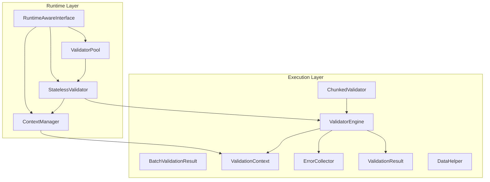
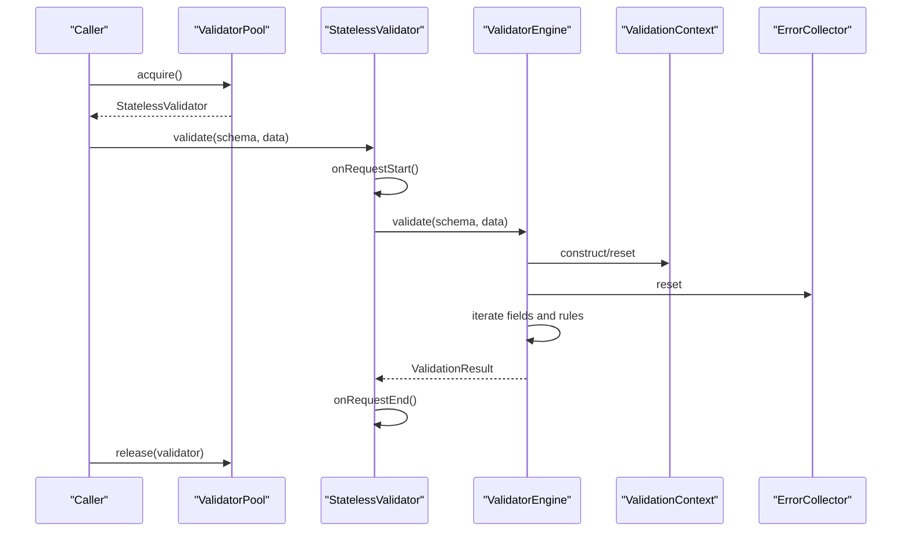
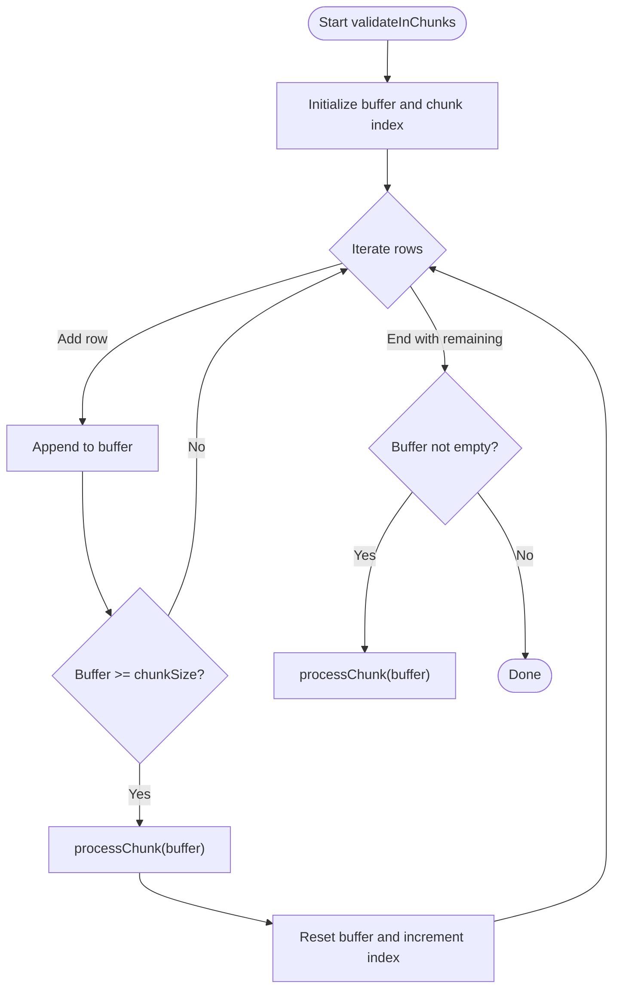
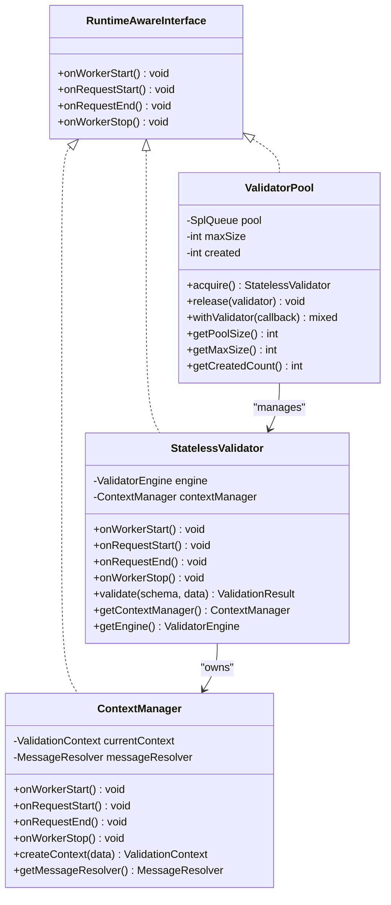
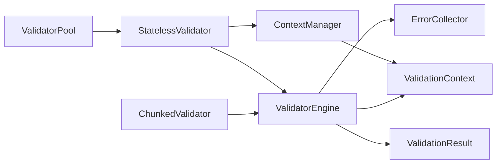

# Memory Management

<cite>
**Referenced Files in This Document**
- [ChunkedValidator.php](file://src/Execution/ChunkedValidator.php)
- [BatchValidationResult.php](file://src/Execution/BatchValidationResult.php)
- [ValidatorEngine.php](file://src/Execution/ValidatorEngine.php)
- [ValidationContext.php](file://src/Execution/ValidationContext.php)
- [ErrorCollector.php](file://src/Execution/ErrorCollector.php)
- [ValidationResult.php](file://src/Execution/ValidationResult.php)
- [DataHelper.php](file://src/Execution/DataHelper.php)
- [ValidatorPool.php](file://src/Runtime/ValidatorPool.php)
- [StatelessValidator.php](file://src/Runtime/StatelessValidator.php)
- [ContextManager.php](file://src/Runtime/ContextManager.php)
- [RuntimeAwareInterface.php](file://src/Runtime/RuntimeAwareInterface.php)
- [benchmark.php](file://tests/benchmark.php)
- [final_benchmark.php](file://tests/final_benchmark.php)
- [benchmark_new_rules.php](file://tests/benchmark_new_rules.php)
- [performance_repro.php](file://tests/performance_repro.php)
</cite>

## Table of Contents
1. [Introduction](#introduction)
2. [Project Structure](#project-structure)
3. [Core Components](#core-components)
4. [Architecture Overview](#architecture-overview)
5. [Detailed Component Analysis](#detailed-component-analysis)
6. [Dependency Analysis](#dependency-analysis)
7. [Performance Considerations](#performance-considerations)
8. [Troubleshooting Guide](#troubleshooting-guide)
9. [Conclusion](#conclusion)
10. [Appendices](#appendices)

## Introduction
This document focuses on memory management optimization techniques in vi/validation. It explains how to process large datasets without memory overflow using chunked validation, how to reuse validator resources efficiently in high-throughput environments with validator pooling, and how to adopt stateless validation patterns to improve garbage collection behavior. Practical examples demonstrate memory profiling and heap usage monitoring, along with best practices for memory-constrained environments and long-running processes.

## Project Structure
The memory optimization features are primarily implemented in two areas:
- Execution layer: chunked validation, batch results, and validation engine
- Runtime layer: validator pooling and stateless wrappers with lifecycle-aware context management

**Diagram sources**
- [ChunkedValidator.php](file://src/Execution/ChunkedValidator.php#L1-L154)
- [BatchValidationResult.php](file://src/Execution/BatchValidationResult.php#L1-L92)
- [ValidatorEngine.php](file://src/Execution/ValidatorEngine.php#L1-L177)
- [ValidationContext.php](file://src/Execution/ValidationContext.php#L1-L98)
- [ErrorCollector.php](file://src/Execution/ErrorCollector.php#L1-L51)
- [ValidationResult.php](file://src/Execution/ValidationResult.php#L1-L142)
- [DataHelper.php](file://src/Execution/DataHelper.php#L1-L32)
- [ValidatorPool.php](file://src/Runtime/ValidatorPool.php#L1-L140)
- [StatelessValidator.php](file://src/Runtime/StatelessValidator.php#L1-L79)
- [ContextManager.php](file://src/Runtime/ContextManager.php#L1-L119)
- [RuntimeAwareInterface.php](file://src/Runtime/RuntimeAwareInterface.php#L1-L32)

**Section sources**
- [ChunkedValidator.php](file://src/Execution/ChunkedValidator.php#L1-L154)
- [ValidatorPool.php](file://src/Runtime/ValidatorPool.php#L1-L140)
- [StatelessValidator.php](file://src/Runtime/StatelessValidator.php#L1-L79)
- [ContextManager.php](file://src/Runtime/ContextManager.php#L1-L119)
- [ValidatorEngine.php](file://src/Execution/ValidatorEngine.php#L1-L177)

## Core Components
- ChunkedValidator: Processes large iterables in fixed-size chunks to limit peak memory usage. Provides callbacks, generators for streaming, and failure-only streaming to reduce memory footprint.
- ValidatorPool: Reuses StatelessValidator instances across requests in long-running workers, reducing allocation churn and enabling predictable memory behavior.
- StatelessValidator: Wraps ValidatorEngine and ContextManager with explicit request boundaries to avoid state leakage and enable efficient pooling.
- ContextManager: Resets request-scoped state (errors, messages, attributes) to keep memory clean between validations.
- ValidatorEngine: Central validation executor that reuses shared context and error collector instances to minimize allocations during repeated validations.
- BatchValidationResult: Holds batch results with streaming iteration and filtering helpers to avoid materializing unnecessary data.

**Section sources**
- [ChunkedValidator.php](file://src/Execution/ChunkedValidator.php#L1-L154)
- [ValidatorPool.php](file://src/Runtime/ValidatorPool.php#L1-L140)
- [StatelessValidator.php](file://src/Runtime/StatelessValidator.php#L1-L79)
- [ContextManager.php](file://src/Runtime/ContextManager.php#L1-L119)
- [ValidatorEngine.php](file://src/Execution/ValidatorEngine.php#L1-L177)
- [BatchValidationResult.php](file://src/Execution/BatchValidationResult.php#L1-L92)

## Architecture Overview
The memory-efficient validation pipeline leverages:
- Chunked processing to cap memory growth proportional to chunk size
- Validator pooling to reuse expensive-to-allocate objects
- Stateless wrappers to enforce request-scoped lifecycles
- Shared context and error collectors to reduce per-validation allocations

**Diagram sources**
- [ValidatorPool.php](file://src/Runtime/ValidatorPool.php#L59-L90)
- [StatelessValidator.php](file://src/Runtime/StatelessValidator.php#L53-L61)
- [ValidatorEngine.php](file://src/Execution/ValidatorEngine.php#L33-L98)
- [ValidationContext.php](file://src/Execution/ValidationContext.php#L17-L21)
- [ErrorCollector.php](file://src/Execution/ErrorCollector.php#L27-L31)

## Detailed Component Analysis

### ChunkedValidator
Purpose:
- Validate large datasets in fixed-size chunks to avoid memory overflow
- Provide streaming and failure-only modes to reduce memory pressure

Key behaviors:
- Buffer rows until reaching chunkSize, then validate the buffer and flush
- StreamChunks yields per-chunk results for low-memory consumption
- streamFailures yields only invalid results with minimal intermediate storage
- countFailures aggregates failures without retaining all results

Memory implications:
- Peak memory scales linearly with chunkSize
- Streaming modes avoid retaining entire result sets
- Failure-only mode reduces memory by discarding valid items

**Diagram sources**
- [ChunkedValidator.php](file://src/Execution/ChunkedValidator.php#L34-L52)

**Section sources**
- [ChunkedValidator.php](file://src/Execution/ChunkedValidator.php#L25-L52)
- [ChunkedValidator.php](file://src/Execution/ChunkedValidator.php#L63-L81)
- [ChunkedValidator.php](file://src/Execution/ChunkedValidator.php#L92-L110)
- [ChunkedValidator.php](file://src/Execution/ChunkedValidator.php#L118-L127)

### ValidatorPool and StatelessValidator
Purpose:
- Reuse StatelessValidator instances to reduce allocation and initialization overhead
- Enforce lifecycle hooks to keep memory clean between requests

Key behaviors:
- Pre-warm pool on worker start
- Acquire/released validators with request lifecycle events
- withValidator automatically manages acquire/release
- StatelessValidator wraps ValidatorEngine and ContextManager with explicit request boundaries

Memory implications:
- Limits number of live validator instances to max size
- Reduces GC pressure by reusing objects
- Request boundaries ensure no cross-request state remains

**Diagram sources**
- [RuntimeAwareInterface.php](file://src/Runtime/RuntimeAwareInterface.php#L1-L32)
- [ValidatorPool.php](file://src/Runtime/ValidatorPool.php#L1-L140)
- [StatelessValidator.php](file://src/Runtime/StatelessValidator.php#L1-L79)
- [ContextManager.php](file://src/Runtime/ContextManager.php#L1-L119)

**Section sources**
- [ValidatorPool.php](file://src/Runtime/ValidatorPool.php#L26-L54)
- [ValidatorPool.php](file://src/Runtime/ValidatorPool.php#L59-L90)
- [ValidatorPool.php](file://src/Runtime/ValidatorPool.php#L99-L108)
- [StatelessValidator.php](file://src/Runtime/StatelessValidator.php#L28-L46)
- [StatelessValidator.php](file://src/Runtime/StatelessValidator.php#L53-L61)

### Stateless Validation Lifecycle and Garbage Collection
Patterns:
- Explicit request boundaries: onRequestStart/onRequestEnd reset stateful components
- Worker lifecycle: onWorkerStart initializes long-lived resources; onWorkerStop cleans up
- StatelessValidator ensures no persistent state leaks between validations

Benefits:
- Predictable memory behavior in long-running workers
- Easier GC because transient objects are short-lived and clearly scoped
- Reduced contention on shared mutable state

**Section sources**
- [ContextManager.php](file://src/Runtime/ContextManager.php#L30-L42)
- [ContextManager.php](file://src/Runtime/ContextManager.php#L55-L61)
- [StatelessValidator.php](file://src/Runtime/StatelessValidator.php#L33-L40)

### ValidatorEngine Memory Efficiency
Key mechanisms:
- Reuses a single ValidationContext and ErrorCollector across validations
- Resets state before each validation to avoid accumulation
- Applies fail-fast and max-errors limits to cap work

Memory implications:
- Reduced allocations for context and error collections
- Controlled termination prevents runaway memory growth

**Section sources**
- [ValidatorEngine.php](file://src/Execution/ValidatorEngine.php#L33-L41)
- [ValidatorEngine.php](file://src/Execution/ValidatorEngine.php#L148-L159)

### BatchValidationResult and Streaming
- Holds a list of ValidationResult for batch operations
- Supports streaming iteration and filtering (failures only)
- Enables counting failures without retaining all results

Memory implications:
- Streaming avoids materializing entire lists when not needed
- failures() filters reduce memory retention of successful results

**Section sources**
- [BatchValidationResult.php](file://src/Execution/BatchValidationResult.php#L17-L47)
- [BatchValidationResult.php](file://src/Execution/BatchValidationResult.php#L68-L90)

### Supporting Types
- ValidationContext: lightweight accessor for nested data and error aggregation
- ErrorCollector: compact error accumulator with reset semantics
- ValidationResult: immutable error container with message resolution
- DataHelper: safe dot-notation access helper

**Section sources**
- [ValidationContext.php](file://src/Execution/ValidationContext.php#L43-L58)
- [ErrorCollector.php](file://src/Execution/ErrorCollector.php#L17-L31)
- [ValidationResult.php](file://src/Execution/ValidationResult.php#L11-L32)
- [DataHelper.php](file://src/Execution/DataHelper.php#L15-L30)

## Dependency Analysis

**Diagram sources**
- [ChunkedValidator.php](file://src/Execution/ChunkedValidator.php#L1-L154)
- [ValidatorEngine.php](file://src/Execution/ValidatorEngine.php#L1-L177)
- [ValidationContext.php](file://src/Execution/ValidationContext.php#L1-L98)
- [ErrorCollector.php](file://src/Execution/ErrorCollector.php#L1-L51)
- [ValidationResult.php](file://src/Execution/ValidationResult.php#L1-L142)
- [StatelessValidator.php](file://src/Runtime/StatelessValidator.php#L1-L79)
- [ContextManager.php](file://src/Runtime/ContextManager.php#L1-L119)
- [ValidatorPool.php](file://src/Runtime/ValidatorPool.php#L1-L140)

**Section sources**
- [ChunkedValidator.php](file://src/Execution/ChunkedValidator.php#L1-L154)
- [ValidatorEngine.php](file://src/Execution/ValidatorEngine.php#L1-L177)
- [ValidatorPool.php](file://src/Runtime/ValidatorPool.php#L1-L140)

## Performance Considerations
- Use ChunkedValidator.validateInChunks with a moderate chunkSize to balance throughput and memory. Smaller chunks reduce peak memory but increase orchestration overhead; larger chunks increase throughput but memory usage.
- Prefer streamChunks for continuous processing with minimal memory retention.
- Use streamFailures to report only invalid rows, avoiding memory for valid results.
- Enable compilation caching to reduce JIT and schema compilation overhead, indirectly lowering memory churn.
- In long-running workers, configure ValidatorPool with a modest max size to cap memory while maintaining throughput.
- StatelessValidator lifecycle hooks ensure no cross-request state persists, aiding GC predictability.

[No sources needed since this section provides general guidance]

## Troubleshooting Guide
Common symptoms and remedies:
- Memory spikes during validation
  - Use chunked validation with a smaller chunkSize
  - Switch to streamChunks or streamFailures
- Excessive allocations in long-running processes
  - Use ValidatorPool.acquire/release or withValidator to reuse StatelessValidator instances
  - Ensure ContextManager resets on request boundaries
- Unexpected state leakage between validations
  - Verify StatelessValidator lifecycle calls (onRequestStart/onRequestEnd)
  - Confirm ValidatorEngine resets context and error collector before each validation

**Section sources**
- [ChunkedValidator.php](file://src/Execution/ChunkedValidator.php#L34-L52)
- [ValidatorPool.php](file://src/Runtime/ValidatorPool.php#L59-L90)
- [StatelessValidator.php](file://src/Runtime/StatelessValidator.php#L53-L61)
- [ContextManager.php](file://src/Runtime/ContextManager.php#L30-L42)
- [ValidatorEngine.php](file://src/Execution/ValidatorEngine.php#L35-L41)

## Conclusion
vi/validation provides robust primitives for memory-efficient validation:
- ChunkedValidator controls peak memory by processing data in bounded chunks
- ValidatorPool and StatelessValidator reduce allocation and state overhead in long-running environments
- Stateless patterns and lifecycle hooks improve garbage collection behavior
Adopt these techniques with appropriate chunk sizes and pooling configurations to achieve optimal throughput under memory constraints.

[No sources needed since this section summarizes without analyzing specific files]

## Appendices

### Practical Examples and Benchmarks
- Benchmarks demonstrate throughput and parity checks; they also disable garbage collection to stabilize measurements.
- Use these scripts as templates to measure memory impact in your environment:
  - [benchmark.php](file://tests/benchmark.php#L8-L10)
  - [final_benchmark.php](file://tests/final_benchmark.php#L16-L28)
  - [benchmark_new_rules.php](file://tests/benchmark_new_rules.php#L16-L18)
  - [performance_repro.php](file://tests/performance_repro.php#L84-L95)

[No sources needed since this section references files without analyzing specific code]