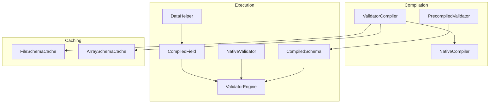
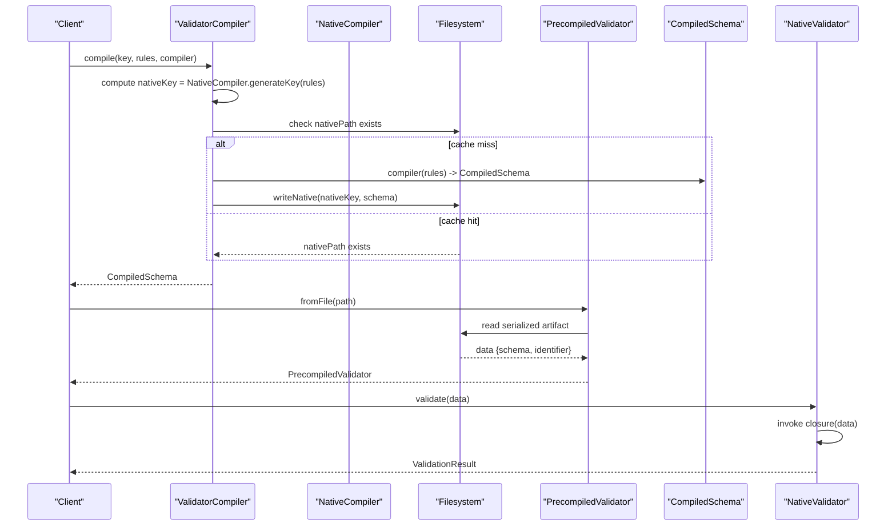
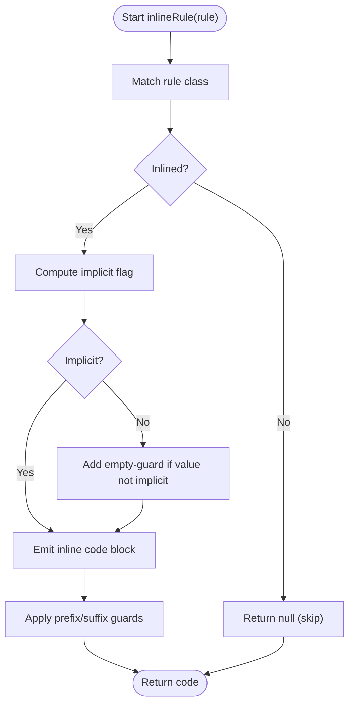
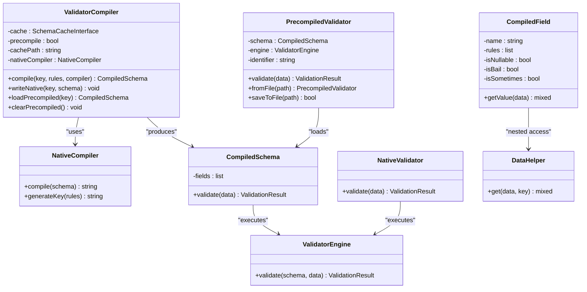

# Native Code Compilation

<cite>
**Referenced Files in This Document**
- [NativeCompiler.php](file://src/Compilation/NativeCompiler.php)
- [ValidatorCompiler.php](file://src/Compilation/ValidatorCompiler.php)
- [PrecompiledValidator.php](file://src/Compilation/PrecompiledValidator.php)
- [CompiledSchema.php](file://src/Execution/CompiledSchema.php)
- [CompiledField.php](file://src/Execution/CompiledField.php)
- [ValidatorEngine.php](file://src/Execution/ValidatorEngine.php)
- [NativeValidator.php](file://src/Execution/NativeValidator.php)
- [DataHelper.php](file://src/Execution/DataHelper.php)
- [FileSchemaCache.php](file://src/Cache/FileSchemaCache.php)
- [ArraySchemaCache.php](file://src/Cache/ArraySchemaCache.php)
</cite>

## Table of Contents
1. [Introduction](#introduction)
2. [Project Structure](#project-structure)
3. [Core Components](#core-components)
4. [Architecture Overview](#architecture-overview)
5. [Detailed Component Analysis](#detailed-component-analysis)
6. [Dependency Analysis](#dependency-analysis)
7. [Performance Considerations](#performance-considerations)
8. [Troubleshooting Guide](#troubleshooting-guide)
9. [Conclusion](#conclusion)
10. [Appendices](#appendices)

## Introduction
This document explains the native code compilation features in vi/validation. It focuses on how the NativeCompiler transforms validated schemas into optimized PHP closures, how PrecompiledValidator loads and executes precompiled artifacts, and how cache paths and atomic file writes are managed. It also covers the compilation workflow, generated code structure, runtime performance benefits, and troubleshooting steps.

## Project Structure
The native compilation feature spans several modules:
- Compilation: NativeCompiler, ValidatorCompiler, PrecompiledValidator
- Execution: CompiledSchema, CompiledField, ValidatorEngine, NativeValidator, DataHelper
- Caching: FileSchemaCache, ArraySchemaCache

**Diagram sources**
- [NativeCompiler.php](file://src/Compilation/NativeCompiler.php#L17-L51)
- [ValidatorCompiler.php](file://src/Compilation/ValidatorCompiler.php#L10-L74)
- [PrecompiledValidator.php](file://src/Compilation/PrecompiledValidator.php#L11-L51)
- [CompiledSchema.php](file://src/Execution/CompiledSchema.php#L9-L67)
- [CompiledField.php](file://src/Execution/CompiledField.php#L10-L176)
- [ValidatorEngine.php](file://src/Execution/ValidatorEngine.php#L11-L98)
- [NativeValidator.php](file://src/Execution/NativeValidator.php#L12-L38)
- [DataHelper.php](file://src/Execution/DataHelper.php#L10-L31)
- [FileSchemaCache.php](file://src/Cache/FileSchemaCache.php#L9-L107)
- [ArraySchemaCache.php](file://src/Cache/ArraySchemaCache.php#L9-L74)

**Section sources**
- [NativeCompiler.php](file://src/Compilation/NativeCompiler.php#L17-L51)
- [ValidatorCompiler.php](file://src/Compilation/ValidatorCompiler.php#L10-L74)
- [PrecompiledValidator.php](file://src/Compilation/PrecompiledValidator.php#L11-L51)
- [CompiledSchema.php](file://src/Execution/CompiledSchema.php#L9-L67)
- [CompiledField.php](file://src/Execution/CompiledField.php#L10-L176)
- [ValidatorEngine.php](file://src/Execution/ValidatorEngine.php#L11-L98)
- [NativeValidator.php](file://src/Execution/NativeValidator.php#L12-L38)
- [DataHelper.php](file://src/Execution/DataHelper.php#L10-L31)
- [FileSchemaCache.php](file://src/Cache/FileSchemaCache.php#L9-L107)
- [ArraySchemaCache.php](file://src/Cache/ArraySchemaCache.php#L9-L74)

## Core Components
- NativeCompiler: Generates optimized PHP closures from CompiledSchema instances. It inlines common rules, minimizes method calls, and emits compact validation logic per field.
- ValidatorCompiler: Orchestrates schema compilation, caching, and native code emission. It manages cache keys, cache paths, and atomic file writes for both precompiled and native artifacts.
- PrecompiledValidator: Loads serialized CompiledSchema and identifiers from disk and delegates validation to the engine.
- CompiledSchema and CompiledField: Represent the compiled form of validation rules and fields, including metadata like nullability, bail, and sometimes behavior.
- ValidatorEngine: Executes CompiledSchema using the standard rule-based engine; used when native code is not available or not fully utilized.
- NativeValidator: Executes a precompiled PHP closure for maximum performance.
- DataHelper: Provides safe nested data access for dot-notation paths.

**Section sources**
- [NativeCompiler.php](file://src/Compilation/NativeCompiler.php#L17-L51)
- [ValidatorCompiler.php](file://src/Compilation/ValidatorCompiler.php#L10-L74)
- [PrecompiledValidator.php](file://src/Compilation/PrecompiledValidator.php#L11-L51)
- [CompiledSchema.php](file://src/Execution/CompiledSchema.php#L9-L67)
- [CompiledField.php](file://src/Execution/CompiledField.php#L10-L176)
- [ValidatorEngine.php](file://src/Execution/ValidatorEngine.php#L11-L98)
- [NativeValidator.php](file://src/Execution/NativeValidator.php#L12-L38)
- [DataHelper.php](file://src/Execution/DataHelper.php#L10-L31)

## Architecture Overview
The native compilation pipeline converts a set of validation rules into a PHP closure that performs validation without reflection or dynamic dispatch overhead. The ValidatorCompiler coordinates caching and file emission, while PrecompiledValidator loads artifacts for execution.

**Diagram sources**
- [ValidatorCompiler.php](file://src/Compilation/ValidatorCompiler.php#L33-L74)
- [NativeCompiler.php](file://src/Compilation/NativeCompiler.php#L24-L51)
- [PrecompiledValidator.php](file://src/Compilation/PrecompiledValidator.php#L56-L78)
- [NativeValidator.php](file://src/Execution/NativeValidator.php#L27-L37)

## Detailed Component Analysis

### NativeCompiler
Responsibilities:
- Produces a PHP closure that encapsulates validation logic for a CompiledSchema.
- Emits compact, inlined checks for supported rules.
- Uses environment-aware keys to avoid cross-version reuse of compiled code.

Key behaviors:
- Field-level emission: Iterates fields, generating value retrieval and rule checks with bail and nullable handling.
- Value access: Uses direct array access for simple keys, nested helpers for dot notation.
- Rule inlining: Supports Required, Type checks (string, integer, numeric, boolean, array), Email, URL, IP, JSON, Regex, Min/Max, and more. Non-inlined rules are skipped with a warning.
- Bail support: Emits goto-based early exit when a field fails and bail is set.
- Key generation: Combines rule serialization, PHP version, and compiler version to produce a unique key.

Generated code structure:
- A closure accepting an associative array of data.
- Local variables for errors, hasErrors, excludedFields.
- Per-field blocks with optional sometimes/nullable guards.
- Inline conditionals for each rule, appending to errors and setting hasErrors.
- Returns an array with validity, errors, and excluded fields.

Performance characteristics:
- Eliminates reflection and dynamic dispatch for inlined rules.
- Reduces function call overhead by embedding checks directly.
- Uses compact conditionals and minimal branching.

**Section sources**
- [NativeCompiler.php](file://src/Compilation/NativeCompiler.php#L24-L51)
- [NativeCompiler.php](file://src/Compilation/NativeCompiler.php#L61-L114)
- [NativeCompiler.php](file://src/Compilation/NativeCompiler.php#L116-L129)
- [NativeCompiler.php](file://src/Compilation/NativeCompiler.php#L131-L172)
- [NativeCompiler.php](file://src/Compilation/NativeCompiler.php#L174-L192)
- [NativeCompiler.php](file://src/Compilation/NativeCompiler.php#L194-L308)

#### Inlining Logic Flow

**Diagram sources**
- [NativeCompiler.php](file://src/Compilation/NativeCompiler.php#L131-L172)
- [NativeCompiler.php](file://src/Compilation/NativeCompiler.php#L148-L165)
- [NativeCompiler.php](file://src/Compilation/NativeCompiler.php#L141-L146)

### ValidatorCompiler
Responsibilities:
- Coordinates schema compilation and caching.
- Manages native code emission and atomic file writes.
- Provides legacy precompiled schema persistence and loading.

Key behaviors:
- Computes nativeKey via NativeCompiler::generateKey.
- Checks cachePath for existing native code; avoids re-emitting identical code.
- Writes native code using atomic file pattern: temp file + rename.
- Optionally writes legacy precompiled artifacts and supports clearing caches.

Cache path management:
- Native artifacts: cachePath/native/{key}.php
- Legacy precompiled: cachePath/{md5(key)}.compiled

Atomic file writing:
- Writes to a temporary filename and renames to the target to prevent partial reads.

**Section sources**
- [ValidatorCompiler.php](file://src/Compilation/ValidatorCompiler.php#L33-L74)
- [ValidatorCompiler.php](file://src/Compilation/ValidatorCompiler.php#L79-L103)
- [ValidatorCompiler.php](file://src/Compilation/ValidatorCompiler.php#L105-L108)
- [ValidatorCompiler.php](file://src/Compilation/ValidatorCompiler.php#L113-L133)
- [ValidatorCompiler.php](file://src/Compilation/ValidatorCompiler.php#L138-L154)
- [ValidatorCompiler.php](file://src/Compilation/ValidatorCompiler.php#L156-L159)
- [ValidatorCompiler.php](file://src/Compilation/ValidatorCompiler.php#L164-L183)
- [ValidatorCompiler.php](file://src/Compilation/ValidatorCompiler.php#L190-L193)

### PrecompiledValidator
Responsibilities:
- Encapsulates a CompiledSchema and an identifier.
- Loads precompiled artifacts from disk and validates data using the engine.
- Persists precompiled validators to disk with atomic writes.

Loading and saving:
- fromFile(path) deserializes schema and identifier.
- saveToFile(path) serializes and writes atomically.

**Section sources**
- [PrecompiledValidator.php](file://src/Compilation/PrecompiledValidator.php#L56-L78)
- [PrecompiledValidator.php](file://src/Compilation/PrecompiledValidator.php#L83-L96)

### CompiledSchema and CompiledField
Responsibilities:
- CompiledSchema holds compiled fields and exposes validation entry points.
- CompiledField captures field-level metadata (nullable, bail, sometimes) and provides value extraction and exclusion logic.

Key behaviors:
- CompiledSchema.validate delegates to ValidatorEngine.
- CompiledField.getValue handles simple and nested paths; nested access defers to DataHelper.
- Deduplication and ordering of marker rules ensures fast-fail semantics.

**Section sources**
- [CompiledSchema.php](file://src/Execution/CompiledSchema.php#L27-L67)
- [CompiledField.php](file://src/Execution/CompiledField.php#L115-L176)

### ValidatorEngine
Responsibilities:
- Executes CompiledSchema using the standard rule engine.
- Handles bail, sometimes, nullable, and exclusion rules.
- Applies implicit vs non-implicit rule semantics.

**Section sources**
- [ValidatorEngine.php](file://src/Execution/ValidatorEngine.php#L33-L98)
- [ValidatorEngine.php](file://src/Execution/ValidatorEngine.php#L127-L146)

### NativeValidator
Responsibilities:
- Executes a precompiled PHP closure for maximum performance.
- Wraps closure results into a ValidationResult.

**Section sources**
- [NativeValidator.php](file://src/Execution/NativeValidator.php#L27-L37)

### DataHelper
Responsibilities:
- Safely retrieves nested values using dot notation.

**Section sources**
- [DataHelper.php](file://src/Execution/DataHelper.php#L15-L30)

## Dependency Analysis

**Diagram sources**
- [NativeCompiler.php](file://src/Compilation/NativeCompiler.php#L17-L51)
- [ValidatorCompiler.php](file://src/Compilation/ValidatorCompiler.php#L10-L26)
- [PrecompiledValidator.php](file://src/Compilation/PrecompiledValidator.php#L11-L25)
- [CompiledSchema.php](file://src/Execution/CompiledSchema.php#L9-L67)
- [CompiledField.php](file://src/Execution/CompiledField.php#L10-L176)
- [ValidatorEngine.php](file://src/Execution/ValidatorEngine.php#L11-L98)
- [NativeValidator.php](file://src/Execution/NativeValidator.php#L12-L38)
- [DataHelper.php](file://src/Execution/DataHelper.php#L10-L31)

**Section sources**
- [NativeCompiler.php](file://src/Compilation/NativeCompiler.php#L17-L51)
- [ValidatorCompiler.php](file://src/Compilation/ValidatorCompiler.php#L10-L26)
- [PrecompiledValidator.php](file://src/Compilation/PrecompiledValidator.php#L11-L25)
- [CompiledSchema.php](file://src/Execution/CompiledSchema.php#L9-L67)
- [CompiledField.php](file://src/Execution/CompiledField.php#L10-L176)
- [ValidatorEngine.php](file://src/Execution/ValidatorEngine.php#L11-L98)
- [NativeValidator.php](file://src/Execution/NativeValidator.php#L12-L38)
- [DataHelper.php](file://src/Execution/DataHelper.php#L10-L31)

## Performance Considerations
- Inlined rules reduce reflection and dynamic dispatch overhead by embedding checks directly into the generated closure.
- Bail and sometimes/nullable guards minimize unnecessary work by short-circuiting on failure or absence.
- Atomic file writes ensure consistent reads and avoid partial artifact consumption.
- Environment-aware keys prevent invalid cross-version reuse of compiled code.
- Nested data access is optimized via direct array checks for simple paths and a helper for dot notation.

[No sources needed since this section provides general guidance]

## Troubleshooting Guide
Common issues and resolutions:
- Missing cache path: Ensure cachePath is writable and passed to ValidatorCompiler. Without it, native code emission is skipped.
- Partial or corrupted artifacts: Use atomic write mechanisms; if corruption occurs, clear caches and regenerate.
- Cross-version compatibility: Keys include PHP version and compiler version; recompile when upgrading environments.
- Unsupported rules: Non-inlined rules are skipped with warnings; verify rule sets or implement additional inlining.
- Serialization failures: PrecompiledValidator.fromFile returns null on malformed content; inspect file integrity and permissions.

**Section sources**
- [ValidatorCompiler.php](file://src/Compilation/ValidatorCompiler.php#L79-L103)
- [ValidatorCompiler.php](file://src/Compilation/ValidatorCompiler.php#L138-L154)
- [NativeCompiler.php](file://src/Compilation/NativeCompiler.php#L56-L59)
- [PrecompiledValidator.php](file://src/Compilation/PrecompiledValidator.php#L56-L78)

## Conclusion
Native code compilation in vi/validation delivers significant runtime performance by transforming validated schemas into optimized PHP closures. ValidatorCompiler orchestrates caching, atomic writes, and environment-aware keying, while PrecompiledValidator simplifies loading and execution. Together with CompiledSchema/CompiledField and ValidatorEngine, the system balances flexibility and speed, enabling high-throughput validation with minimal overhead.

[No sources needed since this section summarizes without analyzing specific files]

## Appendices

### Compilation Workflow Examples
- Schema compilation with native emission:
  - Compute nativeKey from rules.
  - If nativePath does not exist, compile CompiledSchema and write native code atomically.
- Loading a precompiled validator:
  - Deserialize CompiledSchema and identifier from disk.
  - Validate using the engine or a precompiled closure.

**Section sources**
- [ValidatorCompiler.php](file://src/Compilation/ValidatorCompiler.php#L33-L74)
- [NativeCompiler.php](file://src/Compilation/NativeCompiler.php#L24-L51)
- [PrecompiledValidator.php](file://src/Compilation/PrecompiledValidator.php#L56-L78)

### Generated Code Structure Reference
- Closure signature: accepts an associative array of data.
- Local variables: errors, hasErrors, excludedFields.
- Field blocks: value retrieval, optional guards (sometimes/nullable), rule checks, bail handling.
- Return shape: validity flag, errors, excluded fields.

**Section sources**
- [NativeCompiler.php](file://src/Compilation/NativeCompiler.php#L24-L51)
- [NativeCompiler.php](file://src/Compilation/NativeCompiler.php#L61-L114)