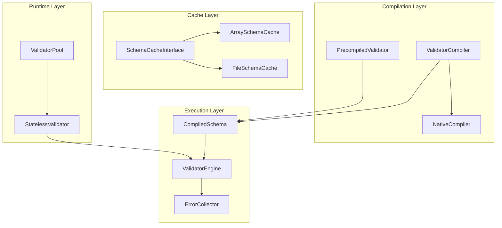
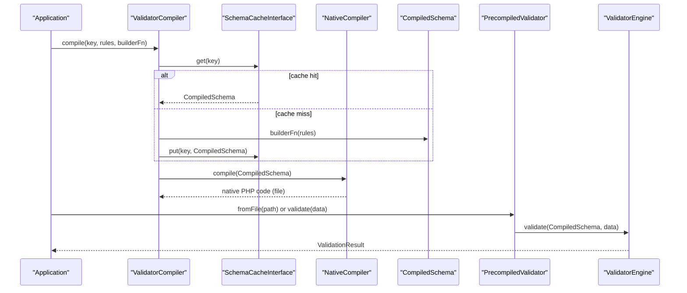
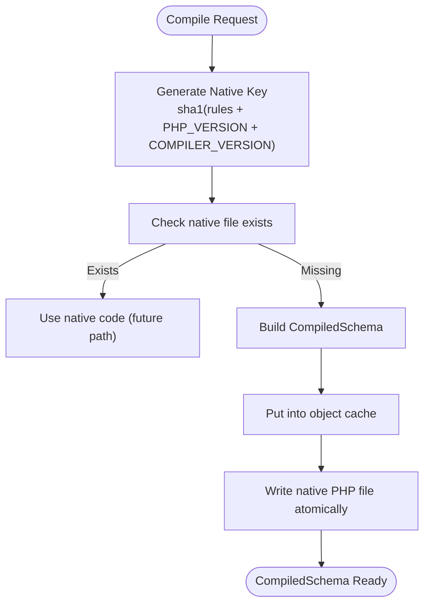
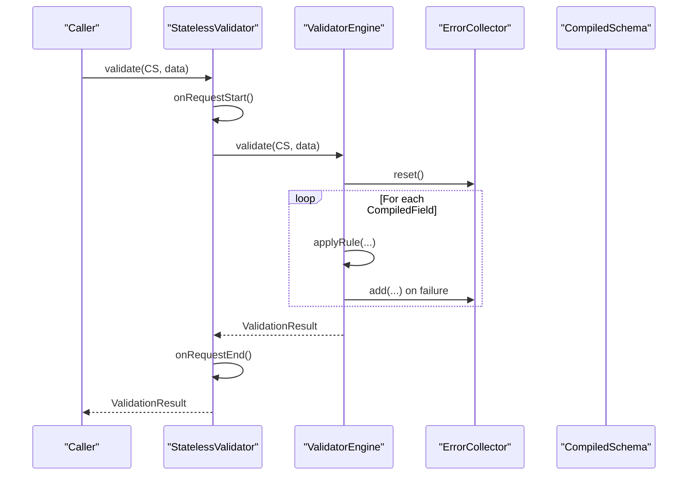
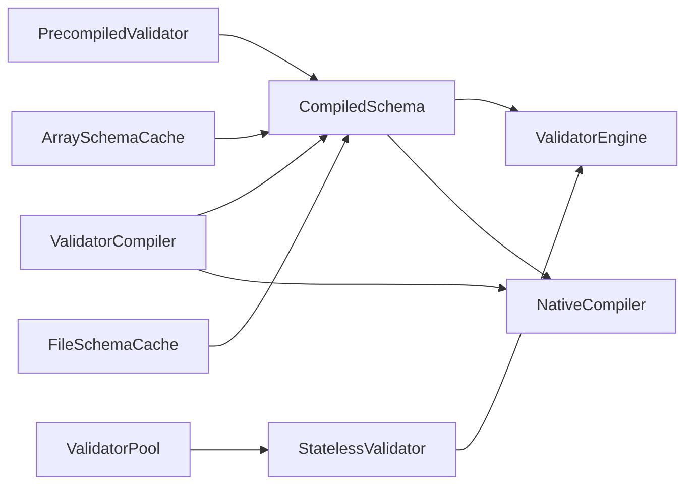

# Performance Optimization

<cite>
**Referenced Files in This Document**
- [ArraySchemaCache.php](file://src/Cache/ArraySchemaCache.php)
- [FileSchemaCache.php](file://src/Cache/FileSchemaCache.php)
- [SchemaCacheInterface.php](file://src/Cache/SchemaCacheInterface.php)
- [NativeCompiler.php](file://src/Compilation/NativeCompiler.php)
- [PrecompiledValidator.php](file://src/Compilation/PrecompiledValidator.php)
- [ValidatorCompiler.php](file://src/Compilation/ValidatorCompiler.php)
- [CompiledSchema.php](file://src/Execution/CompiledSchema.php)
- [ValidatorEngine.php](file://src/Execution/ValidatorEngine.php)
- [ErrorCollector.php](file://src/Execution/ErrorCollector.php)
- [ValidatorPool.php](file://src/Runtime/ValidatorPool.php)
- [StatelessValidator.php](file://src/Runtime/StatelessValidator.php)
- [benchmark.php](file://tests/benchmark.php)
- [README.md](file://README.md)
- [composer.json](file://composer.json)
</cite>

## Table of Contents
1. [Introduction](#introduction)
2. [Project Structure](#project-structure)
3. [Core Components](#core-components)
4. [Architecture Overview](#architecture-overview)
5. [Detailed Component Analysis](#detailed-component-analysis)
6. [Dependency Analysis](#dependency-analysis)
7. [Performance Considerations](#performance-considerations)
8. [Troubleshooting Guide](#troubleshooting-guide)
9. [Conclusion](#conclusion)
10. [Appendices](#appendices)

## Introduction
This document explains the performance optimization features in vi/validation with a focus on:
- Schema caching via ArraySchemaCache and FileSchemaCache
- Native code compilation through NativeCompiler and ValidatorCompiler
- Precompiled validators via PrecompiledValidator
- Memory management, garbage collection optimization, and resource pooling
- Benchmarking methodologies and best practices

The goal is to help you choose and tune caching and compilation strategies for different environments and workloads.

## Project Structure
The performance-critical parts of the codebase are organized into focused modules:
- Cache: in-memory and file-based schema caches
- Compilation: native code generation and precompiled artifacts
- Execution: compiled schema runtime and validator engine
- Runtime: pooling and stateless wrappers for long-running processes
- Tests: benchmark scripts for measuring throughput



**Diagram sources**
- [ArraySchemaCache.php](file://src/Cache/ArraySchemaCache.php#L9-L74)
- [FileSchemaCache.php](file://src/Cache/FileSchemaCache.php#L9-L107)
- [SchemaCacheInterface.php](file://src/Cache/SchemaCacheInterface.php#L9-L35)
- [NativeCompiler.php](file://src/Compilation/NativeCompiler.php#L17-L309)
- [PrecompiledValidator.php](file://src/Compilation/PrecompiledValidator.php#L11-L97)
- [ValidatorCompiler.php](file://src/Compilation/ValidatorCompiler.php#L10-L194)
- [CompiledSchema.php](file://src/Execution/CompiledSchema.php#L9-L67)
- [ValidatorEngine.php](file://src/Execution/ValidatorEngine.php#L11-L176)
- [ErrorCollector.php](file://src/Execution/ErrorCollector.php#L7-L50)
- [ValidatorPool.php](file://src/Runtime/ValidatorPool.php#L12-L139)
- [StatelessValidator.php](file://src/Runtime/StatelessValidator.php#L15-L78)

**Section sources**
- [README.md](file://README.md#L700-L764)
- [composer.json](file://composer.json#L10-L19)

## Core Components
- Schema caching: ArraySchemaCache (in-memory) and FileSchemaCache (persistent) implement SchemaCacheInterface to store CompiledSchema instances with optional TTL and eviction.
- Native compilation: NativeCompiler generates optimized PHP closures from CompiledSchema, inlining common rules to reduce overhead.
- ValidatorCompiler orchestrates schema compilation, object-cache storage, and native/precompiled artifact writing.
- PrecompiledValidator loads persisted CompiledSchema artifacts for zero-compilation reuse.
- Execution engine: ValidatorEngine validates CompiledSchema against data with fail-fast and error collection.
- Runtime pooling: ValidatorPool and StatelessValidator isolate state and reduce allocation churn in long-running workers.

**Section sources**
- [ArraySchemaCache.php](file://src/Cache/ArraySchemaCache.php#L9-L74)
- [FileSchemaCache.php](file://src/Cache/FileSchemaCache.php#L9-L107)
- [SchemaCacheInterface.php](file://src/Cache/SchemaCacheInterface.php#L9-L35)
- [NativeCompiler.php](file://src/Compilation/NativeCompiler.php#L17-L309)
- [ValidatorCompiler.php](file://src/Compilation/ValidatorCompiler.php#L10-L194)
- [PrecompiledValidator.php](file://src/Compilation/PrecompiledValidator.php#L11-L97)
- [CompiledSchema.php](file://src/Execution/CompiledSchema.php#L9-L67)
- [ValidatorEngine.php](file://src/Execution/ValidatorEngine.php#L11-L176)
- [ErrorCollector.php](file://src/Execution/ErrorCollector.php#L7-L50)
- [ValidatorPool.php](file://src/Runtime/ValidatorPool.php#L12-L139)
- [StatelessValidator.php](file://src/Runtime/StatelessValidator.php#L15-L78)

## Architecture Overview
The performance architecture follows a compile-once, validate-many pattern:
- Build rules once, compile to CompiledSchema
- Cache CompiledSchema in-memory or on disk
- Optionally generate native PHP code for hot paths
- Validate with ValidatorEngine, optionally pooled or stateless



**Diagram sources**
- [ValidatorCompiler.php](file://src/Compilation/ValidatorCompiler.php#L33-L74)
- [NativeCompiler.php](file://src/Compilation/NativeCompiler.php#L24-L51)
- [PrecompiledValidator.php](file://src/Compilation/PrecompiledValidator.php#L56-L78)
- [CompiledSchema.php](file://src/Execution/CompiledSchema.php#L59-L66)
- [ValidatorEngine.php](file://src/Execution/ValidatorEngine.php#L33-L98)

## Detailed Component Analysis

### Schema Caching Mechanisms
- ArraySchemaCache
  - Stores CompiledSchema keyed by string with optional TTL.
  - On expiration, entries are removed during has/get checks.
  - Provides keys() and count() for introspection.
- FileSchemaCache
  - Persists CompiledSchema to files under a cache directory with .cache suffix.
  - Uses atomic writes and md5-based filenames for isolation.
  - Supports TTL and expiration checks.
- SchemaCacheInterface
  - Defines get, put, has, forget, flush contract for cache backends.

```mermaid
classDiagram
class SchemaCacheInterface {
+get(key) CompiledSchema?
+put(key, schema, ttl) void
+has(key) bool
+forget(key) void
+flush() void
}
class ArraySchemaCache {
-cache : map<string, {schema, expires}>
+get(key) CompiledSchema?
+put(key, schema, ttl) void
+has(key) bool
+forget(key) void
+flush() void
+keys() string[]
+count() int
}
class FileSchemaCache {
-cachePath : string
-defaultTtl : int
+get(key) CompiledSchema?
+put(key, schema, ttl) void
+has(key) bool
+forget(key) void
+flush() void
+getCachePath() string
}
SchemaCacheInterface <|.. ArraySchemaCache
SchemaCacheInterface <|.. FileSchemaCache
```

**Diagram sources**
- [SchemaCacheInterface.php](file://src/Cache/SchemaCacheInterface.php#L9-L35)
- [ArraySchemaCache.php](file://src/Cache/ArraySchemaCache.php#L9-L74)
- [FileSchemaCache.php](file://src/Cache/FileSchemaCache.php#L9-L107)

**Section sources**
- [ArraySchemaCache.php](file://src/Cache/ArraySchemaCache.php#L11-L73)
- [FileSchemaCache.php](file://src/Cache/FileSchemaCache.php#L11-L106)
- [SchemaCacheInterface.php](file://src/Cache/SchemaCacheInterface.php#L10-L34)

### Native Code Compilation and Precompiled Artifacts
- NativeCompiler
  - Generates a closure per CompiledSchema with inlined rule checks.
  - Emits bail jumps, sometimes/nullable short-circuits, and type-specific checks.
  - Uses reflection to derive rule identifiers and a stable key via compiler version and PHP version.
- ValidatorCompiler
  - Orchestrates cache-first lookup, object-cache storage, and native code emission.
  - Writes native PHP files under cachePath/native with atomic write semantics.
  - Also supports legacy precompiled artifacts and clearing them.
- PrecompiledValidator
  - Loads CompiledSchema from serialized files and exposes validate(data).



**Diagram sources**
- [NativeCompiler.php](file://src/Compilation/NativeCompiler.php#L56-L59)
- [ValidatorCompiler.php](file://src/Compilation/ValidatorCompiler.php#L33-L74)
- [ValidatorCompiler.php](file://src/Compilation/ValidatorCompiler.php#L79-L103)

**Section sources**
- [NativeCompiler.php](file://src/Compilation/NativeCompiler.php#L17-L309)
- [ValidatorCompiler.php](file://src/Compilation/ValidatorCompiler.php#L10-L194)
- [PrecompiledValidator.php](file://src/Compilation/PrecompiledValidator.php#L11-L97)

### Execution Engine and Memory Management
- ValidatorEngine
  - Reuses ErrorCollector and ValidationContext across validations to reduce allocations.
  - Applies rules with implicit/empty-value short-circuit logic.
  - Supports fail-fast and max-errors thresholds to cut early.
- ErrorCollector
  - Accumulates field-level errors with counts and reset semantics.
- CompiledSchema
  - Holds CompiledField list and provides validate(data) entrypoint.
- StatelessValidator and ValidatorPool
  - StatelessValidator isolates per-request lifecycle.
  - ValidatorPool reuses StatelessValidator instances with bounded concurrency.



**Diagram sources**
- [StatelessValidator.php](file://src/Runtime/StatelessValidator.php#L53-L61)
- [ValidatorEngine.php](file://src/Execution/ValidatorEngine.php#L33-L98)
- [ErrorCollector.php](file://src/Execution/ErrorCollector.php#L17-L31)
- [CompiledSchema.php](file://src/Execution/CompiledSchema.php#L59-L66)

**Section sources**
- [ValidatorEngine.php](file://src/Execution/ValidatorEngine.php#L11-L176)
- [ErrorCollector.php](file://src/Execution/ErrorCollector.php#L7-L50)
- [CompiledSchema.php](file://src/Execution/CompiledSchema.php#L9-L67)
- [StatelessValidator.php](file://src/Runtime/StatelessValidator.php#L15-L78)
- [ValidatorPool.php](file://src/Runtime/ValidatorPool.php#L12-L139)

## Dependency Analysis
- Cache depends on CompiledSchema for persistence.
- Compilation depends on CompiledSchema and rule metadata.
- Execution depends on CompiledSchema and runtime contexts.
- Runtime depends on ValidatorEngine and context management.



**Diagram sources**
- [CompiledSchema.php](file://src/Execution/CompiledSchema.php#L9-L67)
- [ValidatorEngine.php](file://src/Execution/ValidatorEngine.php#L11-L176)
- [NativeCompiler.php](file://src/Compilation/NativeCompiler.php#L17-L309)
- [ValidatorCompiler.php](file://src/Compilation/ValidatorCompiler.php#L10-L194)
- [PrecompiledValidator.php](file://src/Compilation/PrecompiledValidator.php#L11-L97)
- [ArraySchemaCache.php](file://src/Cache/ArraySchemaCache.php#L9-L74)
- [FileSchemaCache.php](file://src/Cache/FileSchemaCache.php#L9-L107)
- [StatelessValidator.php](file://src/Runtime/StatelessValidator.php#L15-L78)
- [ValidatorPool.php](file://src/Runtime/ValidatorPool.php#L12-L139)

**Section sources**
- [README.md](file://README.md#L700-L764)

## Performance Considerations
- Caching strategies
  - Use ArraySchemaCache for in-process, multi-request reuse.
  - Use FileSchemaCache for persistent cross-process reuse and warm starts.
  - Combine with ValidatorCompiler to emit native PHP code for hot schemas.
- Native compilation
  - NativeCompiler inlines common rules and uses bail/jump semantics to minimize branches.
  - Use ValidatorCompiler::writeNative to persist generated code and ValidatorCompiler::getNativePath to locate it.
- Memory management
  - ValidatorEngine reuses ErrorCollector and ValidationContext to reduce allocations.
  - StatelessValidator and ValidatorPool eliminate per-request allocations by reusing instances.
  - Prefer streaming APIs (stream, each, failures) for large datasets to keep memory usage constant.
- Garbage collection
  - Disable GC during microbenchmarks to avoid skewed results (as shown in tests/benchmark.php).
- Best practices
  - Precompile frequently used schemas and store both object cache and native code.
  - Use ValidatorPool in long-running environments (Octane/Swoole/RoadRunner).
  - For batch processing, use chunked validation to control memory footprint.

[No sources needed since this section provides general guidance]

## Troubleshooting Guide
- Cache misses
  - Verify cache key generation and environment-dependent keys (PHP version and compiler version).
  - Ensure cachePath exists and is writable for FileSchemaCache and native code.
- Stale or expired cache
  - ArraySchemaCache removes expired entries on has/get; clear cache if needed.
  - For FileSchemaCache, remove stale .cache files or flush the directory.
- Native code not being used
  - Confirm native file exists at ValidatorCompiler::getNativePath and is readable.
  - Ensure the same PHP version and compiler version are used to compute the key.
- High memory usage
  - Switch from validateMany to streaming APIs (stream, failures, each).
  - Enable ValidatorPool and StatelessValidator to reuse instances.
- Benchmark noise
  - Disable GC during benchmarks (see tests/benchmark.php).
  - Warm up caches and compilers before timing runs.

**Section sources**
- [ArraySchemaCache.php](file://src/Cache/ArraySchemaCache.php#L31-L55)
- [FileSchemaCache.php](file://src/Cache/FileSchemaCache.php#L75-L93)
- [ValidatorCompiler.php](file://src/Compilation/ValidatorCompiler.php#L79-L103)
- [benchmark.php](file://tests/benchmark.php#L8-L10)

## Conclusion
vi/validation’s performance stack combines schema caching, native code generation, and runtime pooling to achieve high throughput with low latency. By precompiling schemas, persisting artifacts, and reusing validated engines, applications can scale validation workloads efficiently—especially in long-running environments and large datasets.

[No sources needed since this section summarizes without analyzing specific files]

## Appendices

### Practical Examples Index
- Schema caching
  - ArraySchemaCache usage: [ArraySchemaCache.php](file://src/Cache/ArraySchemaCache.php#L14-L29)
  - FileSchemaCache usage: [FileSchemaCache.php](file://src/Cache/FileSchemaCache.php#L24-L54)
- Compilation and precompilation
  - NativeCompiler key generation: [NativeCompiler.php](file://src/Compilation/NativeCompiler.php#L56-L59)
  - ValidatorCompiler orchestration: [ValidatorCompiler.php](file://src/Compilation/ValidatorCompiler.php#L33-L74)
  - PrecompiledValidator load/save: [PrecompiledValidator.php](file://src/Compilation/PrecompiledValidator.php#L56-L96)
- Execution and runtime
  - CompiledSchema.validate: [CompiledSchema.php](file://src/Execution/CompiledSchema.php#L59-L66)
  - ValidatorEngine.validate: [ValidatorEngine.php](file://src/Execution/ValidatorEngine.php#L33-L98)
  - StatelessValidator.validate: [StatelessValidator.php](file://src/Runtime/StatelessValidator.php#L53-L61)
  - ValidatorPool.withValidator: [ValidatorPool.php](file://src/Runtime/ValidatorPool.php#L99-L108)
- Benchmarking
  - Microbenchmark setup: [benchmark.php](file://tests/benchmark.php#L8-L10)

**Section sources**
- [README.md](file://README.md#L700-L764)