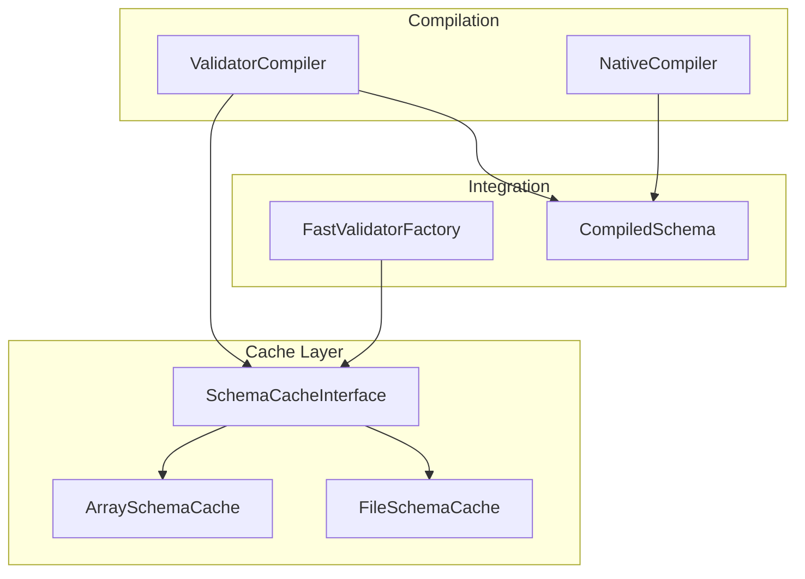
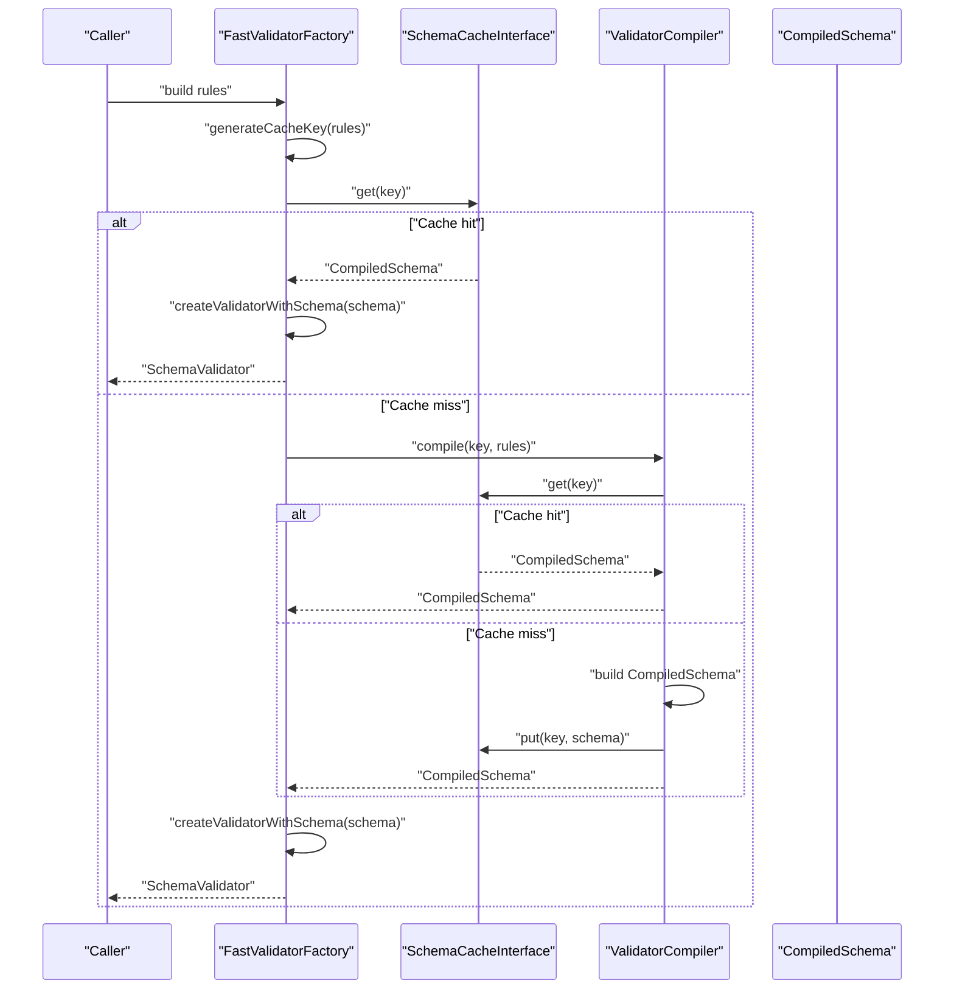
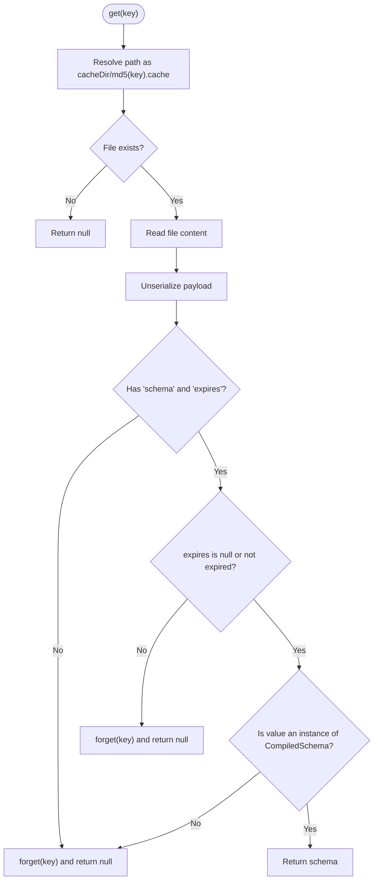
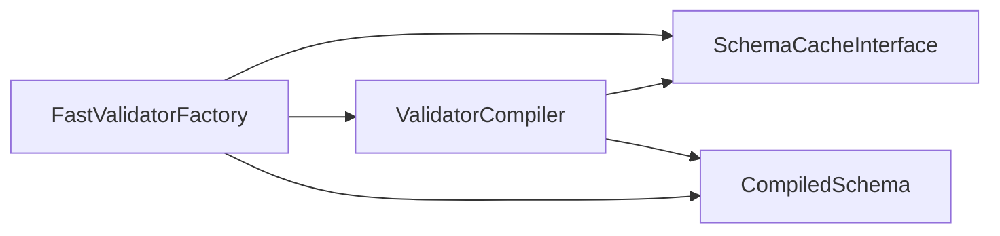

# Schema Caching

<cite>
**Referenced Files in This Document**
- [SchemaCacheInterface.php](file://src/Cache/SchemaCacheInterface.php)
- [ArraySchemaCache.php](file://src/Cache/ArraySchemaCache.php)
- [FileSchemaCache.php](file://src/Cache/FileSchemaCache.php)
- [ValidatorCompiler.php](file://src/Compilation/ValidatorCompiler.php)
- [NativeCompiler.php](file://src/Compilation/NativeCompiler.php)
- [FastValidatorFactory.php](file://src/Laravel/FastValidatorFactory.php)
- [CompiledSchema.php](file://src/Execution/CompiledSchema.php)
- [fast-validation.php](file://config/fast-validation.php)
- [CacheTest.php](file://tests/Unit/CacheTest.php)
- [benchmark.php](file://tests/benchmark.php)
- [final_benchmark.php](file://tests/final_benchmark.php)
</cite>

## Table of Contents
1. [Introduction](#introduction)
2. [Project Structure](#project-structure)
3. [Core Components](#core-components)
4. [Architecture Overview](#architecture-overview)
5. [Detailed Component Analysis](#detailed-component-analysis)
6. [Dependency Analysis](#dependency-analysis)
7. [Performance Considerations](#performance-considerations)
8. [Troubleshooting Guide](#troubleshooting-guide)
9. [Conclusion](#conclusion)
10. [Appendices](#appendices)

## Introduction
This document explains the schema caching mechanisms in vi/validation. It covers the SchemaCacheInterface contract and its two implementations: ArraySchemaCache for in-memory caching and FileSchemaCache for persistent storage. It also documents cache key generation strategies, invalidation policies, TTL handling, memory management, configuration options, and practical usage patterns. Benchmarks and best practices for cache sizing across deployment scenarios are included to help you choose the right cache driver and tune performance.

## Project Structure
The schema caching system lives under the Cache namespace and integrates with compilation and factory components:
- Cache contracts and implementations: src/Cache/*
- Compilation pipeline: src/Compilation/*
- Factory that wires cache into Laravel-style validation: src/Laravel/FastValidatorFactory.php
- Configuration: config/fast-validation.php
- Tests validating cache behavior: tests/Unit/CacheTest.php



**Diagram sources**
- [SchemaCacheInterface.php](file://src/Cache/SchemaCacheInterface.php#L9-L35)
- [ArraySchemaCache.php](file://src/Cache/ArraySchemaCache.php#L9-L74)
- [FileSchemaCache.php](file://src/Cache/FileSchemaCache.php#L9-L108)
- [ValidatorCompiler.php](file://src/Compilation/ValidatorCompiler.php#L10-L74)
- [NativeCompiler.php](file://src/Compilation/NativeCompiler.php#L17-L59)
- [FastValidatorFactory.php](file://src/Laravel/FastValidatorFactory.php#L19-L120)
- [CompiledSchema.php](file://src/Execution/CompiledSchema.php#L9-L67)

**Section sources**
- [SchemaCacheInterface.php](file://src/Cache/SchemaCacheInterface.php#L1-L36)
- [ArraySchemaCache.php](file://src/Cache/ArraySchemaCache.php#L1-L75)
- [FileSchemaCache.php](file://src/Cache/FileSchemaCache.php#L1-L108)
- [ValidatorCompiler.php](file://src/Compilation/ValidatorCompiler.php#L1-L195)
- [FastValidatorFactory.php](file://src/Laravel/FastValidatorFactory.php#L1-L207)
- [CompiledSchema.php](file://src/Execution/CompiledSchema.php#L1-L68)
- [fast-validation.php](file://config/fast-validation.php#L1-L97)

## Core Components
- SchemaCacheInterface defines the cache contract: get, put, has, forget, flush.
- ArraySchemaCache provides an in-memory LRU-like cache with TTL support and introspection helpers (keys, count).
- FileSchemaCache persists CompiledSchema objects to disk with per-file TTL and atomic writes.
- ValidatorCompiler orchestrates cache usage during schema compilation and supports native code generation.
- FastValidatorFactory initializes the cache based on configuration and generates deterministic cache keys from rules.

**Section sources**
- [SchemaCacheInterface.php](file://src/Cache/SchemaCacheInterface.php#L9-L35)
- [ArraySchemaCache.php](file://src/Cache/ArraySchemaCache.php#L9-L74)
- [FileSchemaCache.php](file://src/Cache/FileSchemaCache.php#L9-L108)
- [ValidatorCompiler.php](file://src/Compilation/ValidatorCompiler.php#L10-L74)
- [FastValidatorFactory.php](file://src/Laravel/FastValidatorFactory.php#L19-L120)

## Architecture Overview
The cache sits between schema creation and runtime validation. During build, rules are transformed into CompiledSchema instances. If caching is enabled, the resulting schema is stored under a computed key. On subsequent builds, the cache is checked first. Additionally, native code generation can be persisted to accelerate runtime validation.



**Diagram sources**
- [FastValidatorFactory.php](file://src/Laravel/FastValidatorFactory.php#L75-L109)
- [ValidatorCompiler.php](file://src/Compilation/ValidatorCompiler.php#L33-L74)
- [SchemaCacheInterface.php](file://src/Cache/SchemaCacheInterface.php#L14-L19)

## Detailed Component Analysis

### SchemaCacheInterface Contract
Defines the minimal set of operations for schema caching:
- get(key): retrieve a CompiledSchema or null
- put(key, schema, ttl?): store with optional TTL
- has(key): existence check (including TTL)
- forget(key): remove a specific key
- flush(): clear all entries

Implementation notes:
- TTL semantics: when present, expired entries are removed on access.
- Type safety: implementations verify the deserialized payload is a CompiledSchema.

**Section sources**
- [SchemaCacheInterface.php](file://src/Cache/SchemaCacheInterface.php#L9-L35)

### ArraySchemaCache (In-Memory)
- Storage: associative array keyed by string with per-entry expiration metadata.
- TTL: stored as absolute Unix timestamp; has() checks expiration and auto-forgets expired entries.
- Expiration policy: lazy eviction on access; no periodic cleanup.
- Utilities: keys() and count() for diagnostics and monitoring.
- Memory management: relies on PHP garbage collection; flush() clears the internal array.

```mermaid
classDiagram
class SchemaCacheInterface {
+get(key) CompiledSchema?
+put(key, schema, ttl) void
+has(key) bool
+forget(key) void
+flush() void
}
class ArraySchemaCache {
-cache : map<string, {schema : CompiledSchema, expires : int|null}>
+get(key) CompiledSchema?
+put(key, schema, ttl) void
+has(key) bool
+forget(key) void
+flush() void
+keys() string[]
+count() int
}
SchemaCacheInterface <|.. ArraySchemaCache
```

**Diagram sources**
- [SchemaCacheInterface.php](file://src/Cache/SchemaCacheInterface.php#L9-L35)
- [ArraySchemaCache.php](file://src/Cache/ArraySchemaCache.php#L9-L74)

**Section sources**
- [ArraySchemaCache.php](file://src/Cache/ArraySchemaCache.php#L9-L74)
- [CacheTest.php](file://tests/Unit/CacheTest.php#L14-L82)

### FileSchemaCache (Persistent)
- Storage: per-key files named by md5(key).cache inside a configured directory.
- TTL: stored alongside schema; expired entries are auto-deleted on get().
- Persistence: serialized CompiledSchema plus expiry; atomic write via temporary file then rename.
- Directory management: constructor ensures cache directory exists.
- Expiration policy: lazy deletion on access; flush() removes all *.cache files.
- Path introspection: getCachePath() exposes the cache directory.



**Diagram sources**
- [FileSchemaCache.php](file://src/Cache/FileSchemaCache.php#L24-L55)

**Section sources**
- [FileSchemaCache.php](file://src/Cache/FileSchemaCache.php#L9-L108)

### Cache Key Generation Strategies
- Factory-level key: md5(serialized rules) to uniquely represent a schema definition. Closures and objects are serialized with unique identifiers to avoid unstable keys.
- Compiler-level key: md5(serialize(rules)) for legacy precompiled artifacts.
- Native key: sha1(serialize(rules) . PHP_VERSION_ID . COMPILER_VERSION) to tie native code to runtime and compiler versions.

Implications:
- Changing rule definitions changes the key; caches are invalidated automatically.
- Using closures or dynamic objects disables stable caching at the factory level.
- Native code keys are environment-aware, preventing cross-version reuse.

**Section sources**
- [FastValidatorFactory.php](file://src/Laravel/FastValidatorFactory.php#L177-L205)
- [ValidatorCompiler.php](file://src/Compilation/ValidatorCompiler.php#L185-L194)
- [NativeCompiler.php](file://src/Compilation/NativeCompiler.php#L56-L58)

### Cache Invalidation Policies
- Lazy TTL enforcement: both implementations check expiration on has()/get() and remove expired entries.
- Explicit removal: forget(key) deletes entries immediately.
- Bulk clearing: flush() clears all entries; FileSchemaCache removes all *.cache files.
- Compiler-level invalidation: native and precompiled artifacts are keyed by content and environment; updates trigger new writes.

**Section sources**
- [ArraySchemaCache.php](file://src/Cache/ArraySchemaCache.php#L31-L55)
- [FileSchemaCache.php](file://src/Cache/FileSchemaCache.php#L70-L93)
- [ValidatorCompiler.php](file://src/Compilation/ValidatorCompiler.php#L164-L183)

### Memory Management Techniques
- ArraySchemaCache: suitable for single-process, in-memory caching; relies on PHP GC; use flush() to release memory.
- FileSchemaCache: offloads memory pressure to disk; useful in long-running processes; manage disk space via filesystem cleanup.
- Hybrid approach: enable array cache for hot paths and file cache for persistence across restarts.

**Section sources**
- [ArraySchemaCache.php](file://src/Cache/ArraySchemaCache.php#L52-L55)
- [FileSchemaCache.php](file://src/Cache/FileSchemaCache.php#L84-L93)

### Cache Configuration Options
- cache.enabled: toggle caching globally
- cache.driver: array or file
- cache.ttl: default TTL in seconds
- cache.path: directory for file cache
- compilation.precompile: persist precompiled artifacts
- compilation.cache_path: base directory for compiled/native artifacts

Environment variables:
- FAST_VALIDATION_CACHE, FAST_VALIDATION_CACHE_DRIVER, FAST_VALIDATION_CACHE_TTL, FAST_VALIDATION_PRECOMPILE, FAST_VALIDATION_POOLING, FAST_VALIDATION_POOL_SIZE, FAST_VALIDATION_AUTO_DETECT

**Section sources**
- [fast-validation.php](file://config/fast-validation.php#L26-L31)
- [FastValidatorFactory.php](file://src/Laravel/FastValidatorFactory.php#L146-L163)

### Cache Warming Strategies
- Warm by invoking build() with representative rule sets during application bootstrap or deployment hooks.
- For file cache, ensure cache_path exists and is writable; consider pre-generating native code via compilation pipeline.
- Use ValidatorCompiler::writeNative() or SchemaValidator build with compilation enabled to generate native artifacts.

**Section sources**
- [ValidatorCompiler.php](file://src/Compilation/ValidatorCompiler.php#L79-L103)
- [final_benchmark.php](file://tests/final_benchmark.php#L24-L28)

## Dependency Analysis
The cache interacts with the compilation and factory layers. ValidatorCompiler depends on SchemaCacheInterface to avoid recompiling identical schemas. FastValidatorFactory selects the cache implementation based on configuration and computes keys from rules.



**Diagram sources**
- [FastValidatorFactory.php](file://src/Laravel/FastValidatorFactory.php#L75-L109)
- [ValidatorCompiler.php](file://src/Compilation/ValidatorCompiler.php#L33-L74)
- [SchemaCacheInterface.php](file://src/Cache/SchemaCacheInterface.php#L14-L19)

**Section sources**
- [FastValidatorFactory.php](file://src/Laravel/FastValidatorFactory.php#L19-L120)
- [ValidatorCompiler.php](file://src/Compilation/ValidatorCompiler.php#L10-L74)

## Performance Considerations
- Array cache: fastest for single-process workloads; zero IO overhead; memory footprint proportional to number of cached schemas.
- File cache: slower due to IO; beneficial for long-running processes and persistence across restarts; TTL enforcement adds minimal overhead.
- Native code generation: significantly improves runtime validation throughput by generating optimized PHP closures; keys are environment/version-aware.
- Benchmarks: use tests/benchmark.php and tests/final_benchmark.php to measure baseline and warmed performance.

Practical tips:
- Prefer array cache for CLI scripts and single-request contexts.
- Use file cache for web workers or long-lived processes.
- Enable native compilation for high-throughput APIs.
- Tune cache.ttl to balance freshness and hit rate.

**Section sources**
- [benchmark.php](file://tests/benchmark.php#L1-L55)
- [final_benchmark.php](file://tests/final_benchmark.php#L1-L80)
- [NativeCompiler.php](file://src/Compilation/NativeCompiler.php#L24-L51)

## Troubleshooting Guide
Common issues and resolutions:
- Cache disabled unexpectedly: verify cache.enabled and driver settings.
- Stale cache with closures: closures produce unstable keys; avoid closures in rule definitions or disable caching for those schemas.
- File cache permission errors: ensure cache.path exists and is writable; confirm atomic write behavior did not leave partial files.
- TTL not working: confirm TTL is passed to put(); expired entries are removed on access.
- Memory growth in long-running processes: switch to file cache or periodically flush array cache.

Diagnostic utilities:
- ArraySchemaCache exposes keys() and count() for inspection.
- FileSchemaCache exposes getCachePath() for verifying directory location.

**Section sources**
- [FastValidatorFactory.php](file://src/Laravel/FastValidatorFactory.php#L146-L163)
- [ArraySchemaCache.php](file://src/Cache/ArraySchemaCache.php#L62-L73)
- [FileSchemaCache.php](file://src/Cache/FileSchemaCache.php#L103-L107)
- [CacheTest.php](file://tests/Unit/CacheTest.php#L14-L82)

## Conclusion
The schema caching system provides a flexible, pluggable mechanism to reduce repeated compilation costs. Choose ArraySchemaCache for speed and simplicity, FileSchemaCache for persistence and long-running environments, and combine with native compilation for maximum runtime performance. Proper key generation and TTL configuration ensure correctness and reliability across deployments.

## Appendices

### Practical Usage Patterns
- Factory-based caching: rely on FastValidatorFactory to compute keys and cache CompiledSchema instances.
- Manual caching: use ValidatorCompiler::compile() to cache schemas and optionally write native code.
- Warm-up: pre-build frequently used schemas during deployment to minimize cold-start latency.

**Section sources**
- [FastValidatorFactory.php](file://src/Laravel/FastValidatorFactory.php#L75-L109)
- [ValidatorCompiler.php](file://src/Compilation/ValidatorCompiler.php#L33-L74)

### Performance Benchmarks and Best Practices
- Use tests/benchmark.php and tests/final_benchmark.php to compare cached vs non-cached validation throughput.
- Best practices:
  - Single-process CLI: array cache with moderate TTL.
  - Web workers: file cache with higher TTL.
  - High-throughput APIs: enable native compilation and warm caches during boot.
  - Large deployments: monitor cache hit rates and adjust TTL and pool sizes accordingly.

**Section sources**
- [benchmark.php](file://tests/benchmark.php#L1-L55)
- [final_benchmark.php](file://tests/final_benchmark.php#L1-L80)
- [fast-validation.php](file://config/fast-validation.php#L54-L95)