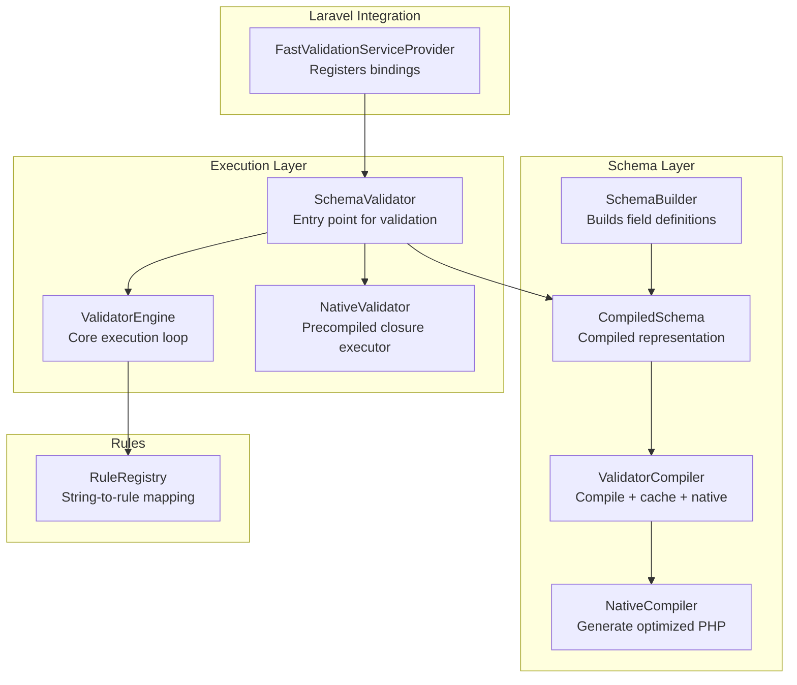
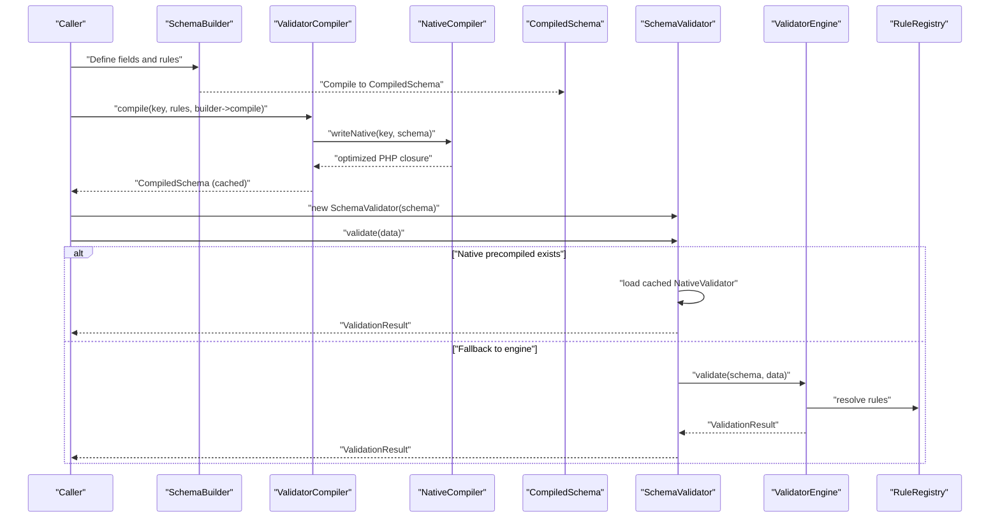
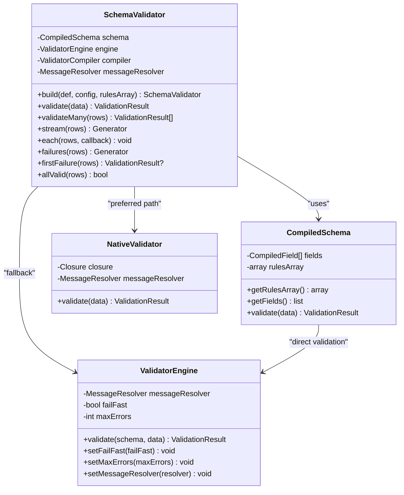
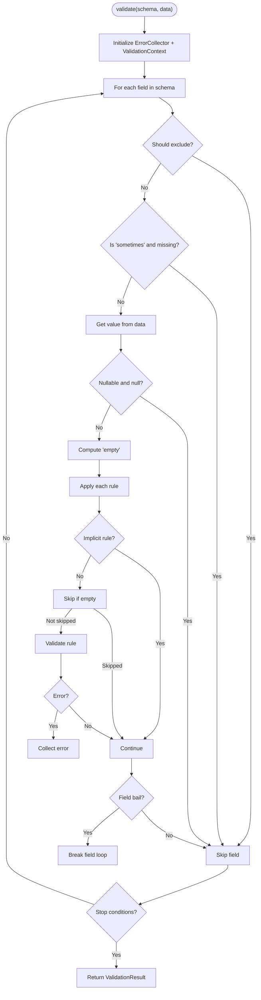
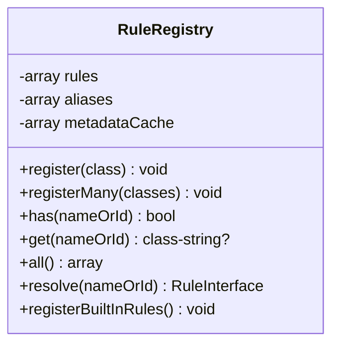
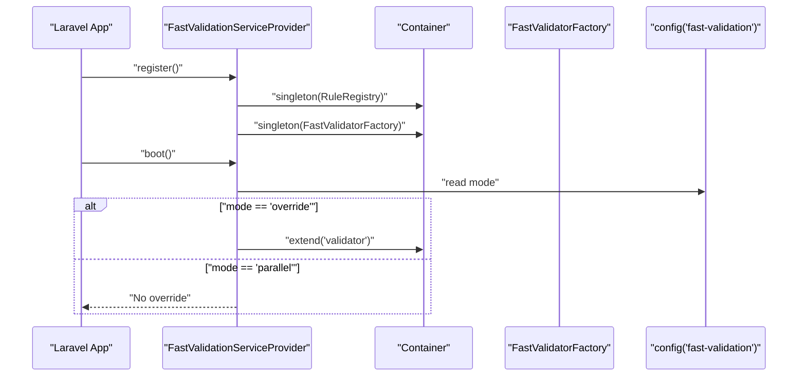
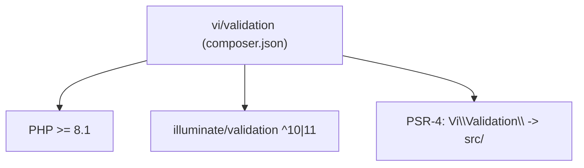

# Project Overview

<cite>
**Referenced Files in This Document**
- [README.md](file://README.md)
- [composer.json](file://composer.json)
- [config/fast-validation.php](file://config/fast-validation.php)
- [src/Validator.php](file://src/Validator.php)
- [src/Schema/SchemaBuilder.php](file://src/Schema/SchemaBuilder.php)
- [src/SchemaValidator.php](file://src/SchemaValidator.php)
- [src/Execution/CompiledSchema.php](file://src/Execution/CompiledSchema.php)
- [src/Execution/ValidatorEngine.php](file://src/Execution/ValidatorEngine.php)
- [src/Execution/NativeValidator.php](file://src/Execution/NativeValidator.php)
- [src/Compilation/ValidatorCompiler.php](file://src/Compilation/ValidatorCompiler.php)
- [src/Compilation/NativeCompiler.php](file://src/Compilation/NativeCompiler.php)
- [src/Rules/RuleRegistry.php](file://src/Rules/RuleRegistry.php)
- [src/Laravel/FastValidationServiceProvider.php](file://src/Laravel/FastValidationServiceProvider.php)
- [src/Runtime/ValidatorPool.php](file://src/Runtime/ValidatorPool.php)
- [tests/benchmark.php](file://tests/benchmark.php)
</cite>

## Table of Contents
1. [Introduction](#introduction)
2. [Project Structure](#project-structure)
3. [Core Components](#core-components)
4. [Architecture Overview](#architecture-overview)
5. [Detailed Component Analysis](#detailed-component-analysis)
6. [Dependency Analysis](#dependency-analysis)
7. [Performance Considerations](#performance-considerations)
8. [Troubleshooting Guide](#troubleshooting-guide)
9. [Conclusion](#conclusion)

## Introduction
vi/validation is a high-performance PHP validation library optimized for large datasets with first-class Laravel integration. Its core philosophy centers on “compile-once, validate-many” semantics: schemas are compiled once into a reusable, optimized form and then executed many times against large volumes of data. This approach minimizes repeated parsing and object allocation during validation, enabling throughput that scales linearly with dataset size while keeping per-record overhead extremely low.

The library targets scenarios where traditional validation approaches become bottlenecks—such as ETL pipelines, batch imports, queue workers, and long-running processes under frameworks like Laravel Octane, Swoole, and RoadRunner. It supports nested fields up to two levels via dot notation, provides streaming and chunked validation APIs for memory efficiency, and offers native code generation for maximum speed.

## Project Structure
At a high level, the project is organized by domain and responsibility:
- Schema definition and compilation: SchemaBuilder, CompiledSchema, ValidatorCompiler, NativeCompiler
- Execution engine: ValidatorEngine, SchemaValidator, NativeValidator
- Rule system: RuleRegistry and a comprehensive set of RuleInterface implementations
- Laravel integration: FastValidationServiceProvider, FastValidatorFactory, and adapters
- Runtime support: ValidatorPool and StatelessValidator for long-running environments
- Configuration: config/fast-validation.php for modes, caching, compilation, and performance tuning

**Diagram sources**
- [src/Schema/SchemaBuilder.php](file://src/Schema/SchemaBuilder.php#L9-L35)
- [src/Execution/CompiledSchema.php](file://src/Execution/CompiledSchema.php#L9-L67)
- [src/Compilation/ValidatorCompiler.php](file://src/Compilation/ValidatorCompiler.php#L10-L74)
- [src/Compilation/NativeCompiler.php](file://src/Compilation/NativeCompiler.php#L17-L51)
- [src/SchemaValidator.php](file://src/SchemaValidator.php#L13-L30)
- [src/Execution/ValidatorEngine.php](file://src/Execution/ValidatorEngine.php#L11-L31)
- [src/Execution/NativeValidator.php](file://src/Execution/NativeValidator.php#L12-L38)
- [src/Rules/RuleRegistry.php](file://src/Rules/RuleRegistry.php#L14-L301)
- [src/Laravel/FastValidationServiceProvider.php](file://src/Laravel/FastValidationServiceProvider.php#L12-L53)

**Section sources**
- [README.md](file://README.md#L1-L14)
- [composer.json](file://composer.json#L1-L36)
- [config/fast-validation.php](file://config/fast-validation.php#L5-L96)

## Core Components
- SchemaValidator: The primary entry point for validation. It encapsulates a CompiledSchema and either executes via ValidatorEngine or a precompiled NativeValidator. It exposes streaming and batch APIs optimized for large datasets.
- ValidatorEngine: The core execution engine that iterates fields, applies rules, manages bail and exclusion logic, and collects errors. It supports fail-fast and capped error collection.
- CompiledSchema: The compiled representation of a schema, holding CompiledField instances and the original rules array. It can validate directly or be used by SchemaValidator.
- ValidatorCompiler + NativeCompiler: Compile-time components that transform schemas into optimized forms. NativeCompiler generates a PHP closure that bypasses reflection-heavy rule instantiation, while ValidatorCompiler handles caching and precompilation artifacts.
- RuleRegistry: Central registry mapping rule names and aliases to RuleInterface implementations, enabling string-based rule parsing and extensibility.
- Laravel integration: FastValidationServiceProvider registers the RuleRegistry and FastValidatorFactory, publishes configuration, and optionally overrides Laravel’s validator factory.

Practical examples demonstrating performance benefits:
- Streaming validation with O(1) memory usage for 100,000+ rows
- Fail-fast and chunked processing to reduce latency and memory footprint
- Precompiled native validators for maximum throughput in hot paths

**Section sources**
- [src/SchemaValidator.php](file://src/SchemaValidator.php#L13-L204)
- [src/Execution/ValidatorEngine.php](file://src/Execution/ValidatorEngine.php#L11-L177)
- [src/Execution/CompiledSchema.php](file://src/Execution/CompiledSchema.php#L9-L67)
- [src/Compilation/ValidatorCompiler.php](file://src/Compilation/ValidatorCompiler.php#L10-L194)
- [src/Compilation/NativeCompiler.php](file://src/Compilation/NativeCompiler.php#L17-L310)
- [src/Rules/RuleRegistry.php](file://src/Rules/RuleRegistry.php#L14-L301)
- [src/Laravel/FastValidationServiceProvider.php](file://src/Laravel/FastValidationServiceProvider.php#L12-L53)
- [tests/benchmark.php](file://tests/benchmark.php#L1-L55)

## Architecture Overview
The architecture emphasizes separation of concerns:
- SchemaBuilder constructs field definitions
- CompiledSchema represents the validated schema
- ValidatorCompiler caches and writes native code
- SchemaValidator selects the fastest available execution path
- ValidatorEngine performs rule application and error collection
- RuleRegistry resolves rule names to implementations
- Laravel integration wires everything into the framework

**Diagram sources**
- [src/Schema/SchemaBuilder.php](file://src/Schema/SchemaBuilder.php#L31-L35)
- [src/Execution/CompiledSchema.php](file://src/Execution/CompiledSchema.php#L27-L36)
- [src/Compilation/ValidatorCompiler.php](file://src/Compilation/ValidatorCompiler.php#L33-L74)
- [src/Compilation/NativeCompiler.php](file://src/Compilation/NativeCompiler.php#L24-L51)
- [src/SchemaValidator.php](file://src/SchemaValidator.php#L54-L73)
- [src/Execution/ValidatorEngine.php](file://src/Execution/ValidatorEngine.php#L33-L98)
- [src/Rules/RuleRegistry.php](file://src/Rules/RuleRegistry.php#L180-L190)

## Detailed Component Analysis

### SchemaValidator
Responsibilities:
- Build or accept a CompiledSchema
- Select execution path: precompiled NativeValidator or ValidatorEngine
- Provide streaming and batch validation APIs
- Manage memory-efficient processing for large datasets

Key behaviors:
- validate(): attempts to load a native validator from disk; falls back to engine if unavailable
- validateMany()/stream()/each()/failures()/firstFailure()/allValid(): streaming and chunked APIs for large datasets
- build(): convenience method to construct a schema via SchemaBuilder and compile it

**Diagram sources**
- [src/SchemaValidator.php](file://src/SchemaValidator.php#L13-L204)
- [src/Execution/CompiledSchema.php](file://src/Execution/CompiledSchema.php#L9-L67)
- [src/Execution/ValidatorEngine.php](file://src/Execution/ValidatorEngine.php#L11-L177)
- [src/Execution/NativeValidator.php](file://src/Execution/NativeValidator.php#L12-L38)

**Section sources**
- [src/SchemaValidator.php](file://src/SchemaValidator.php#L20-L204)

### ValidatorEngine
Responsibilities:
- Iterate fields in a CompiledSchema
- Apply rules with short-circuiting (bail), exclusions, and “sometimes”
- Handle implicit vs non-implicit rules
- Enforce fail-fast and max-errors caps
- Collect and format errors

**Diagram sources**
- [src/Execution/ValidatorEngine.php](file://src/Execution/ValidatorEngine.php#L33-L98)

**Section sources**
- [src/Execution/ValidatorEngine.php](file://src/Execution/ValidatorEngine.php#L11-L177)

### RuleRegistry
Responsibilities:
- Register rule classes and their names/aliases
- Resolve rule names to RuleInterface instances
- Prevent conflicts and enforce metadata consistency

**Diagram sources**
- [src/Rules/RuleRegistry.php](file://src/Rules/RuleRegistry.php#L14-L301)

**Section sources**
- [src/Rules/RuleRegistry.php](file://src/Rules/RuleRegistry.php#L14-L301)

### Laravel Integration
Capabilities:
- Auto-discovery and manual registration
- Singleton bindings for RuleRegistry and FastValidatorFactory
- Publishing configuration file
- Optional override mode to route Validator::make() through the fast engine

**Diagram sources**
- [src/Laravel/FastValidationServiceProvider.php](file://src/Laravel/FastValidationServiceProvider.php#L14-L53)
- [config/fast-validation.php](file://config/fast-validation.php#L15-L44)

**Section sources**
- [src/Laravel/FastValidationServiceProvider.php](file://src/Laravel/FastValidationServiceProvider.php#L12-L53)
- [config/fast-validation.php](file://config/fast-validation.php#L5-L96)

## Dependency Analysis
- PHP requirement: >= 8.1
- illuminate/validation: ^10.0|^11.0
- PSR-4 namespace: Vi\Validation -> src/

**Diagram sources**
- [composer.json](file://composer.json#L6-L14)

**Section sources**
- [composer.json](file://composer.json#L1-L36)

## Performance Considerations
- Compile-once, validate-many: CompiledSchema and precompiled native validators eliminate repeated parsing and reflection overhead.
- Native code generation: NativeCompiler emits optimized PHP closures that inline common rules and minimize function calls.
- Streaming and chunked validation: APIs like stream(), each(), failures(), and ChunkedValidator enable memory-efficient processing of large datasets.
- Fail-fast and capped errors: ValidatorEngine supports fail-fast and max-errors to reduce unnecessary work.
- Long-running process support: ValidatorPool and StatelessValidator help manage state and reuse in Octane/Swoole/RoadRunner.

Practical examples:
- Benchmark script demonstrates throughput for 10,000 validations against a moderately complex schema.
- Configuration options allow tuning fail-fast, max errors, and compilation/precompilation paths.

**Section sources**
- [src/Compilation/NativeCompiler.php](file://src/Compilation/NativeCompiler.php#L17-L310)
- [src/SchemaValidator.php](file://src/SchemaValidator.php#L54-L204)
- [tests/benchmark.php](file://tests/benchmark.php#L1-L55)
- [config/fast-validation.php](file://config/fast-validation.php#L54-L63)

## Troubleshooting Guide
- Unknown rule name: Ensure the rule is registered via RuleRegistry or use a known built-in rule name.
- Overridden Laravel validator not taking effect: Verify mode is set to override and that the provider is registered; unsupported rules are ignored by the parser.
- Memory issues with large datasets: Prefer stream(), each(), or ChunkedValidator over validateMany() to avoid materializing all results.
- Long-running process state leaks: Use StatelessValidator or ValidatorPool to isolate state between requests.

**Section sources**
- [src/Rules/RuleRegistry.php](file://src/Rules/RuleRegistry.php#L180-L190)
- [src/Laravel/FastValidationServiceProvider.php](file://src/Laravel/FastValidationServiceProvider.php#L40-L52)
- [src/SchemaValidator.php](file://src/SchemaValidator.php#L76-L93)
- [src/Runtime/ValidatorPool.php](file://src/Runtime/ValidatorPool.php#L12-L140)

## Conclusion
vi/validation delivers a high-performance validation solution tailored for large-scale, data-intensive workloads. Its “compile-once, validate-many” design, combined with native code generation, streaming APIs, and robust Laravel integration, positions it as a strong choice for ETL, batch processing, and long-running applications. By leveraging CompiledSchema, SchemaValidator, and ValidatorEngine—and optionally precompiled native validators—teams can achieve significant throughput improvements over traditional validation approaches while maintaining expressive, readable rule definitions.