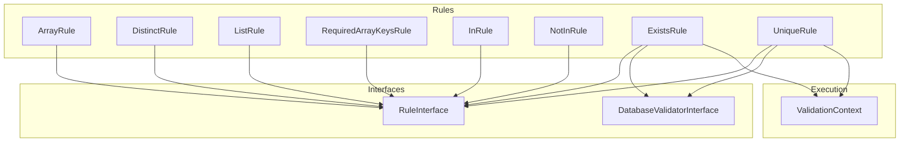
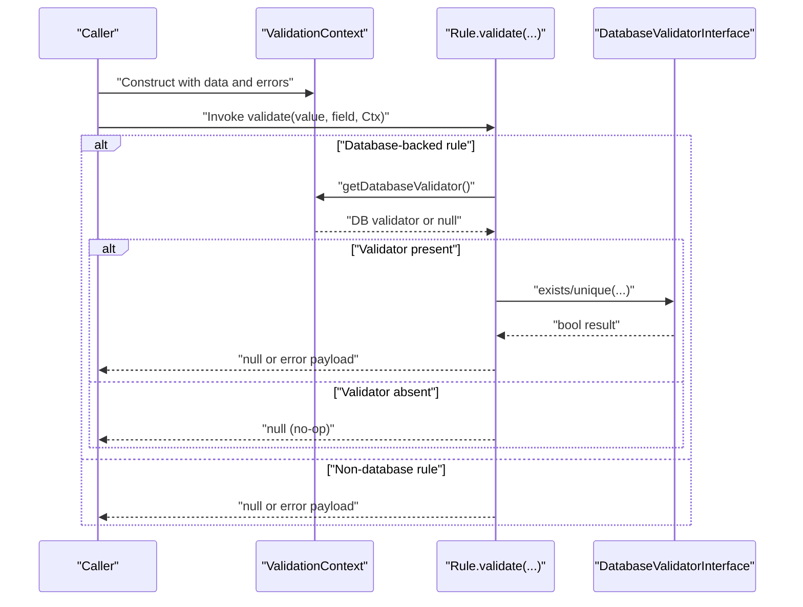
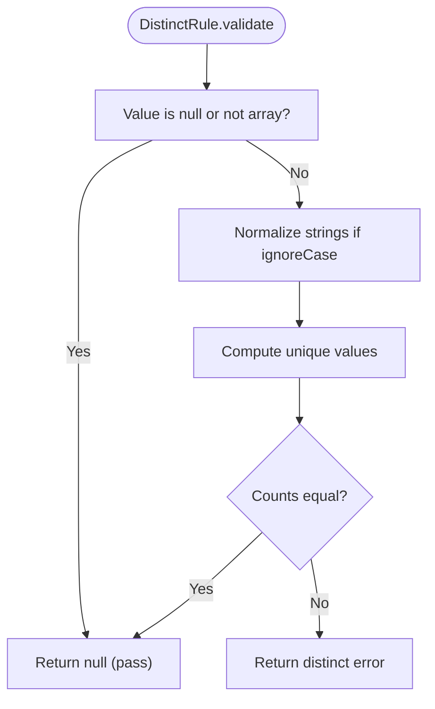
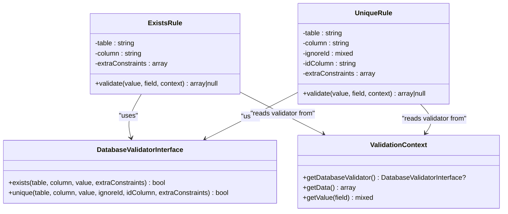
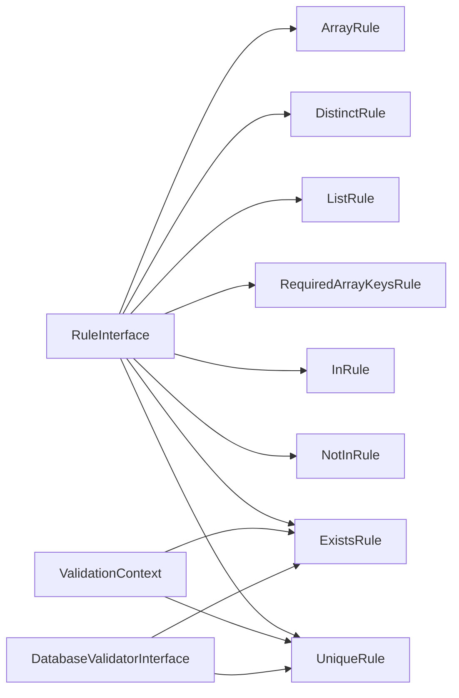

# Array and Database Rules

<cite>
**Referenced Files in This Document**
- [ArrayRule.php](file://src/Rules/ArrayRule.php)
- [DistinctRule.php](file://src/Rules/DistinctRule.php)
- [ListRule.php](file://src/Rules/ListRule.php)
- [RequiredArrayKeysRule.php](file://src/Rules/RequiredArrayKeysRule.php)
- [InRule.php](file://src/Rules/InRule.php)
- [NotInRule.php](file://src/Rules/NotInRule.php)
- [ExistsRule.php](file://src/Rules/ExistsRule.php)
- [UniqueRule.php](file://src/Rules/UniqueRule.php)
- [DatabaseValidatorInterface.php](file://src/Rules/DatabaseValidatorInterface.php)
- [ValidationContext.php](file://src/Execution/ValidationContext.php)
- [RuleInterface.php](file://src/Rules/RuleInterface.php)
- [RuleId.php](file://src/Rules/RuleId.php)
- [RuleName.php](file://src/Rules/RuleName.php)
- [RuleIdTest.php](file://tests/Unit/Rules/RuleIdTest.php)
- [ComparisonRulesTest.php](file://tests/Unit/Rules/ComparisonRulesTest.php)
</cite>

## Table of Contents
1. [Introduction](#introduction)
2. [Project Structure](#project-structure)
3. [Core Components](#core-components)
4. [Architecture Overview](#architecture-overview)
5. [Detailed Component Analysis](#detailed-component-analysis)
6. [Dependency Analysis](#dependency-analysis)
7. [Performance Considerations](#performance-considerations)
8. [Troubleshooting Guide](#troubleshooting-guide)
9. [Conclusion](#conclusion)

## Introduction
This document focuses on array and database validation rules within the validation framework. It explains how arrays are validated for shape and content, how uniqueness is enforced across arrays and databases, how membership constraints are applied, and how required keys are enforced. It also covers database-backed rules for existence and uniqueness checks, including the query patterns and constraint handling. Practical usage scenarios demonstrate complex validation workflows involving nested arrays, optional keys, and external data sources.

## Project Structure
The validation rules are implemented as individual classes under the Rules namespace. Each rule implements a shared interface and is annotated with a rule identifier. Database-backed rules rely on a context-provided validator implementing a dedicated interface. The execution context supports nested field access and integrates with error collection.

**Diagram sources**
- [ArrayRule.php](file://src/Rules/ArrayRule.php#L10-L23)
- [DistinctRule.php](file://src/Rules/DistinctRule.php#L13-L51)
- [ListRule.php](file://src/Rules/ListRule.php#L10-L23)
- [RequiredArrayKeysRule.php](file://src/Rules/RequiredArrayKeysRule.php#L10-L33)
- [InRule.php](file://src/Rules/InRule.php#L10-L32)
- [NotInRule.php](file://src/Rules/NotInRule.php#L10-L32)
- [ExistsRule.php](file://src/Rules/ExistsRule.php#L10-L42)
- [UniqueRule.php](file://src/Rules/UniqueRule.php#L10-L44)
- [RuleInterface.php](file://src/Rules/RuleInterface.php#L9-L15)
- [DatabaseValidatorInterface.php](file://src/Rules/DatabaseValidatorInterface.php#L11-L36)
- [ValidationContext.php](file://src/Execution/ValidationContext.php#L7-L97)

**Section sources**
- [ArrayRule.php](file://src/Rules/ArrayRule.php#L1-L25)
- [ListRule.php](file://src/Rules/ListRule.php#L1-L25)
- [DistinctRule.php](file://src/Rules/DistinctRule.php#L1-L53)
- [RequiredArrayKeysRule.php](file://src/Rules/RequiredArrayKeysRule.php#L1-L35)
- [InRule.php](file://src/Rules/InRule.php#L1-L34)
- [NotInRule.php](file://src/Rules/NotInRule.php#L1-L34)
- [ExistsRule.php](file://src/Rules/ExistsRule.php#L1-L44)
- [UniqueRule.php](file://src/Rules/UniqueRule.php#L1-L46)
- [DatabaseValidatorInterface.php](file://src/Rules/DatabaseValidatorInterface.php#L1-L37)
- [ValidationContext.php](file://src/Execution/ValidationContext.php#L1-L98)
- [RuleInterface.php](file://src/Rules/RuleInterface.php#L1-L16)
- [RuleId.php](file://src/Rules/RuleId.php#L1-L114)
- [RuleName.php](file://src/Rules/RuleName.php#L1-L17)

## Core Components
- ArrayRule: Ensures a value is an array. Returns null for null or non-array values; otherwise passes.
- DistinctRule: Enforces uniqueness within arrays. Supports strict comparison and case-insensitive string normalization.
- ListRule: Ensures arrays are lists (indexed sequentially) using native list detection.
- RequiredArrayKeysRule: Validates that specified keys exist in an array; reports missing keys.
- Membership rules (InRule, NotInRule): Validate scalar values against predefined sets.
- Database rules (ExistsRule, UniqueRule): Validate against external data via a database validator supplied by the execution context.

**Section sources**
- [ArrayRule.php](file://src/Rules/ArrayRule.php#L10-L23)
- [DistinctRule.php](file://src/Rules/DistinctRule.php#L13-L51)
- [ListRule.php](file://src/Rules/ListRule.php#L10-L23)
- [RequiredArrayKeysRule.php](file://src/Rules/RequiredArrayKeysRule.php#L10-L33)
- [InRule.php](file://src/Rules/InRule.php#L10-L32)
- [NotInRule.php](file://src/Rules/NotInRule.php#L10-L32)
- [ExistsRule.php](file://src/Rules/ExistsRule.php#L10-L42)
- [UniqueRule.php](file://src/Rules/UniqueRule.php#L10-L44)

## Architecture Overview
Rules are executed within a ValidationContext that provides access to the raw data and nested fields. Database-backed rules delegate to a DatabaseValidatorInterface implementation obtained from the context. The RuleName attribute and RuleId enum standardize rule identification and registration.

**Diagram sources**
- [ValidationContext.php](file://src/Execution/ValidationContext.php#L23-L41)
- [ExistsRule.php](file://src/Rules/ExistsRule.php#L23-L42)
- [UniqueRule.php](file://src/Rules/UniqueRule.php#L27-L44)
- [DatabaseValidatorInterface.php](file://src/Rules/DatabaseValidatorInterface.php#L11-L36)

## Detailed Component Analysis

### ArrayRule
Purpose: Validates that a value is an array. Null values pass validation; non-array scalars fail with an array rule error.

Processing logic:
- If value is null, return null (pass).
- Else if not an array, return an error payload indicating the array rule failed.
- Otherwise, return null (pass).

Complexity: O(1) time and space.

Usage example scenarios:
- Accepting only arrays for a configuration block.
- Ensuring a list of items is provided before further processing.

**Section sources**
- [ArrayRule.php](file://src/Rules/ArrayRule.php#L10-L23)

### DistinctRule
Purpose: Validates that array values are unique. Supports strict comparison and case-insensitive string normalization.

Key behaviors:
- If value is null or not an array, pass.
- Optionally normalize strings to lowercase when ignoreCase is enabled.
- Apply array_unique with regular sort when strict mode is enabled; otherwise use default uniqueness.
- Compare counts to detect duplicates.

Complexity:
- Normalization: O(n) for n elements.
- Uniqueness check: O(n) average depending on PHP’s internal implementation.
- Overall: O(n).

Practical usage:
- Enforcing unique tags or categories.
- Case-insensitive uniqueness for identifiers.

**Diagram sources**
- [DistinctRule.php](file://src/Rules/DistinctRule.php#L24-L51)

**Section sources**
- [DistinctRule.php](file://src/Rules/DistinctRule.php#L13-L51)

### ListRule
Purpose: Validates that an array is a list (indexed sequentially). Non-list arrays fail.

Processing logic:
- If value is null or not an array, pass.
- If array_is_list returns true, pass; otherwise fail with list rule error.

Complexity: O(1) for the check; however, list detection may traverse indices internally, typically O(k) for k elements checked until a gap is found.

Usage example:
- Ensuring ordered sequences or positional arguments.

**Section sources**
- [ListRule.php](file://src/Rules/ListRule.php#L10-L23)

### RequiredArrayKeysRule
Purpose: Ensures that all specified keys exist in an array. Reports missing keys.

Processing logic:
- If value is not an array, fail immediately with required_array_keys error and parameters.
- Iterate over required keys; if any key is missing, fail with required_array_keys and parameters.
- Otherwise, pass.

Complexity: O(k) for k required keys.

Usage example:
- Requiring presence of essential fields in a nested configuration object.

**Section sources**
- [RequiredArrayKeysRule.php](file://src/Rules/RequiredArrayKeysRule.php#L10-L33)

### Membership Rules: InRule and NotInRule
Purpose: Validate scalar values against fixed sets.

Processing logic:
- If value is null, pass.
- Convert value to string and check inclusion/exclusion in the provided set using strict comparison.
- Return appropriate error if mismatch.

Complexity: O(m) for m items in the set due to in_array lookup.

Usage example:
- Restricting allowed statuses or roles.

**Section sources**
- [InRule.php](file://src/Rules/InRule.php#L10-L32)
- [NotInRule.php](file://src/Rules/NotInRule.php#L10-L32)

### Database Rules: ExistsRule and UniqueRule
Purpose: Validate against external data using a database validator provided by the execution context.

Processing logic:
- If value is null, pass.
- Retrieve DatabaseValidatorInterface from ValidationContext.
- If validator is null, pass (no-op).
- Call exists or unique with table, column, value, and optional constraints/ignore parameters.
- Return error payload if validation fails; otherwise pass.

Database query patterns:
- exists: Checks whether a record with the given column=value exists (optionally with extra constraints).
- unique: Checks whether the value is unique in the given column, optionally ignoring a specific row identified by idColumn and ignoreId, and applying extra constraints.

Complexity:
- depends on underlying database implementation and indexing; typical single-row checks or index scans.

Practical usage:
- Ensuring foreign key existence (exists).
- Ensuring email uniqueness across users (unique), optionally excluding the current record during updates.

**Diagram sources**
- [ValidationContext.php](file://src/Execution/ValidationContext.php#L23-L41)
- [DatabaseValidatorInterface.php](file://src/Rules/DatabaseValidatorInterface.php#L11-L36)
- [ExistsRule.php](file://src/Rules/ExistsRule.php#L10-L42)
- [UniqueRule.php](file://src/Rules/UniqueRule.php#L10-L44)

**Section sources**
- [ExistsRule.php](file://src/Rules/ExistsRule.php#L10-L42)
- [UniqueRule.php](file://src/Rules/UniqueRule.php#L10-L44)
- [DatabaseValidatorInterface.php](file://src/Rules/DatabaseValidatorInterface.php#L11-L36)
- [ValidationContext.php](file://src/Execution/ValidationContext.php#L23-L41)

### Rule Identification and Registration
Rules are identified by a standardized name via the RuleName attribute and mapped to RuleId enum values. Tests confirm that all built-in rule IDs are registered and vice versa.

- RuleName attribute: Associates a class with a rule name and optional aliases.
- RuleId enum: Central enumeration of all built-in rule identifiers.
- Registry linkage: Tests assert bidirectional coverage between enum cases and registered rules.

**Section sources**
- [RuleName.php](file://src/Rules/RuleName.php#L9-L17)
- [RuleId.php](file://src/Rules/RuleId.php#L10-L114)
- [RuleIdTest.php](file://tests/Unit/Rules/RuleIdTest.php#L15-L72)

### Practical Usage Examples in Complex Scenarios
- Nested array validation:
  - Use RequiredArrayKeysRule to ensure top-level keys exist.
  - Use ArrayRule to ensure nested blocks are arrays.
  - Use DistinctRule on arrays of identifiers to prevent duplicates.
- Membership constraints:
  - Use InRule to restrict allowed values for enums or statuses.
  - Use NotInRule to ban reserved or invalid values.
- Database-backed checks:
  - Use ExistsRule to ensure referenced IDs exist in related tables.
  - Use UniqueRule to enforce uniqueness across records, optionally ignoring the current record’s ID during updates.
- Mixed validations:
  - Combine ArrayRule, ListRule, and RequiredArrayKeysRule to validate structured inputs like configuration arrays with required positional and named segments.

**Section sources**
- [RequiredArrayKeysRule.php](file://src/Rules/RequiredArrayKeysRule.php#L10-L33)
- [ArrayRule.php](file://src/Rules/ArrayRule.php#L10-L23)
- [DistinctRule.php](file://src/Rules/DistinctRule.php#L24-L51)
- [InRule.php](file://src/Rules/InRule.php#L10-L32)
- [NotInRule.php](file://src/Rules/NotInRule.php#L10-L32)
- [ExistsRule.php](file://src/Rules/ExistsRule.php#L23-L42)
- [UniqueRule.php](file://src/Rules/UniqueRule.php#L27-L44)
- [ComparisonRulesTest.php](file://tests/Unit/Rules/ComparisonRulesTest.php#L25-L51)

## Dependency Analysis
- Cohesion: Each rule class encapsulates a single responsibility and shares the same interface contract.
- Coupling:
  - Array and membership rules depend only on the ValidationContext and standard PHP functions.
  - Database rules depend on DatabaseValidatorInterface and ValidationContext.
- External dependencies:
  - Database rules require a DatabaseValidatorInterface implementation to be injected into ValidationContext.
- Potential circular dependencies: None observed among the analyzed files.

**Diagram sources**
- [RuleInterface.php](file://src/Rules/RuleInterface.php#L9-L15)
- [ArrayRule.php](file://src/Rules/ArrayRule.php#L10-L23)
- [DistinctRule.php](file://src/Rules/DistinctRule.php#L13-L51)
- [ListRule.php](file://src/Rules/ListRule.php#L10-L23)
- [RequiredArrayKeysRule.php](file://src/Rules/RequiredArrayKeysRule.php#L10-L33)
- [InRule.php](file://src/Rules/InRule.php#L10-L32)
- [NotInRule.php](file://src/Rules/NotInRule.php#L10-L32)
- [ExistsRule.php](file://src/Rules/ExistsRule.php#L10-L42)
- [UniqueRule.php](file://src/Rules/UniqueRule.php#L10-L44)
- [ValidationContext.php](file://src/Execution/ValidationContext.php#L23-L41)
- [DatabaseValidatorInterface.php](file://src/Rules/DatabaseValidatorInterface.php#L11-L36)

**Section sources**
- [RuleInterface.php](file://src/Rules/RuleInterface.php#L9-L15)
- [ValidationContext.php](file://src/Execution/ValidationContext.php#L23-L41)
- [DatabaseValidatorInterface.php](file://src/Rules/DatabaseValidatorInterface.php#L11-L36)

## Performance Considerations
- ArrayRule and ListRule: O(1) checks; minimal overhead.
- DistinctRule: O(n) with normalization overhead for strings when ignoreCase is enabled; uniqueness computation typically O(n) average.
- RequiredArrayKeysRule: O(k) for k required keys.
- Membership rules (InRule/NotInRule): O(m) per rule invocation for m items in the set.
- Database rules (ExistsRule/UniqueRule): Performance depends on database indexing and query plans; consider adding appropriate indexes on columns used for existence/uniqueness checks.

## Troubleshooting Guide
- Database validator not configured:
  - Symptom: Database rules silently pass when they should fail.
  - Cause: ValidationContext.getDatabaseValidator returns null.
  - Resolution: Inject a DatabaseValidatorInterface implementation into ValidationContext before validation.
- Unexpected passes for database rules:
  - Verify that the validator is set and that the table/column names and constraints match the target schema.
- DistinctRule false positives/negatives:
  - Check strict mode and ignoreCase flags; ensure normalized values are intended.
- Membership rule failures:
  - Confirm value types are compatible with string conversion and that the set contains the expected values.

**Section sources**
- [ValidationContext.php](file://src/Execution/ValidationContext.php#L23-L41)
- [ExistsRule.php](file://src/Rules/ExistsRule.php#L23-L42)
- [UniqueRule.php](file://src/Rules/UniqueRule.php#L27-L44)
- [DistinctRule.php](file://src/Rules/DistinctRule.php#L24-L51)
- [InRule.php](file://src/Rules/InRule.php#L21-L32)
- [NotInRule.php](file://src/Rules/NotInRule.php#L21-L32)

## Conclusion
The array and database validation rules provide robust primitives for ensuring data integrity across diverse scenarios. ArrayRule, DistinctRule, ListRule, and RequiredArrayKeysRule form a cohesive set for array shape and content validation. Membership rules offer precise control over allowed values. Database-backed rules integrate cleanly with a context-driven validator to enforce referential integrity and uniqueness. Together, these components enable expressive, maintainable validation logic for complex data structures and external constraints.