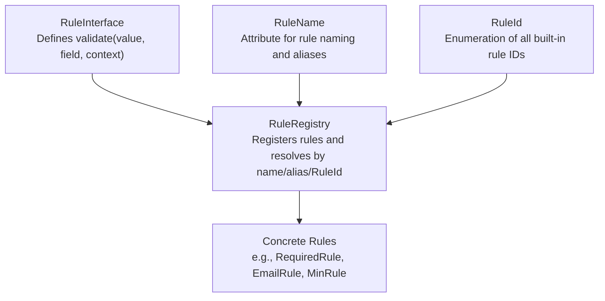
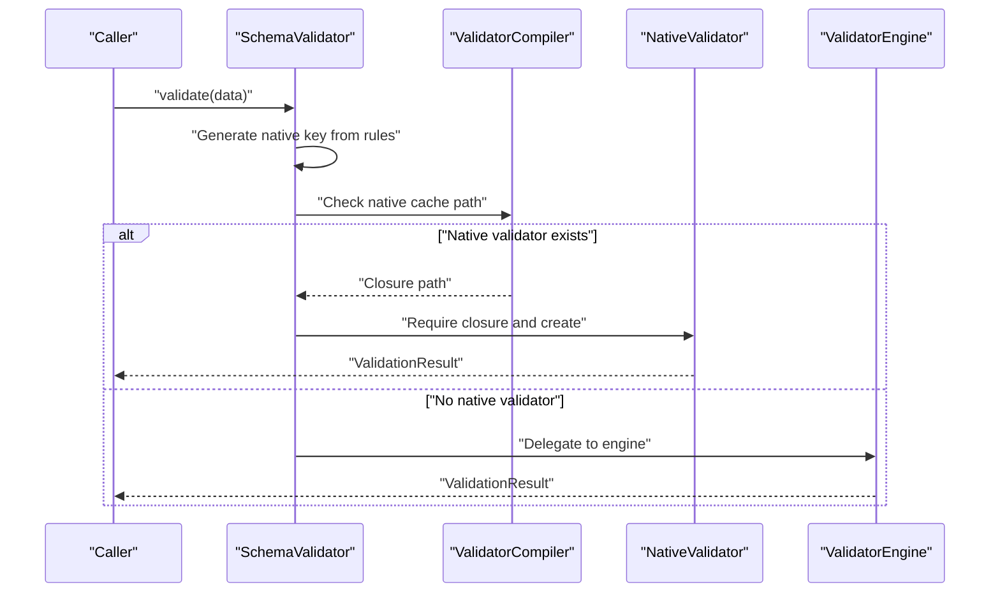
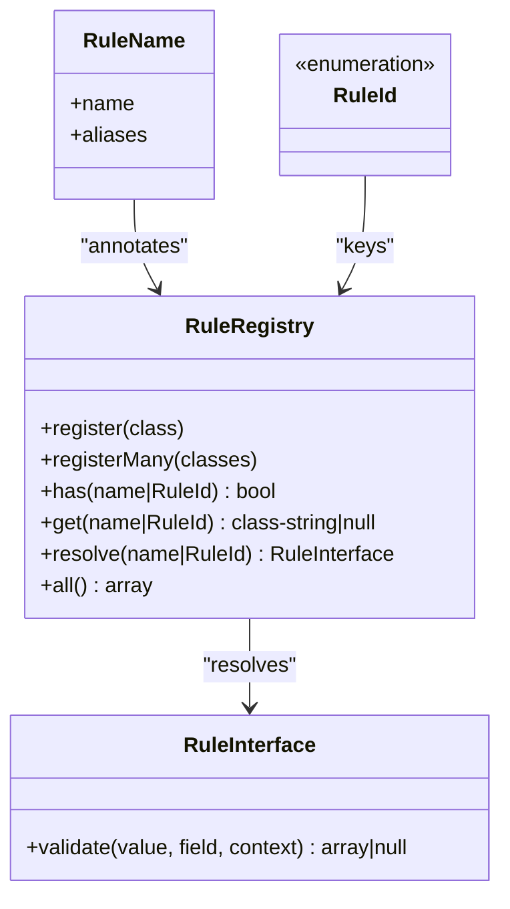

# Built-in Rules Catalog

<cite>
**Referenced Files in This Document**
- [RuleInterface.php](file://src/Rules/RuleInterface.php)
- [RuleRegistry.php](file://src/Rules/RuleRegistry.php)
- [RuleName.php](file://src/Rules/RuleName.php)
- [RuleId.php](file://src/Rules/RuleId.php)
- [RequiredRule.php](file://src/Rules/RequiredRule.php)
- [NullableRule.php](file://src/Rules/NullableRule.php)
- [FilledRule.php](file://src/Rules/FilledRule.php)
- [PresentRule.php](file://src/Rules/PresentRule.php)
- [StringTypeRule.php](file://src/Rules/StringTypeRule.php)
- [IntegerTypeRule.php](file://src/Rules/IntegerTypeRule.php)
- [NumericRule.php](file://src/Rules/NumericRule.php)
- [BooleanRule.php](file://src/Rules/BooleanRule.php)
- [ArrayRule.php](file://src/Rules/ArrayRule.php)
- [DateRule.php](file://src/Rules/DateRule.php)
- [JsonRule.php](file://src/Rules/JsonRule.php)
- [EmailRule.php](file://src/Rules/EmailRule.php)
- [AlphaRule.php](file://src/Rules/AlphaRule.php)
- [UrlRule.php](file://src/Rules/UrlRule.php)
- [UuidRule.php](file://src/Rules/UuidRule.php)
- [IpRule.php](file://src/Rules/IpRule.php)
- [RegexRule.php](file://src/Rules/RegexRule.php)
- [MinRule.php](file://src/Rules/MinRule.php)
- [MaxRule.php](file://src/Rules/MaxRule.php)
- [SizeRule.php](file://src/Rules/SizeRule.php)
- [BetweenRule.php](file://src/Rules/BetweenRule.php)
- [InRule.php](file://src/Rules/InRule.php)
- [NotInRule.php](file://src/Rules/NotInRule.php)
- [ConfirmedRule.php](file://src/Rules/ConfirmedRule.php)
- [SameRule.php](file://src/Rules/SameRule.php)
- [DifferentRule.php](file://src/Rules/DifferentRule.php)
- [AfterRule.php](file://src/Rules/AfterRule.php)
- [AfterOrEqualRule.php](file://src/Rules/AfterOrEqualRule.php)
- [BeforeRule.php](file://src/Rules/BeforeRule.php)
- [BeforeOrEqualRule.php](file://src/Rules/BeforeOrEqualRule.php)
- [DistinctRule.php](file://src/Rules/DistinctRule.php)
- [FileRule.php](file://src/Rules/FileRule.php)
- [ImageRule.php](file://src/Rules/ImageRule.php)
- [MimesRule.php](file://src/Rules/MimesRule.php)
- [MaxFileSizeRule.php](file://src/Rules/MaxFileSizeRule.php)
- [AcceptedRule.php](file://src/Rules/AcceptedRule.php)
- [DeclinedRule.php](file://src/Rules/DeclinedRule.php)
- [RequiredIfRule.php](file://src/Rules/RequiredIfRule.php)
- [RequiredUnlessRule.php](file://src/Rules/RequiredUnlessRule.php)
- [RequiredWithRule.php](file://src/Rules/RequiredWithRule.php)
- [RequiredWithAllRule.php](file://src/Rules/RequiredWithAllRule.php)
- [RequiredWithoutRule.php](file://src/Rules/RequiredWithoutRule.php)
- [RequiredWithoutAllRule.php](file://src/Rules/RequiredWithoutAllRule.php)
</cite>

## Table of Contents
1. [Introduction](#introduction)
2. [Project Structure](#project-structure)
3. [Core Components](#core-components)
4. [Architecture Overview](#architecture-overview)
5. [Detailed Component Analysis](#detailed-component-analysis)
6. [Dependency Analysis](#dependency-analysis)
7. [Performance Considerations](#performance-considerations)
8. [Troubleshooting Guide](#troubleshooting-guide)
9. [Conclusion](#conclusion)

## Introduction
This document catalogs the built-in validation rules provided by the library. It organizes rules by category, describes syntax and parameters, outlines validation logic, and highlights performance characteristics and common use cases. The goal is to help both newcomers and experienced users quickly locate and apply the right rules for robust data validation.

## Project Structure
The validation system centers around a rule interface and registry, with each rule encapsulating a single validation concern. Rules are registered under canonical names and optional aliases, enabling flexible lookup and resolution.

**Diagram sources**
- [RuleInterface.php](file://src/Rules/RuleInterface.php#L9-L15)
- [RuleRegistry.php](file://src/Rules/RuleRegistry.php#L14-L190)
- [RuleName.php](file://src/Rules/RuleName.php#L9-L17)
- [RuleId.php](file://src/Rules/RuleId.php#L10-L113)

**Section sources**
- [RuleInterface.php](file://src/Rules/RuleInterface.php#L9-L15)
- [RuleRegistry.php](file://src/Rules/RuleRegistry.php#L14-L190)
- [RuleName.php](file://src/Rules/RuleName.php#L9-L17)
- [RuleId.php](file://src/Rules/RuleId.php#L10-L113)

## Core Components
- RuleInterface: Defines the contract for all rules. Each rule returns null on success or an associative array containing the rule name and optional params on failure.
- RuleRegistry: Registers built-in rules, supports aliases, and resolves rule names/aliases/RuleId to concrete rule instances.
- RuleName: Attribute applied to rule classes to declare canonical names and aliases.
- RuleId: Enumeration of all built-in rule identifiers used consistently across the system.

Key behaviors:
- Rule resolution supports canonical names, aliases, and RuleId enums.
- Rules receive the current field value, field name, and a validation context to access sibling fields when needed.
- Rule failures include structured metadata (rule name and params) for message rendering and debugging.

**Section sources**
- [RuleInterface.php](file://src/Rules/RuleInterface.php#L9-L15)
- [RuleRegistry.php](file://src/Rules/RuleRegistry.php#L14-L190)
- [RuleName.php](file://src/Rules/RuleName.php#L9-L17)
- [RuleId.php](file://src/Rules/RuleId.php#L10-L113)

## Architecture Overview
The runtime validation flow uses a compiled schema and a validator engine. For performance, precompiled native validators can be generated and cached.

**Diagram sources**
- [SchemaValidator.php](file://src/SchemaValidator.php#L54-L73)

**Section sources**
- [SchemaValidator.php](file://src/SchemaValidator.php#L54-L73)

## Detailed Component Analysis

### Core Rules
Core rules enforce presence and basic shape of data.

- required
  - Syntax: required
  - Parameters: none
  - Logic: fails if value is null, empty string, or empty array; passes otherwise
  - Practical usage: mandatory form fields, non-empty selections
  - Performance: O(1); minimal overhead
  - Common use cases: user registration, order items

- nullable
  - Syntax: nullable
  - Parameters: none
  - Logic: allows null values; otherwise defers to subsequent rules
  - Practical usage: optional fields that may legitimately be null
  - Performance: O(1)
  - Common use cases: profile bio, secondary emails

- filled
  - Syntax: filled
  - Parameters: none
  - Logic: fails if value is null or empty string/array; passes otherwise
  - Practical usage: ensure non-empty values when presence implies content
  - Performance: O(1)
  - Common use cases: comments, descriptions

- present
  - Syntax: present
  - Parameters: none
  - Logic: fails if the field is absent from input; passes if present (even if null)
  - Practical usage: detect presence without enforcing non-null content
  - Performance: O(1)
  - Common use cases: conditional presence checks

**Section sources**
- [RequiredRule.php](file://src/Rules/RequiredRule.php#L9-L28)
- [NullableRule.php](file://src/Rules/NullableRule.php)
- [FilledRule.php](file://src/Rules/FilledRule.php)
- [PresentRule.php](file://src/Rules/PresentRule.php)

### Type Rules
Type rules constrain values to specific PHP types or coercible forms.

- string
  - Syntax: string
  - Parameters: none
  - Logic: fails if non-null and not a string; passes otherwise
  - Practical usage: text inputs, identifiers
  - Performance: O(1)
  - Common use cases: usernames, titles

- integer (alias: int)
  - Syntax: integer or int
  - Parameters: none
  - Logic: passes for integers or numeric strings matching integer pattern; fails otherwise
  - Practical usage: ages, counts, IDs
  - Performance: O(1)
  - Common use cases: pagination, quantities

- numeric
  - Syntax: numeric
  - Parameters: none
  - Logic: fails if not numeric; passes otherwise
  - Practical usage: amounts, scores
  - Performance: O(1)
  - Common use cases: prices, ratings

- boolean (alias: bool)
  - Syntax: boolean or bool
  - Parameters: none
  - Logic: accepts true/false, 0/1, '0'/'1'; fails otherwise
  - Practical usage: toggles, consent flags
  - Performance: O(1)
  - Common use cases: newsletter opt-in, terms accepted

- array
  - Syntax: array
  - Parameters: none
  - Logic: fails if non-null and not an array; passes otherwise
  - Practical usage: lists, collections
  - Performance: O(1)
  - Common use cases: tags, permissions

- date
  - Syntax: date
  - Parameters: optional format string
  - Logic: validates string dates; optionally strict against a format
  - Practical usage: birthdates, event dates
  - Performance: O(1)
  - Common use cases: DOB, schedules

- json
  - Syntax: json
  - Parameters: none
  - Logic: decodes and checks for JSON errors
  - Practical usage: serialized payloads, API responses
  - Performance: O(n) for decoding
  - Common use cases: metadata blobs, preferences

**Section sources**
- [StringTypeRule.php](file://src/Rules/StringTypeRule.php#L9-L24)
- [IntegerTypeRule.php](file://src/Rules/IntegerTypeRule.php#L9-L30)
- [NumericRule.php](file://src/Rules/NumericRule.php#L9-L24)
- [BooleanRule.php](file://src/Rules/BooleanRule.php#L9-L26)
- [ArrayRule.php](file://src/Rules/ArrayRule.php#L9-L24)
- [DateRule.php](file://src/Rules/DateRule.php#L10-L43)
- [JsonRule.php](file://src/Rules/JsonRule.php#L9-L30)

### String Validation Rules
String-specific rules validate shape and format.

- email
  - Syntax: email
  - Parameters: none
  - Logic: string validation plus filter-based email check
  - Practical usage: user accounts, contact info
  - Performance: O(1) with filter call
  - Common use cases: login credentials, notifications

- alpha
  - Syntax: alpha
  - Parameters: none
  - Logic: alphabetic-only strings
  - Practical usage: names, slugs
  - Performance: O(n)
  - Common use cases: first/last names

- url
  - Syntax: url
  - Parameters: none
  - Logic: URL format validation
  - Practical usage: website links, redirects
  - Performance: O(1)
  - Common use cases: profile sites, APIs

- uuid
  - Syntax: uuid
  - Parameters: none
  - Logic: UUID format validation
  - Practical usage: identifiers, logs
  - Performance: O(1)
  - Common use cases: entity IDs, correlation IDs

- ip
  - Syntax: ip
  - Parameters: none
  - Logic: IPv4/IPv6 address validation
  - Practical usage: audit trails, device IDs
  - Performance: O(1)
  - Common use cases: client IPs, proxy headers

- regex
  - Syntax: regex(/pattern/)
  - Parameters: pattern (delimited)
  - Logic: matches against the provided regular expression
  - Practical usage: custom formats
  - Performance: O(n) per match
  - Common use cases: postal codes, license plates

**Section sources**
- [EmailRule.php](file://src/Rules/EmailRule.php#L9-L29)
- [AlphaRule.php](file://src/Rules/AlphaRule.php)
- [UrlRule.php](file://src/Rules/UrlRule.php)
- [UuidRule.php](file://src/Rules/UuidRule.php)
- [IpRule.php](file://src/Rules/IpRule.php)
- [RegexRule.php](file://src/Rules/RegexRule.php)

### Size Rules
Size rules constrain length, count, and magnitude.

- min
  - Syntax: min(N)
  - Parameters: N (integer or float)
  - Logic: array length >= N; string length >= N; numeric value >= N
  - Practical usage: minimum length, thresholds
  - Performance: O(1) for arrays/numbers; O(n) for strings
  - Common use cases: passwords, descriptions

- max
  - Syntax: max(N)
  - Parameters: N (integer or float)
  - Logic: array length <= N; string length <= N; numeric value <= N
  - Practical usage: caps, limits
  - Performance: O(1) for arrays/numbers; O(n) for strings
  - Common use cases: file sizes, message lengths

- size
  - Syntax: size(N)
  - Parameters: N (integer or float)
  - Logic: array length == N; string length == N; numeric value == N
  - Practical usage: fixed-length constraints
  - Performance: O(1) for arrays/numbers; O(n) for strings
  - Common use cases: zip codes, fixed codes

- between
  - Syntax: between(min, max)
  - Parameters: min, max
  - Logic: inclusive range checking across types
  - Practical usage: age ranges, price bands
  - Performance: O(1)
  - Common use cases: pricing tiers, demographics

**Section sources**
- [MinRule.php](file://src/Rules/MinRule.php#L9-L47)
- [MaxRule.php](file://src/Rules/MaxRule.php)
- [SizeRule.php](file://src/Rules/SizeRule.php)
- [BetweenRule.php](file://src/Rules/BetweenRule.php)

### Comparison Rules
Comparison rules validate membership and equality.

- in
  - Syntax: in(a,b,c...)
  - Parameters: list of allowed values
  - Logic: value must be in the provided set
  - Practical usage: dropdowns, enums
  - Performance: O(k) for k items in list
  - Common use cases: countries, statuses

- not_in
  - Syntax: not_in(a,b,c...)
  - Parameters: list of disallowed values
  - Logic: value must not be in the provided set
  - Practical usage: blacklists
  - Performance: O(k)
  - Common use cases: banned usernames, restricted IPs

- confirmed
  - Syntax: confirmed
  - Parameters: none
  - Logic: compares field with {field}_confirmation
  - Practical usage: password re-entry
  - Performance: O(1)
  - Common use cases: signup flows

- same
  - Syntax: same(other.field)
  - Parameters: other field name
  - Logic: values must be equal
  - Practical usage: confirmations
  - Performance: O(1)
  - Common use cases: terms agreement, matching fields

- different
  - Syntax: different(other.field)
  - Parameters: other field name
  - Logic: values must be different
  - Practical usage: uniqueness checks
  - Performance: O(1)
  - Common use cases: preventing duplicates

**Section sources**
- [InRule.php](file://src/Rules/InRule.php)
- [NotInRule.php](file://src/Rules/NotInRule.php)
- [ConfirmedRule.php](file://src/Rules/ConfirmedRule.php)
- [SameRule.php](file://src/Rules/SameRule.php)
- [DifferentRule.php](file://src/Rules/DifferentRule.php)

### Date Comparison Rules
Date comparison rules compare temporal values.

- after
  - Syntax: after(date)
  - Parameters: reference date
  - Logic: datetime after reference
  - Practical usage: expiry, future events
  - Performance: O(1)
  - Common use cases: coupon validity, booking windows

- after_or_equal
  - Syntax: after_or_equal(date)
  - Parameters: reference date
  - Logic: datetime after or equal reference
  - Practical usage: effective dates
  - Performance: O(1)
  - Common use cases: policy start dates

- before
  - Syntax: before(date)
  - Parameters: reference date
  - Logic: datetime before reference
  - Practical usage: deadlines, expiry
  - Performance: O(1)
  - Common use cases: submission cutoffs

- before_or_equal
  - Syntax: before_or_equal(date)
  - Parameters: reference date
  - Logic: datetime before or equal reference
  - Performance: O(1)
  - Common use cases: historical records

**Section sources**
- [AfterRule.php](file://src/Rules/AfterRule.php)
- [AfterOrEqualRule.php](file://src/Rules/AfterOrEqualRule.php)
- [BeforeRule.php](file://src/Rules/BeforeRule.php)
- [BeforeOrEqualRule.php](file://src/Rules/BeforeOrEqualRule.php)

### Array Rules
Array rules validate collection properties.

- distinct
  - Syntax: distinct
  - Parameters: none
  - Logic: all values in array must be unique
  - Practical usage: tag sets, permissions
  - Performance: O(n log n) typical due to comparisons
  - Common use cases: categories, roles

**Section sources**
- [DistinctRule.php](file://src/Rules/DistinctRule.php)

### File Rules
File rules validate uploaded or referenced files.

- file
  - Syntax: file
  - Parameters: none
  - Logic: accepts SplFileInfo, uploaded file array, or file path
  - Practical usage: uploads, references
  - Performance: O(1) filesystem checks
  - Common use cases: avatar uploads, document storage

- image
  - Syntax: image
  - Parameters: none
  - Logic: accepts images via image-specific checks
  - Practical usage: profile pictures, thumbnails
  - Performance: O(1) mime/type checks
  - Common use cases: media libraries

- mimes
  - Syntax: mimes(type1,type2,...)
  - Parameters: list of allowed MIME types
  - Logic: validates MIME type against allowed set
  - Practical usage: restricting upload types
  - Performance: O(1)
  - Common use cases: PDFs, images

- max_file_size
  - Syntax: max_file_size(KB)
  - Parameters: size in kilobytes
  - Logic: enforces maximum file size
  - Practical usage: storage quotas
  - Performance: O(1)
  - Common use cases: file upload limits

- min_file_size
  - Syntax: min_file_size(KB)
  - Parameters: size in kilobytes
  - Logic: enforces minimum file size
  - Practical usage: ensuring meaningful uploads
  - Performance: O(1)
  - Common use cases: documents, assets

**Section sources**
- [FileRule.php](file://src/Rules/FileRule.php#L10-L45)
- [ImageRule.php](file://src/Rules/ImageRule.php)
- [MimesRule.php](file://src/Rules/MimesRule.php)
- [MaxFileSizeRule.php](file://src/Rules/MaxFileSizeRule.php)
- [MinFileSizeRule.php](file://src/Rules/MinFileSizeRule.php)

### Acceptance Rules
Acceptance rules validate explicit user consent.

- accepted
  - Syntax: accepted
  - Parameters: none
  - Logic: accepts true-like values
  - Practical usage: terms, subscriptions
  - Performance: O(1)
  - Common use cases: TOS, marketing opt-in

- declined
  - Syntax: declined
  - Parameters: none
  - Logic: rejects true-like values
  - Practical usage: cancellations, opt-outs
  - Performance: O(1)
  - Common use cases: unsubscribe flows

**Section sources**
- [AcceptedRule.php](file://src/Rules/AcceptedRule.php)
- [DeclinedRule.php](file://src/Rules/DeclinedRule.php)

### Conditional Rules
Conditional rules activate validation based on other fields.

- required_if
  - Syntax: required_if(other.field, value1, ...)
  - Parameters: other field, list of values
  - Logic: required only if other field equals any specified value
  - Practical usage: dependent fields
  - Performance: O(1)
  - Common use cases: spouse age when married

- required_unless
  - Syntax: required_unless(other.field, value1, ...)
  - Parameters: other field, list of values
  - Logic: required unless other field equals any specified value
  - Practical usage: inverse conditions
  - Performance: O(1)
  - Common use cases: emergency contacts unless resident

- required_with
  - Syntax: required_with(other.field1, ...)
  - Parameters: list of other fields
  - Logic: required if any of the listed fields are present
  - Practical usage: partial dependencies
  - Performance: O(1)
  - Common use cases: secondary phone if primary provided

- required_with_all
  - Syntax: required_with_all(other.field1, ...)
  - Parameters: list of other fields
  - Logic: required only if all listed fields are present
  - Practical usage: complete sets
  - Performance: O(1)
  - Common use cases: billing address if shipping provided

- required_without
  - Syntax: required_without(other.field1, ...)
  - Parameters: list of other fields
  - Logic: required if any of the listed fields are absent
  - Practical usage: fallbacks
  - Performance: O(1)
  - Common use cases: secondary email if primary missing

- required_without_all
  - Syntax: required_without_all(other.field1, ...)
  - Parameters: list of other fields
  - Logic: required if all listed fields are absent
  - Practical usage: mandatory when others omitted
  - Performance: O(1)
  - Common use cases: emergency contact if none provided

**Section sources**
- [RequiredIfRule.php](file://src/Rules/RequiredIfRule.php#L9-L66)
- [RequiredUnlessRule.php](file://src/Rules/RequiredUnlessRule.php)
- [RequiredWithRule.php](file://src/Rules/RequiredWithRule.php)
- [RequiredWithAllRule.php](file://src/Rules/RequiredWithAllRule.php)
- [RequiredWithoutRule.php](file://src/Rules/RequiredWithoutRule.php)
- [RequiredWithoutAllRule.php](file://src/Rules/RequiredWithoutAllRule.php)

## Dependency Analysis
Rules depend on the rule interface and are registered centrally. They rely on the validation context to access sibling fields for cross-field logic.

**Diagram sources**
- [RuleInterface.php](file://src/Rules/RuleInterface.php#L9-L15)
- [RuleRegistry.php](file://src/Rules/RuleRegistry.php#L14-L190)
- [RuleName.php](file://src/Rules/RuleName.php#L9-L17)
- [RuleId.php](file://src/Rules/RuleId.php#L10-L113)

**Section sources**
- [RuleRegistry.php](file://src/Rules/RuleRegistry.php#L195-L299)

## Performance Considerations
- Rule evaluation cost varies by rule:
  - Primitive checks (required, nullable, string, array, boolean, numeric, integer) are O(1).
  - String-based rules (email, url, uuid, ip, regex) are O(n) in the worst case for the string length.
  - JSON decoding is O(n) proportional to input size.
  - Array rules (distinct) are typically O(n log n) due to comparisons.
  - File rules incur filesystem checks O(1) per operation.
- The validator supports precompiled native validators for maximum throughput. When available, validation bypasses the engine and executes a cached closure.
- For batch processing:
  - Use stream() or each() to avoid memory accumulation.
  - Use failures() to skip successful validations and reduce memory footprint.
  - Use firstFailure() for fail-fast scenarios.

[No sources needed since this section provides general guidance]

## Troubleshooting Guide
- Unknown rule name or alias:
  - Symptom: resolving a rule throws an exception.
  - Cause: rule not registered or misspelled.
  - Fix: ensure the rule is included in the built-in registry and use canonical names or declared aliases.
- Rule parameters mismatch:
  - Symptom: unexpected failures for size/min/max/between.
  - Cause: wrong parameter types or out-of-range values.
  - Fix: verify parameter types align with the rule’s expectations (int/float for numeric rules).
- Cross-field condition not triggering:
  - Symptom: required_if/required_unless not behaving as expected.
  - Cause: referenced field missing or value type mismatch.
  - Fix: confirm the referenced field exists in the input and types match the expected values.
- File validation failing:
  - Symptom: uploaded file marked invalid.
  - Cause: incorrect input format (SplFileInfo, array, or path) or filesystem issues.
  - Fix: ensure the input matches one of the supported forms and the file exists and is accessible.
- Date validation issues:
  - Symptom: date rules failing unexpectedly.
  - Cause: format mismatches or invalid date strings.
  - Fix: specify a format for strict validation or ensure valid date strings.

**Section sources**
- [RuleRegistry.php](file://src/Rules/RuleRegistry.php#L180-L190)

## Conclusion
This catalog provides a comprehensive overview of the built-in validation rules, their syntax, parameters, logic, and performance characteristics. By leveraging the rule registry and conditional rules, you can compose robust validation schemas tailored to your domain while maintaining high performance through native compilation and efficient batch processing strategies.