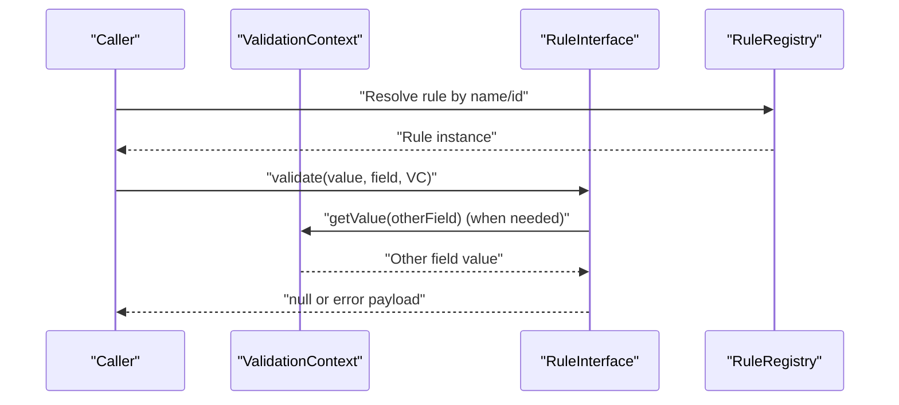
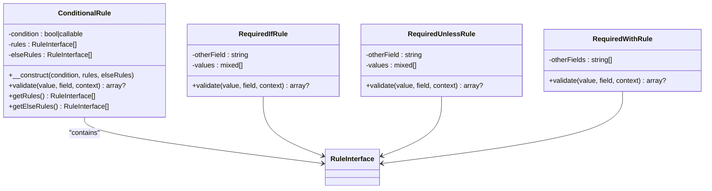
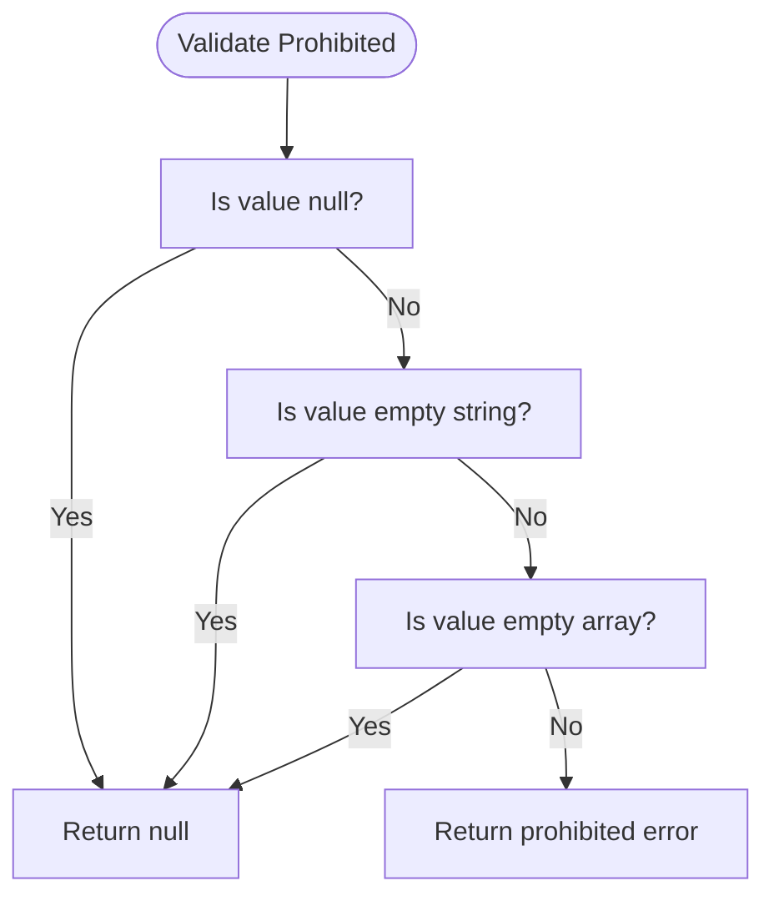
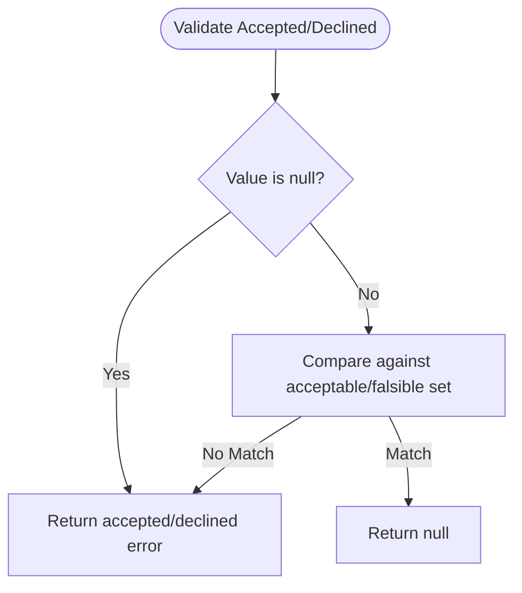
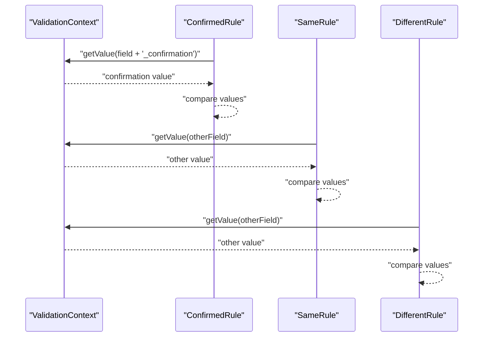
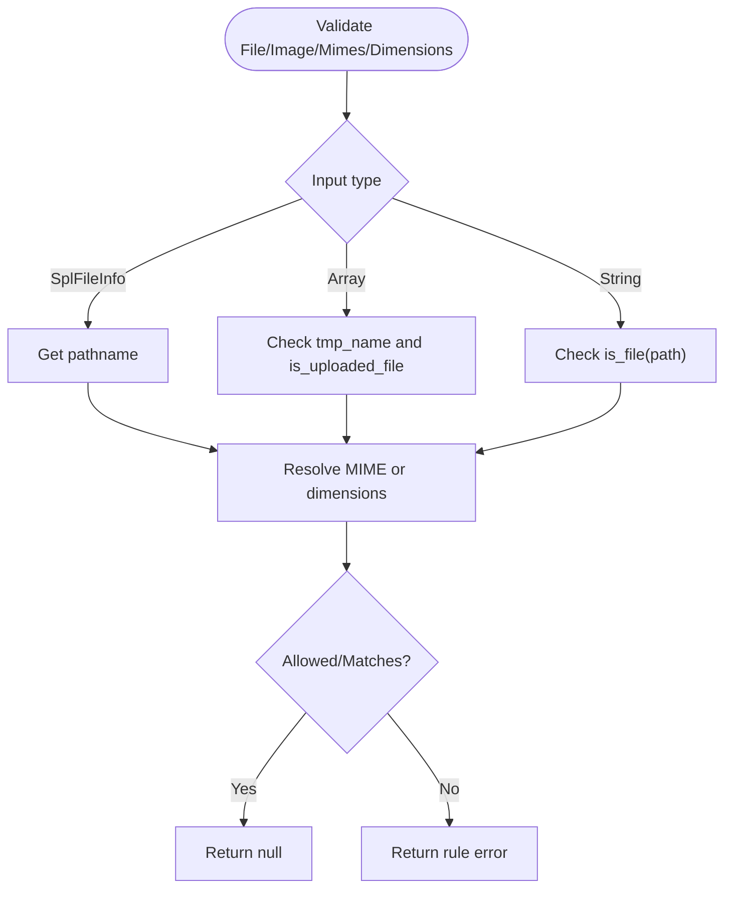
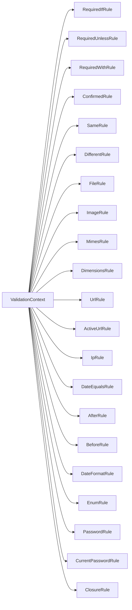

# Conditional and File Rules

<cite>
**Referenced Files in This Document**
- [ConditionalRule.php](file://src/Rules/ConditionalRule.php)
- [RequiredIfRule.php](file://src/Rules/RequiredIfRule.php)
- [RequiredUnlessRule.php](file://src/Rules/RequiredUnlessRule.php)
- [RequiredWithRule.php](file://src/Rules/RequiredWithRule.php)
- [ExcludeRule.php](file://src/Rules/ExcludeRule.php)
- [ProhibitedRule.php](file://src/Rules/ProhibitedRule.php)
- [AcceptedRule.php](file://src/Rules/AcceptedRule.php)
- [DeclinedRule.php](file://src/Rules/DeclinedRule.php)
- [ConfirmedRule.php](file://src/Rules/ConfirmedRule.php)
- [SameRule.php](file://src/Rules/SameRule.php)
- [DifferentRule.php](file://src/Rules/DifferentRule.php)
- [FileRule.php](file://src/Rules/FileRule.php)
- [ImageRule.php](file://src/Rules/ImageRule.php)
- [MimesRule.php](file://src/Rules/MimesRule.php)
- [DimensionsRule.php](file://src/Rules/DimensionsRule.php)
- [ActiveUrlRule.php](file://src/Rules/ActiveUrlRule.php)
- [UrlRule.php](file://src/Rules/UrlRule.php)
- [IpRule.php](file://src/Rules/IpRule.php)
- [DateEqualsRule.php](file://src/Rules/DateEqualsRule.php)
- [AfterRule.php](file://src/Rules/AfterRule.php)
- [BeforeRule.php](file://src/Rules/BeforeRule.php)
- [DateFormatRule.php](file://src/Rules/DateFormatRule.php)
- [EnumRule.php](file://src/Rules/EnumRule.php)
- [PasswordRule.php](file://src/Rules/PasswordRule.php)
- [CurrentPasswordRule.php](file://src/Rules/CurrentPasswordRule.php)
- [ClosureRule.php](file://src/Rules/ClosureRule.php)
- [RuleInterface.php](file://src/Rules/RuleInterface.php)
- [RuleId.php](file://src/Rules/RuleId.php)
- [RuleName.php](file://src/Rules/RuleName.php)
- [RuleRegistry.php](file://src/Rules/RuleRegistry.php)
- [ValidationContext.php](file://src/Execution/ValidationContext.php)
</cite>

## Table of Contents
1. [Introduction](#introduction)
2. [Project Structure](#project-structure)
3. [Core Components](#core-components)
4. [Architecture Overview](#architecture-overview)
5. [Detailed Component Analysis](#detailed-component-analysis)
6. [Dependency Analysis](#dependency-analysis)
7. [Performance Considerations](#performance-considerations)
8. [Troubleshooting Guide](#troubleshooting-guide)
9. [Conclusion](#conclusion)

## Introduction
This document focuses on conditional validation rules, file validation rules, and specialized validation rules implemented in the project. It explains conditional logic for requirement rules (RequiredIfRule, RequiredUnlessRule, RequiredWithRule, etc.), exclusion rules (ExcludeRule, ProhibitedRule), acceptance rules (AcceptedRule, DeclinedRule), confirmation rules (ConfirmedRule, SameRule, DifferentRule), file rules (FileRule, ImageRule, MimesRule, DimensionsRule), web-related rules (ActiveUrlRule, UrlRule, IpRule), date rules (DateEqualsRule, AfterRule, BeforeRule, DateFormatRule), enum rules (EnumRule), password rules (PasswordRule, CurrentPasswordRule), and closure-based validation (ClosureRule). Practical usage scenarios and complex validation workflows are covered to help developers apply these rules effectively.

## Project Structure
The validation rules are organized under the Rules namespace and implement a common interface. Each rule encapsulates a single validation concern and integrates with the ValidationContext to access other fields and runtime data. Rule metadata (names and identifiers) are attached via attributes for registry and messaging support.

```mermaid
graph TB
subgraph "Rules Namespace"
RIF["RequiredIfRule"]
RUN["RequiredUnlessRule"]
RW["RequiredWithRule"]
CR["ConditionalRule"]
ER["ExcludeRule"]
PR["ProhibitedRule"]
AR["AcceptedRule"]
DR["DeclinedRule"]
CFR["ConfirmedRule"]
SR["SameRule"]
DFR["DifferentRule"]
FR["FileRule"]
IMR["ImageRule"]
MR["MimesRule"]
DIR["DimensionsRule"]
AUR["ActiveUrlRule"]
UR["UrlRule"]
IPR["IpRule"]
DER["DateEqualsRule"]
AF["AfterRule"]
BR["BeforeRule"]
DFRule["DateFormatRule"]
ENR["EnumRule"]
PWR["PasswordRule"]
CurrPR["CurrentPasswordRule"]
CLR["ClosureRule"]
end
RI["RuleInterface"]
RN["RuleName"]
RID["RuleId"]
RR["RuleRegistry"]
VC["ValidationContext"]
RIF --> RI
RUN --> RI
RW --> RI
CR --> RI
ER --> RI
PR --> RI
AR --> RI
DR --> RI
CFR --> RI
SR --> RI
DFR --> RI
FR --> RI
IMR --> RI
MR --> RI
DIR --> RI
AUR --> RI
UR --> RI
IPR --> RI
DER --> RI
AF --> RI
BR --> RI
DFRule --> RI
ENR --> RI
PWR --> RI
CurrPR --> RI
CLR --> RI
RN --> RI
RID --> RI
RR --> RI
VC --> RI
```

**Diagram sources**
- [RuleInterface.php](file://src/Rules/RuleInterface.php)
- [RuleName.php](file://src/Rules/RuleName.php)
- [RuleId.php](file://src/Rules/RuleId.php)
- [RuleRegistry.php](file://src/Rules/RuleRegistry.php)
- [ValidationContext.php](file://src/Execution/ValidationContext.php)
- [RequiredIfRule.php](file://src/Rules/RequiredIfRule.php)
- [RequiredUnlessRule.php](file://src/Rules/RequiredUnlessRule.php)
- [RequiredWithRule.php](file://src/Rules/RequiredWithRule.php)
- [ConditionalRule.php](file://src/Rules/ConditionalRule.php)
- [ExcludeRule.php](file://src/Rules/ExcludeRule.php)
- [ProhibitedRule.php](file://src/Rules/ProhibitedRule.php)
- [AcceptedRule.php](file://src/Rules/AcceptedRule.php)
- [DeclinedRule.php](file://src/Rules/DeclinedRule.php)
- [ConfirmedRule.php](file://src/Rules/ConfirmedRule.php)
- [SameRule.php](file://src/Rules/SameRule.php)
- [DifferentRule.php](file://src/Rules/DifferentRule.php)
- [FileRule.php](file://src/Rules/FileRule.php)
- [ImageRule.php](file://src/Rules/ImageRule.php)
- [MimesRule.php](file://src/Rules/MimesRule.php)
- [DimensionsRule.php](file://src/Rules/DimensionsRule.php)
- [ActiveUrlRule.php](file://src/Rules/ActiveUrlRule.php)
- [UrlRule.php](file://src/Rules/UrlRule.php)
- [IpRule.php](file://src/Rules/IpRule.php)
- [DateEqualsRule.php](file://src/Rules/DateEqualsRule.php)
- [AfterRule.php](file://src/Rules/AfterRule.php)
- [BeforeRule.php](file://src/Rules/BeforeRule.php)
- [DateFormatRule.php](file://src/Rules/DateFormatRule.php)
- [EnumRule.php](file://src/Rules/EnumRule.php)
- [PasswordRule.php](file://src/Rules/PasswordRule.php)
- [CurrentPasswordRule.php](file://src/Rules/CurrentPasswordRule.php)
- [ClosureRule.php](file://src/Rules/ClosureRule.php)

**Section sources**
- [RuleInterface.php](file://src/Rules/RuleInterface.php)
- [RuleName.php](file://src/Rules/RuleName.php)
- [RuleId.php](file://src/Rules/RuleId.php)
- [RuleRegistry.php](file://src/Rules/RuleRegistry.php)
- [ValidationContext.php](file://src/Execution/ValidationContext.php)

## Core Components
- RuleInterface defines the contract for all rules, including validation entry points and metadata attachment via attributes.
- RuleName and RuleId provide standardized names and identifiers for rules used by registries and message systems.
- RuleRegistry manages rule discovery and instantiation.
- ValidationContext exposes field values and contextual helpers during validation.

Key responsibilities:
- ConditionalRule orchestrates conditional execution of nested rules based on a condition (boolean or callable).
- Requirement rules evaluate presence/absence conditions against related fields.
- Exclusion and prohibition rules enforce field absence or emptiness.
- Acceptance and decline rules validate boolean-like values.
- Confirmation rules compare field values with their confirmation counterparts.
- File rules validate uploaded/file inputs and associated metadata (MIME, dimensions).
- Web-related rules validate URLs and IP addresses.
- Date rules validate temporal equality and ordering.
- Enum, password, and closure rules encapsulate domain-specific checks.

**Section sources**
- [RuleInterface.php](file://src/Rules/RuleInterface.php)
- [RuleName.php](file://src/Rules/RuleName.php)
- [RuleId.php](file://src/Rules/RuleId.php)
- [RuleRegistry.php](file://src/Rules/RuleRegistry.php)
- [ValidationContext.php](file://src/Execution/ValidationContext.php)

## Architecture Overview
The validation pipeline resolves rules, evaluates conditions, and produces structured error messages. Rules receive the current field value, field name, and ValidationContext to access other fields and runtime data.

**Diagram sources**
- [RuleRegistry.php](file://src/Rules/RuleRegistry.php)
- [ValidationContext.php](file://src/Execution/ValidationContext.php)
- [RuleInterface.php](file://src/Rules/RuleInterface.php)

## Detailed Component Analysis

### Conditional Rules
ConditionalRule wraps two sets of rules: one to apply when the condition is true, another when false. The condition can be a boolean or a callable receiving the data and context.

**Diagram sources**
- [ConditionalRule.php](file://src/Rules/ConditionalRule.php)
- [RequiredIfRule.php](file://src/Rules/RequiredIfRule.php)
- [RequiredUnlessRule.php](file://src/Rules/RequiredUnlessRule.php)
- [RequiredWithRule.php](file://src/Rules/RequiredWithRule.php)

Practical usage examples:
- Require a field only if another equals specific values (RequiredIfRule).
- Require a field unless another equals specific values (RequiredUnlessRule).
- Require a field if any of several related fields are present (RequiredWithRule).
- Compose complex conditional branches using ConditionalRule with nested rules.

**Section sources**
- [ConditionalRule.php](file://src/Rules/ConditionalRule.php)
- [RequiredIfRule.php](file://src/Rules/RequiredIfRule.php)
- [RequiredUnlessRule.php](file://src/Rules/RequiredUnlessRule.php)
- [RequiredWithRule.php](file://src/Rules/RequiredWithRule.php)

### Exclusion and Prohibition Rules
- ExcludeRule acts as a marker and does not produce errors itself.
- ProhibitedRule ensures the field is absent or empty.

**Diagram sources**
- [ProhibitedRule.php](file://src/Rules/ProhibitedRule.php)

**Section sources**
- [ExcludeRule.php](file://src/Rules/ExcludeRule.php)
- [ProhibitedRule.php](file://src/Rules/ProhibitedRule.php)

### Acceptance and Decline Rules
- AcceptedRule accepts a set of truthy values.
- DeclinedRule accepts a set of falsy values.

**Diagram sources**
- [AcceptedRule.php](file://src/Rules/AcceptedRule.php)
- [DeclinedRule.php](file://src/Rules/DeclinedRule.php)

**Section sources**
- [AcceptedRule.php](file://src/Rules/AcceptedRule.php)
- [DeclinedRule.php](file://src/Rules/DeclinedRule.php)

### Confirmation Rules
- ConfirmedRule compares a field with its confirmation counterpart (field + _confirmation).
- SameRule compares a field with another named field.
- DifferentRule ensures two fields are not equal.

**Diagram sources**
- [ConfirmedRule.php](file://src/Rules/ConfirmedRule.php)
- [SameRule.php](file://src/Rules/SameRule.php)
- [DifferentRule.php](file://src/Rules/DifferentRule.php)

**Section sources**
- [ConfirmedRule.php](file://src/Rules/ConfirmedRule.php)
- [SameRule.php](file://src/Rules/SameRule.php)
- [DifferentRule.php](file://src/Rules/DifferentRule.php)

### File Validation Rules
- FileRule validates that the input represents an existing file (supports SplFileInfo, uploaded file arrays, or string paths).
- ImageRule validates image MIME types and rejects non-images.
- MimesRule validates MIME types against a configured allowlist, normalizing extensions to MIMEs.
- DimensionsRule validates image dimensions and ratios using local file paths.

**Diagram sources**
- [FileRule.php](file://src/Rules/FileRule.php)
- [ImageRule.php](file://src/Rules/ImageRule.php)
- [MimesRule.php](file://src/Rules/MimesRule.php)
- [DimensionsRule.php](file://src/Rules/DimensionsRule.php)

**Section sources**
- [FileRule.php](file://src/Rules/FileRule.php)
- [ImageRule.php](file://src/Rules/ImageRule.php)
- [MimesRule.php](file://src/Rules/MimesRule.php)
- [DimensionsRule.php](file://src/Rules/DimensionsRule.php)

### Web-Related Rules
- ActiveUrlRule validates URLs that resolve to active hosts.
- UrlRule validates URL syntax.
- IpRule validates IP address formats.

Implementation notes:
- These rules rely on underlying validation mechanisms to check URL/IP validity. They integrate with the same ValidationContext and RuleInterface contract.

**Section sources**
- [ActiveUrlRule.php](file://src/Rules/ActiveUrlRule.php)
- [UrlRule.php](file://src/Rules/UrlRule.php)
- [IpRule.php](file://src/Rules/IpRule.php)

### Date Rules
- DateEqualsRule validates exact date equality.
- AfterRule validates that a date is after another.
- BeforeRule validates that a date is before another.
- DateFormatRule validates date format strings.

Implementation notes:
- Date rules compare parsed dates or formatted strings according to configured formats and constraints.

**Section sources**
- [DateEqualsRule.php](file://src/Rules/DateEqualsRule.php)
- [AfterRule.php](file://src/Rules/AfterRule.php)
- [BeforeRule.php](file://src/Rules/BeforeRule.php)
- [DateFormatRule.php](file://src/Rules/DateFormatRule.php)

### Enum, Password, and Closure Rules
- EnumRule validates values against a predefined set.
- PasswordRule enforces password policies.
- CurrentPasswordRule verifies the current password against stored credentials.
- ClosureRule allows custom validation logic via closures.

Implementation notes:
- These rules encapsulate domain-specific checks and leverage ValidationContext for data access.

**Section sources**
- [EnumRule.php](file://src/Rules/EnumRule.php)
- [PasswordRule.php](file://src/Rules/PasswordRule.php)
- [CurrentPasswordRule.php](file://src/Rules/CurrentPasswordRule.php)
- [ClosureRule.php](file://src/Rules/ClosureRule.php)

## Dependency Analysis
Rules depend on:
- RuleInterface for the validation contract.
- RuleName and RuleId for identification and registry mapping.
- ValidationContext for cross-field access and runtime data.
- RuleRegistry for rule resolution and instantiation.

**Diagram sources**
- [ValidationContext.php](file://src/Execution/ValidationContext.php)
- [RequiredIfRule.php](file://src/Rules/RequiredIfRule.php)
- [RequiredUnlessRule.php](file://src/Rules/RequiredUnlessRule.php)
- [RequiredWithRule.php](file://src/Rules/RequiredWithRule.php)
- [ConfirmedRule.php](file://src/Rules/ConfirmedRule.php)
- [SameRule.php](file://src/Rules/SameRule.php)
- [DifferentRule.php](file://src/Rules/DifferentRule.php)
- [FileRule.php](file://src/Rules/FileRule.php)
- [ImageRule.php](file://src/Rules/ImageRule.php)
- [MimesRule.php](file://src/Rules/MimesRule.php)
- [DimensionsRule.php](file://src/Rules/DimensionsRule.php)
- [UrlRule.php](file://src/Rules/UrlRule.php)
- [ActiveUrlRule.php](file://src/Rules/ActiveUrlRule.php)
- [IpRule.php](file://src/Rules/IpRule.php)
- [DateEqualsRule.php](file://src/Rules/DateEqualsRule.php)
- [AfterRule.php](file://src/Rules/AfterRule.php)
- [BeforeRule.php](file://src/Rules/BeforeRule.php)
- [DateFormatRule.php](file://src/Rules/DateFormatRule.php)
- [EnumRule.php](file://src/Rules/EnumRule.php)
- [PasswordRule.php](file://src/Rules/PasswordRule.php)
- [CurrentPasswordRule.php](file://src/Rules/CurrentPasswordRule.php)
- [ClosureRule.php](file://src/Rules/ClosureRule.php)

**Section sources**
- [RuleInterface.php](file://src/Rules/RuleInterface.php)
- [RuleName.php](file://src/Rules/RuleName.php)
- [RuleId.php](file://src/Rules/RuleId.php)
- [RuleRegistry.php](file://src/Rules/RuleRegistry.php)
- [ValidationContext.php](file://src/Execution/ValidationContext.php)

## Performance Considerations
- Prefer early exits in rules to minimize work (e.g., null checks, empties).
- Normalize inputs once (e.g., MIME normalization in MimesRule) to avoid repeated conversions.
- Use efficient comparisons (strict equality) to reduce type coercion overhead.
- For file-based rules, avoid redundant filesystem calls by reusing resolved paths or MIME types.
- Keep conditional branches shallow to improve readability and reduce branching overhead.

## Troubleshooting Guide
Common issues and resolutions:
- Unexpected nulls: Ensure ValidationContext.getValue returns the expected field name and casing.
- File validation failures: Verify uploaded file arrays include valid tmp_name and that is_uploaded_file passes.
- MIME mismatches: Confirm allowed MIME lists include normalized types; remember extension-to-MIME normalization in MimesRule.
- Dimension validation: Ensure image files are readable and getimagesize succeeds; check ratio parsing accuracy.
- Confirmation mismatches: Confirm the confirmation field name follows the expected pattern (field + _confirmation).
- Date comparisons: Validate date formats and timezone handling to prevent off-by-one errors.

**Section sources**
- [FileRule.php](file://src/Rules/FileRule.php)
- [ImageRule.php](file://src/Rules/ImageRule.php)
- [MimesRule.php](file://src/Rules/MimesRule.php)
- [DimensionsRule.php](file://src/Rules/DimensionsRule.php)
- [ConfirmedRule.php](file://src/Rules/ConfirmedRule.php)
- [DateFormatRule.php](file://src/Rules/DateFormatRule.php)

## Conclusion
The conditional and file validation rules provide a robust foundation for building complex validation scenarios. By composing conditional rules, leveraging file and web-related validators, and applying specialized rules for enums, passwords, and closures, developers can model intricate business constraints efficiently. Proper use of ValidationContext and adherence to rule contracts ensure predictable behavior and maintainable validation logic.