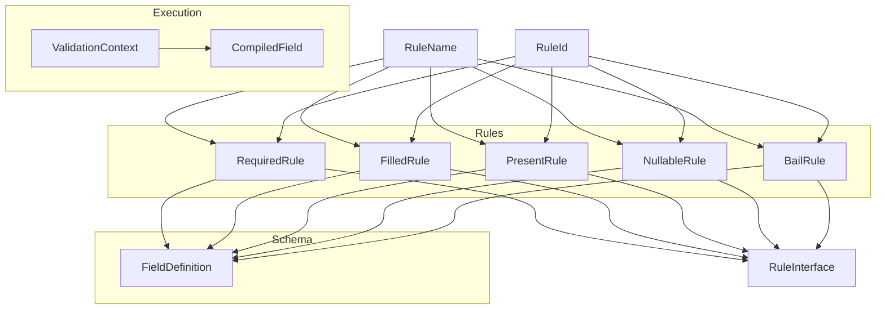
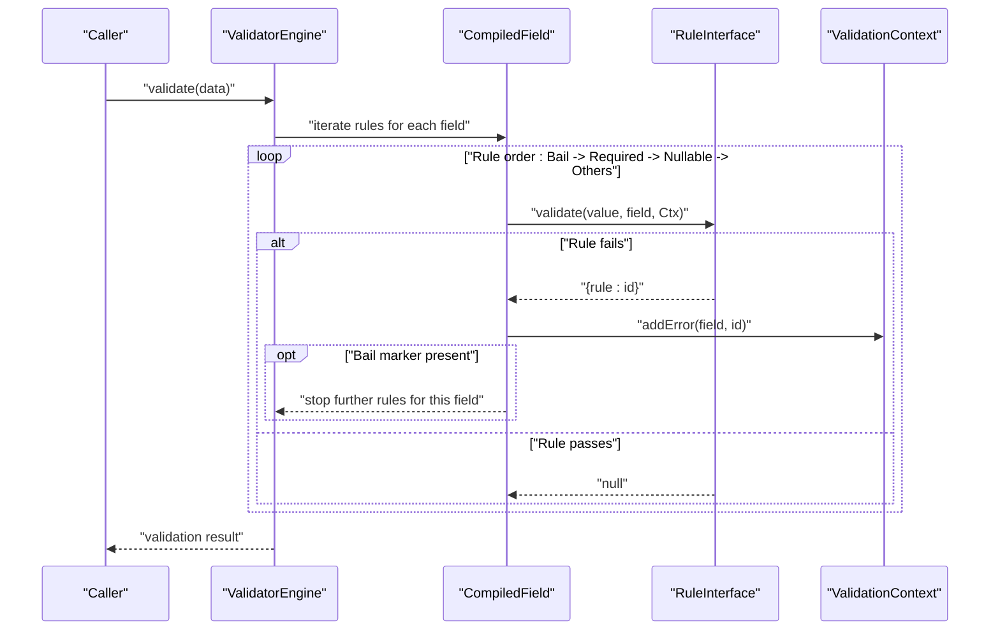
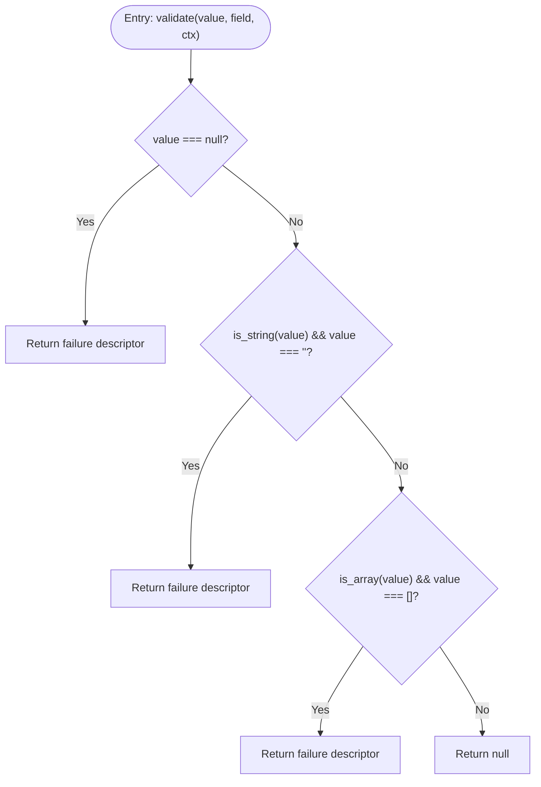
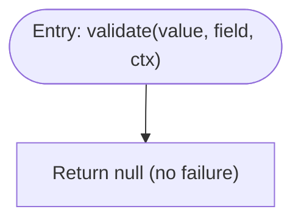
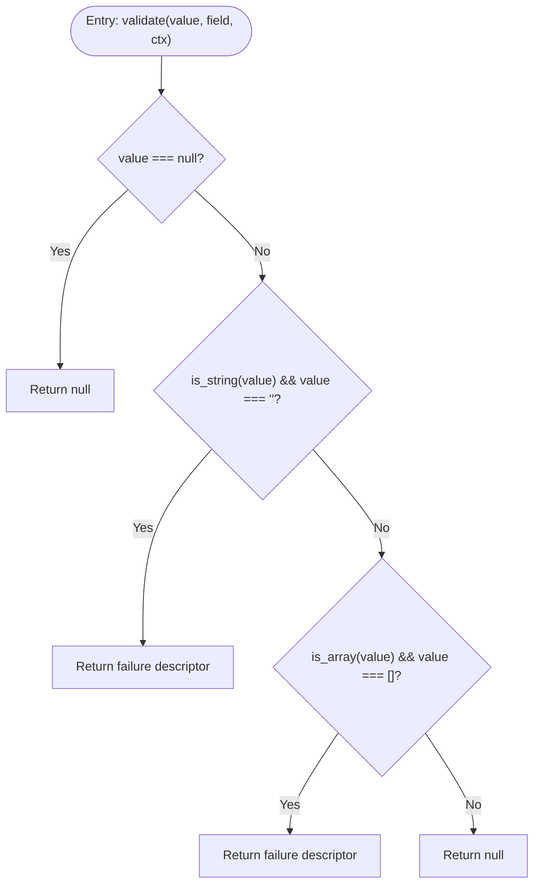
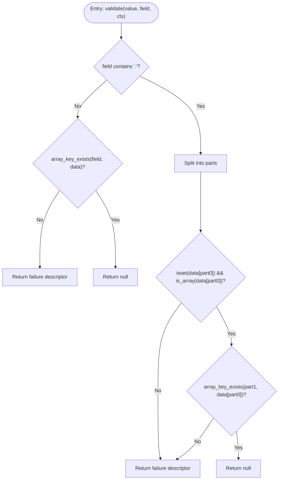
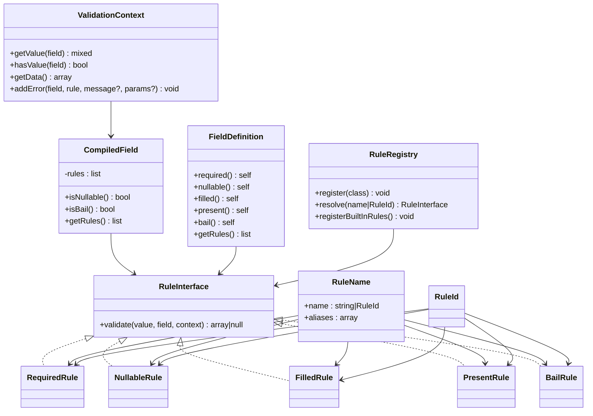

# Core Rules

<cite>
**Referenced Files in This Document**
- [RequiredRule.php](file://src/Rules/RequiredRule.php)
- [NullableRule.php](file://src/Rules/NullableRule.php)
- [FilledRule.php](file://src/Rules/FilledRule.php)
- [PresentRule.php](file://src/Rules/PresentRule.php)
- [BailRule.php](file://src/Rules/BailRule.php)
- [RuleInterface.php](file://src/Rules/RuleInterface.php)
- [RuleId.php](file://src/Rules/RuleId.php)
- [RuleName.php](file://src/Rules/RuleName.php)
- [ValidationContext.php](file://src/Execution/ValidationContext.php)
- [CompiledField.php](file://src/Execution/CompiledField.php)
- [RuleRegistry.php](file://src/Rules/RuleRegistry.php)
- [FieldDefinition.php](file://src/Schema/FieldDefinition.php)
</cite>

## Table of Contents
1. [Introduction](#introduction)
2. [Project Structure](#project-structure)
3. [Core Components](#core-components)
4. [Architecture Overview](#architecture-overview)
5. [Detailed Component Analysis](#detailed-component-analysis)
6. [Dependency Analysis](#dependency-analysis)
7. [Performance Considerations](#performance-considerations)
8. [Troubleshooting Guide](#troubleshooting-guide)
9. [Conclusion](#conclusion)

## Introduction
This document explains the five foundational validation rules that underpin form and data validation in the system: RequiredRule, NullableRule, FilledRule, PresentRule, and BailRule. It covers rule syntax, parameter requirements, validation logic, execution order, and practical usage patterns. These rules are essential building blocks for robust form validation scenarios, ensuring mandatory fields, presence checks, emptiness constraints, and early termination on first failure.

## Project Structure
These core rules live under the Rules namespace and implement a shared interface. They integrate with the execution engine via ValidationContext and CompiledField, and are registered centrally through RuleRegistry. FieldDefinition exposes fluent methods to attach these rules to fields during schema construction.

**Diagram sources**
- [RequiredRule.php](file://src/Rules/RequiredRule.php#L9-L28)
- [FilledRule.php](file://src/Rules/FilledRule.php#L12-L33)
- [PresentRule.php](file://src/Rules/PresentRule.php#L12-L39)
- [NullableRule.php](file://src/Rules/NullableRule.php#L9-L17)
- [BailRule.php](file://src/Rules/BailRule.php#L12-L19)
- [RuleInterface.php](file://src/Rules/RuleInterface.php#L9-L15)
- [RuleName.php](file://src/Rules/RuleName.php#L9-L17)
- [RuleId.php](file://src/Rules/RuleId.php#L10-L113)
- [ValidationContext.php](file://src/Execution/ValidationContext.php#L7-L97)
- [CompiledField.php](file://src/Execution/CompiledField.php#L10-L176)
- [FieldDefinition.php](file://src/Schema/FieldDefinition.php#L9-L657)

**Section sources**
- [RequiredRule.php](file://src/Rules/RequiredRule.php#L1-L29)
- [NullableRule.php](file://src/Rules/NullableRule.php#L1-L18)
- [FilledRule.php](file://src/Rules/FilledRule.php#L1-L34)
- [PresentRule.php](file://src/Rules/PresentRule.php#L1-L40)
- [BailRule.php](file://src/Rules/BailRule.php#L1-L20)
- [RuleInterface.php](file://src/Rules/RuleInterface.php#L1-L16)
- [RuleId.php](file://src/Rules/RuleId.php#L1-L114)
- [RuleName.php](file://src/Rules/RuleName.php#L1-L18)
- [ValidationContext.php](file://src/Execution/ValidationContext.php#L1-L98)
- [CompiledField.php](file://src/Execution/CompiledField.php#L1-L177)
- [RuleRegistry.php](file://src/Rules/RuleRegistry.php#L1-L302)
- [FieldDefinition.php](file://src/Schema/FieldDefinition.php#L1-L658)

## Core Components
- RequiredRule: Enforces that a value is not null, not an empty string, and not an empty array. Returns a failure descriptor when violated.
- NullableRule: Marks a field as nullable; it never fails by itself and short-circuits other rules when present.
- FilledRule: Requires a field to be present and non-empty; allows null values to pass.
- PresentRule: Ensures a field exists in the input data (supports dot notation for nested keys).
- BailRule: Acts as a marker to stop further validation after the first failure; it does not fail by itself.

Each rule implements the shared RuleInterface and is annotated with RuleName and mapped to a RuleId for registration and lookup.

**Section sources**
- [RequiredRule.php](file://src/Rules/RequiredRule.php#L12-L27)
- [NullableRule.php](file://src/Rules/NullableRule.php#L12-L16)
- [FilledRule.php](file://src/Rules/FilledRule.php#L15-L32)
- [PresentRule.php](file://src/Rules/PresentRule.php#L15-L38)
- [BailRule.php](file://src/Rules/BailRule.php#L15-L18)
- [RuleInterface.php](file://src/Rules/RuleInterface.php#L11-L14)
- [RuleName.php](file://src/Rules/RuleName.php#L12-L16)
- [RuleId.php](file://src/Rules/RuleId.php#L22-L27)

## Architecture Overview
The execution pipeline prioritizes marker rules (Bail, Required, Nullable) and applies other rules afterward. ValidationContext provides access to input data and error collection. RuleRegistry resolves rule names to classes and registers built-in rules. FieldDefinition attaches rules to fields during schema definition.

**Diagram sources**
- [CompiledField.php](file://src/Execution/CompiledField.php#L94-L113)
- [ValidationContext.php](file://src/Execution/ValidationContext.php#L93-L96)
- [RuleInterface.php](file://src/Rules/RuleInterface.php#L11-L14)

## Detailed Component Analysis

### RequiredRule
- Purpose: Ensures a field is not null, not an empty string, and not an empty array.
- Syntax: Fluent method on FieldDefinition: required().
- Parameters: None.
- Validation logic:
  - If value is null → fail.
  - If value is an empty string → fail.
  - If value is an empty array → fail.
  - Otherwise → pass.
- Practical usage:
  - Forms requiring non-empty selections, non-blank text inputs, and non-empty arrays.
  - Commonly combined with other type rules (e.g., required()->string()).

**Diagram sources**
- [RequiredRule.php](file://src/Rules/RequiredRule.php#L12-L27)

**Section sources**
- [RequiredRule.php](file://src/Rules/RequiredRule.php#L12-L27)
- [FieldDefinition.php](file://src/Schema/FieldDefinition.php#L24-L28)

### NullableRule
- Purpose: Marks a field as allowed to be null; never fails by itself.
- Syntax: Fluent method on FieldDefinition: nullable().
- Parameters: None.
- Validation logic: Always returns null (no failure).
- Behavior: Deduplicated and reordered to appear before other rules; short-circuits other rules when present.
- Practical usage:
  - Optional fields that may legitimately be null.
  - Often paired with RequiredRule to express “required unless nullable.”

**Diagram sources**
- [NullableRule.php](file://src/Rules/NullableRule.php#L12-L16)

**Section sources**
- [NullableRule.php](file://src/Rules/NullableRule.php#L12-L16)
- [CompiledField.php](file://src/Execution/CompiledField.php#L66-L71)
- [FieldDefinition.php](file://src/Schema/FieldDefinition.php#L30-L34)

### FilledRule
- Purpose: Requires a field to be present and non-empty; null values pass.
- Syntax: Fluent method on FieldDefinition: filled().
- Parameters: None.
- Validation logic:
  - If value is null → pass.
  - If value is empty string → fail.
  - If value is empty array → fail.
  - Otherwise → pass.
- Practical usage:
  - Fields that must not be blank when present (e.g., comments, descriptions).
  - Complements RequiredRule when you want to enforce presence and non-emptiness.

**Diagram sources**
- [FilledRule.php](file://src/Rules/FilledRule.php#L15-L32)

**Section sources**
- [FilledRule.php](file://src/Rules/FilledRule.php#L15-L32)
- [FieldDefinition.php](file://src/Schema/FieldDefinition.php#L508-L512)

### PresentRule
- Purpose: Ensures a field is present in the input data; supports nested fields via dot notation.
- Syntax: Fluent method on FieldDefinition: present().
- Parameters: None.
- Validation logic:
  - For simple keys: checks array_key_exists in top-level data.
  - For nested keys (parent.child): verifies parent exists and is an array, then checks child key.
  - If absent → fail; otherwise → pass.
- Practical usage:
  - Ensuring optional keys are provided when needed.
  - Useful for conditional logic and nested payload validation.

**Diagram sources**
- [PresentRule.php](file://src/Rules/PresentRule.php#L15-L38)
- [ValidationContext.php](file://src/Execution/ValidationContext.php#L17-L38)

**Section sources**
- [PresentRule.php](file://src/Rules/PresentRule.php#L15-L38)
- [FieldDefinition.php](file://src/Schema/FieldDefinition.php#L502-L506)

### BailRule
- Purpose: Marker rule to stop validation on the first failure for a field.
- Syntax: Fluent method on FieldDefinition: bail().
- Parameters: None.
- Validation logic: Always returns null (no failure).
- Behavior: Deduplicated and reordered to the front; when present, triggers early termination after the first failing rule.
- Practical usage:
  - Performance optimization to avoid unnecessary validations.
  - Prevent cascading errors for expensive downstream rules.

**Diagram sources**
- [BailRule.php](file://src/Rules/BailRule.php#L15-L18)

**Section sources**
- [BailRule.php](file://src/Rules/BailRule.php#L15-L18)
- [CompiledField.php](file://src/Execution/CompiledField.php#L72-L77)
- [FieldDefinition.php](file://src/Schema/FieldDefinition.php#L36-L40)

## Dependency Analysis
- RuleInterface defines the contract for all rules.
- RuleName and RuleId annotate and identify rules for registration and resolution.
- RuleRegistry registers built-in rules and resolves names/aliases to classes.
- CompiledField reorders and deduplicates marker rules (Bail, Required, Nullable) and applies other rules.
- ValidationContext supplies input data and collects errors.
- FieldDefinition attaches rules to fields during schema construction.

**Diagram sources**
- [RuleInterface.php](file://src/Rules/RuleInterface.php#L9-L15)
- [RuleName.php](file://src/Rules/RuleName.php#L9-L17)
- [RuleId.php](file://src/Rules/RuleId.php#L10-L113)
- [RequiredRule.php](file://src/Rules/RequiredRule.php#L9-L28)
- [NullableRule.php](file://src/Rules/NullableRule.php#L9-L17)
- [FilledRule.php](file://src/Rules/FilledRule.php#L12-L33)
- [PresentRule.php](file://src/Rules/PresentRule.php#L12-L39)
- [BailRule.php](file://src/Rules/BailRule.php#L12-L19)
- [ValidationContext.php](file://src/Execution/ValidationContext.php#L7-L97)
- [CompiledField.php](file://src/Execution/CompiledField.php#L10-L176)
- [RuleRegistry.php](file://src/Rules/RuleRegistry.php#L14-L301)
- [FieldDefinition.php](file://src/Schema/FieldDefinition.php#L9-L657)

**Section sources**
- [RuleInterface.php](file://src/Rules/RuleInterface.php#L9-L15)
- [RuleName.php](file://src/Rules/RuleName.php#L9-L17)
- [RuleId.php](file://src/Rules/RuleId.php#L10-L113)
- [RuleRegistry.php](file://src/Rules/RuleRegistry.php#L195-L300)
- [CompiledField.php](file://src/Execution/CompiledField.php#L50-L113)
- [ValidationContext.php](file://src/Execution/ValidationContext.php#L17-L96)
- [FieldDefinition.php](file://src/Schema/FieldDefinition.php#L24-L40)

## Performance Considerations
- Early termination: Using bail reduces total rule evaluations per field by stopping after the first failure.
- Rule ordering: Required and Nullable are deduplicated and placed before other rules to minimize redundant checks.
- Null handling: Nullable short-circuits downstream validations, avoiding unnecessary work for null values.
- Complexity:
  - RequiredRule: O(1) checks for null, empty string, and empty array.
  - FilledRule: O(1) checks for null, empty string, and empty array.
  - PresentRule: O(1) for top-level keys; nested access is O(1) with safe guards.
  - BailRule: O(1); acts as a flag to stop further rule evaluation.
- Practical tips:
  - Place bail at the end of the rule list for a field to maximize benefit.
  - Combine required with type rules to fail fast on wrong types.
  - Use nullable to avoid validating null values with expensive rules.

[No sources needed since this section provides general guidance]

## Troubleshooting Guide
- Unexpected pass with null:
  - If a field is null and should be required, ensure RequiredRule is present. NullableRule alone allows null.
- Empty string or array still passing:
  - Confirm RequiredRule is used to reject empty values. FilledRule allows null but rejects empty string/array.
- Nested field not found:
  - Verify dot notation path and that parent is an array. PresentRule will fail if parent is missing or not an array.
- bail seems ineffective:
  - Ensure bail is attached to the field and appears before other rules. CompiledField deduplicates and reorders markers accordingly.

**Section sources**
- [RequiredRule.php](file://src/Rules/RequiredRule.php#L12-L27)
- [FilledRule.php](file://src/Rules/FilledRule.php#L15-L32)
- [PresentRule.php](file://src/Rules/PresentRule.php#L15-L38)
- [NullableRule.php](file://src/Rules/NullableRule.php#L12-L16)
- [BailRule.php](file://src/Rules/BailRule.php#L15-L18)
- [CompiledField.php](file://src/Execution/CompiledField.php#L60-L113)

## Conclusion
RequiredRule, NullableRule, FilledRule, PresentRule, and BailRule form the backbone of validation logic. Together they ensure mandatory fields, handle nullability, enforce non-empty constraints, confirm presence, and optimize performance via early termination. Their design emphasizes clarity, composability, and predictable execution order, making them ideal for robust form and data validation workflows.