# Size and Comparison Rules

<cite>
**Referenced Files in This Document**
- [BetweenRule.php](file://src/Rules/BetweenRule.php)
- [MinRule.php](file://src/Rules/MinRule.php)
- [MaxRule.php](file://src/Rules/MaxRule.php)
- [SizeRule.php](file://src/Rules/SizeRule.php)
- [DigitsRule.php](file://src/Rules/DigitsRule.php)
- [DigitsBetweenRule.php](file://src/Rules/DigitsBetweenRule.php)
- [GreaterThanRule.php](file://src/Rules/GreaterThanRule.php)
- [GreaterThanOrEqualRule.php](file://src/Rules/GreaterThanOrEqualRule.php)
- [LessThanRule.php](file://src/Rules/LessThanRule.php)
- [LessThanOrEqualRule.php](file://src/Rules/LessThanOrEqualRule.php)
- [MultipleOfRule.php](file://src/Rules/MultipleOfRule.php)
- [DecimalRule.php](file://src/Rules/DecimalRule.php)
- [MinFileSizeRule.php](file://src/Rules/MinFileSizeRule.php)
- [MaxFileSizeRule.php](file://src/Rules/MaxFileSizeRule.php)
- [RuleInterface.php](file://src/Rules/RuleInterface.php)
- [RuleId.php](file://src/Rules/RuleId.php)
- [ValidationContext.php](file://src/Execution/ValidationContext.php)
</cite>

## Table of Contents
1. [Introduction](#introduction)
2. [Project Structure](#project-structure)
3. [Core Components](#core-components)
4. [Architecture Overview](#architecture-overview)
5. [Detailed Component Analysis](#detailed-component-analysis)
6. [Dependency Analysis](#dependency-analysis)
7. [Performance Considerations](#performance-considerations)
8. [Troubleshooting Guide](#troubleshooting-guide)
9. [Conclusion](#conclusion)

## Introduction
This document explains the size and comparison validation rules implemented in the validation library. It covers:
- Size-based rules: BetweenRule, MinRule, MaxRule, SizeRule
- Digit-count rules: DigitsRule, DigitsBetweenRule
- Comparison rules: GreaterThan, GreaterThanOrEqual, LessThan, LessThanOrEqual
- Divisibility rule: MultipleOfRule
- Precision rule: DecimalRule
- File size rules: MinFileSizeRule, MaxFileSizeRule

It details boundary checks, numeric comparison logic, precision handling, and practical usage scenarios in form validation and data processing.

## Project Structure
The validation rules are implemented as individual classes under the Rules namespace. Each rule implements a shared interface and participates in a unified validation pipeline via a context object.

```mermaid
graph TB
subgraph "Rules Namespace"
BR["BetweenRule"]
MR["MinRule"]
XR["MaxRule"]
SR["SizeRule"]
DR["DigitsRule"]
DBR["DigitsBetweenRule"]
GTR["GreaterThanRule"]
GTER["GreaterThanOrEqualRule"]
LTR["LessThanRule"]
LTER["LessThanOrEqualRule"]
MOR["MultipleOfRule"]
DER["DecimalRule"]
MSR["MinFileSizeRule"]
MSR2["MaxFileSizeRule"]
end
RI["RuleInterface"]
RID["RuleId"]
VC["ValidationContext"]
BR --> RI
MR --> RI
XR --> RI
SR --> RI
DR --> RI
DBR --> RI
GTR --> RI
GTER --> RI
LTR --> RI
LTER --> RI
MOR --> RI
DER --> RI
MSR --> RI
MSR2 --> RI
BR --> RID
MR --> RID
XR --> RID
SR --> RID
DR --> RID
DBR --> RID
GTR --> RID
GTER --> RID
LTR --> RID
LTER --> RID
MOR --> RID
DER --> RID
MSR --> RID
MSR2 --> RID
BR --> VC
MR --> VC
XR --> VC
SR --> VC
DR --> VC
DBR --> VC
GTR --> VC
GTER --> VC
LTR --> VC
LTER --> VC
MOR --> VC
DER --> VC
MSR --> VC
MSR2 --> VC
```

**Diagram sources**
- [BetweenRule.php](file://src/Rules/BetweenRule.php#L1-L61)
- [MinRule.php](file://src/Rules/MinRule.php#L1-L48)
- [MaxRule.php](file://src/Rules/MaxRule.php#L1-L48)
- [SizeRule.php](file://src/Rules/SizeRule.php#L1-L60)
- [DigitsRule.php](file://src/Rules/DigitsRule.php#L1-L46)
- [DigitsBetweenRule.php](file://src/Rules/DigitsBetweenRule.php#L1-L50)
- [GreaterThanRule.php](file://src/Rules/GreaterThanRule.php#L1-L67)
- [GreaterThanOrEqualRule.php](file://src/Rules/GreaterThanOrEqualRule.php#L1-L67)
- [LessThanRule.php](file://src/Rules/LessThanRule.php#L1-L67)
- [LessThanOrEqualRule.php](file://src/Rules/LessThanOrEqualRule.php#L1-L67)
- [MultipleOfRule.php](file://src/Rules/MultipleOfRule.php#L1-L40)
- [DecimalRule.php](file://src/Rules/DecimalRule.php#L1-L53)
- [MinFileSizeRule.php](file://src/Rules/MinFileSizeRule.php#L1-L52)
- [MaxFileSizeRule.php](file://src/Rules/MaxFileSizeRule.php#L1-L75)
- [RuleInterface.php](file://src/Rules/RuleInterface.php#L1-L16)
- [RuleId.php](file://src/Rules/RuleId.php#L1-L114)
- [ValidationContext.php](file://src/Execution/ValidationContext.php)

**Section sources**
- [RuleInterface.php](file://src/Rules/RuleInterface.php#L1-L16)
- [RuleId.php](file://src/Rules/RuleId.php#L1-L114)

## Core Components
- RuleInterface defines the contract for all rules: a validate method that receives the field value, field name, and validation context, returning either null (pass) or an error payload.
- RuleId enumerates built-in rule identifiers used by attributes like #[RuleName] on rule classes.
- ValidationContext provides access to other field values required by comparison rules.

Key responsibilities:
- Size-based rules compute sizes differently depending on value type (numeric, string length, array count).
- Comparison rules compare against another field’s value using numeric, string length, or array count semantics.
- Precision rules parse numeric strings to validate decimal places.
- File size rules resolve file paths and sizes in kilobytes.

**Section sources**
- [RuleInterface.php](file://src/Rules/RuleInterface.php#L9-L15)
- [RuleId.php](file://src/Rules/RuleId.php#L10-L114)
- [ValidationContext.php](file://src/Execution/ValidationContext.php)

## Architecture Overview
Each rule follows a consistent pattern:
- Constructor stores parameters (bounds, sizes, factors).
- validate handles null values, determines applicable size/comparison logic per type, and returns an error payload on failure.

```mermaid
classDiagram
class RuleInterface {
+validate(value, field, context) array|null
}
class ValidationContext {
+getValue(name) mixed
}
class BetweenRule {
-min
-max
+validate(value, field, context) array|null
-getSize(value) float|int
}
class MinRule {
-min
+validate(value, field, context) array|null
}
class MaxRule {
-max
+validate(value, field, context) array|null
}
class SizeRule {
-size
+validate(value, field, context) array|null
-getSize(value) float|int
}
class DigitsRule {
-length
+validate(value, field, context) array|null
}
class DigitsBetweenRule {
-min
-max
+validate(value, field, context) array|null
}
class GreaterThanRule {
-otherField
+validate(value, field, context) array|null
}
class GreaterThanOrEqualRule {
-otherField
+validate(value, field, context) array|null
}
class LessThanRule {
-otherField
+validate(value, field, context) array|null
}
class LessThanOrEqualRule {
-otherField
+validate(value, field, context) array|null
}
class MultipleOfRule {
-factor
+validate(value, field, context) array|null
}
class DecimalRule {
-min
-max
+validate(value, field, context) array|null
}
class MinFileSizeRule {
-min
+validate(value, field, context) array|null
-getPath(value) string|null
}
class MaxFileSizeRule {
-maxKilobytes
+validate(value, field, context) array|null
-getFileSizeInKilobytes(value) float|null
-getFileSize(value) int|null
}
RuleInterface <|.. BetweenRule
RuleInterface <|.. MinRule
RuleInterface <|.. MaxRule
RuleInterface <|.. SizeRule
RuleInterface <|.. DigitsRule
RuleInterface <|.. DigitsBetweenRule
RuleInterface <|.. GreaterThanRule
RuleInterface <|.. GreaterThanOrEqualRule
RuleInterface <|.. LessThanRule
RuleInterface <|.. LessThanOrEqualRule
RuleInterface <|.. MultipleOfRule
RuleInterface <|.. DecimalRule
RuleInterface <|.. MinFileSizeRule
RuleInterface <|.. MaxFileSizeRule
GreaterThanRule --> ValidationContext : "reads other field"
GreaterThanOrEqualRule --> ValidationContext : "reads other field"
LessThanRule --> ValidationContext : "reads other field"
LessThanOrEqualRule --> ValidationContext : "reads other field"
```

**Diagram sources**
- [RuleInterface.php](file://src/Rules/RuleInterface.php#L9-L15)
- [BetweenRule.php](file://src/Rules/BetweenRule.php#L10-L60)
- [MinRule.php](file://src/Rules/MinRule.php#L10-L47)
- [MaxRule.php](file://src/Rules/MaxRule.php#L10-L47)
- [SizeRule.php](file://src/Rules/SizeRule.php#L10-L59)
- [DigitsRule.php](file://src/Rules/DigitsRule.php#L10-L45)
- [DigitsBetweenRule.php](file://src/Rules/DigitsBetweenRule.php#L10-L49)
- [GreaterThanRule.php](file://src/Rules/GreaterThanRule.php#L10-L66)
- [GreaterThanOrEqualRule.php](file://src/Rules/GreaterThanOrEqualRule.php#L10-L66)
- [LessThanRule.php](file://src/Rules/LessThanRule.php#L10-L66)
- [LessThanOrEqualRule.php](file://src/Rules/LessThanOrEqualRule.php#L10-L66)
- [MultipleOfRule.php](file://src/Rules/MultipleOfRule.php#L10-L39)
- [DecimalRule.php](file://src/Rules/DecimalRule.php#L10-L52)
- [MinFileSizeRule.php](file://src/Rules/MinFileSizeRule.php#L10-L51)
- [MaxFileSizeRule.php](file://src/Rules/MaxFileSizeRule.php#L11-L74)
- [ValidationContext.php](file://src/Execution/ValidationContext.php)

## Detailed Component Analysis

### BetweenRule
Purpose: Validates that a value’s size falls within a closed interval [min, max]. Supports numeric values, strings, and arrays.

Boundary behavior:
- Null values pass.
- Uses a size function that converts numeric values to float, strings to character length, and arrays to element count.
- Returns an error payload when size is outside [min, max].

Practical usage:
- Enforce string length bounds for passwords or usernames.
- Enforce array counts for lists or items.

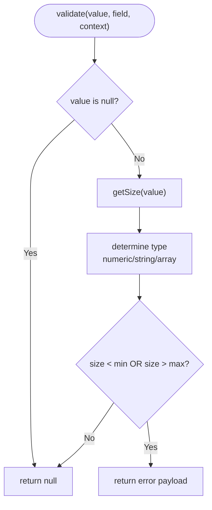

**Diagram sources**
- [BetweenRule.php](file://src/Rules/BetweenRule.php#L21-L42)
- [BetweenRule.php](file://src/Rules/BetweenRule.php#L44-L59)

**Section sources**
- [BetweenRule.php](file://src/Rules/BetweenRule.php#L10-L60)

### MinRule and MaxRule
Purpose: Enforce lower and upper bounds respectively.

Behavior:
- Null passes.
- For arrays: compare element count.
- For strings: compare character length using multibyte-safe length.
- For numeric types: compare numeric values.
- Returns error payload on violation.

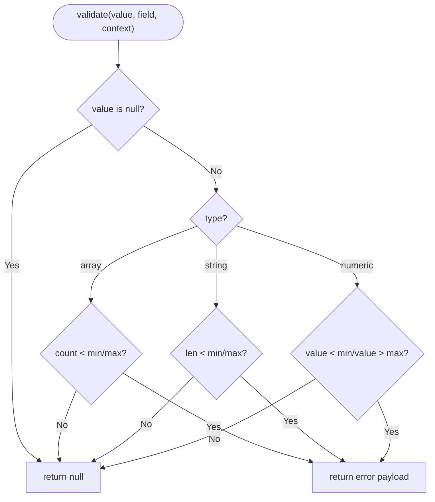

**Diagram sources**
- [MinRule.php](file://src/Rules/MinRule.php#L19-L46)
- [MaxRule.php](file://src/Rules/MaxRule.php#L19-L46)

**Section sources**
- [MinRule.php](file://src/Rules/MinRule.php#L10-L47)
- [MaxRule.php](file://src/Rules/MaxRule.php#L10-L47)

### SizeRule
Purpose: Enforce an exact size match.

Behavior:
- Null passes.
- Computes size similarly to BetweenRule.
- Uses loose float comparison to accommodate integer vs float mismatches.
- Returns error payload when sizes differ.

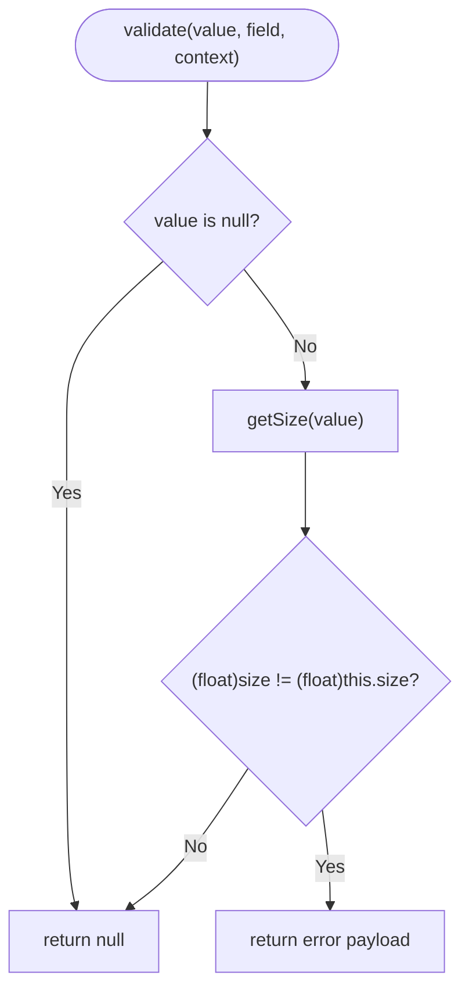

**Diagram sources**
- [SizeRule.php](file://src/Rules/SizeRule.php#L19-L41)
- [SizeRule.php](file://src/Rules/SizeRule.php#L43-L58)

**Section sources**
- [SizeRule.php](file://src/Rules/SizeRule.php#L10-L59)

### DigitsRule and DigitsBetweenRule
Purpose: Validate digit-only strings and their lengths.

Behavior:
- DigitsRule: Requires the entire string to be digits and match an exact length.
- DigitsBetweenRule: Requires the digit-only string to have a length within [min, max].

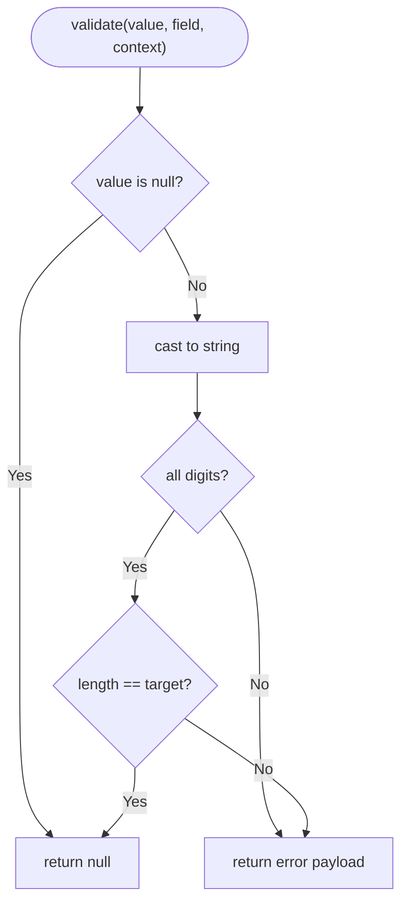

**Diagram sources**
- [DigitsRule.php](file://src/Rules/DigitsRule.php#L19-L44)

**Section sources**
- [DigitsRule.php](file://src/Rules/DigitsRule.php#L10-L45)
- [DigitsBetweenRule.php](file://src/Rules/DigitsBetweenRule.php#L10-L48)

### Comparison Rules (GreaterThan, GreaterThanOrEqual, LessThan, LessThanOrEqual)
Purpose: Compare a field’s value to another field’s value using appropriate semantics.

Semantics:
- Numeric comparison: convert both to float and compare.
- String comparison: compare multibyte lengths.
- Array comparison: compare counts.
- If either value is null or types mismatch, the rule does not apply.

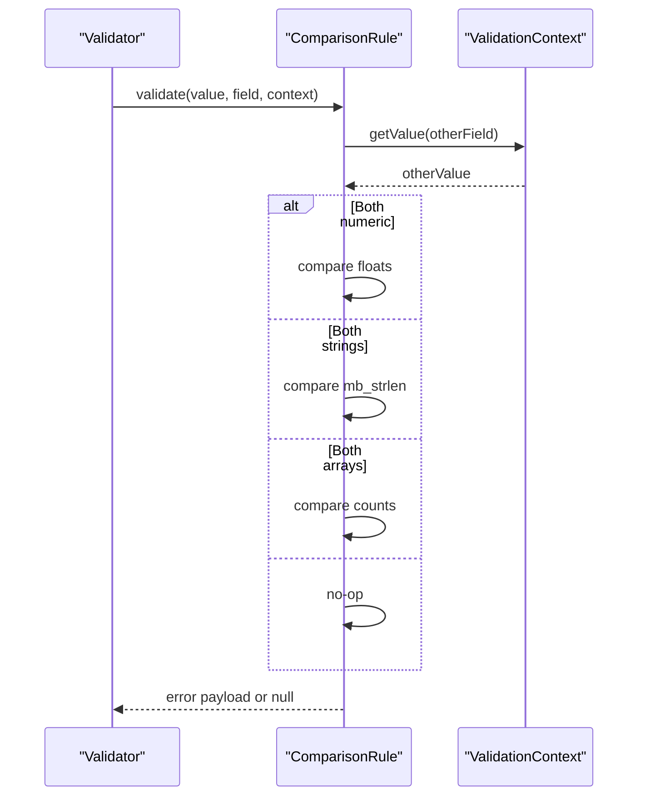

**Diagram sources**
- [GreaterThanRule.php](file://src/Rules/GreaterThanRule.php#L19-L65)
- [GreaterThanOrEqualRule.php](file://src/Rules/GreaterThanOrEqualRule.php#L19-L65)
- [LessThanRule.php](file://src/Rules/LessThanRule.php#L19-L65)
- [LessThanOrEqualRule.php](file://src/Rules/LessThanOrEqualRule.php#L19-L65)
- [ValidationContext.php](file://src/Execution/ValidationContext.php)

**Section sources**
- [GreaterThanRule.php](file://src/Rules/GreaterThanRule.php#L10-L66)
- [GreaterThanOrEqualRule.php](file://src/Rules/GreaterThanOrEqualRule.php#L10-L66)
- [LessThanRule.php](file://src/Rules/LessThanRule.php#L10-L66)
- [LessThanOrEqualRule.php](file://src/Rules/LessThanOrEqualRule.php#L10-L66)

### MultipleOfRule
Purpose: Validates that a numeric value is divisible by a given factor.

Behavior:
- Rejects non-numeric values.
- Treats zero factor as invalid.
- Uses modulo arithmetic to check divisibility.

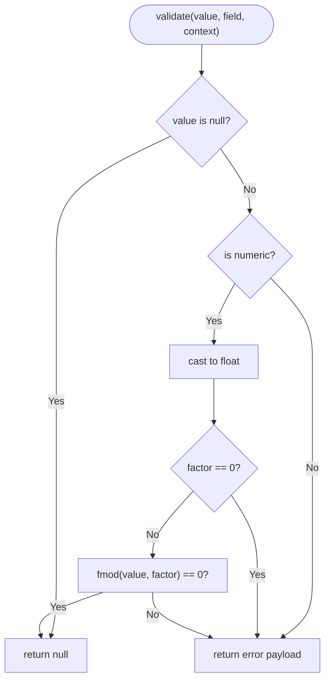

**Diagram sources**
- [MultipleOfRule.php](file://src/Rules/MultipleOfRule.php#L16-L38)

**Section sources**
- [MultipleOfRule.php](file://src/Rules/MultipleOfRule.php#L10-L39)

### DecimalRule
Purpose: Validates decimal precision for numeric-like strings.

Behavior:
- Accepts null or empty values.
- Ensures the value is numeric and contains exactly one decimal point.
- Enforces either exact decimal count (when max is null) or inclusive range [min, max].

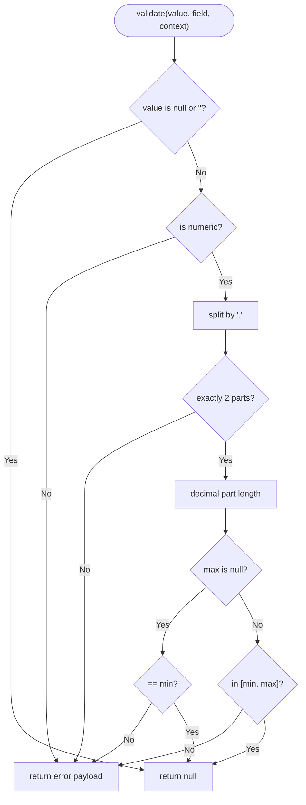

**Diagram sources**
- [DecimalRule.php](file://src/Rules/DecimalRule.php#L21-L51)

**Section sources**
- [DecimalRule.php](file://src/Rules/DecimalRule.php#L10-L52)

### File Size Rules (MinFileSizeRule, MaxFileSizeRule)
Purpose: Validate uploaded or referenced file sizes in kilobytes.

MinFileSizeRule:
- Resolves a file path from string or SplFileInfo.
- Checks existence and computes size in KB.
- Fails if below minimum.

MaxFileSizeRule:
- Resolves size from SplFileInfo, uploaded file array, or file path.
- Converts bytes to KB and compares to maximum.

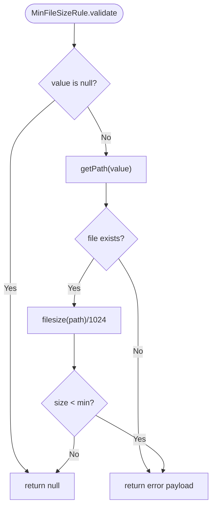

**Diagram sources**
- [MinFileSizeRule.php](file://src/Rules/MinFileSizeRule.php#L19-L36)
- [MinFileSizeRule.php](file://src/Rules/MinFileSizeRule.php#L39-L50)

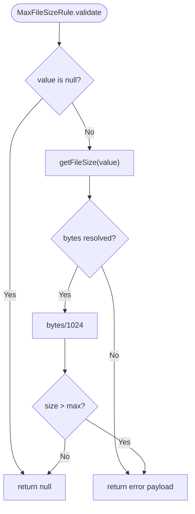

**Diagram sources**
- [MaxFileSizeRule.php](file://src/Rules/MaxFileSizeRule.php#L20-L32)
- [MaxFileSizeRule.php](file://src/Rules/MaxFileSizeRule.php#L35-L73)

**Section sources**
- [MinFileSizeRule.php](file://src/Rules/MinFileSizeRule.php#L10-L51)
- [MaxFileSizeRule.php](file://src/Rules/MaxFileSizeRule.php#L11-L74)

## Dependency Analysis
- Cohesion: Each rule encapsulates a single validation concern and shares the same interface contract.
- Coupling: Rules depend on ValidationContext only when comparing against other fields; file size rules depend on filesystem access; all rules depend on RuleInterface.
- External dependencies: File size rules rely on filesystem functions; comparison rules rely on ValidationContext; decimal rule relies on string parsing.

Potential circular dependencies: None observed among rule classes.

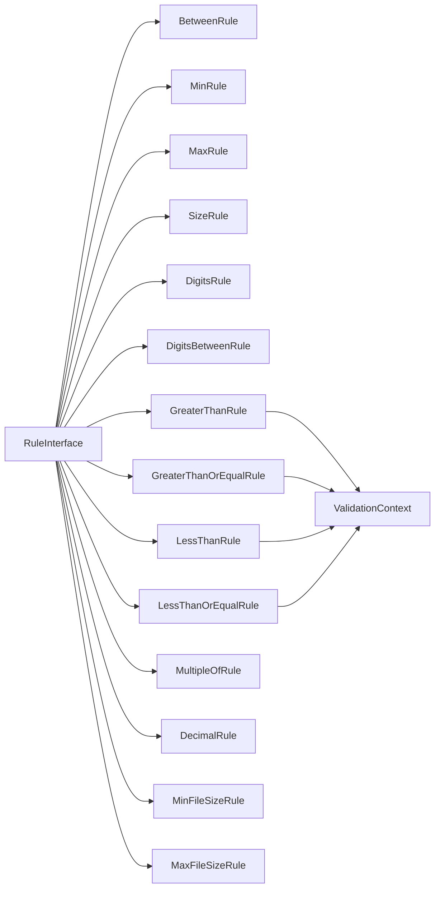

**Diagram sources**
- [RuleInterface.php](file://src/Rules/RuleInterface.php#L9-L15)
- [GreaterThanRule.php](file://src/Rules/GreaterThanRule.php#L19-L29)
- [GreaterThanOrEqualRule.php](file://src/Rules/GreaterThanOrEqualRule.php#L19-L29)
- [LessThanRule.php](file://src/Rules/LessThanRule.php#L19-L29)
- [LessThanOrEqualRule.php](file://src/Rules/LessThanOrEqualRule.php#L19-L29)
- [ValidationContext.php](file://src/Execution/ValidationContext.php)

**Section sources**
- [RuleInterface.php](file://src/Rules/RuleInterface.php#L9-L15)
- [ValidationContext.php](file://src/Execution/ValidationContext.php)

## Performance Considerations
- Size computations:
  - Strings: Multibyte length is used; avoid excessive trimming or normalization before validation.
  - Arrays: count() is O(1); large arrays still incur memory overhead proportional to size.
- Numeric comparisons:
  - Casting to float is lightweight; prefer integer bounds when possible to reduce conversions.
- File size:
  - Min/Max file size rules trigger filesystem calls; cache paths or pre-validate presence to minimize overhead.
- Precision checks:
  - DecimalRule splits strings; keep input sanitized to avoid malformed data.

## Troubleshooting Guide
Common issues and resolutions:
- Unexpected pass on null:
  - All rules return null for null values; ensure nullability is handled upstream if needed.
- Mixed-type comparisons:
  - Comparison rules require matching types (both numeric, both strings, or both arrays). If types differ, the rule does nothing.
- Decimal precision errors:
  - Ensure inputs are numeric-like strings with a single decimal point; otherwise, the rule fails.
- File size failures:
  - Verify the path exists and is readable; ensure uploaded file arrays include a valid size or temporary path.

**Section sources**
- [GreaterThanRule.php](file://src/Rules/GreaterThanRule.php#L25-L29)
- [GreaterThanOrEqualRule.php](file://src/Rules/GreaterThanOrEqualRule.php#L25-L29)
- [LessThanRule.php](file://src/Rules/LessThanRule.php#L25-L29)
- [LessThanOrEqualRule.php](file://src/Rules/LessThanOrEqualRule.php#L25-L29)
- [DecimalRule.php](file://src/Rules/DecimalRule.php#L23-L25)
- [MinFileSizeRule.php](file://src/Rules/MinFileSizeRule.php#L26-L28)
- [MaxFileSizeRule.php](file://src/Rules/MaxFileSizeRule.php#L26-L30)

## Conclusion
These rules provide robust, type-aware validation for sizes, comparisons, digit counts, precision, and file sizes. They consistently handle boundary conditions, support multibyte strings, and integrate seamlessly with the validation context for cross-field comparisons. Use them to enforce strong constraints in forms and data processing pipelines while maintaining predictable performance characteristics.