# String Validation Rules

<cite>
**Referenced Files in This Document**
- [EmailRule.php](file://src/Rules/EmailRule.php)
- [AlphaRule.php](file://src/Rules/AlphaRule.php)
- [AlphaDashRule.php](file://src/Rules/AlphaDashRule.php)
- [AlphanumericRule.php](file://src/Rules/AlphanumericRule.php)
- [AsciiRule.php](file://src/Rules/AsciiRule.php)
- [UrlRule.php](file://src/Rules/UrlRule.php)
- [UlidRule.php](file://src/Rules/UlidRule.php)
- [UuidRule.php](file://src/Rules/UuidRule.php)
- [MacAddressRule.php](file://src/Rules/MacAddressRule.php)
- [TimezoneRule.php](file://src/Rules/TimezoneRule.php)
- [LanguageRule.php](file://src/Rules/LanguageRule.php)
- [CountryRule.php](file://src/Rules/CountryRule.php)
- [ExtensionsRule.php](file://src/Rules/ExtensionsRule.php)
- [RegexRule.php](file://src/Rules/RegexRule.php)
- [NotRegexRule.php](file://src/Rules/NotRegexRule.php)
- [StartsWithRule.php](file://src/Rules/StartsWithRule.php)
- [EndsWithRule.php](file://src/Rules/EndsWithRule.php)
- [LowercaseRule.php](file://src/Rules/LowercaseRule.php)
- [UppercaseRule.php](file://src/Rules/UppercaseRule.php)
</cite>

## Table of Contents
1. [Introduction](#introduction)
2. [Project Structure](#project-structure)
3. [Core Components](#core-components)
4. [Architecture Overview](#architecture-overview)
5. [Detailed Component Analysis](#detailed-component-analysis)
6. [Dependency Analysis](#dependency-analysis)
7. [Performance Considerations](#performance-considerations)
8. [Troubleshooting Guide](#troubleshooting-guide)
9. [Conclusion](#conclusion)

## Introduction
This document provides comprehensive, code-backed documentation for string validation rules in the validation library. It explains the validation algorithms, pattern matching, locale considerations, and practical usage examples for each rule. The goal is to help both developers and technical writers understand how each rule behaves, when to use it, and how to configure it effectively.

## Project Structure
The string validation rules live under the Rules namespace and implement a shared interface contract. Each rule encapsulates a single validation concern and returns a structured error payload when validation fails.

```mermaid
graph TB
subgraph "Rules Namespace"
ER["EmailRule"]
AR["AlphaRule"]
ADR["AlphaDashRule"]
ANR["AlphanumericRule"]
ASC["AsciiRule"]
UR["UrlRule"]
UL["UlidRule"]
UD["UuidRule"]
MR["MacAddressRule"]
TZ["TimezoneRule"]
LR["LanguageRule"]
CR["CountryRule"]
EX["ExtensionsRule"]
REX["RegexRule"]
NR["NotRegexRule"]
SW["StartsWithRule"]
EW["EndsWithRule"]
LOW["LowercaseRule"]
UP["UppercaseRule"]
end
CTX["ValidationContext"]
IF["RuleInterface"]
ER --> IF
AR --> IF
ADR --> IF
ANR --> IF
ASC --> IF
UR --> IF
UL --> IF
UD --> IF
MR --> IF
TZ --> IF
LR --> IF
CR --> IF
EX --> IF
REX --> IF
NR --> IF
SW --> IF
EW --> IF
LOW --> IF
UP --> IF
ER --> CTX
AR --> CTX
ADR --> CTX
ANR --> CTX
ASC --> CTX
UR --> CTX
UL --> CTX
UD --> CTX
MR --> CTX
TZ --> CTX
LR --> CTX
CR --> CTX
EX --> CTX
REX --> CTX
NR --> CTX
SW --> CTX
EW --> CTX
LOW --> CTX
UP --> CTX
```

**Diagram sources**
- [EmailRule.php](file://src/Rules/EmailRule.php#L10-L28)
- [AlphaRule.php](file://src/Rules/AlphaRule.php#L10-L22)
- [AlphaDashRule.php](file://src/Rules/AlphaDashRule.php#L10-L26)
- [AlphanumericRule.php](file://src/Rules/AlphanumericRule.php#L10-L26)
- [AsciiRule.php](file://src/Rules/AsciiRule.php#L10-L22)
- [UrlRule.php](file://src/Rules/UrlRule.php#L10-L26)
- [UlidRule.php](file://src/Rules/UlidRule.php#L10-L27)
- [UuidRule.php](file://src/Rules/UuidRule.php#L10-L28)
- [MacAddressRule.php](file://src/Rules/MacAddressRule.php#L10-L26)
- [TimezoneRule.php](file://src/Rules/TimezoneRule.php#L11-L27)
- [LanguageRule.php](file://src/Rules/LanguageRule.php#L10-L41)
- [CountryRule.php](file://src/Rules/CountryRule.php#L10-L40)
- [ExtensionsRule.php](file://src/Rules/ExtensionsRule.php#L10-L37)
- [RegexRule.php](file://src/Rules/RegexRule.php#L10-L33)
- [NotRegexRule.php](file://src/Rules/NotRegexRule.php#L10-L30)
- [StartsWithRule.php](file://src/Rules/StartsWithRule.php#L10-L42)
- [EndsWithRule.php](file://src/Rules/EndsWithRule.php#L10-L42)
- [LowercaseRule.php](file://src/Rules/LowercaseRule.php#L10-L26)
- [UppercaseRule.php](file://src/Rules/UppercaseRule.php#L10-L26)

**Section sources**
- [EmailRule.php](file://src/Rules/EmailRule.php#L1-L30)
- [AlphaRule.php](file://src/Rules/AlphaRule.php#L1-L25)
- [AlphaDashRule.php](file://src/Rules/AlphaDashRule.php#L1-L29)
- [AlphanumericRule.php](file://src/Rules/AlphanumericRule.php#L1-L29)
- [AsciiRule.php](file://src/Rules/AsciiRule.php#L1-L25)
- [UrlRule.php](file://src/Rules/UrlRule.php#L1-L29)
- [UlidRule.php](file://src/Rules/UlidRule.php#L1-L30)
- [UuidRule.php](file://src/Rules/UuidRule.php#L1-L31)
- [MacAddressRule.php](file://src/Rules/MacAddressRule.php#L1-L29)
- [TimezoneRule.php](file://src/Rules/TimezoneRule.php#L1-L30)
- [LanguageRule.php](file://src/Rules/LanguageRule.php#L1-L44)
- [CountryRule.php](file://src/Rules/CountryRule.php#L1-L44)
- [ExtensionsRule.php](file://src/Rules/ExtensionsRule.php#L1-L53)
- [RegexRule.php](file://src/Rules/RegexRule.php#L1-L36)
- [NotRegexRule.php](file://src/Rules/NotRegexRule.php#L1-L33)
- [StartsWithRule.php](file://src/Rules/StartsWithRule.php#L1-L45)
- [EndsWithRule.php](file://src/Rules/EndsWithRule.php#L1-L45)
- [LowercaseRule.php](file://src/Rules/LowercaseRule.php#L1-L29)
- [UppercaseRule.php](file://src/Rules/UppercaseRule.php#L1-L29)

## Core Components
Each rule implements a uniform contract:
- Accepts a mixed value, field name, and a validation context
- Returns null on success or an error descriptor on failure
- Uses PHP’s native functions or regular expressions for validation
- Some rules support numeric coercion for string-like inputs

Key behaviors:
- Null-safe: null values are considered valid unless the field is required elsewhere
- Type checks: most rules reject non-string/numeric inputs early
- Locale-awareness: Unicode categories and UTF-8 aware comparisons are used where applicable
- Error descriptors: failure returns include the rule name and optional parameters

**Section sources**
- [EmailRule.php](file://src/Rules/EmailRule.php#L12-L28)
- [AlphaRule.php](file://src/Rules/AlphaRule.php#L12-L22)
- [AlphaDashRule.php](file://src/Rules/AlphaDashRule.php#L12-L26)
- [AlphanumericRule.php](file://src/Rules/AlphanumericRule.php#L12-L26)
- [AsciiRule.php](file://src/Rules/AsciiRule.php#L12-L22)
- [UrlRule.php](file://src/Rules/UrlRule.php#L12-L26)
- [UlidRule.php](file://src/Rules/UlidRule.php#L12-L27)
- [UuidRule.php](file://src/Rules/UuidRule.php#L14-L28)
- [MacAddressRule.php](file://src/Rules/MacAddressRule.php#L12-L26)
- [TimezoneRule.php](file://src/Rules/TimezoneRule.php#L13-L27)
- [LanguageRule.php](file://src/Rules/LanguageRule.php#L31-L41)
- [CountryRule.php](file://src/Rules/CountryRule.php#L31-L40)
- [ExtensionsRule.php](file://src/Rules/ExtensionsRule.php#L20-L37)
- [RegexRule.php](file://src/Rules/RegexRule.php#L19-L33)
- [NotRegexRule.php](file://src/Rules/NotRegexRule.php#L16-L30)
- [StartsWithRule.php](file://src/Rules/StartsWithRule.php#L23-L42)
- [EndsWithRule.php](file://src/Rules/EndsWithRule.php#L23-L42)
- [LowercaseRule.php](file://src/Rules/LowercaseRule.php#L12-L26)
- [UppercaseRule.php](file://src/Rules/UppercaseRule.php#L12-L26)

## Architecture Overview
The validation engine passes each field’s value to the corresponding rule. Rules are stateless and rely on:
- Built-in PHP filters for emails, URLs, MAC addresses
- Regular expressions for identifiers and patterns
- Lookup tables for languages and countries
- String utilities for prefix/suffix checks and case normalization

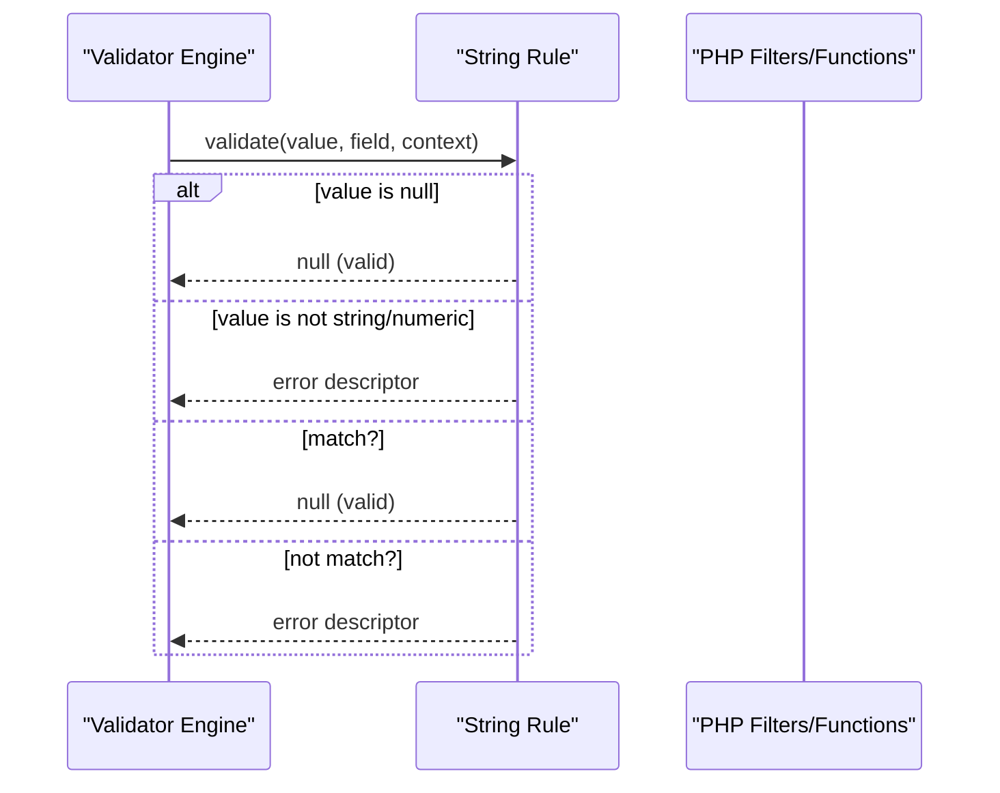

[No sources needed since this diagram shows conceptual workflow, not actual code structure]

## Detailed Component Analysis

### EmailRule
- Purpose: Validates standard email format.
- Algorithm:
  - Rejects null.
  - Ensures string type.
  - Uses a built-in filter to validate email format.
- Complexity: O(1) per call.
- Practical usage: Use for user account emails, notifications, and contact forms.

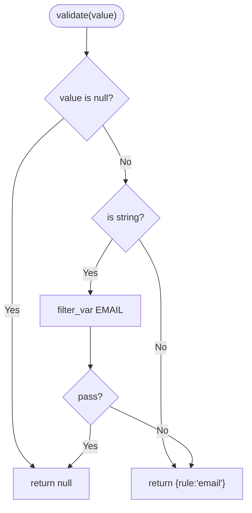

**Diagram sources**
- [EmailRule.php](file://src/Rules/EmailRule.php#L12-L28)

**Section sources**
- [EmailRule.php](file://src/Rules/EmailRule.php#L12-L28)

### AlphaRule
- Purpose: Validates alphabetic-only strings (including accented letters).
- Algorithm:
  - Rejects null.
  - Ensures string type.
  - Uses Unicode categories to allow letters and marks.
- Complexity: O(n) with regex scan.
- Practical usage: Names, titles, and labels that must not include digits or punctuation.

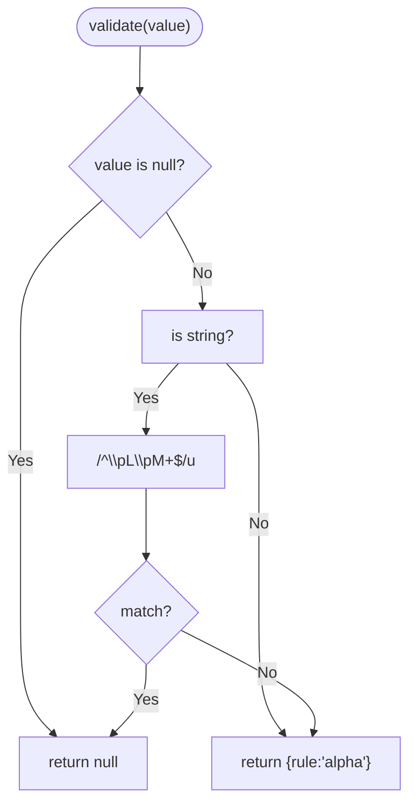

**Diagram sources**
- [AlphaRule.php](file://src/Rules/AlphaRule.php#L12-L22)

**Section sources**
- [AlphaRule.php](file://src/Rules/AlphaRule.php#L12-L22)

### AlphaDashRule
- Purpose: Validates alphabetic, numeric, underscore, and hyphen characters.
- Algorithm:
  - Null-safe.
  - Accepts numeric values by coercion.
  - Uses Unicode categories plus digits, underscore, and hyphen.
- Complexity: O(n) with regex scan.
- Practical usage: Slugs, identifiers, and tokens.

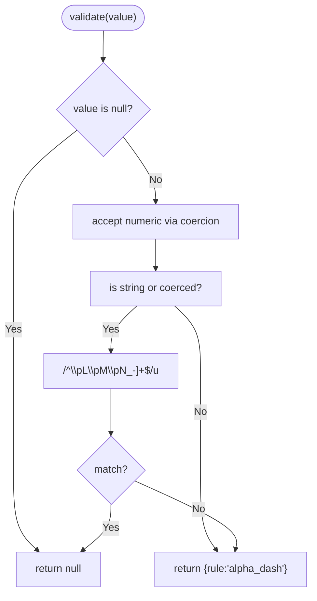

**Diagram sources**
- [AlphaDashRule.php](file://src/Rules/AlphaDashRule.php#L12-L26)

**Section sources**
- [AlphaDashRule.php](file://src/Rules/AlphaDashRule.php#L12-L26)

### AlphanumericRule
- Purpose: Validates alphabetic and numeric characters only.
- Algorithm:
  - Null-safe.
  - Accepts numeric values by coercion.
  - Uses Unicode categories plus digits.
- Complexity: O(n) with regex scan.
- Practical usage: Codes, PINs, and short identifiers.

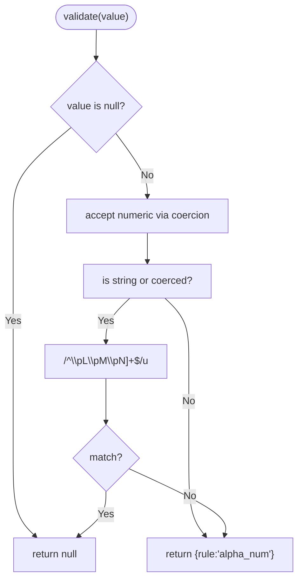

**Diagram sources**
- [AlphanumericRule.php](file://src/Rules/AlphanumericRule.php#L12-L26)

**Section sources**
- [AlphanumericRule.php](file://src/Rules/AlphanumericRule.php#L12-L26)

### AsciiRule
- Purpose: Validates ASCII-only strings.
- Algorithm:
  - Null-safe.
  - Checks encoding against ASCII.
- Complexity: O(1) with encoding check.
- Practical usage: Legacy systems, ASCII-only protocols, or narrow character sets.

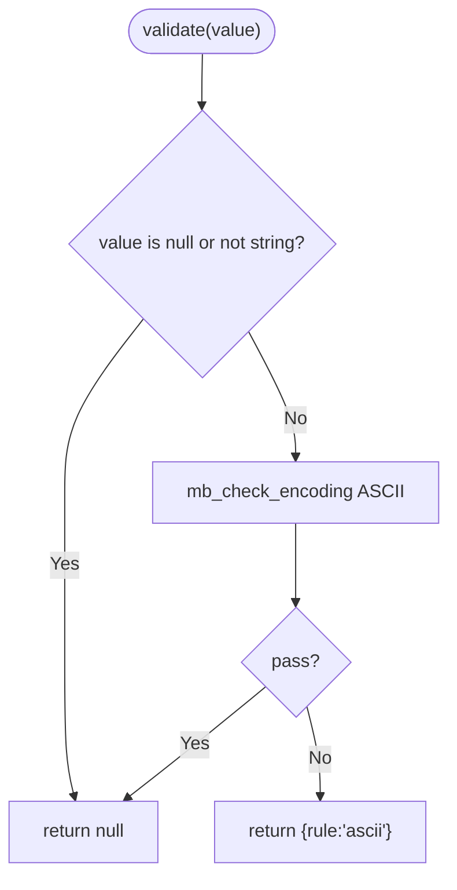

**Diagram sources**
- [AsciiRule.php](file://src/Rules/AsciiRule.php#L12-L22)

**Section sources**
- [AsciiRule.php](file://src/Rules/AsciiRule.php#L12-L22)

### UrlRule
- Purpose: Validates URL format.
- Algorithm:
  - Rejects null.
  - Ensures string type.
  - Uses a built-in filter to validate URL format.
- Complexity: O(1) per call.
- Practical usage: Website links, API endpoints, and resource locations.

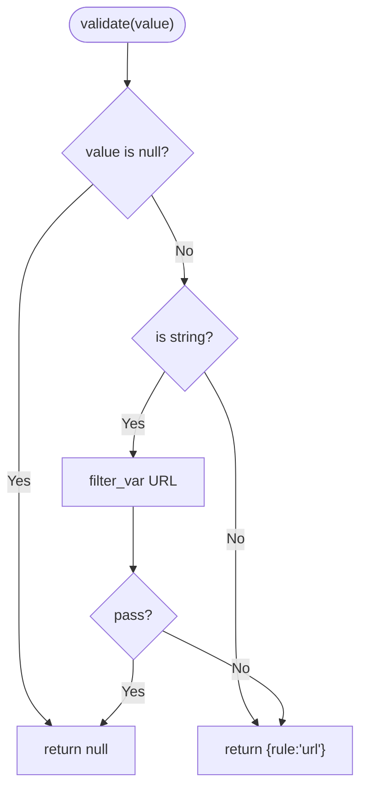

**Diagram sources**
- [UrlRule.php](file://src/Rules/UrlRule.php#L12-L26)

**Section sources**
- [UrlRule.php](file://src/Rules/UrlRule.php#L12-L26)

### UlidRule
- Purpose: Validates ULID (Universally Unique Identifier) format.
- Algorithm:
  - Rejects null.
  - Ensures string type.
  - Matches length and character set (Crockford Base32, excluding I, L, O, U).
- Complexity: O(1) with fixed-length regex.
- Practical usage: Distributed system identifiers, audit trails.

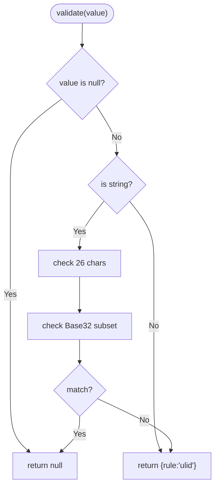

**Diagram sources**
- [UlidRule.php](file://src/Rules/UlidRule.php#L12-L27)

**Section sources**
- [UlidRule.php](file://src/Rules/UlidRule.php#L12-L27)

### UuidRule
- Purpose: Validates UUID v1–v5 format.
- Algorithm:
  - Rejects null.
  - Ensures string type.
  - Matches canonical UUID pattern with version-specific variant bits.
- Complexity: O(1) with fixed regex.
- Practical usage: Database keys, session IDs, and cross-system identifiers.

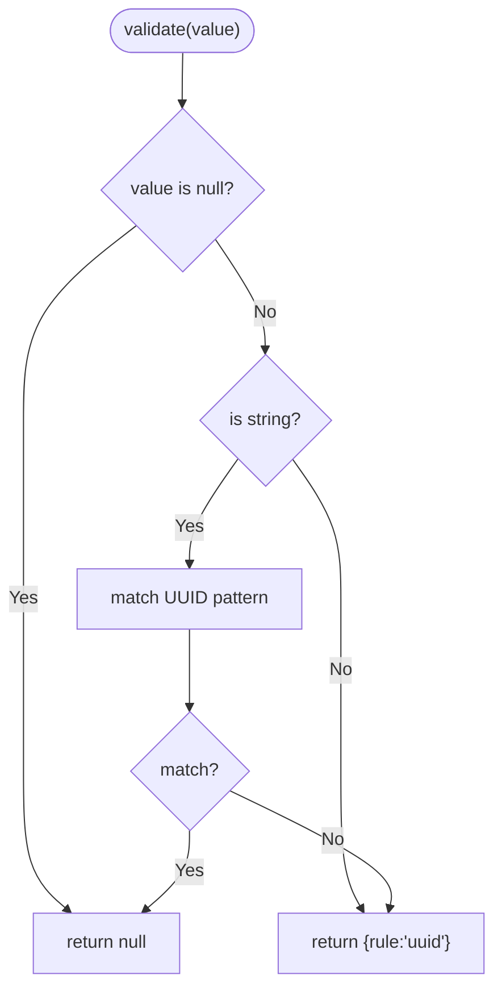

**Diagram sources**
- [UuidRule.php](file://src/Rules/UuidRule.php#L14-L28)

**Section sources**
- [UuidRule.php](file://src/Rules/UuidRule.php#L14-L28)

### MacAddressRule
- Purpose: Validates MAC address format.
- Algorithm:
  - Rejects null.
  - Ensures string type.
  - Uses a built-in filter to validate MAC address.
- Complexity: O(1) per call.
- Practical usage: Network device configuration, hardware identification.

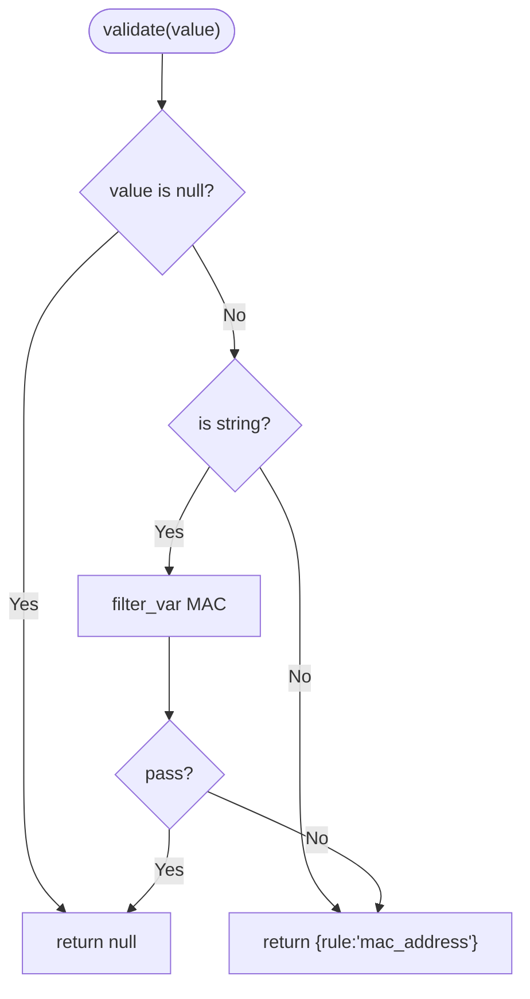

**Diagram sources**
- [MacAddressRule.php](file://src/Rules/MacAddressRule.php#L12-L26)

**Section sources**
- [MacAddressRule.php](file://src/Rules/MacAddressRule.php#L12-L26)

### TimezoneRule
- Purpose: Validates timezone identifiers.
- Algorithm:
  - Rejects null.
  - Ensures string type.
  - Checks membership in the list of supported identifiers.
- Complexity: O(k) lookup where k is the number of identifiers.
- Practical usage: User profile preferences, scheduling systems.

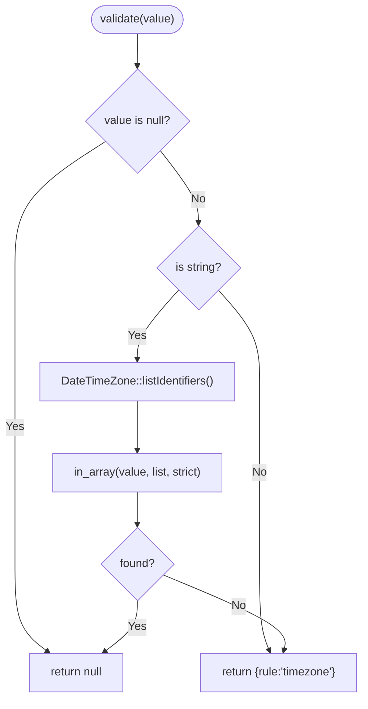

**Diagram sources**
- [TimezoneRule.php](file://src/Rules/TimezoneRule.php#L13-L27)

**Section sources**
- [TimezoneRule.php](file://src/Rules/TimezoneRule.php#L13-L27)

### LanguageRule
- Purpose: Validates ISO 639-1 language codes.
- Algorithm:
  - Null-safe.
  - Ensures string type.
  - Checks lowercase against a curated list of two-letter codes.
- Complexity: O(1) lookup after lowercasing.
- Practical usage: Localization settings, content language selection.

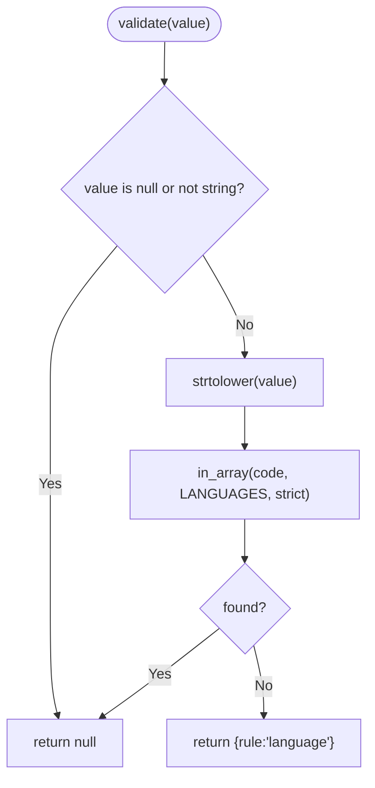

**Diagram sources**
- [LanguageRule.php](file://src/Rules/LanguageRule.php#L31-L41)

**Section sources**
- [LanguageRule.php](file://src/Rules/LanguageRule.php#L31-L41)

### CountryRule
- Purpose: Validates ISO 3166-1 alpha-2 country codes.
- Algorithm:
  - Null-safe.
  - Ensures string type.
  - Checks uppercase against a curated list of two-letter codes.
- Complexity: O(1) lookup after uppercasing.
- Practical usage: Billing address, shipping region, compliance.

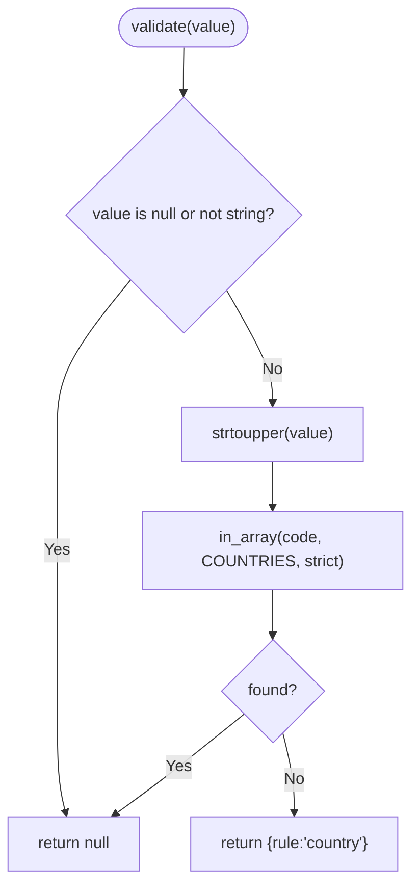

**Diagram sources**
- [CountryRule.php](file://src/Rules/CountryRule.php#L31-L40)

**Section sources**
- [CountryRule.php](file://src/Rules/CountryRule.php#L31-L40)

### ExtensionsRule
- Purpose: Validates file extensions against allowed lists.
- Algorithm:
  - Null-safe.
  - Accepts string paths or file info objects.
  - Extracts extension and checks membership in allowed set.
- Complexity: O(m + n) where m is path parsing cost and n is lookup cost.
- Practical usage: Upload restrictions, media type gating.

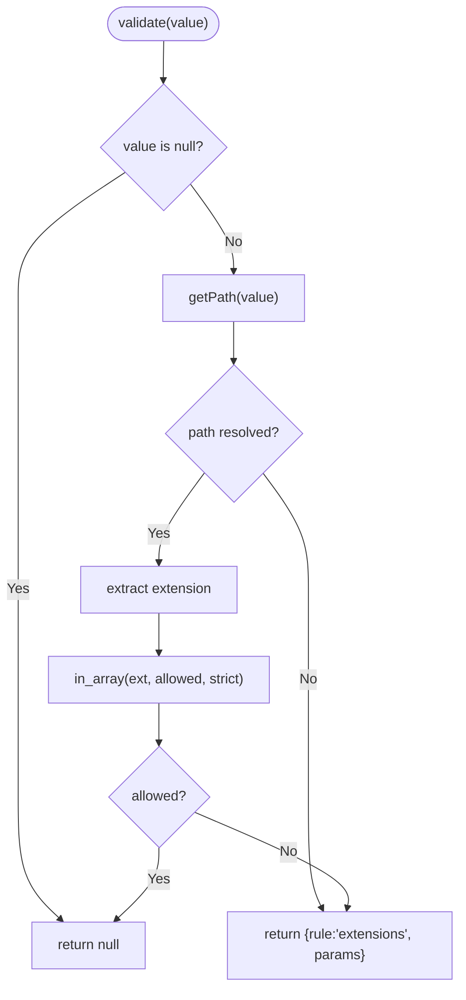

**Diagram sources**
- [ExtensionsRule.php](file://src/Rules/ExtensionsRule.php#L20-L37)

**Section sources**
- [ExtensionsRule.php](file://src/Rules/ExtensionsRule.php#L20-L37)

### RegexRule
- Purpose: Validates strings against a provided regular expression.
- Algorithm:
  - Null-safe.
  - Accepts numeric values by coercion.
  - Applies pattern matching.
- Complexity: O(n) with regex scan.
- Practical usage: Custom formats, domain-specific patterns.

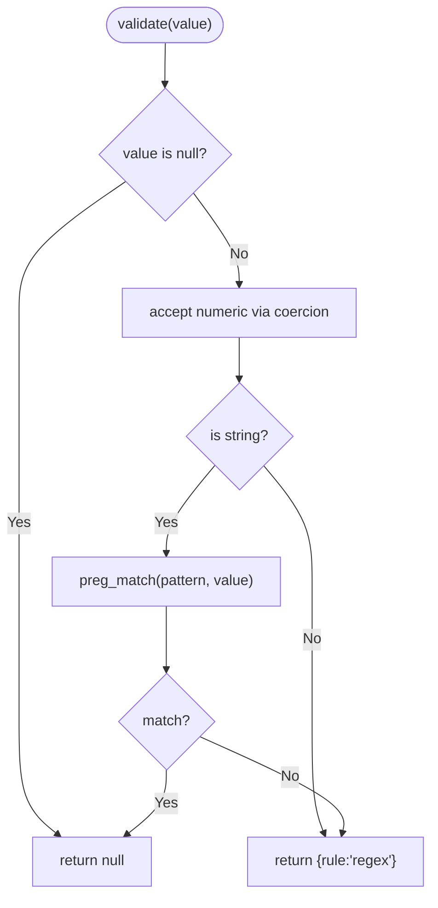

**Diagram sources**
- [RegexRule.php](file://src/Rules/RegexRule.php#L19-L33)

**Section sources**
- [RegexRule.php](file://src/Rules/RegexRule.php#L19-L33)

### NotRegexRule
- Purpose: Validates strings against a negative regular expression (must not match).
- Algorithm:
  - Null-safe.
  - Accepts numeric values by coercion.
  - Fails if the pattern matches.
- Complexity: O(n) with regex scan.
- Practical usage: Blacklists, disallowing specific substrings or formats.

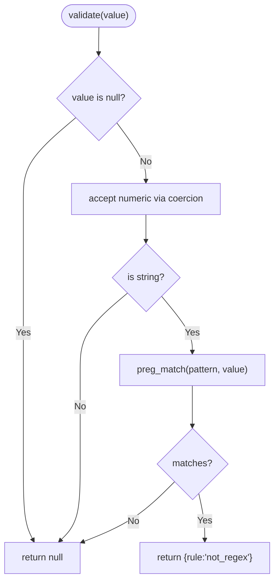

**Diagram sources**
- [NotRegexRule.php](file://src/Rules/NotRegexRule.php#L16-L30)

**Section sources**
- [NotRegexRule.php](file://src/Rules/NotRegexRule.php#L16-L30)

### StartsWithRule
- Purpose: Validates that a string starts with any of the provided prefixes.
- Algorithm:
  - Null-safe.
  - Requires string input.
  - Iterates prefixes using a starts-with check.
- Complexity: O(p + n) where p is number of prefixes and n is string length.
- Practical usage: Protocol prefixes, product codes, namespaces.

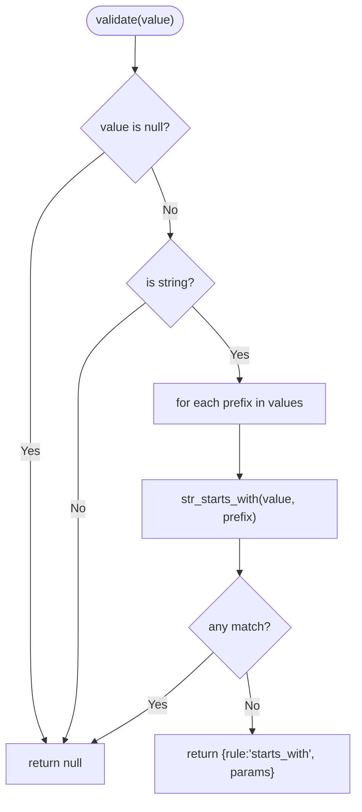

**Diagram sources**
- [StartsWithRule.php](file://src/Rules/StartsWithRule.php#L23-L42)

**Section sources**
- [StartsWithRule.php](file://src/Rules/StartsWithRule.php#L23-L42)

### EndsWithRule
- Purpose: Validates that a string ends with any of the provided suffixes.
- Algorithm:
  - Null-safe.
  - Requires string input.
  - Iterates suffixes using an ends-with check.
- Complexity: O(s + n) where s is number of suffixes and n is string length.
- Practical usage: File extensions, domains, protocol suffixes.

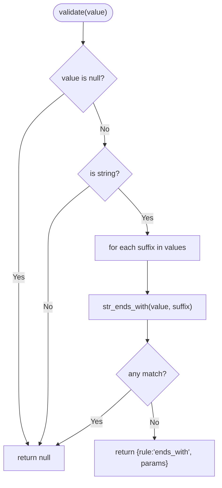

**Diagram sources**
- [EndsWithRule.php](file://src/Rules/EndsWithRule.php#L23-L42)

**Section sources**
- [EndsWithRule.php](file://src/Rules/EndsWithRule.php#L23-L42)

### LowercaseRule
- Purpose: Validates that a string is entirely lowercase (UTF-8 aware).
- Algorithm:
  - Null-safe.
  - Requires string input.
  - Compares against lowercased version.
- Complexity: O(n) for case conversion and comparison.
- Practical usage: Username normalization, case-insensitive comparisons.

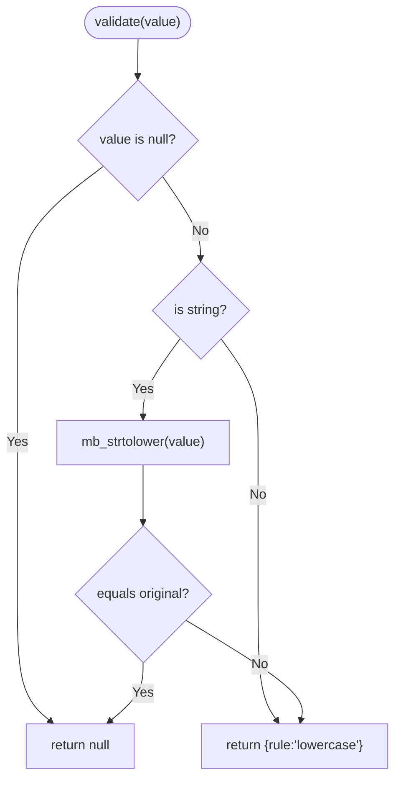

**Diagram sources**
- [LowercaseRule.php](file://src/Rules/LowercaseRule.php#L12-L26)

**Section sources**
- [LowercaseRule.php](file://src/Rules/LowercaseRule.php#L12-L26)

### UppercaseRule
- Purpose: Validates that a string is entirely uppercase (UTF-8 aware).
- Algorithm:
  - Null-safe.
  - Requires string input.
  - Compares against uppercased version.
- Complexity: O(n) for case conversion and comparison.
- Practical usage: Abbreviations, codes, and case-insensitive comparisons.

```mermaid
flowchart TD
Start(["validate(value)"]) --> IsNull{"value is null?"}
IsNull --> |Yes| Valid["return null"]
IsNull --> |No| IsString{"is string?"}
IsString --> |No| Err["return {rule:'uppercase'}"]
IsString --> |Yes| Upper["mb_strtoupper(value)"]
Upper --> Eq{"equals original?"}
Eq --> |Yes| Valid
Eq --> |No| Err["return {rule:'uppercase'}"]
```

**Diagram sources**
- [UppercaseRule.php](file://src/Rules/UppercaseRule.php#L12-L26)

**Section sources**
- [UppercaseRule.php](file://src/Rules/UppercaseRule.php#L12-L26)

## Dependency Analysis
- Shared interface: All rules implement a common interface and accept a validation context.
- External dependencies:
  - PHP filters for email, URL, MAC address validation.
  - PCRE regex for patterns and identifiers.
  - Unicode-aware string functions for case and category checks.
  - Static lists for languages and countries.
- Coupling:
  - Rules are loosely coupled; each encapsulates its own logic.
  - No circular dependencies observed among string rules.

```mermaid
graph TB
IF["RuleInterface"]
subgraph "String Rules"
E["EmailRule"]
A["AlphaRule"]
AD["AlphaDashRule"]
AN["AlphanumericRule"]
AS["AsciiRule"]
U["UrlRule"]
UL["UlidRule"]
UD["UuidRule"]
M["MacAddressRule"]
T["TimezoneRule"]
L["LanguageRule"]
C["CountryRule"]
EX["ExtensionsRule"]
RX["RegexRule"]
NR["NotRegexRule"]
SW["StartsWithRule"]
EW["EndsWithRule"]
LO["LowercaseRule"]
UP["UppercaseRule"]
end
E --> IF
A --> IF
AD --> IF
AN --> IF
AS --> IF
U --> IF
UL --> IF
UD --> IF
M --> IF
T --> IF
L --> IF
C --> IF
EX --> IF
RX --> IF
NR --> IF
SW --> IF
EW --> IF
LO --> IF
UP --> IF
```

**Diagram sources**
- [EmailRule.php](file://src/Rules/EmailRule.php#L10)
- [AlphaRule.php](file://src/Rules/AlphaRule.php#L10)
- [AlphaDashRule.php](file://src/Rules/AlphaDashRule.php#L10)
- [AlphanumericRule.php](file://src/Rules/AlphanumericRule.php#L10)
- [AsciiRule.php](file://src/Rules/AsciiRule.php#L10)
- [UrlRule.php](file://src/Rules/UrlRule.php#L10)
- [UlidRule.php](file://src/Rules/UlidRule.php#L10)
- [UuidRule.php](file://src/Rules/UuidRule.php#L10)
- [MacAddressRule.php](file://src/Rules/MacAddressRule.php#L10)
- [TimezoneRule.php](file://src/Rules/TimezoneRule.php#L11)
- [LanguageRule.php](file://src/Rules/LanguageRule.php#L10)
- [CountryRule.php](file://src/Rules/CountryRule.php#L10)
- [ExtensionsRule.php](file://src/Rules/ExtensionsRule.php#L10)
- [RegexRule.php](file://src/Rules/RegexRule.php#L10)
- [NotRegexRule.php](file://src/Rules/NotRegexRule.php#L10)
- [StartsWithRule.php](file://src/Rules/StartsWithRule.php#L10)
- [EndsWithRule.php](file://src/Rules/EndsWithRule.php#L10)
- [LowercaseRule.php](file://src/Rules/LowercaseRule.php#L10)
- [UppercaseRule.php](file://src/Rules/UppercaseRule.php#L10)

**Section sources**
- [EmailRule.php](file://src/Rules/EmailRule.php#L10)
- [AlphaRule.php](file://src/Rules/AlphaRule.php#L10)
- [AlphaDashRule.php](file://src/Rules/AlphaDashRule.php#L10)
- [AlphanumericRule.php](file://src/Rules/AlphanumericRule.php#L10)
- [AsciiRule.php](file://src/Rules/AsciiRule.php#L10)
- [UrlRule.php](file://src/Rules/UrlRule.php#L10)
- [UlidRule.php](file://src/Rules/UlidRule.php#L10)
- [UuidRule.php](file://src/Rules/UuidRule.php#L10)
- [MacAddressRule.php](file://src/Rules/MacAddressRule.php#L10)
- [TimezoneRule.php](file://src/Rules/TimezoneRule.php#L11)
- [LanguageRule.php](file://src/Rules/LanguageRule.php#L10)
- [CountryRule.php](file://src/Rules/CountryRule.php#L10)
- [ExtensionsRule.php](file://src/Rules/ExtensionsRule.php#L10)
- [RegexRule.php](file://src/Rules/RegexRule.php#L10)
- [NotRegexRule.php](file://src/Rules/NotRegexRule.php#L10)
- [StartsWithRule.php](file://src/Rules/StartsWithRule.php#L10)
- [EndsWithRule.php](file://src/Rules/EndsWithRule.php#L10)
- [LowercaseRule.php](file://src/Rules/LowercaseRule.php#L10)
- [UppercaseRule.php](file://src/Rules/UppercaseRule.php#L10)

## Performance Considerations
- Prefer precompiled regex patterns for frequently used rules (RegexRule, NotRegexRule).
- Use ASCII-only checks when locale support is unnecessary (AsciiRule).
- Leverage built-in filters for email, URL, and MAC validations to benefit from optimized implementations.
- Keep language and country lists small and static to minimize lookup costs.
- For bulk validations, consider batching and caching where appropriate.

[No sources needed since this section provides general guidance]

## Troubleshooting Guide
- Unexpected failures on numeric inputs:
  - Some rules coerce numeric values; others do not. Review the specific rule’s behavior.
- Case-sensitive vs case-insensitive expectations:
  - LowercaseRule and UppercaseRule enforce strict casing; use them when normalization is not desired.
- Locale and Unicode:
  - AlphaRule, AlphaDashRule, AlphanumericRule, LowercaseRule, and UppercaseRule use Unicode categories and UTF-8-aware functions.
- Extension validation:
  - Ensure the input is a path string or a file info object; otherwise, the rule reports an error with allowed values.
- Pattern matching:
  - RegexRule and NotRegexRule require properly escaped and anchored patterns for predictable behavior.

**Section sources**
- [LowercaseRule.php](file://src/Rules/LowercaseRule.php#L18-L24)
- [UppercaseRule.php](file://src/Rules/UppercaseRule.php#L18-L24)
- [ExtensionsRule.php](file://src/Rules/ExtensionsRule.php#L26-L35)
- [RegexRule.php](file://src/Rules/RegexRule.php#L25-L31)
- [NotRegexRule.php](file://src/Rules/NotRegexRule.php#L22-L28)

## Conclusion
These string validation rules provide robust, locale-aware, and efficient validation for common use cases. By understanding each rule’s algorithm, complexity, and intended usage, you can compose reliable validation schemas tailored to your application’s needs.

[No sources needed since this section summarizes without analyzing specific files]