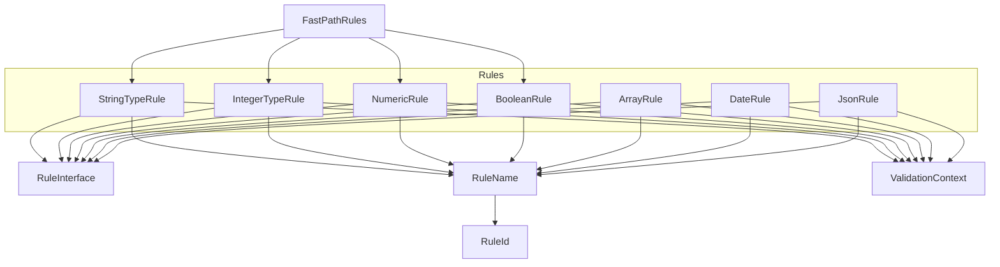
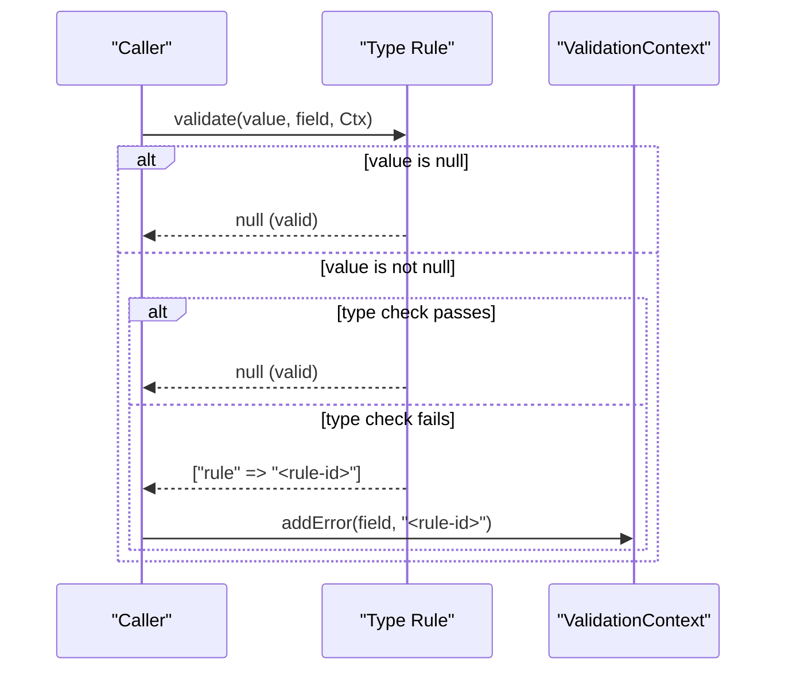
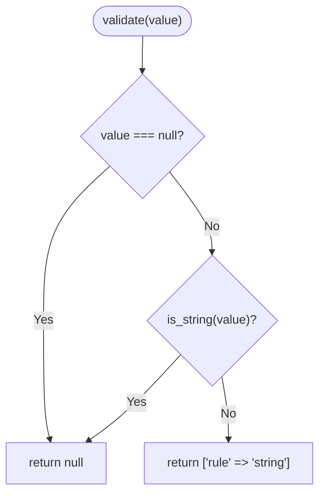
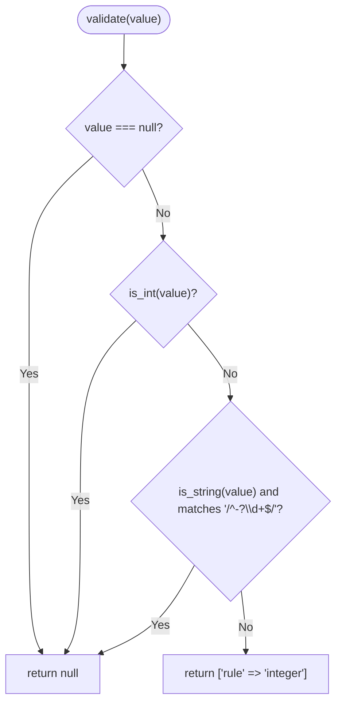
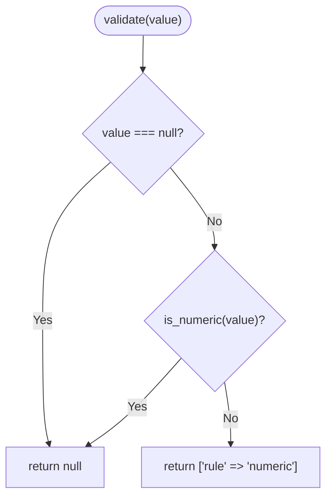
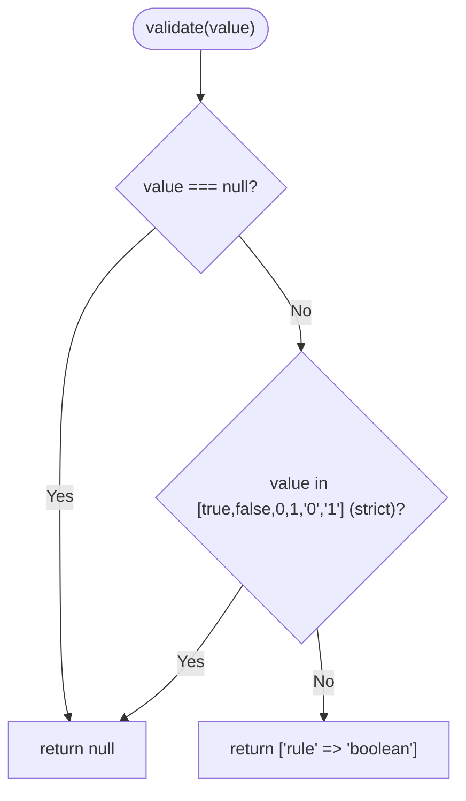
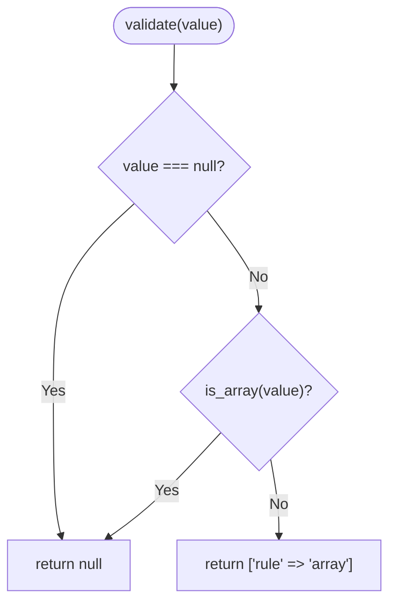
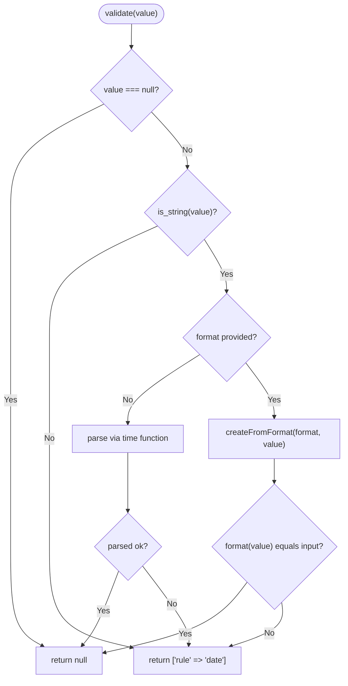
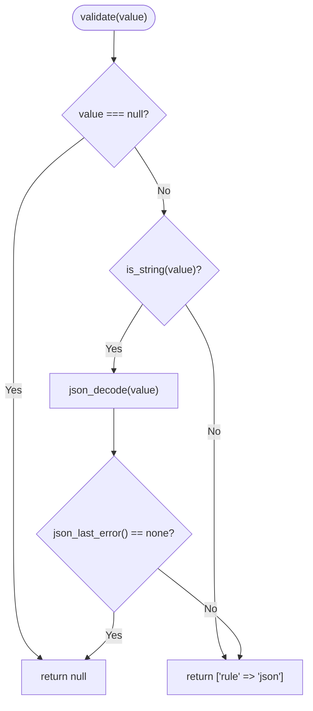
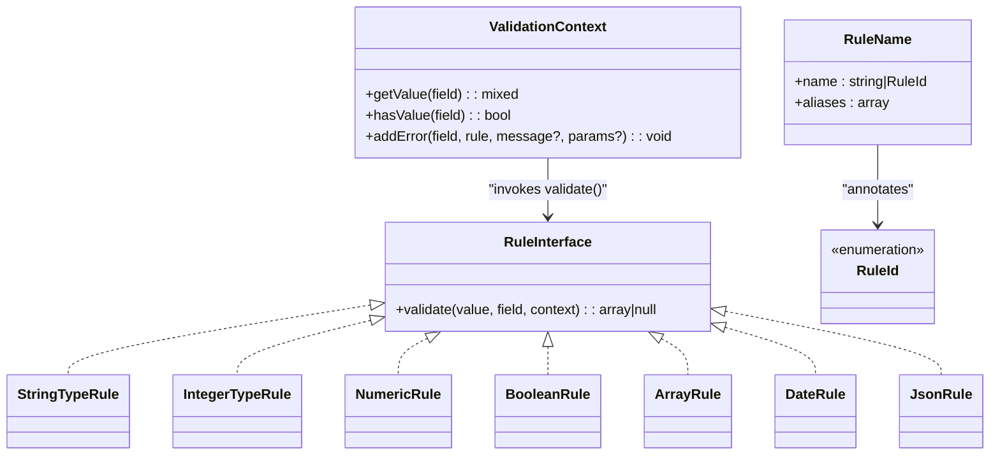

# Type Rules

<cite>
**Referenced Files in This Document**
- [StringTypeRule.php](file://src/Rules/StringTypeRule.php)
- [IntegerTypeRule.php](file://src/Rules/IntegerTypeRule.php)
- [NumericRule.php](file://src/Rules/NumericRule.php)
- [BooleanRule.php](file://src/Rules/BooleanRule.php)
- [ArrayRule.php](file://src/Rules/ArrayRule.php)
- [DateRule.php](file://src/Rules/DateRule.php)
- [JsonRule.php](file://src/Rules/JsonRule.php)
- [RuleInterface.php](file://src/Rules/RuleInterface.php)
- [RuleId.php](file://src/Rules/RuleId.php)
- [RuleName.php](file://src/Rules/RuleName.php)
- [ValidationContext.php](file://src/Execution/ValidationContext.php)
- [FastPathRules.php](file://src/Compilation/FastPathRules.php)
- [ValidatorCompiler.php](file://src/Compilation/ValidatorCompiler.php)
- [CoreTypeRulesTest.php](file://tests/Unit/Rules/CoreTypeRulesTest.php)
</cite>

## Table of Contents
1. [Introduction](#introduction)
2. [Project Structure](#project-structure)
3. [Core Components](#core-components)
4. [Architecture Overview](#architecture-overview)
5. [Detailed Component Analysis](#detailed-component-analysis)
6. [Dependency Analysis](#dependency-analysis)
7. [Performance Considerations](#performance-considerations)
8. [Troubleshooting Guide](#troubleshooting-guide)
9. [Conclusion](#conclusion)

## Introduction
This document explains the type validation rules that ensure data type conformity in the validation engine. It covers:
- StringTypeRule (string validation)
- IntegerTypeRule (integer validation)
- NumericRule (numeric validation)
- BooleanRule (boolean validation)
- ArrayRule (array validation)
- DateRule (date validation)
- JsonRule (JSON validation)

For each rule, we describe the type checking mechanism, conversion behavior, validation logic, and practical usage examples. We also include performance considerations and type coercion rules observed in the implementation.

## Project Structure
The type rules are implemented as individual classes under the Rules namespace, adhering to a common interface and sharing a consistent pattern:
- Each rule implements a validate method receiving the value, field name, and a validation context.
- Rules return null on success or an associative array indicating failure with the rule name.
- Some rules support optional parameters (for example, DateRule supports a format).
- A dedicated fast-path module provides optimized checks for common types during compilation and runtime.

**Diagram sources**
- [StringTypeRule.php](file://src/Rules/StringTypeRule.php#L1-L25)
- [IntegerTypeRule.php](file://src/Rules/IntegerTypeRule.php#L1-L31)
- [NumericRule.php](file://src/Rules/NumericRule.php#L1-L25)
- [BooleanRule.php](file://src/Rules/BooleanRule.php#L1-L27)
- [ArrayRule.php](file://src/Rules/ArrayRule.php#L1-L25)
- [DateRule.php](file://src/Rules/DateRule.php#L1-L44)
- [JsonRule.php](file://src/Rules/JsonRule.php#L1-L31)
- [RuleInterface.php](file://src/Rules/RuleInterface.php#L1-L16)
- [RuleName.php](file://src/Rules/RuleName.php#L1-L18)
- [RuleId.php](file://src/Rules/RuleId.php#L1-L114)
- [ValidationContext.php](file://src/Execution/ValidationContext.php#L1-L98)
- [FastPathRules.php](file://src/Compilation/FastPathRules.php#L1-L69)

**Section sources**
- [StringTypeRule.php](file://src/Rules/StringTypeRule.php#L1-L25)
- [IntegerTypeRule.php](file://src/Rules/IntegerTypeRule.php#L1-L31)
- [NumericRule.php](file://src/Rules/NumericRule.php#L1-L25)
- [BooleanRule.php](file://src/Rules/BooleanRule.php#L1-L27)
- [ArrayRule.php](file://src/Rules/ArrayRule.php#L1-L25)
- [DateRule.php](file://src/Rules/DateRule.php#L1-L44)
- [JsonRule.php](file://src/Rules/JsonRule.php#L1-L31)
- [RuleInterface.php](file://src/Rules/RuleInterface.php#L1-L16)
- [RuleName.php](file://src/Rules/RuleName.php#L1-L18)
- [RuleId.php](file://src/Rules/RuleId.php#L1-L114)
- [ValidationContext.php](file://src/Execution/ValidationContext.php#L1-L98)
- [FastPathRules.php](file://src/Compilation/FastPathRules.php#L1-L69)

## Core Components
- RuleInterface defines the contract for all rules: a validate method returning null on success or an associative array with the failing rule identifier.
- RuleName is an attribute that annotates rule classes with a canonical name and optional aliases.
- RuleId enumerates built-in rule identifiers used by the registry and compiler.
- ValidationContext provides access to input data and error collection during validation.

Key behaviors across type rules:
- Null values are considered valid (pass-through).
- Strict type checks are used for most rules, with documented exceptions.
- Error payloads consistently include the rule name for message resolution.

**Section sources**
- [RuleInterface.php](file://src/Rules/RuleInterface.php#L1-L16)
- [RuleName.php](file://src/Rules/RuleName.php#L1-L18)
- [RuleId.php](file://src/Rules/RuleId.php#L1-L114)
- [ValidationContext.php](file://src/Execution/ValidationContext.php#L1-L98)

## Architecture Overview
The validation pipeline invokes each rule’s validate method. On failure, the rule returns an error payload containing the rule name. The framework resolves messages and attaches errors to the context.

**Diagram sources**
- [StringTypeRule.php](file://src/Rules/StringTypeRule.php#L12-L23)
- [IntegerTypeRule.php](file://src/Rules/IntegerTypeRule.php#L12-L29)
- [NumericRule.php](file://src/Rules/NumericRule.php#L12-L23)
- [BooleanRule.php](file://src/Rules/BooleanRule.php#L14-L25)
- [ArrayRule.php](file://src/Rules/ArrayRule.php#L12-L23)
- [DateRule.php](file://src/Rules/DateRule.php#L20-L42)
- [JsonRule.php](file://src/Rules/JsonRule.php#L12-L29)
- [ValidationContext.php](file://src/Execution/ValidationContext.php#L93-L96)

## Detailed Component Analysis

### StringTypeRule
- Purpose: Ensures the value is a string or null.
- Behavior:
  - Returns null for null.
  - Returns an error payload with rule name "string" if the value is not a string.
- Practical usage:
  - Use when expecting textual input.
  - Coercion: No automatic conversion; non-string values fail.
- Example outcomes:
  - null → valid
  - "hello" → valid
  - 123 → invalid with rule "string"

**Diagram sources**
- [StringTypeRule.php](file://src/Rules/StringTypeRule.php#L12-L23)

**Section sources**
- [StringTypeRule.php](file://src/Rules/StringTypeRule.php#L1-L25)
- [CoreTypeRulesTest.php](file://tests/Unit/Rules/CoreTypeRulesTest.php#L1-L163)

### IntegerTypeRule
- Purpose: Validates integers or integer-like strings.
- Behavior:
  - Returns null for null.
  - Accepts native int values.
  - Accepts numeric strings matching an integer pattern (including optional minus sign).
  - Rejects floating-point strings, non-numeric strings, and non-integers.
- Practical usage:
  - Use for whole numbers, including string-encoded integers.
  - Coercion: String digits are accepted; automatic numeric conversion is not performed.
- Example outcomes:
  - null → valid
  - 42 → valid
  - "-17" → valid
  - "42.0" → invalid with rule "integer"
  - "abc" → invalid with rule "integer"

**Diagram sources**
- [IntegerTypeRule.php](file://src/Rules/IntegerTypeRule.php#L12-L29)

**Section sources**
- [IntegerTypeRule.php](file://src/Rules/IntegerTypeRule.php#L1-L31)
- [CoreTypeRulesTest.php](file://tests/Unit/Rules/CoreTypeRulesTest.php#L1-L163)

### NumericRule
- Purpose: Validates numeric values (integers, floats, numeric strings).
- Behavior:
  - Returns null for null.
  - Uses a numeric check that accepts integers, floats, and numeric strings.
- Practical usage:
  - Use when any numeric value is acceptable.
  - Coercion: Numeric strings are accepted; automatic conversion is not performed.
- Example outcomes:
  - null → valid
  - 123 → valid
  - 123.45 → valid
  - "123.45" → valid
  - "abc" → invalid with rule "numeric"

**Diagram sources**
- [NumericRule.php](file://src/Rules/NumericRule.php#L12-L23)

**Section sources**
- [NumericRule.php](file://src/Rules/NumericRule.php#L1-L25)
- [CoreTypeRulesTest.php](file://tests/Unit/Rules/CoreTypeRulesTest.php#L23-L53)

### BooleanRule
- Purpose: Validates boolean-like values.
- Behavior:
  - Returns null for null.
  - Accepts strict true/false plus integer 0/1 and string "0"/"1".
  - Rejects other truthy/falsy values.
- Practical usage:
  - Use for flags and toggles with tolerant input formats.
  - Coercion: Only explicit 0/1 and "0"/"1" are accepted; no automatic conversion from other values.
- Example outcomes:
  - null → valid
  - true → valid
  - false → valid
  - 1, "1" → valid
  - 0, "0" → valid
  - "yes" → invalid with rule "boolean"

**Diagram sources**
- [BooleanRule.php](file://src/Rules/BooleanRule.php#L14-L25)

**Section sources**
- [BooleanRule.php](file://src/Rules/BooleanRule.php#L1-L27)
- [CoreTypeRulesTest.php](file://tests/Unit/Rules/CoreTypeRulesTest.php#L55-L87)

### ArrayRule
- Purpose: Validates that the value is an array or null.
- Behavior:
  - Returns null for null.
  - Returns an error payload with rule name "array" if the value is not an array.
- Practical usage:
  - Use when expecting structured lists or keyed collections.
  - Coercion: No automatic conversion; non-array values fail.
- Example outcomes:
  - null → valid
  - [] → valid
  - ["a","b"] → valid
  - "not an array" → invalid with rule "array"

**Diagram sources**
- [ArrayRule.php](file://src/Rules/ArrayRule.php#L12-L23)

**Section sources**
- [ArrayRule.php](file://src/Rules/ArrayRule.php#L1-L25)
- [CoreTypeRulesTest.php](file://tests/Unit/Rules/CoreTypeRulesTest.php#L89-L107)

### DateRule
- Purpose: Validates date strings, optionally against a specific format.
- Behavior:
  - Returns null for null.
  - Requires a string value.
  - Without format: attempts to parse via a time-related function; failure yields an error.
  - With format: parses using a formatted parser and validates round-trip equality.
- Practical usage:
  - Use for date strings with or without strict formatting.
  - Coercion: Non-string values fail; no automatic conversion.
- Example outcomes:
  - null → valid
  - "2024-01-15" → valid (no format)
  - "2024-01-15" with format "Y-m-d" → valid
  - "15/01/2024" with format "Y-m-d" → invalid with rule "date"
  - 123 → invalid with rule "date"

**Diagram sources**
- [DateRule.php](file://src/Rules/DateRule.php#L20-L42)

**Section sources**
- [DateRule.php](file://src/Rules/DateRule.php#L1-L44)
- [CoreTypeRulesTest.php](file://tests/Unit/Rules/CoreTypeRulesTest.php#L109-L134)

### JsonRule
- Purpose: Validates that a string is valid JSON.
- Behavior:
  - Returns null for null.
  - Requires a string value.
  - Decodes the string and checks for JSON decoding errors.
- Practical usage:
  - Use when expecting serialized JSON payloads.
  - Coercion: Non-string values fail; no automatic conversion.
- Example outcomes:
  - null → valid
  - '{"name":"John"}' → valid
  - '[1,2,3]' → valid
  - '{invalid}' → invalid with rule "json"
  - ["array"] → invalid with rule "json"

**Diagram sources**
- [JsonRule.php](file://src/Rules/JsonRule.php#L12-L29)

**Section sources**
- [JsonRule.php](file://src/Rules/JsonRule.php#L1-L31)
- [CoreTypeRulesTest.php](file://tests/Unit/Rules/CoreTypeRulesTest.php#L136-L161)

## Dependency Analysis
- All type rules depend on RuleInterface for the validate contract.
- RuleName and RuleId connect rule classes to canonical identifiers and aliases.
- ValidationContext supplies data access and error reporting hooks.
- FastPathRules provides optimized checks for common types during compilation and runtime.

**Diagram sources**
- [RuleInterface.php](file://src/Rules/RuleInterface.php#L9-L15)
- [RuleName.php](file://src/Rules/RuleName.php#L9-L17)
- [RuleId.php](file://src/Rules/RuleId.php#L10-L113)
- [ValidationContext.php](file://src/Execution/ValidationContext.php#L7-L96)
- [StringTypeRule.php](file://src/Rules/StringTypeRule.php#L10)
- [IntegerTypeRule.php](file://src/Rules/IntegerTypeRule.php#L10)
- [NumericRule.php](file://src/Rules/NumericRule.php#L10)
- [BooleanRule.php](file://src/Rules/BooleanRule.php#L10)
- [ArrayRule.php](file://src/Rules/ArrayRule.php#L10)
- [DateRule.php](file://src/Rules/DateRule.php#L10)
- [JsonRule.php](file://src/Rules/JsonRule.php#L10)

**Section sources**
- [RuleInterface.php](file://src/Rules/RuleInterface.php#L1-L16)
- [RuleName.php](file://src/Rules/RuleName.php#L1-L18)
- [RuleId.php](file://src/Rules/RuleId.php#L1-L114)
- [ValidationContext.php](file://src/Execution/ValidationContext.php#L1-L98)
- [FastPathRules.php](file://src/Compilation/FastPathRules.php#L1-L69)

## Performance Considerations
- Fast-path checks: The fast-path module provides O(1) or near O(1) checks for required, string, integer, numeric, and boolean validations. These are used to optimize hot paths during compilation and runtime.
- Compilation caching: The validator compiler supports caching compiled schemas and native code generation to avoid repeated work.
- Practical tips:
  - Prefer fast-path-compatible checks for frequently executed validations.
  - Reuse compiled schemas across requests when possible.
  - Keep rule sets minimal and deterministic to maximize cache hits.

**Section sources**
- [FastPathRules.php](file://src/Compilation/FastPathRules.php#L1-L69)
- [ValidatorCompiler.php](file://src/Compilation/ValidatorCompiler.php#L1-L195)

## Troubleshooting Guide
- Unexpected failures for numeric values:
  - Ensure the value is a number or a numeric string. Non-numeric strings will fail NumericRule.
- Boolean acceptance surprises:
  - Only strict true/false and integer/string 0/1 are accepted. Other values will fail BooleanRule.
- Integer vs. float confusion:
  - IntegerTypeRule accepts integers and integer-like strings; floating-point strings will fail.
- Date parsing:
  - Without a format, DateRule relies on a general time parser. Supply a format for stricter validation.
- JSON validation:
  - Only strings are accepted. Arrays or other types will fail JsonRule.
- Null handling:
  - All type rules treat null as valid. If you require non-null values, combine with a required rule.

**Section sources**
- [NumericRule.php](file://src/Rules/NumericRule.php#L12-L23)
- [BooleanRule.php](file://src/Rules/BooleanRule.php#L14-L25)
- [IntegerTypeRule.php](file://src/Rules/IntegerTypeRule.php#L12-L29)
- [DateRule.php](file://src/Rules/DateRule.php#L20-L42)
- [JsonRule.php](file://src/Rules/JsonRule.php#L12-L29)
- [StringTypeRule.php](file://src/Rules/StringTypeRule.php#L12-L23)
- [ArrayRule.php](file://src/Rules/ArrayRule.php#L12-L23)

## Conclusion
These type rules provide precise, predictable type checks with minimal overhead. They treat null as valid, enforce strict typing except where noted, and integrate seamlessly with the broader validation framework. By leveraging fast-path checks and compiled schemas, the system achieves high performance while maintaining clarity and maintainability.