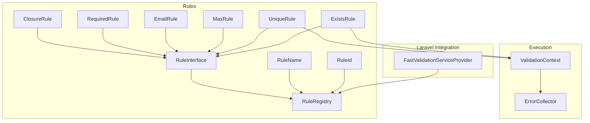
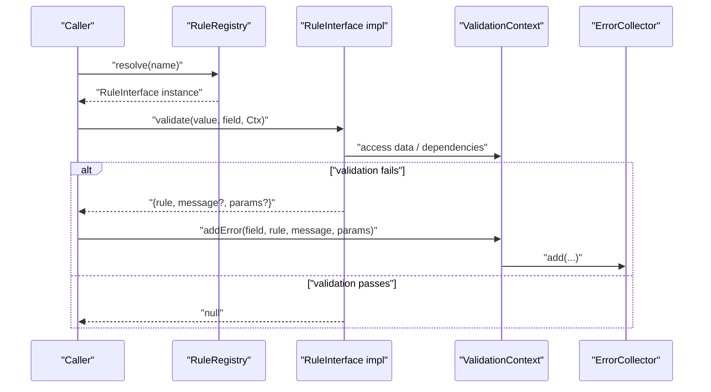
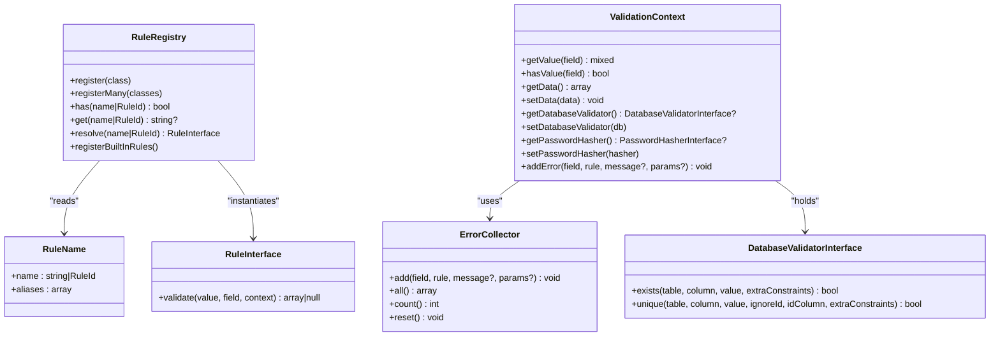

# Custom Rule Development

<cite>
**Referenced Files in This Document**
- [RuleInterface.php](file://src/Rules/RuleInterface.php)
- [RuleName.php](file://src/Rules/RuleName.php)
- [RuleRegistry.php](file://src/Rules/RuleRegistry.php)
- [RuleId.php](file://src/Rules/RuleId.php)
- [ValidationContext.php](file://src/Execution/ValidationContext.php)
- [ErrorCollector.php](file://src/Execution/ErrorCollector.php)
- [ClosureRule.php](file://src/Rules/ClosureRule.php)
- [RequiredRule.php](file://src/Rules/RequiredRule.php)
- [EmailRule.php](file://src/Rules/EmailRule.php)
- [MaxRule.php](file://src/Rules/MaxRule.php)
- [UniqueRule.php](file://src/Rules/UniqueRule.php)
- [ExistsRule.php](file://src/Rules/ExistsRule.php)
- [DatabaseValidatorInterface.php](file://src/Rules/DatabaseValidatorInterface.php)
- [FastValidationServiceProvider.php](file://src/Laravel/FastValidationServiceProvider.php)
- [RuleRegistryTest.php](file://tests/Unit/RuleRegistryTest.php)
</cite>

## Table of Contents
1. [Introduction](#introduction)
2. [Project Structure](#project-structure)
3. [Core Components](#core-components)
4. [Architecture Overview](#architecture-overview)
5. [Detailed Component Analysis](#detailed-component-analysis)
6. [Dependency Analysis](#dependency-analysis)
7. [Performance Considerations](#performance-considerations)
8. [Troubleshooting Guide](#troubleshooting-guide)
9. [Conclusion](#conclusion)
10. [Appendices](#appendices)

## Introduction
This guide explains how to develop custom validation rules for the validation engine. It covers the RuleInterface contract, the RuleName attribute for automatic registration and aliasing, rule parameter handling, validation logic implementation, error reporting, context-aware validation, dependency injection via ValidationContext, and integration with the RuleRegistry system. It also provides step-by-step examples progressing from simple closure-based rules to complex class-based implementations, along with best practices for performance, memory management, error handling, and testing.

## Project Structure
The validation subsystem centers around:
- RuleInterface: the core contract for all rules
- RuleName: attribute for declaring rule names and aliases
- RuleRegistry: registry and resolver for rules
- RuleId: enumeration of built-in rule identifiers
- ValidationContext: contextual data and dependencies (e.g., database validator, password hasher)
- Built-in rules: examples of simple and complex implementations
- Laravel integration: service provider wiring and rule registration

**Diagram sources**
- [RuleInterface.php](file://src/Rules/RuleInterface.php#L9-L15)
- [RuleName.php](file://src/Rules/RuleName.php#L9-L17)
- [RuleRegistry.php](file://src/Rules/RuleRegistry.php#L14-L301)
- [RuleId.php](file://src/Rules/RuleId.php#L10-L113)
- [ClosureRule.php](file://src/Rules/ClosureRule.php#L21-L50)
- [RequiredRule.php](file://src/Rules/RequiredRule.php#L10-L28)
- [EmailRule.php](file://src/Rules/EmailRule.php#L10-L29)
- [MaxRule.php](file://src/Rules/MaxRule.php#L10-L47)
- [UniqueRule.php](file://src/Rules/UniqueRule.php#L10-L45)
- [ExistsRule.php](file://src/Rules/ExistsRule.php#L10-L43)
- [ValidationContext.php](file://src/Execution/ValidationContext.php#L7-L97)
- [ErrorCollector.php](file://src/Execution/ErrorCollector.php#L7-L50)
- [FastValidationServiceProvider.php](file://src/Laravel/FastValidationServiceProvider.php#L12-L53)

**Section sources**
- [RuleInterface.php](file://src/Rules/RuleInterface.php#L9-L15)
- [RuleName.php](file://src/Rules/RuleName.php#L9-L17)
- [RuleRegistry.php](file://src/Rules/RuleRegistry.php#L14-L301)
- [RuleId.php](file://src/Rules/RuleId.php#L10-L113)
- [ValidationContext.php](file://src/Execution/ValidationContext.php#L7-L97)
- [ErrorCollector.php](file://src/Execution/ErrorCollector.php#L7-L50)
- [FastValidationServiceProvider.php](file://src/Laravel/FastValidationServiceProvider.php#L12-L53)

## Core Components
- RuleInterface: Defines the validate method that receives the field value, field name, and ValidationContext, returning either null (pass) or an associative array containing the rule name and optional message/params.
- RuleName: PHP attribute applied to rule classes to declare the primary rule name (string or RuleId) and optional aliases.
- RuleRegistry: Registers rules by reading RuleName attributes, supports has/get/resolve, and provides bulk registration of built-in rules.
- RuleId: Strongly-typed enumeration of built-in rule identifiers used as RuleName values.
- ValidationContext: Provides access to input data, nested field resolution, and dependency injectors (e.g., database validator, password hasher), plus error collection hook.
- ErrorCollector: Aggregates validation errors with rule, params, and message fields.

Key implementation requirements:
- validate must return null on pass or an array with at least the rule key; optional keys include message and params.
- Use ValidationContext to access related fields and injected services.
- Use RuleRegistry::resolve to instantiate rules by name, alias, or RuleId.

**Section sources**
- [RuleInterface.php](file://src/Rules/RuleInterface.php#L9-L15)
- [RuleName.php](file://src/Rules/RuleName.php#L9-L17)
- [RuleRegistry.php](file://src/Rules/RuleRegistry.php#L14-L190)
- [RuleId.php](file://src/Rules/RuleId.php#L10-L113)
- [ValidationContext.php](file://src/Execution/ValidationContext.php#L7-L97)
- [ErrorCollector.php](file://src/Execution/ErrorCollector.php#L7-L50)

## Architecture Overview
The rule lifecycle:
- Registration: Rule classes are annotated with RuleName and registered via RuleRegistry. Built-in rules are registered automatically by the service provider.
- Resolution: Consumers resolve a rule by name, alias, or RuleId to an instance implementing RuleInterface.
- Execution: The rule’s validate method is invoked with the current value, field name, and ValidationContext. On failure, the rule returns an array with rule identity and optional message/params. The framework collects errors via ValidationContext and ErrorCollector.

**Diagram sources**
- [RuleRegistry.php](file://src/Rules/RuleRegistry.php#L180-L190)
- [RuleInterface.php](file://src/Rules/RuleInterface.php#L11-L14)
- [ValidationContext.php](file://src/Execution/ValidationContext.php#L93-L96)
- [ErrorCollector.php](file://src/Execution/ErrorCollector.php#L17-L25)

## Detailed Component Analysis

### RuleInterface Contract
- Purpose: Standardize rule execution across the system.
- Method signature: validate(mixed $value, string $field, ValidationContext $context): ?array
- Return semantics:
  - null indicates pass
  - array with rule key indicates fail; optional message and params can be included

Best practices:
- Keep validate pure and deterministic
- Avoid heavy allocations inside validate; cache expensive computations if needed
- Use ValidationContext to access related fields and injected services

**Section sources**
- [RuleInterface.php](file://src/Rules/RuleInterface.php#L9-L15)

### RuleName Attribute and Automatic Registration
- Usage: Apply #[RuleName] to rule classes with either a string name or a RuleId constant.
- Aliases: Optional array of aliases mapped to the primary rule name.
- Registration: RuleRegistry reads attributes via reflection and registers names and aliases, guarding against duplicates and collisions.

Guidelines:
- Choose a unique primary name and concise aliases
- Prefer RuleId constants for built-in rules to avoid typos
- Ensure all rule classes have RuleName; otherwise registration will throw

**Section sources**
- [RuleName.php](file://src/Rules/RuleName.php#L9-L17)
- [RuleRegistry.php](file://src/Rules/RuleRegistry.php#L30-L116)

### RuleRegistry: Resolution and Built-in Rules
- Methods:
  - register(class-string): reads RuleName and registers name/aliases
  - registerMany(classes): bulk registration
  - has(name|RuleId): existence check
  - get(name|RuleId): resolves to rule class string
  - resolve(name|RuleId): instantiates the rule class
  - registerBuiltInRules(): registers all built-in rules
- Behavior:
  - Enforces uniqueness and prevents conflicts between names and aliases
  - Supports lookup by primary name or alias

Integration:
- Laravel service provider binds RuleRegistry as a singleton and registers built-in rules during container boot.

**Section sources**
- [RuleRegistry.php](file://src/Rules/RuleRegistry.php#L14-L301)
- [FastValidationServiceProvider.php](file://src/Laravel/FastValidationServiceProvider.php#L14-L30)

### ValidationContext and Dependency Injection
- Data access:
  - getValue(field): supports simple and dot-notation nested fields
  - hasValue(field): checks presence of simple or nested fields
  - getData/setData: full dataset access
- Dependencies:
  - getDatabaseValidator/setDatabaseValidator
  - getPasswordHasher/setPasswordHasher
- Error reporting:
  - addError(field, rule, message?, params?): delegates to ErrorCollector

Usage patterns:
- Access sibling fields for cross-field validation
- Inject external services (e.g., database validators) via setters
- Report errors with structured params for message interpolation

**Section sources**
- [ValidationContext.php](file://src/Execution/ValidationContext.php#L17-L96)

### ErrorCollector
- Aggregates errors per field with rule, params, and message
- Provides reset, hasErrors, count, and all accessors
- Used by ValidationContext.addError to record failures

**Section sources**
- [ErrorCollector.php](file://src/Execution/ErrorCollector.php#L7-L50)

### Example Rules: From Simple to Complex

#### Simple Rule: RequiredRule
- Validates absence of null, empty string, or empty array
- Returns null on pass; returns array with rule key on fail
- Demonstrates minimal logic and straightforward return shape

Implementation notes:
- No constructor parameters
- Uses strict type checks for robustness

**Section sources**
- [RequiredRule.php](file://src/Rules/RequiredRule.php#L10-L28)

#### Simple Rule: EmailRule
- Passes on null; validates non-null strings with filter_var
- Returns array with rule key on fail

Implementation notes:
- Guard against non-string values
- Leverages PHP’s filter_var for correctness

**Section sources**
- [EmailRule.php](file://src/Rules/EmailRule.php#L10-L29)

#### Parameterized Rule: MaxRule
- Accepts a numeric max via constructor
- Handles arrays, strings, and numeric types differently
- Returns array with rule key and params indicating type and limit

Implementation notes:
- Use params to support localized messages and dynamic formatting
- Consider encoding type-specific constraints for clarity

**Section sources**
- [MaxRule.php](file://src/Rules/MaxRule.php#L10-L47)

#### Context-Aware Rule: UniqueRule
- Uses ValidationContext.getDatabaseValidator to check uniqueness
- Returns null if validator is unavailable (graceful degradation)
- Returns array with rule key on violation

Implementation notes:
- Requires database validator to be injected into ValidationContext
- Supports ignore id and extra constraints for advanced scenarios

**Section sources**
- [UniqueRule.php](file://src/Rules/UniqueRule.php#L10-L45)
- [DatabaseValidatorInterface.php](file://src/Rules/DatabaseValidatorInterface.php#L11-L36)
- [ValidationContext.php](file://src/Execution/ValidationContext.php#L23-L41)

#### Context-Aware Rule: ExistsRule
- Similar pattern to UniqueRule but checks existence instead of uniqueness
- Graceful handling when database validator is absent

**Section sources**
- [ExistsRule.php](file://src/Rules/ExistsRule.php#L10-L43)
- [DatabaseValidatorInterface.php](file://src/Rules/DatabaseValidatorInterface.php#L11-L36)
- [ValidationContext.php](file://src/Execution/ValidationContext.php#L23-L41)

#### Closure-Based Rule: ClosureRule
- Wraps a Closure to conform to RuleInterface
- Captures the fail message and returns it in the failure array
- Useful for quick inline validations without defining a class

Implementation notes:
- The callback follows a conventional signature compatible with Laravel-style closures
- Ensures consistent return shape for the framework

**Section sources**
- [ClosureRule.php](file://src/Rules/ClosureRule.php#L21-L50)

### Step-by-Step: Developing Custom Rules

#### Step 1: Define the Rule Name and Aliases
- Choose a primary name (preferably a RuleId constant for built-ins)
- Optionally define aliases for discoverability
- Apply #[RuleName] to your rule class

Reference:
- [RuleName.php](file://src/Rules/RuleName.php#L9-L17)

#### Step 2: Implement RuleInterface
- Implement validate with the required signature
- Return null for pass; return array with rule key for fail
- Optionally include message and params for richer error reporting

Reference:
- [RuleInterface.php](file://src/Rules/RuleInterface.php#L9-L15)

#### Step 3: Handle Parameters
- Accept constructor parameters for configuration (e.g., max, table, column)
- Validate parameters early if needed
- Use params in the return array to carry constraint details

References:
- [MaxRule.php](file://src/Rules/MaxRule.php#L14-L17)
- [UniqueRule.php](file://src/Rules/UniqueRule.php#L18-L25)

#### Step 4: Access Context and Dependencies
- Use ValidationContext.getValue/hasValue for cross-field checks
- Inject external services (e.g., database validator) via ValidationContext setters
- Report errors via ValidationContext.addError

References:
- [ValidationContext.php](file://src/Execution/ValidationContext.php#L43-L96)
- [UniqueRule.php](file://src/Rules/UniqueRule.php#L33-L41)
- [ExistsRule.php](file://src/Rules/ExistsRule.php#L29-L37)

#### Step 5: Register and Resolve
- Register your rule class so it can be resolved by name or alias
- Use RuleRegistry::resolve to obtain an instance
- Integrate with Laravel via the service provider if applicable

References:
- [RuleRegistry.php](file://src/Rules/RuleRegistry.php#L30-L116)
- [RuleRegistry.php](file://src/Rules/RuleRegistry.php#L180-L190)
- [FastValidationServiceProvider.php](file://src/Laravel/FastValidationServiceProvider.php#L16-L27)

#### Step 6: Test Your Rule
- Verify pass/fail conditions for various inputs
- Test parameterized behavior and error params
- Validate context-aware logic (e.g., cross-field checks)
- Ensure no memory leaks or excessive allocations

References:
- [RuleRegistryTest.php](file://tests/Unit/RuleRegistryTest.php)

## Dependency Analysis
- RuleRegistry depends on:
  - ReflectionClass for reading RuleName attributes
  - RuleName and RuleId for metadata
  - RuleInterface implementations for instantiation
- ValidationContext depends on:
  - ErrorCollector for error aggregation
  - Optional external services (e.g., DatabaseValidatorInterface) for context-aware rules
- Built-in rules depend on:
  - ValidationContext for data and dependencies
  - DatabaseValidatorInterface for database-backed rules

**Diagram sources**
- [RuleRegistry.php](file://src/Rules/RuleRegistry.php#L14-L301)
- [RuleName.php](file://src/Rules/RuleName.php#L9-L17)
- [RuleInterface.php](file://src/Rules/RuleInterface.php#L9-L15)
- [ValidationContext.php](file://src/Execution/ValidationContext.php#L7-L97)
- [ErrorCollector.php](file://src/Execution/ErrorCollector.php#L7-L50)
- [DatabaseValidatorInterface.php](file://src/Rules/DatabaseValidatorInterface.php#L11-L36)

**Section sources**
- [RuleRegistry.php](file://src/Rules/RuleRegistry.php#L14-L301)
- [ValidationContext.php](file://src/Execution/ValidationContext.php#L7-L97)
- [ErrorCollector.php](file://src/Execution/ErrorCollector.php#L7-L50)
- [DatabaseValidatorInterface.php](file://src/Rules/DatabaseValidatorInterface.php#L11-L36)

## Performance Considerations
- Minimize allocations inside validate:
  - Reuse compiled regex objects or caches if used frequently
  - Avoid repeated string conversions or expensive operations
- Short-circuit early:
  - Return null immediately for null values when appropriate
  - Skip heavy checks for non-applicable types
- Favor primitive comparisons:
  - Use is_* checks to branch efficiently
- Avoid global state:
  - Keep rule instances stateless or clearly encapsulated
- Memory management:
  - Do not retain references to large datasets in rule instances
  - Clear temporary buffers after use
- Error reporting:
  - Keep params small and meaningful to reduce message interpolation overhead

[No sources needed since this section provides general guidance]

## Troubleshooting Guide
Common issues and resolutions:
- Unknown rule name:
  - Ensure the rule class is registered and has #[RuleName]; resolve throws if not found
- Duplicate name or alias:
  - RuleRegistry guards against duplicates; fix conflicting registrations
- Missing dependency:
  - Context-aware rules may return null if the required dependency is not injected; set it via ValidationContext setters
- Incorrect return shape:
  - validate must return null or an array with at least the rule key; missing rule key causes downstream errors
- Testing:
  - Use unit tests to assert pass/fail behavior and error params
  - Validate cross-field logic using ValidationContext with controlled data

**Section sources**
- [RuleRegistry.php](file://src/Rules/RuleRegistry.php#L180-L190)
- [RuleRegistry.php](file://src/Rules/RuleRegistry.php#L55-L78)
- [ValidationContext.php](file://src/Execution/ValidationContext.php#L93-L96)
- [RuleInterface.php](file://src/Rules/RuleInterface.php#L11-L14)
- [RuleRegistryTest.php](file://tests/Unit/RuleRegistryTest.php)

## Conclusion
By adhering to the RuleInterface contract, annotating rules with RuleName, and leveraging ValidationContext for dependencies, you can build robust, testable, and efficient validation rules. Use RuleRegistry for discovery and resolution, and follow the provided examples to implement simple closures or complex class-based rules. Apply the best practices here to ensure optimal performance and maintainability.

[No sources needed since this section summarizes without analyzing specific files]

## Appendices

### Appendix A: Rule Development Checklist
- [ ] Define #[RuleName] with unique primary name and optional aliases
- [ ] Implement validate with correct return shape
- [ ] Handle parameters via constructor and validate inputs
- [ ] Access related fields and dependencies via ValidationContext
- [ ] Return structured params for rich error messages
- [ ] Register rule class with RuleRegistry
- [ ] Write unit tests covering pass/fail and edge cases
- [ ] Benchmark performance and optimize hot paths

[No sources needed since this section provides general guidance]