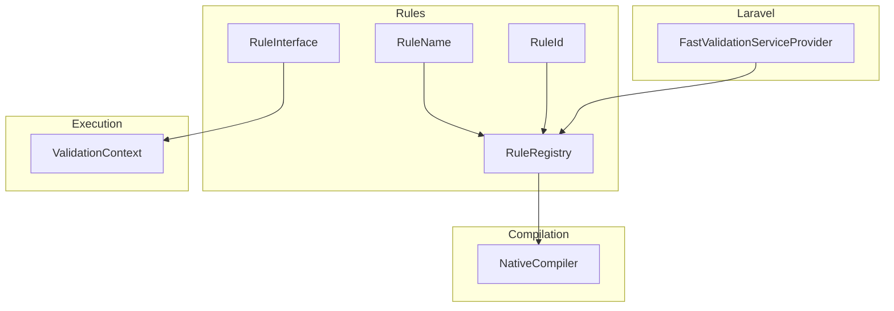
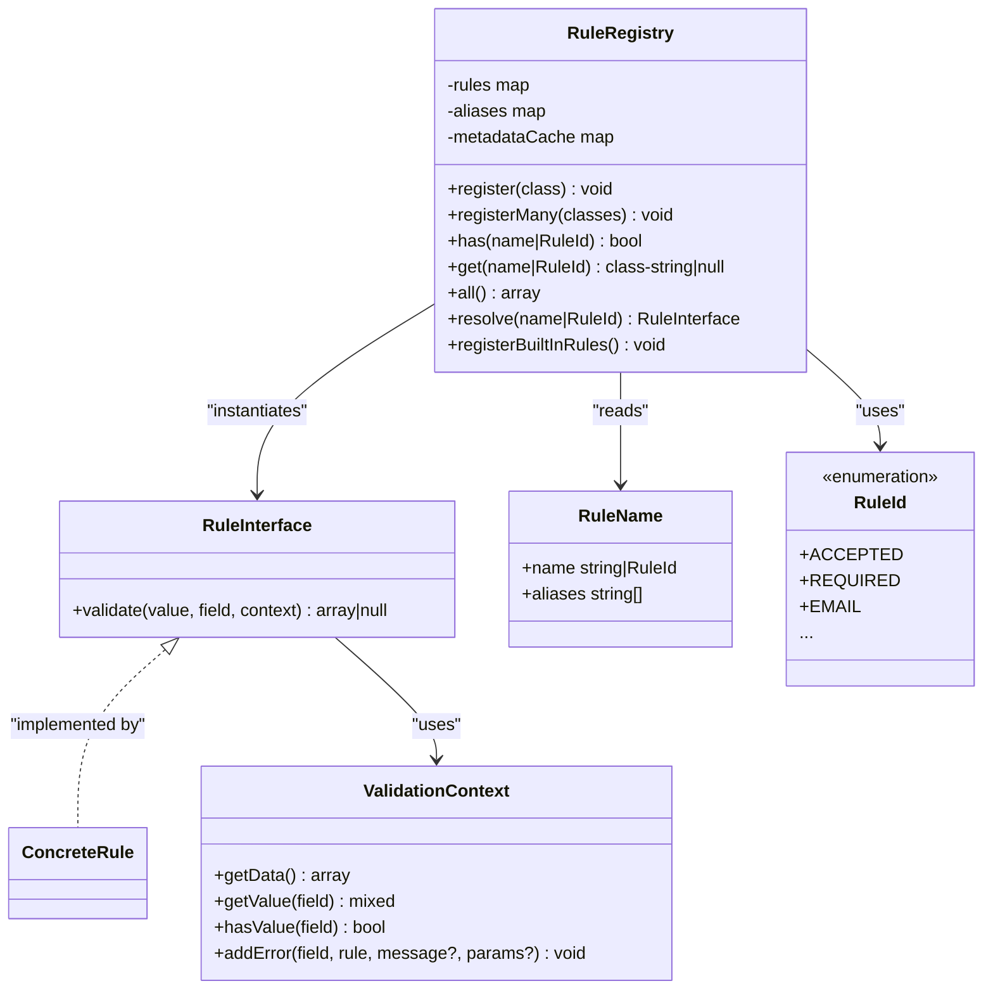
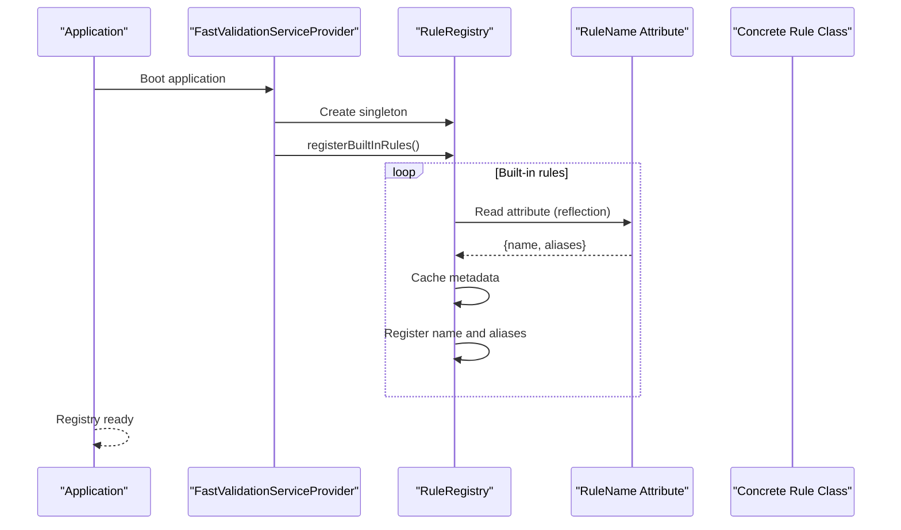
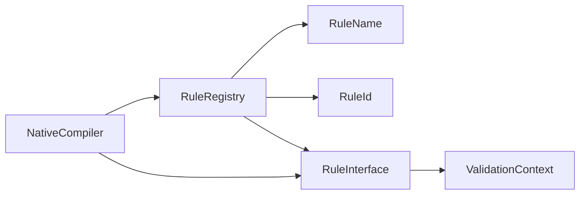
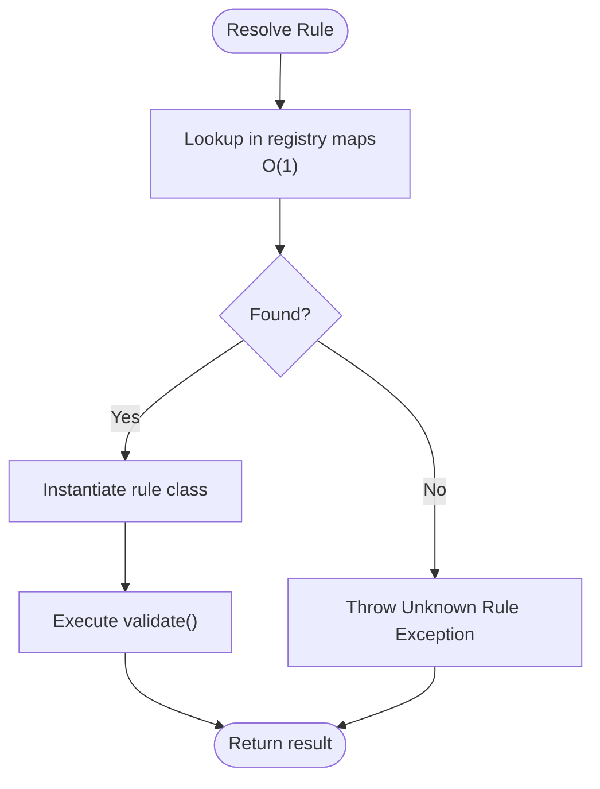

# Rule Architecture

<cite>
**Referenced Files in This Document**
- [RuleInterface.php](file://src/Rules/RuleInterface.php)
- [RuleRegistry.php](file://src/Rules/RuleRegistry.php)
- [RuleName.php](file://src/Rules/RuleName.php)
- [RuleId.php](file://src/Rules/RuleId.php)
- [ValidationContext.php](file://src/Execution/ValidationContext.php)
- [RequiredRule.php](file://src/Rules/RequiredRule.php)
- [EmailRule.php](file://src/Rules/EmailRule.php)
- [BetweenRule.php](file://src/Rules/BetweenRule.php)
- [NativeCompiler.php](file://src/Compilation/NativeCompiler.php)
- [FastValidationServiceProvider.php](file://src/Laravel/FastValidationServiceProvider.php)
- [RuleRegistryTest.php](file://tests/Unit/RuleRegistryTest.php)
- [RuleIdTest.php](file://tests/Unit/Rules/RuleIdTest.php)
</cite>

## Table of Contents
1. [Introduction](#introduction)
2. [Project Structure](#project-structure)
3. [Core Components](#core-components)
4. [Architecture Overview](#architecture-overview)
5. [Detailed Component Analysis](#detailed-component-analysis)
6. [Dependency Analysis](#dependency-analysis)
7. [Performance Considerations](#performance-considerations)
8. [Troubleshooting Guide](#troubleshooting-guide)
9. [Conclusion](#conclusion)
10. [Appendices](#appendices)

## Introduction
This document describes the foundational rule architecture used by the validation engine. It covers the RuleInterface contract, the RuleRegistry central management system, the RuleName attribute system for automatic rule naming and aliasing, and the RuleId enumeration for internal rule identification. It also includes practical examples of rule registration, resolution, and lifecycle management, along with performance considerations for rule lookup and instantiation.

## Project Structure
The rule architecture spans several packages:
- Rules: Contract definition, registry, naming attributes, and enumerations
- Execution: Runtime context used by rules during validation
- Compilation: Optimized code generation that inlines frequently used rules
- Laravel integration: Service provider that registers built-in rules and wires the registry

**Diagram sources**
- [RuleInterface.php](file://src/Rules/RuleInterface.php#L9-L15)
- [RuleName.php](file://src/Rules/RuleName.php#L9-L17)
- [RuleId.php](file://src/Rules/RuleId.php#L10-L113)
- [RuleRegistry.php](file://src/Rules/RuleRegistry.php#L14-L301)
- [ValidationContext.php](file://src/Execution/ValidationContext.php#L7-L97)
- [NativeCompiler.php](file://src/Compilation/NativeCompiler.php#L17-L309)
- [FastValidationServiceProvider.php](file://src/Laravel/FastValidationServiceProvider.php#L12-L30)

**Section sources**
- [RuleInterface.php](file://src/Rules/RuleInterface.php#L1-L16)
- [RuleRegistry.php](file://src/Rules/RuleRegistry.php#L1-L302)
- [RuleName.php](file://src/Rules/RuleName.php#L1-L18)
- [RuleId.php](file://src/Rules/RuleId.php#L1-L114)
- [ValidationContext.php](file://src/Execution/ValidationContext.php#L1-L98)
- [NativeCompiler.php](file://src/Compilation/NativeCompiler.php#L1-L310)
- [FastValidationServiceProvider.php](file://src/Laravel/FastValidationServiceProvider.php#L1-L54)

## Core Components
- RuleInterface: Defines the standard validation rule API with a single method for validating values and returning structured error information.
- RuleRegistry: Central registry for mapping rule names and aliases to rule classes, with metadata caching and conflict detection.
- RuleName: Attribute applied to rule classes to declare their canonical name and aliases.
- RuleId: Strongly-typed enumeration of built-in rule identifiers used internally and for programmatic access.
- ValidationContext: Provides runtime access to input data and error collection during validation.

**Section sources**
- [RuleInterface.php](file://src/Rules/RuleInterface.php#L9-L15)
- [RuleRegistry.php](file://src/Rules/RuleRegistry.php#L14-L301)
- [RuleName.php](file://src/Rules/RuleName.php#L9-L17)
- [RuleId.php](file://src/Rules/RuleId.php#L10-L113)
- [ValidationContext.php](file://src/Execution/ValidationContext.php#L7-L97)

## Architecture Overview
The rule architecture follows a contract-first design:
- Rule classes implement RuleInterface and are annotated with RuleName to define their identity and aliases.
- RuleRegistry maintains two maps: primary names to classes and aliases to primary names, plus a static metadata cache keyed by class.
- ValidationContext supplies the runtime environment for rules to access data and report errors.
- NativeCompiler can inline frequently used rules into generated validators for performance.

**Diagram sources**
- [RuleInterface.php](file://src/Rules/RuleInterface.php#L9-L15)
- [ValidationContext.php](file://src/Execution/ValidationContext.php#L7-L97)
- [RuleName.php](file://src/Rules/RuleName.php#L9-L17)
- [RuleId.php](file://src/Rules/RuleId.php#L10-L113)
- [RuleRegistry.php](file://src/Rules/RuleRegistry.php#L14-L301)

## Detailed Component Analysis

### RuleInterface Contract
- Purpose: Standardize the validation rule API.
- Method: validate(value, field, context) -> array{rule: string, message?: string}|null
  - Parameters:
    - value: mixed value to validate
    - field: string field name for reporting
    - context: ValidationContext for accessing data and collecting errors
  - Return:
    - null if the value passes the rule
    - array with rule name and optional message/params if validation fails

Implementation examples:
- RequiredRule: Returns failure for null, empty string, or empty array; otherwise null.
- EmailRule: Skips validation on null; otherwise validates string format; returns failure on invalid email.
- BetweenRule: Computes size depending on type and compares against min/max; returns failure with type and bounds.

**Section sources**
- [RuleInterface.php](file://src/Rules/RuleInterface.php#L9-L15)
- [RequiredRule.php](file://src/Rules/RequiredRule.php#L10-L28)
- [EmailRule.php](file://src/Rules/EmailRule.php#L10-L29)
- [BetweenRule.php](file://src/Rules/BetweenRule.php#L10-L60)

### RuleRegistry: Central Management
Responsibilities:
- Registration:
  - register(class-string): Reads #[RuleName] attribute, caches metadata, and registers primary name and aliases; detects conflicts.
  - registerMany(classes): Bulk registration.
  - registerBuiltInRules(): Registers all built-in rules.
- Resolution:
  - has(name|RuleId): Checks existence by name, alias, or RuleId.
  - get(name|RuleId): Resolves class string by name, alias, or RuleId.
  - resolve(name|RuleId): Instantiates the rule class.
- Metadata caching:
  - Static metadataCache keyed by class stores canonical name and aliases to avoid repeated reflection.

Conflict resolution:
- Duplicate primary name across classes throws LogicException.
- Alias collisions with existing primary names or other aliases throw LogicException.
- Re-registering the same class is allowed.

Lifecycle:
- Registered at application startup via FastValidationServiceProvider singleton binding.

**Diagram sources**
- [FastValidationServiceProvider.php](file://src/Laravel/FastValidationServiceProvider.php#L14-L27)
- [RuleRegistry.php](file://src/Rules/RuleRegistry.php#L195-L300)
- [RuleName.php](file://src/Rules/RuleName.php#L9-L17)

**Section sources**
- [RuleRegistry.php](file://src/Rules/RuleRegistry.php#L14-L301)
- [FastValidationServiceProvider.php](file://src/Laravel/FastValidationServiceProvider.php#L12-L30)
- [RuleRegistryTest.php](file://tests/Unit/RuleRegistryTest.php#L16-L104)

### RuleName Attribute System
- Applied to rule classes via #[RuleName].
- Fields:
  - name: string or RuleId
  - aliases: array<string> (optional)
- Behavior:
  - During registration, RuleRegistry reads the attribute via reflection and caches metadata.
  - The canonical name becomes the primary key; aliases map to the canonical name.

Practical usage:
- RequiredRule uses #[RuleName(RuleId::REQUIRED)].
- MockRuleA uses #[RuleName('mock_rule', ['alias_a', 'alias_b'])].

**Section sources**
- [RuleName.php](file://src/Rules/RuleName.php#L9-L17)
- [RequiredRule.php](file://src/Rules/RequiredRule.php#L9-L10)
- [RuleRegistryTest.php](file://tests/Unit/RuleRegistryTest.php#L106-L131)

### RuleId Enumeration
- Purpose: Internal, strongly-typed identifiers for built-in rules.
- Values: Covers all built-in rules (e.g., accepted, required, email, etc.).
- Integration:
  - RuleName can accept a RuleId for the name field.
  - RuleRegistry supports resolving by RuleId in has(), get(), and resolve().

Verification:
- Tests confirm that all RuleId cases are registered and vice versa.

**Section sources**
- [RuleId.php](file://src/Rules/RuleId.php#L10-L113)
- [RuleRegistry.php](file://src/Rules/RuleRegistry.php#L133-L189)
- [RuleIdTest.php](file://tests/Unit/Rules/RuleIdTest.php#L13-L72)

### Practical Examples

- Registering built-in rules:
  - Done automatically by FastValidationServiceProvider::register() via RuleRegistry::registerBuiltInRules().
  - Example registration paths:
    - [FastValidationServiceProvider.php](file://src/Laravel/FastValidationServiceProvider.php#L16-L20)
    - [RuleRegistry.php](file://src/Rules/RuleRegistry.php#L195-L299)

- Resolving a rule by name:
  - Use RuleRegistry::resolve('required') to get a RuleInterface instance.
  - Example usage:
    - [RuleRegistryTest.php](file://tests/Unit/RuleRegistryTest.php#L73-L87)

- Resolving a rule by alias:
  - Use RuleRegistry::resolve('alias_a') to resolve to the same rule class.
  - Example usage:
    - [RuleRegistryTest.php](file://tests/Unit/RuleRegistryTest.php#L81-L87)

- Resolving a rule by RuleId:
  - Use RuleRegistry::resolve(RuleId::REQUIRED) to resolve to the required rule.
  - Example usage:
    - [RuleRegistryTest.php](file://tests/Unit/RuleRegistryTest.php#L89-L95)

- Lifecycle management:
  - Singleton registry created at app startup.
  - Rules are registered once and reused across validations.

**Section sources**
- [FastValidationServiceProvider.php](file://src/Laravel/FastValidationServiceProvider.php#L14-L30)
- [RuleRegistry.php](file://src/Rules/RuleRegistry.php#L195-L300)
- [RuleRegistryTest.php](file://tests/Unit/RuleRegistryTest.php#L73-L104)

## Dependency Analysis
- RuleRegistry depends on:
  - ReflectionClass for reading RuleName attributes
  - RuleName and RuleId for metadata
  - RuleInterface for instantiation
- Rule classes depend on:
  - RuleInterface for contract compliance
  - ValidationContext for data access and error reporting
- NativeCompiler depends on:
  - RuleInterface instances to inline logic
  - ReflectionClass to inspect rule internals for property extraction

**Diagram sources**
- [RuleRegistry.php](file://src/Rules/RuleRegistry.php#L32-L50)
- [RuleName.php](file://src/Rules/RuleName.php#L9-L17)
- [RuleId.php](file://src/Rules/RuleId.php#L10-L113)
- [RuleInterface.php](file://src/Rules/RuleInterface.php#L9-L15)
- [ValidationContext.php](file://src/Execution/ValidationContext.php#L7-L97)
- [NativeCompiler.php](file://src/Compilation/NativeCompiler.php#L131-L172)

**Section sources**
- [RuleRegistry.php](file://src/Rules/RuleRegistry.php#L32-L50)
- [NativeCompiler.php](file://src/Compilation/NativeCompiler.php#L131-L172)

## Performance Considerations
- Rule lookup:
  - O(1) average-time hash map lookups for rules and aliases.
  - Static metadata cache avoids repeated reflection overhead.
- Instantiation:
  - New instances per resolve() call; consider pooling if many instantiations occur in tight loops.
- Compiled validators:
  - NativeCompiler can inline frequently used rules (e.g., RequiredRule, EmailRule, MinRule, MaxRule) into generated code to reduce method calls and object allocations.
  - Inlining skips non-listed rules; others fall back to standard rule invocation.
- Parameter handling:
  - BetweenRule computes size per type; keep parameter lists minimal to reduce overhead.
- Caching:
  - Compiler keys include PHP version and compiler version to prevent stale cache usage.

**Diagram sources**
- [RuleRegistry.php](file://src/Rules/RuleRegistry.php#L180-L189)
- [NativeCompiler.php](file://src/Compilation/NativeCompiler.php#L131-L172)

**Section sources**
- [RuleRegistry.php](file://src/Rules/RuleRegistry.php#L180-L189)
- [NativeCompiler.php](file://src/Compilation/NativeCompiler.php#L131-L172)

## Troubleshooting Guide
Common issues and resolutions:
- Unknown rule exception:
  - Thrown when resolve() cannot find a rule by name, alias, or RuleId.
  - Verify registration and spelling.
  - Reference: [RuleRegistry.php](file://src/Rules/RuleRegistry.php#L184-L187)
- Duplicate rule name:
  - Thrown when two classes share the same canonical name.
  - Change one class’s RuleName or ensure only one registration occurs.
  - Reference: [RuleRegistry.php](file://src/Rules/RuleRegistry.php#L56-L63)
- Duplicate alias:
  - Thrown when an alias collides with an existing primary name or another alias.
  - Adjust aliases to be unique.
  - Reference: [RuleRegistry.php](file://src/Rules/RuleRegistry.php#L83-L112)
- Re-registering same class:
  - Allowed; subsequent registrations are idempotent.
  - Reference: [RuleRegistryTest.php](file://tests/Unit/RuleRegistryTest.php#L45-L52)

**Section sources**
- [RuleRegistry.php](file://src/Rules/RuleRegistry.php#L56-L63)
- [RuleRegistry.php](file://src/Rules/RuleRegistry.php#L83-L112)
- [RuleRegistry.php](file://src/Rules/RuleRegistry.php#L184-L187)
- [RuleRegistryTest.php](file://tests/Unit/RuleRegistryTest.php#L25-L52)

## Conclusion
The rule architecture provides a robust, extensible foundation for validation:
- A clear contract (RuleInterface) ensures consistent behavior across rules.
- RuleRegistry centralizes discovery and instantiation with efficient lookups and metadata caching.
- RuleName and RuleId enable automatic naming, aliasing, and internal identification.
- Integration with NativeCompiler enables high-performance compiled validators for common rules.
- The design supports both programmatic and string-based rule resolution, with strong conflict detection and predictable lifecycle management.

## Appendices

### API Definitions

- RuleInterface.validate
  - Parameters:
    - value: mixed
    - field: string
    - context: ValidationContext
  - Returns:
    - null on pass
    - array{rule: string, message?: string} on fail

- RuleRegistry methods
  - has(name|RuleId): bool
  - get(name|RuleId): class-string<RuleInterface>|null
  - resolve(name|RuleId): RuleInterface
  - register(class-string<RuleInterface>): void
  - registerMany(classes: class-string<RuleInterface>[]): void
  - registerBuiltInRules(): void
  - all(): array<string, class-string<RuleInterface>>

- RuleName attribute
  - Fields:
    - name: string|RuleId
    - aliases: string[] (default: [])

- RuleId enumeration
  - Built-in identifiers for all supported rules

**Section sources**
- [RuleInterface.php](file://src/Rules/RuleInterface.php#L9-L15)
- [RuleRegistry.php](file://src/Rules/RuleRegistry.php#L133-L190)
- [RuleName.php](file://src/Rules/RuleName.php#L9-L17)
- [RuleId.php](file://src/Rules/RuleId.php#L10-L113)