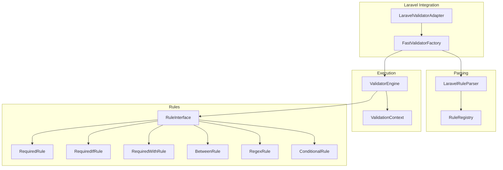
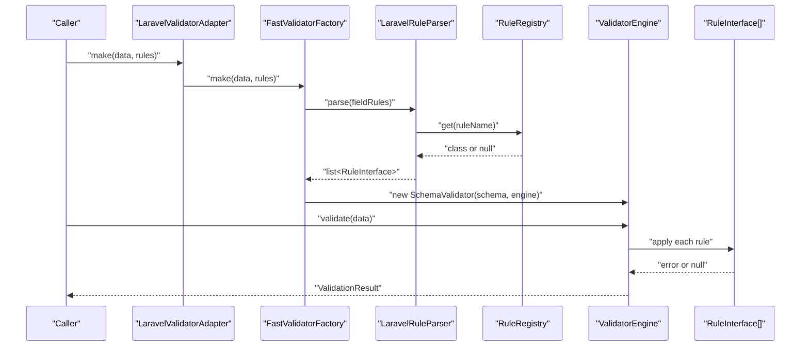
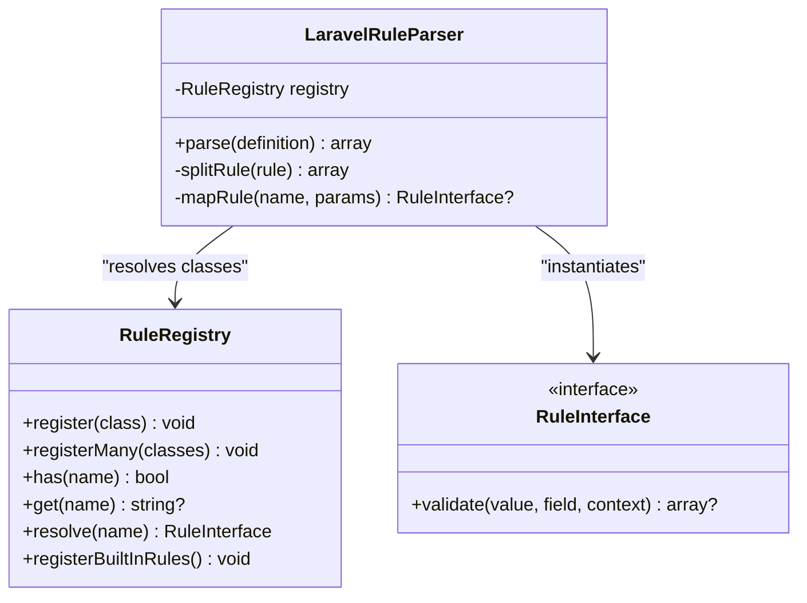
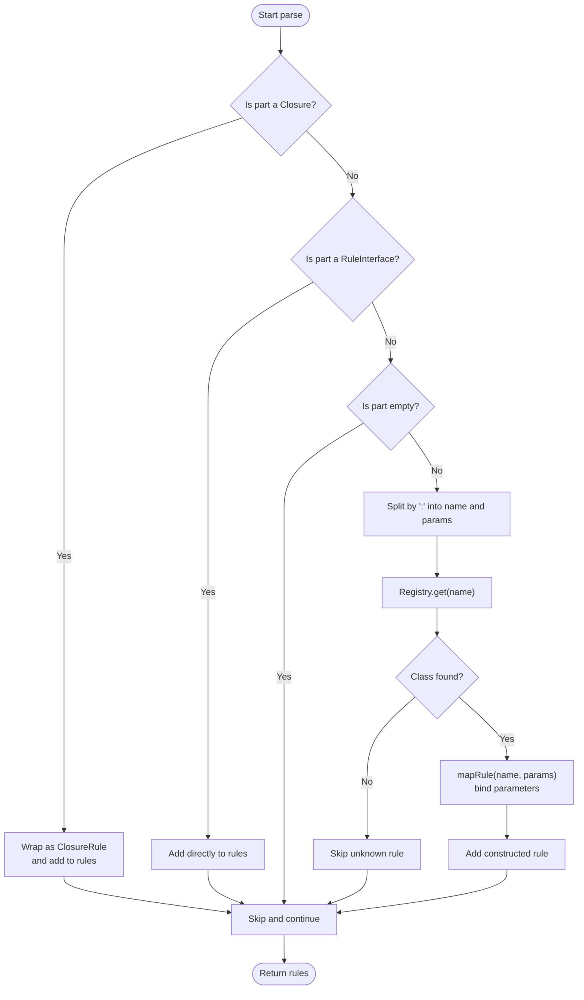
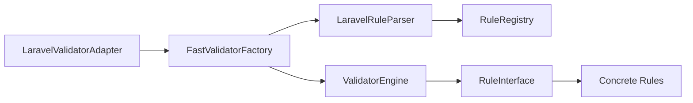

# Rule Parsing and Resolution

<cite>
**Referenced Files in This Document**
- [LaravelRuleParser.php](file://src/Laravel/LaravelRuleParser.php)
- [LaravelValidatorAdapter.php](file://src/Laravel/LaravelValidatorAdapter.php)
- [FastValidatorFactory.php](file://src/Laravel/FastValidatorFactory.php)
- [RuleRegistry.php](file://src/Rules/RuleRegistry.php)
- [RuleInterface.php](file://src/Rules/RuleInterface.php)
- [RuleName.php](file://src/Rules/RuleName.php)
- [RuleId.php](file://src/Rules/RuleId.php)
- [RequiredRule.php](file://src/Rules/RequiredRule.php)
- [RequiredIfRule.php](file://src/Rules/RequiredIfRule.php)
- [RequiredWithRule.php](file://src/Rules/RequiredWithRule.php)
- [BetweenRule.php](file://src/Rules/BetweenRule.php)
- [RegexRule.php](file://src/Rules/RegexRule.php)
- [ConditionalRule.php](file://src/Rules/ConditionalRule.php)
- [ValidationContext.php](file://src/Execution/ValidationContext.php)
- [ValidatorEngine.php](file://src/Execution/ValidatorEngine.php)
- [LaravelRuleParserTest.php](file://tests/Unit/LaravelRuleParserTest.php)
- [README.md](file://README.md)
</cite>

## Table of Contents
1. [Introduction](#introduction)
2. [Project Structure](#project-structure)
3. [Core Components](#core-components)
4. [Architecture Overview](#architecture-overview)
5. [Detailed Component Analysis](#detailed-component-analysis)
6. [Dependency Analysis](#dependency-analysis)
7. [Performance Considerations](#performance-considerations)
8. [Troubleshooting Guide](#troubleshooting-guide)
9. [Conclusion](#conclusion)
10. [Appendices](#appendices)

## Introduction
This document explains how Laravel-style validation rule strings are parsed and resolved into executable rule instances. It covers the LaravelRuleParser implementation, rule syntax parsing, parameter extraction, rule chain processing, and the LaravelValidatorAdapter integration for seamless Laravel compatibility. It also documents complex rule combinations, conditional rule parsing, parameter binding, error handling for malformed inputs, and performance considerations for high-throughput scenarios.

## Project Structure
The rule parsing pipeline lives primarily under the Laravel namespace and integrates with the Rules registry and execution engine. Key files include:
- LaravelRuleParser: Parses Laravel-style strings into RuleInterface instances
- RuleRegistry: Maps rule names/aliases to concrete rule classes
- FastValidatorFactory: Builds compiled schemas and wires parsing into the validation flow
- LaravelValidatorAdapter: Bridges Laravel’s Validator::make to the fast engine
- Rule implementations: Concrete validators implementing RuleInterface
- Execution engine: Applies parsed rules against data

**Diagram sources**
- [LaravelValidatorAdapter.php](file://src/Laravel/LaravelValidatorAdapter.php#L9-L55)
- [FastValidatorFactory.php](file://src/Laravel/FastValidatorFactory.php#L19-L120)
- [LaravelRuleParser.php](file://src/Laravel/LaravelRuleParser.php#L12-L61)
- [RuleRegistry.php](file://src/Rules/RuleRegistry.php#L14-L190)
- [ValidatorEngine.php](file://src/Execution/ValidatorEngine.php#L11-L98)
- [ValidationContext.php](file://src/Execution/ValidationContext.php#L7-L97)
- [RuleInterface.php](file://src/Rules/RuleInterface.php#L9-L15)
- [RequiredRule.php](file://src/Rules/RequiredRule.php#L10-L28)
- [RequiredIfRule.php](file://src/Rules/RequiredIfRule.php#L10-L66)
- [RequiredWithRule.php](file://src/Rules/RequiredWithRule.php#L10-L69)
- [BetweenRule.php](file://src/Rules/BetweenRule.php#L10-L60)
- [RegexRule.php](file://src/Rules/RegexRule.php#L10-L35)
- [ConditionalRule.php](file://src/Rules/ConditionalRule.php#L12-L69)

**Section sources**
- [LaravelRuleParser.php](file://src/Laravel/LaravelRuleParser.php#L12-L118)
- [FastValidatorFactory.php](file://src/Laravel/FastValidatorFactory.php#L19-L120)
- [LaravelValidatorAdapter.php](file://src/Laravel/LaravelValidatorAdapter.php#L9-L55)
- [RuleRegistry.php](file://src/Rules/RuleRegistry.php#L14-L190)
- [ValidatorEngine.php](file://src/Execution/ValidatorEngine.php#L11-L177)
- [ValidationContext.php](file://src/Execution/ValidationContext.php#L7-L97)
- [RuleInterface.php](file://src/Rules/RuleInterface.php#L9-L15)

## Core Components
- LaravelRuleParser: Converts Laravel-style strings or arrays into a list of RuleInterface instances. Handles closures, direct RuleInterface instances, and named rules. Splits rule names from parameters and constructs typed rule instances using RuleRegistry.
- RuleRegistry: Central registry mapping rule names/aliases to concrete classes, with metadata caching and conflict detection. Provides resolution and bulk registration of built-in rules.
- FastValidatorFactory: Orchestrates schema building, caching, and engine creation. Uses LaravelRuleParser to transform rule definitions into executable rules.
- LaravelValidatorAdapter: Implements Laravel’s Validator factory interface and delegates to FastValidatorFactory, enabling drop-in replacement in override mode.
- Rule implementations: Concrete validators (e.g., RequiredRule, RequiredIfRule, RequiredWithRule, BetweenRule, RegexRule, ConditionalRule) that implement RuleInterface and encapsulate validation logic.

**Section sources**
- [LaravelRuleParser.php](file://src/Laravel/LaravelRuleParser.php#L12-L118)
- [RuleRegistry.php](file://src/Rules/RuleRegistry.php#L14-L190)
- [FastValidatorFactory.php](file://src/Laravel/FastValidatorFactory.php#L19-L120)
- [LaravelValidatorAdapter.php](file://src/Laravel/LaravelValidatorAdapter.php#L9-L55)
- [RuleInterface.php](file://src/Rules/RuleInterface.php#L9-L15)

## Architecture Overview
The rule parsing and execution flow:

**Diagram sources**
- [LaravelValidatorAdapter.php](file://src/Laravel/LaravelValidatorAdapter.php#L27-L34)
- [FastValidatorFactory.php](file://src/Laravel/FastValidatorFactory.php#L51-L109)
- [LaravelRuleParser.php](file://src/Laravel/LaravelRuleParser.php#L28-L61)
- [RuleRegistry.php](file://src/Rules/RuleRegistry.php#L147-L190)
- [ValidatorEngine.php](file://src/Execution/ValidatorEngine.php#L33-L98)

## Detailed Component Analysis

### LaravelRuleParser
Responsibilities:
- Accepts either a pipe-delimited string or an array of strings/closures/RuleInterface instances
- Splits rule name from parameters using colon and comma delimiters
- Resolves rule class via RuleRegistry and constructs typed instances with appropriate parameter binding
- Supports special-case parameter binding for conditional and multi-parameter rules
- Skips empty parts and ignores unknown rules gracefully

Processing logic:
- Arrays are iterated; closures are wrapped as ClosureRule; direct RuleInterface instances are passed through
- Strings are split into name and optional parameters
- RuleRegistry.get resolves the class; mapRule applies strict parameter arity checks and type conversions
- Returns a list of RuleInterface instances ready for execution

Error handling:
- Unknown rule names return null from registry, causing the rule to be skipped
- Missing parameters for rules requiring them return null from mapRule, skipping construction

Parameter extraction and binding:
- Single-parameter rules: converts to int/float as needed
- Multi-parameter rules: validates presence of required parameters
- Special cases: conditional rules require at least two parameters; distinct supports flags

Examples of complex combinations:
- Chained rules: required|string|between:1,100
- Parameterized rules: in:a,b,c|regex:/^prefix/
- Conditional rules: required_if:other,1,2|required_with:foo,bar
- Mixed arrays: ['required', new SomeRule(), function(...) {...}]

**Section sources**
- [LaravelRuleParser.php](file://src/Laravel/LaravelRuleParser.php#L28-L118)
- [RuleRegistry.php](file://src/Rules/RuleRegistry.php#L147-L190)
- [LaravelRuleParserTest.php](file://tests/Unit/LaravelRuleParserTest.php#L23-L170)

#### Class relationships

**Diagram sources**
- [LaravelRuleParser.php](file://src/Laravel/LaravelRuleParser.php#L12-L118)
- [RuleRegistry.php](file://src/Rules/RuleRegistry.php#L14-L190)
- [RuleInterface.php](file://src/Rules/RuleInterface.php#L9-L15)

### RuleRegistry
Responsibilities:
- Registers rule classes via #[RuleName] attributes and caches metadata
- Prevents duplicate names and alias conflicts
- Provides has/get/resolve methods for rule lookup
- Bulk-loads built-in rules

Behavior:
- Metadata cache avoids repeated reflection
- get resolves aliases to primary names
- resolve throws when a rule is unknown

**Section sources**
- [RuleRegistry.php](file://src/Rules/RuleRegistry.php#L14-L190)
- [RuleName.php](file://src/Rules/RuleName.php#L10-L17)
- [RuleId.php](file://src/Rules/RuleId.php#L10-L113)

### FastValidatorFactory
Responsibilities:
- Creates validators compatible with Laravel’s Validator::make signature
- Builds CompiledSchema by parsing per-field rules
- Manages schema caching keyed by serialized rules
- Initializes ValidatorEngine with localization and performance settings

Integration points:
- Uses LaravelRuleParser to convert rule definitions
- Caches CompiledSchema to avoid recompilation
- Supports closures and objects in rule serialization by injecting object identity into cache keys

**Section sources**
- [FastValidatorFactory.php](file://src/Laravel/FastValidatorFactory.php#L19-L207)

### LaravelValidatorAdapter
Responsibilities:
- Implements Laravel’s Validator factory interface
- Delegates make() to FastValidatorFactory
- Exposes extend/replacer/resolver passthrough for compatibility

Compatibility:
- In override mode, routes Laravel’s Validator::make to the fast engine when feasible

**Section sources**
- [LaravelValidatorAdapter.php](file://src/Laravel/LaravelValidatorAdapter.php#L9-L55)

### Rule Implementations and Conditional Parsing
Concrete rules demonstrate parameter binding and context-aware validation:

- RequiredRule: Basic emptiness checks
- RequiredIfRule: Requires presence when another field equals specified values
- RequiredWithRule: Requires presence when any of specified fields are present
- BetweenRule: Numeric/string/array size bounds with type-aware sizing
- RegexRule: Pattern matching with type checks
- ConditionalRule: Wraps other rules and evaluates a condition to choose active rule lists

These rules rely on ValidationContext for cross-field access and on ValidatorEngine for implicit rule handling and bail/max-errors policies.

**Section sources**
- [RequiredRule.php](file://src/Rules/RequiredRule.php#L10-L28)
- [RequiredIfRule.php](file://src/Rules/RequiredIfRule.php#L10-L66)
- [RequiredWithRule.php](file://src/Rules/RequiredWithRule.php#L10-L69)
- [BetweenRule.php](file://src/Rules/BetweenRule.php#L10-L60)
- [RegexRule.php](file://src/Rules/RegexRule.php#L10-L35)
- [ConditionalRule.php](file://src/Rules/ConditionalRule.php#L12-L69)
- [ValidationContext.php](file://src/Execution/ValidationContext.php#L43-L73)
- [ValidatorEngine.php](file://src/Execution/ValidatorEngine.php#L127-L175)

#### Conditional rule parsing flow

**Diagram sources**
- [LaravelRuleParser.php](file://src/Laravel/LaravelRuleParser.php#L28-L118)
- [RuleRegistry.php](file://src/Rules/RuleRegistry.php#L147-L190)

## Dependency Analysis
Key dependencies:
- LaravelRuleParser depends on RuleRegistry for class resolution
- FastValidatorFactory composes LaravelRuleParser and builds CompiledSchema
- ValidatorEngine consumes RuleInterface instances and ValidationContext
- Rule implementations depend on ValidationContext for cross-field evaluation

Potential circular dependencies:
- None observed among core components; RuleInterface is a simple contract

External integration:
- LaravelValidatorAdapter implements Laravel’s factory interface for drop-in compatibility

**Diagram sources**
- [LaravelRuleParser.php](file://src/Laravel/LaravelRuleParser.php#L12-L118)
- [RuleRegistry.php](file://src/Rules/RuleRegistry.php#L14-L190)
- [FastValidatorFactory.php](file://src/Laravel/FastValidatorFactory.php#L19-L120)
- [LaravelValidatorAdapter.php](file://src/Laravel/LaravelValidatorAdapter.php#L9-L55)
- [ValidatorEngine.php](file://src/Execution/ValidatorEngine.php#L11-L98)
- [RuleInterface.php](file://src/Rules/RuleInterface.php#L9-L15)

**Section sources**
- [LaravelRuleParser.php](file://src/Laravel/LaravelRuleParser.php#L12-L118)
- [RuleRegistry.php](file://src/Rules/RuleRegistry.php#L14-L190)
- [FastValidatorFactory.php](file://src/Laravel/FastValidatorFactory.php#L19-L120)
- [LaravelValidatorAdapter.php](file://src/Laravel/LaravelValidatorAdapter.php#L9-L55)
- [ValidatorEngine.php](file://src/Execution/ValidatorEngine.php#L11-L98)
- [RuleInterface.php](file://src/Rules/RuleInterface.php#L9-L15)

## Performance Considerations
- Compile-once, validate-many: CompiledSchema reuse minimizes parsing overhead
- Schema caching: FastValidatorFactory serializes rules (including closures/objects) to compute stable cache keys; closures disable caching for that schema
- Implicit rule short-circuit: ValidatorEngine skips non-implicit rules on empty values, reducing unnecessary checks
- Fail-fast and max errors: Early termination reduces total work when configured
- Streaming APIs: Use stream/failures/each to process large datasets without materializing all results
- Chunked validation: Process batches to bound memory usage

Recommendations:
- Prefer arrays of strings for static rules to enable caching
- Avoid closures in frequently reused schemas when caching is desired
- Tune fail_fast and max_errors for your throughput and latency targets
- Use streaming APIs for datasets exceeding memory capacity

**Section sources**
- [FastValidatorFactory.php](file://src/Laravel/FastValidatorFactory.php#L177-L205)
- [ValidatorEngine.php](file://src/Execution/ValidatorEngine.php#L148-L175)
- [README.md](file://README.md#L266-L376)

## Troubleshooting Guide
Common issues and resolutions:
- Unknown rule name: The parser silently skips unknown rules. Verify rule names and aliases in RuleRegistry.
- Missing parameters: Rules requiring parameters (e.g., required_if, between) must receive sufficient arguments; otherwise they are not constructed.
- Malformed rule strings: Empty parts are skipped; ensure correct delimiter usage (pipe for chaining, colon for parameters, comma for parameter lists).
- Unsupported rule combinations: Only a subset of Laravel rules is supported in the fast path; unsupported rules are ignored by the parser. Use parallel mode and gradually migrate.
- Conditional logic: Ensure dependent fields exist and are accessible via ValidationContext dot notation for nested data.

Validation behavior verification:
- Tests confirm parsing of required, chained, parameterized, and closure rules; they also assert error payloads for failing rules.

**Section sources**
- [LaravelRuleParser.php](file://src/Laravel/LaravelRuleParser.php#L28-L118)
- [LaravelRuleParserTest.php](file://tests/Unit/LaravelRuleParserTest.php#L23-L170)
- [README.md](file://README.md#L504-L505)

## Conclusion
The LaravelRuleParser provides a robust bridge from Laravel-style rule strings to executable validators, leveraging a typed registry and strict parameter binding. Combined with FastValidatorFactory and ValidatorEngine, it enables high-throughput validation with caching, streaming, and configurable performance controls. LaravelValidatorAdapter ensures compatibility with existing Laravel applications, supporting both parallel and override modes.

## Appendices

### Example rule combinations and expectations
- Chained: required|string|max:255
- Parameterized: between:1,100|in:a,b,c
- Conditional: required_if:other,1,2|required_with:foo,bar
- Mixed arrays: ['required', new SomeRule(), function(...) {...}]
- File rules: file|image|mimes:jpg,png
- Size rules: min:5|max:10|size:7|between:3,8

**Section sources**
- [LaravelRuleParserTest.php](file://tests/Unit/LaravelRuleParserTest.php#L23-L170)
- [LaravelRuleParser.php](file://src/Laravel/LaravelRuleParser.php#L78-L116)