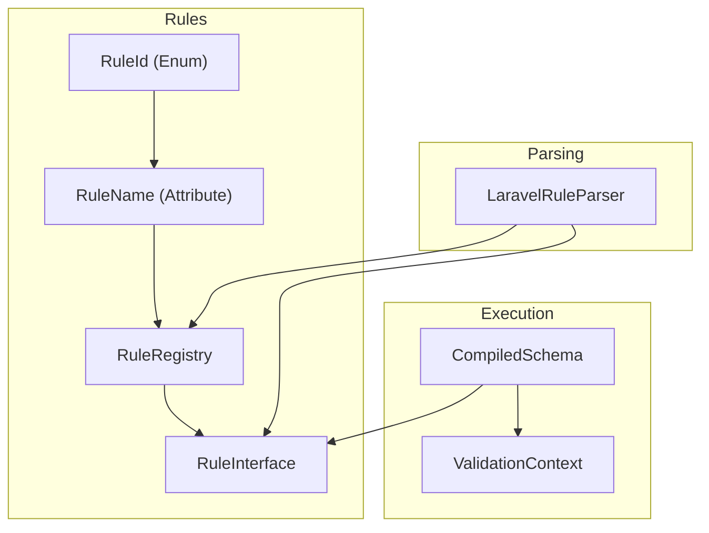
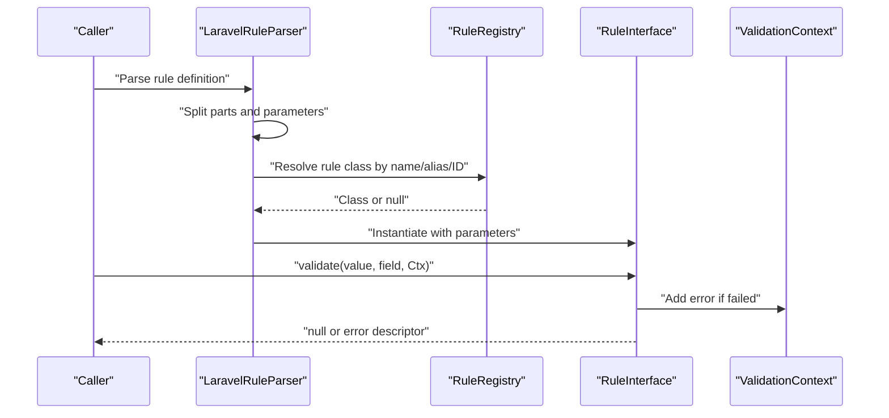
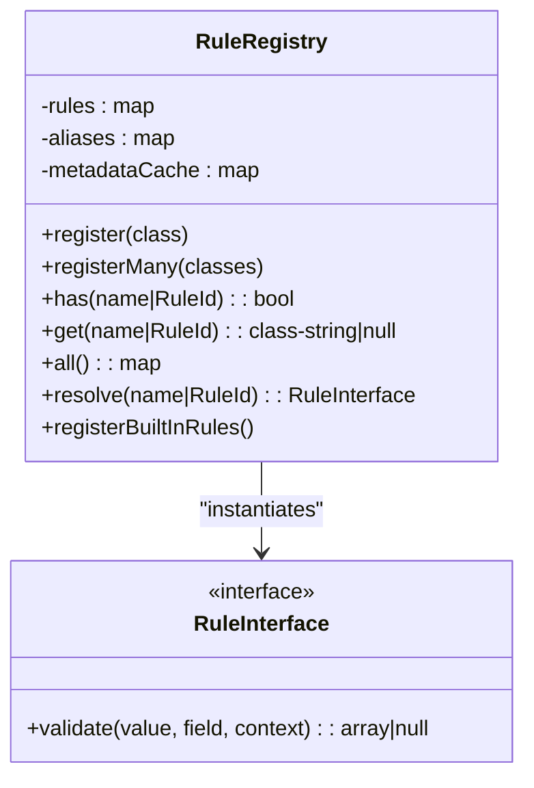
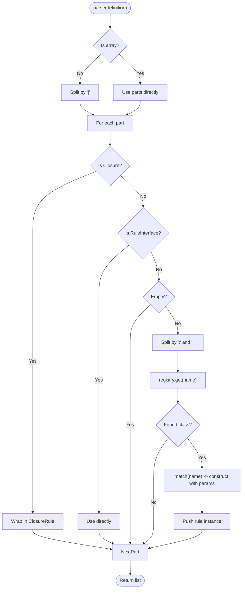
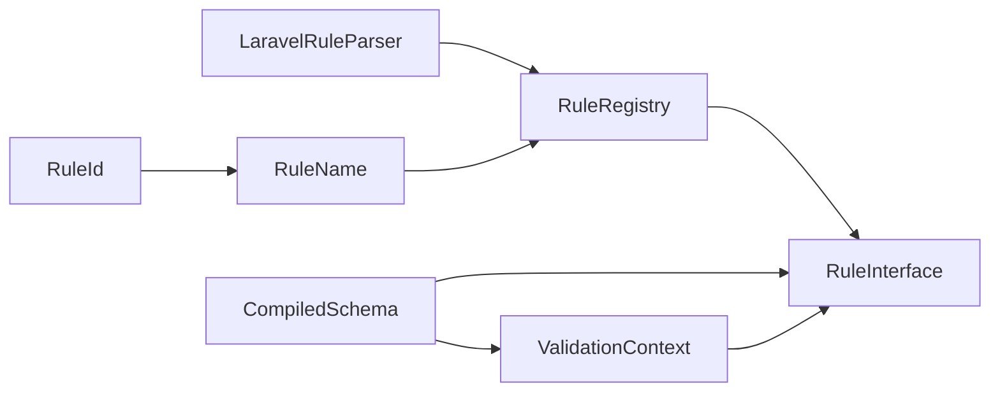

# Rule System

<cite>
**Referenced Files in This Document**
- [RuleRegistry.php](file://src/Rules/RuleRegistry.php)
- [RuleInterface.php](file://src/Rules/RuleInterface.php)
- [RuleName.php](file://src/Rules/RuleName.php)
- [RuleId.php](file://src/Rules/RuleId.php)
- [LaravelRuleParser.php](file://src/Laravel/LaravelRuleParser.php)
- [ValidationContext.php](file://src/Execution/ValidationContext.php)
- [CompiledSchema.php](file://src/Execution/CompiledSchema.php)
- [RequiredRule.php](file://src/Rules/RequiredRule.php)
- [StringTypeRule.php](file://src/Rules/StringTypeRule.php)
- [ArrayRule.php](file://src/Rules/ArrayRule.php)
- [FileRule.php](file://src/Rules/FileRule.php)
- [DateRule.php](file://src/Rules/DateRule.php)
- [SizeRule.php](file://src/Rules/SizeRule.php)
</cite>

## Table of Contents
1. [Introduction](#introduction)
2. [Project Structure](#project-structure)
3. [Core Components](#core-components)
4. [Architecture Overview](#architecture-overview)
5. [Detailed Component Analysis](#detailed-component-analysis)
6. [Dependency Analysis](#dependency-analysis)
7. [Performance Considerations](#performance-considerations)
8. [Troubleshooting Guide](#troubleshooting-guide)
9. [Conclusion](#conclusion)
10. [Appendices](#appendices)

## Introduction
This document explains the rule system architecture and built-in rules in the validation library. It covers the central RuleRegistry, the RuleInterface contract, rule categorization via attributes and IDs, and the complete catalog of 60+ built-in rules grouped by categories such as core, type, string, size, comparison, date, acceptance, array, and file. It also documents the rule registration process, custom rule development, rule attribute management, parsing of Laravel-style rule strings, parameter handling, and execution context. Practical examples of combining rules, conditional applications, and performance considerations are included.

## Project Structure
The rule system is centered around:
- A registry that maps rule names and aliases to rule classes
- A rule interface that defines the validation contract
- Attributes and enumerations that define rule metadata
- A parser that converts Laravel-style rule strings into executable rule instances
- An execution context that supplies data and error collection during validation
- Compiled schema orchestration that runs field-level validations

**Diagram sources**
- [RuleRegistry.php](file://src/Rules/RuleRegistry.php#L14-L302)
- [RuleInterface.php](file://src/Rules/RuleInterface.php#L9-L16)
- [RuleName.php](file://src/Rules/RuleName.php#L9-L18)
- [RuleId.php](file://src/Rules/RuleId.php#L10-L114)
- [LaravelRuleParser.php](file://src/Laravel/LaravelRuleParser.php#L12-L118)
- [ValidationContext.php](file://src/Execution/ValidationContext.php#L7-L98)
- [CompiledSchema.php](file://src/Execution/CompiledSchema.php#L9-L68)

**Section sources**
- [RuleRegistry.php](file://src/Rules/RuleRegistry.php#L14-L302)
- [RuleInterface.php](file://src/Rules/RuleInterface.php#L9-L16)
- [RuleName.php](file://src/Rules/RuleName.php#L9-L18)
- [RuleId.php](file://src/Rules/RuleId.php#L10-L114)
- [LaravelRuleParser.php](file://src/Laravel/LaravelRuleParser.php#L12-L118)
- [ValidationContext.php](file://src/Execution/ValidationContext.php#L7-L98)
- [CompiledSchema.php](file://src/Execution/CompiledSchema.php#L9-L68)

## Core Components
- RuleInterface: Defines the single method that validates a value and returns either null (pass) or an error descriptor with rule name and optional parameters.
- RuleName attribute: Applied to rule classes to declare the canonical name and optional aliases.
- RuleId enum: Centralized enumeration of all built-in rule identifiers.
- RuleRegistry: Central registry that registers rules, resolves names/aliases/IDs to classes, and instantiates rule instances.
- LaravelRuleParser: Parses Laravel-style rule strings into lists of RuleInterface instances, handling closures, direct instances, and parameterized rules.
- ValidationContext: Supplies field values, nested accessors, and error collection during validation.
- CompiledSchema: Orchestrates compiled field definitions and executes validation using a validator engine.

Key responsibilities:
- Registration and resolution of rules by name, alias, or ID
- Parsing of rule definitions with parameter extraction and mapping
- Execution of rules with typed parameters and contextual data access
- Error reporting with structured messages

**Section sources**
- [RuleInterface.php](file://src/Rules/RuleInterface.php#L9-L16)
- [RuleName.php](file://src/Rules/RuleName.php#L9-L18)
- [RuleId.php](file://src/Rules/RuleId.php#L10-L114)
- [RuleRegistry.php](file://src/Rules/RuleRegistry.php#L14-L302)
- [LaravelRuleParser.php](file://src/Laravel/LaravelRuleParser.php#L12-L118)
- [ValidationContext.php](file://src/Execution/ValidationContext.php#L7-L98)
- [CompiledSchema.php](file://src/Execution/CompiledSchema.php#L9-L68)

## Architecture Overview
The rule system follows a layered design:
- Metadata layer: RuleName and RuleId define canonical names and categorization
- Registry layer: RuleRegistry manages registration, alias mapping, and resolution
- Parsing layer: LaravelRuleParser transforms strings into typed rule instances
- Execution layer: ValidationContext provides data and errors; CompiledSchema orchestrates field-level validation

**Diagram sources**
- [LaravelRuleParser.php](file://src/Laravel/LaravelRuleParser.php#L28-L118)
- [RuleRegistry.php](file://src/Rules/RuleRegistry.php#L133-L190)
- [RuleInterface.php](file://src/Rules/RuleInterface.php#L14-L14)
- [ValidationContext.php](file://src/Execution/ValidationContext.php#L93-L96)

## Detailed Component Analysis

### RuleRegistry: Central Management
- Stores primary names and aliases mapped to rule classes
- Enforces uniqueness and prevents collisions between names and aliases
- Caches metadata from RuleName attributes for performance
- Provides registration for single and multiple rules, including built-in rules
- Supports lookup by name, alias, or RuleId, and resolves to instances

**Diagram sources**
- [RuleRegistry.php](file://src/Rules/RuleRegistry.php#L14-L302)
- [RuleInterface.php](file://src/Rules/RuleInterface.php#L9-L16)

**Section sources**
- [RuleRegistry.php](file://src/Rules/RuleRegistry.php#L14-L302)

### RuleInterface Contract
- Single method returning null on pass or an associative array containing the rule name and optional message/params on failure
- Accepts the raw value, field name, and ValidationContext for access to related data and error collection

**Section sources**
- [RuleInterface.php](file://src/Rules/RuleInterface.php#L9-L16)

### RuleName and RuleId: Attribute-Based Metadata
- RuleName attribute applied to rule classes declares the canonical name and optional aliases
- RuleId enum enumerates all built-in rule identifiers consistently across the system
- Used by RuleRegistry to populate metadata cache and enforce uniqueness

**Section sources**
- [RuleName.php](file://src/Rules/RuleName.php#L9-L18)
- [RuleId.php](file://src/Rules/RuleId.php#L10-L114)

### LaravelRuleParser: Parsing and Parameter Mapping
- Converts Laravel-style strings into typed rule instances
- Handles closures and direct RuleInterface instances
- Splits rule name from parameters using colon and comma separators
- Maps parameters to constructor arguments for each rule family (single, numeric, range, flags, etc.)
- Supports special-cased rules requiring multiple parameters or flags

**Diagram sources**
- [LaravelRuleParser.php](file://src/Laravel/LaravelRuleParser.php#L28-L118)
- [RuleRegistry.php](file://src/Rules/RuleRegistry.php#L147-L163)

**Section sources**
- [LaravelRuleParser.php](file://src/Laravel/LaravelRuleParser.php#L12-L118)

### ValidationContext: Execution Context
- Provides access to top-level and nested field values via dot notation
- Offers database validator and password hasher hooks for advanced rules
- Collects errors into an ErrorCollector abstraction

**Section sources**
- [ValidationContext.php](file://src/Execution/ValidationContext.php#L7-L98)

### CompiledSchema: Orchestration
- Builds compiled field definitions and exposes validation execution
- Delegates to a validator engine to apply compiled rules per field

**Section sources**
- [CompiledSchema.php](file://src/Execution/CompiledSchema.php#L9-L68)

### Built-in Rules Catalog and Categories
The system includes 60+ built-in rules. They are categorized by purpose and functionality:

- Core rules
  - required, nullable, sometimes, bail
  - present, missing, missing_if, missing_unless, missing_with, missing_with_all
  - conditional, closure
- Type rules
  - string, integer, numeric, array, boolean, alpha, alpha_dash, alpha_num, ascii, json, ulid, uuid, uppercase, lowercase
- String rules
  - regex, not_regex, starts_with, ends_with, doesnt_start_with, doesnt_end_with, extensions, mimes, mimetypes
- Size rules
  - size, min, max, digits, digits_between, min_file_size, max_file_size, multiple_of
- Comparison rules
  - same, different, gt, gte, lt, lte
- Date rules
  - date, date_format, date_equals, after, after_or_equal, before, before_or_equal
- Acceptance rules
  - accepted, accepted_if, declined, declined_if
- Array rules
  - distinct, list, required_array_keys
- File rules
  - file, image, dimensions, active_url, url, email, ip, mac_address, country, language, timezone, password

Note: The complete list is registered centrally and includes all built-in rule classes. The enumeration of RuleId covers all canonical names used across the system.

**Section sources**
- [RuleRegistry.php](file://src/Rules/RuleRegistry.php#L195-L300)
- [RuleId.php](file://src/Rules/RuleId.php#L10-L114)

### Rule Registration Process
- Apply RuleName attribute to each rule class with a canonical name and optional aliases
- Optionally register via RuleRegistry::register or bulk-register via RuleRegistry::registerBuiltInRules
- The registry caches metadata and enforces uniqueness across names and aliases

**Section sources**
- [RuleRegistry.php](file://src/Rules/RuleRegistry.php#L30-L128)
- [RuleName.php](file://src/Rules/RuleName.php#L9-L18)

### Custom Rule Development
- Implement RuleInterface with a validate method that returns null on pass or an error descriptor
- Annotate the class with RuleName to declare the canonical name and aliases
- Use ValidationContext to access related fields and report errors
- Register the rule class with RuleRegistry so it can be resolved by name or alias

**Section sources**
- [RuleInterface.php](file://src/Rules/RuleInterface.php#L9-L16)
- [RuleName.php](file://src/Rules/RuleName.php#L9-L18)
- [RuleRegistry.php](file://src/Rules/RuleRegistry.php#L133-L190)

### Rule Attribute Management
- RuleName carries the canonical name (string or RuleId) and an array of aliases
- RuleId ensures consistent canonical names across the system
- RuleRegistry caches metadata to avoid reflection overhead on repeated resolutions

**Section sources**
- [RuleName.php](file://src/Rules/RuleName.php#L9-L18)
- [RuleId.php](file://src/Rules/RuleId.php#L10-L114)
- [RuleRegistry.php](file://src/Rules/RuleRegistry.php#L32-L50)

### Rule Parsing from Laravel-style Strings
- Supports arrays of strings, closures, and RuleInterface instances
- Splits pipe-separated parts; splits name and parameters by colon and comma
- Applies special parameter mapping for rules with specific signatures
- Resolves classes via RuleRegistry and constructs instances with appropriate parameters

**Section sources**
- [LaravelRuleParser.php](file://src/Laravel/LaravelRuleParser.php#L28-L118)

### Rule Parameter Handling
- Single-parameter rules: numeric, string, or date format
- Range rules: two numeric parameters
- Flag-based rules: interpret presence of flags such as strict or ignore_case
- Special-case rules: require at least one parameter or enforce specific arity

**Section sources**
- [LaravelRuleParser.php](file://src/Laravel/LaravelRuleParser.php#L78-L116)

### Rule Execution Context
- Access nested fields using dot notation
- Retrieve related values and booleans for conditional rules
- Report errors with field, rule name, optional message, and parameters

**Section sources**
- [ValidationContext.php](file://src/Execution/ValidationContext.php#L43-L96)

### Practical Examples

- Combining rules
  - Example: A field requires a non-empty string with a maximum length and a regex pattern. The parser converts the string into a sequence of rule instances and applies them in order.
  - Reference: [LaravelRuleParser.php](file://src/Laravel/LaravelRuleParser.php#L28-L118)

- Conditional rule application
  - Example: required_if depends on another field’s value; prohibited_if blocks a field under certain conditions; conditional aggregates combine multiple conditionals.
  - Reference: [LaravelRuleParser.php](file://src/Laravel/LaravelRuleParser.php#L85-L88)

- Nested field access
  - Example: Accessing a nested value like parent.child using ValidationContext::getValue.
  - Reference: [ValidationContext.php](file://src/Execution/ValidationContext.php#L43-L58)

- Error reporting
  - Example: Returning an error descriptor with rule name and parameters for message interpolation.
  - Reference: [RuleInterface.php](file://src/Rules/RuleInterface.php#L12-L14)

**Section sources**
- [LaravelRuleParser.php](file://src/Laravel/LaravelRuleParser.php#L28-L118)
- [ValidationContext.php](file://src/Execution/ValidationContext.php#L43-L58)
- [RuleInterface.php](file://src/Rules/RuleInterface.php#L12-L14)

## Dependency Analysis
The following diagram shows key dependencies among core components:

**Diagram sources**
- [LaravelRuleParser.php](file://src/Laravel/LaravelRuleParser.php#L12-L22)
- [RuleRegistry.php](file://src/Rules/RuleRegistry.php#L14-L302)
- [RuleInterface.php](file://src/Rules/RuleInterface.php#L9-L16)
- [RuleName.php](file://src/Rules/RuleName.php#L9-L18)
- [RuleId.php](file://src/Rules/RuleId.php#L10-L114)
- [CompiledSchema.php](file://src/Execution/CompiledSchema.php#L9-L68)
- [ValidationContext.php](file://src/Execution/ValidationContext.php#L7-L98)

**Section sources**
- [LaravelRuleParser.php](file://src/Laravel/LaravelRuleParser.php#L12-L22)
- [RuleRegistry.php](file://src/Rules/RuleRegistry.php#L14-L302)
- [RuleInterface.php](file://src/Rules/RuleInterface.php#L9-L16)
- [RuleName.php](file://src/Rules/RuleName.php#L9-L18)
- [RuleId.php](file://src/Rules/RuleId.php#L10-L114)
- [CompiledSchema.php](file://src/Execution/CompiledSchema.php#L9-L68)
- [ValidationContext.php](file://src/Execution/ValidationContext.php#L7-L98)

## Performance Considerations
- Metadata caching: RuleRegistry caches metadata from RuleName attributes to avoid repeated reflection.
- Lazy instantiation: Rules are instantiated only when parsing succeeds and a class is found.
- Minimal allocations: Parsing avoids unnecessary intermediate structures; parameter mapping is explicit and direct.
- Early exits: Many rules return early on null values to skip expensive checks.
- Compiled schema: Orchestrates field-level validation efficiently for batch processing.

[No sources needed since this section provides general guidance]

## Troubleshooting Guide
- Unknown rule name or alias
  - Symptom: InvalidArgumentException when resolving a rule
  - Cause: Name not registered in RuleRegistry
  - Action: Ensure the rule class is registered via RuleRegistry and has a RuleName attribute
  - Reference: [RuleRegistry.php](file://src/Rules/RuleRegistry.php#L180-L189)

- Duplicate rule name or alias
  - Symptom: LogicException during registration
  - Cause: Collision with existing primary name or alias
  - Action: Change the rule’s canonical name or aliases to be unique
  - Reference: [RuleRegistry.php](file://src/Rules/RuleRegistry.php#L55-L115)

- Incorrect parameter arity
  - Symptom: Rule construction fails or unexpected behavior
  - Cause: Parser requires specific parameters for certain rules
  - Action: Provide required parameters in the rule string (e.g., size, between, required_if)
  - Reference: [LaravelRuleParser.php](file://src/Laravel/LaravelRuleParser.php#L85-L116)

- Nested field access issues
  - Symptom: Unexpected nulls when accessing nested values
  - Cause: Dot notation path not matching data structure
  - Action: Verify data shape and use dot notation only for depth-2 nesting
  - Reference: [ValidationContext.php](file://src/Execution/ValidationContext.php#L43-L73)

**Section sources**
- [RuleRegistry.php](file://src/Rules/RuleRegistry.php#L55-L115)
- [RuleRegistry.php](file://src/Rules/RuleRegistry.php#L180-L189)
- [LaravelRuleParser.php](file://src/Laravel/LaravelRuleParser.php#L85-L116)
- [ValidationContext.php](file://src/Execution/ValidationContext.php#L43-L73)

## Conclusion
The rule system provides a robust, extensible, and efficient framework for validation. The central RuleRegistry and RuleInterface contract enable consistent rule behavior, while RuleName and RuleId ensure reliable identification and categorization. The LaravelRuleParser bridges familiar rule strings with typed rule instances, and ValidationContext supplies the execution environment. With 60+ built-in rules covering core, type, string, size, comparison, date, acceptance, array, and file domains, the system supports complex validation scenarios with strong performance characteristics.

[No sources needed since this section summarizes without analyzing specific files]

## Appendices

### Example Rule Implementations
- Core rule example: required
  - Validates absence of empty/null values
  - Reference: [RequiredRule.php](file://src/Rules/RequiredRule.php#L12-L27)

- Type rule example: string
  - Ensures the value is a string
  - Reference: [StringTypeRule.php](file://src/Rules/StringTypeRule.php#L12-L23)

- Type rule example: array
  - Ensures the value is an array
  - Reference: [ArrayRule.php](file://src/Rules/ArrayRule.php#L12-L23)

- File rule example: file
  - Validates uploaded file-like values
  - Reference: [FileRule.php](file://src/Rules/FileRule.php#L13-L24)

- Date rule example: date
  - Validates date strings with optional format
  - Reference: [DateRule.php](file://src/Rules/DateRule.php#L20-L42)

- Size rule example: size
  - Computes size for numeric, string, and array values
  - Reference: [SizeRule.php](file://src/Rules/SizeRule.php#L19-L41)

**Section sources**
- [RequiredRule.php](file://src/Rules/RequiredRule.php#L12-L27)
- [StringTypeRule.php](file://src/Rules/StringTypeRule.php#L12-L23)
- [ArrayRule.php](file://src/Rules/ArrayRule.php#L12-L23)
- [FileRule.php](file://src/Rules/FileRule.php#L13-L24)
- [DateRule.php](file://src/Rules/DateRule.php#L20-L42)
- [SizeRule.php](file://src/Rules/SizeRule.php#L19-L41)