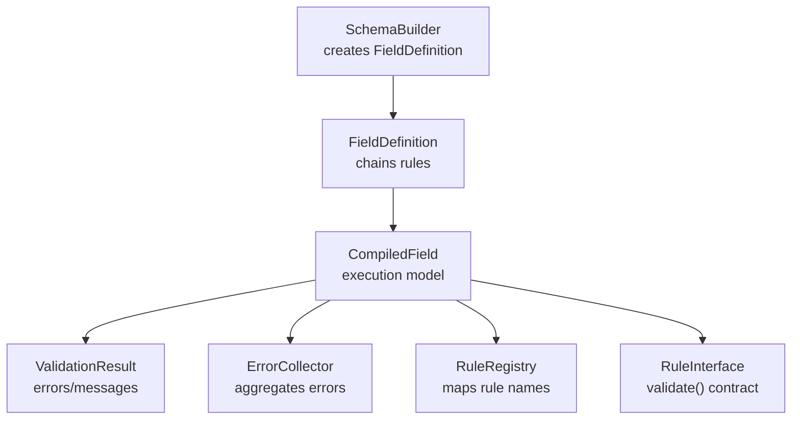
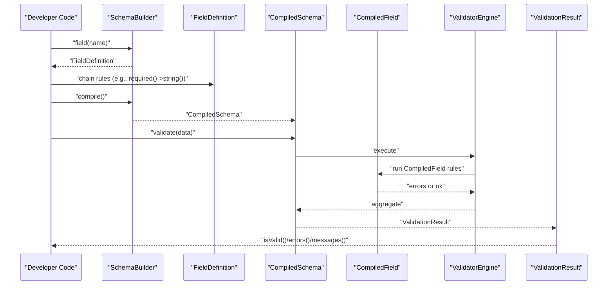
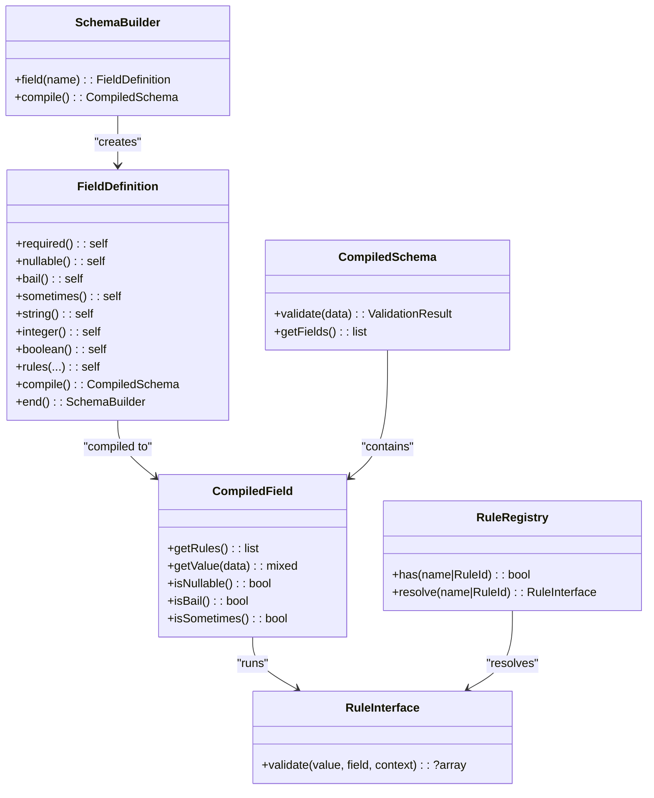

# Basic Field Definition

<cite>
**Referenced Files in This Document**
- [SchemaBuilder.php](file://src/Schema/SchemaBuilder.php)
- [FieldDefinition.php](file://src/Schema/FieldDefinition.php)
- [RuleInterface.php](file://src/Rules/RuleInterface.php)
- [RuleRegistry.php](file://src/Rules/RuleRegistry.php)
- [StringTypeRule.php](file://src/Rules/StringTypeRule.php)
- [IntegerTypeRule.php](file://src/Rules/IntegerTypeRule.php)
- [BooleanRule.php](file://src/Rules/BooleanRule.php)
- [CompiledSchema.php](file://src/Execution/CompiledSchema.php)
- [CompiledField.php](file://src/Execution/CompiledField.php)
- [ErrorCollector.php](file://src/Execution/ErrorCollector.php)
- [ValidationResult.php](file://src/Execution/ValidationResult.php)
- [README.md](file://README.md)
- [ValidatorTest.php](file://tests/Unit/ValidatorTest.php)
- [RuleExpansionTest.php](file://tests/Unit/RuleExpansionTest.php)
</cite>

## Table of Contents
1. [Introduction](#introduction)
2. [Project Structure](#project-structure)
3. [Core Components](#core-components)
4. [Architecture Overview](#architecture-overview)
5. [Detailed Component Analysis](#detailed-component-analysis)
6. [Dependency Analysis](#dependency-analysis)
7. [Performance Considerations](#performance-considerations)
8. [Troubleshooting Guide](#troubleshooting-guide)
9. [Conclusion](#conclusion)

## Introduction
This document explains how to define basic fields in the vi/validation schema using the fluent SchemaBuilder and FieldDefinition APIs. It covers:
- Creating fields with SchemaBuilder::field()
- Naming conventions and dot-notation for nested fields
- Applying basic rules for strings, integers, and booleans
- Chaining patterns and rule ordering importance
- Existence checks, nullability, bail short-circuiting, and sometimes behavior
- Error collection and retrieval
- Best practices and common pitfalls

## Project Structure
The schema definition lives in the Schema namespace and compiles into an execution-ready form. The execution layer validates data against compiled fields and collects errors.

**Diagram sources**
- [SchemaBuilder.php](file://src/Schema/SchemaBuilder.php#L14-L21)
- [FieldDefinition.php](file://src/Schema/FieldDefinition.php#L18-L22)
- [CompiledField.php](file://src/Execution/CompiledField.php#L115-L118)
- [ValidationResult.php](file://src/Execution/ValidationResult.php#L67-L96)
- [ErrorCollector.php](file://src/Execution/ErrorCollector.php#L17-L25)
- [RuleRegistry.php](file://src/Rules/RuleRegistry.php#L133-L190)
- [RuleInterface.php](file://src/Rules/RuleInterface.php#L11-L14)

**Section sources**
- [SchemaBuilder.php](file://src/Schema/SchemaBuilder.php#L14-L21)
- [FieldDefinition.php](file://src/Schema/FieldDefinition.php#L18-L22)
- [CompiledSchema.php](file://src/Execution/CompiledSchema.php#L27-L36)
- [CompiledField.php](file://src/Execution/CompiledField.php#L115-L118)
- [ValidationResult.php](file://src/Execution/ValidationResult.php#L67-L96)
- [ErrorCollector.php](file://src/Execution/ErrorCollector.php#L17-L25)
- [RuleRegistry.php](file://src/Rules/RuleRegistry.php#L133-L190)
- [RuleInterface.php](file://src/Rules/RuleInterface.php#L11-L14)

## Core Components
- SchemaBuilder: Entry point to define fields and compile the schema.
- FieldDefinition: Fluent builder for per-field rules and behaviors.
- CompiledSchema and CompiledField: Compiled representation used at runtime.
- RuleInterface and RuleRegistry: Contract for rules and registry mapping.
- ValidationResult and ErrorCollector: Error aggregation and message formatting.

**Section sources**
- [SchemaBuilder.php](file://src/Schema/SchemaBuilder.php#L14-L34)
- [FieldDefinition.php](file://src/Schema/FieldDefinition.php#L18-L657)
- [CompiledSchema.php](file://src/Execution/CompiledSchema.php#L27-L66)
- [CompiledField.php](file://src/Execution/CompiledField.php#L115-L176)
- [RuleInterface.php](file://src/Rules/RuleInterface.php#L11-L14)
- [RuleRegistry.php](file://src/Rules/RuleRegistry.php#L133-L190)
- [ValidationResult.php](file://src/Execution/ValidationResult.php#L67-L141)
- [ErrorCollector.php](file://src/Execution/ErrorCollector.php#L17-L50)

## Architecture Overview
The schema definition flow:
1. Build fields with SchemaBuilder::field(name)
2. Chain rules on FieldDefinition
3. Compile to CompiledSchema
4. Validate data via CompiledSchema::validate(data)
5. Collect errors and format messages

**Diagram sources**
- [SchemaBuilder.php](file://src/Schema/SchemaBuilder.php#L14-L34)
- [FieldDefinition.php](file://src/Schema/FieldDefinition.php#L24-L657)
- [CompiledSchema.php](file://src/Execution/CompiledSchema.php#L59-L66)
- [CompiledField.php](file://src/Execution/CompiledField.php#L115-L176)
- [ValidationResult.php](file://src/Execution/ValidationResult.php#L59-L141)

## Detailed Component Analysis

### Field Creation with SchemaBuilder::field()
- Use SchemaBuilder::field(name) to create or reuse a FieldDefinition.
- The builder caches fields by name and returns the same instance on subsequent calls with the same name.
- After defining rules, end the field with end() to return to the builder, or compile() to finalize the schema.

Practical example references:
- [README.md](file://README.md#L38-L51)
- [README.md](file://README.md#L117-L124)

**Section sources**
- [SchemaBuilder.php](file://src/Schema/SchemaBuilder.php#L14-L21)
- [FieldDefinition.php](file://src/Schema/FieldDefinition.php#L640-L656)
- [README.md](file://README.md#L38-L51)
- [README.md](file://README.md#L117-L124)

### Field Naming Conventions and Dot Notation
- Use plain names for top-level fields (e.g., "email").
- Use dot notation for nested fields up to two levels (e.g., "user.name", "user.email").
- CompiledField detects nesting and extracts parent/child segments.

References:
- [README.md](file://README.md#L163-L183)
- [CompiledField.php](file://src/Execution/CompiledField.php#L33-L38)
- [CompiledField.php](file://src/Execution/CompiledField.php#L163-L175)

**Section sources**
- [README.md](file://README.md#L163-L183)
- [CompiledField.php](file://src/Execution/CompiledField.php#L33-L38)
- [CompiledField.php](file://src/Execution/CompiledField.php#L163-L175)

### Basic Rule Application Syntax
- Chain rule methods on FieldDefinition to constrain values.
- Common type rules: string(), integer(), boolean().
- Existence and presence: required(), sometimes(), present(), filled().
- Nullability: nullable() allows null and short-circuits other rules when null.
- Bail short-circuit: bail() stops rule evaluation upon first failure.

Examples in docs:
- [README.md](file://README.md#L185-L204)
- [README.md](file://README.md#L109-L124)

**Section sources**
- [FieldDefinition.php](file://src/Schema/FieldDefinition.php#L24-L91)
- [CompiledField.php](file://src/Execution/CompiledField.php#L133-L146)
- [CompiledField.php](file://src/Execution/CompiledField.php#L94-L113)
- [README.md](file://README.md#L185-L204)
- [README.md](file://README.md#L109-L124)

### Simple Field Definitions for Common Data Types
- Strings: field(name)->required()->string()
- Integers: field(name)->required()->integer()
- Booleans: field(name)->required()->boolean()

References:
- [README.md](file://README.md#L109-L124)
- [StringTypeRule.php](file://src/Rules/StringTypeRule.php#L12-L23)
- [IntegerTypeRule.php](file://src/Rules/IntegerTypeRule.php#L12-L29)
- [BooleanRule.php](file://src/Rules/BooleanRule.php#L14-L25)

**Section sources**
- [README.md](file://README.md#L109-L124)
- [StringTypeRule.php](file://src/Rules/StringTypeRule.php#L12-L23)
- [IntegerTypeRule.php](file://src/Rules/IntegerTypeRule.php#L12-L29)
- [BooleanRule.php](file://src/Rules/BooleanRule.php#L14-L25)

### Field Existence Checking and Presence Semantics
- required(): Enforces presence and non-empty values.
- sometimes(): Evaluates rules only when the field is present.
- present(): Field must be present (can be empty).
- filled(): Field must be present and non-empty.

References:
- [FieldDefinition.php](file://src/Schema/FieldDefinition.php#L24-L46)
- [FieldDefinition.php](file://src/Schema/FieldDefinition.php#L502-L512)
- [CompiledField.php](file://src/Execution/CompiledField.php#L78-L79)

**Section sources**
- [FieldDefinition.php](file://src/Schema/FieldDefinition.php#L24-L46)
- [FieldDefinition.php](file://src/Schema/FieldDefinition.php#L502-L512)
- [CompiledField.php](file://src/Execution/CompiledField.php#L78-L79)

### Nullability and Bail Short-Circuiting
- nullable(): Allows null; when the value is null, other rules are skipped.
- bail(): Stops rule evaluation after the first failure.

References:
- [FieldDefinition.php](file://src/Schema/FieldDefinition.php#L30-L40)
- [FieldDefinition.php](file://src/Schema/FieldDefinition.php#L36-L40)
- [CompiledField.php](file://src/Execution/CompiledField.php#L66-L77)
- [CompiledField.php](file://src/Execution/CompiledField.php#L94-L113)

**Section sources**
- [FieldDefinition.php](file://src/Schema/FieldDefinition.php#L30-L40)
- [FieldDefinition.php](file://src/Schema/FieldDefinition.php#L36-L40)
- [CompiledField.php](file://src/Execution/CompiledField.php#L66-L77)
- [CompiledField.php](file://src/Execution/CompiledField.php#L94-L113)

### Rule Ordering Importance and Fast-Fail Behavior
- CompiledField reorders rules to ensure fast-fail semantics:
  - Bail marker first
  - Required marker second
  - Nullable marker third
  - Other rules follow
- This ensures required() errors surface before min()/max() when a field is missing.

References:
- [CompiledField.php](file://src/Execution/CompiledField.php#L94-L113)
- [RuleExpansionTest.php](file://tests/Unit/RuleExpansionTest.php#L132-L146)

**Section sources**
- [CompiledField.php](file://src/Execution/CompiledField.php#L94-L113)
- [RuleExpansionTest.php](file://tests/Unit/RuleExpansionTest.php#L132-L146)

### Basic Error Handling and Message Retrieval
- ValidationResult exposes:
  - isValid(): whether validation passed
  - errors(): raw error arrays with rule names and optional messages
  - messages(): formatted messages resolved via MessageResolver
  - firstMessage(field) and first(): helpers to fetch first errors
- ErrorCollector aggregates errors during execution.

References:
- [ValidationResult.php](file://src/Execution/ValidationResult.php#L59-L141)
- [ErrorCollector.php](file://src/Execution/ErrorCollector.php#L17-L50)

**Section sources**
- [ValidationResult.php](file://src/Execution/ValidationResult.php#L59-L141)
- [ErrorCollector.php](file://src/Execution/ErrorCollector.php#L17-L50)

### Practical Examples from Tests and Docs
- Nested fields and nullable fields:
  - [ValidatorTest.php](file://tests/Unit/ValidatorTest.php#L51-L100)
- Bail and required precedence:
  - [RuleExpansionTest.php](file://tests/Unit/RuleExpansionTest.php#L132-L146)
- General quick start and schema usage:
  - [README.md](file://README.md#L30-L51)
  - [README.md](file://README.md#L109-L124)

**Section sources**
- [ValidatorTest.php](file://tests/Unit/ValidatorTest.php#L51-L100)
- [RuleExpansionTest.php](file://tests/Unit/RuleExpansionTest.php#L132-L146)
- [README.md](file://README.md#L30-L51)
- [README.md](file://README.md#L109-L124)

## Dependency Analysis
FieldDefinition depends on RuleInterface implementations. RuleRegistry resolves rule names and aliases to concrete rule classes. CompiledField consumes the ordered rule list and applies fast-fail logic.

**Diagram sources**
- [SchemaBuilder.php](file://src/Schema/SchemaBuilder.php#L14-L34)
- [FieldDefinition.php](file://src/Schema/FieldDefinition.php#L24-L657)
- [CompiledSchema.php](file://src/Execution/CompiledSchema.php#L27-L66)
- [CompiledField.php](file://src/Execution/CompiledField.php#L115-L176)
- [RuleInterface.php](file://src/Rules/RuleInterface.php#L11-L14)
- [RuleRegistry.php](file://src/Rules/RuleRegistry.php#L133-L190)

**Section sources**
- [SchemaBuilder.php](file://src/Schema/SchemaBuilder.php#L14-L34)
- [FieldDefinition.php](file://src/Schema/FieldDefinition.php#L24-L657)
- [CompiledSchema.php](file://src/Execution/CompiledSchema.php#L27-L66)
- [CompiledField.php](file://src/Execution/CompiledField.php#L115-L176)
- [RuleInterface.php](file://src/Rules/RuleInterface.php#L11-L14)
- [RuleRegistry.php](file://src/Rules/RuleRegistry.php#L133-L190)

## Performance Considerations
- Compile-once, validate-many: Build the schema once and reuse CompiledSchema across many inputs.
- Bail short-circuit reduces unnecessary rule evaluations.
- Nested field access is optimized for up to two levels.

References:
- [README.md](file://README.md#L1-L14)
- [CompiledField.php](file://src/Execution/CompiledField.php#L94-L113)
- [README.md](file://README.md#L161-L183)

[No sources needed since this section provides general guidance]

## Troubleshooting Guide
Common issues and resolutions:
- Missing required field: Expect a “required” error before other rules when using bail ordering.
  - Reference: [CompiledField.php](file://src/Execution/CompiledField.php#L94-L113), [RuleExpansionTest.php](file://tests/Unit/RuleExpansionTest.php#L132-L146)
- Unexpected type errors: Ensure correct type rule is applied (string, integer, boolean).
  - References: [StringTypeRule.php](file://src/Rules/StringTypeRule.php#L12-L23), [IntegerTypeRule.php](file://src/Rules/IntegerTypeRule.php#L12-L29), [BooleanRule.php](file://src/Rules/BooleanRule.php#L14-L25)
- Null values causing downstream failures: Add nullable() to permit null and skip other rules when null.
  - Reference: [FieldDefinition.php](file://src/Schema/FieldDefinition.php#L30-L40), [CompiledField.php](file://src/Execution/CompiledField.php#L66-L77)
- Inspecting raw errors: Use ValidationResult::errors() to see rule names and parameters.
  - Reference: [ValidationResult.php](file://src/Execution/ValidationResult.php#L67-L70)
- Getting formatted messages: Use ValidationResult::messages() for localized messages.
  - Reference: [ValidationResult.php](file://src/Execution/ValidationResult.php#L77-L96)

**Section sources**
- [CompiledField.php](file://src/Execution/CompiledField.php#L94-L113)
- [RuleExpansionTest.php](file://tests/Unit/RuleExpansionTest.php#L132-L146)
- [StringTypeRule.php](file://src/Rules/StringTypeRule.php#L12-L23)
- [IntegerTypeRule.php](file://src/Rules/IntegerTypeRule.php#L12-L29)
- [BooleanRule.php](file://src/Rules/BooleanRule.php#L14-L25)
- [FieldDefinition.php](file://src/Schema/FieldDefinition.php#L30-L40)
- [ValidationResult.php](file://src/Execution/ValidationResult.php#L67-L96)

## Conclusion
To define robust, performant schemas:
- Use SchemaBuilder::field() to create fields and chain rules fluently.
- Prefer explicit type rules (string, integer, boolean) for predictable validation.
- Apply required(), nullable(), sometimes(), and bail() to control evaluation flow.
- Leverage dot notation for nested fields and compile once for repeated validation.
- Inspect ValidationResult::errors() for debugging and ValidationResult::messages() for user-facing feedback.

[No sources needed since this section summarizes without analyzing specific files]